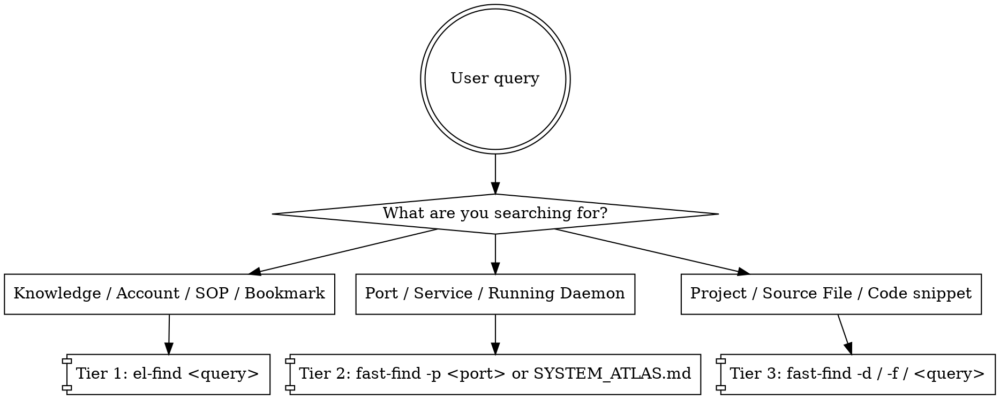

# Machine Search Skill: Fast, Standardized, & Elegant Machine Search

When the user asks you to locate *any* information, project, port, account, credential, configuration, or file on this host machine (`/home/lichao`), follow this structured protocol.

<EXTREMELY-IMPORTANT>
**NEVER execute unpruned blind searches across `/home/lichao`!**
Running `find ~`, `grep -r "..." ~`, or `rg "..." ~` without exclusion arguments will traverse hundreds of thousands of files in `.cache`, `node_modules`, `venv`, `.npm`, and `.agy-accounts`, taking several minutes and locking your turn.

Always use the **3-Tier Search Protocol** and the pre-built CLI tools in `/home/lichao/bin` (`el-find` and `fast-find`).
</EXTREMELY-IMPORTANT>

---

## The 3-Tier Search Protocol



---

### Tier 1: Knowledge Base Search (`el-find`)

Use this first when searching for:
- Accounts, usernames, email addresses (e.g. `smartlijingyangtops`, Cloudflare, Google, HuggingFace).
- Subscriptions, external endpoints, domain names.
- Cheat sheets, dev notes, operational SOPs, API docs.

**Command:**
```bash
el-find <keyword>
el-find -n 10 <keyword>
```

- **Speed:** ~30ms.
- **Mechanism:** Queries Everything Library HTTP API (`http://127.0.0.1:1889/api/items?search=...`, zero-auth loopback permitted). If service is down, automatically queries SQLite FTS5 at `/home/lichao/everything-library/data/cache_index.db`.
- **Output:** Exact match titles, categories, relevance scores, and absolute local markdown paths.

---

### Tier 2: Port & Service Architecture Lookup (`fast-find -p`)

Use this when searching for:
- Which service is listening on port `XXXX`.
- Where a daemon's code/working directory is located.
- System topology and architectural relationships.

**Command:**
```bash
fast-find -p <port>
```

- **Speed:** <10ms.
- **Mechanism:** Queries `ss -tulpn` -> PID -> `/proc/<pid>/cwd` & `/proc/<pid>/cmdline`.
- **Reference Document:** `/home/lichao/SYSTEM_ATLAS.md` (SSOT for all active system ports, services, tunnels, and directory trees).

---

### Tier 3: Fast Machine & Codebase Search (`fast-find`)

Use this when looking for project repositories, code files, or specific strings across `/home/lichao`.

1. **Locate a Project / Repository Directory:**
   ```bash
   fast-find -d <directory_name_pattern>
   # Example: fast-find -d mail-hub
   ```
   *Searches top-level directories in `/home/lichao`, `/home/lichao/tools`, `/home/lichao/projects` (<50ms).*

2. **Locate a File by Name:**
   ```bash
   fast-find -f <filename_pattern>
   # Example: fast-find -f .env
   # Example: fast-find -f docker-compose.yml
   ```
   *Searches files up to depth 5 while strictly pruning black-hole folders (`.cache`, `.npm`, `venv`, `node_modules`, `.agy-accounts`, `.cargo`, etc.) (<200ms).*

3. **Locate Text / Code Across the Machine:**
   ```bash
   fast-find "<text_pattern>"
   fast-find "<text_pattern>" ~/tools
   ```
   *Executes `rg` with all black-hole folders pre-excluded (<500ms).*

---

## Directory Reference Map

| Directory | Purpose | Key Notes |
|---|---|---|
| `/home/lichao/everything-library/` | Central Knowledge Base & Web UI (Port 1889) | Markdown files in `data/items/`. Indexed via FTS5. |
| `/home/lichao/SYSTEM_ATLAS.md` | Single Source of Truth for system architecture | Symlinked to `everything-library/SYSTEM_ATLAS.md`. |
| `/home/lichao/bin/` | Personal executables and search scripts | Included in user `$PATH`. |
| `/home/lichao/tools/` | Standalone services and background tools | e.g. `muse-mcp-hub`, `laya-server`, `agent-mail-hub` (symlinked). |
| `/home/lichao/layered-cognitive-agent/` | LCA core framework & agent workspace | Vendored Cordis architecture. |

---

## Best Practices for Agent Execution

1. **Never guess or recursively crawl from root or `~` without prune.**
2. **If an account or configuration is requested, run `el-find` first.**
3. **If a port is requested, run `fast-find -p <port>` first.**
4. **If a project repository is requested, run `fast-find -d <name>` first.**
5. **Always provide the user with the exact path (`file:///...`) and relevant details concisely.**
