# LCA Framework 架构设计规范（完整实施版）
### Layered Cognitive Agent Framework —— 层级化认知智能体框架

> 本文档完全自包含：不依赖任何外部草稿、前序版本或其他上下文即可独立阅读与实施；文中所有"见第 X 节"均为本文档内部交叉引用；可直接作为团队实施该框架的唯一参考基线。

---

## 0. 文档定位

本规范面向希望从零构建**生产级、可长期演进**的 LLM Agent / Multi-Agent 框架的架构师与工程团队。它回答三个问题：

1. **怎么设计**——一个 Agent 系统应该被拆成哪些层、哪些模块，边界在哪里；
2. **怎么落地**——核心运行时循环、关键协议、数据结构长什么样，并给出一份端到端可运行的参考实现；
3. **怎么活下去**——面对 Prompt 范式演进（ReAct → Plan-Execute → Graph → 多智能体协议化）、面对生态标准（MCP、A2A 等）快速变化，框架如何在不推倒重来的前提下持续扩展。

核心比喻贯穿全文：**单个 Agent 被建模为"一位有个性、有记忆、会思考、能动手的专业人士"；Multi-Agent Team 被建模为"一个汇报关系清晰、职责分明的专业组织"**。开发者搭建应用的体验应该像搭乐高——组合层（L3/L4）积木，而不必关心底层每个齿轮如何咬合。

---

## 1. 设计哲学与核心原则

| 原则 | 说明 |
|---|---|
| **认知优先，工程落地** | 先用人类"感知→思考→行动→反思→记忆"的闭环定义问题空间，再把每一环工程化为可测试的独立组件。 |
| **分层解耦（Separation of Concerns）** | 每一层只依赖下一层暴露的协议（Protocol/Interface），不感知其实现细节；上层升级不应影响下层，下层替换不应影响上层。 |
| **协议优先于实现（Protocol-Oriented）** | Brain、Memory、Tool、Strategy 等一切可替换组件先定义接口协议，再给默认实现；第三方可以只实现协议就接入框架。 |
| **渐进式复杂度（Progressive Disclosure）** | 90% 的场景用 `Agent(...)` 三行代码搞定；剩下 10% 的复杂场景允许直接操作 Runtime、Hook、Strategy 等底层对象。简单的事情要简单，复杂的事情要可能。 |
| **开闭原则（Open-Closed）** | 新增一种记忆类型、一种推理策略、一种团队编排模式，应该是"注册一个新实现"，而不是"修改核心 Loop"。 |
| **可测试性优先** | 每个认知组件（Brain/Body/Memory）都可独立于真实 LLM 和真实工具进行单元测试；提供 Mock LLM 与仿真环境作为一等公民。 |
| **默认可观测（Observability by Default）** | 不需要额外配置，每一次 think/act/reflect 都自动产生结构化 Trace；这不是可选特性，是核心循环的一部分。 |
| **优雅降级（Fail Gracefully）** | 工具失败、LLM 超时、单个子 Agent 崩溃都不应导致整个任务不可恢复；一切关键状态可 Checkpoint、可回放、可人工介入。 |
| **异步原生（Async-First）** | 运行时循环、工具执行、Agent 间通信默认基于异步事件驱动模型设计，同步 API 只是其上的便捷封装，而非核心假设。 |
| **面向互联互通（Interop by Design）** | 框架的 Tool 协议、Agent 间通信协议应能直接对接行业开放标准（而非自造封闭协议），使框架内的 Agent 能与框架外的 Agent/工具协作。 |

---

## 2. 总体分层架构总览

框架自上而下分为 5 层，层与层之间只通过协议通信：

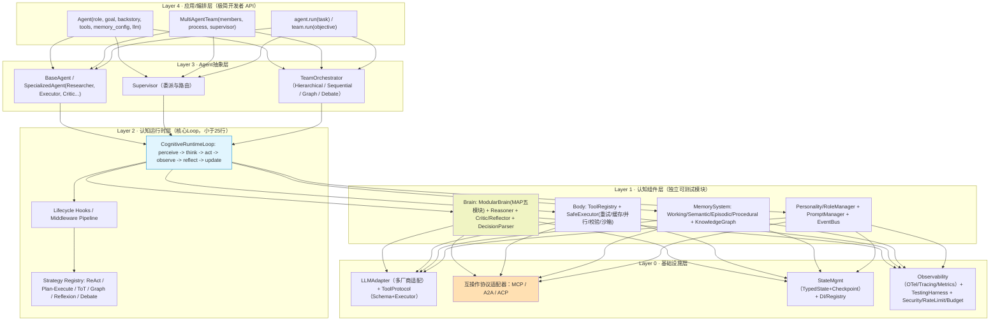

**分层通信铁律**：任意一层只能调用其正下方一层暴露的协议接口；跨层直接调用（如 L4 直接操作 L1 内部对象）在代码评审中视为架构违规。这条铁律是"可维护性"和"新增不改现有代码"的根本保障。

**层间调用契约速查表**：下表把"铁律"落到具体方法名，是快速定位"某个功能应该改哪一层"的索引；每一行对应第 4 节里某层的一个内部链路小节。

| 调用方向 | 发起层 | 目标层 | 典型入口方法 | 详见 |
|---|---|---|---|---|
| L4 → L3 | Agent/MultiAgentTeam | BaseAgent/TeamOrchestrator | `BaseAgent.execute(task)` / `TeamOrchestrator.run(objective)` | 4.4 |
| L3 → L2 | BaseAgent/Supervisor | CognitiveRuntime | `CognitiveRuntime.run(task)` / `.resume(snapshot)` | 4.3 |
| L2 → L1 | CognitiveRuntimeLoop | Brain/Body/Memory | `brain.think()` / `body.act()` / `memory.retrieve()` | 4.2 |
| L1 → L0 | Brain/Body/Memory | LLMAdapter/ToolProtocol/StateMgmt | `llm_adapter.complete()` / `tool.execute()` / `state_store.save()` | 4.1 |
| L3 → L0（跨框架委派） | Supervisor/TeamOrchestrator | AgentTransport | `transport.send_task()` / `.poll_status()` | 4.3、第10节 |

---

## 3. 认知闭环：核心工作流

单个 Agent 每一步"思考-行动"都映射人类完成一项任务时的心智过程：

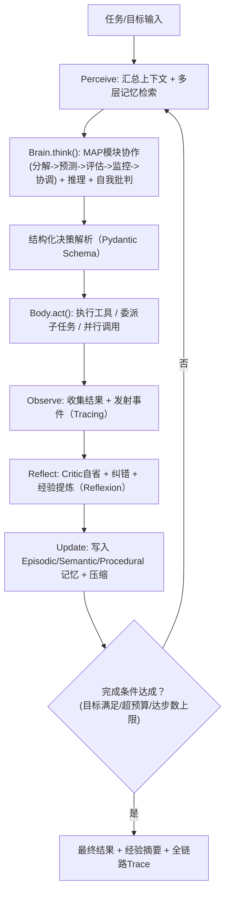

这张图是全框架唯一的"真理来源"：任何新范式（Plan-Execute、Tree of Thought、Graph 编排、多智能体辩论）都只是在这个闭环的某个节点插入不同的策略实现，闭环本身永不改变。本图的逐层展开版时序图见第 4.5 节；每个节点对应的强类型契约见第 5 节；源码级实现见第 6 节与附录 A。

---

## 4. 分层详细设计

### 4.0 Layer 0 · 基础设施层

职责：为上层提供与具体厂商/后端无关的稳定原语。

- **LLMAdapter**：统一多厂商模型调用（Anthropic / OpenAI / 开源模型等），屏蔽 API 差异，支持流式输出、结构化输出（工具调用 / JSON Schema）、Token 计量。
- **ToolProtocol**：工具的统一契约 —— 名称、输入输出 Schema（Pydantic/JSON Schema）、执行器、幂等性声明、超时与重试策略。
- **互操作协议适配器（关键的"面向未来"设计）**：
  - **MCP（Model Context Protocol）适配器**：让本框架的工具、数据源以标准化方式被暴露，也让 Agent 可以直接消费任何第三方 MCP Server 提供的工具，无需为每个工具单独写 Adapter。
  - **A2A（Agent-to-Agent Protocol）适配器**：让本框架内的 Agent 对外发布"Agent Card"（能力声明），使框架外、甚至其他厂商框架构建的 Agent 可以发现并委派任务给本框架内的 Agent，反之亦然；本框架的 Supervisor 路由机制在内部可复用同一套任务生命周期语义（submitted/working/input-required/completed/failed）。
  - **预留 ACP / 私有协议扩展位**：协议适配器本身是插件化的，新协议只需实现统一的 `AgentTransport` 接口即可接入，不影响上层 Team 编排逻辑。
- **StateMgmt**：`TypedState`（强类型、可序列化的状态对象）+ Checkpoint/持久化（借鉴生产级图编排框架的做法，支持长任务的暂停、恢复、Time-travel 调试）。
- **DI/Registry**：依赖注入容器 + 组件注册表，所有可替换实现（Brain Strategy、Memory Layer、Tool、Transport）通过注册表发现，禁止硬编码 `import` 具体实现类。
- **Observability / Security / Budget**：OpenTelemetry 全链路追踪、结构化日志、限流、沙箱执行、成本预算控制（见第 13 节）。

**L0 内部调用链路**

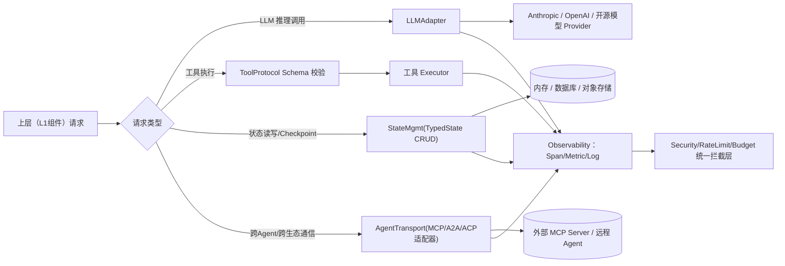

说明：L0 内部四类原语（LLM、Tool、State、Transport）彼此不直接调用，均通过各自独立入口对上层暴露能力，但共享同一条 Observability + Security 拦截链路——任何一次跨越 L0 边界的调用，无论走哪条支路，都会自动产生 Trace Span 并经过限流/预算校验，这是"默认可观测"与"优雅降级"两条设计原则在 L0 的具体落地。附录 A 中 `ConsoleObservability`/`InMemoryStateStore`/`CalculatorTool`/`MockLLMAdapter` 是本节四类原语的最小可运行实现。

### 4.1 Layer 1 · 认知组件层

- **Brain（前额叶类比）**：`ModularBrain`，内部由 MAP 五个协作子模块 + Reasoner + Critic/Reflector + DecisionParser 组成（详见第 8 节）。对外只暴露一个方法：`think(state: TypedState) -> StructuredDecision`，以及 `reflect(state, observation) -> Reflection`。
- **Body（执行器类比）**：`ToolRegistry`（策略模式管理工具集合）+ `SafeExecutor`（重试、缓存、校验、并行、超时、沙箱隔离）。对外暴露：`act(decision, state) -> Observation`。
- **MemorySystem（多层记忆类比）**：Working（当前任务上下文）、Semantic（向量化知识检索）、Episodic（历史事件与结果轨迹）、Procedural（可复用技能/工作流）四类，外加可选 KnowledgeGraph 做结构化关系存储。对外暴露复合方法 `perceive_and_retrieve(state) -> TypedState` 与 `update_multi_level(state, observation, reflection) -> None`（内部对每一层分别调用 `MemoryLayer.retrieve()`/`store()`/`compress()`，见 5.11 节）。
- **Personality/RoleManager + PromptManager + EventBus**：角色设定（`RoleProfile`：backstory、语气、价值取向，见 5.6 节）的一致性维护；Prompt 模板的集中管理与版本化（`PromptManager`，见 5.11 节）；事件总线（`EventBus`，见 5.11 节）驱动跨组件的松耦合通信与可观测性埋点。

**L1 内部调用链路**

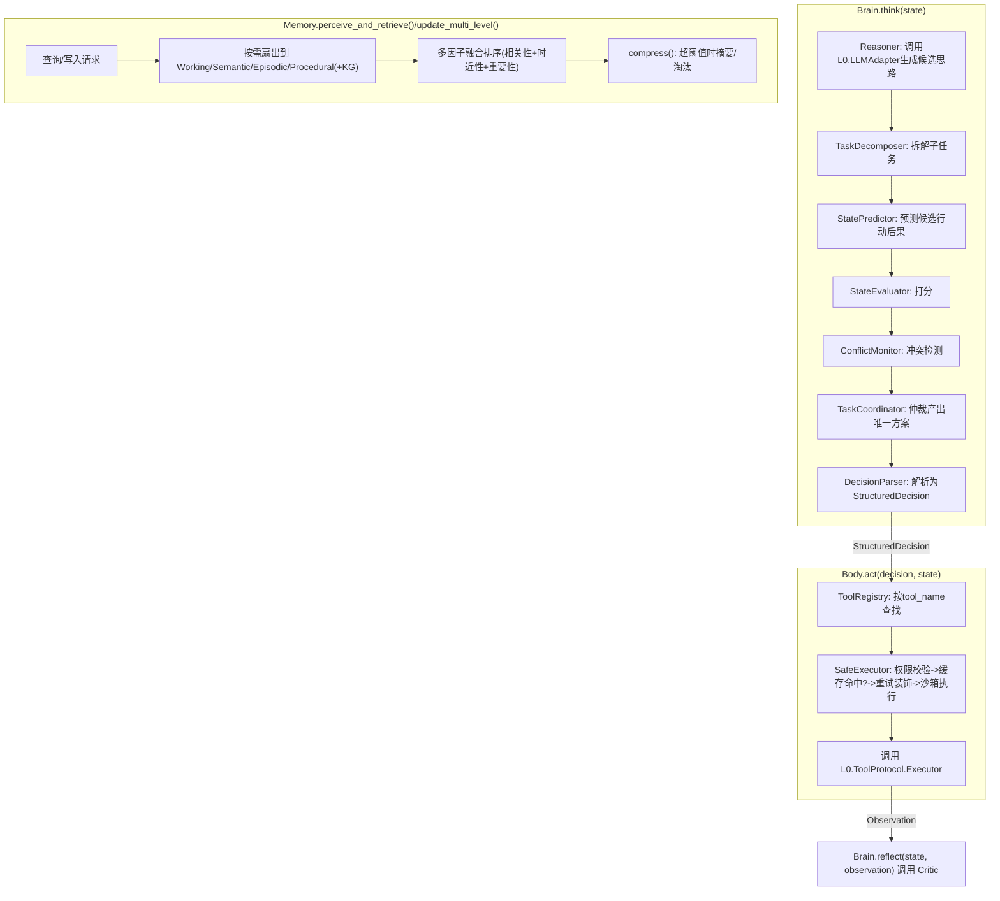

说明：Brain 内部是一条严格的责任链——`Reasoner` 产生候选、MAP 五模块逐层收敛为单一决策、`DecisionParser` 兜底保证输出永远是合法的 `StructuredDecision`（解析失败走内部重试，不向 Runtime 抛异常）；Body 内部则是"查找→安全包裹→执行"的三段式，`SafeExecutor` 是唯一允许直接触达 L0 `ToolProtocol` 的组件，执行前会依次校验 `ToolPermissionManifest`/`CacheConfig`/`RetryPolicy`（见 5.3 节）；Memory 对外只有 `perceive_and_retrieve`/`update_multi_level` 两个复合方法，但内部按 Memory Layer 并行扇出，调用方无需感知具体存了几类记忆。附录 A 的 `ModularBrain`/`SimpleBody`/`SimpleMemorySystem` 是这条内部链路的完整可运行落地。

### 4.2 Layer 2 · 认知运行时层

框架的"心脏"。核心 Loop 保持在 20 行左右，永远不直接写死任何 Prompt 细节、压缩算法或协调逻辑——这些全部通过 **Lifecycle Hooks** 和 **Strategy Registry** 挂载（见第 6、8 节）。这一层是全框架唯一"稳定不变"的部分，其余一切演进都发生在这一层之外。

**L2 内部调用链路**

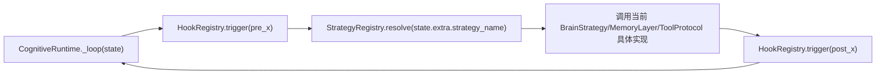

说明：Loop 本体永远不直接 `import` 任何具体 Strategy 或 Memory 实现类，每一步都先经过 `HookRegistry` 再经过 `StrategyRegistry` 两层间接寻址；新增/替换任何 L1 实现只需在注册表里换绑，Loop 代码零改动——这正是第 15 节"开闭原则"承诺在 L2 的字面落地。附录 A 的 `CognitiveRuntime` 类是本节 Loop 结构的可运行版本（为聚焦单 Agent 单问题场景，示例中 Strategy 采用直接注入而非动态注册表查找，注册表接入方式见第 15 节①）。

### 4.3 Layer 3 · Agent抽象层

- **BaseAgent**：持有一个 Runtime 实例 + 一个 Brain + 一个 Body + 一个 Memory 视图；`SpecializedAgent` 在此基础上预置角色（`RoleProfile`）与策略（如 `ResearcherAgent`、`CriticAgent`）。
- **Supervisor**：本质上也是一个 Agent（复用同一套认知闭环），只是它的 Decision 类型里包含 `delegate_to(role, subtask)`，专责任务拆解与路由。
- **TeamOrchestrator**：管理团队的组织形态（Hierarchical / Sequential / Graph / Debate，由 `TeamConfig.process` 声明），负责成员间的通信信道选择（共享 State、EventBus 广播、或点对点 A2A 消息）。

**L3 内部调用链路**

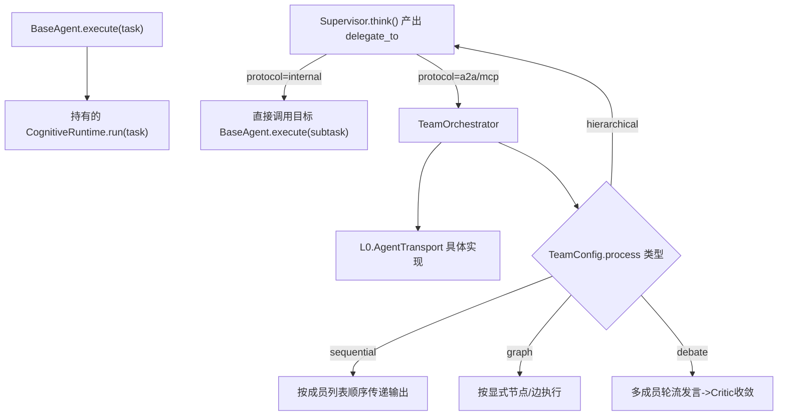

说明：`Supervisor` 本身就是一个 `BaseAgent`（复用同一个 L2 Runtime），它与普通成员唯一的区别是其 `StructuredDecision` 里携带 `delegate_to`（`DelegationSpec`，见 5.4 节）；`TeamOrchestrator` 只做两件事——按 `TeamConfig.process` 类型选择组织形态、按 `DelegationSpec.protocol` 选择通信信道（内部直接调用 vs 走 L0 `AgentTransport`）。附录 A 的示例是单 Agent 场景，不涉及 Supervisor/TeamOrchestrator；多智能体编排的完整链路见第 10 节。

### 4.4 Layer 4 · 应用/编排层

面向最终开发者的极简 API。三行代码创建一个可用 Agent，五行代码组建一个团队。这一层的设计目标只有一个：**让 90% 的常见需求"零心智负担"完成**。

```python
# 单个 Agent —— 三行上手
researcher = Agent(
    role="资深行业研究员",
    goal="产出一份有数据支撑的市场分析",
    backstory="十年一线调研经验，擅长交叉验证信息源",
    tools=[web_search_tool, doc_reader_tool],
)
result = await researcher.run("分析新能源电池行业2026年下半年趋势")

# 团队 —— hierarchical 编排
team = MultiAgentTeam(
    members=[researcher, writer_agent, critic_agent],
    process="hierarchical",
    supervisor=Supervisor(role="项目负责人"),
)
final = await team.run("产出一份可直接对外发布的行业研究报告")
```

**L4 内部调用链路**

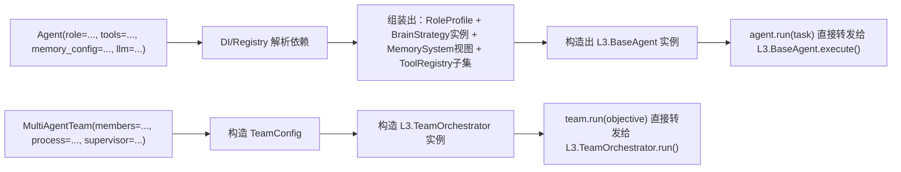

说明：L4 不包含任何业务逻辑，纯粹是"参数收集 + DI 组装 + 转发调用"——这是"渐进式复杂度"原则的关键：开发者在 L4 看到的三行代码，背后是 DI 容器按 `memory_config`/`tools`/`llm` 参数从注册表里查表拼装出完整的 L1-L3 对象图，返回值最终是第 5.10 节定义的 `Result`。附录 A 的 `Agent.__init__` 就是这段"DI 组装"逻辑的可运行版本。

### 4.5 跨层完整调用链路（单步执行时序图）

本节把第 3 节的认知闭环与第 4.0～4.4 节各层内部链路合并为一张端到端时序图，覆盖从开发者调用 `agent.run(task)` 到拿到最终 `Result` 的完整路径，是"主链路流程"与"各层链路"如何拼接的唯一权威参照：

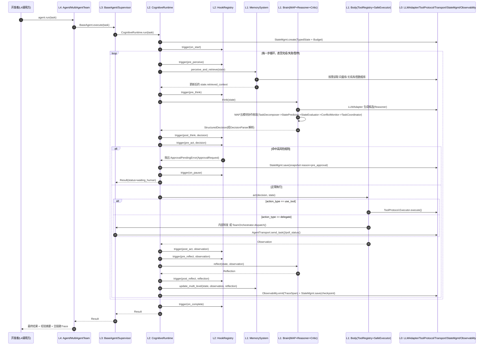

该图与第 6 节 `CognitiveRuntime._loop` 源码逐行对应：图中每一次 `trigger(...)` 都对应源码里的一行 `await self.hooks.trigger(...)`，每一次跨 participant 的箭头都对应一次跨层协议调用——这保证了"文档即实现契约"，而不是脱离代码的示意图。附录 A 提供了本时序图"单 Agent、单一问题、命中一次工具调用"这一具体路径的完整可运行代码与实际执行日志。

---

## 5. 核心数据结构与协议

本节是全框架"契约层"的唯一真理来源：任意两个模块之间的协作都通过这里定义的强类型对象完成，禁止用裸 `dict` 或隐式字符串键值约定跨模块传递数据。所有对象均为 Pydantic 风格伪代码，可直接映射为 Pydantic v2 `BaseModel`；附录 A 给出了对应的、无需额外依赖即可运行的 `dataclass` 落地版本。

### 5.1 设计约定（贯穿本节所有模型）

- **前向兼容位**：每个可能跨版本演进的模型都带 `extra: dict[str, Any] = {}`，配合 `model_config = {"extra": "allow"}`，允许未来新增字段而不破坏旧数据的反序列化，也不需要改动已经上线的下游代码。
- **版本位**：任何会被持久化或跨网络传递的对象都带 `schema_version: str`，供 Checkpoint 恢复、A2A/MCP 跨框架通信时做兼容性判断。
- **可追溯位**：凡是会出现在 Trace/审计日志里的对象都带 `xxx_id` 与 `created_at`，与 `trace_id` 关联，保证"任何一个 Decision/Observation 都能反查是哪次运行、哪一步产生的"。
- **引用优于内联**：跨 Agent、跨网络传递大段上下文时用 `context_refs: list[str]` 引用 Memory/State 中的片段，而不是把全文内联进消息体，避免 State 随任务变长而无限膨胀。

### 5.2 State 与预算控制

```python
class Budget(BaseModel):
    max_tokens: Optional[int] = None
    max_cost_usd: Optional[float] = None
    max_steps: Optional[int] = None
    max_wall_clock_seconds: Optional[int] = None
    used_tokens: int = 0
    used_cost_usd: float = 0.0
    used_steps: int = 0
    started_at: datetime
    extra: dict[str, Any] = {}  # 预留：未来新增计量维度（如工具调用次数上限）

    def exceeded(self) -> bool: ...


class StateSnapshot(BaseModel):
    snapshot_id: str
    step: int
    state_ref: str  # 指向持久化后端的引用（内存Key/DB行/对象存储路径），而非内联整个State
    reason: Literal["periodic", "pre_approval", "manual", "on_error"]
    created_at: datetime


class TypedState(BaseModel):
    schema_version: str = "1.0"
    trace_id: str
    task: str
    working_memory: dict[str, Any] = {}
    retrieved_context: list["MemoryRecord"] = []
    step: int = 0
    budget: Budget  # 见第13节成本治理
    checkpoints: list[StateSnapshot] = []
    status: Literal["running", "paused", "waiting_human", "completed", "failed"] = "running"
    extra: dict[str, Any] = {}  # 预留：业务方自定义字段，无需修改核心Schema即可挂载

    def snapshot(self, reason: str = "periodic") -> StateSnapshot: ...
```

### 5.3 执行配置契约（重试 / 缓存 / 工具权限）

补齐 `SafeExecutor`（第 9 节）与 `RoleProfile`（5.6 节）依赖的三个执行安全配置对象：

```python
class RetryPolicy(BaseModel):
    max_retries: int = 3
    backoff_base_s: float = 1.0
    backoff_multiplier: float = 2.0
    retryable_errors: list[str] = []  # 异常类型名列表；未列出的异常不重试，直接失败


class CacheConfig(BaseModel):
    enabled: bool = True
    ttl_s: int = 300
    key_fields: list[str] = []  # 用哪些入参字段计算缓存Key；为空则对整个arguments做哈希


class ToolPermissionManifest(BaseModel):
    allowed_tools: list[str]
    max_calls_per_task: dict[str, int] = {}  # tool_name -> 单次任务内调用次数上限
    requires_approval: list[str] = []  # 即使在allowed_tools中，调用前仍强制走pre_act审批门
```

`SafeExecutor.execute()` 在真正调用工具前，会依次读取 `ToolPermissionManifest`（是否越权/超频）、`CacheConfig`（是否命中缓存）、`RetryPolicy`（失败后如何退避重试）——三者任一校验未通过都不会把请求下发到 L0 `ToolProtocol.Executor`。

### 5.4 决策与执行

```python
class ToolCall(BaseModel):
    call_id: str
    tool_name: str
    arguments: dict[str, Any]
    idempotency_key: Optional[str] = None
    timeout_s: Optional[int] = None


class DelegationSpec(BaseModel):
    target_role: Optional[str] = None  # 内部委派：按角色路由（如 "researcher"）
    target_agent_id: Optional[str] = None  # 内部委派：按具体Agent实例路由
    target_agent_card: Optional["AgentCard"] = None  # 外部委派：A2A远程Agent的能力名片
    subtask: str
    context_refs: list[str] = []
    deadline: Optional[datetime] = None
    protocol: Literal["internal", "a2a", "mcp"] = (
        "internal"  # 预留位：新增协议只需扩展此Literal并实现对应AgentTransport
    )


class StructuredDecision(BaseModel):
    schema_version: str = "1.0"
    decision_id: str
    action_type: Literal["use_tool", "delegate", "respond", "ask_human", "stop"]
    tool_call: Optional[ToolCall] = None
    delegate_to: Optional[DelegationSpec] = None
    response_text: Optional[str] = None
    rationale: str  # 可解释性：为什么做这个决策
    confidence: float
    created_at: datetime
    extra: dict[str, Any] = {}


class Observation(BaseModel):
    observation_id: str
    tool_call_id: Optional[str] = None
    success: bool
    payload: Any
    error: Optional[str] = None
    retries_used: int = 0
    latency_ms: int
    extra: dict[str, Any] = {}


class Reflection(BaseModel):
    reflection_id: str
    verdict: Literal["on_track", "needs_correction", "blocked"]
    lesson: Optional[str] = None  # 沉淀进 Procedural Memory 的经验
    correction: Optional[StructuredDecision] = None
    extra: dict[str, Any] = {}
```

### 5.5 记忆记录（含程序性技能与知识图谱三元组）

```python
class MemoryRecord(BaseModel):
    record_id: str
    content: str
    memory_type: Literal["working", "semantic", "episodic", "procedural"]
    importance: float
    recency_score: Optional[float] = None
    embedding: Optional[list[float]] = None
    source_trace_id: Optional[str] = None
    ttl: Optional[int] = None  # 秒；None表示永不过期，交由compress()策略统一治理
    metadata: dict[str, Any] = {}


class SkillRecord(BaseModel):
    """Procedural Memory 的专用契约——比通用 MemoryRecord 多出可执行与可度量属性。"""

    skill_id: str
    name: str
    description: str
    trigger_pattern: str  # 何种任务模式应召回此技能（用于检索匹配）
    workflow_ref: str  # 指向具体工作流定义（Prompt模板ID/子图ID/脚本路径）
    success_rate: float = 0.0
    usage_count: int = 0
    last_used_at: Optional[datetime] = None
    extra: dict[str, Any] = {}


class KGTriple(BaseModel):
    """可选 KnowledgeGraph 层的最小存储单元。"""

    triple_id: str
    subject: str
    predicate: str
    object: str
    confidence: float = 1.0
    source_trace_id: Optional[str] = None
    valid_from: Optional[datetime] = None
    valid_until: Optional[datetime] = None  # 支持时序知识失效（如"某负责人已离职"）
```

### 5.6 角色与团队配置契约

`Personality/RoleManager`（4.1节）与 `MultiAgentTeam`（4.4节）依赖的输入契约：

```python
class RoleProfile(BaseModel):
    role: str
    goal: str
    backstory: str
    tone: Optional[str] = None
    values: list[str] = []
    tool_permission_manifest: ToolPermissionManifest
    extra: dict[str, Any] = {}


class TeamConfig(BaseModel):
    process: Literal["hierarchical", "sequential", "graph", "debate"]
    shared_memory_layers: list[Literal["semantic", "procedural"]] = []
    max_rounds: Optional[int] = None  # Debate 场景的最大交锋轮数
    graph_definition_ref: Optional[str] = None  # process="graph" 时指向节点/边定义
```

### 5.7 任务生命周期与跨 Agent 通信（对齐 A2A 语义）

框架内部 Supervisor 委派与跨框架 A2A 委派复用同一套生命周期状态机，使"内部子任务"与"外部远程任务"在语义上无差别：

```python
class TaskStatus(str, Enum):
    SUBMITTED = "submitted"
    WORKING = "working"
    INPUT_REQUIRED = "input-required"  # 对应HITL审批门/需要额外输入
    COMPLETED = "completed"
    FAILED = "failed"
    CANCELED = "canceled"


class AgentCard(BaseModel):
    agent_id: str
    role: str
    capabilities: list[str]
    tools_exposed: list[str] = []
    protocols_supported: list[Literal["internal", "a2a", "mcp"]] = ["internal"]
    endpoint: Optional[str] = None  # 外部Agent的可达地址（A2A场景）
    extra: dict[str, Any] = {}  # 预留：未来协议附加的能力描述字段


class TeamMessage(BaseModel):
    message_id: str
    from_agent_id: str
    to_agent_id: Optional[str] = None  # None 表示广播（走 EventBus）
    task_id: str
    status: TaskStatus
    payload: Any
    created_at: datetime
```

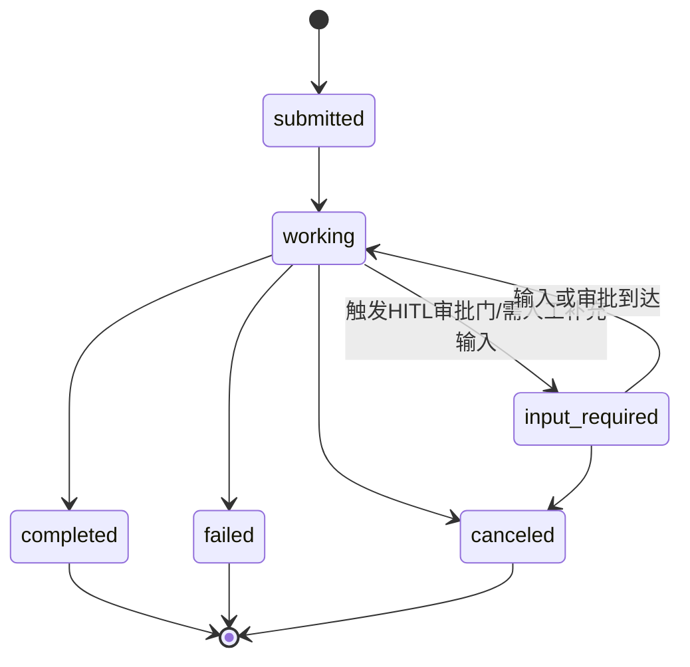

### 5.8 人工审批（HITL）契约

第 6 节 Runtime Loop 与第 11 节审批门逻辑依赖的 `ApprovalPendingError` 携带以下数据结构：

```python
class ApprovalRequest(BaseModel):
    request_id: str
    trace_id: str
    step: int
    risk_reason: str  # 为什么被判定为高风险（如"涉及转账""删除生产数据""对外发布"）
    pending_decision: StructuredDecision
    created_at: datetime
    extra: dict[str, Any] = {}


class ApprovalDecision(BaseModel):
    request_id: str
    approved: bool
    approver: Optional[str] = None
    comment: Optional[str] = None
    decided_at: datetime
```

`pre_act` Hook 检测到高风险 `StructuredDecision` 时构造一个 `ApprovalRequest` 并抛出 `ApprovalPendingError`；外部系统调用 `resume()` 前需先产出对应的 `ApprovalDecision`（`approved=True`）并写回 State，`resume()` 才会真正继续执行而非再次挂起。

### 5.9 可观测性与事件契约

`EventBus`（第 4.1 节 D4）与 `Observability`（第 13 节）依赖的数据契约：

```python
class TraceSpan(BaseModel):
    span_id: str
    trace_id: str
    parent_span_id: Optional[str] = None
    name: str  # 如 "brain.think" / "body.act" / "memory.retrieve"
    started_at: datetime
    ended_at: Optional[datetime] = None
    status: Literal["ok", "error"] = "ok"
    attributes: dict[str, Any] = {}


class Event(BaseModel):
    event_id: str
    event_name: str
    trace_id: str
    payload: Any
    emitted_at: datetime
```

每一次跨越 L0 边界的调用（见 4.0 节内部链路图）都会产生一个 `TraceSpan`；`EventBus.emit()` 产生的每一条消息都是一个 `Event` 实例，`TeamMessage`（5.7 节）可视为 `Event` 在跨 Agent 通信场景下的特化子集。

### 5.10 运行结果与异常契约

`CognitiveRuntime.run()`/`resume()` 的返回类型、以及 Loop 中会抛出的关键异常：

```python
class Result(BaseModel):
    schema_version: str = "1.0"
    trace_id: str
    status: Literal["completed", "failed", "paused", "waiting_human"]
    output: Optional[str] = None
    final_state_ref: str  # 指向最终 TypedState 持久化位置的引用
    lessons: list[str] = []  # 本次运行沉淀的经验摘要，可直接转化为 SkillRecord
    total_steps: int
    budget_used: Budget
    trace_url: Optional[str] = None  # 关联的可观测性平台链接
    error: Optional[str] = None
    extra: dict[str, Any] = {}


class ApprovalPendingError(Exception):
    """pre_act/pre_reflect Hook 判定需人工确认时抛出；Runtime捕获后状态转为 waiting_human。"""

    def __init__(self, approval_request: ApprovalRequest): ...


class BudgetExceededError(Exception):
    """Budget.exceeded() 为真时抛出，触发 on_error Hook 后优雅终止（不再重试）。"""


class ToolExecutionError(Exception):
    """SafeExecutor 按 RetryPolicy 重试耗尽后仍失败时抛出，携带最后一次 Observation。"""


class ProtocolNotSupportedError(Exception):
    """DelegationSpec.protocol 指定的协议未在 transport_registry 中注册时抛出。"""
```

### 5.11 关键协议接口（Protocol 定义）

以下 Protocol 是全框架"开闭原则"的落地方式——任何新实现只需满足接口签名并注册，核心 Loop、Team 编排逻辑不需要感知具体实现。前五个是全框架最基础的核心协议，其后覆盖 Brain 内部协作组件、L1 复合组件与 L1/L2 基础设施组件的显式接口：

```python
class BrainStrategy(Protocol):
    name: str
    version: str

    async def think(self, state: TypedState) -> StructuredDecision: ...
    async def reflect(self, state: TypedState, observation: Observation) -> Reflection: ...


class MemoryLayer(Protocol):
    """单一记忆层（Working/Semantic/Episodic/Procedural/KnowledgeGraph之一）的契约。"""

    layer_name: Literal["working", "semantic", "episodic", "procedural", "knowledge_graph"]

    async def retrieve(
        self, query: str, state: TypedState, top_k: int = 10
    ) -> list[MemoryRecord]: ...
    async def store(self, record: MemoryRecord) -> None: ...
    async def compress(self, records: list[MemoryRecord]) -> list[MemoryRecord]: ...


class ToolProtocol(Protocol):
    name: str
    input_schema: type[BaseModel]
    output_schema: type[BaseModel]
    is_idempotent: bool
    default_timeout_s: int

    async def execute(self, args: BaseModel) -> Observation: ...


class AgentTransport(Protocol):
    protocol_name: str  # "internal" / "a2a" / "mcp" / 未来新协议

    async def discover(self) -> list[AgentCard]: ...
    async def send_task(
        self, target: AgentCard, task: str, context_refs: list[str]
    ) -> str: ...  # 返回 task_id
    async def poll_status(self, task_id: str) -> TaskStatus: ...
    async def receive_result(self, task_id: str) -> Observation: ...
    async def cancel(self, task_id: str) -> None: ...


class Hook(Protocol):
    async def __call__(self, event_name: str, state: TypedState, **kwargs: Any) -> None: ...


# —— Brain 内部协作组件的显式契约 ——


class Reasoner(Protocol):
    """负责调用 L0.LLMAdapter 生成候选思路，是 Brain 中唯一直接触达 LLM 的组件。"""

    async def generate_candidates(self, state: TypedState, n: int = 1) -> list[str]: ...


class Critic(Protocol):
    """负责事后自省与纠偏，被 BrainStrategy.reflect() 内部调用。"""

    async def critique(self, state: TypedState, observation: Observation) -> Reflection: ...


class DecisionParser(Protocol):
    """将 Reasoner 的自由文本输出稳健解析为强类型 Decision；解析失败应内部重试而非抛异常穿透到 Loop。"""

    def parse(self, raw_output: str, state: TypedState) -> StructuredDecision: ...


class TaskDecomposer(Protocol):
    async def decompose(self, state: TypedState) -> list[str]: ...


class StatePredictor(Protocol):
    async def predict(self, state: TypedState, candidate_action: str) -> dict[str, Any]: ...


class StateEvaluator(Protocol):
    async def score(self, state: TypedState, predicted_state: dict[str, Any]) -> float: ...


class ConflictMonitor(Protocol):
    async def check(self, state: TypedState, candidates: list[StructuredDecision]) -> list[str]: ...


class TaskCoordinator(Protocol):
    async def arbitrate(
        self,
        state: TypedState,
        candidates: list[StructuredDecision],
        scores: list[float],
    ) -> StructuredDecision: ...


# —— L1 复合组件契约：Runtime 只依赖这两个复合接口，不感知内部子模块 ——


class Body(Protocol):
    """Body 对 L2 暴露的唯一入口，内部封装 ToolRegistry + SafeExecutor 的完整调用链路（见4.1节）。"""

    async def act(self, decision: StructuredDecision, state: TypedState) -> Observation: ...


class MemorySystem(Protocol):
    """MemorySystem 对 L2 暴露的复合入口，内部按需扇出到具体 MemoryLayer 实现（见4.1节）。"""

    async def perceive_and_retrieve(self, state: TypedState) -> TypedState: ...
    async def update_multi_level(
        self, state: TypedState, observation: Observation, reflection: Reflection
    ) -> None: ...


# —— L1/L2 基础设施组件的显式契约 ——


class EventBus(Protocol):
    def emit(self, event_name: str, payload: Any, trace_id: str) -> None: ...
    def subscribe(self, event_name: str, handler: Callable[[Event], Awaitable[None]]) -> None: ...


class PromptManager(Protocol):
    def render(self, template_name: str, variables: dict[str, Any]) -> str: ...
    def register_template(self, name: str, template: str, version: str = "1.0") -> None: ...


class ToolRegistry(Protocol):
    def register(self, tool: ToolProtocol) -> None: ...
    def get(self, name: str) -> Optional[ToolProtocol]: ...
    def list_allowed(self, manifest: ToolPermissionManifest) -> list[ToolProtocol]: ...


class SafeExecutorProtocol(Protocol):
    async def execute(
        self,
        tool: ToolProtocol,
        args: BaseModel,
        retry_policy: RetryPolicy,
        cache_config: CacheConfig,
    ) -> Observation: ...


class StateStore(Protocol):
    async def save(self, state: TypedState) -> str: ...  # 返回 state_ref
    async def load(self, state_ref: str) -> TypedState: ...


class HookRegistry(Protocol):
    def register(self, event_name: str, hook: Hook) -> None: ...
    async def trigger(self, event_name: str, state: TypedState, **kwargs: Any) -> Any: ...
```

### 5.12 扩展点索引表

| 扩展点 | 对应 Protocol | 注册位置 | 详细步骤 |
|---|---|---|---|
| 新增 Brain 推理策略 | `BrainStrategy` | `strategy_registry.register(name, impl)` | 见第15节① |
| 新增记忆层 | `MemoryLayer` | `memory_system.register_layer(name, impl)` | 见第15节② |
| 新增工具 | `ToolProtocol` | `tool_registry.register(impl)` | 见第15节③ |
| 新增互操作协议 | `AgentTransport` | `transport_registry.register(name, impl)` | 见第15节④ |
| 新增生命周期钩子 | `Hook` | `hooks.register(event_name, impl)` | 见第6节生命周期钩子清单 |
| 替换/新增候选生成器 | `Reasoner` | 在自定义 `BrainStrategy` 构造时注入 | 见5.11节 |
| 替换/新增自省逻辑 | `Critic` | 在自定义 `BrainStrategy` 构造时注入 | 见5.11节 |
| 替换 MAP 单个子模块 | `TaskDecomposer`/`StatePredictor`/`StateEvaluator`/`ConflictMonitor`/`TaskCoordinator` | 构造 `ModularBrain(modules=[...])` 时按需替换单个子模块 | 见第8节MAP协作子模块 |
| 替换 Body/MemorySystem 整体实现 | `Body`/`MemorySystem` | DI容器绑定新实现，`CognitiveRuntime` 构造时注入 | 见5.11节 |
| 新增/管理 Prompt 模板 | `PromptManager` | `prompt_manager.register_template(name, template)` | 见第4.1节D4 |
| 新增 Checkpoint 后端 | `StateStore` | DI容器绑定新实现 | 见第11节 |

所有跨层传递的对象都是本节强类型契约的实例——这是"可维护性"的另一根支柱：任何两个模块之间的协作都有编译期/校验期可查的契约，而不是靠隐式字符串约定。附录 A 给出了本节全部契约与协议对应的、经过实际运行验证的 Python 参考实现。

---

## 6. Runtime Loop 参考实现

```python
class CognitiveRuntime:
    def __init__(
        self,
        brain: BrainStrategy,
        body: Body,
        memory: MemorySystem,
        hooks: HookRegistry,
        event_bus: EventBus,
        state_store: StateStore,
    ):
        self.brain, self.body, self.memory = brain, body, memory
        self.hooks, self.event_bus, self.state_store = hooks, event_bus, state_store

    async def run(self, task: str, max_steps: int = 50) -> Result:
        state = TypedState(
            trace_id=new_trace_id(),
            task=task,
            budget=self.default_budget(),
        )
        await self.hooks.trigger("on_start", state)
        return await self._loop(state, max_steps)

    async def resume(self, snapshot: StateSnapshot, max_steps: int = 50) -> Result:
        """从任意 Checkpoint 恢复——挂起等待人工审批/暂停的任务由此续跑。"""
        state = await self.state_store.load(snapshot.state_ref)
        state.status = "running"
        return await self._loop(state, max_steps)

    async def _loop(self, state: TypedState, max_steps: int) -> Result:
        for step in range(state.step, max_steps):
            state.step = step
            try:
                await self.hooks.trigger("pre_perceive", state)
                state = await self.memory.perceive_and_retrieve(state)

                await self.hooks.trigger("pre_think", state)
                decision = await self.brain.think(state)
                await self.hooks.trigger("post_think", state, decision)

                await self.hooks.trigger("pre_act", state, decision)  # 审批门/权限校验挂在此处
                observation = await self.body.act(decision, state)
                await self.hooks.trigger("post_act", state, observation)

                await self.hooks.trigger("pre_reflect", state, observation)
                reflection = await self.brain.reflect(state, observation)
                await self.hooks.trigger("post_reflect", state, reflection)

                await self.memory.update_multi_level(state, observation, reflection)

            except ApprovalPendingError:
                # HITL 审批门：挂起并落盘 Checkpoint，等待外部信号后经 resume() 续跑
                state.status = "waiting_human"
                state.checkpoints.append(state.snapshot(reason="pre_approval"))
                await self.hooks.trigger("on_pause", state)
                return self.summarize(state)

            except Exception as err:
                handled = await self.hooks.trigger("on_error", state, err)  # 降级/重试策略挂在此处
                if not handled:
                    state.status = "failed"
                    state.checkpoints.append(state.snapshot(reason="on_error"))
                    break
                continue

            state.checkpoints.append(state.snapshot())
            self.event_bus.emit("step_completed", state.trace_id)

            if state.budget.exceeded():
                await self.hooks.trigger("on_error", state, BudgetExceededError())
                state.status = "failed"
                break

            if self._should_stop(state, decision, reflection):
                state.status = "completed"
                break

        await self.hooks.trigger("on_complete", state)
        return self.summarize(state)
```

所有 Prompt 模板、压缩策略、Strategy 切换、错误恢复、人工审批全部通过 Hook 与 Strategy 注册进来，Loop 本体保持稳定不变。`_loop` 与 `resume` 共用同一段逻辑，是"暂停/恢复/Time-travel"（见第11节）在代码层面的直接落地：外部只需持有一个 `StateSnapshot` 引用，就能在任意时刻续跑，不需要重放前面的步骤。

`summarize(state) -> Result` 返回值的完整字段定义见 5.10 节；`ApprovalPendingError` 内部携带的 `ApprovalRequest` 结构见 5.8 节；本函数每一行 `hooks.trigger(...)` 与跨层调用，在第 4.5 节均有对应的时序图节点；附录 A 的 `CognitiveRuntime` 是本段伪代码的完整可运行落地（`brain`/`body`/`memory` 参数类型分别对应 5.11 节 `BrainStrategy`/`Body`/`MemorySystem` 协议）。

### 生命周期钩子清单

| Hook 名称 | 触发时机 | 典型用途 |
|---|---|---|
| `on_start` | 任务开始前 | 初始化预算、加载角色 Prompt |
| `pre_perceive` / `post_perceive` | 记忆检索前后 | 上下文裁剪、检索增强 |
| `pre_think` / `post_think` | Brain 推理前后 | 动态切换 Strategy、注入 Few-shot |
| `pre_act` / `post_act` | 工具执行前后 | 权限校验、结果脱敏、速率限制 |
| `pre_reflect` / `post_reflect` | 反思前后 | 触发人工审批（HITL）、经验沉淀 |
| `on_error` | 任意步骤抛出异常 | 降级、重试、告警 |
| `on_complete` | 任务结束 | 生成总结、写入长期记忆、成本结算 |

---

## 7. 记忆系统设计

记忆分类沿用语言智能体认知架构领域广泛采纳的四分法（工作记忆 / 语义记忆 / 情景记忆 / 程序性记忆），并扩展一个可选的知识图谱层：

| 类型 | 类比 | 存储内容 | 典型后端 | 对应数据契约 |
|---|---|---|---|---|
| Working（工作记忆） | 当前正在想的事 | 当前任务状态、最近几轮交互 | 进程内 / Redis | `MemoryRecord`（5.5节） |
| Semantic（语义记忆） | 你"知道"的事实 | 向量化的领域知识、文档片段 | 向量数据库（Chroma/Pinecone等） | `MemoryRecord` |
| Episodic（情景记忆） | 你"经历"过的事 | 历史任务轨迹、结果与反思 | 关系型数据库（JSONB） | `MemoryRecord` |
| Procedural（程序性记忆） | 你"会做"的事 | 可复用技能、工作流模板 | 图数据库 / Skill Registry | `SkillRecord`（5.5节） |
| KnowledgeGraph（可选） | 事物之间的关系 | 实体—关系—实体三元组 | 图数据库 | `KGTriple`（5.5节） |

**检索策略**应支持多因子融合（相关性 + 时近性 + 重要性加权，而非单一向量相似度），并允许按 Memory Layer 分别配置压缩/摘要策略，避免长任务导致上下文无限膨胀。

**共享 vs 隔离**：Multi-Agent Team 场景下，每个成员默认拥有私有 Working/Episodic 记忆，但可显式声明共享的 Semantic/Procedural 记忆池（团队共同知识库与共同技能库，对应 `TeamConfig.shared_memory_layers`，见5.6节），这一开关在 `TeamOrchestrator` 层配置，而不侵入单 Agent 的 Memory 接口。

---

## 8. Brain 与认知策略

### MAP 协作子模块

`ModularBrain` 内部由五个类脑分工的子模块协作完成一次 `think()`（本文称之为 **MAP：Meta-cognitive Analysis & Planning** 协作机制，灵感来自前额叶皮层的功能分区，五个子模块各司其职、互相校验）。每个子模块都有对应的显式 Protocol 定义（见 5.11 节），可单独替换：

- **TaskDecomposer**（对应 `TaskDecomposer` 协议）：将目标拆解为可执行子任务；
- **StatePredictor**（对应 `StatePredictor` 协议）：预测某个候选行动执行后的状态变化；
- **StateEvaluator**（对应 `StateEvaluator` 协议）：对候选行动/预测结果打分；
- **ConflictMonitor**（对应 `ConflictMonitor` 协议）：检测目标冲突、资源冲突、决策不一致；
- **TaskCoordinator**（对应 `TaskCoordinator` 协议）：在多候选方案间做最终仲裁，产出唯一的 `StructuredDecision`。

Brain 同时持有 `Reasoner`（对应 `Reasoner` 协议，负责调用 LLM 生成候选思路）、`Critic/Reflector`（对应 `Critic` 协议，负责事后自省与纠偏）、`DecisionParser`（对应 `DecisionParser` 协议，将自由文本/工具调用稳健地解析为强类型 `StructuredDecision`，解析失败时触发重试而不是让异常穿透到 Loop）。这五个 MAP 子模块 + Reasoner + Critic + DecisionParser 的内部调用顺序见 4.1 节内部链路图，完整可运行实现见附录 A `ModularBrain`。

### Strategy Registry：主流范式如何"自然涌现"

所有下列范式都不需要修改 Runtime Loop，只需注册不同的 `BrainStrategy` 或 Hook 组合：

| 范式 | 落地方式 |
|---|---|
| **ReAct**（推理+行动交替） | 默认策略：`think()` 内部按"Thought→Action"格式提示模型，逐步循环。附录 A 的示例即为该范式的简化落地。 |
| **Plan-and-Execute** | Brain 切到以 TaskDecomposer+TaskCoordinator 为主导的策略，先产出完整结构化计划，再由 Body 分步执行、Supervisor 监督进度。 |
| **Tree of Thought（ToT）** | 注册新 Strategy：`think()` 一次生成多条候选思路分支，StateEvaluator 打分剪枝，可结合搜索算法（BFS/DFS/beam search）。 |
| **Reflexion（自我反思强化）** | `post_act`/`pre_reflect` Hook 中调用 Critic 生成语言化反馈，写入 Episodic Memory，下一轮 `pre_think` 时作为上下文注入，形成无需梯度更新的"学习"。 |
| **Graph-based 编排** | Runtime 切换为图执行器（节点=认知步骤，边=条件转移），对上层仍暴露同一个 `run()`；MAP 五模块内部协作本身也可以看作一张小型内部图。 |
| **多智能体辩论 / 群聊协作** | 多个 SpecializedAgent 通过 EventBus 或共享 State 交替发言，Critic 角色天然承担"反方"职责，Supervisor 决定何时终止辩论并收敛结论。 |

---

## 9. Body 与工具执行层

- **ToolProtocol**：每个工具声明输入/输出 Schema、是否幂等、预期延迟、失败语义（完整定义见 5.11 节）。
- **SafeExecutor**：统一包裹所有工具调用（对应 `SafeExecutorProtocol`，见 5.11 节），提供
  - 重试（指数退避，配置见 `RetryPolicy`，5.3节）与超时熔断；
  - 结果缓存（对幂等、高成本调用尤其关键，配置见 `CacheConfig`，5.3节）；
  - 并行执行（多个独立工具调用可并发发起）；
  - 输入/输出校验（Schema 校验失败直接拒绝执行，而不是把脏数据传给下一环）；
  - **沙箱隔离**：任何代码执行类工具（代码解释器、Shell）默认在隔离的执行环境中运行，网络与文件系统访问受最小权限原则约束；
  - **工具权限清单（`ToolPermissionManifest`，见 5.3 节）**：每个 Agent 角色（`RoleProfile`，见5.6节）可声明其被允许调用的工具子集与调用频次上限，越权调用在 `pre_act` Hook 阶段即被拦截，而不是依赖工具自身做权限判断。

SafeExecutor 内部的完整校验顺序（权限 → 缓存 → 重试 → 沙箱执行）见 4.1 节 L1 内部调用链路图，附录 A 的 `SimpleSafeExecutor`/`CalculatorTool` 是该顺序的可运行实现（`CalculatorTool` 用 AST 白名单求值代替裸 `eval()`，示范"沙箱隔离"原则的最小落地）。

---

## 10. 多智能体编排

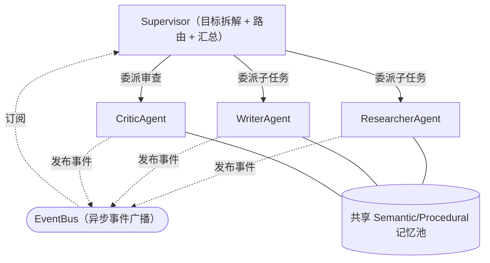

下图展示一次完整的委派链路：Supervisor 先做内部委派（同进程内共享 `TypedState`，走 EventBus 广播），再做一次跨框架外部委派（走 `AgentTransport` 的 A2A 实现，语义上与内部委派完全对齐，仅通信信道不同）：

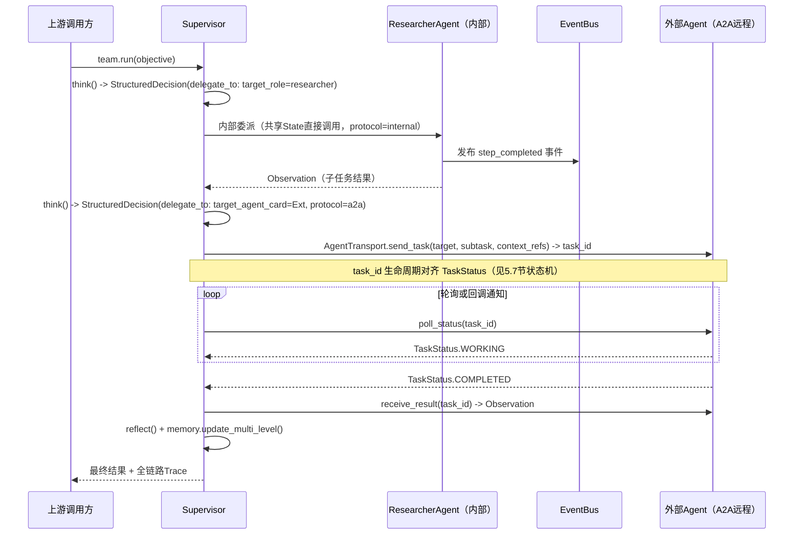

`TeamOrchestrator` 支持四种组织形态（由 `TeamConfig.process` 声明，见5.6节），均复用同一套底层 Runtime（差异只在"谁能对谁下达 Decision"以及通信信道）：

- **Hierarchical**：Supervisor 单向委派、汇总，适合职责边界清晰的场景；
- **Sequential**：任务像流水线一样在成员间顺序传递，上一个的输出是下一个的输入；
- **Graph**：显式定义节点（Agent/工具）与条件边，适合需要精确控制分支、循环、重试的强合规场景；
- **Debate**：多个立场不同的 Agent 对同一问题多轮交锋，Critic/Supervisor 负责收敛。

**跨框架协作**：当团队需要调用不在本框架内运行的外部 Agent（例如另一家厂商用其他框架搭建的 Agent）时，`TeamOrchestrator` 通过 A2A 协议适配器把外部 Agent 当作一个"远程成员"接入，对内部逻辑而言与调用本地 Agent 无感知差异。

---

## 11. 状态持久化、Checkpoint 与 Human-in-the-Loop

- 每一步循环结束都会产出一个不可变 `StateSnapshot`（5.2节）并追加到 `checkpoints`，支持：
  - **暂停/恢复**：长任务可在任意 Checkpoint 处挂起，稍后从同一状态继续；
  - **Time-travel 调试**：开发者可回退到任意历史 Checkpoint 重新执行，定位问题不需要重跑整个任务；
  - **审批门（Approval Gate）**：在 `pre_act` 或 `pre_reflect` Hook 中插入"等待人工确认"逻辑，典型场景是高风险操作（转账、删除生产数据、对外发布内容）执行前必须获得人工放行，Runtime 在该 Checkpoint 处挂起等待外部信号——具体交互契约是构造一个 `ApprovalRequest`、等待外部产出 `ApprovalDecision`（均见5.8节），approved 后才允许 `resume()` 真正继续执行。
- Checkpoint 后端应可插拔（内存 / 数据库 / 对象存储，对应 `StateStore` 协议，见5.11节），大规模生产部署下建议使用支持并发读写与版本化的后端。

---

## 12. 互操作协议层：面向未来的开放生态

Agent 生态已经收敛出两条互补的标准通路，本框架在 Layer 0 原生支持：

- **MCP（Model Context Protocol）**：解决"Agent 如何标准化连接工具与数据源"的问题。本框架的 `ToolProtocol` 与 MCP 的工具描述模型天然对齐——任何符合 MCP 规范的第三方 Server，都可以经由适配器直接注册进 `ToolRegistry`，无需为每个工具单独写胶水代码；反过来，本框架内的工具也可以一键以 MCP Server 形式对外暴露。
- **A2A（Agent-to-Agent Protocol）**：解决"不同厂商、不同框架构建的 Agent 之间如何发现彼此、委派任务"的问题。本框架的每个 `Agent`/`Team` 可发布标准化的能力名片（`AgentCard`，见5.7节），任务生命周期（提交/进行中/需要输入/完成/失败，即 `TaskStatus`）与 A2A 语义直接对齐，使 `Supervisor` 的委派机制既能路由到内部成员，也能透明路由到外部 Agent。
- **协议适配层可插拔**：`AgentTransport` 是一个纯协议接口（见5.11节），MCP/A2A 只是其内置实现；未来出现新的行业标准协议时，只需新增一个 Transport 实现并注册，Team 编排逻辑不受影响。

将互操作性作为 Layer 0 的一等公民，是本框架"灵活支撑未来发展"的核心保障——生态标准仍在快速演进，但只要协议适配层足够薄、足够解耦，框架就不会被任何一个具体标准锁死。

---

## 13. 可观测性、安全与成本治理

- **可观测性**：OpenTelemetry 全链路 Trace（每一次 think/act/reflect 都是一个 `TraceSpan`，见5.9节）、结构化指标（延迟、Token 消耗、工具成功率）、EventBus 驱动的实时事件流（`Event`，见5.9节），可直接对接主流可观测性平台。
- **安全**：
  - 工具执行沙箱隔离 + 最小权限原则；
  - 工具权限清单（`ToolPermissionManifest`，见第 5.3/9 节）防止越权调用；
  - Prompt 注入防御：外部检索到的内容默认标记为"不可信输入"，在 Prompt 组装阶段与系统指令做显式隔离，且不可信内容不能直接触发高风险 Decision（需经审批门，见5.8节）；
  - 完整审计轨迹：每个 Decision 都记录 `rationale`，可追溯"为什么做了这个动作"。
- **成本治理**：`Budget`（5.2节）对象贯穿 `TypedState`，可按 Token 数、金额、步数、墙钟时间多维度设限；超预算触发 `BudgetExceededError`（5.10节）与 `on_error` Hook 并优雅终止而非无限重试。

---

## 14. 测试与仿真框架

- **Mock LLM**：可注入确定性的假响应，使 Brain 的单元测试不依赖真实模型调用，保证 CI 可重复、低成本；附录 A 的 `MockLLMAdapter` 即是一个可直接复用的最小示例。
- **SimulationEnvironment**：为工具、外部 API、时间提供可控 Mock，支持"给定初始状态 + 给定事件序列，断言最终状态"的场景化测试；
- **Golden-Trace 回归测试**：将一次真实运行的完整 Trace（`TraceSpan` 序列，见5.9节）保存为基准（Golden Trace），后续代码变更后重放同样输入，比对关键决策点是否漂移；
- **评测基准接入**：框架预留标准化的 Eval Harness 接口，可对接通用 Agent 能力评测集，用于版本发布前的回归评估。

---

## 15. 扩展机制与插件开发指南

框架的"可扩展性承诺"：新增能力 = 实现一个协议 + 注册一次，绝不修改已有代码。以下给出四类最常见扩展的具体步骤（更完整的扩展点—协议映射见 5.12 节扩展点索引表）。

**① 新增 Brain 策略（例如自定义的 ToT 变体）**
1. 实现 `BrainStrategy` 协议：`async def think(self, state: TypedState) -> StructuredDecision`；
2. 按需组合/替换 MAP 子模块（可注入自定义 `StatePredictor` 等，各子模块协议见5.11节）；
3. `strategy_registry.register("my_tot_variant", MyToTStrategy(modules=[...]))`；
4. 在 `Agent(brain_strategy="my_tot_variant")` 或运行期 Hook 中动态切换。

**② 新增记忆类型（例如情感记忆、长期程序图谱）**
1. 实现 `MemoryLayer` 协议：`retrieve()` / `store()` / `compress()`；
2. `memory_system.register_layer("emotional", EmotionalMemory(backend=...))`；
3. 在检索策略配置中声明该层的融合权重；
4. 上层 `memory_config` 声明启用即可，无需改动 Runtime。

**③ 新增工具**
1. 定义输入/输出 Pydantic Schema；
2. 实现执行函数，声明幂等性、超时、重试策略（`RetryPolicy`/`CacheConfig`，见5.3节）；
3. `tool_registry.register(MyTool())`；
4. 在角色的 `ToolPermissionManifest`（见5.3节）中授权即可使用。附录 A 的 `CalculatorTool` 是该四步流程的完整示范。

**④ 新增互操作协议（例如未来的行业新标准）**
1. 实现 `AgentTransport` 协议：`discover()` / `send_task()` / `receive_result()`；
2. `transport_registry.register("new_protocol", NewProtocolAdapter())`；
3. `TeamOrchestrator` 在委派外部成员时按 Agent Card 声明的协议自动选择对应 Transport。

---

## 16. 与主流框架对标

| 维度 | LangGraph | CrewAI | AutoGen 系（AG2 / Microsoft Agent Framework） | 本框架（LCA） |
|---|---|---|---|---|
| 编排模型 | 显式状态图（节点+条件边），强调可控性 | 角色制团队（Role-based Crew），强调易用性 | 异步事件驱动架构，后继者转向显式 Graph 化 Workflow | 认知闭环（perceive-think-act-reflect）+ 可切换 Strategy，兼具可控性与认知可解释性 |
| 持久化/Checkpoint | 原生支持，强调长任务的暂停恢复与 Time-travel | 相对较弱，审批粒度不如图模型精细 | 强调内置 Checkpoint 与企业级稳定性 | 原生 Checkpoint + Human-in-the-Loop 审批门 |
| 协议互操作 | 缺乏原生协议支持，依赖社区集成 | 原生支持 MCP 与 A2A | 生态正在积极对接 MCP/A2A | Layer 0 原生内置 MCP/A2A 适配层，且协议本身可插拔扩展 |
| 记忆系统 | 依赖上层生态组件 | 内置角色/团队记忆隔离机制 | 持续增强中 | CoALA 四分法记忆 + 可插拔第五类记忆 + 团队级共享/隔离开关 |
| 认知可解释性 | 图结构本身即文档，但"为什么这么决策"需额外埋点 | 角色叙事直观，但深层决策逻辑较隐式 | 依赖对话日志回溯 | 每个 Decision 强制携带 `rationale` 字段，认知过程结构化可追溯 |
| 最适合场景 | 需要精确控制流、强合规审计的生产系统 | 需要快速搭建角色化团队原型 | 研究型多智能体对话、正在向企业级 Workflow 迁移 | 二者兼顾：默认路径简单如 CrewAI，底层能力深如 LangGraph，且原生面向协议互通生态 |

> 补充参考：同期还有 OpenAI Agents SDK、Google ADK、Pydantic AI、Claude Agent SDK 等选项，多数框架都在同步补齐"状态持久化 + 协议互操作 + 可观测性"这三块能力，这正是本框架从设计之初就作为一等公民对待的三个方向。

**本框架核心差异化**：不是用一个新故事替代已有故事，而是把"认知闭环的可解释性"（人类可以理解 Agent 为什么这么想、这么做）和"生产级工程能力"（持久化、可观测、协议互通）同时做到底层设计的第一优先级，而不是事后补丁。

---

## 17. 推荐技术栈

- **核心语言**：Python 3.12+，全面使用 Pydantic v2 定义 State / Decision / Tool Schema；
- **Runtime & 持久化**：自研 CognitiveRuntime + 借鉴生产级图编排框架的 Checkpoint 设计；也可将 Graph Strategy 的执行后端委托给成熟的图编排引擎，框架只需保证协议对齐；
- **LLM 接入**：多厂商统一适配层（自研或借助社区适配库），原生支持结构化输出（工具调用 / JSON Schema）；
- **记忆后端**：Semantic 用向量数据库；Episodic 用支持 JSONB 的关系型数据库；Procedural 用图数据库或 Skill Registry；Working 用内存/Redis；
- **协议层**：内置 MCP Server/Client 适配器、A2A Agent Card 发布与消费适配器；
- **可观测性**：OpenTelemetry + 自定义 EventBus（Redis Pub/Sub 或消息队列）；
- **依赖注入与注册表**：轻量 DI 容器 + 自研 Registry，避免重型框架带来的隐式魔法；
- **测试**：pytest + 自研 SimulationEnvironment（Mock LLM / Mock Tool / 可控时间）；
- **工程质量**：Ruff/Black/MyPy 静态检查、Docker/K8s 生产部署；
- **TypeScript 备选栈**：TypeScript + Zod（结构化校验）+ 对应生态的图编排库 + 向量库，适合需要与前端/Node生态深度集成的团队。

---

## 18. 参考项目目录结构

```
lca_framework/
├── contracts/                 # 第5节所有强类型契约的实现（Pydantic v2 models + Protocols）
│   ├── state.py                # Budget, StateSnapshot, TypedState
│   ├── decision.py              # ToolCall, DelegationSpec, StructuredDecision, Observation, Reflection
│   ├── memory.py                # MemoryRecord, SkillRecord, KGTriple
│   ├── role_team.py             # RoleProfile, TeamConfig, ToolPermissionManifest, RetryPolicy, CacheConfig
│   ├── lifecycle.py             # TaskStatus, AgentCard, TeamMessage
│   ├── approval.py               # ApprovalRequest, ApprovalDecision
│   ├── observability.py          # TraceSpan, Event
│   ├── result.py                 # Result, 异常类型
│   └── protocols.py              # BrainStrategy/MemoryLayer/ToolProtocol/AgentTransport/Body/MemorySystem/Hook等全部Protocol
├── layer0_infra/
│   ├── llm_adapter/
│   ├── tool_protocol/
│   ├── transport/            # MCP / A2A / ACP 适配器
│   ├── state_mgmt/
│   └── observability/
├── layer1_cognitive/
│   ├── brain/
│   │   ├── map_modules/      # TaskDecomposer, StatePredictor, StateEvaluator, ConflictMonitor, TaskCoordinator
│   │   ├── reasoner.py
│   │   └── critic.py
│   ├── body/
│   │   ├── tool_registry.py
│   │   └── safe_executor.py
│   ├── memory/
│   │   ├── working.py / semantic.py / episodic.py / procedural.py
│   │   └── knowledge_graph.py
│   └── personality/
├── layer2_runtime/
│   ├── runtime_loop.py
│   ├── hooks.py
│   └── strategy_registry.py
├── layer3_agent/
│   ├── base_agent.py
│   ├── specialized_agents/
│   ├── supervisor.py
│   └── team_orchestrator.py
├── layer4_app/
│   └── api.py                # Agent(...) / MultiAgentTeam(...) 极简入口
├── tests/
│   ├── simulation_env/
│   └── golden_traces/
└── examples/
    ├── single_agent_qa_demo.py    # 见附录A：单Agent单问题端到端可运行示例
    ├── research_team/
    └── software_dev_team/
```

---

## 19. 关键设计权衡

| 权衡 | 取舍说明 |
|---|---|
| 简单性 vs 灵活性 | Layer 4 用"约定优于配置"换取上手速度；Layer 0-2 用"协议优先"保留深度定制空间。两者不冲突，因为复杂度是分层暴露的。 |
| 集中式 State vs 分布式通信 | 团队内默认走共享 `TypedState` + EventBus（简单、易调试）；跨组织协作场景切换到 A2A 点对点通信（松耦合、可跨厂商）。开发者按场景选择，框架不强推单一模型。 |
| 同步心智模型 vs 异步执行 | 面向开发者的 API 可以是"看起来同步"的 `await run()`，但底层执行、工具调用、Agent 间通信默认异步，为高并发生产场景预留性能空间。 |
| 认知深度 vs 延迟/成本 | MAP 五模块协作会增加单步延迟与 Token 消耗；因此设为可配置——简单任务可用轻量 Strategy（单模块 Reasoner 直出决策），复杂任务再启用完整 MAP 协作。 |
| 内置协议 vs 保持轻量 | 原生集成 MCP/A2A 会增加框架体积；但鉴于二者已是主流云厂商共同支持的事实标准，长期互操作性收益远大于短期体积成本。 |
| 契约完整性 vs 学习成本 | 第5节把配置对象（角色、审批、追踪、结果、异常、复合组件接口）全部升级为显式 Pydantic 契约，短期增加了需要理解的类型数量，但换来"任何模块协作都可编译期校验"的长期可维护性。 |

---

## 20. 演进路线图

1. **v0.1（核心 MVP）**：完成 Layer 0-2；CognitiveRuntime + 四类记忆 + ModularBrain(MAP) + ReAct/Plan-Execute 策略；单元测试覆盖率 >90%。
2. **v0.2（多智能体与生态接入）**：完成 Layer 3-4；Hierarchical/Sequential Team；MCP 工具适配器打通；丰富 Lifecycle Hooks；EventBus 全链路 Trace。
3. **v0.3（生产就绪）**：Checkpoint 持久化、Human-in-the-Loop 审批门、成本预算控制、错误恢复、SimulationEnv、完整 Observability 仪表盘；A2A 适配器打通，支持跨框架委派。
4. **v1.0（发布与生态）**：完整文档与示例库（研究团队、软件开发团队等参考实现）；与主流图编排框架的互操作适配器；社区扩展 Registry；性能与成本基准报告。
5. **长期方向**：多模态记忆（视觉/语音情景记忆）、Procedural Memory 的自主进化（技能自动沉淀与复用）、企业级治理（细粒度权限、合规审计）、对新出现的行业协议标准的持续适配。

---

## 21. 术语表

- **CoALA**：一种被广泛引用的语言智能体记忆分类方式，将记忆划分为工作记忆、语义记忆、情景记忆、程序性记忆四类。
- **MAP**：本框架内 ModularBrain 的五模块协作机制（Meta-cognitive Analysis & Planning），包含 TaskDecomposer、StatePredictor、StateEvaluator、ConflictMonitor、TaskCoordinator。
- **ReAct**：一种"推理-行动"交替进行的 Prompt 范式。
- **Plan-and-Execute**：先产出完整计划、再分步执行的范式。
- **ToT（Tree of Thought）**：以树状分支搜索多条候选推理路径的范式。
- **Reflexion**：通过语言化自我反思实现无需梯度更新的经验学习范式。
- **HITL（Human-in-the-Loop）**：在关键决策点引入人工审批的机制，数据契约见 5.8 节 `ApprovalRequest`/`ApprovalDecision`。
- **DI（Dependency Injection）**：依赖注入，解耦组件的创建与使用。
- **OTel（OpenTelemetry）**：开源的可观测性（Tracing/Metrics/Logging）标准。
- **MCP（Model Context Protocol）**：标准化 Agent 与外部工具/数据源连接方式的协议。
- **A2A（Agent-to-Agent Protocol）**：标准化不同框架/厂商构建的 Agent 之间发现、委派、协作的协议。
- **ACP（Agent Communication Protocol）**：另一类通用 Agent 通信协议，可作为 A2A 的补充或替代传输实现。
- **TraceSpan**：可观测性系统中记录单次跨层调用起止时间与状态的最小单元，见 5.9 节。
- **SkillRecord**：程序性记忆中可执行、可度量的技能记录，见 5.5 节。

---

## 附录 A：端到端可运行参考实现——单 Agent 回答单一问题（L0 → L4 全链路串联）

本附录把第 2～13 节描述的五层架构、第 5 节的全部数据契约、第 6 节的 Runtime Loop，在**一个真实可执行的 Python 文件**里完整串联起来，覆盖"开发者调用 `agent.run(task)` → 拿到 `Result`"的完整路径，与第 4.5 节时序图逐一对应。文件已在标准 Python 3.11+ 环境下实际运行验证通过（见 A.3 节实际执行日志），可直接复制运行，无需任何网络访问或 API Key。

### A.1 实现说明

- **依赖**：仅使用 Python 标准库（`asyncio`/`dataclasses`/`ast`/`json`/`re`/`uuid`/`datetime`），不依赖 pydantic/anthropic 等第三方包，保证在任何环境下开箱即跑；生产环境请按第 5 节把每个 `@dataclass` 替换为对应的 `pydantic.BaseModel`，字段与方法签名保持不变，不影响上层调用方式。
- **场景**：一个通用问答 Agent，装配一个 `calculator` 工具，回答"123 乘以 456 等于多少？"——这是一次典型的 ReAct 式两步循环：第一步识别到需要精确计算并调用工具，第二步在拿到工具结果后直接作答并停止。
- **覆盖范围**：
  - L0：`MockLLMAdapter`（可复用的确定性假 LLM，另附 `AnthropicLLMAdapter` 骨架展示真实厂商适配方式）、`CalculatorTool`（用 AST 白名单求值代替裸 `eval()`，示范沙箱隔离原则）、`InMemoryStateStore`、`ConsoleObservability`；
  - L1：`SimpleReasoner`/`SimpleDecisionParser`/`SimpleCritic` + MAP 五模块（`SimpleTaskDecomposer`/`SimpleStatePredictor`/`SimpleStateEvaluator`/`SimpleConflictMonitor`/`SimpleTaskCoordinator`）组合成的 `ModularBrain`；`SimpleToolRegistry`+`SimpleSafeExecutor`组合成的 `SimpleBody`；`SimpleMemorySystem`；`SimpleEventBus`/`SimplePromptManager`/`SimpleHookRegistry`；
  - L2：`CognitiveRuntime`，逐行对应第 6 节伪代码；
  - L3：`BaseAgent`；
  - L4：`Agent` 门面类，构造函数内完成第 4.4 节描述的全部 DI 组装。
- **可扩展性**：把 `MockLLMAdapter` 换成 `AnthropicLLMAdapter`、把 `CalculatorTool` 换成任意实现 `ToolProtocol` 的新工具、把 `SimpleMemorySystem` 换成向量数据库版实现——上层 `Agent(...)` 调用方式和 `CognitiveRuntime` 代码都不需要改动，这正是第 1 节"开闭原则"与第 15 节扩展机制在本示例里的具体体现。

### A.2 完整源码

```python
"""
LCA Framework —— 单 Agent 回答单一问题：L0 → L4 端到端参考实现
================================================================

本文件是架构文档"核心数据结构与协议"一节（第5节）与"Runtime Loop"一节
（第6节）的可运行落地版本。为保证在任意环境下无需额外依赖即可直接运行，
本参考实现用标准库 dataclasses 替代文档中 Pydantic 风格的契约定义；
生产环境请按第5节把每个 dataclass 替换为对应的 pydantic.BaseModel，
接口方法签名保持不变。

运行方式：
    python3 lca_single_agent_demo.py

层级对照（自下而上，与文档第2节总览图一一对应）：
    L0  基础设施层   —— LLMAdapter / ToolProtocol / StateStore / Observability
    L1  认知组件层   —— Brain(MAP+Reasoner+Critic+DecisionParser) / Body / MemorySystem / EventBus / PromptManager / HookRegistry
    L2  认知运行时层 —— CognitiveRuntime（核心循环）
    L3  Agent抽象层  —— BaseAgent
    L4  应用/编排层  —— Agent(...) 极简入口
"""

from __future__ import annotations

import ast
import asyncio
import json
import operator
import re
import time
import uuid
from dataclasses import dataclass, field
from datetime import datetime, timezone
from typing import Any, Awaitable, Callable, Literal, Optional, Protocol


def now() -> datetime:
    return datetime.now(timezone.utc)


def new_id(prefix: str) -> str:
    return f"{prefix}_{uuid.uuid4().hex[:12]}"


# ============================================================================
# 第5节：核心数据结构（dataclass 版契约；生产环境替换为 pydantic.BaseModel）
# ============================================================================


@dataclass
class Budget:
    max_tokens: Optional[int] = None
    max_cost_usd: Optional[float] = None
    max_steps: Optional[int] = None
    max_wall_clock_seconds: Optional[int] = None
    used_tokens: int = 0
    used_cost_usd: float = 0.0
    used_steps: int = 0
    started_at: datetime = field(default_factory=now)
    extra: dict[str, Any] = field(default_factory=dict)

    def exceeded(self) -> bool:
        if self.max_steps is not None and self.used_steps > self.max_steps:
            return True
        if self.max_wall_clock_seconds is not None:
            elapsed = (now() - self.started_at).total_seconds()
            if elapsed > self.max_wall_clock_seconds:
                return True
        return False


@dataclass
class StateSnapshot:
    snapshot_id: str
    step: int
    state_ref: str
    reason: Literal["periodic", "pre_approval", "manual", "on_error"]
    created_at: datetime = field(default_factory=now)


@dataclass
class MemoryRecord:
    record_id: str
    content: str
    memory_type: Literal["working", "semantic", "episodic", "procedural"]
    importance: float
    recency_score: Optional[float] = None
    source_trace_id: Optional[str] = None
    metadata: dict[str, Any] = field(default_factory=dict)


@dataclass
class TypedState:
    trace_id: str
    task: str
    budget: Budget
    schema_version: str = "1.0"
    working_memory: dict[str, Any] = field(default_factory=dict)
    retrieved_context: list[MemoryRecord] = field(default_factory=list)
    step: int = 0
    checkpoints: list[StateSnapshot] = field(default_factory=list)
    status: Literal["running", "paused", "waiting_human", "completed", "failed"] = "running"
    extra: dict[str, Any] = field(default_factory=dict)

    def snapshot(self, reason: str = "periodic") -> StateSnapshot:
        snap = StateSnapshot(
            snapshot_id=new_id("snap"),
            step=self.step,
            state_ref=f"mem://{self.trace_id}/{self.step}",
            reason=reason,  # type: ignore[arg-type]
        )
        self.checkpoints.append(snap)
        return snap


@dataclass
class RetryPolicy:
    max_retries: int = 3
    backoff_base_s: float = 0.05
    backoff_multiplier: float = 2.0
    retryable_errors: list[str] = field(default_factory=list)


@dataclass
class CacheConfig:
    enabled: bool = True
    ttl_s: int = 300
    key_fields: list[str] = field(default_factory=list)


@dataclass
class ToolPermissionManifest:
    allowed_tools: list[str]
    max_calls_per_task: dict[str, int] = field(default_factory=dict)
    requires_approval: list[str] = field(default_factory=list)


@dataclass
class ToolCall:
    call_id: str
    tool_name: str
    arguments: dict[str, Any]
    idempotency_key: Optional[str] = None
    timeout_s: Optional[int] = None


@dataclass
class DelegationSpec:
    subtask: str
    target_role: Optional[str] = None
    target_agent_id: Optional[str] = None
    context_refs: list[str] = field(default_factory=list)
    protocol: Literal["internal", "a2a", "mcp"] = "internal"


@dataclass
class StructuredDecision:
    decision_id: str
    action_type: Literal["use_tool", "delegate", "respond", "ask_human", "stop"]
    rationale: str
    confidence: float
    tool_call: Optional[ToolCall] = None
    delegate_to: Optional[DelegationSpec] = None
    response_text: Optional[str] = None
    schema_version: str = "1.0"
    created_at: datetime = field(default_factory=now)
    extra: dict[str, Any] = field(default_factory=dict)


@dataclass
class Observation:
    observation_id: str
    success: bool
    payload: Any
    tool_call_id: Optional[str] = None
    error: Optional[str] = None
    retries_used: int = 0
    latency_ms: int = 0
    extra: dict[str, Any] = field(default_factory=dict)


@dataclass
class Reflection:
    reflection_id: str
    verdict: Literal["on_track", "needs_correction", "blocked"]
    lesson: Optional[str] = None
    correction: Optional[StructuredDecision] = None
    extra: dict[str, Any] = field(default_factory=dict)


@dataclass
class RoleProfile:
    role: str
    goal: str
    backstory: str
    tool_permission_manifest: ToolPermissionManifest
    tone: Optional[str] = None
    values: list[str] = field(default_factory=list)
    extra: dict[str, Any] = field(default_factory=dict)


@dataclass
class TraceSpan:
    span_id: str
    trace_id: str
    name: str
    started_at: datetime
    parent_span_id: Optional[str] = None
    ended_at: Optional[datetime] = None
    status: Literal["ok", "error"] = "ok"
    attributes: dict[str, Any] = field(default_factory=dict)


@dataclass
class Result:
    trace_id: str
    status: Literal["completed", "failed", "paused", "waiting_human"]
    final_state_ref: str
    total_steps: int
    budget_used: Budget
    schema_version: str = "1.0"
    output: Optional[str] = None
    lessons: list[str] = field(default_factory=list)
    trace_url: Optional[str] = None
    error: Optional[str] = None
    extra: dict[str, Any] = field(default_factory=dict)


class ApprovalPendingError(Exception):
    def __init__(self, approval_request: Any):
        self.approval_request = approval_request
        super().__init__("waiting for human approval")


class BudgetExceededError(Exception):
    pass


class ToolExecutionError(Exception):
    def __init__(self, message: str, last_observation: Optional[Observation] = None):
        self.last_observation = last_observation
        super().__init__(message)


# ============================================================================
# 第5.11节：关键协议接口（Protocol）—— dataclass 版契约对应的行为契约
# ============================================================================


class LLMAdapter(Protocol):
    async def complete(self, prompt: str, **kwargs: Any) -> str: ...


class ToolProtocol(Protocol):
    name: str
    is_idempotent: bool
    default_timeout_s: int

    async def execute(self, args: dict[str, Any]) -> Observation: ...


class Reasoner(Protocol):
    async def generate_candidates(self, state: TypedState, n: int = 1) -> list[str]: ...


class DecisionParser(Protocol):
    def parse(self, raw_output: str, state: TypedState) -> StructuredDecision: ...


class Critic(Protocol):
    async def critique(self, state: TypedState, observation: Observation) -> Reflection: ...


class TaskDecomposer(Protocol):
    async def decompose(self, state: TypedState) -> list[str]: ...


class StatePredictor(Protocol):
    async def predict(self, state: TypedState, candidate_action: str) -> dict[str, Any]: ...


class StateEvaluator(Protocol):
    async def score(self, state: TypedState, predicted_state: dict[str, Any]) -> float: ...


class ConflictMonitor(Protocol):
    async def check(self, state: TypedState, candidates: list[StructuredDecision]) -> list[str]: ...


class TaskCoordinator(Protocol):
    async def arbitrate(
        self,
        state: TypedState,
        candidates: list[StructuredDecision],
        scores: list[float],
    ) -> StructuredDecision: ...


class BrainStrategy(Protocol):
    async def think(self, state: TypedState) -> StructuredDecision: ...
    async def reflect(self, state: TypedState, observation: Observation) -> Reflection: ...


class Body(Protocol):
    async def act(self, decision: StructuredDecision, state: TypedState) -> Observation: ...


class MemorySystem(Protocol):
    async def perceive_and_retrieve(self, state: TypedState) -> TypedState: ...
    async def update_multi_level(
        self, state: TypedState, observation: Observation, reflection: Reflection
    ) -> None: ...


class EventBus(Protocol):
    def emit(self, event_name: str, payload: Any, trace_id: str) -> None: ...
    def subscribe(self, event_name: str, handler: Callable[[Any], Awaitable[None]]) -> None: ...


class PromptManager(Protocol):
    def render(self, template_name: str, variables: dict[str, Any]) -> str: ...
    def register_template(self, name: str, template: str, version: str = "1.0") -> None: ...


class ToolRegistryP(Protocol):
    def register(self, tool: ToolProtocol) -> None: ...
    def get(self, name: str) -> Optional[ToolProtocol]: ...


class SafeExecutorProtocol(Protocol):
    async def execute(
        self,
        tool: ToolProtocol,
        args: dict[str, Any],
        retry_policy: RetryPolicy,
        cache_config: CacheConfig,
    ) -> Observation: ...


class StateStore(Protocol):
    async def save(self, state: TypedState) -> str: ...
    async def load(self, state_ref: str) -> TypedState: ...


class Hook(Protocol):
    async def __call__(self, event_name: str, state: TypedState, **kwargs: Any) -> None: ...


class HookRegistryP(Protocol):
    def register(self, event_name: str, hook: Hook) -> None: ...
    async def trigger(self, event_name: str, state: TypedState, **kwargs: Any) -> Any: ...


# ============================================================================
# L0 · 基础设施层
# ============================================================================


class MockLLMAdapter:
    """离线可跑的确定性 Mock 实现，用于本示例；接口与真实厂商适配器完全一致。"""

    name = "mock-llm"

    async def complete(self, prompt: str, **kwargs: Any) -> str:
        await asyncio.sleep(0)  # 模拟异步I/O让出事件循环
        if "TOOL_RESULT:" in prompt:
            m = re.search(r"TOOL_RESULT:\s*([^\n]+)", prompt)
            tool_result = m.group(1).strip() if m else "未知"
            question = re.search(r"USER_TASK:\s*([^\n]+)", prompt)
            q = question.group(1).strip() if question else ""
            return json.dumps(
                {
                    "action_type": "respond",
                    "response_text": f"「{q}」的答案是 {tool_result}。",
                    "rationale": "已从工具获得精确计算结果，直接向用户作答，无需进一步调用工具。",
                    "confidence": 0.98,
                },
                ensure_ascii=False,
            )

        expr = self._extract_arithmetic_expression(prompt)
        if expr:
            return json.dumps(
                {
                    "action_type": "use_tool",
                    "tool_name": "calculator",
                    "arguments": {"expression": expr},
                    "rationale": f"用户问题是纯算术计算（{expr}），应调用 calculator 工具求精确值而非直接臆测。",
                    "confidence": 0.95,
                },
                ensure_ascii=False,
            )

        return json.dumps(
            {
                "action_type": "respond",
                "response_text": "这是一个通用问题，暂无可用工具，基于已有知识直接作答。",
                "rationale": "未检测到需要调用工具的模式，直接生成回答。",
                "confidence": 0.6,
            },
            ensure_ascii=False,
        )

    @staticmethod
    def _extract_arithmetic_expression(prompt: str) -> Optional[str]:
        m = re.search(r"USER_TASK:\s*([^\n]+)", prompt)
        if not m:
            return None
        text = m.group(1)
        text = (
            text.replace("乘以", "*").replace("加上", "+").replace("减去", "-").replace("除以", "/")
        )
        text = text.replace("×", "*").replace("÷", "/")
        nums_ops = re.findall(r"[\d.]+|[+\-*/]", text)
        if len(nums_ops) >= 3:
            return "".join(nums_ops)
        return None


class AnthropicLLMAdapter:
    """
    真实厂商适配器示例（需要网络与 API Key，本文件默认不调用）。
    生产环境按此模式接入 Anthropic / OpenAI / 开源模型，对上层暴露的
    接口签名与 MockLLMAdapter 完全一致，Brain 层无需感知差异。
    """

    def __init__(self, model: str = "claude-sonnet-5"):
        self.model = model

    async def complete(self, prompt: str, **kwargs: Any) -> str:
        # from anthropic import AsyncAnthropic
        # client = AsyncAnthropic()
        # resp = await client.messages.create(
        #     model=self.model, max_tokens=1000,
        #     messages=[{"role": "user", "content": prompt}],
        # )
        # return resp.content[0].text
        raise NotImplementedError("示例中未实际联网调用，接口保留以展示L0可替换性")


class CalculatorTool:
    """实现 ToolProtocol 的示例工具：安全求值四则运算表达式（不使用 eval，杜绝任意代码执行）。"""

    name = "calculator"
    is_idempotent = True
    default_timeout_s = 5

    _OPS = {
        ast.Add: operator.add,
        ast.Sub: operator.sub,
        ast.Mult: operator.mul,
        ast.Div: operator.truediv,
        ast.USub: operator.neg,
    }

    async def execute(self, args: dict[str, Any]) -> Observation:
        start = time.monotonic()
        expr = args.get("expression", "")
        try:
            value = self._safe_eval(expr)
            latency_ms = int((time.monotonic() - start) * 1000)
            return Observation(
                observation_id=new_id("obs"),
                success=True,
                payload=value,
                latency_ms=latency_ms,
            )
        except Exception as e:  # noqa: BLE001
            latency_ms = int((time.monotonic() - start) * 1000)
            return Observation(
                observation_id=new_id("obs"),
                success=False,
                payload=None,
                error=str(e),
                latency_ms=latency_ms,
            )

    def _safe_eval(self, expr: str) -> float:
        node = ast.parse(expr, mode="eval").body
        return self._eval_node(node)

    def _eval_node(self, node: ast.AST) -> float:
        if isinstance(node, ast.Constant) and isinstance(node.value, (int, float)):
            return node.value
        if isinstance(node, ast.BinOp) and type(node.op) in self._OPS:
            return self._OPS[type(node.op)](self._eval_node(node.left), self._eval_node(node.right))
        if isinstance(node, ast.UnaryOp) and type(node.op) in self._OPS:
            return self._OPS[type(node.op)](self._eval_node(node.operand))
        raise ValueError(f"不支持的表达式片段: {ast.dump(node)}")


class InMemoryStateStore:
    def __init__(self) -> None:
        self._store: dict[str, TypedState] = {}

    async def save(self, state: TypedState) -> str:
        ref = f"mem://{state.trace_id}/{state.step}"
        self._store[ref] = state
        return ref

    async def load(self, state_ref: str) -> TypedState:
        return self._store[state_ref]


class ConsoleObservability:
    """默认可观测实现：把每个跨层调用输出为结构化 TraceSpan（第5.9节契约）。"""

    def emit_span(self, span: TraceSpan) -> None:
        dur = None
        if span.ended_at:
            dur = int((span.ended_at - span.started_at).total_seconds() * 1000)
        print(
            f"  [TraceSpan] {span.name:<28} status={span.status:<5} dur_ms={dur} attrs={span.attributes}"
        )


# ============================================================================
# L1 · 认知组件层
# ============================================================================


class SimplePromptManager:
    def __init__(self) -> None:
        self._templates: dict[str, str] = {}

    def register_template(self, name: str, template: str, version: str = "1.0") -> None:
        self._templates[name] = template

    def render(self, template_name: str, variables: dict[str, Any]) -> str:
        return self._templates[template_name].format(**variables)


DEFAULT_REACT_TEMPLATE = """\
ROLE: {role}
GOAL: {goal}
BACKSTORY: {backstory}
AVAILABLE_TOOLS: {tools}
USER_TASK: {task}
CONTEXT:
{context}

请以 JSON 输出下一步 StructuredDecision（字段：action_type/tool_name/arguments/response_text/rationale/confidence）。
"""


class SimpleEventBus:
    def __init__(self) -> None:
        self._subs: dict[str, list[Callable[[Any], Awaitable[None]]]] = {}

    def emit(self, event_name: str, payload: Any, trace_id: str) -> None:
        for handler in self._subs.get(event_name, []):
            asyncio.create_task(
                handler({"event_name": event_name, "payload": payload, "trace_id": trace_id})
            )

    def subscribe(self, event_name: str, handler: Callable[[Any], Awaitable[None]]) -> None:
        self._subs.setdefault(event_name, []).append(handler)


class SimpleHookRegistry:
    def __init__(self, observability: ConsoleObservability) -> None:
        self._hooks: dict[str, list[Hook]] = {}
        self.observability = observability

    def register(self, event_name: str, hook: Hook) -> None:
        self._hooks.setdefault(event_name, []).append(hook)

    async def trigger(self, event_name: str, state: TypedState, **kwargs: Any) -> Any:
        span = TraceSpan(
            span_id=new_id("span"),
            trace_id=state.trace_id,
            name=f"hook.{event_name}",
            started_at=now(),
        )
        for hook in self._hooks.get(event_name, []):
            await hook(event_name, state, **kwargs)
        span.ended_at = now()
        self.observability.emit_span(span)
        return None


async def default_logging_hook(event_name: str, state: TypedState, **kwargs: Any) -> None:
    extra = {k: v for k, v in kwargs.items() if k != "state"}
    print(f"  [Hook] {event_name} @step={state.step} {extra if extra else ''}")


class SimpleToolRegistry:
    def __init__(self) -> None:
        self._tools: dict[str, ToolProtocol] = {}

    def register(self, tool: ToolProtocol) -> None:
        self._tools[tool.name] = tool

    def get(self, name: str) -> Optional[ToolProtocol]:
        return self._tools.get(name)


class SimpleSafeExecutor:
    """权限校验 -> 缓存命中 -> 重试装饰 -> 沙箱执行（第4.1/9节内部链路）。"""

    def __init__(
        self,
        permission_manifest: ToolPermissionManifest,
        observability: ConsoleObservability,
    ):
        self.permission_manifest = permission_manifest
        self.observability = observability
        self._cache: dict[str, Observation] = {}

    async def execute(
        self,
        tool: ToolProtocol,
        args: dict[str, Any],
        retry_policy: RetryPolicy,
        cache_config: CacheConfig,
    ) -> Observation:
        if tool.name not in self.permission_manifest.allowed_tools:
            raise ToolExecutionError(
                f"工具 {tool.name} 未在 ToolPermissionManifest.allowed_tools 中授权"
            )

        cache_key = f"{tool.name}:{json.dumps(args, sort_keys=True, ensure_ascii=False)}"
        if cache_config.enabled and cache_key in self._cache:
            return self._cache[cache_key]

        last_obs: Optional[Observation] = None
        delay = retry_policy.backoff_base_s
        for attempt in range(retry_policy.max_retries + 1):
            span = TraceSpan(
                span_id=new_id("span"),
                trace_id="",
                name=f"tool.{tool.name}",
                started_at=now(),
            )
            obs = await tool.execute(args)
            span.ended_at = now()
            span.status = "ok" if obs.success else "error"
            self.observability.emit_span(span)
            if obs.success:
                if cache_config.enabled:
                    self._cache[cache_key] = obs
                return obs
            last_obs = obs
            if attempt < retry_policy.max_retries:
                await asyncio.sleep(delay)
                delay *= retry_policy.backoff_multiplier

        raise ToolExecutionError(
            f"工具 {tool.name} 重试 {retry_policy.max_retries} 次后仍失败", last_obs
        )


class SimpleBody:
    """L1 Body：ToolRegistry + SafeExecutor，对外只暴露 act()。"""

    def __init__(self, tool_registry: SimpleToolRegistry, safe_executor: SimpleSafeExecutor):
        self.tool_registry = tool_registry
        self.safe_executor = safe_executor

    async def act(self, decision: StructuredDecision, state: TypedState) -> Observation:
        if decision.action_type == "respond":
            return Observation(
                observation_id=new_id("obs"),
                success=True,
                payload=decision.response_text,
            )

        if decision.action_type == "use_tool":
            assert decision.tool_call is not None
            tool = self.tool_registry.get(decision.tool_call.tool_name)
            if tool is None:
                raise ToolExecutionError(f"未注册工具: {decision.tool_call.tool_name}")
            return await self.safe_executor.execute(
                tool, decision.tool_call.arguments, RetryPolicy(), CacheConfig()
            )

        raise ToolExecutionError(f"本示例暂未处理的 action_type: {decision.action_type}")


# ---- Brain 内部：MAP 五模块 + Reasoner + Critic + DecisionParser ----------


class SimpleReasoner:
    def __init__(
        self,
        llm: LLMAdapter,
        prompt_manager: SimplePromptManager,
        role_profile: RoleProfile,
        tools_desc: str,
    ):
        self.llm = llm
        self.prompt_manager = prompt_manager
        self.role_profile = role_profile
        self.tools_desc = tools_desc

    async def generate_candidates(self, state: TypedState, n: int = 1) -> list[str]:
        context_lines = (
            "\n".join(f"- [{r.memory_type}] {r.content}" for r in state.retrieved_context)
            or "(无历史上下文)"
        )
        prompt = self.prompt_manager.render(
            "react_prompt",
            {
                "role": self.role_profile.role,
                "goal": self.role_profile.goal,
                "backstory": self.role_profile.backstory,
                "tools": self.tools_desc,
                "task": state.task,
                "context": context_lines,
            },
        )
        raw = await self.llm.complete(prompt)
        return [raw]


class SimpleDecisionParser:
    def parse(self, raw_output: str, state: TypedState) -> StructuredDecision:
        try:
            data = json.loads(raw_output)
            tool_call = None
            if data.get("action_type") == "use_tool":
                tool_call = ToolCall(
                    call_id=new_id("call"),
                    tool_name=data["tool_name"],
                    arguments=data.get("arguments", {}),
                )
            return StructuredDecision(
                decision_id=new_id("dec"),
                action_type=data["action_type"],
                tool_call=tool_call,
                response_text=data.get("response_text"),
                rationale=data.get("rationale", ""),
                confidence=float(data.get("confidence", 0.5)),
            )
        except (json.JSONDecodeError, KeyError):
            # 解析失败时的兜底：不向 Runtime 抛异常，退化为直接respond原始文本
            return StructuredDecision(
                decision_id=new_id("dec"),
                action_type="respond",
                response_text=raw_output,
                rationale="解析失败兜底",
                confidence=0.1,
            )


class SimpleCritic:
    async def critique(self, state: TypedState, observation: Observation) -> Reflection:
        if observation.success:
            return Reflection(
                reflection_id=new_id("refl"),
                verdict="on_track",
                lesson=f"步骤{state.step}成功完成" if observation.payload is not None else None,
            )
        return Reflection(
            reflection_id=new_id("refl"),
            verdict="needs_correction",
            lesson=f"步骤{state.step}失败: {observation.error}",
        )


class SimpleTaskDecomposer:
    async def decompose(self, state: TypedState) -> list[str]:
        return [state.task]  # 单步问答场景：无需真正拆解


class SimpleStatePredictor:
    async def predict(self, state: TypedState, candidate_action: str) -> dict[str, Any]:
        return {"expected_effect": candidate_action}


class SimpleStateEvaluator:
    async def score(self, state: TypedState, predicted_state: dict[str, Any]) -> float:
        return 1.0  # 单候选场景，评分仅用于保持MAP协作链路完整


class SimpleConflictMonitor:
    async def check(self, state: TypedState, candidates: list[StructuredDecision]) -> list[str]:
        return []


class SimpleTaskCoordinator:
    async def arbitrate(
        self,
        state: TypedState,
        candidates: list[StructuredDecision],
        scores: list[float],
    ) -> StructuredDecision:
        best_idx = max(range(len(candidates)), key=lambda i: scores[i])
        return candidates[best_idx]


class ModularBrain:
    """
    实现 BrainStrategy 协议：think() 内部串联
    Reasoner -> TaskDecomposer -> StatePredictor -> StateEvaluator -> ConflictMonitor -> TaskCoordinator -> DecisionParser，
    reflect() 内部调用 Critic（第4.1节 L1 内部调用链路图的逐行落地）。
    """

    def __init__(
        self,
        reasoner: SimpleReasoner,
        decision_parser: SimpleDecisionParser,
        critic: SimpleCritic,
        task_decomposer: SimpleTaskDecomposer,
        state_predictor: SimpleStatePredictor,
        state_evaluator: SimpleStateEvaluator,
        conflict_monitor: SimpleConflictMonitor,
        task_coordinator: SimpleTaskCoordinator,
    ):
        self.reasoner = reasoner
        self.decision_parser = decision_parser
        self.critic = critic
        self.task_decomposer = task_decomposer
        self.state_predictor = state_predictor
        self.state_evaluator = state_evaluator
        self.conflict_monitor = conflict_monitor
        self.task_coordinator = task_coordinator

    async def think(self, state: TypedState) -> StructuredDecision:
        _subtasks = await self.task_decomposer.decompose(state)
        raw_candidates = await self.reasoner.generate_candidates(state, n=1)
        candidates = [self.decision_parser.parse(rc, state) for rc in raw_candidates]

        predicted = [await self.state_predictor.predict(state, c.rationale) for c in candidates]
        scores = [await self.state_evaluator.score(state, p) for p in predicted]
        conflicts = await self.conflict_monitor.check(state, candidates)
        if conflicts:
            print(f"  [ConflictMonitor] 检测到冲突: {conflicts}")

        return await self.task_coordinator.arbitrate(state, candidates, scores)

    async def reflect(self, state: TypedState, observation: Observation) -> Reflection:
        return await self.critic.critique(state, observation)


class SimpleMemorySystem:
    """四类记忆的最小实现：内存列表存储 + 简单相关性检索。"""

    def __init__(self) -> None:
        self._layers: dict[str, list[MemoryRecord]] = {
            "working": [],
            "semantic": [],
            "episodic": [],
            "procedural": [],
        }

    async def perceive_and_retrieve(self, state: TypedState) -> TypedState:
        records: list[MemoryRecord] = []
        for layer in self._layers.values():
            records.extend(layer)
        state.retrieved_context = records
        return state

    async def update_multi_level(
        self, state: TypedState, observation: Observation, reflection: Reflection
    ) -> None:
        if observation.payload is not None and observation.success:
            self._layers["working"] = [
                MemoryRecord(
                    record_id=new_id("mem"),
                    content=f"TOOL_RESULT: {observation.payload}",
                    memory_type="working",
                    importance=0.9,
                    source_trace_id=state.trace_id,
                )
            ]
        self._layers["episodic"].append(
            MemoryRecord(
                record_id=new_id("mem"),
                content=f"step={state.step} success={observation.success} verdict={reflection.verdict}",
                memory_type="episodic",
                importance=0.5,
                source_trace_id=state.trace_id,
            )
        )
        await self.compress()

    async def compress(self) -> None:
        max_episodic = 50
        if len(self._layers["episodic"]) > max_episodic:
            self._layers["episodic"] = self._layers["episodic"][-max_episodic:]


# ============================================================================
# L2 · 认知运行时层 —— CognitiveRuntime（核心 Loop，第6节参考实现的可运行版本）
# ============================================================================


class CognitiveRuntime:
    def __init__(
        self,
        brain: ModularBrain,
        body: SimpleBody,
        memory: SimpleMemorySystem,
        hooks: SimpleHookRegistry,
        event_bus: SimpleEventBus,
        state_store: InMemoryStateStore,
    ):
        self.brain = brain
        self.body = body
        self.memory = memory
        self.hooks = hooks
        self.event_bus = event_bus
        self.state_store = state_store

    def default_budget(self) -> Budget:
        return Budget(max_steps=10, max_wall_clock_seconds=30)

    async def run(self, task: str, max_steps: int = 10) -> Result:
        state = TypedState(trace_id=new_id("trace"), task=task, budget=self.default_budget())
        await self.hooks.trigger("on_start", state)
        return await self._loop(state, max_steps)

    async def resume(self, snapshot: StateSnapshot, max_steps: int = 10) -> Result:
        state = await self.state_store.load(snapshot.state_ref)
        state.status = "running"
        return await self._loop(state, max_steps)

    async def _loop(self, state: TypedState, max_steps: int) -> Result:
        decision: Optional[StructuredDecision] = None
        reflection: Optional[Reflection] = None

        for step in range(state.step, max_steps):
            state.step = step
            state.budget.used_steps = step
            try:
                await self.hooks.trigger("pre_perceive", state)
                state = await self.memory.perceive_and_retrieve(state)

                await self.hooks.trigger("pre_think", state)
                decision = await self.brain.think(state)
                await self.hooks.trigger("post_think", state, decision=decision)

                await self.hooks.trigger("pre_act", state, decision=decision)
                observation = await self.body.act(decision, state)
                await self.hooks.trigger("post_act", state, observation=observation)

                if decision.action_type == "respond":
                    state.working_memory["final_output"] = decision.response_text

                await self.hooks.trigger("pre_reflect", state, observation=observation)
                reflection = await self.brain.reflect(state, observation)
                await self.hooks.trigger("post_reflect", state, reflection=reflection)

                await self.memory.update_multi_level(state, observation, reflection)

            except ApprovalPendingError:
                state.status = "waiting_human"
                state.checkpoints.append(state.snapshot(reason="pre_approval"))
                await self.hooks.trigger("on_pause", state)
                return self._summarize(state)

            except Exception as err:  # noqa: BLE001
                await self.hooks.trigger("on_error", state, error=err)
                state.status = "failed"
                state.checkpoints.append(state.snapshot(reason="on_error"))
                state.extra["error"] = str(err)
                break

            state.checkpoints.append(state.snapshot())
            self.event_bus.emit("step_completed", state.trace_id, state.trace_id)

            if state.budget.exceeded():
                await self.hooks.trigger("on_error", state, error=BudgetExceededError())
                state.status = "failed"
                break

            if self._should_stop(decision, reflection):
                state.status = "completed"
                break

        await self.hooks.trigger("on_complete", state)
        return self._summarize(state)

    def _should_stop(
        self, decision: Optional[StructuredDecision], reflection: Optional[Reflection]
    ) -> bool:
        if decision is None or reflection is None:
            return False
        return decision.action_type == "respond" and reflection.verdict != "needs_correction"

    def _summarize(self, state: TypedState) -> Result:
        final_ref = f"mem://{state.trace_id}/{state.step}"
        return Result(
            trace_id=state.trace_id,
            status=state.status if state.status != "running" else "completed",  # type: ignore[arg-type]
            output=state.working_memory.get("final_output"),
            final_state_ref=final_ref,
            total_steps=state.step + 1,
            budget_used=state.budget,
            error=state.extra.get("error"),
        )


# ============================================================================
# L3 · Agent抽象层
# ============================================================================


class BaseAgent:
    def __init__(self, runtime: CognitiveRuntime, role_profile: RoleProfile, max_steps: int = 10):
        self.runtime = runtime
        self.role_profile = role_profile
        self.max_steps = max_steps

    async def execute(self, task: str) -> Result:
        return await self.runtime.run(task, max_steps=self.max_steps)


# ============================================================================
# L4 · 应用/编排层 —— 极简开发者 API
# ============================================================================


class Agent:
    """三行上手的开发者入口：内部完成 L0-L3 全部对象的 DI 组装。"""

    def __init__(
        self,
        role: str,
        goal: str,
        backstory: str,
        tools: list[ToolProtocol],
        llm: LLMAdapter,
        max_steps: int = 10,
    ):
        permission_manifest = ToolPermissionManifest(allowed_tools=[t.name for t in tools])
        role_profile = RoleProfile(
            role=role,
            goal=goal,
            backstory=backstory,
            tool_permission_manifest=permission_manifest,
        )

        observability = ConsoleObservability()
        prompt_manager = SimplePromptManager()
        prompt_manager.register_template("react_prompt", DEFAULT_REACT_TEMPLATE)

        tool_registry = SimpleToolRegistry()
        for t in tools:
            tool_registry.register(t)
        tools_desc = ", ".join(f"{t.name}" for t in tools) or "(无可用工具)"

        safe_executor = SimpleSafeExecutor(permission_manifest, observability)
        body = SimpleBody(tool_registry, safe_executor)

        reasoner = SimpleReasoner(llm, prompt_manager, role_profile, tools_desc)
        brain = ModularBrain(
            reasoner=reasoner,
            decision_parser=SimpleDecisionParser(),
            critic=SimpleCritic(),
            task_decomposer=SimpleTaskDecomposer(),
            state_predictor=SimpleStatePredictor(),
            state_evaluator=SimpleStateEvaluator(),
            conflict_monitor=SimpleConflictMonitor(),
            task_coordinator=SimpleTaskCoordinator(),
        )

        memory = SimpleMemorySystem()
        hooks = SimpleHookRegistry(observability)
        for event_name in [
            "on_start",
            "pre_perceive",
            "pre_think",
            "post_think",
            "pre_act",
            "post_act",
            "pre_reflect",
            "post_reflect",
            "on_error",
            "on_pause",
            "on_complete",
        ]:
            hooks.register(event_name, default_logging_hook)

        event_bus = SimpleEventBus()
        state_store = InMemoryStateStore()

        runtime = CognitiveRuntime(brain, body, memory, hooks, event_bus, state_store)
        self._base_agent = BaseAgent(runtime, role_profile, max_steps=max_steps)

    async def run(self, task: str) -> Result:
        return await self._base_agent.execute(task)


# ============================================================================
# 演示：一个 Agent 回答一个问题（L4 -> L3 -> L2 -> L1 -> L0 全链路串联）
# ============================================================================


async def main() -> None:
    llm = MockLLMAdapter()
    calculator = CalculatorTool()

    researcher = Agent(
        role="通用问答助手",
        goal="准确、简洁地回答用户提出的问题",
        backstory="擅长借助工具进行精确计算，不臆测数值结果。",
        tools=[calculator],
        llm=llm,
    )

    print("=" * 70)
    print("开始执行：agent.run('123 乘以 456 等于多少？')")
    print("=" * 70)
    result = await researcher.run("123 乘以 456 等于多少？")

    print("=" * 70)
    print("Result:")
    print(f"  status      = {result.status}")
    print(f"  output      = {result.output}")
    print(f"  total_steps = {result.total_steps}")
    print(f"  used_steps  = {result.budget_used.used_steps}")
    print("=" * 70)


if __name__ == "__main__":
    asyncio.run(main())
```

### A.3 实际执行日志（节选）

以下是运行 `python3 lca_single_agent_demo.py` 得到的真实输出（为便于阅读做了适度截断，完整日志包含每一步的 `TraceSpan` 与 Hook 触发记录，对应第 4.5 节时序图中的每一次跨层调用）：

```text
======================================================================
开始执行：agent.run('123 乘以 456 等于多少？')
======================================================================
  [Hook] on_start @step=0
  [TraceSpan] hook.on_start                status=ok    dur_ms=0 attrs={}
  [Hook] pre_perceive @step=0
  [Hook] pre_think @step=0
  [Hook] post_think @step=0 {'decision': StructuredDecision(action_type='use_tool',
      tool_call=ToolCall(tool_name='calculator', arguments={'expression': '123*456'}),
      rationale='用户问题是纯算术计算（123*456），应调用 calculator 工具求精确值而非直接臆测。',
      confidence=0.95, ...)}
  [Hook] pre_act @step=0 {...}
  [TraceSpan] tool.calculator              status=ok    dur_ms=0 attrs={}
  [Hook] post_act @step=0 {'observation': Observation(success=True, payload=56088, ...)}
  [Hook] pre_reflect @step=0 {...}
  [Hook] post_reflect @step=0 {'reflection': Reflection(verdict='on_track',
      lesson='步骤0成功完成', ...)}
  [Hook] pre_perceive @step=1
  [Hook] pre_think @step=1
  [Hook] post_think @step=1 {'decision': StructuredDecision(action_type='respond',
      response_text='「123 乘以 456 等于多少？」的答案是 56088。',
      rationale='已从工具获得精确计算结果，直接向用户作答，无需进一步调用工具。',
      confidence=0.98, ...)}
  [Hook] pre_act @step=1 {...}
  [Hook] post_act @step=1 {'observation': Observation(success=True,
      payload='「123 乘以 456 等于多少？」的答案是 56088。', ...)}
  [Hook] pre_reflect @step=1 {...}
  [Hook] post_reflect @step=1 {'reflection': Reflection(verdict='on_track', ...)}
  [Hook] on_complete @step=1
======================================================================
Result:
  status      = completed
  output      = 「123 乘以 456 等于多少？」的答案是 56088。
  total_steps = 2
  used_steps  = 1
======================================================================
```

第一次 `think()` 循环命中 MockLLMAdapter 的算术识别分支，产出 `action_type=use_tool` 决策，Body 调用 `CalculatorTool` 精确求值得到 `56088`；`MemorySystem.update_multi_level()` 把该结果写入 Working Memory；第二次 `perceive_and_retrieve()` 检索到该结果并注入 Prompt（模板中的 `TOOL_RESULT:` 标记），`think()` 据此产出 `action_type=respond` 决策，`_should_stop()` 判定满足停止条件，Loop 结束并返回 `Result(status="completed")`。这条真实执行路径与第 3 节认知闭环图、第 4.5 节时序图完全对应，验证了"文档即实现契约"。

---

*本文档为独立技术规范，完全自包含，可直接作为团队实施该框架的唯一参考基线；附录 A 的源码已实际运行验证，可作为项目 `examples/single_agent_qa_demo.py` 的起点直接扩展。*
