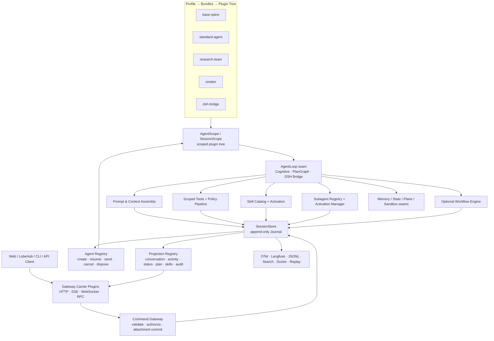
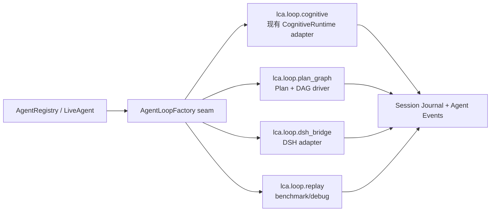
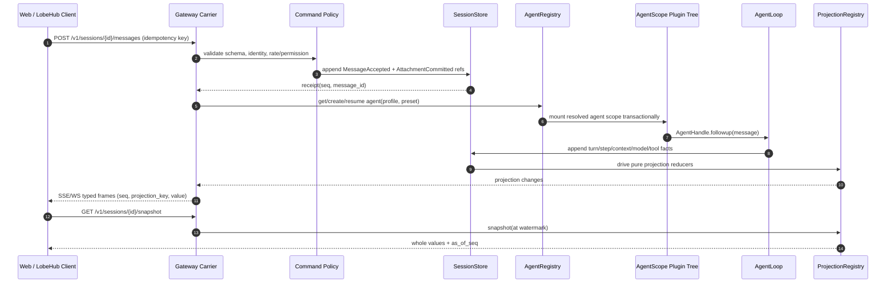
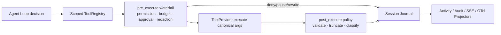

# LCA main × DeepSeek Harness：Python 全链路插件化融合架构蓝图

**作者：Manus AI**  
**审阅基线：`main` @ `8e552cc8bd8ce708df25390a553642927079661f`**  
**定位：以 DSH 的架构原则为目标，以 LCA main 已有实现为起点；本方案替代此前基于 `master` 的初版判断。**

---

## 0. 修正后的结论

你指出得完全正确。`main` 并非“尚未插件化”的起点，而是已经实现了相当扎实的 DSH/Cordis 风格基础：`PluginHost`、`PluginContext`、`PluginHandle`、可逆 effect、依赖收敛、依赖级联卸载、YAML `bundle → profile → patch`、加载期校验与循环检测都已存在；`RunStore` 也已经是带原子 append、序号、脱敏、投影、JSONL/SSE/OTel/Langfuse reader 的 DSH-inspired journal。[1] [2] [3]

当前最有价值的工作**不是重写这套插件内核**，而是把它从“已实现、以测试和局部能力为主的基础设施”，提升为 LCA 的**唯一运行主脊**。目前真正的断层在于：`AgentComposer` 每次仍直接 `boot_capabilities()`、直接构造 `SimpleBody`、`CognitiveRuntime`、hooks 与 stop rule；Gateway 在执行处以 `if dsh: ... else: ...` 将 DSH 与 LCA 分为两条运行路径；前端请求、Agent Session、Loop、技能、子代理、团队和投影尚未共享同一套插件驱动的 Agent 生命周期。[4] [5]

> **目标状态：LCA 不是“有插件的认知框架”，而是一个以 Python 实现的 Harness。前端只提交命令并订阅投影；每个 Agent 都是一个带 scoped plugin tree、可替换 loop、持久 Session Journal、可恢复 Inbox 与明确 owner 的运行实体；LCA 认知模型、Team、Memory、Plane、Sandbox、技能与 DSH bridge 都只是该 Harness 上的可组合能力。**

DSH 仍处于 developer preview 并不构成架构上的阻碍。应该大胆吸收其**结构性优点**，但不让 Python LCA 依赖其 TypeScript/Cordis ABI：LCA 自己拥有稳定的 Python SPI、事件词表、scope/lifecycle 与 Profile 格式；DSH 则既是设计标杆，也是可选的外部 loop/subagent provider。[6]

| 维度 | main 当前已有能力 | 本次建议的升级 |
|---|---|---|
| Plugin kernel | Host、Context、Handle、effects、reconcile、加载器与 Profile Loader 已存在。 | 保持内核；补 Manifest、scope realm、生产 profile、inspect/diagnostics、权限与多 provider 语义。 |
| 能力接缝 | LLM、Memory、State、Tools、Transport、Skills、Sandbox、Observability 已有 seam catalog。 | 将 `agent/session/loop/prompt/tool pipeline/subagent/workflow/gateway projection` 提升为一等 seam。 |
| 观测审计 | RunStore 已有 append-only journal、projectors、JSONL/SSE/OTel、doctor。 | 定义为唯一 Session Journal；所有模型可见事实、前端命令、技能、委派均入流。 |
| Gateway | `/runs` + SSE + HIL + attachments + DSH machine path 已可运行。 | Gateway 变为 Plugin Consumer/Carrier，提交 typed command、读 session projection；消除 LCA/DSH 执行分叉。 |
| Agent loop | `CognitiveRuntime` 稳定、认知闭环成熟。 | 变成第一个 `AgentLoop` provider，而不是唯一 runtime；支持按 Agent/Session/Profile 替换。 |
| Skills / Subagents | 已有 disk skill store、activation scope、team transport、A2A/MCP/DSH 适配基础。 | 建 DSH 式显式技能加载与子代理 registry/activation manager，统一 lifecycle、lineage、预算和可观测性。 |

---

## 1. main 分支真实基线：应保留的优势

### 1.1 已经具备的“Python Cordis”内核

`lca/layer0_infra/plugin/kernel` 的结构非常接近应有方向。Host 只保存 service table、event bus 和 handles；Lifecycle 独立负责激活、反激活、effect LIFO disposal、服务回收、依赖级联停用和配置更新回滚；Context 是插件唯一的受控 API，能 mount service、注册 effect/listener、执行 waterfall，并提供 child overlay。[1] 这不是简单 registry，而是有清晰职责分离的 plugin runtime。

`ProfileLoader` 也已经实现了 DSH 的核心组合公式：先按顺序展开 bundles 的 `insert` 条目，再按 id 应用 profile patch，最后 import module 成为 `PluginEntry`；`Loader` 负责 shape/config 校验、provider 冲突、未满足依赖与循环检测，并驱动 `reconcile()` 收敛为 active tree。[2] 这些都应直接成为新 Harness 的基础，而不应该被另一个 DI 框架替换。

### 1.2 已经具备的 Journal 与观测基础

`RunStore` 的职责已对齐 DSH Session 的关键不变量：注册词表检查、frozen event 边界验证、scope stamping、写入期脱敏、commit 后通知、连续 seq、投影缓存以及 reader/projector 隔离。它已经支撑 JSONL、LiveTail/SSE、OTel、Langfuse、console、sequence diagram、trace coherence 与 run doctor。[3] 这是最难后来补上的资产，应当直接升级为 `SessionStore`，而不是另建一条“事件溯源”链路。

### 1.3 已经具备的 Frontend → Backend 运行骨架

Gateway 已完成用户消息规整、附件采集、run session 建立、SSE resume、cancel、HIL answer、run summary 和 doctor。`ingress.py` 还针对 LobeHub 的 XML runtime pollution 做了前置净化，保证用户主任务、历史对话和附件各有边界；`execute.py` 则将 plane、sandbox、attachment staging、observability scope、LCA Agent/Team 或 DSH 运行与统一 finalize 串起来。[5]

DSH 分支并非外部黑盒：`dsh_execute.py` 已经把 DSH 通知投影到 LCA Journal，并复用同一 JSONL、LiveTail、终态事件和 frontend SSE 通道。[7] 这说明“同一对话界面切换不同 loop/provider”在工程上已经可行；下一步只是把分支判断变成插件解析。

### 1.4 main 当前的断层

| 已有组件 | 当前使用方式 | 为什么仍未获得 DSH 的全部收益 |
|---|---|---|
| Plugin tree | 有 Loader 和 Profile，但生产 Gateway/Composer 未以 profile tree 作为唯一装配方式。 | 运行期实现选择、配置快照、provider provenance 与前端 session 没有统一。 |
| CapabilityHub | 每次 `AgentComposer.compose()` 直接 `boot_capabilities()`。 | 作用域只是临时 object graph；不能有 session/agent-local plugin tree，难以热替换、检查和卸载。 |
| CognitiveRuntime | 直接被 Composer `new`，以 Brain/Body/Memory/Hook 注入。 | 扩展只能围绕它改造；Loop 本身不是 profile 选择的 provider。 |
| RunStore | 已记录大量执行事实。 | 尚不是所有模型可见历史、inbox、context injection 和 client command 的唯一真相。 |
| Gateway | 直接调用 `build_solo_agent/build_runnable_team` 或 `execute_dsh_session`。 | HTTP 层知道运行引擎，无法以统一 AgentHandle 管理 create/resume/cancel/steer/subagent。 |
| Skills | prompt 中渲染已安装 skill；激活 scope 同步入 state。 | Skill catalog、加载内容、可见性与前端 slash 还未统一为 durable Session 事实。 |
| Teams | 已有 TeamComposer、strategy registry、internal/A2A/MCP transport。 | Team/DSH/外部代理尚未统一为 Subagent seam 和 Session lineage。 |

---

## 2. 架构原则：大胆融合，但不抹掉 LCA 的个性

LCA 不应变成一个 Python 版 DSH 目录复制品。LCA 原有的**层级认知模型、MAP/Brain、Body、Memory、Role/Team、Plane/Sandbox、强领域契约和 Journal**是它应保留的产品优势。DSH 应贡献的是“如何让这些能力被长期优雅地组合、替换、审计和调试”。

| 原则 | 对 LCA 的具体含义 |
|---|---|
| **核心只保留机制** | 内核只负责 plugin lifecycle、scope、session append、agent ownership、command routing、projection drive；不内置 ReAct、MAP、Team 或 DSH。 |
| **Agent 是一等运行实体** | `Agent` 不再等于一次 `run()` 调用，而是 `Session + Inbox + scoped context + loop driver + handle` 的组合。 |
| **模型可见即有可审计事实** | 用户输入、附件引用、prompt section、context injection、skill body、tool schema change、模型请求、tool result、subagent report 都可从 Journal 重建。 |
| **服务接缝优于具体类** | Provider/consumer 只依赖 `lca.contracts` 的 seam；不得跨 plugin import implementation。 |
| **执行引擎可替换** | `CognitiveRuntime`、Plan/Graph loop、DSH bridge、未来 workflow loop 都实现同一 `AgentLoopFactory`。 |
| **插件作用域就是权限边界** | profile、team、agent、session/run 的 service realm 决定工具、技能、memory、model、sandbox 与 policy 可见性。 |
| **前端消费投影，不解释领域事件** | 前端接收版本化 whole-value projection；不在 browser 中自行折叠 tool/subagent/plan 状态。 |
| **明确所有权和释放** | Agent、Workflow、Subagent activation 都返回 holder-owned async lease，dispose 始终等待 child quiescence。 |
| **失败响亮、降级显式** | 不支持 output schema、tool filter、provider capability 时拒绝提交；禁止“忽略参数再继续”的静默降级。 |

---

## 3. 目标形态：LCA Harness Spine（Python）

### 3.1 端到端总图



其中最重要的改造是反转依赖方向：**Gateway 不再组装 LCA Agent；Gateway 只做 Command Carrier。Composer 不再 new 固定 runtime；Composer/AgentFactory 只在已解析 profile scope 中请求 `agent_loop`、`sessions`、`tools`、`prompt` 等服务。**

### 3.2 五个稳定的核心服务

DSH 的 `session / system-prompt / tools / agent / agent-loop / scope` spine 应在 Python 中形成对应服务。它们可以使用既有 plugin kernel，但不应继续停留在 L4 的构造函数里。[8]

| LCA Harness Service | 稳定职责 | main 中可复用的实现 | 禁止承担的职责 |
|---|---|---|---|
| `sessions` | append/read/fork/flush、header、durable event feed | `RunStore`、JSONL projector、journal model | 直接选模型、直接运行 Brain。 |
| `agents` | create/resume/find、AgentHandle owner、Inbox、cancel/when_idle | `RunSession/RunRegistry` 的部分语义 | 直接依赖 CognitiveRuntime。 |
| `system_prompt` | 组装 prompt sections、tool schema、context provenance | PromptReasoner、role/skills rendering | 保存隐藏可变 history。 |
| `tools` | scoped registry、schema、guarded execution pipeline | ToolsService、ActionCatalog、SafeExecutor | 运行具体 sandbox/provider。 |
| `agent_loop` | 注册 AgentFactory、驱动 turn/step、使用其余服务 | CognitiveRuntime 适配器、DSH adapter | 作为其它插件的 compile-time dependency。 |

`scope` 是内核库而非业务 service：它提供全局、Profile、Team、Agent、Session/Run realm 的层级解析与可逆注册。现有 `PluginContext.child()` 可作为原型，但必须扩展为带 lifecycle、访问控制和 owner tracking 的真实 `Scope`，而不是只读 overlay。

### 3.3 Python 内核接口

现有 `PluginSpec(name/apply/inject/provides/Config)` 不需要废弃，应向下兼容扩展为 richer manifest。初期让 Loader 同时接受旧模块 shape 与新 manifest；新插件采用完整声明。

```python
# lca/contracts/harness/plugin.py
@dataclass(frozen=True)
class PluginManifest:
    id: str                       # lca.loop.cognitive
    version: str                  # SemVer
    api_version: str              # lca-harness API contract version
    kind: Literal["service", "provider", "consumer", "bundle", "policy"]
    requires: tuple[ServiceKey, ...] = ()
    optional_requires: tuple[ServiceKey, ...] = ()
    provides: tuple[ServiceKey, ...] = ()
    scopes: tuple[ScopeKind, ...] = (ScopeKind.PROFILE,)
    permissions: tuple[CapabilityGrant, ...] = ()
    config_model: type[BaseModel] | None = None
    reload: Literal["never", "restart_scope", "hot_safe"] = "restart_scope"

class AgentLoopFactory(Protocol):
    async def create(
        self,
        ctx: AgentScope,
        identity: AgentIdentity,
        options: AgentOptions,
        *,
        resume: SessionId | None = None,
    ) -> "AgentHandle": ...

class AgentHandle(Protocol):
    @property
    def agent(self) -> "LiveAgent": ...
    async def dispose(self, reason: DisposeReason = DisposeReason.OWNER) -> None: ...

class LiveAgent(Protocol):
    id: SessionId
    async def followup(self, message: UserMessage) -> MessageReceipt: ...
    async def steer(self, message: UserMessage) -> MessageReceipt: ...
    async def inject(self, message: ContextMessage) -> MessageReceipt: ...
    def cancel(self, reason: CancelReason, *, keep_inbox: bool = True) -> None: ...
    async def when_idle(self) -> None: ...
```

这是一种适合 Python 的 DSH 实现方式。TypeScript 的 declaration merging 在 Python 不可直接复制，因此事件、projection、tool schema 扩展应通过**明确注册表和 namespaced schema**完成；不可用无约束 `dict[str, Any]` 代替类型演进。

---

## 4. Session Journal：让现有 RunStore 升格为唯一事实来源

### 4.1 从 Run Journal 到 Agent Session

当前 `RunStore` 已具备 append-only 核心，但其命名和使用仍偏“一次 execution”。要实现 DSH 的完整收益，应把它升格为 `SessionStore`：一个 Agent Session 可以存在多个 turn、多个 run activation、多个 subagent lineage，前端可 followup/steer/inject，恢复不依赖内存 `runnable`。

> **`AgentState`、`RunSession.status`、memory 写入计划、前端 activity tree、trace、plan、skills、child catalog 都是 Journal 的 projection；Journal Event 才是耐久事实。**

`RunStore` 的 `append-before-observe`、seq、不变 event、脱敏和 projectors 应保持原样。改变的是 event vocabulary 与 ownership，而不是另写 EventStore。

### 4.2 三层事件模型

| 事件层 | 是否持久化 | 典型用途 | 当前实现映射 | 规则 |
|---|---:|---|---|---|
| `SessionEvent` | 是 | 模型/用户/工具/子代理可审计事实 | `JournalEvent` 的主演进方向 | 任何模型可见输入必须有 durable source。 |
| `AgentEvent` | 否 | pre-step、request、turn-stopping、cancel、loop lifecycle interception | PluginContext EventBus / hooks 的升级 | 可控制当前执行，禁止作为恢复依据。 |
| `CapabilityEvent` | 否或附带 durable fact | tool policy、sandbox、telemetry、provider stream | 当前 Hook/EventBus/OTel | 附着到 seam，不能反向 import loop。 |

推荐以 versioned dataclass 建立 event registry。插件可注册新的 event 类型，但必须指定 namespace、schema version、codec、redaction policy 和 event category。

```python
@session_event("tool.call.v1", redaction=ToolCallPolicy)
@dataclass(frozen=True)
class ToolCallRequested(SessionEvent):
    call_id: CallId
    tool_name: str
    arguments_ref: ContentRef
    visibility: Literal["model", "audit"] = "model"

@session_event("skill.catalog.v1", redaction=SkillCatalogPolicy)
@dataclass(frozen=True)
class SkillCatalogPublished(SessionEvent):
    entries: tuple[SkillCatalogEntry, ...]
    digest: str
    source: Literal["pre_step"] = "pre_step"
```

### 4.3 必需事件词表

| 域 | durable events | 价值 |
|---|---|---|
| 接入 | `session.created`、`message.accepted`、`attachment.committed`、`command.rejected` | 可审计输入、支持幂等与重放。 |
| Agent | `turn.started/ended`、`step.started/ended`、`inbox.inserted/claimed/discarded`、`agent.status` | 前端状态、followup/steer/inject、resume。 |
| Context | `context.injected`、`prompt.section.published`、`tool.schema.published` | 重建模型看到的精确上下文。 |
| LLM | `model.requested`、`model.chunk`、`model.completed/failed` | 流式 UI、成本、回放、模型对比。 |
| 工具 | `tool.called`、`tool.approved/denied`、`tool.completed` | 工具审计与 guarded pipeline。 |
| 技能 | `skill.catalog.published`、`skill.loaded`、`skill.user_invoked` | 可见性/全文加载/前端 slash 一致。 |
| 子代理 | `subagent.started`、`subagent.reported`、`subagent.settled`、`subagent.interrupted` | lineage tree、独立结果归属与调试。 |
| 工作流 | `workflow.started/phase/log/child_started/child_ended/ended` | 动态编排时间线与 replay。 |
| 治理 | `approval.requested/resolved`、`budget.updated/exceeded`、`policy.decision` | 权限与人审追责。 |

**不要**同时在 `AgentState.history`、gateway session 状态、Journal 中各自写一份“事实”。`AgentState` 继续保留为运行期 reducer 的快捷对象，但必须能由 Journal + checkpoint 恢复。

### 4.4 Projection Registry：让前端只消费已完成状态

DSH 的 Session Projection 模式应完整吸收：框架只订阅 Journal 一次；各域插件注册纯 `initial → reduce(event) → view` 单元；客户端只收到 schema 校验后的 whole-value snapshot/change，而不是自己折叠 tool/subagent 状态。[9]

```python
class ProjectionDefinition(Protocol[StateT, ViewT]):
    key: ProjectionKey
    version: int
    def initial(self) -> StateT: ...
    def reduce(self, state: StateT, event: StampedEvent) -> StateT: ...
    def view(self, state: StateT) -> ViewT: ...

class ProjectionRegistry(Protocol):
    def register(self, definition: ProjectionDefinition) -> Disposable: ...
    def snapshot(self, session_id: SessionId) -> ProjectionSnapshot: ...
    def checkpoint(self, session_id: SessionId) -> ProjectionCheckpoint: ...
```

首批 projection 是：`conversation`、`activity`、`agent_status`、`plan`、`skills`、`subagents`、`artifacts`、`audit_summary`、`trace_summary`。每个有 `version` 和 watermark；保存 `(session_id, projection_key, version, seq, value)`，冷读采用 checkpoint + Journal tail replay。前端一次获取 `snapshot`，随后以 `Last-Event-ID` 订阅 delta，消除当前 Gateway 中手工拼 summary/status 的扩散。

---

## 5. Agent 与可替换 Loop：保留 CognitiveRuntime，取消其特权

### 5.1 架构边界

DSH 的关键不是“有一个 agent loop”，而是 public `Agent` contract 与具体 `agent-loop` package 分离；扩展插件只依赖 Agent events/services，不依赖 loop 实现。[8] LCA 应采用完全相同的边界。

`CognitiveRuntime` 不应被删除。它是 LCA 的默认认知闭环，且有 `perceive → think → act → reflect → record → checkpoint → stop`、HIL resume、budget、skills activation、artifact closure 等优势。[10] 它只需要被包进第一个 provider：`lca.loop.cognitive`。



### 5.2 AgentSession、Inbox 与 Handle

新增 `AgentRegistry`。`create()`/`resume()` 在 session 尚未发布前建立 AgentScope；setup 成功才发布 Agent 与 `agent.created`。任何 setup 失败、profile load 失败、plugin activation 失败都释放 scope，不产生半成品 Agent。对外只返回 owner 的 `AgentHandle`；`registry.get()` 返回受限的 `LiveAgent`，不会授予 dispose 权限。

`Inbox` 应成为 durable projection，区分 `next_turn`、`next_step` 与 `context_only`：

| API | 含义 | 对应使用场景 |
|---|---|---|
| `followup()` | 添加下一 turn 的普通用户/协调消息，唤醒 agent。 | 前端继续对话、子代理结果唤醒父 agent。 |
| `steer()` | 加入最近 step 边界的干预输入。 | 用户中断时修正方向。 |
| `inject()` | 添加模型可见上下文但不唤醒。 | skill、检索、artifact、静默子代理报告。 |
| `cancel()` | 取消活跃 driver；可保留 inbox。 | 前端取消、父级 workflow stop、plugin unload。 |
| `when_idle()` | 等待当前工作与已唤醒队列清空。 | workflow/测试/owner 收敛。 |

当前 `/runs/{id}/answer` 通过在内存 `RunSession` 保存 `runnable/snapshot` 续跑；迁移后只需将 human answer 转为 `message.accepted` 或 `approval.resolved` command，并让 `AgentRegistry.resume()` 从 durable Session + projection 恢复。这样进程重启后也能恢复，且一条路径服务 UI、CLI、A2A 和 DSH bridge。

### 5.3 默认 Cognitive Loop Provider

`lca.loop.cognitive` 的第一版是**薄适配**，不重写认知算法：

1. `AgentLoopFactory.create()` 解析 agent-scope 的 `Brain`、`Body`、`Memory`、`StateStore`、`StopRule`、`PromptAssembler`、`ToolPipeline`；
2. 现有 `CognitiveRuntime` 从 Journal projection materialize `AgentState`，而非自建临时事实；
3. Hook 调整为 `AgentEvent` middleware，Journal emitting hook 迁移为 core append；
4. 每个 phase 的模型可见输入、decision、observation、reflection、checkpoint 写入 `SessionEvent`；
5. `Result` 由 `RunResultProjection` 派生，保持现有 public API 兼容。

原 `Brain`、`Body`、`Memory` 的认知职责不丢失；改变的是它们获取依赖和写事实的方式。

### 5.4 DSH 不再是 Gateway 特例

现有：

```python
if is_dsh_driver(session.execution_target):
    await execute_dsh_session(session)
else:
    runnable = build_solo_agent(...) or await build_runnable_team(...)
    result = await runnable.run(...)
```

目标：

```yaml
# profiles/standard-dsh-bridge.yaml
bundles:
  - profiles/bundles/base-spine.yaml
  - profiles/bundles/gateway.yaml
  - profiles/bundles/observability.yaml
patch:
  - id: agent-loop
    config:
      provider: lca.loop.dsh_bridge
      target: machine
```

Gateway 只把 `requested_profile`、`execution_target`、`workspace`、`agent preset` 编译为 `SessionCreateCommand`。Agent Factory 解析 `agent_loop` provider。`lca.loop.dsh_bridge` 使用当前 `DshJournalProjector/HandleJournalSink` 将 DSH notification 转换为同一份 `SessionEvent` vocabulary，原 DSH archive 仅作为 raw provider evidence。前端、SSE、Run Doctor、审计和 projection 无须知道当前 loop 是 Cognitive 还是 DSH。

这同时允许：同一 LCA Team 的某个 child 用 `lca.loop.cognitive`，另一个 child 用 `lca.loop.dsh_bridge`；具体选择来自 `SubagentProvider` capability/preset，而非 Gateway 条件分支。

---

## 6. 从前端请求到 LCA 后端：完全由 Command、Session 与投影驱动

### 6.1 新的请求链路



### 6.2 Gateway 的新职责与非职责

| Gateway 应做 | Gateway 不应做 |
|---|---|
| HTTP/SSE/WS/RPC carrier、认证、限流、body/schema 验证、idempotency、attachment commit、command authorization。 | 直接 `new Agent`、选择 Brain/Body/DSH、拼 prompt、维护 agent 状态机。 |
| 将请求转为 typed command 并 append accepted/rejected fact。 | 直接修改 `AgentState` 或 `RunSession.status` 作为事实。 |
| 将 projection snapshot/change 编码成 REST/SSE/WS。 | 在浏览器协议里泄漏 PluginHost、Tool object、Python exception 或可变 live handle。 |
| 将 cancellation/approval/skill slash 转为 command。 | 另行实现工具、子代理、workflow 状态折叠。 |

新的 API 可保持旧兼容，建议并行引入：

| 旧接口 | 新接口 | 迁移策略 |
|---|---|---|
| `POST /runs` | `POST /v1/sessions`、`POST /v1/sessions/{id}/messages` | 旧接口转译成 create + followup command。 |
| `GET /runs/{id}/live` | `GET /v1/sessions/{id}/events` 与 `/projections/live` | 旧 SSE 继续输出 legacy frames；新客户端消费 typed projection changes。 |
| `GET /runs/{id}` | `GET /v1/sessions/{id}/snapshot` | summary 由 projection 生成。 |
| `POST /runs/{id}/answer` | `POST /v1/sessions/{id}/commands/answer` | command 写 durable human/approval event。 |
| `DELETE /runs/{id}` | `POST /v1/sessions/{id}/commands/cancel` | 调用 Agent.cancel；保留 inbox 策略可配置。 |

### 6.3 前端状态模型

前端不得以 token stream 猜测运行状态。每个 Session 初次加载获得一个由同一 `as_of_seq` 定义的 consistent snapshot，随后订阅高序号 projection change。建议 wire frame：

```json
{
  "type": "projection.changed",
  "session_id": "ses_...",
  "key": "activity",
  "version": 1,
  "seq": 184,
  "value": { "active": "tool", "items": [] }
}
```

前端只保留 `seq` 的高水位、每个 projection key 的最新 whole value，并向 server 请求 catch-up；它不重放 raw domain events 来构建工具/子代理树。若需要“查看轨迹”，使用单独的 raw event/audit 页面或 server-side `TrajectoryProjection`，以防 UI 代码成为第二份领域 runtime。

---

## 7. Plugin Tree、Profile、Bundle 与 Scope

### 7.1 保留现有 Profile Loader，但让生产真正使用它

main 的 YAML profile/bundle/patch 已足够作为第一阶段格式，不需迁移到 TOML 或 Python DSL。差距在生产接线：Gateway 启动时加载 root deployment profile；创建 Agent 时加载可继承 preset；运行时选择 profile overlay；所有 resolved entries 写入 Session header/Journal。

```yaml
# profiles/web-standard.yaml
apiVersion: lca.ai/harness/v1
profile: web-standard
bundles:
  - profiles/bundles/base-spine.yaml
  - profiles/bundles/python-cognitive.yaml
  - profiles/bundles/web-gateway.yaml
  - profiles/bundles/observability.yaml
patch:
  - id: session-persistence
    config: { backend: sqlite, path: .lca/sessions.db }
  - id: llm-openai-compatible
    config: { provider: deepseek, model: deepseek-chat }
  - id: agent-loop
    config: { provider: lca.loop.cognitive }
  - id: tools
    config: { presentation: native }
  - id: skills
    config: { enabled: true, roots: [./skills, ~/.lca/skills] }
```

```yaml
# presets/researcher/profile.yaml
extends: web-standard
scope: agent
patch:
  - id: agent-loop
    config: { provider: lca.loop.plan_graph }
  - id: tools
    config: { allow: [web_search, read_file, spreadsheet] }
  - id: skill-catalog
    config: { enabled: true, model_invocable: true }
  - id: sandbox-policy
    config: { mode: workspace_write }
```

改造 `ProfileLoader` 时应补齐：`extends`、多层 overlay、路径相对 profile 解析、manifest api-version 校验、resolved tree digest、typed patch（深 merge/replace 的显式语义）、配置 provenance、secret reference，及 `lca inspect profile/tree`。当前浅层 config replacement 应保留为兼容模式，但新 schema 不应依赖隐式 merge。

### 7.2 Scope 设计

| Scope | 产生时机 | 可注册的能力 | 回收边界 |
|---|---|---|---|
| Deployment | process boot | persistence provider、gateway carrier、metrics、trusted bundle catalog | process shutdown。 |
| Profile | 部署 profile 激活 | default loop/provider/model/sandbox policy | profile reload/retire。 |
| Team | Team/Workflow 创建 | shared memory、team scheduler、team tool policy | Team handle dispose。 |
| Agent | Agent create/resume transaction | role/preset、tools restrict、skills、loop-specific dependencies、persona | Agent handle dispose。 |
| Session/Run | turn activation | budget、approval context、trace/span、attachment refs、ephemeral task handles | idle/terminal or activation dispose。 |

关键约束：child scope 只可 shadow allowlisted services；不能向 parent publish；plugin unload 自动取消/等待它结构性拥有的 Agent/Workflow/Subagent handles；父 scope 卸载前 child 必须 drain。现有 `PluginContext.child()` 需要从临时 values overlay 升级为拥有独立 handle table、effect stack 和 provider realm 的 `ScopedPluginHost`。

### 7.3 Capability Seams 分类

| Seam | Provider 语义 | 首个 LCA provider | 未来 provider |
|---|---|---|---|
| `sessions` | 单一核心 service | `RunStoreSessionStore` | SQLite/Postgres/Kafka persistence adapter。 |
| `agent_loop` | 每个 Agent scope 仅一个 factory | `CognitiveLoopFactory` | PlanGraph、DSH Bridge、Replay。 |
| `llm` | 命名 registry | existing OpenAI/DeepSeek/mock | Anthropic、replay、routing/cost-aware。 |
| `tools` | 核心 scoped registry | existing tools/action catalog | MCP discovered tool registry、code-mode adapter。 |
| `tool_executor` | 每 agent/run 一个 active provider | SafeExecutor + current sandbox | remote sandbox、machine、DSH tool bridge。 |
| `skills` | 合并 catalog registry | DiskSkillPackageStore | Git/HTTP/enterprise registry。 |
| `subagents` | 命名 registry，多 provider 共存 | in-process team adapter | A2A、DSH SDK、Codex、Claude Code。 |
| `workflow_engine` | 单一 active provider | safe DAG engine | isolated Python worker / DSH code mode. |
| `memory` | named provider / per agent binding | SimpleMemorySystem | vector/KG/long-term procedural. |
| `transport` | 命名 registry | internal/A2A/MCP | queues/remote orchestrator。 |
| `approval` | 单一 active per deployment/session | current HIL adapter | UI/Slack/enterprise policy. |
| `session_projections` | registry，多 domain contributors | current journal projectors adapter | plan/skills/subagent/activity views。 |
| `gateway_carrier` | 多 consumer | HTTP/SSE existing Starlette | WebSocket/RPC/ACP/CLI。 |

**多 provider** 与**单 active provider**不可混用：LLM/Subagent/Skills 是 registry；`agent_loop`、workflow engine、session persistence、sandbox execution 在一个 scope 内通常必须单选。这个 distinction 必须进入 manifest/Loader，不然 profile 只能检查“duplicate provides”，无法表达 DSH 的能力模型。

---

## 8. 工具与治理：从 Body 分支到 Guarded Tool Pipeline

当前 `SimpleBody + ActionCatalog + SimpleSafeExecutor` 是很好的执行基础。要吸收 DSH 的 tools architecture，应分离四件事：

1. **Tool Definition**：模型可见 schema、说明、canonical args/result schema、UI renderer；
2. **Tool Provider**：真实执行（sandbox、machine、MCP、HTTP）；
3. **Guarded Pipeline**：pre-policy → monotonic guards → around dispatch → post-policy → final observation；
4. **Projection/Telemetry**：从 SessionEvent 生成 activity、trace、audit，而不是工具实现直接操纵 UI。



每个 `ToolCall` 都必须有 `call_id`、idempotency key、causation id、tool definition version、provider id/version、policy decision 和 result reference。模型在 prompt 中看到的 tools schema，也必须由 `ToolSchemaPublished` 或 stable profile digest 追溯。这样切换 sandbox 或 MCP provider 时，`ToolDefinition` 与前端 render 不变，只有 capability binding 被替换。

审批应不再依赖任意异常串联。`pre_execute` 返回显式 `Allow | Rewrite | Pause(ApprovalRequest) | Deny | Retry`。Pause 追加 `approval.requested`，Agent driver 进入 waiting-input，UI 的 approval projection 发起交互；answer command 再追加 `approval.resolved`，Agent 从 Journal projection 恢复。

---

## 9. Skills：把 LCA 已有能力升级为 DSH 式可发现、可激活、可审计的系统

LCA 应保留现有 `skills/`、DiskSkillPackageStore、skill router 和 activation scope；但必须将它们接入 AgentScope、Journal 与 frontend projection，而不是仅把“可用 skills”渲染到 prompt 中。

DSH 的优秀模式是：模型初始只见 skill 的名称/截断描述 catalog；完整 `SKILL.md` 仅通过 `skill(name)` tool 或用户 `/name` 显式加载；catalog 改变是 durable context message；skill body 只写入工具结果，避免重复注入；前端 slash 菜单只辅助发现，真正的激活由服务端 pre-step 对原始文本确定性处理。[11]

### 9.1 LCA Skill 插件设计

```python
class SkillProvider(Protocol):
    name: str
    async def snapshot(self, scope: SkillScope) -> SkillCatalogSnapshot: ...
    async def load(self, name: str, scope: SkillScope) -> LoadedSkill: ...

class SkillCatalog(Protocol):
    async def snapshot_for(self, agent: LiveAgent) -> SkillCatalogSnapshot: ...

class SkillActivationPolicy(Protocol):
    async def pre_step(
        self, agent: LiveAgent, proposed: PreStep
    ) -> PreStepDecision: ...
```

| 插件 | 职责 | 输出事实 |
|---|---|---|
| `lca.skill.filesystem` | 将现有 `skills/`/用户根目录扫描为 provider catalog。 | 无；仅 discovery。 |
| `lca.skill.catalog` | 在 `agent/pre_step` 比较 snapshot digest，发布/更新 catalog。 | `skill.catalog.published`。 |
| `lca.tool.skill` | 提供 `skill(name)`，加载 body 与 resource guidance。 | `tool.called/completed`，其中 result 为 `skill_content`。 |
| `lca.skill.slash` | Gateway/UI hint + 服务端 `/name` gesture policy。 | `skill.user_invoked`、`context.injected`。 |
| `lca.skill.router` | 保留当前 cognitive routing，作为建议 layer，不直接决定真实激活。 | 可选 `skill.suggested`。 |

Skill manifest 增加 `id/name/version/description/when_to_use/model_invocable/user_invocable/resources/trust/content_hash`。前端 activity 只呈现 durable `tool.call/result`，replay 时不能重新扫描当前磁盘以显示历史 skill 内容。

---

## 10. 子代理、Team 与 Workflow：统一成可组合的执行能力

### 10.1 Subagent Registry

DSH 将 Subagent 视为 optional seam，且允许 `inprocess/fork/ACP/Codex/Claude/DSH` 等多个 named provider 共存；请求在 start 前以 capability descriptor 检查 output schema、深度、tool filter、persona，任何不支持的特性都 fail loud。[12] LCA 应将现有 Team、InternalTransport、A2A、MCP、DSH execution 都纳入这一语义。

```python
class SubagentProvider(Protocol):
    name: str
    capabilities: SubagentCapabilities
    async def start(self, request: ResolvedSubagentRequest) -> SubagentRun: ...

class SubagentRun(Protocol):
    child_session_id: SessionId | None
    result: Awaitable[SubagentResult]     # normal result, not arbitrary exception
    def cancel(self, reason: str = "") -> None: ...
    async def dispose(self) -> None: ...
```

| Provider | 复用 main 资产 | 适用任务 |
|---|---|---|
| `lca.subagent.inprocess` | CognitiveLoop + AgentFactory | 快速 child agent，明确隔离工具/role。 |
| `lca.subagent.team` | TeamComposer + orchestration strategies | 预定义多角色研究/开发团队。 |
| `lca.subagent.a2a` | A2ATransport | 远端标准 Agent。 |
| `lca.subagent.mcp_task` | MCP transport / server tools | 外部 task-like service。 |
| `lca.subagent.dsh` | 当前 DSH adapter | 使用 DSH coding capability。 |
| `lca.subagent.external_cli` | machine/subprocess + sandbox | Codex/Claude Code 等外部 child backend。 |

每个 child 拥有自己的 durable session header：`parent_session_id`、`delegation_depth`、`workspace_ref`、`provider_name`、`profile_digest`。父级 UI 不以 child 的自由文本作为可信执行状态，而读 `SubagentProjection`：started、running、waiting、report、settled、error。

### 10.2 Continuable Subagents 与 Activation Manager

LCA 应完整吸收 DSH 的“durable session，单一 live activation”设计。一个 child session 可暂停、冷恢复、接收 followup；但任意时刻只能被一个 `ActivationManager` 持有。Inbox 是唯一 FIFO，禁止为 continuable child 再设计 parallel task queue。

这对长期团队很重要：researcher child 可以等待外部工具或用户反馈，parent 不会因它暂时 idle 而错误收尾；parent scope 只有在所有 owned child activation 静默后才可 dispose。`SubagentReported`（child 自己选择的内容）必须和 `SubagentSettled`（runtime 对 child 状态的描述）分为不同事实，避免 UI/审计误归属。

### 10.3 Workflow Engine：先安全的声明式图，再隔离脚本

Workflow 应是 optional `workflow_engine` seam，不属于 agent loop。LCA 第一版不需要让模型执行任意 Python；应先提供 `lca.workflow.dag`：模型/用户提交严格校验的 JSON/YAML DAG，节点是工具或 subagent，边是显式依赖，资源/并发/预算由 engine 控制。它可直接复用 LCA 的 Team orchestration 优点。

第二阶段可以提供 `lca.workflow.python_worker`，在独立进程/容器中执行受限 Python DSL：

- `meta`、`args` 在执行脚本前由 Pydantic 校验；
- `agent()`、`parallel()`、`pipeline()` 是受控 host call，不把 PluginContext/SessionStore 注入脚本；
- worker 有 CPU、wall-time、memory、output、并发 child 上限；
- `WorkflowLease.dispose()` 必定取消、等待 child quiescence、清理 worker；
- workflow events 是 data snapshot，observer 得不到 live cancel handle；
- 父 Session 投影 `workflow.started/phase/log/child_started/child_ended/ended`，无须浏览器推测工作流。

这与 DSH Workflow 的可替换单 engine、显式 parent、bounded cancellation 和 observer-safe events 一致。[13]

---

## 11. 观测、调试与审计：把现有强项提升为产品主线

### 11.1 统一写路径，拆分读路径

现有 `ObservabilityHub`、RunStore、Journal Projectors、LiveTail、JSONL、OTel、Langfuse、Run Doctor 都是可保留资产。需要调整的是语义：

```text
SessionStore.append(event)  ← 唯一事实写入
    ├─ ProjectionRegistry       → frontend snapshot/change
    ├─ LiveTail / SSE / WS      → 实时显示
    ├─ JsonlPersistence         → crash recovery / replay
    ├─ OTelProjector            → traces / metrics
    ├─ LangfuseProjector        → LLM observability
    ├─ AuditProjector           → operator / compliance search
    ├─ DoctorProjector          → invariant violation diagnosis
    └─ SequenceProjector        → visual run trace
```

`ObservabilityHub` 应逐渐成为 projectors 的 composition facade，而不是 runtime 内部另一个事实 owner。保留 `bind(hub)` 作为过渡适配，但新 Loop/Tool/Skill/Subagent 不再直接决定 JSONL/SSE/OTel，而只 append typed session event。

### 11.2 必须增加的可观测字段

每一条 `StampedEvent` 应具有/可关联：`session_id`、`run_activation_id`、`trace_id`、`span_id`、`parent_span_id`、`causation_id`、`correlation_id`、`actor`、`plugin_id/version`、`profile_digest`、`scope_id`、`provider`、`policy_decision_id`。敏感实际值由 ContentRef + redaction policy 控制，审计查询可以基于 metadata 而无需暴露 prompt/tool secrets。

### 11.3 Debugger / Creator Profile

DSH 的 Creator mode 值得直接吸收。建议 `creator` profile 提供：

| 功能 | 实现方式 |
|---|---|
| `lca inspect tree` | 展示 profile/bundle/patch 后的 active plugin tree、requires/provides、scope、config digest、effect owner。 |
| `lca inspect agent` | 展示 agent/session header、resolved loop、visible tools/skills、budget、child activations。 |
| `lca replay` | 指定 seq/checkpoint，重建 prompt/context/state/projection；可切换 mock/replay LLM。 |
| `lca doctor` | 扩展现有 run doctor，验证 event pairing、seq、projection watermark、tool-call result、child lifecycle。 |
| `lca sandbox plugin` | 用 in-memory SessionStore 和 isolated Profile scope 激活一个候选插件，输出 effect/provenance。 |
| Trace UI | 复用 SSE + SequenceDiagramProjector，显示 turn/step、tool、workflow、subagent DAG 与 config tree。 |

---

## 12. 代码结构：演进而不是物理大迁移

不要在第一步将 `layer0` 至 `layer4` 全部移动。先建立新 spine package 并为旧实现提供 adapter；等稳定后再渐进收敛物理目录。

```text
lca/
├── contracts/
│   ├── harness/              # PluginManifest、Scope、SessionEvent、Agent/Loop/Subagent SPI
│   ├── models/               # 保留现有 domain models，逐步增加 session header/event models
│   └── protocols/            # 稳定 provider/consumer contracts
├── harness/
│   ├── kernel/               # ← 迁入/复用 plugin/kernel（Host、Context、Lifecycle、Loader）
│   ├── profile/              # ← 迁入/复用 plugin/include（bundle、patch、inspect）
│   ├── session/              # ← 以 RunStore 为核心的 SessionStore、Inbox、persistence
│   ├── agent/                # AgentRegistry、AgentHandle、scope、commands
│   ├── prompt/               # Prompt sections、context provenance
│   ├── tools/                # scoped registry、guard pipeline
│   └── projections/          # registry、checkpoint、gateway adapters
├── plugins/
│   ├── loop_cognitive/       # 现有 CognitiveRuntime 的 adapter
│   ├── loop_plan_graph/
│   ├── loop_dsh_bridge/      # 当前 dsh_execute/run/projector 的 provider 化
│   ├── skills_filesystem/
│   ├── tool_skill/
│   ├── subagent_inprocess/
│   ├── subagent_team/
│   ├── subagent_dsh/
│   ├── workflow_dag/
│   ├── gateway_starlette/
│   ├── projections_web/
│   └── observability_*/
├── bundles/                  # first-party reusable compositions
├── layer1_cognitive/         # 保留 Brain/Body/Memory 算法与适配器
├── layer2_runtime/           # 过渡期保留；最终是 lca.plugins.loop_cognitive 的实现来源
├── layer3_agent/             # Team/roles/subagent provider 的领域资产
├── layer4_app/               # Public API facade 与 spec；不再直接装配具体 runtime
└── gateway/                  # 薄 carrier，逐步转为 lca.plugins.gateway_starlette
```

`lca.layer0_infra.plugin` 无需被删除；第一期可通过 re-export 成为 `lca.harness.kernel`。`AgentComposer` 也不立即删除，而是变为 `LegacyCognitiveLoopFactory` 内部的 builder，直至 `CognitiveRuntime` 完成依赖收敛。

---

## 13. 渐进迁移路线：每一步都可运行、可回滚

### Phase A — 把已有 Plugin Kernel 变成生产 Composition Root

**目标：不改变任何认知语义，只让 production 使用 Profile + Loader。**

1. 为现有 plugin shape 加 `PluginManifest` 兼容适配；补 `scopes/provider_mode/api_version/permissions` 元数据。
2. 将当前 `boot_capabilities()` 中的 Definition/Provider 注册拆成 first-party plugin modules 与 `base-spine` bundle。
3. 添加真实 `profiles/`：`web-standard`、`solo-cognitive`、`team-research`、`dsh-bridge`、`creator`；而不是只在 tests 临时写 YAML。
4. Gateway app boot 时加载 deployment profile；`AgentComposer` 接收已解析 scope，不再调用 `boot_capabilities()`。
5. 增加 `lca inspect tree --profile ...` 和 resolved config digest。

**验收：**同一 `AgentSpec`、mock LLM、calculator 工具的结果/Journal/trace 与现有基线等价；`AgentComposer` 不直接 import/mount default provider。

### Phase B — Session/Agent Spine 与 Gateway Command 化

**目标：让前端和后端通过 Agent Session 而不是 `RunSession.runnable` 相连。**

1. 以 RunStore 扩展 `SessionStore`，增加 SessionHeader、Inbox events、turn/step vocabulary、persistence adapter。
2. 实现 AgentRegistry、AgentHandle、AgentScope 事务创建/恢复/释放。
3. 将 Gateway `/runs` 内部改为 `SessionCreateCommand + Agent.followup()`；保留旧 wire response。
4. 增加 `/v1/sessions/*` 与 projection snapshot/change endpoint；旧 `/runs/*` 只作 compatibility adapter。
5. `answer/cancel` 均转 command；HIL resume 不依赖内存 runnable。

**验收：**网关重启后可以从 JSONL/SQLite 恢复 waiting-input session；SSE 从 Last-Event-ID 补齐；前端 snapshot 同一 watermark 下没有 status/activity 不一致。

### Phase C — 让 CognitiveRuntime 成为可替换 Loop Provider

**目标：完全保留 LCA 认知优势，同时消除 loop 特权。**

1. 引入 `AgentLoopFactory`、`LiveAgent`、Agent events 与 `lca.loop.cognitive`。
2. 将 `CognitiveRuntime` 的 Hook 分成 AgentEvent middleware（可阻断）与 telemetry subscriber（不可阻断）。
3. 将 Journal emitting hook 收归 session core；`AgentState` 由 projector/checkpoint materialize。
4. 将 `brain/body/memory/stop_rule` 从 Composer concrete new 改为 agent scope services。
5. 用 `lca.loop.replay` 对 golden journal 复跑，建立 deterministic trace tests。

**验收：**新插件可只依赖 `agents/sessions/tools` 扩展行为，完全不 import `CognitiveRuntime`；替换为 test loop/replay loop 无须改 Gateway。

### Phase D — DSH Bridge Provider 化

**目标：DSH 是一个 loop/subagent provider，而不是网关特殊分支。**

1. 将 `gateway/runs/dsh_execute.py` 拆为 `lca.plugins.loop_dsh_bridge`，Gateway 中删 `if dsh`。
2. 定义 DSH notification → `SessionEvent` 的 canonical mapping；原始 notification 保留 archive ref。
3. `execution_target` 编译为 profile/loop binding，而不是执行层条件。
4. DSH child 以 `lca.subagent.dsh` 加入统一 Subagent Registry。
5. 统一 cancel、approval、attachments、journal sequence、doctor/replay 的语义。

**验收：**同一 UI 和 SSE 不因 loop 选择而改变；一棵 parent/child session tree 可以混用 Cognitive 与 DSH provider。

### Phase E — Tool Pipeline、Skills、Subagents 与 Team 收敛

**目标：所有扩展能力进入同一 Session/Scope/Policy 模型。**

1. Tool Definition/Provider/Pipeline/Renderer 分离，迁移 SafeExecutor 与 ActionCatalog。
2. 实现 Skill Catalog/Tool/Slash/Projection，迁移 disk skill store 为 provider。
3. 实现 SubagentRegistry、capability negotiation、ActivationManager；先迁 internal/team，再迁 A2A/MCP/DSH。
4. TeamComposer 改为 `lca.subagent.team`/`workflow_dag` 的 consumer，不改变 LCA role/team 本质模型。
5. 引入 workflow DAG engine；Python sandbox worker 后置。

**验收：**每个 child 有 header lineage、可见工具/skills/profile digest；工具/技能/child 事件能在 Web/CLI/Replay 一致显示。

### Phase F — Creator、生态、治理与弃用

**目标：让开发效率、扩展、维护和安全达到 DSH 风格。**

1. 建 plugin catalog、entry points、trust level、signature/hash/allowlist、permission grant。
2. 建 creator profile、hot-safe plugin reload、profile patch editor、sandbox test harness。
3. 建 projection cache、query/search、cross-session lineage explorer、audit export。
4. 提供 plugin authoring template、contract test suite、compatibility test matrix。
5. 在有明确替代后弃用 legacy boot/composer 分支，删除 Gateway old execution branching。

---

## 14. 双写、回滚与测试策略

### 14.1 迁移安全机制

| 开关 | `off` | `shadow` | `authoritative` |
|---|---|---|---|
| `session_spine` | 现有 run path | 旧 path 运行，同时 append/fold 新 Session Journal | Session Journal 是事实，legacy state 是 projection。 |
| `gateway_commands` | 旧 `/runs` 直连 | 请求同时记录 command receipt | `/v1/sessions` 驱动，旧 endpoint 转译。 |
| `agent_loop` | 直接 CognitiveRuntime | Cognitive loop provider 与旧结果对账 | AgentRegistry 仅通过 selected loop factory 创建。 |
| `dsh_provider` | gateway `if dsh` | 同时做 notification mapping 对账 | profile binding 选择 `loop_dsh_bridge`。 |

任何 shadow divergence 都写入 `migration.divergence` event，包括终态、输出 normalized diff、tool 序列、Inbox 顺序、budget、projection watermark。切换 authoritative 前必须有 golden trace 与真实 staging runs 的门槛。

### 14.2 必需测试层级

| 测试 | 应验证什么 |
|---|---|
| Plugin lifecycle contract | 依赖、effect LIFO、cascade unload、scope release、config rollback、provider mode。 |
| Profile composition contract | bundle order、patch provenance、manifest version、secret redaction、tree digest。 |
| Session invariant/property test | seq 连续、event immutable、append-before-observe、Inbox FIFO、模型可见内容有 provenance。 |
| Projection determinism | full fold = checkpoint + tail replay；同 watermark snapshot 一致；version 升级拒绝旧 cache。 |
| Loop compatibility/golden trace | 现有 CognitiveRuntime 与 `loop_cognitive` 在 mock fixture 上决策/工具/终态等价。 |
| Gateway protocol test | create/followup/steer/inject/cancel/answer、SSE reconnect、idempotency、restart resume。 |
| Tool/security test | denial/approval/retry/sandbox/redaction、schema/provider mismatch fail loud。 |
| Subagent/workflow test | lineage、depth、tool filter、child cancellation、parent drain、child report 与 settled notice 区分。 |
| DSH bridge contract | DSH notification mapping、partial/error/cancel、raw archive reference、same session projection。 |
| Architecture test | `gateway` 不 import concrete loop；plugin consumer 不 import provider；contracts 不 import implementation。 |

### 14.3 当前测试验证说明

main 的 `tests/plugin/` 已覆盖 profile/loader/lifecycle/integration 等方向；本次尝试执行时，环境先后缺少 `pytest` 和项目依赖 `pydantic_settings`，因此未将“本地全绿”作为本报告的结论。该限制不影响基于源码的架构审阅，但实施第一步应在项目依赖完整的 CI 环境执行 plugin contract、gateway 和 journal suites。

---

## 15. 最小的首批合并集：不要一开始重写一切

第一批工作应有明确边界，建议命名为 **`feat(harness): make existing plugin tree the production composition root`**：

1. 扩展现有 `PluginSpec` 为兼容 `PluginManifest`，新增 provider mode/scope/version；
2. 把 `capability_boot.py` 的 definitions/default providers 拆为 `lca.plugins.*` 与 `bundles/base-spine.yaml`；
3. 让 Gateway startup 加载 `web-standard` profile，并把 resolved `ProfileScope` 传给 Composer；
4. 移除 `AgentComposer.compose()` 中的 `boot_capabilities()`，但其余 Brain/Body/Runtime 创建逻辑暂不变；
5. 把 resolved tree digest、plugin/version/config provenance 写入现有 Run Journal；
6. 提供 `lca inspect tree` 及至少一个 production-profile integration test。

这个合并集会立即带来“配置实际驱动能力、可检查、可替换、可审计”的收益，却不会同时触碰 Agent Session 或 Cognitive Runtime 的行为。它是后续 Session Spine 与 Loop Provider 化的必要前提。

---

## 16. 最终验收：何时可以称为“DSH 式 LCA Harness”

| 问题 | 达标标准 |
|---|---|
| 换模型、sandbox、memory 或 loop 是否需要改 Gateway/Composer 源码？ | 否；Profile/Preset binding 改动即可，且 Journal 记录 provider provenance。 |
| 前端发一个消息是否会直接调用某个 Python Agent 类？ | 不会；前端只提交 command，AgentRegistry + selected loop 驱动。 |
| 前端状态是否由 raw token/event 猜测？ | 不会；由 server-side pure projections 的 snapshot/change 提供。 |
| 当前 Agent 的模型上下文是否能完全重建？ | 能；每一段都有 durable event/source reference。 |
| 现有认知闭环和 Team 优势是否仍在？ | 在；它们分别是 default cognitive loop 与 team/subagent/workflow provider。 |
| DSH 是否仍需 Gateway 特例？ | 不需；它是 `agent_loop` 或 `subagent` provider。 |
| Skill 是否既能被模型发现，也能被用户/前端显式调用并重放？ | 能；catalog/activation/result 都是 Session facts。 |
| 子代理是否可恢复、可取消、可追溯并防止父级提前结束？ | 能；durable child session + ActivationManager + parent ownership tree。 |
| Plugin 是否可安全卸载/回滚？ | 能；scope-bound effects、handle ownership、drain、config transaction 与 capability grant。 |
| 运维是否能解释一次行为由哪个版本的插件和配置造成？ | 能；event/span 中有 profile digest、plugin/version、provider、policy decision 与 correlation。 |

---

## 参考资料

[1]: https://github.com/smartlijingyang-sudo/layered-cognitive-agent/blob/8e552cc8bd8ce708df25390a553642927079661f/lca/layer0_infra/plugin/kernel/_host.py "LCA main PluginHost"
[2]: https://github.com/smartlijingyang-sudo/layered-cognitive-agent/blob/8e552cc8bd8ce708df25390a553642927079661f/lca/layer0_infra/plugin/loader/_loader.py "LCA main Plugin Loader"
[3]: https://github.com/smartlijingyang-sudo/layered-cognitive-agent/blob/8e552cc8bd8ce708df25390a553642927079661f/lca/layer0_infra/observability/journal/engine.py "LCA main RunStore Journal"
[4]: https://github.com/smartlijingyang-sudo/layered-cognitive-agent/blob/8e552cc8bd8ce708df25390a553642927079661f/lca/layer4_app/composer.py "LCA main Agent/Team Composer"
[5]: https://github.com/smartlijingyang-sudo/layered-cognitive-agent/blob/8e552cc8bd8ce708df25390a553642927079661f/gateway/runs/execute.py "LCA main Gateway Run Execution"
[6]: https://github.com/deepseek-ai/deepseek-harness/blob/master/README.md "DeepSeek Harness README"
[7]: https://github.com/smartlijingyang-sudo/layered-cognitive-agent/blob/8e552cc8bd8ce708df25390a553642927079661f/gateway/runs/dsh_execute.py "LCA main DSH Gateway Adapter"
[8]: https://deepseek-harness.github.io/deepseek-harness/en/reference/subsystems/core "DSH Core: Agent and Agent Loop"
[9]: https://deepseek-harness.github.io/deepseek-harness/en/reference/subsystems/session-projection "DSH Session Projections"
[10]: https://github.com/smartlijingyang-sudo/layered-cognitive-agent/blob/8e552cc8bd8ce708df25390a553642927079661f/lca/layer2_runtime/runtime_loop.py "LCA main CognitiveRuntime"
[11]: https://github.com/deepseek-ai/deepseek-harness/blob/master/packages/skill/tool-skill/README.md "DSH Tool Skill"
[12]: https://deepseek-harness.github.io/deepseek-harness/en/reference/subsystems/subagent "DSH Subagent"
[13]: https://deepseek-harness.github.io/deepseek-harness/en/reference/subsystems/workflow "DSH Workflow"

---

> **推荐的架构决策：**将 DSH 的“everything is a plugin”落实为 LCA 的“everything that changes an Agent's capability, execution environment, or user-visible behavior is a scoped plugin; everything the model sees or the user must audit is a Session event.” LCA 的认知分层不被削弱，反而成为 Python Harness 上最有价值的默认 Loop 与 Team 能力。
