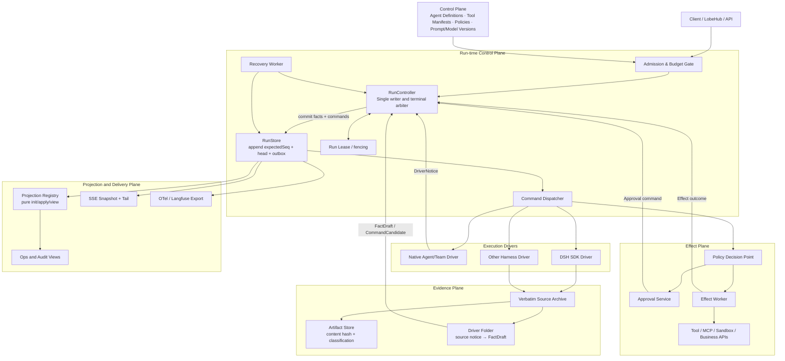
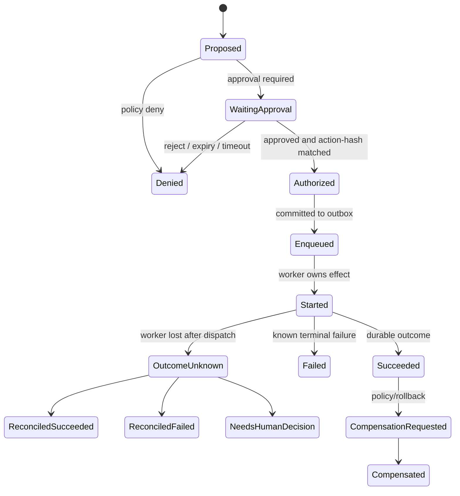

# LCA 生产级业务 Agent Runtime：以事实 Journal 为核心的可恢复、可治理架构

**版本**：1.0（目标架构提案）  
**作者**：Manus AI  
**适用范围**：LCA Gateway、Agent/Team、多执行 Driver、DSH SDK 适配、LobeHub SSE、运维与审计系统  
**决策状态**：建议拆分为 ADR 后分阶段落地

---

## 摘要

现有方案的判断是正确的：**LCA Journal 应继续是产品层的叙事与审计真相，DeepSeek Harness（DSH）只能是可插拔执行 Driver，而不能成为并列真相源。** DSH 最值得借鉴的不是 Cordis、Session 类或其编码 Agent 词表，而是三个可迁移的边界：单一追加入口、提交后观察者、显式耐久检查点；此外，其纯函数投影注册表也值得保留。[1] [2] [3] [4]

但如果 LCA 的目标是长期运行、多智能体协作、可调用真实业务工具并接受人审的 **业务 Agent Runtime**，仅新增 `JournalWriteCoordinator`、`DriverLogFolder` 与 `ProjectionRegistry` 还不够。核心缺口并非“日志更完整”，而是以下四类运行时语义尚未成为一等公民：**命令与事实的分离、外部副作用的幂等与 Outbox、持久化生命周期与唯一终态仲裁、策略/审批/配置谱系。**

本方案的关键改写如下。

> **逻辑 Run Fact Log 是真相；JSONL 是其一种后端或可审计导出物；投影、OTel、SSE、Langfuse、原始 DSH archive 都是派生物。**
>
> **任何不可逆副作用必须先提交“已授权的意图”，再由带稳定幂等键的 Effect Worker 执行；绝不让 Agent/Driver 直接跨越工具副作用边界。**

这一定义既保持 ADR-0037 的 “Journal-as-Truth” 精神，又把它提升为可多进程、可恢复、可审计、可扩展的生产架构。

---

## 1. 评审结论：应保留什么、必须调整什么

### 1.1 对现有提案的总体评价

你当前文档对 **DSH 是 execution driver 而非产品架构替代品**、**保留原始 upstream archive**、**以 fold 代替散落 mapping**、**显式传递 hub**、**投影注册表** 和 **中断闭合** 的判断，均是正确方向。尤其是 DSH 将抽象能力、具体实现和装配分离为 capability seam 的做法，适合作为 LCA 的模块边界参照，而不适合作为 Python 侧的直接实现模板。[1]

不过，当前目标图仍将 `JsonlJournalProjector` 放在普通 projector 的同一扇出链路内，并由 `ExecutionJournal.record()` 先内存 append、后 fan-out。此顺序对调试日志足够，但对业务 Agent 不够严格：**UI、OTel 或 Insight 可能已经观察到一个最终未持久化的事件；更严重的是，工具调用可能发生在可恢复意图尚未写稳之前。** 这不是优化问题，而是正确性边界问题。

| 维度 | 当前提案的优点 | 建议升级 | 原因 |
|---|---|---|---|
| 真相定义 | Journal 是唯一产品叙事真相 | 真相定位为 **逻辑 Run Fact Log**，物理 JSONL 只是后端之一 | 生产场景需要事务性 run head、lease、outbox、审批和恢复，不应被单一文件格式限制 |
| 写入链路 | `record()` 是唯一入口 | 拆为 `RecordFact`、`PlanCommand`、`PublishStream` 三类明确入口 | 避免把事实、意图和 UI delta 混为同一可靠性等级 |
| 持久化 | Coordinator + `flush()` | `RunStore.append()` 成为**提交点**；Coordinator 仅承担批处理与后端序列化 | 先提交、后观察，才能保证“看见即已提交” |
| Driver | DSH archive + Folder | 所有 Driver 均经统一 `DriverPort → Notice → Folder → FactDraft` 边界 | Driver 可替换、可回放、可灰度比较 |
| 副作用 | Tool 作为 Journal 事件的一部分 | 引入 **Effect Ledger + Transactional Outbox + Idempotency Key** | 解决崩溃后重复调用、结果未知、人工审批与补偿 |
| 生命周期 | gateway/driver 两方均可能 finish | `RunController` 是**唯一终态仲裁者**；Driver 只报告退出事实 | 根除双 finish 和 run status 漂移 |
| 投影 | Projector 与 Registry 过渡并存 | 规定 export projector 与 pure read-model fold 的契约和检查点 | 防止 UI、Console、SSE 重复解释事件词表 |

### 1.2 最重要的架构原则

以下原则应写入新的 ADR，并用测试和接口而非约定保障。

| 编号 | 不可违反的原则 | 工程含义 |
|---|---|---|
| I1 | **先提交、后观察** | Canonical fact 在 `RunStore.append()` 成功前不得进入 SSE、OTel、投影或触发 effect |
| I2 | **一 Run 一写入仲裁者** | 并发 Agent、线程、Driver 或恢复 Worker 只能提交命令/notice，不能各自直接追加 Run log |
| I3 | **命令不是事实** | `EffectRequested`、`ApprovalRequested` 是已提交意图；`EffectSucceeded`、`ApprovalGranted` 才是发生过的事实 |
| I4 | **副作用至少一次、业务幂等** | 不承诺分布式“恰好一次”；对外调用必须以稳定 `idempotency_key` 抵御重试 [5] |
| I5 | **终态只有一个 owner** | Driver、Gateway、超时监控、取消请求均提交 signal；只有 `RunController` 可产生 Run terminal fact |
| I6 | **投影只读** | Projection/Insight 不可直接 `record()`；如需后续动作，产出 command candidate，再由策略和控制器裁决 |
| I7 | **重放不修改历史** | `replay`、`doctor` 默认纯读；修复由持有 lease 的 Recovery Worker 追加显式 repair fact |
| I8 | **配置也是证据** | 每次 run 固化 driver、模型、prompt、工具、策略、schema 的版本或内容哈希 |
| I9 | **不把推理原文当默认日志** | 原始 reasoning delta 不进入通用 SSE/业务 Journal；仅保留经策略批准的进度摘要或受限证据引用 |

---

## 2. 目标模型：把“日志”升级为业务运行时事实系统

### 2.1 四类记录，不再使用一个 tier 承担所有语义

当前的 `narrative / stream / container / mechanism / insight` tier 有价值，但它混合了**语义类型、可靠性、可见性、保留期限**四个互相独立的维度。建议将事件描述符改为多轴模型；`container` 只是事件 family，不应与 `narrative` 处在同一分类轴。

| 记录类 | 是否 Canonical | 典型内容 | 持久化与恢复要求 | 默认可见性 |
|---|---:|---|---|---|
| **Fact** | 是 | Run 生命周期、委派、决策、工具状态、策略裁决、预算状态 | 必须先持久化；可完全重放 | 按 audience 策略裁剪 |
| **Command / Intent** | 是 | 启动 Driver、请求工具 effect、请求审批、启动子 Run | 必须先持久化；由 dispatcher 消费 | ops / 审计为主 |
| **Observation** | 可选 | 机制指标、诊断、执行进度、OTel 关联 | 可采样、可降级；不驱动恢复 | ops 或 verbose |
| **Evidence / ArtifactRef** | 是引用、载荷可外置 | DSH 原始通知、文件、工具大结果、prompt 快照 | 保留不可变 hash、分类、位置与访问策略 | restricted 默认 |

每个事件还应有四个独立描述字段：`durability`（required/best_effort）、`audience`（end_user/operator/auditor/restricted）、`retention_class`、`sensitivity`。这样，SSE 选择用户可见的安全视图，OTel 选择可观测性视图，审计选择完整 canonical 视图，而不是各处重复写 `if tier == ...`。

### 2.2 运行聚合与尝试（Attempt）必须分开

业务上，一个用户请求对应稳定的 `run_id`；技术上，崩溃恢复、手工重启、worker 切换会产生多个执行 epoch。因此需要新增 `attempt_id`。`Run` 是业务聚合，`Attempt` 是拥有 lease 的执行实体。

| 标识 | 作用 | 稳定性 | 不可混用的对象 |
|---|---|---|---|
| `run_id` | 用户、业务、审计和 URL 的稳定身份 | 跨恢复稳定 | 不能表示单次 worker 生命周期 |
| `attempt_id` | 一次 worker/driver 执行 epoch | 每次恢复变更 | 不能作为业务幂等键的唯一来源 |
| `run_seq` | Canonical Run Fact Log 的连续序号 | 单 run 严格单调 | 不能与进程或 SSE 连接序号混用 |
| `event_id` | 全局唯一事件身份，推荐 UUIDv7 | 全局稳定 | 不能取代 run 内顺序 |
| `command_id` | 可投递工作项身份 | 重试稳定 | 不等同工具调用或审批 |
| `effect_id` | 业务副作用身份 | 重试稳定 | 是 idempotency key 的核心输入 |
| `process_event_id` | 运维 fan-in 事件 | 仅进程域 | 绝不冒充 `run_seq` |

推荐 envelope 至少包含 `run_id`、`attempt_id`、`run_seq`、`event_id`、`causation_id`、`correlation_id`、`parent_run_id?`、`delegation_id?`、`actor`、`occurred_at`、`recorded_at`、`schema_id`、`manifest_hash` 与 `source_ref?`。DSH 的 `sourceEventSeqs` 思路应扩展为结构化 `SourceRef`：其中包含 adapter、archive、上游序号/偏移、载荷 hash 和 folder 版本；只有这样才能在映射规则升级后保持可追溯性。[2]

### 2.3 事件信封建议

```python
@dataclass(frozen=True)
class EventEnvelope:
    event_id: UUID
    schema_id: str                 # e.g. lca.effect.requested@1
    run_id: RunId
    attempt_id: AttemptId
    run_seq: int                   # 仅由 RunStore 分配
    causation_id: UUID | None
    correlation_id: UUID
    actor: ActorRef                # user / agent / driver / policy / system
    occurred_at: datetime
    recorded_at: datetime
    manifest_hash: str             # 本次运行的可复现配置
    sensitivity: Sensitivity
    source_ref: SourceRef | None
    payload: JsonValue
```

`payload` 必须是严格 schema 校验后的 JSON 值；大文本、二进制、原始 DSH 流、工具输出和秘密信息都只作为 `ArtifactRef` 保存。DSH Session 对 durable JSON 做单次验证、快照和冻结的原则值得借鉴，但 LCA 应以 Python 的严格 schema、深拷贝和不可变 envelope 贯彻同一目标。[2]

---

## 3. 总体架构：控制面、运行面、证据面与读模型面



该图刻意让 **RunController** 位于中心，而不是让 `ExecutionJournal` 同时承担写入、扇出、生命周期、工具控制和 UI 服务。建议保留 `ExecutionJournal` 名称，但将其收敛为 `RunStore` 的应用内 facade 或改名为 `RunFactRecorder`；其唯一职责是把已经验证的 `FactDraft` 提交为 Canonical `EventEnvelope`。生命周期仲裁、命令规划和恢复应移入 `runtime/control`。

### 3.1 数据流的唯一正确顺序

对于 Canonical fact，写入必须遵循下列顺序。

```text
DriverNotice / API Command / Effect Outcome
  → validate + normalize + policy check
  → RunController produces FactDraft + CommandDraft
  → RunStore.append(run_id, expected_seq, facts, outbox) [atomic commit]
  → committed EventEnvelope(s)
  → post-commit subscriptions: projection / SSE / OTel / console
  → dispatcher executes newly committed commands
```

`RunStore.append()` 是唯一线性化点。它以 `expected_seq`、持有者 fencing token 和 run head 的比较交换来拒绝过期 worker；在事务数据库实现中，它应原子地完成事件 append、run head 更新、snapshot 指针更新与 outbox 入队。**只有 append 成功后，事件才可被 LiveTail、ProjectionRegistry 或 OTel 观察。**

对流式文本、令牌级进度和其他高频数据另设 `PublishStream` 通道。该通道只能发送显式标为 `best_effort` 的用户安全 delta，不可推进 Run 状态、触发工具、改变预算或成为恢复依据。若业务需要保留它，则异步镜像到 artifact，而不是阻塞 Canonical 提交。

---

## 4. 模块边界与核心接口

### 4.1 建议目录结构

建议将 DSH 从 `observability` 子树移出，因为它本质是**执行适配器**而非日志组件；将持久化和投影从 gateway 的组合逻辑中抽出。

```text
lca/
  contracts/
    run/
      events.py                 # EventEnvelope + Fact schemas
      commands.py               # durable Command schemas
      state.py                  # RunState / AttemptState
      manifest.py               # ExecutionManifest
      effects.py                # Effect and Tool contracts
      source_ref.py             # archive / source provenance
    ports/
      run_store.py
      driver.py
      effect_executor.py
      policy.py
      approval.py
      projection.py

  runtime/
    control/
      run_controller.py         # single writer + state transition owner
      lifecycle.py              # terminal/recovery state machine
      admission.py              # quotas, tenancy, budget
      command_dispatcher.py
      recovery_worker.py
    journal/
      recorder.py               # contract validation + envelope build
      persistence_coordinator.py
      jsonl_backend.py          # dev/single-node backend or export mirror
      postgres_backend.py       # production backend
    effects/
      effect_planner.py
      effect_worker.py
      idempotency.py
      compensation.py
    projections/
      registry.py
      checkpoints.py
      units/
    observability/
      otel_exporter.py
      console_exporter.py

  adapters/
    drivers/
      native_agent/
      dsh/
        driver.py
        archive.py
        folder.py
        mappings.py
      other_harness/
    tools/
      mcp/
      sandbox/
      business_api/
    transport/
      sse.py
      http.py

gateway/
  runs/
    api.py                      # POST command / GET snapshot / SSE tail
    composition.py              # dependency wiring only
```

### 4.2 Driver 是端口，不是 Journal 的特例

```python
class DriverPort(Protocol):
    async def start(self, ctx: DriverContext, command: StartDriver) -> AsyncIterator[DriverNotice]: ...
    async def resume(self, ctx: DriverContext, command: ResumeDriver) -> AsyncIterator[DriverNotice]: ...
    async def cancel(self, ctx: DriverContext, command: CancelDriver) -> None: ...

class DriverFolder(Protocol):
    def fold(self, notice: DriverNotice, state: FolderState) -> FoldResult:
        """返回纯 FactDraft、CommandCandidate 与新的 FolderState；不得 I/O。"""
```

`DriverContext` 是显式对象，必须携带不可伪造的 `run_id`、`attempt_id`、lease/fencing token、`ExecutionManifest`、取消信号和受限 capability client。它替代跨线程的 `ContextVar` 依赖。主 loop 内可把 ContextVar 作为诊断便利，但任何 `to_thread`、新 event loop、subprocess callback、队列 worker 和 background task 都必须只信任显式 `DriverContext`。

对于 DSH，推荐保持下列链路：

```text
DSH notification
  → verbatim archive append (带 source offset/hash)
  → DshFolder.fold(notification, folder_state)
  → FactDraft / CommandCandidate
  → RunController
  → RunStore.append()
```

`DshFolder` 必须是**可离线、确定性、版本化**的纯函数。它不直接写 Journal，不读取 gateway，不以隐藏 ContextVar 取 hub，也不调用工具。给定 archive fixture、初始 folder state 和 mapping version，输出必须完全一致。运行时和离线验证均复用同一 fold；离线工具只能生成候选 Journal 或与 live Journal 做 parity diff，绝不能静默覆盖已提交的 Canonical log。

原始 archive 的写失败需要明确定义策略：若某个 Driver 的 `archive_required=True`，失败后该 driver 必须暂停/失败并写入 `SourceArchiveDegraded`；若为可选证据，则写 `EvidenceDegraded` 后继续。不能让“archive 是可选的”变成事后无法审计的隐性降级。

### 4.3 生产持久化：RunStore 而非普通 JsonlProjector

DSH 的 `PersistenceCoordinator` 通过固定 deadline 批写、`flush` 屏障、冷恢复中断闭合和 `readFrom` 后缀读取，提供了很有价值的语义参照。[3] LCA 应吸收这些语义，但把它放在更高一级的 `RunStore` 抽象内：协调器解决写缓冲与后端串行化，**不能单独解决 run head、outbox、lease、审批和多 worker 一致性。**

```python
class RunStore(Protocol):
    async def append(
        self,
        run_id: RunId,
        expected_seq: int,
        fence: FenceToken,
        facts: Sequence[FactDraft],
        commands: Sequence[CommandDraft],
    ) -> CommitResult: ...

    async def load(self, run_id: RunId) -> RunAggregate: ...
    async def read_from(self, run_id: RunId, after_seq: int, limit: int) -> Page[EventEnvelope]: ...
    async def acquire_lease(self, run_id: RunId, owner: OwnerId) -> RunLease: ...
    async def save_snapshot(self, snapshot: RunSnapshot) -> None: ...
```

| 部署级别 | Canonical 后端 | JSONL 的角色 | 可支持能力 |
|---|---|---|---|
| 本地开发 / 单进程 | 带锁与原子 rename 的 JSONL + metadata sidecar | Canonical 后端 | 调试、replay、单 writer；不承诺跨实例高可用 |
| 单节点生产 | SQLite 或同机事务库 | journal.v1 导出 / 证据镜像 | 可靠重启、审批、outbox、受控并发 |
| 多 worker 生产 | PostgreSQL 等事务事件表 + outbox + object storage | 可检索导出 / 审计归档 | lease、fencing、水平扩展、灾后恢复 |

因此应将 `journal.v1` 定义为 **逻辑导出格式**，而不是永远等同唯一物理存储。事实的真相性来自不可变、连续、可验证的逻辑序列，而不是来自“必定是一份 JSONL 文件”。

### 4.4 Flush 的精确定义

`flush()` 不是“在 finalize 前尽量写一下”，而是一个命名明确的耐久屏障。DSH 的语义是等待已接纳监听器排空；LCA 应进一步将其分为两个层次。[2] [3]

| API | 语义 | 必须使用的位置 |
|---|---|---|
| `commit()` | Canonical facts 与 outbox 已提交到 store | 每个状态转换、工具 intent、审批、预算扣减 |
| `flush_run()` | 当前 run 已提交队列和本地导出均排空 | driver 交还所有权、attempt 结束、优雅停机 |
| `flush_observers()` | 可选 exporter/projection 已消费至指定 `run_seq` | 诊断或测试；不可成为业务正确性前提 |
| `checkpoint()` | driver 可恢复状态 + `as_of_seq` 已持久化 | 长时间等待、审批、子 run、可恢复 loop 边界 |

所有外部可见且可能收费或改变状态的动作，都应遵循 `intent commit → effect execution → outcome commit`。模型调用至少要在出站前提交 `ModelRequestPlanned` 与预算 reservation；写操作工具必须在执行前提交 `EffectRequested`。这比“只在 run 收尾时 flush”可靠得多。

---

## 5. Effect Plane：业务 Agent 必须拥有副作用账本

### 5.1 为什么日志完备仍不足以保证业务正确性

工具 worker 可能已成功调用外部 API，但在写回成功事件前崩溃；重试时运行时无法仅凭本地日志判断结果。可重试 Activity 在回执尚未写入历史时可能被重新执行，因此业务动作必须设计为幂等，并通常利用稳定的 idempotency key。[5]

LCA 不应宣称“exactly once”。正确的承诺是：**运行时至少一次投递；外部业务结果通过幂等键、查询核对或人工裁决保证至多产生一次业务影响。**

### 5.2 Effect 生命周期



每个写工具必须在 `ToolManifest` 中声明：输入 schema、风险等级、数据域、授权需求、外部 identity、超时、重试分类、幂等策略、结果核对函数、补偿能力、是否允许后台执行。对外调用的 key 建议为 `HMAC(tenant_id, run_id, effect_id, operation_version)`；不要把可猜测的 run id 直接暴露给第三方。

```text
EffectRequested(effect_id, tool, action_hash, idempotency_key_ref, policy_decision_id)
  → transactionally enqueue ExecuteEffect(effect_id)
  → EffectWorker performs call
  → EffectSucceeded | EffectFailed | EffectOutcomeUnknown
```

`ToolInvoked` 应降级为展示性/兼容性事件；真正驱动执行的 canonical 事件是 `EffectRequested`。只有 Effect Worker 有能力 token；Agent、Driver、Folder 只会**提议**调用，不能直接拿到可写业务 API 的凭据。

### 5.3 策略、审批与恢复

自动 guardrail、工具参数验证和人工审批必须在副作用的工具边界组合使用。公开的 Agent 文档同样指出，高风险工具调用应产生可恢复的同一 run interruption，并且校验应该贴近具体工具而非只放在 agent 输入/输出层。[6]

| 决策层 | 负责问题 | 输出 | 失败默认 |
|---|---|---|---|
| Admission Policy | 此请求、租户、预算、角色是否可启动 | `RunAdmitted` / `RunRejected` | 拒绝 |
| Planning Policy | Agent 提议的工具/委派是否合规 | `ActionDenied` / `ApprovalRequested` / `ActionAuthorized` | 拒绝或要求审批 |
| Tool Boundary Policy | 参数、资源、目标、时段、身份是否仍合规 | `EffectBlocked` 或可执行许可 | 拒绝 |
| Human Approval | 指定的人是否批准完全相同的动作 | 绑定 `action_hash` 的签名决定 | 超时拒绝 |
| Outcome Policy | 已知失败、未知结果、补偿和续跑如何处置 | `Retry`, `Reconcile`, `Escalate`, `Compensate` | 升级人工 |

审批记录必须绑定 `effect_id`、`action_hash`、policy version、审批人身份、批准范围、过期时间和操作预览。审批后若参数、目标、工具版本或策略发生变化，旧批准自动无效。`ApprovalGranted` 是一个 canonical fact，`ResumeRun` 是后续 command；不能把“前端按钮点了”直接等同为工具已执行。

---

## 6. 生命周期、并发与恢复

### 6.1 由 RunController 独占终态

现有的双点 `finish()` 是 P0 风险。建议将 Driver、Gateway 和 supervisor 的职责改为下表。

| 组件 | 可做 | 不可做 |
|---|---|---|
| Driver | 发出 `DriverStarted`、`DriverYielded`、`DriverExited`、notice | 直接 `RunFinished`、修改 run status |
| Gateway API | 接收 Start/Cancel/Approve/Resume command | 根据 HTTP 连接结束终结 run |
| Effect Worker | 发出 effect outcome | 按自身判断完成整个 run |
| Recovery Worker | 提交 `AttemptLost`、repair proposal、恢复 command | 无 lease 时改写任何 run |
| **RunController** | 根据已提交事实作状态转换、产生唯一 terminal fact | 绕开 RunStore 直接改数据库状态 |

推荐状态机如下。`Interrupted` 是 **attempt** 事实，不应自动伪造为全局 `RunFailed`。只有控制器根据 checkpoint、effect 状态、审批状态与恢复策略决定 run 是恢复、等待核对、取消还是失败。

```text
NEW → ADMITTED → RUNNING ↔ WAITING_APPROVAL
                     ↔ WAITING_EFFECT
                     ↔ SUSPENDED
                     ↔ RECOVERING
      → SUCCEEDED | FAILED | CANCELLED | EXPIRED | NEEDS_INTERVENTION

Attempt: CREATED → OWNED → ACTIVE → YIELDED | LOST | EXITED
```

### 6.2 单 writer + 子 Run，而不是并发写同一 Journal

多 Agent 并行不意味着允许多个 Agent 直接 append 同一个 run。一个 Run Aggregate 的 head 必须线性化；并发工作应表现为**独立 child run**，每个 child 有自己 `run_id/run_seq/attempt/lease`，父 run 只记录 `ChildRunRequested`、`ChildRunLinked`、`ChildRunCompleted` 和已验证摘要引用。这样能避免共享 `RunScope`、交错工具状态、父子 finish 竞态和无限增长的单个 Journal。

只有极短、完全内存内的 Team round 可以在父 run 中作为同一 controller 的同步步骤；一旦跨线程、跨进程、可暂停、可重试或可调用 effect，就升级为 child run。`delegation_id` 连接叙事，`parent_run_id` 连接生命周期；两者都不应用 ambient context 猜测。

### 6.3 崩溃恢复的规范路径

`doctor` 必须默认只读。它可以报告“不平衡的 Attempt、未确认的 Effect、缺失 snapshot、未知 schema”等问题，但不能在离线查看时偷偷写出 `AgentRunFinished(interrupted)`。修复由持有 lease 的 Recovery Worker 完成，并留下明确证据。

| 发现 | Recovery Worker 动作 | 不允许的动作 |
|---|---|---|
| JSONL 撕裂尾部 | 截断未完整写入的尾片段，记录 `TornTailRepaired` | 删除已提交的中段事件 |
| 运行中 Attempt lease 过期 | 追加 `AttemptLost`，检查 checkpoint | 假装 Driver 正常退出 |
| 已请求但无结果的写 effect | `EffectOutcomeUnknown`，先 reconcile 外部状态 | 盲目重放副作用 |
| 已请求但无结果的纯读 effect | 按 manifest retry policy 重试 | 直接改写旧事件 |
| 等待审批超时 | 追加 `ApprovalExpired`，进入取消/人工处理 | 继续执行旧批准的 action |
| 未知 required schema | 将 run 隔离为 `NEEDS_INTERVENTION` | 静默跳过并继续运行 |

DSH 对“冷恢复时保留已提交事件、只丢弃撕裂尾部、追加合成闭合事件”的处理是很好的参考。[3] 不过 LCA 的闭合应以 `AttemptLost/EffectOutcomeUnknown` 等更细的业务语义表达，而非一律伪造 `AgentRunFinished`。

---

## 7. Projection、SSE 与可观测性

### 7.1 Registry 只负责纯读模型

DSH 的 projection registry 把 `init/apply/view/stateVersion` 设为纯同步单元，并以“同一引用即无变化”减少无关下游工作；其 `asOfSeq` 一致切面概念非常值得 LCA 采用。[4] LCA 的 `JournalProjectionRegistry` 应拥有唯一的 post-commit 订阅，但其输出只能是 read model。

```python
class ProjectionUnit(Protocol[State, View]):
    key: str
    state_version: int
    accepted_event_kinds: frozenset[str]
    def init(self) -> State: ...
    def apply(self, state: State, event: EventEnvelope) -> State: ...
    def view(self, state: State) -> View: ...
```

| 组件类型 | 输入 | 输出 | 是否可影响 Run |
|---|---|---|---:|
| Export Projector | committed event stream | OTel、Langfuse、console、archive mirror | 否 |
| Projection Unit | committed event stream | `RunCard`、timeline、delegation graph、cost meter | 否 |
| Transport Adapter | snapshot + tail | SSE/WebSocket/HTTP DTO | 否 |
| Insight Analyzer | snapshot/evidence | `InsightCandidate` 或独立 analysis run | 仅经命令与策略裁决 |

这条规则取代“只有 InsightEngine 可以反向 record”的例外。任何例外最终都会让 read path 变成隐式写 path，破坏重放确定性。

### 7.2 SSE 协议：快照与尾流分离

推荐对外定义稳定的协议级 `RunSnapshot` 和 `RunEventFrame`，而不是让前端逐渐理解所有 raw JournalEvent。

```text
GET /runs/{run_id}/snapshot
  → { as_of_seq, run_state, card, timeline, approvals, allowed_actions }

GET /runs/{run_id}/live?after_seq={N}
  → event: run.snapshot       { as_of_seq: K, ... }      # 首连或重连可选
  → event: run.event          { seq: K+1, kind, view }   # 安全的增量视图
  → event: run.reset          { required_from_seq: ... } # gap/版本失配
```

`Last-Event-ID` 必须严格等于 **run-scoped `run_seq`**。`ProcessJournal` 可保留给运维 fan-in，但必须另用 `process_event_id`，并在端点、字段和文档层彻底禁止其冒充 run sequence。SSE payload 由 audience policy 和 frame projector 在一个单点生成；不直接转发 raw event，尤其不应默认推送 reasoning、密钥、工具大输出或受限 archive 内容。

### 7.3 OTel 与 Journal 的关系

OTel 应继续作为交换和诊断格式，而非第二真相。每个 exporter 使用 `event_id/run_id/attempt_id/effect_id` 进行关联；其失败、采样、重试或延迟不会影响 Canonical commit。应分别监控以下指标：提交延迟、write buffer 年龄、outbox backlog、effect unknown 数、lease 丢失数、projection lag、SSE gap/reset 数、archive 退化数、schema 拒绝数和每租户事件/证据成本。

---

## 8. 事件与契约治理

### 8.1 Catalog 的最小字段

`JOURNAL_CATALOG` 应从手写 emitter 清单升级为构建产物。每个 event schema 声明以下内容：

| 字段 | 说明 |
|---|---|
| `schema_id` / `version` | 例如 `lca.effect.requested@1`；版本直接可读 |
| `record_class` | Fact / Command / Observation / EvidenceRef |
| `durability` | required / best_effort |
| `allowed_actors` | agent、driver、policy、worker、system 等 |
| `state_transition` | 允许改变的 Run/Attempt 状态；无则为空 |
| `sensitivity` / `retention` | 默认数据分类和保留期 |
| `audience_policy` | 可见性策略名，不直接嵌 raw payload |
| `source_contract` | 是否须 SourceRef、可接受的 adapter |
| `compatibility` | required/ignorable/opaque-preservable |

对未知事件的规则应分级：未知 **required canonical** event 拒绝 load 并隔离 run；未知 `ignorable` observation 可跳过；未知 evidence event 保留原始 envelope 但不解释。DSH 对未知 required event 拒绝恢复、对明确 ignorable event 容忍的策略可作为参考。[2] [3]

### 8.2 执行谱系（Execution Manifest）

Run 启动时应提交不可变 `ExecutionManifestCaptured`：其中保存或引用以下内容的 content hash：Agent/Team 定义、driver 名称及版本、模型路由、system prompt、工具 manifest、策略 bundle、输入规范、事件 schema bundle、fold mapping version、代码 build SHA。任何后续调试、成本核算、回放或审计都应以该 manifest 解释事件，而不是依赖“现在部署的代码”。

### 8.3 测试金字塔

| 层级 | 强制测试 | 通过标准 |
|---|---|---|
| Contract | schema、catalog 生成、兼容性、redaction | 新事件未登记或敏感字段泄漏即失败 |
| Reducer | Projection 和 RunState fold 属性测试 | 给定同一 log，结果确定且 `as_of_seq` 一致 |
| Folder | archive fixture → FactDraft golden test | DSH live/offline fold 一致 |
| Effect | 幂等键、reconcile、补偿、审批 hash | 任意重试不产生重复业务影响 |
| Recovery | kill -9、撕裂尾部、lost lease、未知结果 | 不丢 committed fact，不盲重放副作用 |
| Transport | SSE reconnect/gap/snapshot | 无重复、无漏序、无越权字段 |
| End-to-end | 多 Agent 子 run、取消、审批、恢复 | 终态唯一、谱系完整、预算正确 |

---

## 9. 需要明确拒绝的设计

| 反模式 | 为什么不可接受 | 替代方案 |
|---|---|---|
| 将 `JsonlJournalProjector` 当普通 observer | 持久化失败后 UI/OTel 已看到“幽灵事件” | `RunStore.append()` 先提交，JSONL 变 backend/导出 |
| gateway 和 driver 都调用 `finish()` | 终态竞态、状态不一致 | `RunController` 唯一终态仲裁 |
| 任何 Agent 可直接调写工具 | 无法统一策略、审批、幂等与审计 | Command/Effect plane + capability token |
| 因为可 replay 就重试所有工具 | 已执行但无回执的写动作会造成重复业务影响 | `OutcomeUnknown → reconcile/escalate` |
| 把 DSH Session 整体搬进 LCA | LCA 是多 Agent 业务 runtime，不是单 coding harness | 只复用 driver、archive、fold 和语义模式 |
| 将原始 reasoning delta 直接存入产品 SSE | 可能暴露敏感推理、提示与工具数据，成本也不可控 | 受策略控制的 progress summary / restricted evidence |
| Projection 反向 `record()` | 读模型改变事实，重放和因果关系失真 | 产生 command candidate，由 controller 决策 |
| `/journal/live` 与 `/runs/{id}/live` 共用 seq 名称 | 运维序号污染 run 重连契约 | 强制区分 `run_seq` 与 `process_event_id` |
| `doctor` 读取时自动补写终态 | 只读诊断产生隐式历史变更 | RepairPlan + 持 lease 的 Recovery Worker |

---

## 10. 分阶段迁移路线

以下路线优先修复正确性，再扩展能力。它与原方案最大的排序差异是：**将可事务的 commit 与 effect 安全性前置于大型 Projection/UI 改造。**

### Phase 0：确立不变量并止血（P0）

这一阶段不引入新存储技术，但必须立即消除当前可见的错误路径。显式传递 `RunHandle/DriverContext`；禁止跨线程依赖 ContextVar；将 `finish()` 收口为 `RunController`；给每个 run 增加 `attempt_id`；为 DSH run 添加强制 `DriverExited` 事实。`execute_dsh_session`、native Agent/Team loop 与 gateway 只提交 notice/command，不直接终结 run。

**验收**：线程化 DSH fixture 下主 Journal 非空；运行 status 仅由同一个 reducer 从 Journal 推导；任意 Driver/Gateway 双重退出只形成一个 terminal fact；Process Journal 与 Run Journal 的字段名不再冲突。

### Phase 1：建立 RunStore 和先提交后观察（P0/P1）

将 `JsonlJournalProjector` 下沉为 `JsonlRunStoreBackend` 或 export mirror，新增 `RunStore.append(expected_seq, fence, facts, commands)`。在单节点先采用锁、head sidecar、原子写入和 `read_from`；多 worker 目标后端采用事务数据库。SSE、OTel、Console 改从 committed subscription 读取。引入 `flush_run`、`flush_observers` 与 snapshot 的明确区分。

**验收**：刻意注入持久化失败时不产生 SSE frame；`Last-Event-ID` 按 run_seq 断线重连无重复/漏失；同一 run 的过期 lease 无法 append。

### Phase 2：Effect Ledger、Outbox 与审批（P0/P1）

将所有可写工具标注 `side_effect_level`，引入 `EffectRequested → Outbox → EffectOutcome`。先覆盖支付、创建/删除、发消息、写文件、远程 shell、MCP 写操作和有计费模型调用。审批 API 改为提交 `ApproveEffect` command，绑定 action hash；将撤销、超时和 unknown outcome 纳入状态机。

**验收**：worker 在对外写 API 后、写回前被杀死时，恢复后进入 `OutcomeUnknown` 并走 reconcile，不重复写；同 effect_id 重投只产生一次外部业务效果；审批超时失败关闭许可。

### Phase 3：Driver Port、Archive 与 DSH Folder（P1）

建立统一 `DriverPort`；保留 `{run_id}.dsh.jsonl` 作为证据 artifact；把 `DshJournalProjector` 迁移成纯 `DshFolder`。为每个 mapping 固化 source ref 与 mapping version；live run 开启 archive/fold parity metrics。先把 DSH 限定在单 agent coding/execution lane，不让它伪造 Team/Delegation 语义。

**验收**：给定 archive fixture，live/offline folder 输出 bit-for-bit 等价的 FactDraft 序列；mapping 版本变更可产生明确 diff；archive 丢失策略可见且可审计。

### Phase 4：Projection Registry 与版本化 SSE（P2）

引入 `ProjectionRegistry`，首批实现 `run_card`、`tool_timeline`、`delegation_graph`、`approval_state`、`cost_budget`。定义 `RunSnapshot` wire contract，LobeHub 进入 raw event + snapshot 双读模式；完成验证后逐步减少前端事件词表解释。Projection cache 以 `(run_id, key, state_version, as_of_seq)` 检查点保存。

**验收**：从任意 snapshot + tail 复原的 UI 与全量 fold 相同；重新连接与版本失配均能回退 snapshot；Projection 没有任何直接 record 权限。

### Phase 5：多 worker、治理与运营完善（P2/P3）

上线 Postgres/outbox、lease/fencing、object store artifact、schema compatibility CI、Execution Manifest、保留与脱敏策略、run repair workflow、租户隔离和容量指标。此阶段再评估 projection cache、压缩 JSONL 与热/冷存储，而非过早引入 Zstd chunk packing。

**验收**：跨进程 failover、子 run 并行、审批等待数日、策略升级、schema 升级、证据限权访问均通过混沌测试；运行成本和 lag 有 SLO 与告警。

---

## 11. ADR 建议清单

| ADR | 决策 | 必须回答的问题 |
|---|---|---|
| ADR-0055 | Logical Run Fact Log / RunStore | 何为 Canonical；JSONL 与数据库的权威关系；append 事务边界 |
| ADR-0056 | Effect Ledger 与 Transactional Outbox | 幂等键、reconcile、补偿、unknown outcome 的统一语义 |
| ADR-0057 | RunController 与 Attempt Lease | 谁拥有终态；如何 fencing；恢复如何改变 Attempt 而非伪造 Run finish |
| ADR-0058 | DriverPort 与 Source Archive | Driver notice、folder、mapping 版本、archive 降级策略 |
| ADR-0059 | Projection/SSE Contract | snapshot/tail、run_seq、audience、projection checkpoint |
| ADR-0060 | Policy & Human Approval | action hash、过期、审批身份、fail-closed、审计字段 |
| ADR-0061 | Execution Manifest 与 Schema Governance | 配置谱系、兼容性、未知事件、脱敏与 retention |

---

## 12. 最终建议

LCA 不需要变成 DeepSeek Harness 的 Python 复刻；那会把单智能体 coding session 的概念、Cordis 插件机制、surface transcript 和 UI 协议错误地引入多智能体业务系统。相反，应该将其抽象为三个可复用的原则：**一个受控追加入口、持久化与观察解耦、纯函数读模型。**[1] [2] [3] [4]

LCA 真正应打造的是一个 **Journal-oriented Business Agent Runtime**：每个 run 都是由不可变事实驱动的聚合；每个外部动作都先被授权和持久化、再以幂等方式执行；每个恢复都明确区分“已知完成”“已知失败”和“结果未知”；每个前端和运维视图都从同一条已提交事实流折叠出来；每个 Driver 都可替换、可归档、可确定性解释。

在这个架构下，DSH 是优秀的可选执行引擎，LobeHub 是一个可演进视图，Langfuse/OTel 是导出面，JSONL 是方便审计与调试的物理表示，而 **LCA 的逻辑 Run Fact Log、Effect Ledger 和 RunController 才是不可替代的系统核心**。

---

## 参考资料

[1] [DeepSeek Harness Architecture Overview](https://deepseekdocs.com/en/docs/learn/intro/architecture)  
[2] [DeepSeek Harness `dsh-session` README](https://github.com/deepseek-ai/deepseek-harness/blob/master/packages/core/session/README.md)  
[3] [DeepSeek Harness `dsh-session-persistence` README](https://github.com/deepseek-ai/deepseek-harness/blob/master/packages/session/session-persistence/README.md)  
[4] [DeepSeek Harness `dsh-session-projection` README](https://github.com/deepseek-ai/deepseek-harness/tree/master/packages/session/session-projection)  
[5] [Temporal Activity Definition — Idempotency](https://docs.temporal.io/activity-definition)  
[6] [OpenAI Agents — Guardrails and human review](https://developers.openai.com/api/docs/guides/agents/guardrails-approvals)
