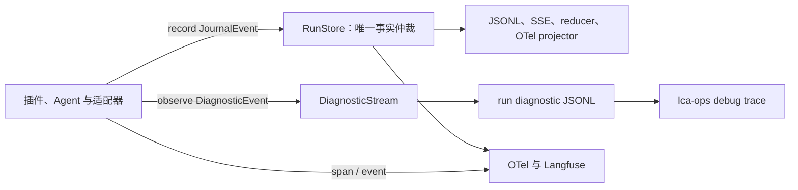

# ADR-0063：运行级诊断流——Journal 事实流之外的最小、可插件化可观测层

## 状态

**Accepted — 2026-08-20**

本决策修订 [ADR-0037](0037-journal-as-truth.md) 的「Journal 是唯一事实流」边界，并与 [ADR-0055](0055-run-fact-store.md)、[ADR-0061](0061-plugin-manifest-resolve-boot.md) 和 [ADR-0062](0062-plugin-runtime-cleanup.md) 协同。它取代此前「新建 trace logger plugin 与平行自动捕获」的提案；落地架构不引入第二事实源，也不让业务日志继续散落到 stderr。

## 背景

LCA 已有成熟的 Journal：可恢复、可重放、可归约的 agent 事实都经 `RunStore.append()` 以受控词表写入，并投影到 JSONL、SSE、OTel、Langfuse 与诊断器。Journal 必须继续是 agent 行为的唯一事实来源。

但运行期仍有 Journal 不应承载的问题：当前启用了哪些插件？哪个 Hook 被触发？哪个模型、工具、记忆或传输适配器在工作？调用携带的预览、返回摘要、耗时和错误是什么？此前这些信息部分存在于 `structlog` stderr，无法按 `run_id` 归档、检索或和事实关联；部分仅作为 OTel 属性存在，缺少稳定的人类可读文件。这造成了诊断盲区。

DeepSeek Harness 的核心启示是：能力应由可组合插件提供，而可追溯性应建立在单一 append-only 记录之上；恢复、分叉、搜索和重放都针对同一个事件流。[1] OpenTelemetry 与 Langfuse 的共识则是：外部 trace/observation 是可关联的观察投影，适合表达跨系统操作与嵌套工作，但不应反向定义业务事实。[2] [3]

> **决策前提：** Journal 记录「发生了什么、可否重放」；运行诊断记录「系统如何完成、供谁解释与排障」。二者必须关联，但不可互为来源。

## 决策

LCA 采用三平面可观测架构。Journal 为唯一事实平面；诊断流为 run-scoped 的解释平面；OpenTelemetry/Langfuse/console 为外部互操作和展示投影。三者共享 `RunScope`、`run_id`、`trace_id`、角色与脱敏策略，但各自具有独立正确性契约。

| 平面 | 主模型与入口 | 回答的问题 | 是否参与恢复/归约 | 默认持久化 |
|---|---|---|---|---|
| **Journal 事实流** | `JournalEvent` → `record()` → `RunStore.append()` | 领域事实、状态、决策、委派、工具与 LLM 的可重放结果 | **是** | `traces/runs/<run_id>.jsonl` |
| **运行诊断流** | `DiagnosticEvent` → `observe()` / `observe_operation()` → `DiagnosticSink` | 插件、Hook、适配器、预览、耗时、数据传输与异常 | **否** | `traces/runs/<run_id>.diagnostic.jsonl` |
| **外部投影** | `span()` / `event()` 与 Journal projector | 分布式 trace、指标、后端 UI、团队共享观测 | **否** | 由后端决定 |

### 最小原语

诊断层严格限制为五个原语。`DiagnosticEvent` 是不可变、版本化封套，持有关联骨架、类别、操作名、插件身份、状态、耗时、经策略处理的属性、输出与错误摘要。`DiagnosticSink` 是只读接收器，只拥有 `on_event()`、`flush()` 与 `close()` 三个生命周期方法。`DiagnosticStream` 负责单调序号、顺序扇出与单接收器故障隔离。

`observe()` 是业务代码和插件作者写入一条诊断信息的唯一显式 API；未绑定 Hub 时安全 no-op。`observe_operation()` 是带 `started`、`succeeded` 或 `failed` 状态、耗时及异常摘要的上下文管理器。二者只能描述诊断；需要成为事实、驱动恢复或改变 reducer 的内容，仍必须显式构造并 `record(JournalEvent)`。

| 字段族 | `DiagnosticEvent` 字段 | 设计目的 |
|---|---|---|
| 关联 | `run_id`、`trace_id`、`parent_run_id`、`delegation_id`、`actor`、`step` | 让 agent、团队、子代理和委派链路可联查。 |
| 身份 | `category`、`operation`、`plugin` | 以稳定枚举类别和可读操作名表达「谁在执行什么」。 |
| 状态 | `status`、`duration_ms`、`error_type`、`error_message` | 表达开始、成功、失败及端到端耗时。 |
| 数据 | `attributes`、`output`、`causation_refs` | 保存受控预览、计数、协议、标识和指向事实的引用；不保存未治理原文。 |

### 插件化接线与自动捕获

诊断能力是 `ObservabilityHub` 的一等组合部件，和 Journal projector 一样由组合根注入，但不经 `RunStore` 写入。网关在每个 run 创建时依据 `ObservabilitySettings.diagnostics_enabled` 装配 `JsonlDiagnosticSink`。`release()` 结束 Journal/live readers 后关闭诊断接收器；`dispose()` 继续只处理 OTel 和外部 bridge。单个 sink 的写入、flush 或 close 失败仅输出运维级 `structlog` 告警，不得中断 agent run。

自动诊断写入覆盖以下边界。插件清单在 run 创建时写入 `plugin.inventory`，暴露插件标识与声明的 `requires` / `provides`，但不记录配置值或密钥。`CordisHookRegistry.trigger()` 是 Hook 的唯一记录边界，写入 `hook.trigger`。`TelemetryLLMAdapter` 写入 `llm.complete`；工具的唯一事实发射器同时写入 `tool.start`、`tool.complete`、`tool.denied`；记忆适配器写入 `memory.perceive`、`memory.update`、`memory.query`；委派传输边界写入 `transport.send` 与 `transport.receive`。这些行补充解释信息，不改变既有 Journal 事件、OTel span 或 reducer 逻辑。



### 敏感数据、成本与保留

诊断的 `attributes`、`output` 与错误消息统一经 `AttributePolicy` 处理，沿用既有敏感模式脱敏与 `minimal`、`standard`、`verbose` 三档预览预算。调用者只能提供 `*_preview`、计数、协议、ID、状态和摘要；不得绕过 API 写文件，也不得把完整提示词、工具参数、响应或插件配置直接写入诊断流。`LCA_OBS_DIAGNOSTICS_ENABLED=false` 可关闭诊断文件；关闭时 API 仍维持 no-op 语义。

结构化 `structlog` 不被全面移除：Hub、exporter、网关收尾和基础设施保留它用于进程健康、后端故障及不可归属 run 的运维事件。被移除的是 `default_logging_hook` 与 `_safe_repr` 这条将 Hook 业务交互仅写 stderr 的重复旁路。该删除遵守最小原语原则：一条 Hook 业务诊断只有 `CordisHookRegistry.trigger()` 一个自动发射点。

### 运维体验

开发者使用以下命令按 run 读取诊断时间线，并可按类别或插件过滤：

```bash
./scripts/lca-ops debug trace --run-id <run_id>
./scripts/lca-ops debug trace --run-id <run_id> --category llm
./scripts/lca-ops debug trace --run-id <run_id> --plugin telemetry.llm
./scripts/lca-ops debug trace --diagnostic /path/to/run.diagnostic.jsonl
```

输出以时间、状态、类别、插件、操作和耗时为主行，并在后续行显示已脱敏的输入/输出摘要。事实诊断仍使用 `lca-ops diagnose` 读取 Journal；两条命令不可互换。

## 后果

该架构以一个小型诊断封套和一个 sink 协议替代「新建 parallel trace SSOT」的设计冲动。它让用户能够从单个文件理解 agent 的能力组合、Hook 过程、LLM/工具/记忆行为、委派与传输，却不让 debug 数据污染重放、SSE 领域语义或 Journal 词表。

新增开销限定为事件封套构造、策略处理和本地 JSONL append。诊断文件按行 flush，进程异常时已提交行不丢失；接收器失败被隔离。将来如需导出 Tempo、Datadog 或专用调试 UI，只新增 `DiagnosticSink` 实现，不修改 agent、Journal 或 reducer。

## 验证与约束

| 约束 | 自动化验证 |
|---|---|
| run/trace 关联与字段版本稳定 | `tests/test_run_diagnostics.py` 验证 JSONL 形状、单调序号与 `RunScope` 盖章。 |
| 敏感预览不会泄露 | 诊断测试验证 API key 经过同一 `AttributePolicy` 脱敏。 |
| 生命周期与容错 | Hub 的 `release()` 关闭 sink；既有网关测试继续约束 reader 先于 exporter 关闭。 |
| Hook 无 stderr 旁路 | Hook 测试验证 `CordisHookRegistry.trigger()` 写结构化诊断；协议测试删除废弃日志器契约。 |
| 可读性与筛选 | CLI 测试验证 `lca-ops debug trace` 渲染和 `--category` 过滤。 |
| 边界纪律 | `tests/test_observability_boundary.py` 继续禁止包外绕过观测包根，禁止未登记 Journal 事实发射。 |

## 被否决的方案

| 方案 | 否决原因 |
|---|---|
| 将 trace-only 数据塞入 Journal | 违反 ADR-0037，扩大事实词表、replay 负担与 SSE 产品面。 |
| 让 `structlog` 继续作为插件业务日志主通道 | 无 run 文件、关联不可查询，不能与事实和外部 trace 稳定联查。 |
| 把完整 OpenTelemetry SDK 当作第二事实存储 | OTel 是互操作 trace 模型而非 agent 领域事实源；它仍应是投影。 |
| 每个插件手写 JSONL 或自建 logger | 破坏字段、脱敏、保留与生命周期一致性，产生不可治理旁路。 |
| 保留 `default_logging_hook` 兼容层 | 它只保留重复机制和无 run 关联 stderr 噪音，违背 ADR-0062 的「删除兼容第二轨」原则。 |

## 参考

[1]: https://deepseek.com/harness/en/ "DeepSeek Harness developer preview: Everything is a plugin"
[2]: https://opentelemetry.io/docs/concepts/signals/traces/ "OpenTelemetry: Traces"
[3]: https://langfuse.com/docs/observability/data-model "Langfuse: Core Concepts"
