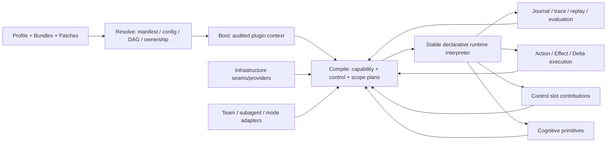

# LCA 插件能力布局详细实施计划

## 0. 计划元信息

| 项目 | 内容 |
|---|---|
| 目标仓库 | `smartlijingyang-sudo/layered-cognitive-agent` |
| 当前基线 | `main`，当前已包含 `ccbcde5d`：DeepSeek Harness 插件布局研究报告 |
| 参考架构 | DeepSeek Harness / Cordis 的插件树、capability seam、profile/bundle layering、事件扩展与 append-only session log |
| LCA 约束 | 六阶段认知闭集、Reducer 单写、Journal 事实源、CommandEnvelope 执行窄门、声明式控制投影、ScopePlan、权限单调收缩 |
| 计划性质 | **实施设计计划**，本文件不直接修改生产代码 |
| `superpower` skill | 当前环境未发现名为 `superpower` 的 skill；本计划使用等价的深度规划流程生成 |

## 1. 总体目标

将 LCA 从“具备插件外壳的 Agent 组装框架”推进为“能力边界、治理边界、运行时边界和证据边界均可编译、可替换、可审计、可恢复的 Agent Harness”。

最终应满足下面的替换性定义：

> **替换一个非宪法能力时，只新增或替换一个 plugin、provider、contribution、bundle 或 profile patch，不修改相邻的 runtime interpreter、composer、gateway 分支和状态唯一写入口。**

该目标不等于让每个 Python 文件都拥有 `@plugin`。纯数据模型、协议实现内部 helper、六阶段闭集解释器和安全不变量可以留在内核；但凡会影响 Agent 的行为、权限、生命周期、外部效果、模型可见上下文或证据链，就必须存在明确的 capability/registry/plan 边界。

## 2. 非目标与不可改变的架构宪法

本计划不建议把 LCA 改造成 DeepSeek Harness 的源码复制品，也不建议将所有 control slot 变成新的 phase。六阶段 `perceive → think → act → reflect → remember → stop` 仍是固定语义闭集；插件只能替换阶段执行器、阶段边、阶段内部控制投稿和运行后端，不能通过配置发明任意第七阶段。

下列约束必须在所有阶段保持不变：

| 不变量 | 强制要求 |
|---|---|
| State 单写 | Sensor、Gate、Brain、Body、EffectHandler 不得直接修改 `AgentState`；所有状态变更必须形成 `RunDelta` 并经过 DeltaHandler/Reducer。 |
| 世界效果窄门 | 文件、网络、进程和外部系统效果必须经过 `CommandEnvelope`、grant、scope、effect class、idempotency key 和 EffectHandler。 |
| Journal 事实源 | 模型可见输入、决策、命令、效果 receipt、delta、checkpoint 和恢复边界必须可从事实流重建。 |
| 权限单调性 | 子 Agent、子 scope、Team member 和 Creator artifact 不得通过组合获得父级没有的权限。 |
| Deny 单调性 | authorize、safe-boundary、budget 等治理结果只能收紧，普通插件不得把拒绝改写为允许。 |
| Plan 绑定 | run 的实际能力以不可变 `CompiledRunPlan` 为准；运行中不得悄悄替换 plan、provider 或权限合同。 |
| 生命周期可逆 | plugin setup 中的注册、监听、任务、连接和资源都必须有可验证的 disposer。 |

## 3. 当前基线判断

当前 HEAD 已经完成了一批关键基础工作：base bundle 中存在 effect/delta handler seam/provider；declarative phase graph 中的 11 个 control slot 已拆为独立插件；web-app bundle 中已经装载 action-handler seam/provider；component registry 已拆成独立 contributor；loop driver 具备 registry 选择路径。

剩余问题集中在“声明了 capability，但仍由相邻代码选择具体实现”的位置。计划按照以下优先级处理：

| 优先级 | 当前问题 | 目标 |
|---:|---|---|
| P0 | 生产 runtime 仍允许具体 fallback，缺失 binding 可能延迟到 turn 才暴露 | 生产 profile 进入 runtime 前必须完成完整 binding 校验；fallback 仅限显式 test/null profile |
| P1 | Action catalog 仍保留固定 `_SCOPE_ACTIONS` 和默认 registry builder | 将 action authority、handler 选择与 scope 许可提升为 compiled plan 数据 |
| P1 | PerceiveComposer 固定使用 stop rule `default` | stop rule 由 AgentSpec/profile/compiled plan 显式选择 |
| P1 | TeamComposer 直接构造 shared memory、member invoker、team transport | Team 基础设施拆为独立 capability 选择轴 |
| P2 | gateway mode 仍存在产品分支和 adapter fallback | `run_mode_registry` 或等价 mode provider 承载 mode 选择 |
| P2 | Evidence vocabulary 尚未完全统一覆盖模型可见输入和所有外部效果 | 统一 Journal/EventDescriptor/EffectReceipt/plan_ref 追踪合同 |
| P2 | 替换性测试多于存在性测试，但尚缺若干跨边界替换测试 | 建立“只增插件、不改解释器”的结构和行为门禁 |

## 4. 目标目录与角色布局

建议逐步将目录语义收敛为以下结构。迁移期间可以保留旧路径，通过 re-export 或兼容导入完成渐进迁移；不应一次性进行全仓库目录重命名。

```text
lca/
├── contracts/                         # 宪法、Protocol、typed atoms、plan 数据结构
├── layer0_infra/                      # 低层基础设施纯实现与适配工具
├── layer1_cognitive/                  # 认知领域纯实现；不得直接写 state
├── layer2_runtime/                    # 稳定解释器、Reducer、六阶段闭集
├── layer3_agent/                      # Agent/Team 领域模型与协作纯实现
├── plugins/
│   ├── seam_definitions/               # capability/service/registry 的 owner
│   ├── providers/                      # seam 的具体实现注册或 factory
│   ├── primitives/
│   │   ├── cognitive/                  # sensor/brain/reasoner/critic/memory policy
│   │   ├── execution/                  # body/tool/action/safe executor
│   │   └── organization/               # strategy/role/subagent/team adapter
│   ├── control_contributions/          # 一个 control slot 一个 plugin
│   ├── phase_executors/                # 每个 phase executor 独立 capability
│   ├── phase_edges/                    # graph edge/recovery edge
│   ├── loop_drivers/                   # run-loop driver registry/provider
│   ├── evidence/                       # journal/tracer/fact reader/scorer/replay
│   ├── bridges/                        # MCP/A2A/外部工具/UI/外部运行时适配
│   ├── modes/                          # solo/team/creator/research/code adapter
│   └── internal/                       # 明确不需要独立替换的 helper
├── harness/
│   ├── profile/                        # resolve/boot/compile/scope
│   └── plugin_api.py                   # 声明、审计上下文、manifest
└── gateway/                            # HTTP/OpenAI payload/生命周期；不拥有业务 mode 选择
```

目录不是唯一事实源。每个 plugin 的真实语义仍由 `id`、`provides`、`requires`、`implements`、`layer`、`kind`、`effects`、`contributes`、`functional_group`、`logic_address` 和 `contract` 决定。

## 5. 目标 capability 图



依赖方向必须满足：低层 seam 先定义，provider 依赖 seam，primitive/consumer 依赖 provider 暴露的协议，composer 只消费 compiled capability，runtime 只解释 plan 和 typed result。任何高层插件反向 import gateway 具体实现或低层插件直接持有高层对象，都应被门禁拒绝。

## 6. 实施工作流与文件级任务

### W0：建立基线、诊断和迁移护栏

**目标。** 在改动行为前，把当前 profile、bundle、plugin manifest、capability owner、layer edge、control plan、scope plan 和 runtime closure 固化为可比较基线。

**主要文件。** `scripts/check_plugin_capability.py`、`scripts/check_plugin_typing.py`、`scripts/check_protocol_impl.py`、`tests/test_plugin_alignment.py`、`tests/test_plugin_tree_single_owner.py`、`tests/architecture/test_declarative_production_closure.py`、`docs/adr/0074-implementation-audit.md`。

**任务。** 增加结构快照命令，输出默认 profile 的插件树、capability owner、contributor、scope、control slot、phase executor、effect/delta handler 和 mode adapter。将结果作为 golden fixture，而不是只统计 `@plugin` 文件数量。为每项 direct construction/fallback 建立 allowlist，allowlist 必须携带理由、scope 和移除目标。

**验收。** 同一 profile 在本地和 CI 中生成稳定的 `plan_ref`；新增 plugin 但未进入 bundle 时不会被误判为运行能力；未声明 capability、重复 owner、逆向 layer 依赖和不可清理注册均会在静态门禁阶段失败。

### W1：收紧 Profile → Resolve → Boot → Compile 主链

**目标。** 让生产运行的所有关键依赖都由 profile 和 compiled plan 明确提供。

**主要文件。** `lca/harness/profile/resolve.py`、`lca/harness/profile/boot.py`、`lca/harness/profile/plan_compiler.py`、`lca/contracts/protocols/capability_plan.py`、`lca/contracts/protocols/declarative_phase_graph.py`、`lca/contracts/protocols/scope_plan.py`、`lca/contracts/protocols/plan.py`。

**任务。** 为 capability binding 增加 `required_in_production`、`fallback_policy`、`owner_kind`、`scope` 和 `provenance`。Resolve 阶段只负责结构解析和依赖合法性；Compile 阶段负责判断某项 binding 是否满足当前 mode/run 的要求。若声明式 runtime profile 缺少 reducer、topology、phase executor、effect handler、delta handler、control slot 或 evidence sink，则在 boot/compile 阶段失败。将 test/null profile 的 fallback policy 显式写入 profile，而不是由类构造函数默认值隐式触发。

**依赖。** 依赖 W0 的基线与 snapshot；会影响 W2–W6 的所有 consumer。

**验收。** `web-standard`、`standard-solo`、`standard-team`、`coding-agent`、`hitl-loop` 等 golden profile 均能生成完整 compiled plan；缺失 provider 的负向测试在启动前失败；plan provenance 能定位到具体 bundle、plugin 和 config patch。

### W2：完成 Runtime binding 与 Effect/Delta/Reducer 三段式边界

**目标。** 把 runtime interpreter 固定为稳定内核，把可变化行为全部通过 binding 注入。

**主要文件。** `lca/layer2_runtime/runtime_loop.py`、`lca/layer2_runtime/declarative_runtime.py`、`lca/layer2_runtime/reducer.py`、`lca/layer2_runtime/loop_topology.py`、`lca/plugins/providers/effect_handlers.py`、`lca/plugins/providers/delta_handlers.py`、`lca/contracts/protocols/effect_handler.py`、`lca/contracts/protocols/delta_handler.py`、`lca/contracts/protocols/reducer.py`。

**任务。** 将 `CognitiveRuntime` 的 constructor fallback 分成两个入口：生产入口只接受完整 `RuntimeBinding`；测试入口可显式构造 `NullRuntimeBinding` 或 `TestRuntimeBinding`。`DeclarativeRuntimeDriver` 不得从 context 自行寻找具体 provider。EffectHandler 接收带 grant/scope/effect/idempotency 的 `CommandEnvelope`，返回可持久化 `EffectReceipt`；DeltaHandler 接收 typed `RunDelta`，只生成 reducer 可接受的投影操作；Reducer 继续是唯一状态写入者。

**验收。** 替换一个 effect handler 或 delta handler 时不修改 runtime interpreter；重复 idempotency key 的效果只产生一个 receipt；恢复和重放在相同 `plan_ref` 下产生等价状态；直接调用 `state.update`、绕过 envelope 或绕过 receipt 的插件测试失败。

### W3：完成 ActionHandler 与 Execution capability 迁移

**目标。** 消除 action catalog 中隐藏的实现选择，使 Decision → ActionHandler → CommandEnvelope → EffectHandler 形成可观察链路。

**主要文件。** `lca/layer1_cognitive/body/action_catalog.py`、`lca/layer1_cognitive/body/simple_body.py`、`lca/plugins/composer/plan_composers.py`、`lca/plugins/seam_definitions/action_handler.py`、`lca/plugins/providers/action_handlers.py`、`lca/contracts/models/core/execution.py`、`lca/contracts/models/core/approval.py`、相关 `tests/contract/test_action_registry.py`。

**任务。** 将 `_SCOPE_ACTIONS` 改造成 typed `ActionAuthorityPolicy`，由 profile/role/scope 编译得到；action handler registry 只负责按 action type 解析处理器，不负责偷偷扩大允许集合。`BodyComposer` 只接收 compiled action registry、tool bindings、safe executor 和 transport binding。默认 handler 可以由 bundle 提供，但不得在 `build_default_action_registry()` 内部重新注册同一组实现。每个 handler 必须声明输入 Decision、输出 CommandEnvelope/Observation、effect class、所需 grant 和失败 receipt。

**验收。** 新增 `ActionType` 和 handler 只增加 contract、plugin、bundle entry 和测试，不修改 BodyComposer；不同 scope 下 action authority 测试能证明权限只收紧；ActionHandler、EffectHandler 和 DeltaHandler 的失败路径均有 event/receipt 可重放。

### W4：完成 ControlPlane 与 PhaseGraph 的细粒度治理

**目标。** 保持六阶段闭集，同时让每个 control slot 独立、可组合、可验证。

**主要文件。** `lca/plugins/control_contributions/*.py`、`lca/contracts/protocols/declarative_phase_graph.py`、`lca/contracts/protocols/plan.py`、`lca/harness/declarative/compiler.py`、`lca/layer2_runtime/declarative_runtime.py`、`bundles/declarative-phase-graph.yaml`、`tests/declarative/test_control_contributions.py`、`tests/plan/test_plan_compiler.py`。

**任务。** 统一每个 contribution 的 typed input/output、`order`、`activation`、`aggregation`、`failure_mode`、`authority`、`reads`、`emits` 和 `effect_class`。对 authorize、budget、constrain、safe-boundary 使用单调收紧聚合；对 observe 使用只读语义；对 perceive.context 要求来源 provenance；对 remember.admit 要求 memory scope；对 stop.decide 要求能解释停止原因。将 phase edge/recovery edge 的触发条件纳入 plan hash，避免同一个 plan_ref 隐含不同恢复图。

**验收。** 只替换 `control.act.budget` 不影响其他 slot；重复、冲突和环依赖按确定性规则处理；任何普通 contribution 都不能解除已产生的 deny；recovery edge 次数、预算和停止条件都可以从 plan/evidence 还原。

### W5：清理 Perceive/Think/Remember/Stop 组合器中的隐式选择

**目标。** 让认知组合根只解释 plan，不用固定名字选择业务策略。

**主要文件。** `lca/plugins/composer/plan_composers.py`、`lca/plugins/composer/plan_composition_support.py`、`lca/plugins/composer/runtime_factory.py`、`lca/plugins/registries/*`、`lca/contracts/protocols/plan.py`、`lca/contracts/models/core/stop.py`。

**任务。** 在 AgentSpec 或 compiled plan 中加入显式的 `stop_rule_binding`、`memory_binding`、`state_store_binding`、`perceive_hub_binding`、`reducer_binding` 和 `topology_binding`。Composer 通过 binding resolver 获取实现；若没有 binding，生产 profile 失败，测试 profile 明确写 `null`。把 `resolve_brain`、`resolve_memory`、`resolve_observability` 等 helper 分成“解析 plan binding”和“构造最终对象”两层，避免 helper 直接导入默认类。

**验收。** 替换 stop rule 不需要修改 PerceiveComposer；替换 memory/state store 不需要修改 runtime；Composer 的单元测试只使用 Protocol fake，不依赖默认 provider；默认策略的选择全部可在 profile diff 中观察。

### W6：拆分 Team 组织能力与 mode adapter

**目标。** 使 Team 的策略、成员调用、transport、shared memory、subagent 和 mode 都能分别替换。

**主要文件。** `lca/plugins/composer/plan_composers.py`、`lca/layer3_agent/member_invoke.py`、`lca/layer1_cognitive/memory/team_shared_memory.py`、`lca/plugins/composer/team_transport.py`、`gateway/runs/runnable_assembly.py`、`gateway/modes.py`、`lca/contracts/protocols/*team*`、`lca/contracts/capabilities.py`。

**任务。** 新增并稳定化以下 capability：`team_shared_memory`、`member_invoker`、`team_transport`、`team_stage`、`run_mode_adapter`。TeamComposer 只接收这些 binding，并根据 TeamSpec 生成 TeamAssembly；不得直接实例化 `TeamSharedMemoryStore`、`TransportMemberInvoker` 或调用固定 `build_team_transport`。为 mode adapter 定义 `ModeDefinition`，至少包含 mode id、tool grant、persona sections、composer set、team policy、evidence policy 和 allowed transitions。gateway 只解析请求、鉴权、查找 mode provider 并转发。

**验收。** 新增 A2A transport、队列 transport 或远程 invoker 只新增 provider/bundle；替换 shared memory 不需要修改 TeamComposer；新增 mode 只增加 mode plugin 与 profile entry，不修改 `gateway/modes.py` 的业务分支；子 Agent 的 grant 经过父 scope 子集验证。

### W7：统一 Session、Journal、Trace、Replay 和 Evidence vocabulary

**目标。** 借鉴 DeepSeek Harness 的“模型可见即已记录”原则，让所有可见输入和真实效果都可重建。

**主要文件。** `lca/contracts/models/observability/*`、`lca/contracts/models/core/event.py`、`lca/plugins/seam_definitions/observability/*`、`lca/plugins/providers/*journal*`、`lca/plugins/providers/*fact*`、`lca/plugins/providers/*tracer*`、`tests/test_journal_reducer_apply_delta_equivalent_to_fold_events.py`、`tests/test_event_descriptor_registry_wiring.py`。

**任务。** 建立统一事件目录，至少覆盖 `PromptSectionAdded`、`ToolSchemaExposed`、`ContextInjected`、`DecisionProposed`、`CommandIssued`、`EffectReceiptRecorded`、`RunDeltaApplied`、`CheckpointCreated`、`SubagentDispatched`、`PlanCompiled` 和 `RunResumed`。每类事件声明 producer、consumer、持久化与回放策略。将 `plan_ref`、plugin id、scope、authority grant、effect class、idempotency key 和 artifact revision 纳入相关事件 metadata。Trace、FactReader、Scorer、UI 和诊断工具从同一事实流派生，不各自维护第二套运行真相。

**验收。** 给定 session log、profile patch 和 plugin revision，可以重建模型看到的 prompt/tool/context；给定 command/effect receipt，可以解释外部效果是否执行、是否重复、为何被拒绝；fork、resume、replay、run diff 和 scorer 使用同一事件词汇。

### W8：Creator、Artifact 和插件演化治理

**目标。** 让“创建新插件”本身也遵守相同的 capability、scope、evidence 和验证边界。

**主要文件。** `lca/plugins/creator*`、`lca/plugins/providers/artifact*`、`lca/contracts/models/*artifact*`、`bundles/scenario-cordis-creator.yaml`、Creator 相关测试。

**任务。** 将 inspect、author、validate、promote、rollback 映射为明确 artifact 状态机；artifact 必须绑定 source digest、manifest digest、target profile、scope、authority 和 verification result。实验 scope 中禁止 world/filesystem/network 效果；promote 必须重新 resolve、boot/shape-check、compile 和替换性测试。Artifact 的 active/retired 迁移都要写入 evidence。

**验收。** Creator 不能凭自身 prompt 获得 promote 权限；未经验证的 plugin 不能进入 active profile；回滚后插件注册、工具、事件监听和后台任务都被撤销；artifact provenance 可定位到具体提交和 plan_ref。

## 7. Bundle/Profile 迁移方案

建议使用以下 bundle 目标结构，避免一个 provider 聚合跨越多个语义领域：

| Bundle | 负责内容 | 不负责内容 |
|---|---|---|
| `base-infra` | seam、基础 provider、凭据、文件、sandbox、state、transport | Brain、Team strategy、产品 mode |
| `evidence-default` | journal、tracer、fact reader、scorer、checkpoint | 真实世界效果执行 |
| `cognition-standard` | sensors、perceive hub、brain、reasoner、critic、memory policy | authorize、budget、safe boundary |
| `governance-safe` | 11 个 control slot 默认 contribution | 工具具体实现、Team transport |
| `execution-local` | tools、body、action handlers、effect/delta handlers、安全执行器 | gateway mode 选择 |
| `organization-team` | team strategy、role、stage、invoker、transport、shared memory | 基础 LLM/file/sandbox |
| `creator-authoring` | artifact、inspect/author/validate/promote/rollback | 默认业务工具集合 |
| `mode-solo` / `mode-team` / `mode-creator` / `mode-research` / `mode-code` | mode adapter、tool grant、persona、composer set、evidence policy | 重新实现底层能力 |

Profile 只负责选择 bundle 和提供环境/场景参数。结构性 capability 进入 bundle；用户差异进入 patch；某次 run 的权限和 provider 绑定进入 compiled plan。patch 不得修改 plugin 的 `provides`、`requires`、`layer`、`kind`、`$module` 等结构字段。

## 8. 测试矩阵

| 测试类别 | 必测内容 | 目标文件/目录 |
|---|---|---|
| Manifest 形状 | typed setup、Config extra forbid、provides/requires 一致性、effect/class 声明 | `tests/harness/`, `tests/test_plugin_alignment.py` |
| DAG 与 owner | 重复 owner、缺失 capability、逆向 layer、循环依赖、disabled provider | `tests/profile/`, `tests/test_plugin_tree_single_owner.py` |
| Runtime closure | phase executor、topology、reducer、effect/delta、control/evidence binding 完整 | `tests/architecture/`, `tests/declarative/` |
| 替换性 | 替换单个 phase、control slot、action handler、effect handler、delta handler 不改 interpreter/composer | 新增 `tests/substitutability/` |
| Authority | action scope、tool grant、child subset、Team member authority、Creator promote | `tests/harness/`, `tests/team/`, `tests/creator/` |
| Effect safety | envelope、approval、sandbox、idempotency、receipt、重复执行 | `tests/layer2_runtime/`, `tests/e2e/` |
| Replay | session log → prompt/tool/context/effect/state reconstruction | `tests/replay/`, `tests/journal/` |
| Team | strategy、transport、invoker、shared memory 独立替换与清理 | `tests/team/`, `tests/test_team_chain_cleanup.py` |
| Gateway | 新增 mode 只改 plugin/profile，路由与 payload 稳定 | `tests/test_architecture_gateway.py`, `tests/gateway/` |
| Lifecycle | setup/teardown、失败半启动回收、后台任务、监听器撤销 | `tests/test_profile_lifespan*.py` |
| Negative tests | 绕过 capability、直接写 state、绕过 envelope、解除 deny、无证据注入 | `tests/security/` |

最关键的测试不是“插件是否可以 import”，而是以下六类替换性断言：

1. 替换一个 `phase_executor`，Interpreter 的代码和其他 phase 不变。
2. 替换一个 `control.act.budget`，其余 control slot 的排序、语义和结果不变。
3. 替换一个 ActionHandler，BodyComposer 不变，且 command/effect/receipt 链路仍闭合。
4. 替换一个 EffectHandler 或 DeltaHandler，Runtime 不变，replay 仍得到等价结果。
5. 替换 Team invoker、transport 或 shared memory，TeamComposer 不变。
6. 新增 run mode 只增加 plugin/profile entry，不修改 gateway mode 分支。

## 9. 迁移顺序与依赖关系

```text
W0 基线与门禁
  ↓
W1 Resolve/Boot/Compile 收紧
  ↓
W2 Runtime + Effect/Delta/Reducer
  ↓
W3 Action/Execution 三段式
  ↓
W4 Control/PhaseGraph 治理
  ↓
W5 Composer 隐式选择清理
  ↓
W6 Team/Mode capability 化
  ↓
W7 Evidence/Replay 统一
  ↓
W8 Creator/Artifact 演化治理
```

W2 与 W3 可以在接口定义阶段并行设计，但实际合并顺序应先完成 W2 的 runtime binding，再让 W3 的 ActionHandler 输出进入该 binding。W4 可与 W2 并行补齐 typed contract，但必须在 W1 的 plan validation 完成后进入默认 profile。W6 依赖 W5，因为 TeamComposer 需要先统一通用 composition binding。W7 应从 W1 开始建立事件字段，但在 W2–W6 完成后再执行全量 vocabulary 收敛。W8 最后落地，因为 Creator 的 promote 必须调用完整 resolve/boot/compile/test 链。

## 10. 风险、回滚与决策点

| 风险 | 表现 | 缓解方案 | 回滚方式 |
|---|---|---|---|
| 生产 fallback 被误删 | 测试或旧 profile 无法启动 | 增加显式 test/null profile；生产与测试 constructor 分离 | 保留 test-only fallback，不恢复生产隐式 fallback |
| capability 数量爆炸 | plugin、registry 和 patch 难以理解 | 只有真正可替换/可治理能力才建 seam；纯 helper 放 `internal/` | 合并无独立替换价值的薄 plugin |
| provider 聚合回潮 | 一个 provider 拥有多个跨域实现 | contributor 单一语义职责；bundle 负责集合 | 保留 preset bundle，不合并 provider 行为 |
| ControlSlot 语义冲突 | 多插件顺序不确定或 deny 被放宽 | typed aggregation、稳定排序、单调聚合、冲突启动失败 | 禁用冲突 contributor，回到上一个 plan_ref |
| plan 与 runtime 不一致 | compile 后 provider 被替换 | binding 带 plan_ref/revision；运行时拒绝不匹配 | resume 使用原 plan_ref 或显式迁移计划 |
| Team 权限扩大 | 子 Agent/Team member 获得额外 grant | 编译时检查 grant 子集和 effect policy | 拒绝 assembly，不进入运行态 |
| Evidence 开销过高 | session log、trace、receipt 膨胀 | inline/spill policy、采样只作用于 telemetry，不影响事实日志 | 降低 telemetry，不关闭核心事实事件 |
| 目录迁移破坏导入 | 旧测试或外部包路径失效 | 先新增目标路径和 re-export，再逐步迁移调用方 | 保留旧路径兼容层并记录到迁移清单 |
| CI 缺少测试依赖 | 本地无法运行 pytest | 在 CI 明确安装测试依赖并锁定版本；开发容器提供统一入口 | 不以未执行测试冒充通过，阻断合并 |

需要在实施前明确的三个决策点是：生产 profile 是否允许任何 fallback、`run_mode` 是放在 L3 organization 还是 L4 gateway adapter、以及完整 session facts 是否永远持久化而仅对外部 telemetry 做采样。推荐答案分别是：生产不允许隐式 fallback；mode 语义放 L4 adapter、gateway 只转发；核心事实永远持久化、telemetry 可以采样。

## 11. Definition of Done

当以下条件全部满足时，才可宣称 LCA 达到 DeepSeek Harness 式“能力树可组合”目标：

| 类别 | 完成标准 |
|---|---|
| 结构 | 所有生产 capability 都有唯一 seam/registry owner、provider/contributor、consumer 和 profile binding。 |
| 运行 | 默认生产 profile 在 boot/compile 阶段验证完整 runtime closure，不依赖隐式具体类 fallback。 |
| 替换 | phase、control、action、effect、delta、Team transport/invoker/shared memory、run mode 均有替换性测试。 |
| 权限 | action authority、effect grant、scope、child subset 和 mode tool set 均从 compiled plan 得到，并且只能单调收紧。 |
| 证据 | 模型可见输入、真实效果、状态 delta、checkpoint、恢复和 subagent 调度均能从统一事件流重建。 |
| 生命周期 | 插件 teardown 后注册、监听、后台任务、连接和临时文件均被清理。 |
| 演化 | Creator 产生的插件必须经过 artifact 状态机、验证、plan 编译和 promote 闸门。 |
| 文档 | 每个 capability 有 protocol、provider、consumer、scope、effect、evidence、replacement test 和 owner 文档。 |
| CI | 静态门禁、负向安全测试、golden profile、替换性测试和 replay 测试均纳入默认 CI。 |

## 12. 建议第一批实际提交拆分

为了降低一次改动范围，建议将实施拆成以下提交序列：

| Commit | 内容 | 预期影响 |
|---|---|---|
| C1 | 增加 runtime closure snapshot 与 fallback allowlist | 仅测试/诊断，无行为变化 |
| C2 | 引入显式 `RuntimeBinding` 与生产/test constructor 分离 | 可能暴露 profile 缺失依赖 |
| C3 | 收紧 effect/delta/reducer binding 与 receipt/replay 测试 | 影响声明式 runtime 接线 |
| C4 | ActionAuthorityPolicy 和 ActionHandler 三段式迁移 | 影响 Body/action scope |
| C5 | ControlSlot contract、aggregation 和替换性测试 | 影响 control plan 编译 |
| C6 | stop/memory/state/topology 显式 binding | 清除 composer 隐式 default |
| C7 | Team invoker/transport/shared memory seam | 影响 Team assembly |
| C8 | run mode registry 与 gateway 纯转发化 | 影响 mode dispatch |
| C9 | evidence vocabulary 与 replay closure | 影响 Journal/Trace/Scorer |
| C10 | Creator promote 接入完整验证链 | 影响 artifact lifecycle |

每个提交必须保持仓库可解析；跨提交暂时不能满足生产 closure 时，应通过显式迁移 feature flag 或隔离 bundle，而不能引入一个新的隐式 fallback。

## 13. 最终建议

优先级不应是继续增加插件数量，而应是消除“名义 capability”与“实际具体选择”之间的断层。最值得首先落地的是：**生产 runtime binding 收紧、Action/Effect/Delta 三段式边界、Composer 只消费 compiled binding、Team 基础设施 capability 化，以及替换性测试门禁**。

DeepSeek Harness 的核心经验是把运行中的 Agent 看成一棵由 profile 组合出来的能力树；LCA 的核心优势是把这棵能力树限制在认知闭集、状态单写、执行窄门、权限单调和证据可重放之内。最终架构应明确区分：

```text
可替换能力 = seam + provider/contributor + consumer + profile binding
可治理行为 = control slot + typed decision + monotonic aggregation + evidence
可运行 Agent = compiled capability plan + control plan + scope plan + stable interpreter
```

只要每项能力都满足这三个公式，LCA 就不必依赖大量 gateway 分支或组合器内部默认值，也能获得 DeepSeek Harness 所强调的可替换、可重组和可演化能力。

## References

[1]: <https://deepseek.com/harness/en/> "DeepSeek Harness developer preview: Everything is a plugin"

[2]: <https://github.com/deepseek-ai/deepseek-harness/blob/master/docs/architecture.zh.md> "DeepSeek Harness Architecture"

[3]: <https://github.com/deepseek-ai/deepseek-harness/blob/master/docs/capability-seams.zh.md> "DeepSeek Harness Capability Seams"

[4]: <https://github.com/deepseek-ai/deepseek-harness/blob/master/docs/cordis-primer.zh.md> "Cordis Primer"

[5]: <https://github.com/smartlijingyang-sudo/layered-cognitive-agent/blob/main/lca/harness/plugin_api.py> "LCA Plugin API"

[6]: <https://github.com/smartlijingyang-sudo/layered-cognitive-agent/blob/main/lca/layer2_runtime/runtime_loop.py> "LCA Runtime Loop"

[7]: <https://github.com/smartlijingyang-sudo/layered-cognitive-agent/blob/main/bundles/base.yaml> "LCA Base Bundle"

[8]: <https://github.com/smartlijingyang-sudo/layered-cognitive-agent/blob/main/bundles/web-app.yaml> "LCA Web App Bundle"

[9]: <https://github.com/smartlijingyang-sudo/layered-cognitive-agent/blob/main/bundles/declarative-phase-graph.yaml> "LCA Declarative Phase Graph"

[10]: <https://github.com/smartlijingyang-sudo/layered-cognitive-agent/blob/main/docs/deepseek-harness-plugin-layout.zh-CN.md> "LCA DeepSeek Harness Plugin Layout Analysis"
