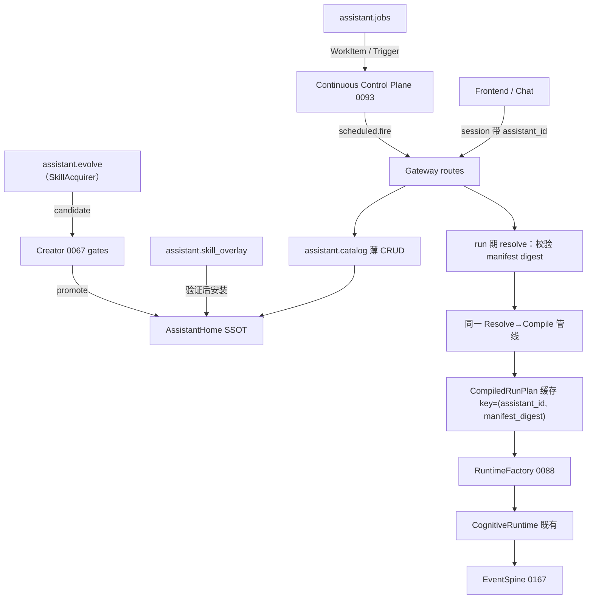

# ADR-0187 — AssistantAgent：可配置、可隔离、可进化的个人助理产品面

## 状态

**Accepted — 2026-09-04**

PR-1 推进记录：本 ADR 评审通过、状态落 Accepted；编码实施按 §7 PR-2…PR-8 推进。配套 Note 落 [`docs/notes/proposed/seam/2026-09-04-assistant-home-scope.md`](../notes/proposed/seam/2026-09-04-assistant-home-scope.md)（lifecycle=proposed；与本 ADR 状态正交，由 PR-2/3 落地后迁 `implemented/`）。

> **一句话**：在现有 LCA 插件内核与认知闭环上，新增 **Assistant 产品面**——每个助理有独立 `AssistantHome`（workspace + 人设 + goals + skills + routines 的磁盘 SSOT），经工厂函数 / 对话 skill 装配；前端 session 带 `assistant_id` 解析进既有 Runtime；**不新开 Agent loop**；默认 profile 不受影响；行为全走 Spine 事件，可审计可回放；定时任务坐在 ADR-0093 持续执行控制面之上；技能自进化复用 `SkillAcquirer` 缝 + ADR-0067 闸门。

**不 supersede**：ADR-0033 / 0048 / 0051 / 0067 / 0069 / 0088 / 0091 / 0093 / 0167。
**交叉引用**：OpenClaw agent workspace、Hermes learning loop、Grok Bot 多助手产品形态（映射，非抄实现）。

**Follow-up（诚实编号，禁止「不留 follow-up」）**：

| 编号 | 范围 |
|---|---|
| ADR-0187.1 | routines 的 timer / webhook Trigger 投递源（ADR-0093 的扩展，不是独立调度器） |
| ADR-0187.2 | 离线 skill 进化管线（GEPA 类，可选插件） |
| ADR-0187.3 | 多助理路由 / 作战室产品 UI |

---

## 1. 背景

### 1.1 产品意图（李超）

希望在 layered 上拥有类似 OpenClaw / Hermes / Grok Bot 的「个人助理」：

1. **专用目录与 workspace**，人设 / 目标 / skill / tool **高度配置化且 SSOT 清晰**；
2. **函数可创建、装配默认能力与 prompt**；
3. 前端 `run` **传助理标识**即可对话；
4. **尽量插件化、进 bundle**，不影响现有 agent；
5. **助理间隔离**；可改 workspace、写 skill、改人设、给外部 skill 链接即安装；
6. **日志 / 事件**可调试、审计、回溯；
7. **Hermes 式 skill 自进化**；Grok 式多助理 / 例行；
8. **定时 job**（可先框架）；
9. 与现有 agent **对话「创建一个助理」**自动走设置（skill）。

### 1.2 现状能力（821 已有，勿重复造轮）

| 已有 | 出处 | 已解决 | 缺口 |
|---|---|---|---|
| 声明式 AgentSpec | ADR-0033 | 组合输入 SSOT | 无「持久助理 Home」产品目录 |
| Operational Skills | ADR-0048 | 网络 import / activate / 缓存 `~/.lca/skills` | 无 per-assistant overlay 与人设同目录 |
| RunWorkspace | ADR-0051 | run 级产物与 deadline | 非助理长期 cwd |
| 受治理创造 | ADR-0067 | artifact 状态机 + Creator 面 | 未产品化为「创建助理」 |
| 原语宪章 | ADR-0069 | PlanTemplate；禁新 loop | 需显式 Assistant PlanTemplate |
| RuntimeFactory | ADR-0088 | profile 选 loop | 默认仍单认知 runtime |
| Session follow-up 调度 | ADR-0091 | Session 输入准入与可靠队列 | — |
| 持续执行控制面 | ADR-0093 | Trigger / WorkItem / WorkQueue（lease、去重、重试、dead-letter） | 无 assistant routine 的声明式配置面 |
| Skill 习得缝 | `lca/plugins/skill/auto_acquire.py`（`learning.skill_acquirer`） | candidate-only 草稿 + evidence gate | 落点是全局 store，无助理域归属 |
| Post-turn 评审桥 | `lca/plugins/learning/` | 终态生命周期引用 → 候选评估 | — |
| Spine SSOT | ADR-0167 | 事件真值 | 缺 assistant_* EP 与助理修订计数 |

### 1.3 业界对照（吸收边界）

| 能力 | OpenClaw | Hermes | Grok Bot 类产品 | LCA 迁入 |
|---|---|---|---|---|
| 每助理 workspace | `agents.entries.*.workspace` + SOUL/IDENTITY/… | 文件记忆 + skills 目录 | per-agent 目录 + profile | **迁入** AssistantHome |
| Bootstrap 人设文件 | SOUL/IDENTITY/USER/AGENTS/MEMORY/BOOTSTRAP | USER.md / MEMORY | profile + memory | **迁入**（注入 ContextManifest，非旁路 prompt 堆） |
| Skill 安装 | ClawHub / skills dirs | `~/.hermes/skills` + skill_manage | 链接安装到 skill 目录 | **迁入** 复用 0048 + assistant overlay |
| Skill 自进化 | 可自改 skill | observe→distill→reuse；离线 GEPA | 重复任务→skill | **迁入** 会话 distill（`SkillAcquirer` 缝）；离线→0187.2 |
| 多助理隔离 | per-agent sqlite + workspace | 单实例为主 | CreateAgent 隔离 | **迁入** Home + grants |
| 定时 / routine | 网关侧能力 | cron 进化框 | routines | **迁入** 0093 Trigger 之上的声明式配置；投递源→0187.1 |
| 通道网关 | WhatsApp 等 Gateway | 多平台 | 多通道 | **不本 ADR**（G9 既有 transport） |
| 新 Agent loop | 自带 embedded loop | 自有编排 | — | **明确不迁入** |

---

## 2. 第一性原理

| # | 原则 | 落地 |
|---|---|---|
| **P1** | 真值唯一 owner，三类真值三套变更机制 | **配置**以 `manifest.json` + digest 为 SSOT；**记忆**是追加面，归 VisibilitySpace，不受 digest 纪律；**运行事实**只写 Spine/Journal |
| **P2** | 不新开 loop | Assistant 是 PlanTemplate + 解析产物；执行仍走 RuntimeFactory → CognitiveRuntime |
| **P3** | 一缝一职，已有缝优先 | Jobs 坐 0093、进化走 `SkillAcquirer`、Catalog 只做 Home；禁止 AssistantGodService |
| **P4** | 隔离是结构 | 私有 Home + IdentitySpace + grant 子集；默认禁止跨助理读 memory |
| **P5** | 进化受治理 | 新 skill / 人设修订 = CapabilityArtifact / PlanRevision，经 0067 闸，不直改内核 |
| **P6** | 存量零打扰 | 无 `assistant_id` 的路径 ≡ 今日行为；assistant 能力仅 opt-in bundle |

---

## 3. 决策

### D1 · 概念归属（0069）

```text
AssistantAgent ∈ G1(Identity) × G10(Composition) × G2(Spacetime/Home)
Skill 进化提案 ∈ G11(Creation)
审计 / 回放     ∈ G12(Evidence)
执行工具        ∈ G7（经既有窄门）
定时触发        ∈ G10 声明 + ADR-0093 控制面（不进认知闭集）
```

**禁止**：新增 G13「Assistant」群；禁止 `AssistantCognitiveRuntime` 平行实现。

**硬边界（实现禁令）**：

```text
G1  可：CreateAssistant Contract、成功标准、审批边界、对话创建意图
G1  不可：mkdir Home、import skill、启动 job、写 bundle

G10 可：物化 Home、改 manifest digest、选已验证 skill 进 plan、向 0093 注册 WorkItem、Resolve/Compile
G10 不可：跳过闸门把草稿 skill 标 ACTIVE；扩大 grant 超过父 Scope

G11 可：提案/验证/提升 Artifact（skill、bundle patch）
G11 不可：runtime 直接 import 执行成生产能力；改其他助理 Home
```

### D2 · AssistantHome 目录（磁盘 SSOT）

根路径：仅经 Profile/`{from_env: LCA_ASSISTANTS_ROOT}` 注入（默认 `~/.lca/assistants`）；**插件代码禁止直接 `os.environ[...]` 读该变量**。

```text
{assistants_root}/{assistant_id}/
  manifest.json       # schema_version, digests(仅配置面), revision_seq, template_id, created_at
  profile.json        # name, description, emoji, status(active|paused|retired)
  SOUL.md             # 人设 / 边界 / 语气（OpenClaw 对齐）
  IDENTITY.md         # 名称 / vibe
  USER.md             # 服务对象画像
  AGENTS.md           # 操作纪律（工具用法约定，不控制工具是否存在）
  MEMORY.md           # 长期记忆摘要（记忆面，不参与 digest）
  BOOTSTRAP.md        # 仅新建时存在；完成后删除并记 EP
  goals.yaml          # 目标与成功标准
  grants.yaml         # capability allowlist（⊆ profile grant）
  tools.yaml          # 工具允许 / 拒绝策略引用
  skills/             # 助理可见 skill 索引（指向 content-addressed 安装或本地草稿）
  workspace/          # 工具 cwd；助理可读写；产物沉淀面（D5）
  memory/             # 结构化记忆碎片（记忆面，可选）
  routines/           # JobSpec YAML（0093 Trigger 的声明式配置）
  revisions/          # 每次配置变更的不可变快照 meta
```

**真值分层**——三类真值各有一套变更机制，不得混用：

| 面 | 内容 | 变更机制 |
|---|---|---|
| 配置（digest SSOT） | profile.json / SOUL / IDENTITY / USER / AGENTS / goals / grants / tools / skills 索引 / routines | `revise` API（双模式，见下）⇒ digest 重算 + `revision_seq++` + `revisions/` 快照 + EP |
| 记忆（追加面） | MEMORY.md / `memory/` | 经 memory seam（`memory.write_policy` / `memory.retrieval_policy`，`lca/contracts/capabilities.py`）写入 + EP；per-assistant 可见性经 `ScopePlan` 的 agent scope + visibility 隔离（D5）；**不参与** manifest digest，**不触发** `revision_seq`（I-A13） |
| 工作区（执行面） | `workspace/` | 工具 effect 经 Body（G7）；产物沉淀见 D5 |
| 运行事实 | — | 只写 Spine / Journal（0167）；不落 Home |

解析器只信任 `manifest.json` 中的配置面 digest；裸改配置文件而未 `revise` 的，下次 resolve **一律拒收**（I-A3，fail-closed；告警不算通过）。记忆面文件与 digest 不一致不影响 resolve。

**revise 双模式**（配置面唯一写入口 + 唯一恢复路径）：

| 模式 | 语义 | 场景 |
|---|---|---|
| `revise`（patch） | 应用 patch ⇒ digest 重算 ⇒ `revision_seq++` ⇒ `revisions/` 快照 ⇒ EP | 常规配置变更 |
| `revise_reimport` | 以磁盘当前文件为输入重算全部配置面 digest ⇒ `revision_seq++` ⇒ 快照 ⇒ EP（`actor="reimport"`） | I-A3 拒收后的恢复：用户手改 SOUL.md / goals.yaml 等 |

两模式共用同一套 revision / EP 机制，不存在第三条写路径。裸改本身不是错误：它让下次 resolve 拒收生效，直到 `revise_reimport` 重新钉住 digest（把磁盘内容收编为新的受管真值）。

**记忆三层**（进 prompt 的规则）：

| 层 | 存哪 | 进 prompt？ |
|---|---|---|
| 事实（运行真值） | Spine / Journal（0167） | 经投影，非全文 |
| 程序（怎么做） | `skills/` SKILL.md | 渐进披露：目录描述默认；`activate` 后全文 |
| 情节（发生过什么） | `memory/` 或检索索引 | **默认不进**；工具检索按需 |

**禁止**：把长流程写进 system prompt 或 EP payload 正文；**禁止**学习旁路把整份 SKILL 写入 spine（仅允许提案/提升的**元数据 EP**：id、digest、actor）。

### D3 · AssistantSpec（冻结视图，扩展 AgentSpec）

```python
# lca/contracts/models/assistant/spec.py（新建；frozen dataclass 归 models/，对齐 models/cognition|core|observability|team）

@dataclass(frozen=True)
class AssistantBootstrapRefs:
    soul_digest: str
    identity_digest: str
    user_digest: str
    agents_digest: str
    # MEMORY.md 不在此列：记忆面不受 digest 校验（D2 真值分层）

@dataclass(frozen=True)
class AssistantSpec:
    assistant_id: str
    home_path: str
    revision_seq: int                # 助理配置修订计数（与 0169 Incarnation 正交，见下）
    template_id: str                 # e.g. "assistant.default"
    profile_name: str
    profile_description: str
    agent_spec: "AgentSpec"          # ADR-0033 核心（llm/tools/budget/choices）
    bootstrap: AssistantBootstrapRefs
    skill_ids: tuple[str, ...]
    job_ids: tuple[str, ...]
    grant_digest: str
    tools_policy_digest: str
```

**命名**：`revision_seq` 是助理**配置修订**计数。`lca/contracts/observability/incarnation.py` 的 `Incarnation(run_id, plan_ref, incarnation_seq)` 是**计划维度运行身份**（ADR-0169 D6 / 0171）。两者正交，不复用同一词。

**缝合（硬）**：AssistantHome / manifest 是 G10 **配置输入**，经**与现网同一条** `Resolve → Compile` 产出 `CapabilityPlan + ControlPlan + ScopePlan = CompiledRunPlan`。`AssistantSpec` 是 resolve 后的冻结**视图**（便于 API/测试），**不是**第二条 AgentSpec 平行编译器——禁止 `compile_assistant_plan()` 旁路。

Resolve 时：bootstrap → ContextManifest（Perceive）；`workspace/` → ExecutionSpace（G2 事实，带来源/ACL）；`skill_ids` → 仅选**已验证**包进 CapabilityPlan（0048 overlay）。

**解析时序（boot 期 vs run 期）**——ADR-0163 钉「就绪在 boot 而非请求时」，助理是运行期动态创建的数据，两者按以下分工相容：

```text
boot 期：assistant.* 插件按 profile 装配 —— 就绪的是编译与物化能力，不是具体助理实例
run 期：session/run 带 assistant_id
  → Catalog 读 Home，校验 manifest 配置面 digest（失败 = fail-closed 4xx）
  → 产出 AgentSpec 形状输入 → 同一条 Resolve → Compile
  → CompiledRunPlan 按 (assistant_id, manifest_digest) 缓存
revise ⇒ manifest digest 变化 ⇒ 缓存失效，下一 run 重新 resolve
```

Home 解析是**数据投影**，不是运行期重装配插件图；boot 期能力就绪 + run 期按 digest 取缓存编译产物，即「同一条编译器」的全部含义。

### D4 · 工厂 API（函数面，非上帝对象）

```python
# lca/contracts/protocols/assistant/catalog.py  — 薄 Catalog：仅 Home CRUD（Protocol 归 protocols/，对齐 protocols/session|memory|state）

class AssistantCatalog(Protocol):
    """门面不得单类实现 install/evolve/job；架构测试禁止 God Catalog。"""
    def create(self, req: CreateAssistantRequest) -> AssistantHandle: ...
    def get(self, assistant_id: str) -> AssistantSpec: ...  # resolve 视图
    def list(self) -> tuple[AssistantSummary, ...]: ...
    def revise_profile(self, assistant_id: str, patch: ProfilePatch) -> PlanRevision: ...
    def reimport(self, assistant_id: str, reason: str) -> PlanRevision: ...  # 裸改恢复（D2 revise 双模式）
    def retire(self, assistant_id: str, reason: str) -> None: ...

# 委托（独立 Protocol / 插件）
class AssistantSkillOverlay(Protocol):  # capability: assistant.skill_overlay
    def install(self, assistant_id: str, source: SkillSource) -> SkillInstallReceipt: ...
```

Capability key 进 `lca/contracts/capabilities.py`，沿用点分小写惯例（同 `learning.skill_acquirer`）：`assistant.catalog`、`assistant.skill_overlay`、`assistant.evolve`、`assistant.jobs`。

`CreateAssistantRequest`：`name`, `description`, `template_id="assistant.default"`, `seed_user_md=None`。初始 skills 由 create **编排调用** overlay.install（可多步），Catalog 自身不实现安装逻辑。

实现：`assistant.catalog`（G10）只做 Home/manifest/revision。**禁止** gateway 直接 `mkdir`；**禁止**单一类同时 implements Catalog+Overlay+Evolve（arch test）。

### D5 · 隔离（ScopeKernel）

隔离走 **ScopeKernel grant 衰减 + lease**，不是「assistant 私有 Context 旁路」。

| 边界 | 规则 |
|---|---|
| Scope | 每次对话/run = 打开 assistant/run scope（父 = profile/agent）；lease 到期 disposer 回收 |
| 文件系统 | 工具默认 `workspace_only=true`；根 = Home `workspace/`（ExecutionSpace 事实，非全局单例） |
| 身份 | `ScopePlan.lifecycle` 的 `agent` 级（`lca/contracts/atoms/scope.py`）取值 = `assistant_id`；Journal / Spine 以此为载体（I-A2） |
| 能力 | 子 assistant / job / skill 的 capability **⊆ 父 grant**；`grants.yaml` 再收窄；扩大只经 G11 promote |
| 记忆 | 默认不可读其他 `assistant_id` 的 MEMORY/memory/（resolve 期经 `ScopePlan.visibility` 的 scope 集合隔离） |
| 技能 | 助理 `skills/` overlay；bundled 只读；进化只写本 Home |
| 禁令 | 禁止 assistant 模块持有平行 `Context` / 全局 service locator 绕开 ScopeKernel |

**载体钉在已实现的 ScopePlan，不依赖推迟子空间**：SpacetimeContext 5 子空间（含 IdentitySpace / VisibilitySpace 类）是 tracker §三裁剪推迟项，未实现（`lca/contracts/protocols/state/scope_plan.py` docstring）。0187 的隔离全部落在 `ScopePlan` 已实现最小版上：`lifecycle` 8 级 scope（assistant_id 取 `agent` 级）+ `visibility` scope 集合 + `acl_grants` 衰减 + `budget_ceiling`。子空间落地后，助理身份与记忆可见性迁入子空间，I-A2 / I-A6 的验证对象随之切换；本 ADR 不以子空间为前置。

**产物沉淀**：工具写入 cwd 的文件天然落在 `home/workspace/`（长期可见）；沙箱产物（`/mnt/data/outputs`）沉淀进 Home 必须经显式文件写 effect（G7），RunWorkspace `ArtifactLedger`（ADR-0051）保留 run 级引用。两层目录语义：Home = 助理长期面，RunWorkspace = 单次 run 的产物账本与 deadline。

### D6 · 插件与 Bundle（不影响存量）

**新 bundle**：`bundles/assistant-runtime.yaml`。插件 module id 对齐仓内模板 `lca.plugins.<dir>.<name>`（目录 `lca/plugins/assistant/`，每插件一个 .py）：

| Plugin（module id） | 群 | contribution | 职责 |
|---|---|---|---|
| `lca.plugins.assistant.catalog` | G10 | collect/transform | Home CRUD、manifest、revision |
| `lca.plugins.assistant.bootstrap` | G1/G4 | project | 将配置面文件投影进 ContextManifest |
| `lca.plugins.assistant.workspace` | G2/G10 | transform / project | **物化** ExecutionSpace（cwd、ACL、来源）；**不**直接世界写 |
| `lca.plugins.assistant.skill_overlay` | G10/G7 | select/transform | 在 0048 之上挂助理索引 |
| `lca.plugins.assistant.jobs` | G10 | collect | JobSpec 收集 → 向 0093 注册 WorkItem；无调度线程 |
| `lca.plugins.assistant.evolve` | G11 | transform | 实现 `SkillAcquirer`，从 run 轨迹产候选（experiment） |
| `lca.plugins.transport.webserver.routes_assistants` | G9 | — | REST：list/create/revise/install_skill |
| `lca.plugins.transport.webserver.routes_runs_sessions`（既有文件扩展，非新插件） | G9 | — | 解析 session/run 的 `assistant_id`：fail-closed 4xx / 绑定不一致 409，绑定透传给 resolve |
| `lca.plugins.session.persistence_jsonl`（既有缝扩展） | G10 | transform | 会话级 `assistant_id` 绑定持久化（经 `SessionPersistence` 缝） |

说明：`assistant.workspace` 只绑定 ExecutionSpace 事实；文件读写等世界 effect 仍走既有 Body / CommandEnvelope（G7），本插件不扩大 effect 面。

**安装与进化同一安全立场**：外部安装（URL）与自产进化（evolve）一律是 0048 拉取/生成 → 0067 校验（DRAFT→VERIFIED）→ write_approval → 才写 `skills/` 索引。**未验证包在 run 中不可被 `activate`**；外部 URL 包携带 `run_skill_script` 脚本的，脚本执行仍受沙箱与 grant 约束，不因安装而扩权。

**新 profile（示例）**：`profiles/web-assistant.yaml` = `web-standard` + `assistant-runtime`。
**默认** `web-standard.yaml` **不** include assistant-runtime。

### D7 · 前端 / Run 契约

`assistant_id` 的绑定层级：**session 为主，run 继承**。

| 入口 | 语义 |
|---|---|
| `POST /v1/sessions` | 可选 `assistant_id`，建立会话级绑定；缺省 = 遗留默认 agent |
| `POST /v1/sessions/{id}/messages` | 继承会话绑定；body 再传 `assistant_id` 且与绑定不一致 → **409** |
| `POST /runs` | 可选 `assistant_id`（一次性 run，不建立会话绑定） |
| `POST /v1/assistants` / `GET /v1/assistants/{id}` / `PATCH .../profile` / `POST .../skills:install` | 助理管理面 |

解析失败（未知 id / digest 不匹配）→ **fail-closed** 4xx，不静默回落默认助理（除非显式 `fallback=default`）。`assistant_id` 进 run 后，以 `ScopePlan.lifecycle` 的 `agent` 级为唯一载体贯穿 Journal / Spine。会话级绑定经 `SessionPersistence` 缝（`lca/contracts/protocols/session/session_persistence.py`）持久化；gateway 只解析与校验，不持有绑定状态。

### D8 · 事件与审计（对齐 0167）

新增 EXECUTION_POINTS（闭集扩展）：

| EP | 何时 |
|---|---|
| `assistant.created` | 工厂创建成功 |
| `assistant.bootstrap.completed` | BOOTSTRAP.md 完成并删除 |
| `assistant.profile.revised` | 配置面变更（带 `revision_seq++`） |
| `assistant.paused` / `assistant.resumed` | status 切换（paused 的助理拒收新 run） |
| `assistant.skill.installed` | 外部 URL/市场安装（已验证后） |
| `assistant.skill.activated` | 本 run activate |
| `assistant.skill.evolved.proposed` | evolve 提案进入 experiment |
| `assistant.skill.evolved.promoted` | 0067 提升进 Home |
| `assistant.job.registered` | JobSpec 注册进 0093 |
| `assistant.job.fired` | Trigger 投递一次（`scheduled.fire`） |
| `assistant.retired` | 转入 retired 状态，拒收新 run |

每条必含：`assistant_id`、`revision_seq`、`manifest_digest`（事件时刻值）、`actor`。
配置面修改**不得**只改文件不发 EP；记忆面写入发 memory seam 既有 EP + `assistant_id`，不发配置类 EP。

**闭集扩展同 PR 落点**（AGENTS.md 契约闭环）：

1. EP 描述符登记 `lca/contracts/observability/event_descriptor_registry.py`
2. cordis 事件表映射 `lca/contracts/observability/cordis_event_table.py`
3. 消费方白名单 / catalog
4. 发射方（`lca/plugins/assistant/*`）
5. EP 闭集回归测试（I-A11）

### D9 · Skill 自进化（`SkillAcquirer` 缝 × 0067 闸）

```text
observe（Spine 轨迹 / 用户纠正）
  → distill（assistant.evolve 实现 SkillAcquirer，产 SkillAcquisitionCandidate，scope=experiment）
  → validate（0048 格式 + 大小限制 + 语义不漂）
  → promote（0067：identity/invariant/experiment 闸）
  → 写入 assistants/{id}/skills/ + manifest digest 更新 + revision_seq++
```

**复用关系**：`lca/plugins/skill/auto_acquire.py`（capability `learning.skill_acquirer`）是全局 candidate-only 缝；`assistant.evolve` 是它的**助理域对应物**——同一 `SkillAcquirer` Protocol、独立 capability key、落点为 Home 而非 `~/.lca/skills`。两者不得由同一类实现；0187 不新增平行进化协议。

**默认写门关闭**：evolve 产出「提案卡」（元数据 + 草稿 digest 在 experiment scope），**默认不落盘**到 `skills/`；须 `write_approval`（人或显式自动策略）后才 promote。优先 **patch > rewrite**；每个 skill 带删除/归档条件。

| 允许 | 禁止 |
|---|---|
| 改本助理 skills 草稿与已提升包 | 改内核 / bundles / 其他助理 |
| 会话内 skill_manage（助理域，仍要审批策略） | **无闸**自动落盘 / ACTIVE 到 release |
| 用户一键接受提案 | 静默覆盖 SOUL 无 revision |
| EP 只记提案/提升元数据 | 把 SKILL 全文写入 spine/journal 正文 |

离线 GEPA：**0187.2**，本 ADR 只留 `assistant.evolve` 扩展点。

### D10 · Job = ADR-0093 之上的声明式配置

**归属**：调度 / lease / 去重 / 重试 ∈ **ADR-0093 WorkQueue**（已有，复用）；routine 声明 ∈ Home `routines/`。0187 **不**新建调度框架。

```yaml
# routines/daily_brief.yaml —— 0093 Trigger 的声明式配置
id: daily_brief
schedule: "0 9 * * 1-5"    # 用户本地时区解释
skill_ref: null
prompt: "生成今日优先级简报"
enabled: true
assistant_id: asst_...
```

- `assistant.jobs`（contribution: collect）收集 JobSpec → 向 `continuous_control_plane_factory` capability（`lca/contracts/capabilities.py`）注册 WorkItem；lease、去重、过期恢复、dead-letter 全部复用 0093。
- 触发是事实：`scheduled.fire`（Trigger fact）→ `SessionWorkActivator` → 打开 run scope → **既有** RuntimeKernel 解释；pause/resume 走既有 halt/resume。
- profile 缺 `continuous_control_plane_factory` capability ⇒ jobs 注册拒收（fail-closed），不降级为隐式线程。
- Phase 1：注册 + `POST .../jobs/{id}:fire`（人工/测试投递 Trigger）。
- **禁止**在认知内核内嵌调度中间件；**禁止** job 持有超出父 assistant grant 的 capability。
- ADR-0187.1 = timer/webhook 投递源，即 0093 的一个 Trigger 来源，不是独立调度器。

### D11 · 默认模板 `assistant.default`

| 项 | 内容 |
|---|---|
| Bootstrap | 安全默认 SOUL/IDENTITY/USER/AGENTS/BOOTSTRAP 模板（可本地化中文） |
| Tools | workspace read/write/edit/list；0048 skill 五件套；`revise_assistant_profile`；可选 web_search（grant） |
| Prompt | 短系统段：身份来自 bootstrap；技能渐进披露（先 name+description，匹配再 activate 全文） |
| Grants | 最小：workspace 写、skill import、profile revise；无随意网络/壳除非 profile 授予 |

### D12 · 对话创建助理（Skill）

Bundled skill：`skills/create-assistant/SKILL.md`。

流程：询问名称/职责/是否装初始 skills → 调 `AssistantCatalog.create` → 引导填 USER.md / 完成 BOOTSTRAP → 返回 `assistant_id` 与调用示例。既有「当前 agent」只需 **activate 该 skill**，无需新 loop。

**能力前提**：发起创建的 run 所在 profile 的 grant 必须包含 `assistant.create`；被创建助理的 grant ⊆ 创建路径的父 grant（C5 衰减），无 grant 则 create 拒收。

---

## 4. 架构图



---

## 5. 不变量

| ID | 内容 | 验证 |
|---|---|---|
| I-A1 | 无 assistant_id 时行为 = 启用前基线 | 回归 web-standard |
| I-A2 | 任意 run 带 assistant_id ⇒ `ScopePlan.lifecycle` 的 `agent` 级值 = 该 id | fixture / journal 重建 |
| I-A3 | resolve 时配置面 digest 与文件一致，否则**仅拒收**（禁止「告警后放行」）；唯一恢复路径 = `revise_reimport`（D2 双模式） | unit：篡改配置 md 不经 revise ⇒ resolve 失败；reimport 后 ⇒ resolve 通过且 `revision_seq++` |
| I-A4 | grants ⊆ profile grant | property test |
| I-A5 | 工具 cwd ⊆ home/workspace（除非显式更高 grant） | sandbox test |
| I-A6 | 禁止跨助理读 memory（经 `ScopePlan.visibility` 隔离） | isolation test |
| I-A7 | 配置变更 ⇒ `revision_seq++` 且 `revisions/` 有快照 | unit |
| I-A8 | evolve 提案默认 experiment，非 ACTIVE | gate test |
| I-A9 | 不新增顶层 loop 类 | importlinter / arch test |
| I-A10 | assistant-runtime 未进 web-standard | profile resolve 快照 |
| I-A11 | create/revise/install/pause 必发对应 EP | EP 闭集测试 |
| I-A12 | jobs 必经 0093 WorkQueue；无隐藏调度线程 | arch test：assistant.jobs 无常驻线程/定时器 |
| I-A13 | 记忆面写入不经 manifest digest、不触发 `revision_seq`；配置写入必经 revise | unit 双向 |

---

## 6. 后果

### 正面

- 产品面与 harness 内核分离：助理是数据 + 解析，不是新框架。
- 对齐 OpenClaw Home / Hermes skill 进化 / Grok 多助理，而不引入通道网关或第二 loop。
- jobs 与进化零新机制成本：分别坐在 0093 与 `SkillAcquirer` 既有缝上。
- 存量路径安全；新能力 opt-in。审计与 0167 同轨，避免平行日志。

### 负面 / 代价

- AssistantHome 与 RunWorkspace 两层目录需文档说清（长期面 vs 单次 run 账本）。
- digest 纪律对「随手改配置 md」不友好——应用 `revise` API/skill（有意为之）；记忆面不受此约束。
- 定时投递源延后（0187.1），Phase 1 接受手动 fire。

### 删除条件（必须可 grep / 可测；门禁未满足不得合入）

| 条件 | 验证 |
|---|---|
| **无**第二套 `AssistantRuntime` / `AssistantLoop` | `rg 'AssistantRuntime|AssistantLoop' lca` → 0 |
| **无**平行 AgentSpec 编译器 | `rg 'compile_assistant_plan' lca` → 0 |
| assistant 插件不直读 `os.environ` 定 workspace | 架构测试：根路径仅来自 Profile 注入（`rg 'os\.environ' lca/plugins/assistant` → 0 为必要条件） |
| **无**跳过 ArtifactValidator 的 skill 热加载 | evolve/install 路径必经 0067/0048 validate；架构测试 |
| **无**平行进化协议 | `assistant.evolve` 实现 `SkillAcquirer`；架构测试 |
| 兼容 shim | 若有，注释 `COMPAT delete-by: YYYY-MM-DD`；到期 `rg COMPAT` 清零 |
| `assistant.*` 插件可卸 | profile 无引用 + Home 已迁移或废弃 |
| `web-assistant` profile | 无部署使用可删 |
| evolve / create-assistant skill | 产品放弃或被 0187.2/HTTP 替代时删 |

---

## 7. 实施 PR 序列（建议）

迁移阶段：**P0** = PR-2…PR-6（隔离 Home/session + SKILL 渐进加载 + run(`assistant_id`)）；**P1** = PR-8 jobs 部分（例行意图挂 0093 控制面，执行同一 Assistant 循环）；**P2** = PR-8 evolve（run 后提案卡，默认不落盘，人批后写 SKILL.md）。

| PR | 内容 | 验收 |
|---|---|---|
| PR-1 | 本 ADR 合入 + 术语表 | 评审通过 |
| PR-2 | contracts：AssistantSpec / Catalog Protocol / capability 键 / EP 描述符 | 类型测试 |
| PR-3 | `assistant.catalog` + Home 布局 + create/get/list | 集成：创建后磁盘与 digest |
| PR-4 | bootstrap 注入 + workspace 绑定 + profile `web-assistant` | 一次对话 run + 跨助理 memory 隔离测试（I-A6）+ memory seam 按 agent scope 作用域验证 |
| PR-5 | gateway `/assistants` + session/run `assistant_id` | API 测试；web-standard 回归绿 |
| PR-6 | skill_overlay + install from URL（0048 + 0067 验证） | 安装 EP + activate |
| PR-7 | create-assistant skill + BOOTSTRAP 流 | 对话创建 E2E |
| PR-8 | evolve 提案（experiment only）+ jobs 注册/手动 fire（0093） | I-A8 / I-A12 |

编码落地交 Cursor cloud agent；本 ADR 为设计门禁。

---

## 8. 否决的替代方案

| 方案 | 结论 | 原因 |
|---|---|---|
| 新建 AssistantCognitiveLoop | 否 | 违反 0069；双轨维护 |
| 把助理配置塞进 Cordis 全局 config 单例 | 否 | 无 per-assistant 隔离与 digest |
| 直接复制 OpenClaw Gateway 通道层 | 否 | G9 已有 transport；范围爆炸 |
| 无闸自动写 skills 并热加载进内核 | 否 | 违反 0067 |
| 在 web-standard 默认挂全部助理插件 | 否 | 违反 P6 存量零打扰 |
| Mega `AssistantService` 包办一切 | 否 | 违反 P3；重演 God Cursor |
| 平行 `compile_assistant_plan` | 否 | 必须同一 Resolve→CompiledRunPlan |
| 独立 JobScheduler / job-loop | 否 | ADR-0093 WorkQueue 已提供 lease / 去重 / 重试；重复机制 |
| `assistant.evolve` 自定义新进化协议 | 否 | `SkillAcquirer` 缝已存在（auto_acquire / learning） |
| MEMORY 参与 manifest digest | 否 | 事实/记忆高频追加，配置低频修订，不得共用一套变更机制 |
| run 期动态装配插件图 | 否 | 违反 0163 / 0088；编译产物按 digest 缓存即可 |

**实现拒收信号（评审直接打回）**：

1. 出现 `AssistantRuntime` / `AssistantLoop` / 平行 `compile_assistant_plan()` 绕开既有 CompiledRunPlan。
2. 单一服务类同时：写配置 SSOT + 执行世界 effect + 发布新能力。
3. `install_skill` 实现为「下载后 exec/import 进 live Context」。
4. Assistant 直读 `os.environ` 或进程全局 workspace 单例作为 cwd。
5. 兼容 shim 无 delete-day。
6. jobs 绕过 0093 自建调度线程或队列表。

---

## 9. 开放问题（保留）

1. `assistants_root` 默认在用户数据盘还是与 traces 同卷？（建议数据盘，traces 仍 run 级）
2. 团队「作战室」多助理是否共享 workspace 只读层？（交给 0187.3）
3. 记忆面可见性粒度：`memory.write_policy` / `memory.retrieval_policy` 是策略 capability，0187 经 `ScopePlan` 的 agent scope + visibility 隔离；若需记忆域专属的更细可见性规则，须待 SpacetimeContext 子空间的 owner 协调规则明文化（`scope_plan.py` 推迟项），届时按 D5 迁移条款切换。

---

## 附录 A · 实现者检查单

- [ ] 未新增 `*Runtime` 平行 loop
- [ ] `web-standard` 未强制依赖 assistant-runtime
- [ ] create/revise/install/pause 均有 EP + `revision_seq`（仅配置面）
- [ ] 记忆面写入不参与 digest、不触发 `revision_seq`
- [ ] 工具默认 workspace_only
- [ ] skill 安装与进化均经 0048/0067 验证，未验证不可 activate
- [ ] evolve 实现 `SkillAcquirer`，无平行协议
- [ ] jobs 走 0093 WorkQueue，无隐藏调度线程（Phase 1）
- [ ] run 期 resolve 按 `(assistant_id, manifest_digest)` 缓存
- [ ] 文档写清 Home（长期面）vs RunWorkspace（run 账本）
- [ ] 删除条件可 grep / 可测

## 附录 B · 与用户需求映射

| 需求 | 决策 |
|---|---|
| 自有 workspace / agent 目录 | D2 AssistantHome |
| 角色目标 skill tool 配置化 SSOT | D2/D3 manifest+digest |
| 函数创建装配 | D4 Catalog.create |
| 默认能力与 prompt | D11 template |
| 前端 run 带标识 | D7 |
| 插件化 bundle | D6 |
| 不影响现有 | D6 / I-A1 / I-A10 |
| 隔离 | D5 |
| 改人设 / 装外部 skill | D4 revise/install + D6 安全立场 + D8 |
| 日志事件审计 | D8 |
| Hermes 自进化 | D9 |
| 定时 job | D10（0093 之上） |
| 对话创建助理 | D12 |

---

*起草：山姆 · 2026-09-04 · 基于 821 分支 ADR-0033/0048/0051/0067/0069/0088/0091/0093/0167 与 OpenClaw/Hermes/Grok 产品对照*

## 修订记录

| 日期 | 变更 |
|---|---|
| 2026-09-04 | 初稿；编号两次冲突后收敛为 0187，登记进 `docs/adr/README.md` 索引 |
| 2026-09-04 | 评审收敛：jobs 钉到 ADR-0093、evolve 复用 `SkillAcquirer` 缝、run 期 resolve 时序与 digest 缓存、`incarnation_seq` 改名 `revision_seq`（与 0169 Incarnation 正交）、记忆面移出 digest 纪律、Home/RunWorkspace 产物沉淀、install 与进化同一验证立场、EP 闭集触点清单、删除过程残留章节 |
| 2026-09-04 | 评审修订二轮（对照代码库落点核实）：隔离载体钉到已实现的 `ScopePlan`（IdentitySpace/VisibilitySpace 为推迟项，不作 0187 前置，附迁移条款）；session 绑定钉两个落点（routes_runs_sessions 解析 + persistence_jsonl 持久化）；revise 双模式（patch / reimport）定义裸改恢复语义；capability key 钉为 `continuous_control_plane_factory`；contracts 落 `contracts/models/assistant/` + `contracts/protocols/assistant/`；PR-4 验收补 memory 隔离测试 |
| 2026-09-04 | PR-1 推进：本 ADR 评审通过，状态 Proposed → Accepted；配套 Note `docs/notes/proposed/seam/2026-09-04-assistant-home-scope.md` 同 PR 落地（lifecycle=proposed，与 ADR 状态正交） |
