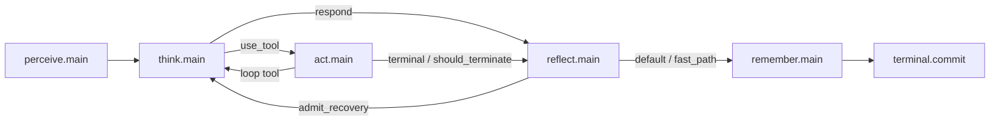

# ADR-0244 — 认知记忆闭环、上下文会话流与执行沙箱根治

## 状态

**Proposed — 2026-09-19**

> **一句话**：基于第一性原理彻底根治多轮会话失忆（Token 预算感知的会话切片 + Session 事实单轨注入）、认知主图反思与记忆拓扑闭环及零成本准入门禁、通用技能发现与程序性记忆沉淀（坚决杜绝任何硬编码场景与技能意图嗅探）、系统级沙箱环境基线与工作空间分层、以及 JournalStep 观察面复数化与精准集合对账。

**Extends & Refines**：
- [ADR-0195](0195-platform-architecture-convergence.md)（平台三时态与 SSOT 矩阵）
- [ADR-0199](0199-hermes-inspired-cognitive-plugin-convergence.md)（Hermes 插件与门面收敛）
- [ADR-0200](0200-hermes-product-capabilities-absorption.md)（Hermes 记忆模型与产品能力吸收）
- [ADR-0220](0220-three-tier-graph-and-boundary-typing.md)（三层图概念群与 typed DTO 边界）
- [ADR-0232](0232-act-fanout-n-to-n-and-parallel-tool-batch.md)（Act 并发工具批处理支持）
- [ADR-0237](0237-subgraph-output-bubble-outer-edge-exclusivity.md)（子图输出冒泡与外层边互斥）
- [ADR-0242](0242-assistant-creation-home-runtime.md)（助理 Home 运行时与多层记忆布局）
- [ADR-0243](0243-assistant-skill-tool-isolation-config.md)（技能与工具 Home 驱动隔离与自管理）

**Supersedes (部分废除与修订)**：
- 修订 [ADR-0220](0220-three-tier-graph-and-boundary-typing.md) 与 [ADR-0230](0230-stop-decision-retirement.md) 在外层主图（`bundles/outer/phase_main.yaml`）中 `think.main(respond)` 直跳 `terminal.commit` 的拓扑绕行设计；
- 彻底废除 `RunContext.extra[PRIOR_CONVERSATION_WM_KEY]` 与 `state.extra[PRIOR_CONVERSATION_WM_KEY]` 伪通道（闭环 Note `2026-09-17-prompt-section-manifest-channel` 遗留问题）。

---

## 0. 接任务前 7 问（必答）

1. **问题是什么？**
   Agent 跨 Run 多轮会话失忆（每轮交互丢失前文情境）；外层认知图拓扑将正常回复直连终止，导致反思（Reflect）与记忆（Remember）沦为不可达死代码；工作流沉淀缺乏通用机制，在特定测试场景下出现硬编码补丁的倾向；沙箱工作区缺乏环境生命周期隔离且环境缺少系统级中文支持；Act 并发工具批处理导致观察面 Journal 单数覆盖与交付物抹除；自动化体检 Doctor H7 基于步骤计数的启发式规则频发假阳性误报。
2. **受影响的事实或契约是什么？**
   - LobeHub ↔ LCA `/runs` 入口消息契约（`LcaStartRunBody.messages`）；
   - Session 初始事实注入接口（`RunSessionWriterProtocol.seed_prior_turns`）；
   - 主外层图拓扑契约（`phase.main.outer` 路由边与准入门禁）；
   - 记忆检索与写入图节点契约（`phase.perceive.memory_retrieve`, `phase.remember.admit`, `phase.remember.write`）；
   - 技能自描述与模型自激活协议（Prompt `<available_skills>` 发现 + `activate_skill` 工具调用）；
   - 沙箱运行时基础环境与工作空间生命周期契约（`SandboxEnvironmentInitializer` / Fontconfig 系统级字体回退）；
   - 观察面日志结构（`JournalStep.tool_calls`, `JournalStep.tool_results`, `ToolResult.invocation_id`）；
   - Doctor H7 跨事实对账契约（`StepConsistencyScan` 与 `verify_h7`）。
3. **唯一真值在哪里？**
   - **会话分支与历史树真值**：前端 LobeHub `chatStore.dbMessagesMap` 是唯一真值（用户可编辑、回滚、分叉分支）。
   - **单次 Run 事实流真值**：`Session.append`（内存）及异步刷盘的 `run_<id>.spine.jsonl`（持久化）是唯一只追加事实源。
   - **助理长期记忆与技能真值**：`~/.lca/assistants/{assistant_id}/memory/` 与 `{assistant_id}/skills/` 文件是唯一真值（ADR-0242/0243）。
   - **投影平面**：`JournalDocument`（`journal.json`）、向量索引、Prompt 文本均为只读投影，绝不反向替代事实。
4. **改变哪个边界？**
   - **L0 Wire 边界**：前端 `executeGatewayRun.ts` 传入 Token 预算感知的有效上下文消息序列；
   - **L1 Runtime 边界**：`RuntimeFacade` / `runtime_loop` 在启动时将历史事实注入 Session；
   - **L2 认知图边界**：修复外层图 `phase_main.yaml`，打通全流程闭环并设立零成本准入门禁；
   - **基础设施边界**：沙箱环境提供系统级 CJK 字体映射与工作空间事务隔离；
   - **观察面边界**：`JournalStep` 升级为复数并发工具记录。
5. **现有 Protocol / ADR / Note 能否表达？**
   ADR-0199、ADR-0200、ADR-0242、ADR-0243 已确立 Assistant Home、技能隔离与记忆模型，ADR-0232 已确立 Act 并发工具执行。本 ADR 从第一性原理收敛现有设计，坚决杜绝为了解决局部症状而开辟平行机制或编写业务硬编码。
6. **失败、重试、恢复和幂等语义是什么？**
   - 记忆写入通过 `CommandEnvelope` 走 `EffectGateway`（C10 窄门），幂等键绑定 `f"{plan_ref}:{session_id}:{step}:{candidate_id}"`，重试不产生重复记忆。
   - 历史消息以 `surface/user_message` 与 `surface/assistant_message`（标记 `historical: true`）单轨写入 Session，仅在 Run 初始化阶段执行一次，崩溃恢复时不重复回放副作用。
   - 记忆检索降级容错：记忆不存在或为空时，返回空 items，不阻塞认知主流程。
   - 主图闭环中的反思与记忆门禁对普通正常回复走零成本快速路径（Fast-path No-op），不额外消耗 LLM 调用。
7. **如何验证？**
   - 单元测试：`test_seed_prior_turns`、`test_journal_step_multiple_tools`、`test_doctor_h7_set_reconciliation`；
   - 架构守则体检：静态扫描严禁在图节点（如 `think.route`、`reflect.main`）中出现针对具体技能名称或业务关键词的硬编码嗅探；
   - 端到端：运行 4 轮连续对话回归测试，验证第二轮提问能够引用第一轮上下文、并发工具调用全部落盘进 `journal.json`，且 Doctor 检查 `broken_hop=None`。

---

## 1. 背景与根因清单（从表象到根因）

生产环境实测（`run_10db904b584d` ~ `run_e78f52bac23c`）暴露出系统五大核心问题。我们拒绝“仅针对测试用例打补丁”的表象修复，必须逐一穿透至系统根因：

### 1.1 缺陷表象与第一性原理根因剖析

| # | 实测缺陷表象 | 表面修补反模式（坚决拒绝 ❌） | 第一性原理系统根因（正道 ✔️） |
|---|---|---|---|
| **1** | **跨 Run 多轮上下文失忆**：首个 LLM 调用均为 `Messages count: 1`。第 4 轮用户问“我不是让你做成一个skill吗”，模型报“上下文丢失”。 | 网关 patch 简单写死“截取向前回溯 15 轮”后发给后端。 | **Wire 层丢失历史 + 事实通道未闭环**：前端网关代码曾为了跑通单个单次 Run 而硬编码只取 `lastUser`；后端曾尝试用 `state.extra[PRIOR_CONVERSATION_WM_KEY]` 偷传但无人消费。**根治方案**：前端通过 LobeHub `context-engine` 计算 Token 预算感知的有效上下文；后端通过 `seed_prior_turns` 单轨注入 Session 事实流。 |
| **2** | **主图反思与记忆节点被完全绕过**（The Grand Outer Loop Bypass）：正常问答与工具交互路径下，`reflect` 与 `remember` 节点访问计数恒为 0。 | 无视该绕行，或每次回复都无差别强制触发深度 LLM 反思，导致单轮延迟翻倍。 | **拓扑边设计违背全闭环不变量**：`phase_main.yaml` 将 `think.main(respond)` 直连 `terminal.commit`。**根治方案**：打通图闭环路由（`think/act → reflect → remember → terminal`），同时为常规无异常回复确立**零成本准入门禁（Fast-path No-op）**，兼顾架构闭环与低延迟低成本。 |
| **3** | **未能将成功工作流沉淀为 Skill**：Run 3 跑通了数据解析与报表，未沉淀为 Skill；Run 4 用户提示后仍未激活技能创建。 | **硬编码致命反模式**：在 `think.route.decide` 里硬编码正则匹配“做成一个skill”；在 `reflect.main` 里写死“已成功执行数据处理流程...是否将 Python 解析与图表固化为 Skill”。 | **会话失忆破坏了代词指代 + 违背了 C14 图与业务隔离**：① Run 4 没触发元技能是因为上下文丢失，模型不知道“做成一个skill”指什么；② 技能是平等、自描述的认知资产，LLM 自身是意图理解引擎，绝不应在图框架中硬编码技能名或业务话术！**根治方案**：恢复会话上下文；利用 Prompt `<available_skills>` 自描述与 `activate_skill` 工具协议由模型自主决策；反思层通过通用**认知元特征**识别复杂工作流，动态自适应生成提炼建议。 |
| **4** | **沙箱环境工作区污染与中文字体警告**：沙箱平铺 `/mnt/data` 遗留旧测试文件导致 Agent 误判；Matplotlib 报 `findfont` 中文字体缺失。 | 在沙箱启动时向 `~/.config/matplotlib/matplotlibrc` 动态写入针对特定库的临时文件。 | **沙箱环境基线与工作空间生命周期契约缺失**：环境缺少系统级 Fontconfig 别名映射；缺乏工作空间分层。**根治方案**：在沙箱基础镜像中配置全局 Fontconfig 回退（`sans-serif` 映射至中文字体），使所有 Python/Shell/绘图工具透明支持中文；按 Run / Topic 隔离工作空间，杜绝历史脏数据。 |
| **5** | **并发工具导致 Journal 交付物丢失与 Doctor H7 崩溃**：并发调用 4 次 `exportFile`，因单数字段相互覆盖，核心 PDF 报告在 `journal.json` 中被抹去；Doctor 报对账失败。 | 继续保留单数字段，或在 Doctor 中加入更多脆弱的特定条件分支。 | **观察面与控制面不对称**：Act 阶段已支持并发批处理（ADR-0232），但观察面 `JournalStep` 仍为单数字段，违反 C7 与 P5。Doctor H7 基于步骤计数的猜测极其脆弱。**根治方案**：`JournalStep` 升级为复数一等公民；Doctor H7 升级为基于 `invocation_id` 集合的精准对账。 |

---

## 2. 业界范式与第一性原理

### 2.1 业界范式借鉴

* **LobeHub Upstream**（`packages/context-engine`）：
  - **会话树唯一真值**：前端 `chatStore` 负责多分支与编辑树的管理。
  - **Group-Aware 滑动窗口**：`HistoryTruncateProcessor` 保护原子轮次组，基于当前 Agent 绑定模型的上下文预算（Context Window）动态截取有效上下文；超限时触发压缩摘要（`compressContext`）。
* **Nous Research Hermes**（`hermes-agent` / SOP & Procedural Memory）：
  - **记忆层次划分**：Working Memory（短期）、Episodic Memory（情景历史）、Semantic Memory（画像与事实事实）、Procedural Memory（程序性技能/SOP）。
  - **SOP 提炼与自主沉淀**：当系统经历多步骤复杂工具链成功解决难题后，系统自主将执行序列抽象为可执行脚本或指南（Skill），这一过程基于对任务复杂度的通用评估，而非针对特定领域的硬编码话术。
* **Claude Code / Anthropic Skills Specification**：
  - **技能平等自描述**：所有技能（包括管理类元技能）通过标准的 `SKILL.md`（包含触发上下文的 `description`）注入 Prompt，由大语言模型通过标准的工具调用协议（`activate_skill`）自主按需激活，系统内核对所有技能一视同仁。

### 2.2 第一性原理映射

| # | 原则 | 落地决定 |
|---|---|---|
| **P1** | 前端拥有会话状态，后端拥有认知事务 | LobeHub 上下文引擎计算有效滑动窗口；LCA 负责单次 Run 的认知执行与沙箱事务。 |
| **P2** | 事实单轨，投影不反向成源 | 历史消息必须作为 Session 事实进入日志，不走 `extra` 偷传通道；Session 是事实唯一真值。 |
| **P3** | 认知图必须全闭环且开销最小化 | 消除直跳 `terminal.commit` 的拓扑死路；常态文本回复流经 `reflect` / `remember` 采用零成本快速路径（Fast-path No-op）。 |
| **P4** | 技能是平等的自描述资产，严禁框架硬编码 | 彻底铲除在图节点中硬编码技能名、意图正则或业务话术的做法；依靠模型通用理解力与标准发现协议驱动。 |
| **P5** | 经验沉淀基于通用认知特征，产出动态自适应 | 反思层识别“多步工具成功执行”等认知元特征，由 LLM 根据当前真实业务领域动态生成总结提议。 |
| **P6** | 环境基线系统级治理，不侵入应用层配置 | 字体支持通过沙箱基础镜像的 Fontconfig 系统级配置解决；工作空间通过分层生命周期隔离。 |
| **P7** | 观察面必须忠实反映控制面（对称性） | `JournalStep` 原生支持复数并发工具记录，彻底消除因单数覆盖导致的数据静默丢失。 |

---

## 3. 架构决策

### D1 · 会话树与 Token 预算感知的有效上下文契约

1. **会话树唯一真值（SSOT）**：LobeHub 前端作为用户交互分支与历史消息的唯一真值源。
2. **拒绝写死“15 轮”硬编码**：重构 `deploy/lobehub/patches/runtime/lcaGateway/executeGatewayRun.ts`：
   - 废除只取 `lastUser` 的破坏性截断代码；
   - 废除无视上下文长度写死 15 轮的简单截取；
   - 消费 LobeHub 上下文引擎能力（`HistoryTruncateProcessor`），基于当前模型上下文上限（Context Window）扣除预留 Token（System Prompt + Tools + Current Turn）后，自底向上保留完整的原子消息组（User-Assistant 对）；
   - 过滤未完成流式占位符，输出结构化 `messages: wireMessages` 发送给 `POST /lca-api/runs`；
   - 附件列表仅附加在实际发生文件上传的用户轮次上。

### D2 · 后端 Session 历史事实单轨优雅注入

1. **消灭伪通道**：彻底废除 `run_context_factory.py` 与 `runtime_loop.py` 中对 `state.extra[PRIOR_CONVERSATION_WM_KEY]` 的读写。
2. **协议化注入接口**：在 [`RunSessionWriterProtocol`](file:///home/lichao/layered-cognitive-agent/lca/contracts/protocols/session/run_session_writer.py) 中定义正式注入接口：
   ```python
   def seed_prior_turns(self, turns: Sequence[ConversationTurn]) -> None:
       """将上游会话历史事实注入单次 Run 的 Session 中（仅在初始化阶段调用一次）。"""
       ...
   ```
3. **Session 事实落地**：在 `runtime_loop.py` 初始化 `run_writer` 后立即调用 `seed_prior_turns(ctx.prior_turns)`：
   - 历史 turn 分别转换为 `surface/user_message` 与 `surface/assistant_message` 追加至该 Run 的内存 Session 中，打上 `historical: True` 属性；
   - 历史消息不触发对外实时 WebSocket 事件广播（避免前端重复渲染已存在的历史条目）；
   - [`think.history.assemble`](file:///home/lichao/layered-cognitive-agent/lca/nodes/think/history/assemble.py) 的 `writer.derive_messages()` 无需修改，自动投影出包含完整有效历史的消息链。

### D3 · 修复主外层认知图拓扑闭环与零成本准入门禁

修改 `bundles/outer/phase_main.yaml`，打通被绕过的反思与记忆子图，并设立严格的开销防护门禁：



1. **拓扑全闭环**：
   - 删除 `from: think.main` 直连 `to: terminal.commit`（`action_type == respond`）的边；
   - 新增边：当 `think.main` 产出 `respond` 时，统一路由至 `reflect.main`；
   - 修正边：当 `act.main` 终止或产出最终结果时，统一路由至 `reflect.main`；
   - 确保所有执行终止均流经 `reflect.main → remember.main → terminal.commit`。
2. **零成本准入门禁（Tiered Zero-Cost Gate, 遵循 C6 最小化）**：
   - **Fast Path（日常无异常纯文本回复）**：
     - 当输入为常规文本回复且无工具报错时，`reflect.main` 仅执行内存态规则判定（`success=True, needs_recovery=False`），耗时 < 2ms，**不调用 LLM**；
     - `remember.main` 执行准入检查，当无明确待沉淀事实（No Memory Candidate）时判定为 No-op，**不调用 LLM**，不铸造空 Envelope，直接透传至 `terminal.commit`；
   - **Deep Path（异常恢复 / 复杂任务 / 用户显式人设注入）**：
     - 当工具执行报错时，触发 `admit_recovery` 重新进入 `think.main`；
     - 当满足复杂任务成功执行或显式记忆准入时，进入深层反思与 C10 窄门落盘。

### D4 · Perceive 阶段记忆检索声明式节点化

在 `bundles/perceive/perceive_subgraph.yaml` 中新增独立的图节点：
`[phase.perceive.observe] ──> [phase.perceive.memory_retrieve] ──> [phase.perceive.fold]`
1. **`phase.perceive.memory_retrieve`**：
   - 消费当前 `task` 与 `assistant_id`；
   - 从 `{assistant_home}/memory/` 检索高相关度事实条目（对齐 ADR-0242）；
   - 受到 `token_budget` 严格限额约束，输出强类型 `ContextItem(kind="memory.retrieved")`；
   - 由 `phase.perceive.fold` 统一打包进 `ContextManifest` 供下游渲染使用；若记忆文件不存在或为空，安全降级为空列表，绝不阻塞流程。

### D5 · Remember 阶段记忆防污染与 C10 执行窄门

在 `bundles/remember/remember_subgraph.yaml` 中实现标准子图：
`[phase.remember.extract] ──> [phase.remember.admit] ──> [phase.remember.write] ──> [phase.remember.fold]`
1. **`extract` 节点**：根据当轮执行结果、错误反思或用户明确提供的事实，生成 `MemoryCandidate`；
2. **`admit` 节点**：执行准入策略，权威度按 `user_confirmed > tool_observation > model_inference` 排序，过滤幻觉与低置信度推测；
3. **`write` 节点**：复用 `RememberWriteExecutor`，铸造带 `CapabilityGrant(capability="memory.update", effect_class="memory")` 的 `CommandEnvelope`，经 `EffectGateway` 安全落盘至 `{assistant_home}/memory/`；
4. **`fold` 节点**：汇总并输出 `memory_receipt`。

### D6 · 普遍性技能发现协议与自适应程序性记忆沉淀

**坚决拒绝在图节点中硬编码技能名称（如 `skill-creator`）或正则匹配（如 `做成一个skill`），坚决拒绝写死特定领域话术！**

1. **普遍性技能发现与自激活协议（Data-Driven Universal Skill Discovery）**：
   - **地位对等**：所有技能（包括元技能 `skill-creator`、操作技能 `data-analysis` 等）均平等放置于 `{assistant_home}/skills/`（ADR-0243），每个技能的 `SKILL.md` frontmatter `description` 声明了其功能与触发场景（When-to-use）；
   - **发现注入**：Prompt 的 `<available_skills>` 块统一自描述渲染所有已安装技能的触发说明；
   - **模型驱动自激活**：在 D1/D2 恢复完整上下文后，用户无论是表达“做成一个skill”、“保存当前流程”、“can you make this into a reusable tool”，大语言模型均能依靠其通用语义理解能力，直接自主调用 `activate_skill(name="skill-creator")` 或对应技能；
   - **大规模技能检索扩展（未来平滑升级）**：若技能数量超出 Prompt 预算，统一引入通用的基于向量检索的 `SkillRetriever` 模块按语义召回 Top-K，依然保持纯数据驱动，不产生任何硬编码。
2. **自适应程序性记忆沉淀机制（Generic Procedural Memory Distillation）**：
   - **认知特征识别**：在 `reflect` 阶段，Reflector 仅评估通用的**认知元特征**（例如：单次任务连续调用多步复杂工具组合、执行成功率 100%、产生了高价值 Deliverable 文件产物），判定为具备复用价值的 `ProceduralMemoryCandidate`；
   - **自适应领域交互**：LLM 在总结回复时，根据**当前实际执行的具体业务领域与操作内容**，自适应生成提炼建议（例如“检测到您执行了包含多步数据提取与转换的流程，是否需要将其封装为专属技能？”），绝不允许在框架代码中写死任何具体领域（如“Python 数据解析与图表生成”）的文字模板；
   - **异步策展闭环**：用户确认后，直接驱动调用 `create_assistant_skill` 写入 `{assistant_home}/skills/`，完成程序性经验沉淀闭环。

### D7 · 沙箱系统级环境基线与工作空间生命周期契约

1. **系统级 Fontconfig 字体回退（杜绝运行时 hack `matplotlibrc`）**：
   - 彻底废除在运行时向沙箱注入 `matplotlibrc` 的临时修补方案；
   - 在沙箱容器的基础镜像或构建准备阶段，于系统级 `/etc/fonts/local.conf` 配置标准 Fontconfig 字体别名映射：
     ```xml
     <alias>
       <family>sans-serif</family>
       <prefer>
         <family>WenQuanYi Micro Hei</family>
         <family>Noto Sans CJK SC</family>
         <family>DejaVu Sans</family>
       </prefer>
     </alias>
     ```
   - 使沙箱内所有运行环境（Python Matplotlib、Seaborn、ReportLab、Chromium 无头浏览器、Shell 脚本等）全局透明支持中文字体，从根本上杜绝中文方块与字体缺失警告。
2. **工作空间分层生命周期契约（对齐 ADR-0242 §D5）**：
   - **持久助理工作区**：`{assistant_home}/workspace/` 承载跨会话留存的助理专属资产；
   - **事务性执行工作区**：每次 Run 或每个 Topic 分配干净独立的执行挂载目录（`/mnt/data` 挂载点在事务初始化时保持干净隔离），杜绝历史脏数据与遗留文件干扰模型推理。

### D8 · JournalStep 观察面复数化与精准集合对账

1. **`JournalStep` 数据模型升级为复数一等公民**：
   在 `lca/contracts/models/observability/journal/step.py` 中：
   - 增加 `tool_calls: tuple[ToolCallRecord, ...] = ()`；
   - 增加 `tool_results: tuple[ToolResult, ...] = ()`；
   - 保留只读兼容属性 `@property tool_call` 与 `@property tool_result`（默认取首个元素），保持现有只读消费代码 100% 兼容；
   - 为 `ToolResult` 补充 `invocation_id: str = ""` 字段。
2. **`journal_fold.py` 字典映射收集**：
   按 `invocation_id` 字典收集同步骤内的所有并发调用与结果，彻底消除覆盖，确保生成的 PDF 等产物文件在 `cumulative_files()` 中完整可查。
3. **Doctor H7 精准集合对账**：
   彻底废弃 `scan.total_steps == scan.tool_total < spine_total` 启发式规则；
   直接对比 `journal_inv_ids` 与 `spine_inv_ids` 两组集合的完全一致性，消除假阳性误报。

---

## 4. 实施阶段（Phases）

| 阶段 | 目标 | 涉及模块 |
|---|---|---|
| **Phase 1 (P0)** | 恢复多轮上下文会话链（Token 预算感知 + Session 单轨注入） | `executeGatewayRun.ts`<br>`run_session_writer.py`<br>`runtime_loop.py` |
| **Phase 2 (P0)** | 修复主外层认知图拓扑闭环并落地零成本门禁 | `bundles/outer/phase_main.yaml`<br>`score.py`<br>`write.py` |
| **Phase 3 (P1)** | 修复 Journal 并发工具覆盖与 Doctor H7 精准集合对账 | `step.py`<br>`journal_fold.py`<br>`step_check.py` |
| **Phase 4 (P2)** | 沙箱系统级 CJK 字体映射与工作空间事务隔离 | 沙箱 Dockerfile / `fonts.conf`<br>沙箱适配器挂载逻辑 |
| **Phase 5 (P2)** | 声明式记忆图节点化（Perceive 检索 + Remember 准入窄门） | `bundles/perceive/`<br>`bundles/remember/`<br>`lca/nodes/` |
| **Phase 6 (P3)** | 通用自适应程序性记忆沉淀与 SOP 提炼机制 | `reflect.main`<br>`curator` 异步 Worker |

---

## 5. 验证矩阵

1. **跨轮记忆回归测试**：
   运行集成测试，模拟两轮连续会话：第一轮告知特定偏好，第二轮询问该偏好；断言第二轮首个 LLM Request Header 携带第一轮完整的 `messages` 事实。
2. **图闭环零额外开销验证**：
   执行单轮纯文本问答，断言流经 `reflect.main` 与 `remember.main` 时 LLM 调用次数仍为 1，节点耗时不超过 5ms。
3. **普遍性技能激活与反思沉淀验证**：
   - 验证用户不同语种/表达方式的技能创建意图下，模型均能依据 Prompt `<available_skills>` 正确自主调用 `activate_skill("skill-creator")`；
   - 静态代码检查断言：`think.route` 与 `reflect.main` 中不存在任何具体技能名、业务关键词或写死中文模板字符串。
4. **并发工具导出完整性验证**：
   模拟单步触发 4 次并发 `exportFile`，断言 `journal.json` 的 `step.tool_calls` 与 `step.tool_results` 长度均为 4，且 `doc.cumulative_files()` 包含全部 4 个文件（包含 PDF）。
5. **Doctor H7 对账无误报**：
   对包含纯文本步骤 + 并发工具步骤的 Run 运行 `StepConsistencyScan`，断言 `broken_hop=None`，H7 状态为 `ok=True`。
6. **沙箱系统字体与隔离验证**：
   启动新沙箱环境，执行带中文标签的 Matplotlib / ReportLab 脚本，断言生成图片中文字符正常且无 `findfont` 警告；断言工作区无历史其他会话文件。
