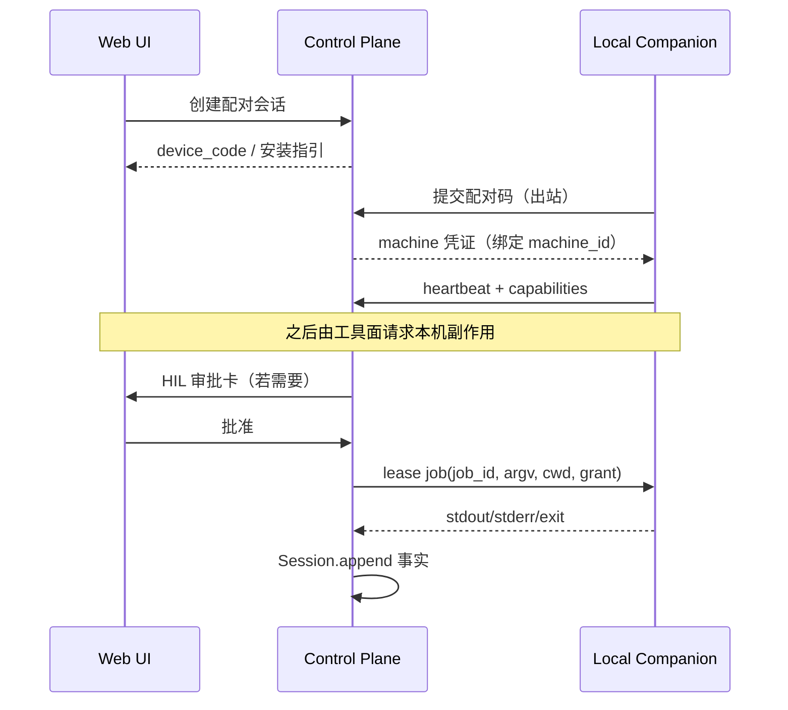

# ADR-0246 — 用户机器副作用平面（User-Machine Side-Effect Plane）

## 状态

**Proposed — 2026-09-20**

Refines: [ADR-0044](0044-code-sandbox-adapters.md)、[ADR-0050](0050-run-bound-sandbox-runtime.md)、[ADR-0051](0051-run-workspace-plane.md)、[ADR-0076](0076-six-plane-capability-layout-and-substitution-test.md)、[ADR-0078](0078-hil-approval-state-machine.md)、[ADR-0186](0186-session-as-event-ssot.md)、[ADR-0200](0200-p1-agent-gateway-bridge.md)、[ADR-0206](0206-information-graph-kernel.md)（若仓内文件名不同以索引为准）。

Related existing seams（**挂缝，不另起 Runtime**）:

- `lca/infrastructure/computer`（`MachineComputer` / `SandboxComputer` / shell·fs ops）
- `lca/infrastructure/device_hub`（`KernelServeHttpClient`）
- Tool / Body 执行面与 HIL 审批（ADR-0078）
- Agent Gateway 投影面（ADR-0200）

## 0. 决策摘要

网页访问的 Agent **不能假装自己就是用户的磁盘与 PowerShell**。用户本机副作用必须落在独立的 **用户机器副作用平面**，与：

- **Run-bound Sandbox**（Onlyboxes / 容器沙箱，平台代管）
- **Cloud VM / 私有 Worker**（团队共享执行机）

三者并列、可替换（ADR-0076 替换测试），共享同一套 Port：`LocalExecPort` / Computer ops 契约。

本 ADR **不定死**「网页弹窗跑 PowerShell」这一种产品形态；先收敛问题本质与业界范式选项，再给出 LCA 推荐挂缝与 M1 切片。

**禁止**：第二 Interpreter、`GraphRuntime`、把用户本机伪装成默认 sandbox、在浏览器 JS 里持有长期本机凭证。

## 1. 背景与问题本质

### 1.1 触发场景

产品以 **Web UI** 使用。用户希望 Agent 能：

- 读写本人电脑上的仓库/文件（例如内网 GitLab 镜像目录）
- 在本机执行命令（shell / 构建 / 办公脚本）
- 且过程可授权、可审计、可撤销

这与「Agent 跑在服务器、页面只是投影」存在天然裂缝。

### 1.2 真值 / 投影 / 副作用

| 平面 | 内容 | 谁写 |
|---|---|---|
| 真值 | Session journal：配对记录、machine_id、capability grant、job 租约、exit/stdout 摘要、审批事实 | `Session.append` 单轨 |
| 投影 | 机器在线列表、job 进度、审批卡片 | Gateway / LiveRunProjection（ADR-0200） |
| 副作用 | 真实 OS 调用 | **仅**已配对执行器（本机 Companion / Sandbox / Worker），永不由浏览器页面直接执行特权命令 |

### 1.3 现有能力边界

- `SandboxComputer`：平台代管环境，**≠** 用户个人电脑。
- `MachineComputer`：已有「对某 machine 执行」的抽象雏形，但缺少产品级 **配对 / 授权 / 在线租约 / 与 Web HIL 对齐** 的闭环 ADR。
- 浏览器 File System Access API：用户手选目录可读部分文件，**不能**稳定承担任意 shell、长期后台、企业策略。

## 2. 业界范式（选项，非互斥）

下列方案均可作为「用户机器副作用」的供给方；LCA 用同一 Port 吸收，产品可选组合。

### 方案 A — Local Companion + 出站长连接（推荐主路径）

**业界对照**：VS Code / Cursor Local Agent、Tailscale Funnel 式出站、部分 Desktop Agent（outbound WebSocket/gRPC）。

**形态**：

1. 用户安装/启动本机 Companion（或由安装器注册服务）。
2. Companion **出站**连接控制面（穿透 NAT，无需公网入站）。
3. 配对：Device Code / 一次性配对码 / 深链确认（类 `gh auth login` device flow）。
4. 能力宣告：OS、允许的根路径、命令类（shell/fs/git）、是否需每命令审批。
5. 控制面下发 **带 job_id 的租约任务**；Companion 执行并回传流式日志与结果；journal 记审计。

**优点**：产品完整；与 Web Agent 同会话；安全边界清晰。  
**代价**：要维护 Companion 多平台分发与升级；要设计配对与密钥绑定 `machine_id`。

### 方案 B — 浏览器受限能力（轻量补充，不作主路径）

**业界对照**：File System Access API、Chrome 本地扩展桥、部分「打开本地文件夹」产品。

**形态**：页面在用户手势下申请目录句柄；Agent 只通过已授权句柄读写；无通用 shell。

**优点**：零安装。  
**代价**：能力弱、体验碎、企业浏览器策略常禁；**不能**覆盖「clone 150 个 Git 仓 / 跑 PowerShell」类需求。

**结论**：可作「选文件夹只读」增值，**不得**充当 Computer 平面的默认实现。

### 方案 C — 远程开发隧道（Remote-SSH / Tunnel / Dev Container）

**业界对照**：VS Code Remote-SSH、VS Code Tunnel、JetBrains Gateway、GitHub Codespaces 连私有机。

**形态**：用户本机或跳板机开 SSH/隧道；控制面或 Companion 把「执行环境」指到该 host；命令在远端 shell 跑。

**优点**：复用成熟运维习惯；适合开发者用户。  
**代价**：凭证与跳板治理重；对非工程用户不友好；仍需配对与审批，否则变成「永久 root」。

**与 A 关系**：隧道可以是 Companion 的一种 **transport**，不是第二套语义。

### 方案 D — 托管执行机替代个人电脑（Sandbox / Pool / VDI）

**业界对照**：CI runner、Cursor Cloud Agent VM、企业 VDI、Onlyboxes。

**形态**：不碰用户磁盘；把工作同步到代管环境（git push/pull、制品上传）。用户本机只做「同步端」。

**优点**：安全与合规最好控；与现有 `SandboxComputer` 一致。  
**代价**：无法直接改「只在用户内网可达」的资源（除非 runner 也在内网）。

**结论**：默认安全基线；与 A 并存——**能在沙箱完成的不要下发本机**。

### 方案 E — 企业 MDM / 常驻 Agent 编配

**业界对照**：Intune/Jamf 下发 Agent、内部「运维小助手」常驻服务。

**形态**：IT 预装 Companion；用户在 Web 只做「绑定到我的账号 + 授权范围」。

**优点**：分发与升级走企业通道。  
**代价**：依赖 IT；创业/个人场景不可用。

### 方案 F — 反模式（明确拒绝）

| 反模式 | 原因 |
|---|---|
| 页面里嵌 PowerShell / ActiveX / 本地特权协议无配对 | 凭证与攻击面落在 Origin 页面；难审计 |
| 把 Sandbox 路径投影成「你的 H: 盘」而不声明 | 第二真相源；用户误判 |
| Agent 服务端保存用户 Windows 密码明文去 WinRM | 密钥管理灾难 |
| 为本地执行新建 GraphRuntime / 第二 Loop | 违反 0206 单轨 |

## 3. 决策（LCA 怎么挂）

### 3.1 统一 Port，多种 Provider

引入（或收束现有 Computer 抽象为）**用户机器副作用 Port**：

- 输入：`machine_ref`（可空=默认策略）、`op`（shell/fs/git…）、`argv`/`cwd`/`timeout`、`grant_token`、`idempotency_key`
- 输出：`ComputerOpResult`（已有方向）+ journal 可追溯 receipt
- Provider 可替换：`SandboxComputer` | `PairedCompanionProvider` | `RemoteTunnelProvider` | `PoolWorkerProvider`

替换测试（ADR-0076）：同一工具调用换 Provider，journal 形状与审批状态机不变。

### 3.2 推荐产品默认组合

1. **默认执行**：Sandbox / Pool（方案 D）  
2. **显式「用我的电脑」**：方案 A（Companion + 出站 + Device Code 配对）  
3. **工程高级用户**：方案 C 作为 A 的 transport 选项  
4. **零安装试读**：方案 B 仅限目录授权读写，不进 shell 工具面

网页「授权」在语义上是：**配对 + 能力授予 +（可选）每命令 HIL**，不是「浏览器直接执行」。

### 3.3 与 HIL / Gateway 对齐

- 任何 `local.*` / `computer.*` 高风险 op：走 ADR-0078 状态机（REQUESTED→WAITING→APPROVED→EXECUTING→COMPLETED）。
- 审批卡片与 job 进度走 ADR-0200 投影，不另开平行 WS 协议（可扩展 event 类型，不新造事实平面）。
- `idempotency_key` + job 租约：批准后崩溃不得重复执行（对齐 0078 属性）。

### 3.4 安全不变量（草案）

| ID | 内容 |
|---|---|
| **I-UMS-1** | 未配对或 offline 的 machine_ref → fail-loud；禁止静默回落到「假装成功的本机路径」。 |
| **I-UMS-2** | Companion 凭证绑定 `machine_id` + `user_id`；泄露可吊销；禁止页面 JS 持久持有。 |
| **I-UMS-3** | Grant 必有范围：路径前缀 / 命令类 / TTL / 是否 per-job approve。 |
| **I-UMS-4** | 副作用结果进 journal；投影可丢，事实不可丢。 |
| **I-UMS-5** | Sandbox 与 User-Machine 在 tool 描述里必须可区分（模型可见标签），避免混用。 |

## 4. M1 / 后续切片

### M1（文档 + 契约，本 ADR）

- 固化问题切分与方案谱系（本文）
- 标明挂缝：Computer Port / HIL / Gateway / device_hub
- 不落地 Companion 安装包

### M2（契约 + 假 Provider）

- `LocalExecPort`（或等价）契约测试：offline / deny / timeout / idempotent replay
- `FakeCompanionProvider` 供图与工具单测

### M3（真 Companion MVP）

- Device Code 配对 + 出站 WS/gRPC
- 单 op：`shell`（allowlist）+ 每命令审批
- Windows 优先（内网场景），再 macOS/Linux

### M4

- 路径 grant、git 专用 op、企业预装（方案 E）、隧道 transport（方案 C）

## 5. 后果

**正向**：

- Web Agent 获得「可选的本机超能力」，且与沙箱安全基线共存
- 复用 Computer / HIL / Gateway，避免产品开平行控制面

**代价**：

- Companion 工程与签名分发
- 审批 UX 与超时/离线语义要产品化

**风险**：

- 模型滥用本机命令 → 靠 grant + HIL + allowlist 收敛，而非靠「藏起来的 PowerShell 弹窗」

## 6. 开放问题（交架构室）

1. Port 命名：扩展现有 `MachineComputer` vs 新 `UserMachineProvider` 包装？
2. 配对凭证：mTLS device cert vs refresh token + DPoP？
3. 与 `device_hub.KernelServeHttpClient` 的边界：仅 kernel 调试通道，还是可升格为 Companion transport？
4. 内网 GitLab 等场景：强制「本机 Provider」还是「内网 Pool Worker」优先？

## 7. 删除条件

- 若产品永久只做云端沙箱、不做本机：本 ADR 标 Superseded，删除 M2+ 契约与任何 Companion 代码路径。
- 任何「临时网页协议唤起本地脚本」实验桥：必须带 `delete-when` 日期，不得进入默认工具面。
