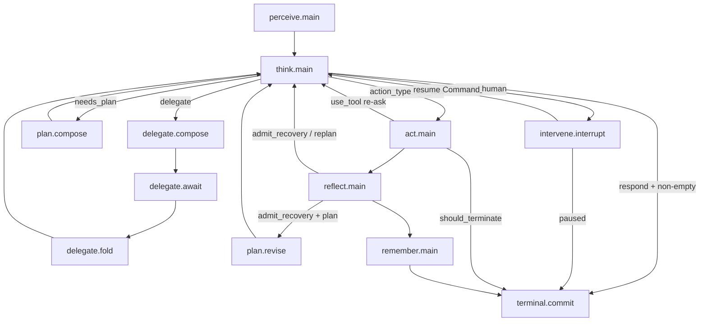
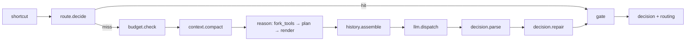
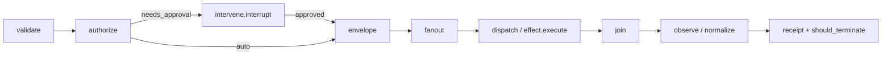

# 02 — Proposed Phase-Graph Hierarchy

> Elegant target: **one outer six-phase plan**, **one three-tier nest** (agent → concept → primitive), industry essence absorbed into seams without a kitchen-sink node zoo.  
> Constraints preserved: closed set perceive→think→act→reflect→remember→stop/terminal; Gate⊂Think; Body→SafeExecutor→Sandbox only; single PlanInterpreter; declarative Bundle/Phase/Node/ports.

---

## 1. Design thesis (first principles)

1. **Outer plan owns control topology** (who runs next). Subgraphs own **typed transforms**. Plugins own **policies** (guards, leases, spine).
2. **Lineage A (outer six-phase) remains the production control spine**; Lineage B’s richer concept graphs become the **implementation** of those subgraphs — not a second outer loop.
3. **Cross-cutting capabilities that are not cognition phases** (`plan`, `intervene`, `delegate`) are **sibling subgraphs** invoked by outer edges (ADR-0228), never a 7th phase.
4. **Every industry concern maps to exactly one of:** node · gate · Body/SE · edge · port · plugin · kernel — see `01-industry-matrix.md`.
5. **Merge before add.** Prefer collapsing synonym stacks (two perceive, two act, two observation folds) over minting new nodes.

---

## 2. Target hierarchy

```
Layer 0  Control plugins (not graph)
         guard-stack · continuous-control-plane · loop_cursor.spine_* · execution_policy

Layer 3  Outer plan  —  phase.main.outer
         perceive.main · think.main · act.main · reflect.main · remember.main · terminal.commit
         (+ optional edge targets: plan.* · intervene.* · delegate.* as sub_spec_ref nodes)

Layer 2  Phase subgraphs (region phase:*)
         perceive / think / act / reflect / remember
         each node is either leaf factory OR sub_spec_ref → concept.*

Layer 1  Concept graphs (reusable typed pipelines)
         history / prompt / decision / gate / effect / observe / memory / …

Layer 0b Primitive graphs
         llm.invoke · capability.fork · spine.emit · dto.map
```

**Single outer entry for all production profiles:** `bundles/outer/phase_main.yaml`.  
**Deprecate as outer:** `agent.run.phase` linear five-turn (keep only as a *profile template* that patches phase subgraphs, or delete after cutover).  
**Delete:** `declarative-phase-graph` edge SSOT once outer YAML owns all edges (including recovery + loop budget).

---

## 3. Mermaid — outer control



Notes:
- `plan` / `intervene` / `delegate` are **not** phases; they are outer nodes with `sub_spec_ref` into sibling regions.
- Recovery edge **lives on outer YAML** (today only in `declarative-recovery.yaml`).

---

## 4. Mermaid — Think (target)



Gate remains terminal of think; Gate⊂Think invariant unchanged.

---

## 5. Mermaid — Act (target)



Side effects only under `dispatch → effect.execute → Body → SafeExecutor → Sandbox`.

---

## 6. Node checklist — Add / Merge / Clean / Keep

### 6.1 KEEP (core, already right)

| Node / seam | Why |
|---|---|
| Outer six-phase + `terminal.commit` | Closed set + typed terminate |
| `think.shortcut` → `route.decide` → reason → history → llm → parse → gate | Solid think waterfall |
| `gate.chain.run` / `gate.chain.reject` | Gate⊂Think |
| `act.validate` → `authorize` → `envelope` → `dispatch` → `observe` | Body boundary discipline |
| `effect.execute` | Sole effect gateway hop |
| `ForkedTools` on think vs execute on act | Visibility ≠ execution |
| Reflect `score` + `admit_recovery` | Recovery admit |
| Remember `write` (+ admit policy in concept) | Memory write path |
| `guard-stack` / LoopGuardPolicy / ToolGuard | Hermes/DSH essence without new phase |
| `loop_cursor.spine_*` | Observation plane |
| ADR-0225 no max_visits | Budgets on edges/Gate |

### 6.2 ADD (lean — only if matrix P0/P1)

| New node / subgraph | Region | Ports (sketch) | Absorbs |
|---|---|---|---|
| `think.budget.check` | think | in: state → out: routing \| continue | max_turns, token/cost ledger |
| `think.context.compact` | think | in: writer/state → out: compact_receipt | compaction / compression |
| `think.decision.repair` | think | in: decision → out: decision \| routing | truncated JSON, schema repair |
| `act.fanout` / `act.join` | act | envelope → receipts[] → receipt | parallel tools + join barrier |
| `intervene.interrupt` / `intervene.resume` | intervene | decision → Command; Command → think | HITL approve/edit/reject |
| `plan.compose` / `plan.revise` | plan | TaskList ports | Plan-Execute |
| `delegate.compose` / `await` / `fold` | delegate | DelegationRequest/Receipt | handoff / subagent |
| Outer edges: `reflect→think` recovery; loop budget; intervene/plan/delegate | outer | RoutingDecision / Command | lineage C edges → outer SSOT |

**Optional / P2 only:** `perceive.claim.admit`, `act.intent.fs`, provider `llm.failover` wrap.

### 6.3 MERGE (dedupe dual lineage)

| Merge | Into | Delete / retire after |
|---|---|---|
| Production perceive (observe/fold) + concept perceive (4-node) | **One** perceive subgraph: collect→sensor→fold→compose (or observe≡collect+sensor, fold≡compose) | Duplicate leaf factories |
| `act.*` five-step + `concept.action.turn` (resolve/grant/execute) | **One** act subgraph: validate→authorize→(approve)→envelope→fanout→dispatch→join→observe; map resolve/grant into validate/authorize/envelope | `concept.action.turn` as parallel vocabulary |
| `act.observe` receipt fold + `reflect.observation.build` | Single `concept.observe.normalize` used by act then reflect | Dual observation builders |
| `think.reason.render` + `concept.prompt.render` | One prompt pipeline (sections.assemble/fill/trace) behind `think.reason.render` | Duplicate render |
| `decision.parse` vs `decision.classify` (parse+compose) | One parse→compose concept behind `think.decision.parse` | Twin parse paths |
| Remember `write` + `fold` | Single write node emitting `memory_receipt` | `phase.remember.fold` |
| `think.route` (empty-ish) into `think.route.decide` | One router node | Extra hop |
| `agent.run.phase` linear outer vs `phase.main.outer` | **Outer = phase.main.outer only**; agent turns become doc/templates or phase implementations | Second outer loop |

### 6.4 CLEAN (remove / stop teaching)

| Item | Reason |
|---|---|
| `bundles/declarative-phase-graph.yaml` as edge SSOT | Duplicate outer edges; delete-when already declared |
| `declarative-recovery.yaml` after outer owns recovery edge | Same |
| Guide references to `stop.main` / `phase_main_outer.yaml` | Rename to `terminal.commit` / `outer/phase_main.yaml` |
| `@graph_node` decorator path | ADR-0228 Decision 1 — hand-written `@plugin` only |
| Foreign product names in node ids | N9 closed domains only |
| Kitchen-sink “one node per Hermes counter” | Keep counters in `loop.policy` + Gate |
| Parallel checkpointer product | Journal/spine is resume SSOT |
| Second runtime / GraphAssembler parallel driver | Forbidden |

---

## 7. Proposed node inventory (target production)

### Outer (`phase.main.outer`)

| id | Kind | Nested |
|---|---|---|
| `perceive.main` | subgraph | perceive.subgraph |
| `think.main` | subgraph | think.subgraph |
| `act.main` | subgraph | act.subgraph |
| `reflect.main` | subgraph | reflect.subgraph |
| `remember.main` | subgraph | remember.subgraph |
| `plan.compose` / `plan.revise` | subgraph (optional profile) | plan.subgraph |
| `intervene.interrupt` / `intervene.resume` | subgraph (optional) | intervene.subgraph |
| `delegate.compose` / `await` / `fold` | subgraph (optional) | delegate.subgraph |
| `terminal.commit` | binding terminate | — |

### Perceive (merged)

| id | Duty |
|---|---|
| `perceive.input.collect` | Raw inputs / claim optional |
| `perceive.sensor.run` | Sensors |
| `perceive.observation.fold` | Normalize observations |
| `perceive.manifest.compose` | → `in_assembled_manifest` + `observation` |

### Think

| id | Duty |
|---|---|
| `think.shortcut` | Deterministic hit |
| `think.route.decide` | RoutingDecision |
| `think.budget.check` | **ADD** ledger / max_turns |
| `think.context.compact` | **ADD** compress before model-visible |
| `think.reason.fork_tools` | ForkedTools |
| `think.reason.plan` | Turn plan / prompt plan |
| `think.reason.render` | Prompt (concept.prompt.render) |
| `think.history.assemble` | ModelVisibleRequest |
| `think.llm.dispatch` | LLM + persist-before-execute |
| `think.decision.parse` | Decision |
| `think.decision.repair` | **ADD** repair/reject |
| `think.gate` → gate.chain.* | Enforce |

### Act

| id | Duty |
|---|---|
| `act.validate` | Shape |
| `act.authorize` | Policy / budget / dangerous |
| `act.envelope` | CommandEnvelope |
| `act.fanout` | **ADD** parallel tool_calls |
| `act.dispatch` → effect.execute | Side effects |
| `act.join` | **ADD** barrier |
| `act.observe` | Normalize receipt + should_terminate |

*(HITL sits on outer/intervene edge before envelope, not as act phase pollution.)*

### Reflect / Remember

| id | Duty |
|---|---|
| `reflect.score` | Reflection |
| `reflect.admit_recovery` | next_hint / replan flag |
| `remember.write` | admit+dispatch+receipt |

---

## 8. Migration phases

### Phase M0 — Document & freeze (this plan)
- Inventory frozen; no behavior change.
- Agree: outer `phase.main.outer` is sole control spine.

### Phase M1 — Outer SSOT edges (P0)
- Move recovery + loop budget + error→terminal predicates into `phase_main.yaml`.
- Profiles drop `declarative-phase-graph` / `declarative-recovery` once parity tests pass.
- Fix guide naming (`terminal.commit`, path `bundles/outer/phase_main.yaml`).

### Phase M2 — Converge dual stacks (P0)
- Perceive: adopt 4-step concept under `perceive.main` **or** map 2-step≡4-step with one factory set.
- Act: single vocabulary; retire `concept.action.turn` parallel names.
- Observation: one normalize concept.
- Decision: one parse→compose path.
- `agent.run.phase`: stop shipping as alternate outer; reuse as patch source only.

### Phase M3 — Loop quality nodes (P1)
- Land `think.budget.check`, `think.context.compact`, `think.decision.repair`.
- Land `act.fanout` / `act.join` (Body batch remains implementation).
- Wire intervene before envelope for dangerous tools (ADR-0228 PR-3.7.c).

### Phase M4 — Plan / Delegate (P2)
- `plan.compose/revise` + TaskList SSOT.
- `delegate.compose/await/fold` + capability monotonicity.
- Nest handoff history into Session fold.

### Phase M5 — Hygiene
- Delete legacy bundles with delete-when satisfied.
- Audit N9 naming; no foreign product ids.
- Architecture tests: one outer entry; one effect hop; Gate⊂Think; no max_visits.

---

## 9. Acceptance criteria

| ID | Criterion |
|---|---|
| A1 | Exactly one production outer plan id (`phase.main.outer`) referenced by web-standard (+ recovery variants only patch edges) |
| A2 | Closed phase set unchanged; plan/intervene/delegate are non-phase subgraphs |
| A3 | All world side-effects still pass `effect.execute` → Body → SafeExecutor → Sandbox |
| A4 | Gate is only Decision rewrite path; advisory guards do not rewrite |
| A5 | Recovery `reflect→think` and loop budgets declared on outer YAML (not only legacy plugins) |
| A6 | HITL pause/resume via `Command` + journal; no sole reliance on `ask_user` string path |
| A7 | No duplicate perceive/act/observation/parse stacks in the active profile graph |
| A8 | Budget/compact/repair/fanout/join either landed or explicitly deferred with owner + delete-when on stubs |
| A9 | Node ids obey N9 action-domain closed set; zero foreign product tokens in ids |
| A10 | Spine remains observation SSOT; continuous-control remains lease/control plugin — no merged “god bundle” |
| A11 | Existing think/act tool-hop contract tests + three-tier dispatch tests green after each M-phase |
| A12 | Docs guide matches YAML (paths, terminal name, edges) |

---

## 10. Anti-goals (elegance guardrails)

- Do **not** create a node for every industry checkbox in §01.
- Do **not** add a parallel outer `agent.run.phase` “v2” forever — converge.
- Do **not** put compact/approve/delegate into the six-phase enum.
- Do **not** reintroduce per-node `max_visits`.
- Do **not** let guard-stack become a seventh phase by renaming plugins into phase nodes.

---

## 11. One-page target vs today

| Today | Target |
|---|---|
| Outer A + agent B + declarative C edges | Outer A only; B concepts feed A; C edges folded into A |
| Think strong; missing budget/compact/repair | Think waterfall complete |
| Act strong; parallel/HITL opaque | Act + fanout/join; intervene before envelope |
| Reflect recovery off-outer | Recovery on outer |
| Remember write+fold | Single write |
| Guards/spine/CCP correct as plugins | Stay plugins |
