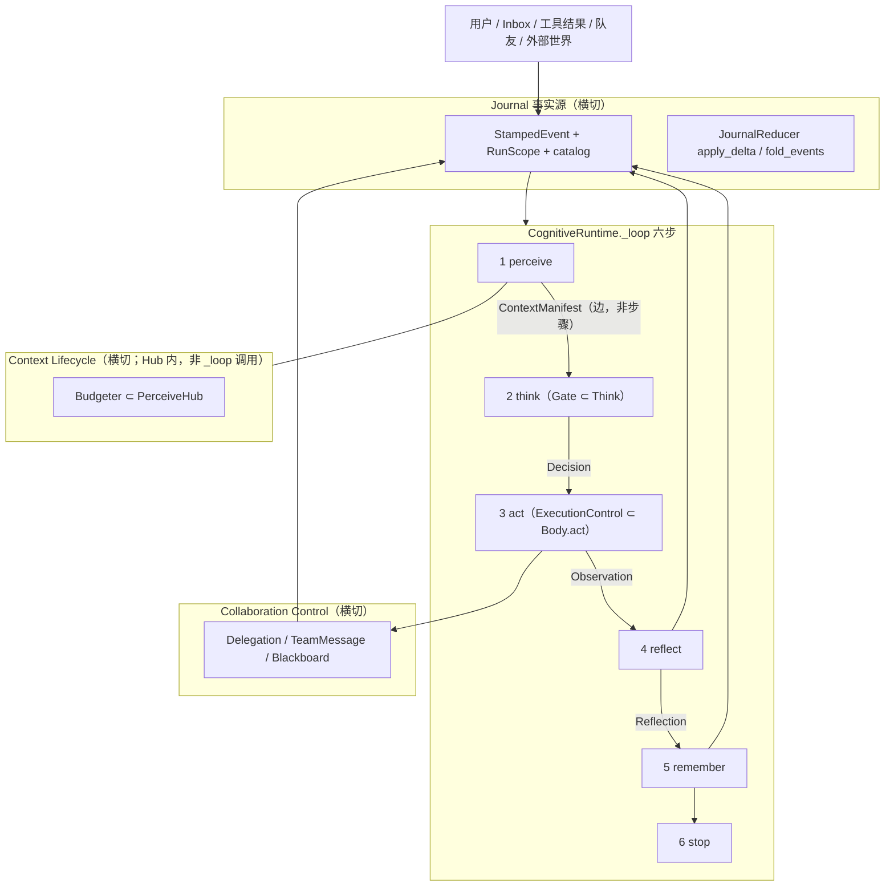
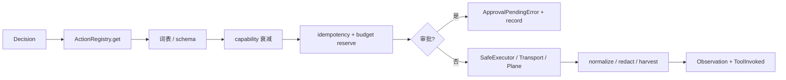
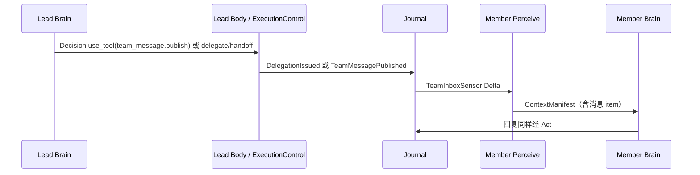

# 认知原语插件宪法 v3.0

**双平面内核 · 四个横切承重系统 · 零挂钩增长**

| 字段 | 值 |
|---|---|
| 日期 | 2026-08-19 |
| 作者 | LCA Architecture（Draft for ADR Review） |
| 状态 | Draft for ADR Review |
| 取代 | 原 `2026-08-19-cognitive-primitive-plugin-design.md`（✅ Approved 原宪法；其 Phase 1 变为本文 PR Plan 的早期 PR，文件已归档） |
| 废止（作为评价，不在树内） | internal Manus v2 eval, 2026-08-19, not in tree |
| 必须修订的 ADR | ADR-0002（废止「新特性只能 Hook」；PR1 写入 supersession 前向引用，全文补丁在 PR11） |
| 必须遵守的 ADR | ADR-0001 五层单向、ADR-0004 Protocol-First、ADR-0005 L4 组合根、ADR-0015 contracts 无行为类、ADR-0030/0034/0035 Team、ADR-0037 Journal-as-Truth |
| 装配仍有效 | plugin-tree-runtime-design（已归档）、cordis-migration-design（已归档）——运行时是 cordis；本文约束 *挂什么*，不换内核 |

**一句话：** Agent 的认知永远是封闭六步循环；世界副作用永远经 Body 内的执行窄门；模型可见事实永远可由 Journal 重建；跨 Agent 协作永远经有权限的消息与共享资源进入 Perceive。插件只换实现，不在循环上开洞。

本文是 **宪法 + 可实施目标架构**。原宪法 Phase 1 不是目标态，而是 PR1–PR5 的早期切片。v2 补上的四根承重柱予以保留，但全部落在现网类型、Journal catalog 与 Composer 组合根上——不平行造第七步、第四套事件词表、第三套插件 schema。

---

## 摘要 / 快速理解

### 一句话

Agent 认知 = 封闭六步循环；世界副作用 = 经 Body 执行窄门；模型可见事实 = Journal 重建；跨 Agent 协作 = 有 ACL 的消息与共享资源。插件只换实现，不在循环上开洞。

### 7 条核心命题

| 编号 | 命题 | 位置 |
|---|---|---|
| C1 | 六步闭集（perceive → think → act → reflect → remember → stop）| §4.1 |
| C2 | 脑手分离（认知不写世界，执行不改认知）| §3 |
| C3 | Journal 唯一事实源（模型可见 ⇒ 已记录）| §6 |
| C4 | Reducer 唯一写 State（禁止 Sensor/Gate/Body 原地修改）| §5.2 |
| C5 | Capability 衰减（子代理 grant ⊆ 父代理）| §13.3 |
| C6 | 闭集纪律（改闭集必 ADR，默认否决）| §4.3 |
| C7 | 每个原语默认 no-op（最小化原则）| §3.4 |

### 8 个概念群

```
State / Perceive / Think / Gate / Act / Memory / Collaboration / Journal / Composition
```

群内原语 + 群内策略 + 观察 hook 三层分离（§3.1）。

### 5 层配置

```
默认（baseline，所有 plugin 都是 Null）
  ↓
Profile（用户选择："我用哪种 agent"）
  ↓
Bundle（共享组合："这一类原语的标准实现"）
  ↓
Plugin（最小单元："这一个原语或一个 hook"）
  ↓
Role（个性化："这个 agent 是什么样的人"）
  ↓
TaskContract（实例级："本次 run 做什么"）
```

读 Profile = 理解系统（§3.7）。

### 6 个典型用例

| 章节 | 用例 | 模式 |
|---|---|---|
| §13.2 | minimal / standard / code / cordis | 单 agent 形态 |
| §13.4 | Ralph Loop | 工作流自动化 |
| §13.5 | Voyager / MemGPT / MetaGPT / LATS / Devin | 复杂模式 |
| §13.6 | Self-Improving 闭环 | 自进化系统 |

每个用例都是同一套原语的不同组合——**零新增原语**。

### 与业界框架对比

| 框架 | 哲学 | v3 关系 |
|---|---|---|
| **DSH（DeepSeek Harness）** | 自由主义扩展（哪里都能加 hook）| v3 给**宪法主义纪律**，但复用 cordis 微内核 |
| **Hermes Agent** | 离线 fine-tune + 工具调用 | v3 自进化是**在线 + 闭环** |
| **OpenAI Agents** | 单层框架（agent + tools）| v3 是**5 层配置** |
| **LangGraph** | 图作为默认循环 | v3 中图是 Brain 内部 / Team Graph，非默认 |

### 阅读路径

```
30 秒    →  本摘要（§摘要）
10 分钟  →  §3.1–§3.7 基础（概念、群、最小化、配置）
1 小时   →  §4–§12 宪法 + 横切 + 运行时细节
2 小时   →  §13.1–§13.6 典型用例
持续     →  §14–§32 业界概念、ADR、测试、CI、PR
```

### 与 DSH / Hermes / OpenAI 的关键差异

| DSH | Hermes Agent | OpenAI Agents | **v3** |
|---|---|---|---|
| 60+ 事件 hook | 离线 fine-tune | 单层 agent | **8 群 × 30 原语 + 5 层配置** |
| 30+ ctx key | 用户主导 prompt | hardcoded tools | **PluginMeta TypedDict** |
| baseline 默认装载 | 无显式 skill 库 | 无 memory 分层 | **每个原语 Null 默认 + procedural memory** |
| 无 TaskContract | 无自进化 | 无审计 | **TaskContract + GoalStack + Journal** |

**v3 不是替代 DSH / Hermes Agent，而是它们的"宪法层"**——DSH 提供可扩展内核，v3 在认知层加纪律。

---

## 目录

### 基础（§0–§3）

- §0 与原文 / v2 / 现网的关系
- §1 为何修订
- §2 目标 / 非目标 / 可验证成功属性
- §3 总体架构：双平面 + 四个横切系统
  - §3.1 概念分层（群、原语、策略）
  - §3.2 八个概念群（State / Perceive / Think / Gate / Act / Memory / Collaboration / Journal / Composition）
  - §3.3 未来加功能的判定树
  - §3.4 最小化原则：每个原语默认 no动作
  - §3.5 整体链路与插件依赖
  - §3.6 评估对齐：架构评审 10 面对照表
  - §3.7 配置驱动的系统：让配置 = 系统理解

### 宪法与横切（§4–§12）

- §4 宪法：闭集、开放原语、扩展法、控制口 vs 观察口
- §5 认知运行时：阶段权限、StateView / Delta、规范 _loop、AST 白名单
- §6 Journal：信封、映射表、可见性、Reducer、checkpoint vs replay
  - §6.5 日志 Schema 与 Trace 串联
  - §6.6 投影（JournalProjector 派生 UI / 实时仪表盘）
  - §6.7 Metrics 与 SLO（架构级指标）
- §7 Context Lifecycle：ContextManifest、Budgeter、Compaction、PromptRenderer
- §8 记忆：四层所有权、MemoryPolicy、禁止万能口袋
  - §8.3 TaskContract（任务契约）
  - §8.4 GoalStack（目标栈）
- §9 ExecutionControl：Decision → Plan → Envelope → Observation
  - §9.3 ExecutionEnvelope 扩展（RiskLevel + 批准粒度）
- §10 Inbox：三种投递，零认知旁路
  - §10.2 指令 / 数据通道物理分离
- §11 Team / 协作控制面
- §12 产品形态

### 典型用例（§13）

- §13 Creator：组合而非隐式控制流
- §13.1 Creator 等价物（DSH 创造模式在我们的体系下）
- §13.2 4 个 Preset 的实现（minimal / standard / code / cordis）
- §13.3 创造模式实现细节（Composer.mount / CordisControlTool / PluginMeta）
- §13.4 Ralph Loop（工作流自动化的典型用例）
- §13.5 复杂模式的典型用例（Voyager / MemGPT / MetaGPT / LATS / Self-Improving / Devin）
- §13.6 自进化体系：v3 的系统级能力

### 落地与治理（§14–§32）

- §14 业界概念编译表
- §15 Agent 问题 → 原语
- §16 有意不做成原语
- §17 字段所有权矩阵
- §18 API / Protocol 变更
- §19 数据模型 / 事件 schema / 迁移
- §20 对现状的修订表（避免两套教义）
- §21 可观测性、错误分型、恢复
- §22 安全与隐私（含 §22.5 记忆投毒防御）
- §23 架构治理与 CI 硬门禁
- §24 测试金字塔（含 §24.5 日志诊断模式库）
- §25 实施路线图（阶段 0–7）
- §26 验收条件
- §27 Alternatives Considered
- §28 Risks
- §29 Key Decisions
- §30 Open Questions
- §31 PR Plan
- §32 References

---

## 0. 与原文 / v2 / 现网的关系

### 0.1 现网一句话（2026-08-19 核实）

生产认知循环是 `CognitiveRuntime._loop`（`lca/layer2_runtime/runtime_loop.py`），由 `AgentComposer.compose`（`lca/layer4_app/composer.py`）直接构造。`lca-loop-cognitive` 的 `build_cognitive_live_agent` 是 `NotImplementedError`。插件 **不** 驱动 `_loop`。`Sensor` / `PerceiveHub` / `ClockSensor` / `RepeatToolCallGate` / `ContextManifest` / `DegradationPolicy` **都不存在**。Journal-as-Truth 对 run 叙事 / SSE / OTel 成立，**不能**重建下一轮模型 prompt。

### 0.2 v3 相对原宪法的 delta

| 原宪法 | v3 |
|---|---|
| `Sensor.sense(state) -> AgentState` | 目标 API 是 `sense(StateView, JournalCursor) -> PerceptionDelta`；可变 State 只允许 `JournalReducer` / Runtime 投影。Phase 1 可有兼容 adapter，不是终态。 |
| Clock 默认不可见、不写 journal、Reasoner 自带 `current_date` | **否决**。模型可见 ⇒ 已记录。Clock 是带 journal ref 的 context item；禁止 Reasoner 私自 `datetime.now`。 |
| Gate 合法写 `working_memory["loop_warning"]` | **否决**。硬规则结果是版本化 `PolicyFact`，经 Gate 事件入 Journal，下一轮 Perceive 准入 `ContextManifest`。 |
| 本期 `_loop` 继续 `_emit`、永远忽略返回值当作目标 | 忽略返回是 **PR5 过渡**；目标是拆掉 `_emit` 控制路径（PR10）。 |
| 无 Journal / Context / Execution / Collaboration 承重柱 | 四系统作为横切补齐，**不是**新循环阶段。 |
| Phase 1 即「宪法落地」 | 宪法描述目标架构；Phase 1 变为 PR1–PR5。 |
| 未点明 Composer vs plugin 两套装配 | 写明：生产组合根是 Composer；plugin 提供实现，禁止听 `agent.*` 做控制。 |

### 0.3 v3 相对 Manus v2 的 delta

| v2 | v3 |
|---|---|
| 新事件词表（`perception.merged`、`context.manifested`、`gate.decided`…）作为主名 | **映射到现网** `journal_catalog.py`。已有类型复用（`DecisionMade`、`ToolStarted`/`ToolInvoked`、`StepCompleted`、`ActionDegraded`…）；只为真缺口 mint 新 `JournalEvent`。 |
| 发明 `PrimitiveManifest` 第三套插件 schema | **否决**。能力图 = 现有 `@plugin(..., meta=)` + bundle YAML 的 inspect 投影。 |
| 脑平面 Mermaid 把 Gate 画成与 Perceive/Think 并列的一步 | Gate 是 Think 的确定性收尾，闭集仍是六步。 |
| 未迁移原宪法 §8 编译表、§9 问题表、§5 Inbox 三投递、§10 有意不命名、扩展法、控制口 vs 观察口 | **全部迁回**并按 v3 落点修订。 |
| 未对照代码核实「plugin 驱动循环 / Journal 可重建 prompt」 | 明确：两者都不成立。 |
| `DecisionGate.evaluate` 新名字 | 复用现网 `DecisionGate.enforce`；返回值演进为 `DecisionVerdict`。 |
| Journal 信封另起一套 `event_id/stream_kind/...` | **扩展** 现网 `StampedEvent` + `RunScope` + `JournalSchemaMeta`，不换信封。 |
| DSH loop 叙述含糊 | DSH 是 `execution_target` / 整段 `loop:` 插件替换，不是第七步。 |

### 0.4 代码现实清单（禁止文过饰非）

| 事实 | 证据 |
|---|---|
| `_loop` 把 `_emit` 返回值赋回 `state`；waterfall 可改 State | `runtime_loop.py`：`state = await self._emit(...)`；`InMemoryMiddlewareRegistry.run` waterfall 模式用返回值替换 `current` |
| loop warning **三路径** | (1) `_detect_and_inject_loop_warning` 写 `working_memory["loop_warning"]`；(2) `install_loop_intervention` → `agent.after_act` 同样写该键（Composer 生产路径）；(3) **死** cordis 监听：`lca-guard-loop-intervention` 听 `ctx.events.on("agent.after_act")`，循环从不发 cordis 事件；即便跑起来也是改 **dict** `state["loop_intervention"]` / `recent_tools`，不是 `AgentState.working_memory["loop_warning"]`。PR4 与死插件 `lca-guard-step-budget` 一并删除 |
| `lca-guard-step-budget` 同样是死的 | `ctx.events.on("agent.pre_step")`；循环不发该事件。真预算在 `DefaultStopRule` + `state.budget` |
| `Sensor` / `PerceiveHub` / `ClockSensor` / `RepeatToolCallGate` 不存在 | 全仓库 class 搜索为空。原宪法 Phase 1 未落地 |
| `ActionType` 闭集 6 | `RESPOND, USE_TOOL, DELEGATE, HANDOFF, STOP, ASK_HUMAN` |
| 生产 HIL ≠ LLM 原生 `ASK_HUMAN` | `build_decision_from_response` 只出 `USE_TOOL` / `DELEGATE` / `RESPOND`。HIL = `askUserQuestion` tool + `ApprovalPendingError`。`resume` 才补一条 `ASK_HUMAN` Turn |
| `Decision.rationale` 通常为空 | `llm_result.py` 成功路径 `rationale=""` |
| Journal 不重建 prompt | `LlmCallCompleted.prompt_preview` 截断/脱敏；下一轮 Think 由活 `AgentState` + `PromptReasoner` + `build_tool_history` 重拼。Checkpoint = `StateStore`，不是 journal replay。`fold_run_state` 只折 `RunStatus` |
| 记忆四层 **名字** 在，检索是拼接覆盖 | `SimpleMemorySystem.perceive` 把四层 list 全部写入 `retrieved_context`。Compaction 包是 DSH `NotImplementedError` stub。`TeamSpec.shared_memory_layers` 默认 `()`；只有 semantic+procedural 可共享 |
| Team XOR 扎实；无 blackboard / TeamMessage | `TeamSpec.governance: LeadSpec \| Coordination`。通信 = `send_and_wait` + prompt 里的 `TeamAwareness` |
| Inbox 在 harness，**未被 `_loop` claim** | `lca/harness/session/inbox.py` 三投递存在；`CognitiveLiveAgent` 只在 harness 测试路径。生产 `/runs` 走 `CognitiveRunDriver` → `Agent.run(question)` |
| Prompt 无 `ContextManifest` | `PromptReasoner.generate_thoughts`：模板 + WM + `retrieved_context` + skills + team awareness + `loop_warning` + **自己的** `current_date` |
| 执行链 | Brain → Body → ActionRegistry → `SimpleSafeExecutor`。`PipelineSafeExecutor` 存在但 Composer **不**接线。Plane 在 gateway `plane_bindings_scope` 绑定，不在 `_loop` 内。`ToolCall.idempotency_key` 字段存在、执行未用。缓存键 = `name + json.dumps(args)` |
| 读 workspace 的 Gate 违反「只有 Perceive 读世界」 | 活链：`ToolLoopBreakerGate → ProgressLoopDetector → OfficeWorksSealer → TerminalRespondGate → ArtifactRespondInjector`。后三个碰 `get_run_workspace()` / `seal_office_works()` |
| `DegradationPolicy` 有名无类 | ADR-0002 与 `SimpleBody` 注释点名；`tests/test_code_conventions.py` 把它列在 glossary「已删除」。Gate 强制新 `Decision` 多数不填 `degraded_from` |
| 两套装配故事 | 生产 = Composer。plugin 树提供 llm/tools/memory/`brain_factory`；`lca-loop-cognitive` 不构造 `CognitiveRuntime` |
| ADR-0002 声称的 CI 门禁大半不在 | 无 `HOOK_NAMES`；无 `_loop` AST≤30 测试（实测 `_loop` 嵌套语句约 55）。存在的是 `tools/ci/check_cognitive_loop_order.py`（只查调用相对顺序） |

---

## 1. 为何修订

原宪法的洞是对的，也是不够的。

**原宪法钉死了不该再长的东西：** 认知控制不能再靠 `agent.before_*` / `agent.after_*` 无限生长；循环闭集六步；Team 不是超级 Agent；DSH 的 I/O seam（手）留下，DSH 的 pre-step 挂钩式认知（脑）禁止再长。这些全部保留。

**原宪法没承载、v2 补上的四项基础设施** 是长程 Agent、审批、重放、Creator、群聊真正的承重结构：

1. **Journal 事实源** — 模型输入可重建，而不只是 run 叙事可投影。
2. **Context Lifecycle** — 预算、检索、压缩、渲染有策略，而不是 Reasoner 私自拼 prompt。
3. **Execution Control** — 副作用经统一窄门（capability / 审批 / 幂等 / 审计），而不是 Body 内部一堆隐式行为。
4. **Collaboration Control** — 委派 / 消息 / blackboard 三通道带 ACL，而不是只靠 `TeamAwareness` 字符串进 prompt。

它们是横切系统，**不是**第七个认知阶段，也不是第二套脑。

**对照代码之后，v3 改了 v2 会制造平行宇宙的部分：**

- 不另起事件主名。v2 的 `perception.merged` 等是 **映射键**，生产类型仍是 `JournalEvent` 子类。
- 不发明 `PrimitiveManifest`。现网插件面是 `@plugin` + YAML bundle；Creator inspect 是派生图。
- 不把 Gate / ExecutionControl / Compaction 画进 `_loop` 的步骤列表。
- 不把「plugin 驱动认知」写成现状。
- 不把「忽略 `_emit` 返回值」写成终态——那是拆控制路径之前的止血。
- 不保留「Clock 对模型不可见」——它与 Reasoner 已把日期写进 prompt 的事实互相矛盾。

修订的直接原因还有一条工程债：loop warning 被合法化成 Gate 写 `working_memory` 的例外，于是 Repeat / Progress 两条路、inline / middleware / 死插件三条注入，模型看见的警告在 Journal 里没有对应事实。这是原宪法最深的机制错误，不是缺一个 if。

---

## 2. 目标 / 非目标 / 可验证成功属性

### 2.1 目标

| 编号 | 目标 | 成功定义 |
|---|---|---|
| G1 | 认知控制可定位 | 任一 State/Decision 改变都能定位到 `_loop` 编排的 Protocol、已声明 Gate/Stop/Degradation、或 `JournalReducer`。不存在隐式控制 Hook。 |
| G2 | 事实源唯一 | 任一 Think 的模型可见上下文、任一世界副作用、任一团队消息均可从 Journal 及其引用重建。`SessionService` / harness `SessionEvent` 不是第二真源。 |
| G3 | 副作用受控 | 工具、文件、网络、设备、远程 Agent、TeamMessage 发布均经 Body 内执行窄门，受 capability、预算、审批、幂等与审计约束。 |
| G4 | 长程可持续 | 上下文预算、检索、压缩、记忆写入有明确策略、证据链和评测；`working_memory`/`extra` 不是无类型口袋。 |
| G5 | 团队可治理 | Team XOR 保留；群聊/委派/共享资源走显式协议 + ACL + 租约 + 预算。Team 不是超级 Brain。 |
| G6 | 创造可约束 | 新能力由 Protocol 实现 + profile/bundle 组合；不能绕过闭集、执行控制、Journal 或测试门禁。 |

### 2.2 非目标

- 不强迫同一 Brain / 模型 / 向量库 / Transport / UI。
- 不把 DSH、LangGraph、任一工作流引擎、任一种多 Agent 拓扑做成默认循环。
- 不承诺自动解决幻觉、业务正确性、组织治理。
- 不把调度、会话标题、telemetry exporter 升格为认知原语。
- 不在本期改 LobeHub UI 交互模型（群聊 UI 只消费 Journal 投影，另开产品 PR）。
- 不 port DSH 包本体（compaction-basic 等）；只吸收其 I/O seam 与「手可换」的价值。
- 不把 `ctx` 做成 L1–L3 Service Locator。
- 不把 ToT/Graph/MAP 做成 L2 阶段。

### 2.3 可验证属性（机械）

1. **总流程六步**：`_loop` 只调用 `perceive → think → act → reflect → remember → stop`。`ContextManifest` 是 Perceive **产出的边**（数据），不是第七步。没有「还有 N 个认知挂钩」。
2. **单点**：打开一个脑插件，函数签名就是全部控制接口。
3. **替换**：换 Sensor/Gate/Brain/Body/Memory 实现不改 `_loop` 步骤集。
4. **重建**：抽样 Run 可用 `ContextManifested` + 引用事件重建该次 Think 的模型输入（不含 `prompt_preview` 猜测）。
5. **副作用**：每次工具/消息发送有 envelope + 终态 `Observation`；resume 不因 journal replay 重复外部写入。

---

## 3. 总体架构：双平面 + 四个横切系统

双平面内核不变。脑认识世界并决定；手把决定变成世界结果。四个横切系统 **服务** 这两个平面：它们不是新的 loop stage，不是第二套 Brain，也不允许手插件监听认知 Hook 改 Decision。



| 区域 | 责任 | 允许替换 | 绝对禁止 |
|---|---|---|---|
| 脑平面 | 可见事实 → Decision；反思、记忆、停止 | Brain、Sensor、Gate、Critic、Memory、StopRule | 直接执行世界副作用；听 `agent.*` 改 State |
| 手平面 | Decision → 安全执行 → Observation | Tool、Plane、Provider、Transport、Sandbox、SafeExecutor | 听认知 Hook 改 Decision/State |
| Journal | 记录事实与因果；投影 State / UI / eval | 存储、索引、Projector | 保存模型可见内容的第二套真相 |
| Context Lifecycle | 预算、检索、压缩、渲染 | Retrieval / Compaction / MemoryPolicy | 从未记录的全局状态直接拼 prompt |
| Collaboration | 委派、消息、blackboard、ACL、租约、冲突 | Transport、TeamStrategy、Synthesizer、消息策略 | 直接写其他 Agent 的 State 或私有记忆 |

**DSH loop 落点：** `gateway/runs/loop_drivers.py` 的 `execution_target="dsh"` 换的是 **整段运行时**（`DshRunDriver`），等价于替换整个 `loop:` 插件。它不在六步旁边加阶段。比较驱动（compare-driver）同样是 execution_target，不是认知原语。

**Spawn 落点：** 生产对象图由 `spawn_agent` / `spawn_team` 闭合（`lca/layer4_app/spawn.py`）。群服务组装投稿（`PerceiveService.assemble` 等）；L4 禁止点名 `sensor.*` / `gate.*` 钥匙，禁止 Composer 类。装配纪律见 [ADR-0056](../adr/0056-plugin-group-contribution.md)。插件 **不得** `ctx.events.on("agent.*")` 做控制。

---

### 3.1 概念分层：群、原语、策略

任何复杂系统都把概念分三层。混淆这三层是认知成本的主要来源——这是 v3 之前架构难懂的最常见原因。

```text
原语（Primitive）   不可再分的基本概念。看名字知道职责。是宪法闭集讨论的对象。
策略（Strategy）    实现某个原语的具体方法。可替换。不是独立概念，不进宪法闭集。
群（Cluster）       一组相关的原语 + 共同的职责。是读者建立心智模型的入口。
```

**示例（区分原语与策略）**：

- `PerceiveHub` 是原语；`Budgeter` / `ConflictResolver` 是 Hub **内部**策略
- `SafeExecutor` 是原语；`SequentialExecutor` / `PipelineExecutor` 是策略
- `Memory` 是原语；`CompactionPolicy` / `IndexingStrategy` 是策略
- `Gate` 是原语；`LoopBreaker` / `SafetyGate` / `DegradationPolicy` 是 Gate **内部**策略
- `Brain` 是原语；`Reasoner` / `PromptRenderer` / `Critic` 是 Brain **内部**组件（也是原语，但同属 Think 群）

**v3 之前的失败模式**：把策略（`Budgeter` / `CompactionPolicy` / `DegradationPolicy` / `BlackboardPolicy` / `StopOutcomePolicy`）当原语提升到与 `Gate` / `Decision` 平级。每个策略都进闭集讨论、都进 CI 门禁、都进 ADR 流程。读者分不清"这是基本概念还是实现选择"。

**本文约定**：

- §4 闭集只列**原语**，不列策略
- §4.2 永远开放的原语只列**原语**，策略作为该原语的可替换实现另行归档（见 §4.2 后段）
- §4.3 扩展法把"新原语"与"新策略"分别处理
- 新原语 → ADR；新策略 → 普通 PR（仅群内讨论，不上 ADR）

### 3.2 八个概念群（Eight Concept Clusters）

从 Agent 系统的不变事实推导：

```text
F1  系统有内部状态                → 群 State
F2  系统需要从世界感知            → 群 Perceive
F3  系统需要影响世界              → 群 Act
F4  系统需要决策                  → 群 Think + 群 Gate
F5  系统需要跨时间保持信息       → 群 Memory
F6  系统可能需要多个互相协作     → 群 Collaboration
F7  所有发生的事实必须可重建     → 群 Journal（横切）
F8  系统由可替换部件组装         → 群 Composition（横切）
```

> 本节是**职责切分维度**；§3 的"双平面 + 四个横切系统"是**控制面视角**。两者并存：前者回答"加新功能时去哪个群"，后者回答"哪类原语在哪一个平面"。

| 群 | 职责（一句话） | 核心原语 | 主要策略（群内） |
|---|---|---|---|
| **State** | 唯一管理内部状态 | `AgentState`, `StateView`, `Reducer` | — |
| **Perceive** | 把世界信息整理成本次 Think 的清单 | `Sensor`, `PerceiveHub`, `ContextItem`, `ContextManifest` | `Budgeter`, `ConflictResolver`（Hub 内） |
| **Think** | 从清单产生决策 | `Brain`, `Reasoner`, `PromptRenderer`, `Critic`, `Decision` | `ChatRenderer`, `CodeRenderer`（Renderer 内） |
| **Gate** | 决策的确定性判决 | `Gate`, `DecisionVerdict`, `PolicyFact` | `LoopBreaker`, `SafetyGate`, `DegradationPolicy`（Gate 链内） |
| **Act** | 把决策变成世界结果 | `Body`, `ExecutionEnvelope`, `SafeExecutor`, `Sandbox`, `Observation` | `SequentialExecutor`, `PipelineExecutor`, `LocalSandbox` 等 |
| **Memory** | 跨时间保存有用信息 | `Memory`, `MemoryPolicy`, `MemoryCommitResult` | `CompactionPolicy`, `IndexingStrategy`（Memory 内） |
| **Collaboration** | 多 Agent 通信与协调 | `Team`, `TeamMessagePolicy`, `Delegation` | `Synthesizer`（Coordination 内） |
| **Journal**（横切） | 唯一事实源 | `StampedEvent`, `JournalEvent`, `Catalog`, `Projector` | — |
| **Composition**（横切） | 装箱 + 闭合对象图 | `Profile`, `Bundle`, `Patch`, 群服务 `assemble`, L4 `Composer` | L4 点名 `sensor.*` / `gate.*` 钥匙（[ADR-0056](../adr/0056-plugin-group-contribution.md)） |

**群与六步流程的对应**：

```text
perceive  = 群 Perceive（Sensor + Hub + Budgeter 策略）
think     = 群 Think（Brain + Reasoner + Renderer + Critic）
act       = 群 Act + 群 Gate（Body.act → Observation；Gate 输出 Verdict）
reflect   = 群 Think（Brain.reflect）+ 群 Memory（propose）
remember  = 群 Memory（commit）
stop      = 群 State（Reducer.apply_stop）

横切（任何时候都可能）：
- 任何群都可能 record()          → 群 Journal
- 任何群都可能 Reducer.apply_*() → 群 State
- 任何群都可能 TeamMessage / Delegation → 群 Collaboration
- 任何群的投稿由群服务 assemble、L4 闭合 → 群 Composition（[ADR-0056](../adr/0056-plugin-group-contribution.md)）
```

### 3.3 未来加功能的判定树

读者加新功能时，按此判定（先定位群 → 再定位原语 → 再定位策略）：

```text
要加"时间"                  → 群 Perceive：新 Sensor(clock)
要加"压缩上下文"             → 群 Memory：策略 CompactionPolicy
要加"目标管理 / Goal Stack"  → 群 State：AgentState.goal_stack 字段 + apply_goal 方法
要加"信念 / 置信度"          → 群 State：Decision.confidence 字段
要加"审批流程"               → 群 Gate（rewrite askUserQuestion）+ 群 Act（ApprovalRequested/Resolved 事件）
要加"新的循环图"             → 群 Composition：新 Profile 或新 Bundle
要加"新事件类"               → 群 Journal：先查 Catalog；不能复用就 mint（ADR）
要加"多 Agent 拓扑"          → 群 Collaboration：Coordination 加子类
要加"Blackboard"             → 群 Collaboration：v2+启用（ADR）
要加"流式输出"               → 群 Act：Observation subtype(STREAMING)
要加"AGENTS.md"              → 群 Perceive：Sensor(workspace-instructions)
要加"技能"                   → 群 Memory：procedural layer + activated_skills in State
要加"Critic / 自我批评"      → 群 Think：Brain 内部 Critic 子组件
要加"代码执行 / CodeAct"    → 群 Act：新 Tool（code interpreter）
要加"Computer Use"           → 群 Act：新 Tool（screenshot/click）+ Sandbox（device plane）
要加"Browser / RAG"          → 群 Act：新 Tool 或 群 Memory：Memory.query
要加"Router / 小模型分流"    → 群 Think：SkillRouter 或 Gate.try_shortcut
要加"MoA / Debate"           → 群 Collaboration：Coordination.FanOut / Debate + Synthesizer
要加"Voice / 实时"           → 群 Act：Transport + LLM 流式
要加"Multimodal"             → 群 Act：Observation subtype(IMAGE/AUDIO)
要加"ACP / A2A / MCP"        → 群 Act：Transport 或 Tool Provider
要加"Eval"                   → 群 Journal：Projector + score + golden traces
要加"动态插件实验 / 创造模式" → 群 Act：新 Tool(cordis_control)；
                  Composer 增加 mount/unmount/inspect API；
                  Tool 的 capability_grant 来自父 grant（C5 不可扩大）
要加"persona 渲染模式"      → 群 Think：PromptRenderer 内部策略（`Role.render_mode`），**不列为单独原语**
要加"换 Null 默认行为"      → 实现新 plugin，Profile 覆盖（普通 PR）
要加"观测某点"              → 实现 ObserverPlugin，监听对应 hook
要加"问题次数检查"          → 群 Think / 群 Act：监听 `brain.think.completed` / `body.act.completed`
```

**定位到群 → 定位到原语 → 定位到策略。三层永远分离。**

---

### 3.4 最小化原则：每个原语默认无动作

v3 的另一条核心命题：**每个原语默认 no-op**，行为是显式 plugin。这是 DSH "everything is a plugin" 的极致纯净版。

```text
原语（Primitive）   不可再分。看名字知道职责。必有 Null 实现。
策略（Strategy）    实现原语的方法。Null 策略也是合法策略。
观察 hook         每个原语都有纯观察 emit hook（不变 State / Decision）。
```

**为什么默认 no-op**：

- 用户说"我只想看 X" → 关闭其他原语（用 Null 覆盖）
- 用户说"我要替换 Y" → 替换 Y 的实现
- 用户说"我想知道 Z 在做什么" → 只打开 Z 的观察 hook

**三件套：每个原语 = Protocol + Null 实现 + 观察 hook**：

| 原语 | Null 实现（默认） | 观察 hook（emit 模式，纯观察） |
|---|---|---|
| `Sensor` | 空 `PerceptionDelta` | `perceive.sensor.completed` |
| `PerceiveHub` | 空 `ContextManifest` | `perceive.hub.completed` |
| `Brain` | 空 respond `Decision` | `brain.think.completed` |
| `DecisionGate` | 全部 `allow` | `gate.enforced` |
| `Body` | 不执行 | `body.act.completed` |
| `Memory` | 不记忆（空 WriteSet） | `memory.commit.completed` |
| `StopRule` | 永不停止 | `stop.decided` |
| `Reducer` | 不写 State | `state.applied` |

**默认配置 = baseline 全 Null**。系统跑通但不做事：模型看见空 prompt，没有工具，没有决策，没有记忆。Profile 按需启用 Standard 实现。

**示例：问题次数计数器**（用户典型诉求）：

```yaml
# profiles/with-counter.yaml
bundle:
  - id: turn-counter
    config:
      max_turns: 20
      count_think: true
      count_act: true
```

```python
@plugin(name="turn-counter")
class TurnCounterPlugin:
    """默认 disabled；启用后监听 brain.think.completed / body.act.completed。"""
    def apply(self, ctx):
        ctx.on("brain.think.completed", self.on_think)
        ctx.on("body.act.completed", self.on_act)

    async def on_think(self, payload):
        counter = payload.state.working_memory.get("turn_count", 0) + 1
        if counter >= self.config["max_turns"]:
            raise TurnLimitError(counter=counter, max=self.config["max_turns"])
```

**实施约束**：

- Null 实现零开销（空 manifest / 空 Decision / 空 Response）
- 观察 hook **emit 模式**（v3 §4.4 不变：不得返回改写后的 State，不得原地 mutation）
- 每个原语 **1 个观察 hook**，不细分（避免 hook 爆炸）
- 用户自定义 plugin 必须经 PluginMeta TypedDict 登记（§13 PR12）
- Null 实现所在：`lca/<层>/impls/null/`，强制存在；Standard 实现可选

**Profile 三档示例**：

```yaml
# profiles/minimal.yaml —— baseline 全 Null
bundle:
  - id: null-baseline        # 全部原语 Null

# profiles/standard.yaml —— 启用标准实现
bundle:
  - id: null-baseline
  - id: brain-react          # 覆盖 NullBrain
  - id: sensor-clock         # 加 ClockSensor
  - id: body-tool-registry   # 覆盖 NullBody
  - id: memory-four-layer    # 覆盖 NullMemory
  - id: gate-loop-breaker    # 覆盖 NullGate

# profiles/debug.yaml —— 标准 + 观测
bundle:
  - id: standard-bundle
  - id: brain-observer       # 观测 Brain 行为
  - id: body-observer        # 观测 Body 行为
  - id: turn-counter         # 加计数
```

**DSH vs v3**：

| 维度 | DSH | v3（本节） |
|---|---|---|
| 默认行为 | baseline plugin 提供（`compaction-basic` 等默认装载）| **每个原语 Null**（baseline 几乎零行为）|
| 可观测 | 60+ 事件 hook | 每个原语 **1 个**观察 hook |
| 可配置 | `disabled: !!js ...` | 同 |
| 可替换 | ctx 注册替换 | Protocol 替换 |
| 纯净度 | 90%（baseline 行为存在）| 100%（baseline 几乎零行为）|
| 调试粒度 | 事件级 | **原语级 + 事件级** |

DSH 给"哪里都能加 hook"的自由主义灵活性；v3 给"每个原语默认 no-op + 观察 hook"的纯净度，**调试粒度更细、改动范围更可控、开发可逐步累加观测点**。

---

### 3.5 整体链路与插件依赖

新人读完 §3.1–§3.4 后建立概念地图。本节给**整体链路**和**依赖关系**，让读者能在脑中走一次完整 Turn。

#### 3.5.1 整体链路（一次 Turn，6 步循环）

```text
Turn 入口
 ↓
Composer 构造（每个原语默认 Null/Standard 实现）
 ↓
Runtime.run 启动
 ↓
for step in range(state.step, max_steps):
 ↓
 1. Perceive（群 Perceive）
   Hub.perceive(view, cursor)
     Sensor × N → Delta
     Hub Budgeter 策略：挑候选
     Hub fold GateDecided → PolicyFact
     record(PerceptionMerged)
     record(ContextManifested)
   reducer.apply_delta(state, delta)
 ↓
 2. Think（群 Think）
   Brain.think(view, manifest)
     PromptRenderer.render(manifest) → prompt
     Reasoner.call(prompt) → response
     Critic.refine(response) → response'
     Decision = build_decision(response')
 ↓
 3. Gate（群 Think 内 — 确定性收尾）
   Gate.enforce(view, decision)
     LoopBreaker / SafetyGate / DegradationPolicy
   record(GateDecided)
 ↓
 4. Act（群 Act）
   Body.act(decision, view)
     ActionRegistry.get(action_type)
     构造 ExecutionEnvelope
     幂等检查 / 审批检查
     SafeExecutor.execute (策略 + Sandbox)
   record(ToolStarted / ToolInvoked | ToolDenied)
 ↓
 5. Reflect（群 Think）
   Brain.reflect(view, observation) → Reflection
   record(ReflectionCreated)
 ↓
 6. Remember（群 Memory）
   Memory.propose(view, observation, reflection) → WriteSet
   MemoryPolicy.commit(writes) → CommitResult
   record(MemoryCommitted | MemoryWriteRejected)
 ↓
 Stop（群 State）
   reducer.apply_turn(state, Turn)
   reducer.apply_activation(state, skills)
   checkpoint
   StopRule.decide → StopDecision
   if should_stop: reducer.apply_stop(state, stop) → break
 ↓
Turn 出口
 record(turn/end)
 agent/turn-stopping

观察 hook（每原语 1 个，emit 模式，纯观察）：
 perceive.sensor.completed
 perceive.hub.completed
 brain.think.completed
 gate.enforced
 body.act.completed
 reflect.completed
 remember.completed
 stop.decided
```

**链路稳定**：每个 Turn 都走 6 步 + 1 stop 决策；每个原语有对应观察 hook。

#### 3.5.2 插件交互矩阵

| 原语 | 调谁 | 被谁调 | 写入 |
|---|---|---|---|
| `Sensor` | （禁止 ctx.inject） | `PerceiveHub` | 无（只返回 Delta） |
| `PerceiveHub` | `Sensor × N`、`JournalStore.get` 读 `GateDecided` | `CognitiveRuntime._loop` | `record(PerceptionMerged, ContextManifested)` |
| `Brain` | `PromptRenderer`、`Reasoner`、`Critic` | `CognitiveRuntime._loop` | 无（返回 Decision） |
| `DecisionGate` | `LoopBreaker`、`SafetyGate`、`DegradationPolicy` | `Brain.think` 内部 | `record(GateDecided)` |
| `Body` | `ActionRegistry`、`SafeExecutor`、`ApprovalProcessor` | `CognitiveRuntime._loop` | `record(ToolStarted, ToolInvoked, ToolDenied)` |
| `Memory` | `MemoryPolicy`、`CompactionPolicy` | `CognitiveRuntime._loop` | `record(MemoryCommitted, MemoryWriteRejected)` |
| `StopRule` | `StopOutcomePolicy` | `CognitiveRuntime._loop` | `record(StopDecided)` |
| `Reducer` | （纯函数） | `CognitiveRuntime._loop` | **写 `AgentState`**（唯一） |
| `Journal` | `JournalStore` | 所有 `record()` 调用 | 持久化事件 |

**关键观察**：每个原语的写入只有两类——`record()` 到 Journal，或 `Reducer.apply_*()` 到 State。**没有第三种写入**（C3 + C4 硬约束）。

#### 3.5.3 依赖关系（三层）

```text
CognitiveRuntime._loop（编排者）
  ↓ 依赖 Protocol（不依赖具体类）

┌─────────────────── 核心原语层 ───────────────────┐
│ Sensor · PerceiveHub · Brain · Gate · Body ·      │
│ Memory · StopRule · Reducer                        │
└───────────────────────────────────────────────────┘
  ↑ 实现（注入具名工厂或 Null）
  │
┌─────────────────── 策略层 ────────────────────────┐
│ Hub 内：Budgeter, ConflictResolver                 │
│ Brain 内：PromptRenderer, Reasoner, Critic         │
│ Gate 内：LoopBreaker, SafetyGate, DegradationPolicy│
│ Body 内：SafeExecutor (策略), Sandbox, Approval    │
│ Memory 内：MemoryPolicy, CompactionPolicy           │
│ StopRule 内：StopOutcomePolicy                     │
└───────────────────────────────────────────────────┘
  ↑ 被观察（emit hook，每原语 1 个）
  │
┌─────────────────── 观察层 ────────────────────────┐
│ 8 个 hook（见 §3.5.1）                              │
└───────────────────────────────────────────────────┘
```

**依赖倒置**：`_loop` 只调 Protocol，不知道具体实现。群服务 `assemble()` 产出 Protocol 对象；L4 闭合进 Runtime（[ADR-0056](../adr/0056-plugin-group-contribution.md)）。

#### 3.5.4 Profile + Bundle + Plugin 三层组合

```text
Profile（用户选择："我要用哪种 agent"）
 ↓ 引用
Bundle（共享组合："这一类原语的标准实现"）
   ↓ 引用
Plugin（最小实现单元："这一个原语或一个 hook"）
```

DSH 的 `agent.cordis.yml` 把三层混在一起。我们分开是因为**最小化原则**（§3.4）——每个 plugin 是最小可观测单元。

#### 3.5.5 三档 Profile 示例

```yaml
# profiles/minimal.yaml —— baseline 全 Null
bundle:
  - id: null-baseline           # 全部原语 Null
  - id: tool-bash               # 覆盖 NullBody
  - id: tool-str-replace-editor # 覆盖 NullBody

# profiles/standard.yaml —— 启用标准实现
bundle:
  - id: standard-baseline       # 启用标准原语
  - id: standard-tools          # 全套工具
  - id: standard-memory         # 四层记忆
  - id: standard-skills         # Skills
  - id: standard-collaboration  # 子代理、工作流

# profiles/debug.yaml —— 标准 + 观测
bundle:
  - id: standard-bundle
  - id: brain-observer          # 观测 Brain 行为
  - id: body-observer           # 观测 Body 行为
  - id: turn-counter            # 加计数
```

---

### 3.6 评估对齐：架构评审 10 面对照表

按 Agent 系统架构评审框架的 10 个架构面，对照 v3 的覆盖：

| 架构面 | 覆盖度 | v3 对应 | 缺口 / 扩展位置 |
|---|---|---|---|
| 1. 业务目标与边界 | 60% | §4.1 闭集六步 + §3.2 群 State | **§8.3 TaskContract 缺失**（主体/约束/动作/完成判据/预算/截止/升级） |
| 2. 输入与上下文 | 80% | §7.1 ContextItem（ref/digest/authority/ttl_step）+ §22 AttributePolicy | **§10.2 指令/数据通道物理分离**未显式 |
| 3. 推理、规划与决策 | 70% | §5.1 阶段权限 + StopRule 预算 | **§8.4 Goal Stack 缺失**（规划作为可观察状态） |
| 4. 工具与执行 | 90% | §9 ExecutionEnvelope（capability_grant / idempotency_key / approval_requirement）+ C5 衰减 | 不可逆操作软删除缺 |
| 5. 状态、记忆与知识 | 75% | §8 三记忆 + Journal catalog | **§22.5 记忆投毒防御**弱 |
| 6. 人机协同与授权 | 70% | §9.2 ApprovalRequested/Resolved | **§9.3 RiskLevel 分类** + 批准粒度（动作/范围/金额/时间窗）缺 |
| 7. 安全、隐私与合规 | 85% | §22 Capability 衰减 + AttributePolicy + Journal 审计 + idempotency 防审批篡改 | 记忆投毒防御弱 |
| 8. 可靠性与恢复 | 85% | §6.4 Reducer.fold_events + checkpoint + find_terminal_tool_invoked + §21 错误分型 | 多 Agent 委派失控防御弱 |
| 9. 可观测、评测、迭代 | 90% | §6.1 Projector + 8 个观察 hook + §24 测试金字塔 | Golden trace 实施细节缺 |
| 10. 性能、成本与运营 | 75% | ContextManifested.token_estimate + state.budget + envelope.budget_reservation + schema_version | 并发治理缺 |

**10 面对照基线**：v3 覆盖 80%。**5 个明确缺口**（TaskContract / Goal Stack / RiskLevel / 通道分离 / 记忆投毒），本章后续节（§5.6 / §8.3 / §8.4 / §9.3 / §10.2 / §22.5）给出扩展方案。

---

### 3.7 配置驱动的系统：让配置 = 系统理解

**目的**：**通过读配置就能理解整个系统的内部行为逻辑**——不需要读代码、不需要跟踪事件、不需要查文档。这是 v3 对 DSH"乱成一锅粥"的核心回应。

**DSH 的问题**（v3 要解决的）：
- 60+ 事件 hook，新人不知道该听哪个
- 30+ ctx key，配置分散
- baseline plugin 默认装载（`compaction-basic` 等），行为不透明
- `agent.cordis.yml` 把"基础设施"和"行为定制"混在一起
- 多 agent 共享/调用关系不清晰
- 改了配置不知道影响什么（blast radius 不明确）

**v3 解决**：**5 层配置 + 5 种覆盖语义 + 任何东西都是 plugin**。

#### 3.7.1 5 层配置

```text
默认层级（baseline，仓库自带，所有 plugin 都是 Null）
  ↓
Profile (用户选择："我用哪种 agent 形态")
  ↓
Bundle (共享组合："这一类原语的标准实现")
  ↓
Plugin (最小单元："这一个原语或一个 hook")
  ↓
Role (个性化："这个 agent 是什么样的人")
  ↓
TaskContract (实例级："本次 run 做什么")
```

每一层都是 plugin 组合的快照——**可独立读、独立换、独立测**。

#### 3.7.2 5 种覆盖语义

| 操作 | YAML 表达 | 语义 | 例子 |
|---|---|---|---|
| **override** | `plugin: lca-tool-x  config: { foo: bar }`（name 相同，config 不同） | 整个 plugin 替换 | 把 `lca-gate-loop-breaker` 的 `repeat_threshold` 改成 5 |
| **remove** | `disabled: true`（per plugin） | 禁用该 plugin | 禁用 `lca-sensor-inbox-facts` |
| **add** | 新 plugin id（仓库里没有） | 新增 | 加 `lca-tool-cordis-control` |
| **borrow** | `extends: <other-plugin>` 或 `import: [cap1, cap2]` | 借用另一 plugin 的能力 | borrow `lca-tool-cordis.mount` 给某 agent |
| **merge** | `compose: [agent-a, agent-b]` | 合并多个 agent 角色 | merge `researcher-doc` + `researcher-code` |

#### 3.7.3 任何东西都是 plugin

按 §3.4 最小化原则：每个原语默认 Null，每个 plugin 都是最小单元。

```yaml
# 默认状态（baseline）—— 不声明任何 plugin → 系统跑通但零行为

# 启用 minimal
profile: minimal
bundle:
  - null-baseline           # 全部原语 Null
  - tool-bash               # override NullBody（启用 bash）
  - tool-str-replace-editor # override NullBody（启用 fs）

# 启用 standard
profile: standard
bundle:
  - standard-baseline       # 启用标准原语
  - standard-tools          # 全套工具
  - standard-memory         # 四层记忆
  - standard-skills         # Skills
  - standard-collaboration  # 子代理、工作流

# 启用 code（PTC）
profile: code
bundle:
  - standard-bundle         # 复用 standard
  - code-mode               # SafeExecutor 内部策略

# 启用 cordis（创造）
profile: cordis
bundle:
  - standard-bundle
  - role-cordis-creator     # Role 解释 HOST vs AGENT PRESET
  - tool-cordis-control     # mount/unmount/inspect
  - skill-editing-cordis-compositions

# 启用 research-debate（多 Agent）
profile: research-debate
bundle:
  - team-debate-coordination
  - lead-debate-agent
  - researcher-doc
  - researcher-code
  - researcher-web
  - synthesizer-evidence-weighted
  - policy-team-message
```

#### 3.7.4 读 Profile = 理解系统

以 `research-debate.yaml` 为例（完整示例）：

```yaml
# lca/profiles/research-debate.yaml
team:
  members:
    # Lead：编排者
    - role: lead
      profile: lca-role-lead-debate
      bundle: bundles/lead-standard.yaml
      task_contract:
        goal: "协调3 个调研者 + 主持 debate + 输出最终答案"
        allowed_actions: [DELEGATE, RESPOND, team_message.publish, team_message.reply]
        forbidden_actions: [shell_exec, file_write]
        success_criteria: [{kind: artifact, validator_ref: tool.synthesizer.verify}]
        budget: {token_limit: 50000, time_limit_s: 600, call_limit: 200}
        risk_level: MEDIUM
        escalation: {on_high_risk_action: true, target: human}

    # Researcher 1：文档调研
    - role: researcher_doc
      profile: lca-role-researcher-doc
      bundle: bundles/researcher-doc-tools.yaml
      task_contract:
        goal: "在文档库中调研问题"
        allowed_actions: [use_tool, team_message.publish, team_message.reply]
        forbidden_actions: [shell_exec, web_fetch, file_write]
        success_criteria: [{kind: verifiable_fact, validator_ref: tool.doc.verify}]
        budget: {token_limit: 20000, call_limit: 50}
        risk_level: LOW
      tool_restriction:
        allow: [tool.file.read, tool.doc.search, tool.fs.search]
        deny: [tool.shell, tool.web, tool.git, tool.fs.write]

    # Researcher 2：代码调研
    - role: researcher_code
      profile: lca-role-researcher-code
      bundle: bundles/researcher-code-tools.yaml
      task_contract:
        goal: "在代码库中调研问题"
        allowed_actions: [use_tool, team_message.publish, team_message.reply]
        forbidden_actions: [web_fetch]
        success_criteria: [{kind: artifact, validator_ref: tool.git.diff}]
        budget: {token_limit: 25000, call_limit: 80}
        risk_level: MEDIUM
        tool_restriction:
          allow: [tool.shell, tool.git, tool.lsp, tool.fs.search]
          deny: [tool.web]

    # Researcher 3：网络调研
    - role: researcher_web
      profile: lca-role-researcher-web
      bundle: bundles/researcher-web-tools.yaml
      task_contract:
        goal: "在网络上调研问题"
        allowed_actions: [use_tool, team_message.publish, team_message.reply]
        forbidden_actions: [shell_exec, file_write]
        success_criteria: [{kind: artifact, validator_ref: tool.web.cite}]
        budget: {token_limit: 15000, call_limit: 30}
        risk_level: MEDIUM
      tool_restriction:
          allow: [tool.web.search, tool.web.fetch, tool.doc.search]
          deny: [tool.shell, tool.fs.write]
        poison_screening: HIGH  # §22.5 网络风险高

  governance:
    coordination: Debate
    topic: "current_question"

# 共享记忆边界
memory_policy:
  shared_layers: [semantic]                # 调研结论共享
  private_layers: [working, episodic]      # 不共享
  default_authority: tool_observation

# TeamMessage 通道规则
team_message_policy:
  default_visibility: team
  default_ttl_step: 50
  acl:
    - sender: researcher
      audience: [lead, researcher]
      action: publish
    - sender: researcher
      audience: [lead]
      action: reply

# 合并策略
synthesizer:
  type: evidence_weighted
  require_consensus: false
  min_sources: 2
```

**读这个 Profile 就知道**：

1. **4 个 agent**（1 lead + 3 researcher）
2. **各自不同**：
   - 不同的 goal / allowed_actions / forbidden_actions
   - 不同的 tool_restriction（白/黑名单）
   - 不同的 budget（20K/25K/15K + 50/80/30 call）
   - 不同的 risk_level（LOW / MEDIUM / MEDIUM）
3. **memory 共享边界**：只共享 semantic 层
4. **TeamMessage 规则**：researcher 可发 lead + researcher
5. **Synthesizer 策略**：evidence_weighted，至少 2 个来源
6. **Escalation**：高风险动作升级到 human
7. **Poison screening**：web researcher 用更高强度筛查

**没有一行代码**——**配置即文档**。

#### 3.7.5 通过读配置理解内部逻辑的保证

| 不变事实 | 由什么保证 |
|---|---|
| Agent 用什么 tool | Profile.tool_restriction |
| Agent 有哪些 capability | Profile.task_contract + capability_grant |
| Agent 的目标是什么 | Profile.task_contract.goal |
| Agent 风险偏好 | Profile.risk_level |
| Agent 预算多少 | Profile.task_contract.budget |
| Agent 升级到谁 | Profile.task_contract.escalation |
| Agent 共享什么记忆 | Profile.memory_policy.shared_layers |
| Agent 怎么通信 | Profile.team_message_policy |
| 合并策略是什么 | Profile.synthesizer.type |
| 6 步流程怎么实现 | Profile.bundle（每个原语的 Plugin） |

**每件事都在 Profile 里**——**读 Profile = 理解系统**。

#### 3.7.6 5 种覆盖语义的精确表达

```yaml
# 1. override：替换整个 plugin
bundle:
  - id: lca-gate-loop-breaker
    config: { repeat_threshold: 5 }  # config 覆盖默认值

# 2. remove：禁用 plugin
bundle:
  - id: lca-sensor-inbox-facts
    disabled: true

# 3. add：新增 plugin
bundle:
  - id: lca-tool-cordis-control  # 仓库里没有，新加

# 4. borrow：借用另一个 plugin 的能力
bundle:
  - id: lca-tool-researcher-borrowed
    extends: lca-tool-cordis-control  # 借用其能力
    capabilities: [cordis_control.mount, cordis_control.inspect]

# 5. merge：合并两个 agent 角色
team:
  members:
    - role: lead-debate-cordis
      compose:
        - lca-role-lead-debate
        - lca-role-cordis-creator  # 合并两个角色
```

#### 3.7.7 默认模板（每类 plugin 的基线）

每个 plugin 类都有一个默认模板（在 `lca/templates/`）：

```text
lca/templates/
  agents/
    lead.yaml                # Lead Agent 默认模板
    researcher.yaml          # Researcher Agent 默认模板
  roles/
    default.yaml             # 默认 Role
    technical.yaml           # 技术型 Role
    rigorous.yaml            # 严谨型 Role
  bundles/
    standard-baseline.yaml   # 标准原语默认实现
    standard-tools.yaml      # 标准工具默认
    standard-memory.yaml     # 标准记忆默认
  profiles/
    minimal.yaml
    standard.yaml
    code.yaml
    cordis.yaml
    research-debate.yaml
```

**用户的所有 Profile / Bundle / Role 都从默认模板派生**——保证一致性和可发现性。

#### 3.7.8 通过读配置排查问题

按 §24.5 诊断模式库：

```text
问题：researcher_code 没跑
  ↓ 读 profile（lca/profiles/research-debate.yaml）
  没在 team.members 中 → 配置错误 → 加进去
  ↓ 在 team.members 中
  ↓ 读 task_contract.allowed_actions
  没 use_tool → 配置错误 → 加进去
  ↓ 在 allowed_actions
  ↓ 读 capability_grant
  没工具 → Capability 不足 → 加 capability
  ↓ 在 capability
  ↓ 读 bundle
  工具没引用 → Bundle 缺失 → 引用 bundle
```

**每个排查步骤都是读配置**——无需查代码、无需追事件、无需 log grep。

#### 3.7.9 与 DSH 的根本差异

| DSH 问题 | v3 解决 |
|---|---|
| 60+ 事件 hook，新人不知道听哪个 | 8 个观察 hook，每个原语 1 个，命名清晰（§3.5.1） |
| 30+ ctx key，配置分散 | 8 个群 + 30 原语，按群分组（§3.2） |
| baseline plugin 默认装载，行为不透明 | **默认 Null，行为完全显式**（§3.4） |
| `agent.cordis.yml` 把"基础设施"和"行为定制"混在一起 | **Profile + Bundle + Role + Contract 5 层分离** |
| 改了配置不知道影响什么 | 每层都是 plugin 组合的快照，blast radius 明确 |
| 新人不知道从哪入手 | **读 Profile = 理解系统**（无代码跳读） |
| 多 agent 关系乱（共享什么、谁能调谁） | **Team XOR + TeamMessagePolicy + MemoryPolicy** 显式 |
| 调试靠 grep event log | **§24.5 诊断模式库**：常见问题 → 看哪些事件 |
| Plugin author 不知道我的 plugin 会改什么 | **PluginMeta TypedDict** 强制声明 capability / side_effects / policy_class |

#### 3.7.10 v3 的"清晰可控"承诺

**DSH 的混乱 → v3 的清晰**：

- **8 群 × 30 原语**：明确分区
- **5 层配置**：明确层次
- **5 种覆盖语义**：明确变更
- **默认 Null**：明确行为
- **每个 plugin 最小**：明确单元
- **读配置 = 理解系统**：明确可发现性
- **通过配置排查问题**：明确可调试性
- **PluginMeta TypedDict**：明确可审计性

**v3 = 配置驱动的系统。任何东西都是插件，任何东西都能配置。任何行为都是显式选择的结果，没有暗中行为。**

#### 3.7.11 配置仓库目录结构

```
lca/
├── profiles/                       # 5 层最上层：用户选择
│   ├── minimal.yaml
│   ├── standard.yaml
│   ├── code.yaml
│   ├── cordis.yaml
│   └── research-debate.yaml
├── bundles/                        # 第 3 层：共享组合
│   ├── null-baseline.yaml          # 全部 Null（默认）
│   ├── standard-baseline.yaml      # 标准原语实现
│   ├── standard-tools.yaml         # 全套工具
│   ├── standard-memory.yaml        # 四层记忆
│   ├── standard-skills.yaml        # Skills
│   ├── standard-collaboration.yaml # 子代理、工作流
│   ├── code-mode.yaml              # SafeExecutor 策略
│   ├── lead-debate.yaml            # Lead Agent 工具集
│   ├── researcher-doc.yaml         # doc 调研工具
│   ├── researcher-code.yaml        # code 调研工具
│   └── researcher-web.yaml         # web 调研工具
├── roles/                          # 第 4 层：个性化
│   ├── default.yaml
│   ├── lead-debate.yaml
│   ├── cordis-creator.yaml
│   ├── researcher-doc.yaml
│   ├── researcher-code.yaml
│   └── researcher-web.yaml
├── plugins/                        # 第 2 层：最小单元（38 个 @plugin）
│   ├── sensors/                    # 群 Perceive
│   ├── brains/                     # 群 Think
│   ├── gates/                      # 群 Gate
│   ├── bodies/                     # 群 Act
│   ├── memories/                   # 群 Memory
│   ├── collaborations/             # 群 Collaboration
│   ├── composers/                  # 群 Composition
│   └── observers/                  # 观察层
└── templates/                      # 默认模板（每类 plugin 的基线）
    ├── agents/
    ├── roles/
    ├── bundles/
    └── profiles/
```

**读任何一层都能独立理解**——`profiles/research-debate.yaml` 让你理解 Debate 协作；`plugins/gates/loop-breaker.py` 让你理解 LoopBreaker 行为；`roles/researcher-doc.yaml` 让你理解 doc 调研者的角色。

**无耦合、无暗中行为、无理解死角**。

---

## 4. 宪法：闭集、开放原语、扩展法、控制口 vs 观察口

改下列任一闭集必须单独 ADR，默认否决。ADR 必须包含兼容策略、事件迁移、trace 对比、安全影响和回滚。

### 4.1 闭集

| 闭集 | 成员 | 家园 | 备注 |
|---|---|---|---|
| 两平面 | 脑 / 手 | 插件 YAML 分组 + 包路径门禁 | 横切系统不是第三平面 |
| 生命周期 | `Agent ⊃ Run ⊃ Turn` | `LiveAgent` / `CognitiveRuntime.run` / `_loop` 一轮 | 不新造对外类型 |
| 六步 | `perceive → think → act → reflect → remember → stop` | `CognitiveRuntime._loop` | Gate ⊂ Think；ExecutionControl ⊂ Act；Compaction ⊂ Perceive/Remember |
| 六行动 | `respond` `use_tool` `delegate` `handoff` `stop` `ask_human` | `ActionType` | TeamMessage = `use_tool(team_message.publish)`，不新增 `chat` |
| 四数据 | `AgentState` `Decision` `Observation` `Reflection` | `lca.contracts.models.core` | `PerceptionDelta` / `ContextManifest` / `ExecutionEnvelope` 是受控中间工件，不是第五种认知事实 |
| 四记忆 | working / episodic / semantic / procedural | `MemoryLayer` | 默认只共享 semantic+procedural |
| 团队 | `members + (lead XOR coordination)` | `TeamSpec.governance` | Lead 不是隐式中央大脑 |

**ADR-0002 步名别名（本文一并废止「只能 Hook」控制面，不另开步名 ADR）：**

| ADR-0002 | v3 |
|---|---|
| `observe` | `Body.act` 的返回值，不是独立 Protocol；`_loop` 不调 `observe()` |
| `update` | `remember` = `MemorySystem.update`（经 MemoryPolicy） |
| `perceive_and_retrieve` | `PerceiveHub.perceive`（内含 `Memory.perceive`） |

`loop:` 插件可 **整体** 替换六步运行时，不可在旁边加第七步。

### 4.2 永远开放的原语（按群分组）

> 按 §3.2 的八个群分组。原语是宪法讨论的对象；策略是原语内部可替换实现，不在本节作为开放原语列出。详见 §3.1 的分层约定。

**群 Perceive**：`Sensor`, `PerceiveHub`
**群 Think**：`Brain`, `Reasoner`, `PromptRenderer`, `Critic`, `SkillRouter`
**群 Gate**：`DecisionGate`（保留旧名以兼容；目标 API = `Gate`，返回 `DecisionVerdict`）
**群 Act**：`Tool`, `SafeExecutor`, `Plane`, `Transport`, `Sandbox`
**群 Memory**：`MemorySystem`, `MemoryPolicy`, `PoisonScreening`（§22.5）
**群 Collaboration**：`TeamStrategy`, `Synthesizer`, `TeamMessagePolicy`
**群 State（横切）**：`JournalReducer`, `TaskContract`, `GoalStack`（§8.3 / §8.4）
**群 Journal（横切）**：`LLMAdapter`, `JournalProjector`
**配置数据（不进宪法闭集讨论）**：`Skill`, `Role`（含 persona 渲染模式 — `Role.render_mode ∈ {shadow, complete}` 是 PromptRenderer 内部策略，不列为单独原语）

**对应策略归档（仅作查阅，不作为开放原语）**：

| 群 | 策略（群内可替换实现） |
|---|---|
| Perceive | `Budgeter`, `ConflictResolver`（Hub 内） |
| Think | `ChatRenderer`, `CodeRenderer`（Renderer 内） |
| Gate | `LoopBreaker`, `SafetyGate`, `DegradationPolicy`（Gate 链内） |
| Act | `SequentialExecutor`, `ParallelExecutor`, `PipelineExecutor`（Executor 内）；`LocalSandbox`, `RemoteSandbox`, `DeviceSandbox`（Sandbox 内） |
| Memory | `CompactionPolicy`, `IndexingStrategy`（Memory 内） |
| Stop | `StopOutcomePolicy`（StopRule 内） |
| Collaboration | `BlackboardPolicy`（v2+；v1 不实现） |

**约束**：

- 新原语 → ADR；新策略 → 普通 PR（仅群内讨论）。
- `ContextBudgeter` / `CompactionPolicy` / `DegradationPolicy` 等是 **策略**（群内可替换实现），**不是**原语，**不是** `_loop` 的一步。
- 新名字 **只有在消灭现有泄漏时才允许**。现网 Protocol 能覆盖的，复用名字与方法（`enforce`、`act`、`perceive`、`update`、`record`）。

### 4.3 扩展法（顺序即法律）

> 按 §3.1 分层：策略是原语内部可替换实现，普通 PR 即可；原语是宪法讨论对象，必须 ADR。

**新策略（普通 PR，仅群内讨论）**：

1. 实现已有原语的策略（新 `Budgeter` / 新 `CompactionPolicy` / 新 `Sandbox` / 新 `DegradationPolicy` / 新 Executor 风格……）
2. YAML / Composer 组合已有原语

**新原语（必须 ADR，先定位群）**：

3. 新 `Sensor`（世界 → Delta）→ 群 Perceive
4. 新 `Tool`（Decision → 世界）→ 群 Act
5. 新 `Gate`（确定性判决）→ 群 Gate
6. 新 `MemoryPolicy`（记忆授权边界）→ 群 Memory
7. 新 `JournalEvent`（新的模型可见事实必须先有事件）→ 群 Journal
8. 新原语 → 必须 ADR

**默认否决**（无论原语还是策略）：

- 新 `ActionType`
- 新循环阶段
- 新认知 Hook（`agent.*` 控制监听）
- 无来源 prompt 注入

出现「加个 pre-step」时先查 §15 判定树。找得到行就不许加挂钩——进对应群，加原语或策略，不要加认知阶段。

### 4.4 控制口 vs 观察口

| 口 | 谁 | 可否改 Decision/State |
|---|---|---|
| 控制 | Sensor、Brain、Gate、Stop、Degradation、Body、MemoryPolicy、JournalReducer | 仅其 Protocol 规定的方向 |
| 观察 | `JournalProjector`、`HookEvent.ON_START/ON_COMPLETE/ON_ERROR/ON_PAUSE`、OTel span | **否**。不得返回改写后的 State，不得原地 mutation |

`HookEvent.PRE_*` / `POST_*` 与 `COGNITIVE_PHASES` 的 `agent.before_*` / `after_*` 是 **控制口伪装成观察口**。冻结（PR1）→ 忽略返回值（PR5）→ 拆除（PR10）。工具管道上的 pre-execute 属于手平面，不在此列。

观察 Hook 今日经 `install_hook_bridge` 挂在 waterfall 上，且 `make_journal_emitting_hook` 在 `POST_ACT`/`POST_REFLECT` 派生 `ActionDegraded`/`StepCompleted`。拆除 `_emit` 后，这些派生改为 Protocol 边界上的直接 `record()`（Body.act 后、Brain.reflect 后），观察语义保留。

---

## 5. 认知运行时：阶段权限、StateView/Delta、规范 `_loop`、AST 白名单

### 5.1 阶段权限表

Gate 不是第七步。表中 Gate 是 Think 的确定性收尾；`ModularBrain.think` 今日已在 LLM 之后调 `decision_gate` / `agent_gates`——方向对，权限不对（可写 `working_memory`）。

| 阶段 | 输入 | 合法输出 | 状态方向 | 禁止 |
|---|---|---|---|---|
| Perceive | `StateView` + `JournalCursor` | `PerceptionResult`（Delta + Manifest） | 事实 → Context | 调工具、造 Decision、改 `history`、splice Inbox |
| Think（含 Gate） | `StateView` + `ContextManifest` | `Decision`（Gate 产出 `DecisionVerdict`：`allow \| rewrite \| deny`） | Context → 意图 | 写世界、写共享记忆、写 `working_memory` 提醒模型；Verdict 不含审批 |
| Act | `Decision`（经 `ActionRegistry` 分发） | `Observation` 或抛 `ApprovalPendingError` | 意图 → 世界结果 | 绕过 ExecutionControl；**Body/handlers 不得赋值 `AgentState` 字段** |
| Reflect | `StateView` + `Observation` | `Reflection` | 结果 → 教训 | 再执行工具 |
| Remember | `StateView` + `Reflection` | `MemoryWriteSet`（经 MemoryPolicy） | 教训 → 有治理记忆 | 绕过 MemoryPolicy；把压缩当独立 Sensor |
| Stop | `StateView` + 本轮产物 | `StopDecision` | 当前 → 终止 | 改 Decision；`StopRule` 直接写 `state.final_output`（今日泄漏，见 §17） |

`PerceptionDelta` 字段见 §19.1。只允许 `ContextCandidate` 与 `PolicyFact` 列表，外加 inbox / skill-index / team-message 引用。不得携带代码、工具句柄、裸凭据、Decision、对 State 的闭包。

### 5.2 State 突变是最深泄漏

今日所有阶段都吃可变 `AgentState` 并经常原地写：

- `_emit` 返回值赋回
- `memory.perceive` 覆盖 `retrieved_context`
- Gate 写 `loop_warning`
- `StopRule.decide` 写 `final_output`
- `_sync_activated_skills` 在 `_loop` 里 append
- `state.extra["_middleware_bag"]` 藏 Decision/Observation

**活路径选 (b)：** 先 `reducer.apply_delta` / `apply_turn` / `apply_stop` 更新活 `AgentState`，同时 `record` 对应事件。

**PR3a 属性测试的等价范围（不是全量 `AgentState` 双射）：**

```text
apply_delta(state, delta) == fold_events(
    events_before + [PerceptionMerged(delta_ref=blob(delta))],
    checkpoint=state,
).  # 仅 retrieved_context / 由 Delta 投影的 WM 登记键 / policy 锚点
```

`PerceptionMerged.delta_ref` 是整份 `PerceptionDelta` 的 blob（`canonical_json` 后 `sha256:`，经 `RunStore.get` 取回）。`item_refs` 同步指向每个 `ContextCandidate` / `PolicyFact` 的同样编码，供 Manifest 重建。`fold_events` 在 checkpoint 之后 **只重放这一文档化子集**（`PerceptionMerged`/`ContextManifested`/`MemoryCommitted`/`MemoryWriteRejected`/`ContextCompacted`）。**`history` Turns 留在 `StateStore` 快照里**，直到另开「事件丰富 Turn」ADR；`DecisionMade`/`ToolInvoked`/`ReflectionCreated` 的有损 preview **不**参与 `fold_events → AgentState.history`。PR3a 测试不得假设可以从 `PerceptionMerged` 的 refs/digest 猜回 Delta。

`record` 失败（Hub 级）则 **不** `apply_delta`（见 §5.5）。Body/handlers **不得**赋值 `AgentState` 字段；只返回 `Observation`，由 Runtime 经 `reducer.apply_turn` 写入 `history`。过渡期仍允许的原地字段见 §17「过渡原地写」。

**不**把 `MutatingSensorAdapter` 放进生产快乐路径。旧 `MemorySystem.perceive(state)->AgentState` 的 copy/diff 算法只活在 Hub 内部，见 PR3a。

### 5.3 规范 `_loop`

`_loop` 不拼接 prompt、不算 loop warning、不发 TeamMessage、不做 compaction、不 `ctx.inject`、不读 workspace、不 `datetime.now`。它只编排协议。`CognitiveRuntime.__init__` 接受 `perceive_hub: PerceiveHub`（Protocol，L2 不 import L1 实现）。PR3a 起 Composer **总是**注入 Hub；测试可用 `NullPerceiveHub`（内部只调 Memory）。**禁止**生产构造 `perceive_hub=None`。

```text
for step in range(state.step, max_steps):
    cursor = JournalCursor(run_id=run_scope.run_id, seq=journal.seq)  # := RunStore.seq，上一提交
    view = StateView.from_state(state)   # 结构快照，见 §19.1
    # cursor 只给 Sensor「本步新事件」(read_from → seq > cursor.seq)。
    # PolicyFact fold **不用** 此游标（见 §5.5），否则上一轮 GateDecided 已被 head 吃掉。

    perception = await perceive_hub.perceive(view, cursor)
    # Sensor 异常已在 Hub 内隔离。Budgeter / record / Memory 抛错 → 本步失败，不 apply_delta
    state = reducer.apply_delta(state, perception.delta)

    decision = await brain.think(StateView.from_state(state), perception.manifest)
    # Gate ⊂ brain.think；enforce 经 adapter 得到 Decision；DecisionMade 仍在 Body.act

    try:
        observation = await body.act(decision, state)  # 可读 state；禁止赋值其字段
    except ApprovalPendingError:
        record(RunPaused); checkpoint(PRE_APPROVAL)
        state = reducer.apply_stop(state, StopDecision(INPUT_REQUIRED)); return

    reflection = await brain.reflect(StateView.from_state(state), observation)
    writes = await memory.propose(StateView.from_state(state), observation, reflection)
    await memory_policy.commit(writes)
    state = reducer.apply_turn(state, Turn(decision, observation, reflection))
    state = reducer.apply_activation(state, newly_activated_from_contextvar())  # 取代 _sync_activated_skills

    checkpoint(PERIODIC)  # StateSnapshot.journal_seq = cursor after records
    stop = stop_rule.decide(StateView.from_state(state), decision, observation, reflection)
    if stop.should_stop:
        state = reducer.apply_stop(state, stop)
        break
```

PR2：`ContextManifested` 由 **唯一** 模块 `lca.cognition.brain.context_manifest` 发射（Reasoner 调用该 helper）。PR3b：catalog emitter 改登记为 Hub 模块，Reasoner 停止调用 helper。

### 5.4 AST 白名单

今日：`tools/ci/check_cognitive_loop_order.py` 只校验相对顺序 `perceive → think → act → reflect → update → stop`。ADR-0002 的「AST 语句 ≤30」**不存在**；实测 `_loop` 嵌套语句约 55。

目标门禁（`tests/test_architecture_conformance.py`，随 PR 收紧，只许下降）：

| 规则 | 现值 | 目标 |
|---|---|---|
| `_loop` 允许调用的业务名 | `_emit`, `perceive`, `think`, `act`, `_sync_activated_skills`, `_detect_and_inject_loop_warning`, `reflect`, `append`, `update`, `_checkpoint`, `decide`, `trigger`, `_apply_artifact_closure` | `perceive`（Hub）、`think`、`act`、`reflect`、`propose`/`commit`、`apply_delta`/`apply_turn`/`apply_activation`/`apply_stop`、`decide`、`save`/`snapshot` |
| 禁止出现 | — | `_detect_and_inject_loop_warning`；`working_memory[...] =`；`datetime.now`；`get_run_workspace`；`ctx.events`；`ctx.inject` |
| `COGNITIVE_PHASES` | 10 个 waterfall（`before_turn_end` 为 serial） | 冻结只减不增；PR10 后认知控制用途为零 |
| 认知控制监听 allowlist | 生产有效：`loop_intervention` @ `after_act`。死：`step_budget@pre_step`、`loop_intervention` cordis | PR4 后 `after_act` 控制监听为零；死插件删除 |

`_apply_artifact_closure` 在循环结束后读 workspace 拼 `final_output`：这是世界读取放在 Stop 之后。目标迁到 StopOutcomePolicy 只读 **已入 Journal 的 artifact 引用**（Observation / ToolInvoked.files），或 Perceive 已准入的 context item。禁止 `_loop` 直接 `get_run_workspace()`。

### 5.5 PerceiveHub 合并规则与失败策略

**组装（消灭 `ctx.inject("sensors")` 列表与 `sensor.<id>` 钥匙）：** `PerceiveService` 是 Perceive 群的唯一投稿面。插件 `@plugin` 函数 inject 该服务并 `add(sensor, id=..., order=...)`，**禁止** `ctx.provide("sensor.<id>", factory)`，也 **禁止** `provide("sensors", list)`（后写覆盖）。`assemble()` 按 `order`（Hub `config.order` 可覆盖）产出 `SequentialPerceiveHub`。L4 只调用 `assemble()`，不点名贡献 id（[ADR-0056](../adr/0056-plugin-group-contribution.md)）。默认顺序：`clock` → `workspace-artifacts` → `inbox-facts` → `team-inbox` → `workspace-instructions` → `skill-catalog`（未投稿则缺席）。`Sensor.sense` **禁止** `ctx.inject` / `ctx.provide`。

**失败分层：**

| 失败点 | 行为 |
|---|---|
| 单个 `Sensor.sense` 抛错 | 隔离：structlog warning，丢弃该 Delta，后续 Sensor 与 Memory 继续。**不**叫 Hub 失败。 |
| 已配置的 `clock` 的 `now()` 抛错 | 同上（非致命 Sensor drop）。Manifest **没有** clock item；Renderer **删除** `{current_date}` 模板行。循环不失败。 |
| 未配置 clock Sensor | 同样省略 `{current_date}`。生产 debug 断言：`now()` 能用却未接线 clock 且模板仍含 `CURRENT_DATE` → 失败（防止第三条时钟）。 |
| `Memory.perceive` / Budgeter / `record(PerceptionMerged\|ContextManifested)` 抛错 | **Hub 级失败**：本步失败，**不** `apply_delta`。 |

冲突：同一 `context_key` 后写覆盖，并在 `PerceptionMerged.dropped_sensor_ids` 记下被丢弃者。`retrieved_context` Sensor 不得写入。

**PolicyFact 准入（非 Sensor；禁止用 head 游标）：** Hub 在合并 Sensor Delta **之后**，扫描 **本 run 全部** `GateDecided`，保留

```text
expires_at_step is None or expires_at_step >= view.step
```

的条目，写入 `PerceptionDelta.policy_facts`（不可丢失锚点）。**禁止** `seq > cursor.seq` / `seq > RunStore.seq` / `read_from(head)`——上一轮 Think 的 `GateDecided` 在本步开始时已经 `seq <= store.seq`，用排他 head 游标会得到空集，`loop_warning` 替换会静默失效。

时序：step N 的 `GateDecided` → step N+1 Perceive item → step N+1 `ContextManifested`。**本步 LLM 看不见自己刚触发的警告**。禁止 Reasoner 回退读 `GateDecided`。

机械测试（PR4，`test_policy_fact_survives_into_next_manifest`）：step 0 `record(GateDecided(..., expires_at_step=None 或 >=1))` → step 1 Hub.perceive → Manifest 含对应 `policy` item。

**Memory 适配（PR3a，Hub 内，非 Sensor）：**

```text
tmp = AgentState.from_view(view)          # 拷贝，不是活引用
mutated = await inner_memory.perceive(tmp)
candidates = tuple(ContextCandidate.from_record(r) for r in mutated.retrieved_context)
return PerceptionDelta(candidates=candidates)   # 丢弃 tmp 上的其它原地写
```

第一批 Sensor（契约先定；实现 PR 见 §20 迁移表；`workspace-artifacts` **不是**可选项）：

| id | 职责 | 取代 | 入模路径 | PR |
|---|---|---|---|---|
| `clock` | UTC 时间 | `PromptReasoner` 的 `current_date` | clock item；缺席则模板去日期 | PR3b |
| `workspace-artifacts` | 账本快照 | Reasoner `_with_artifact_context` 与 Gate `get_run_workspace()` | `artifact` items | PR3b |
| `inbox-facts` | journal 用户/steer/inject 事实 | driver claim 认知部分 | 按 `actor`/`target`/`priority` | PR8 |
| `workspace-instructions` | AGENTS.md | DSH agent-instructions | 带 version/hash 的规范项 | PR13 |
| `skill-catalog` | 可激活技能摘要 | 全量技能塞 prompt；`source="pre_step"` | 技能项 + 激活原因 | PR14 |
| `team-inbox` | 可见 TeamMessage | 无 | team items | PR9 |

检索（RAG）= `Memory.query(SEMANTIC)`，不是 Sensor。压缩 = `Memory.perceive` 内部（`CompactionPolicy`）。Skill 激活仍是 Think / `try_shortcut` / 用户 slash，不是 Sensor。

---

### 5.6 冲突证据仲裁（ConflictResolver — Hub 内部策略）

**目的**：评审框架 §4 要求"多源信息相互矛盾时如何处理？冲突检测、权威层级、请求澄清、保守输出"。

**位置**：Hub 内部策略（§3.2 群 Perceive 策略层），不是新原语。

**权威层级**（`authority` 字段已在 ContextItem §7.1）：

```
system > user_confirmed > tool_observation > model_inference
```

**冲突仲裁规则**：

| 情况 | 行为 |
|---|---|
| 同 key 不同 value | 高 authority 胜出 + record(`EvidenceConflict(key, sources=[...])`) |
| 高 authority 缺失 | 触发 `ask_human`（DecisionVerdict rewrite → `use_tool(askUserQuestion)`） |
| 完全冲突 | 保守输出：在 Manifest 中保留冲突双方 + 标注 `confidence=low` |
| 同 authority 但矛盾 | record(`EvidenceConflict`) + 保守输出，不静默裁决 |

**实现**：

```python
class ConflictResolver:
    """Hub 内部策略 — 多源冲突仲裁。"""
    
    def resolve(
        self,
        candidates: tuple[ContextCandidate, ...],
    ) -> tuple[ContextCandidate, ...]:
        by_key: dict[str, list[ContextCandidate]] = {}
        for c in candidates:
            by_key.setdefault(c.key, []).append(c)
        
        result: list[ContextCandidate] = []
        for key, group in by_key.items():
            if len(group) == 1:
                result.append(group[0])
                continue
            
            # 按 authority 排序
            ranked = sorted(group, key=lambda c: AUTHORITY_ORDER[c.authority], reverse=True)
            top = ranked[0]
            rest = ranked[1:]
            
            if top.authority != rest[0].authority:
                # 明确高 authority 胜出
                result.append(top)
                self.journal.record(EvidenceConflict(
                    key=key,
                    winning_ref=top.ref,
                    losing_refs=tuple(c.ref for c in rest),
                ))
            else:
                # 同 authority 但矛盾 — 保守输出
                result.append(top)
                result[-1] = top.with_confidence("low")
                self.journal.record(EvidenceConflict(
                    key=key,
                    winning_ref=top.ref,
                    losing_refs=tuple(c.ref for c in rest),
                    tie=True,
                ))
        
        return tuple(result)
```

**约束**：仲裁策略不写 AgentState（§3.1 分层：策略不进闭集）；记录全部走 `record()`（C3）。

---

## 6. Journal：信封、映射表、可见性、Reducer、checkpoint vs replay

### 6.1 现网信封（保留并扩展，不换词表家族）

生产事实源是 `JournalEvent` 子类 + 引擎盖章：

```text
StampedEvent
  seq: int
  ts: float
  scope: RunScope          # trace_id, run_id, parent_run_id, delegation_id, agent_role
  event: JournalEvent      # 纯领域 dataclass，ADR-0015

JournalSchemaMeta          # catalog 级，非每条事件
  durability: required | best_effort
  audience: end_user | operator | auditor | restricted
  sensitivity: public | internal | confidential
  retention_class: default | short | permanent
```

发射：`lca.infrastructure.observability.facade.record(event)`。登记：`JOURNAL_EVENT_CLASSES` + `JOURNAL_CATALOG` + `JOURNAL_CATALOG_META`；一事件一发射点（AST 守卫）。

v2 信封字段 **映射到现网**，缺的才加：

| v2 字段 | 现网 | 动作 |
|---|---|---|
| `seq` / `occurred_at` / `trace_id` | `StampedEvent.seq/ts` + `RunScope.trace_id` | 已有 |
| `schema_name` | `type(event).__name__` | 已有 |
| `visibility` | `JournalSchemaMeta.audience` | 已有（粒度在类型不在实例） |
| `run/agent` 流 | 单 store + `RunScope.run_id` | 已有；不另起 `stream_kind` 除非跨 team 独立 store（PR9） |
| `schema_version` | 无 | **PR2**：加到 `JournalSchemaMeta.schema_version: str = "1"`。**不**改 `StampedEvent` |
| `event_id` | 可用 `(run_id, seq)` | v3 身份规则：`event_id = (scope.run_id, seq)`。不强制新 UUID |
| `idempotency_key` | `ToolCall` 字段未用 | **PR6**：加到 `ToolStarted`/`ToolInvoked`（或 `plugin_state["idempotency_key"]`）；store `find_terminal_tool_invoked(key)` |
| checkpoint cursor | `StateSnapshot` 无 journal 游标 | **PR2**：`StateSnapshot.journal_seq: int = 0` |
| `actor` / `causation_id` / `correlation_id` | harness `EventScope` 有 | **v3 不做**。需要时另开 ADR，不把「缺的才加」当成空白支票 |
| `payload_ref` on `StampedEvent` | 无 | **v3 不做**。大载荷用 `ContextItem.ref` + `RunStore.get`（§7.4） |
| `plugin_id` / `profile_digest` / `policy_ids` on `StampedEvent` | 无 | **v3 不做**。`GateDecided.policy_id` 与 `ContextManifested.digest` 足够 |

**三套事件词表（现状）→ 一套：**

| 词表 | 位置 | 地位 |
|---|---|---|
| Journal catalog | `journal.py` + `journal_catalog.py` | **唯一生产真源** |
| harness `SessionEvent` | `lca/contracts/harness/events.py`（`message.accepted.v1` 等） | LiveAgent/Inbox 路径；迁移期 dual-write，read-compat 截止后只投影 |
| `SessionEventType` stub | `lca/contracts/observability/session_events.py` + `SessionService.record` | **禁止增长**。不接 `_loop`。删除前冻结 |

`AgentStateProjection`（`lca/harness/projection/agent_state.py`）按 harness 事件 fold，并把 **dict** append 进 `history`——与 `Turn` 契约冲突，视为死/错实现，不得当 reducer 真相。

### 6.2 v2 事件名 → 现网 catalog 映射

只为「真缺口」mint 新类。新类仍是 `JournalEvent` 子类，走同一登记三件套。

| v2 名 | 现网 | 处置 |
|---|---|---|
| `run.started` | `AgentRunStarted` / `TeamRunStarted` | 复用 |
| `run.completed` / `run.failed` | `AgentRunFinished` / `TeamRunFinished` | 复用（status 字段） |
| `run.paused` / `run.resumed` | 无。暂停靠 `ApprovalPendingError` + `StateStore` + `TaskStatus.INPUT_REQUIRED` | **mint** `RunPaused` / `RunResumed`（required，auditor）。在 `_loop` except 与 `resume` 入口 `record` |
| `turn.started` / `turn.completed` | harness `TurnStarted`/`TurnEnded`；journal 无。`StepCompleted` 是认知步不是 Turn | 生产 `/runs` 以 step 为轮。**不**强制 mint Turn 事件，除非 LiveAgent 成为生产路径。LiveAgent dual-write 到 journal 时再 mint 或复用 Step |
| `perception.merged` | 无 | **mint** `PerceptionMerged` |
| `decision.proposed` | `DecisionMade`（发射点 `lca.cognition.body.action_handlers.record_decision_made`，在 Gate 之后、执行前） | **复用且不前移**（catalog 一事件一发射点）。被 Gate 丢弃的候选不发 `DecisionMade`；审计走 `GateDecided.original_decision_id` |
| `gate.decided` | `ActionDegraded` 仅当 `observation.success` **且** `observation.degraded_from`（emitter：`event_emission`） | **mint** `GateDecided`（单一 helper，所有 workspace Gate）。**分叉：** (1) 词表外 parse → `DegradationPolicy` 填 `degraded_from` → 现网 `ActionDegraded`（成功 Observation 才发）；(2) 词表内 Gate rewrite（Breaker/Progress/Terminal 强制 RESPOND、Repeat 只警告）→ **只** `GateDecided`；PR4 **不**填 `degraded_from`（与现网 Breaker 一致）。把 Breaker 补 `degraded_from` + 放宽 `ActionDegraded` 成功谓词是 **独立后续 PR**，不与 PR4 混写 |
| `reflection.created` | 无 | **mint** `ReflectionCreated`（best_effort，operator） |
| `memory.committed` / `memory.write_rejected` | 无 | **mint** `MemoryCommitted` / `MemoryWriteRejected` |
| `stop.decided` | `StepCompleted` + 终态 `*RunFinished` | 复用；Stop 理由写入 `StepCompleted.status` 或 Finished.error。不另 mint，除非要独立 policy_id |
| `context.manifested` | 无 | **mint** `ContextManifested`（**required**，每次 Think 前） |
| `context.retrieved` | 无 | 不单 mint；检索项作为 `ContextManifested` 的 item refs。需要独立审计再加 |
| `context.compacted` | 无 | **mint** `ContextCompacted` |
| `execution.planned` | 无。`ToolStarted` 已在执行前 | 复用 `ToolStarted` 为 started；planned 的 capability/budget 放 `ToolStarted.plugin_state` 或 **mint** `ExecutionPlanned` 当 envelope 需要独立审计（PR6 决定：先把 envelope 字段塞进 `ToolStarted.plugin_state`，不够再 mint） |
| `execution.started` | `ToolStarted` | 复用 |
| `execution.completed` | `ToolInvoked` | 复用 |
| `execution.denied` | `ToolDenied` | 复用 |
| `execution.timed_out` | `ToolInvoked(ok=false)` | 复用；`error`/`plugin_state` 标 timeout |
| `approval.requested` / `resolved` | harness `ToolApprovalRequested` / `ToolApprovalResolved` | **mint** journal 对应类，或把 harness 事件升格登记进 catalog（禁止双写两套 schema 名）。推荐 mint `ApprovalRequested`/`ApprovalResolved` |
| `team.message.*` / `blackboard.*` / `membership` / `conflict` | 无。有的是 `DelegationIssued/Completed/CacheHit`、`SynthesisCompleted` | 委派复用 Delegation*。消息/黑板 **mint**（PR9） |
| `artifact.created` | `ToolInvoked.files` 部分承担 | 复用 files；不够再 mint |
| `policy.violation` | `ToolDenied` / `RunInsight` / 新 `GateDecided` | 复用；策略拒绝优先 `GateDecided`+`ToolDenied` |
| `evaluation.recorded` | `RunInsight` | 复用 |

`PerceptionMerged` / `ContextManifested` / `GateDecided` / `PolicyFact`（payload，不必是独立事件类）是 G2 的最小增量。

### 6.3 可见性不变量

> **模型可见 ⇒ 已记录。已记录 ⇏ 默认可见。**

- 每次 `Brain.think` 之前必须已 `record(ContextManifested)`。
- `PromptRenderer` / `PromptReasoner` **只能**消费 `ContextManifest`（迁移期允许文档化 adapter，见 §7.3）。
- 禁止第三条时钟：`PromptReasoner._role_prompt_vars` 里的 `datetime.now` 与「Clock Sensor 不入模」同时存在，是原宪法的自相矛盾。v3：时间若在 prompt 中，它是带 journal ref 的 context item。
- `LlmCallCompleted.prompt_preview` 仍是 operator 有损视图，**不是**重建依据。
- `JournalSchemaMeta.audience=restricted` 的 reasoning 增量默认不入模、不进 SSE live。

`PolicyFact` 类型见 §19.1。Gate 把它放进 `GateDecided`；Hub 按 **步过期** fold（`expires_at_step is None or >= view.step`），**不**按 `seq > cursor.seq`。禁止再写 `working_memory["loop_warning"]`。禁止 Reasoner 直接读 `GateDecided`。

### 6.4 Reducer 与 checkpoint

`JournalReducer` 是一个 Protocol（§19.1）：`apply_delta` / `apply_turn` / `apply_activation` / `apply_stop` **和** `fold_events`。活路径用 apply_*；恢复 = `StateStore` 快照（含 `history`）+ `fold_events` 只重放 §5.2 文档化子集。等价不变量见 §5.2，**不是**全字段双射。

| 能力 | 现网 | 目标 |
|---|---|---|
| 终态 fold | `fold_run_state` → `RunStatus` | 保留为 Run 投影；认知 State 走 `JournalReducer.fold_events` |
| 认知 State | 活 `AgentState` + `StateStore.save` | apply_* 与 fold_events 等价 |
| Checkpoint | `_checkpoint` → `StateStore.save(state)` | PR2：`StateSnapshot.journal_seq`。恢复 = load checkpoint + fold required 事件 after seq |
| Prompt 重建 | 不支持 | `ContextManifested` + `RunStore.get(ref)`；见 §7.4 |
| 未知 required 事件 | catalog 守卫在发射侧 | replay 遇未知 required schema 失败；`best_effort` 可 ignorable |

StateStore 快照是加速。今日 resume 只 load State——PR2 写 cursor，PR7 启用 replay。

---

### 6.5 日志 Schema 与 Trace 串联

**目的**：让"看日志就能理解认知系统"——日志是 Journal 的可读投影，不是第二真源。

#### 6.5.1 日志 Schema（每条事件的强制字段）

```python
@dataclass(frozen=True)
class LogRecord:
    """每条日志的标准化字段。"""
    # 身份字段（强制）
    trace_id: str                              # 跨 agent / 跨 turn 唯一
    parent_trace_id: str | None                # 父 trace（subagent / delegation）
    run_id: str                                # 单次运行
    delegation_id: str | None                  # 子代理委派链
    agent_role: str                            # 哪个 agent

    # 位置字段（强制）
    turn: int                                  # Turn 编号
    step: int                                  # Step 编号
    seq: int                                   # Journal seq（单调）

    # 时间字段（强制）
    ts: float                                  # 时间戳

    # 事件字段（强制）
    event_type: str                            # JournalEvent 类名

    # 数据字段（强制，按 event_type 不同 schema）
    data: dict[str, Any]

    # 关联字段（强制，按 event_type 选填）
    decision_id: str | None = None             # 关联 DecisionMade
    invocation_id: str | None = None           # 关联 ToolStarted/Invoked
    goal_id: str | None = None                 # 关联 GoalStack
    task_id: str | None = None                 # 关联 TaskContract
    policy_id: str | None = None               # 关联 GateDecided

    # 上下文字段（强制，按 event_type 选填）
    digest: str | None = None                  # hash（用于去重 / 关联）
    latency_ms: float | None = None            # 该事件耗时
```

#### 6.5.2 Trace 串联（龙骨模式）

**目的**：跨 agent、跨 turn、跨 delegation 的事件能串成一根线。

```python
@dataclass(frozen=True)
class Trace:
    """一次完整任务的根 trace（用户问题 → 最终响应）。"""
    trace_id: str
    root_event_ref: str                         # user/message 起始 ref
    final_response_ref: str | None              # assistant/message 终止 ref
    agent_chain: tuple[str, ...]                # agent_role 链
    delegation_chain: tuple[str, ...]           # parent → 子 → 孙
    total_steps: int
    total_tokens: int
    start_ts: float
    end_ts: float | None
```

**关键约束**：

- `trace_id` 在创建时分配，跨 agent、跨 turn 不变
- `parent_trace_id` 在 subagent 创建时设为主 trace_id
- 子 agent 完成时回填 `Trace.delegation_chain`
- 所有事件 record() 时必填 trace_id（§6.1 StampedEvent 已含）

**查询模板**：

```sql
-- 一次完整 trace 的所有事件
SELECT * FROM journal
WHERE trace_id = 'trace-001'
ORDER BY seq;

-- 一次 trace 的所有 gate 判决
SELECT seq, ts, gate_decided.* FROM journal
WHERE trace_id = 'trace-001' AND event_type = 'GateDecided'
ORDER BY seq;

-- 一次 delegation 的完整子链路
SELECT * FROM journal
WHERE delegation_id = 'deleg-001'
ORDER BY seq;
```

#### 6.5.3 日志查询 DSL（必备）

```python
class JournalQuery:
    """日志查询 DSL。"""
    def by_trace(self, trace_id: str) -> list[LogRecord]: ...
    def by_run(self, run_id: str) -> list[LogRecord]: ...
    def by_goal(self, goal_id: str) -> list[LogRecord]: ...
    def by_decision(self, decision_id: str) -> list[LogRecord]: ...
    def by_event_type(self, event_type: str) -> list[LogRecord]: ...

    def chain(self, trace_id: str) -> list[LogRecord]:
        """返回 trace 的所有事件（含子 agent），按 ts 排序。"""
        ...

    def replay(self, trace_id: str, from_seq: int) -> list[LogRecord]:
        """从 from_seq 开始重放 trace 的事件。"""
        ...

    def find_slow_steps(self, run_id: str, threshold_ms: float) -> list[LogRecord]:
        """查找耗时超过阈值的 step。"""
        ...
```

#### 6.5.4 日志输出格式（生产环境）

```json
{
  "trace_id": "trace-2026-08-20-001",
  "parent_trace_id": null,
  "run_id": "run-001",
  "delegation_id": null,
  "agent_role": "cordis-creator",
  "turn": 1,
  "step": 3,
  "seq": 47,
  "ts": 1724150400.123,
  "event_type": "ToolInvoked",
  "data": {
    "invocation_id": "inv-001",
    "tool_name": "cordis_control",
    "success": true,
    "duration_ms": 234
  },
  "decision_id": "dec-005",
  "invocation_id": "inv-001",
  "goal_id": "goal-001",
  "task_id": "task-001",
  "latency_ms": 234
}
```

---

### 6.6 投影（JournalProjector 派生 UI / 实时仪表盘）

**目的**：从 Journal 派生实时可视化（不重读 Journal，而是派生）。

```python
class JournalProjector(Protocol):
    """Journal → 派生视图（不修改 Journal）。"""
    def project_session(self, run_id: str) -> SessionProjection: ...
    def project_trace(self, trace_id: str) -> TraceProjection: ...
    def project_goal_stack(self, run_id: str) -> GoalStackProjection: ...

@dataclass(frozen=True)
class SessionProjection:
    """会话级投影：实时状态可视化。"""
    run_id: str
    current_step: int
    current_goal: Goal | None
    goal_stack: tuple[Goal, ...]
    recent_actions: tuple[ActionSummary, ...]
    token_usage: TokenUsage
    tool_call_count: int
    elapsed_s: float

@dataclass(frozen=True)
class TraceProjection:
    """Trace 级投影：可视化时间线。"""
    trace_id: str
    timeline: tuple[TimelineEvent, ...]
    agent_chain: tuple[str, ...]
    delegation_chain: tuple[str, ...]
    total_tokens: int
    total_steps: int
    duration_s: float
    success: bool | None
```

**实时仪表盘最小元素**（v3 强制）：

```
1. 当前 Goal 进度（GoalStack 投影）
2. 最近 10 步时间线（session/event 投影）
3. 工具使用率（ToolInvoked 聚合）
4. Token 消耗（ContextManifested.token_estimate 聚合）
5. 审批等待队列（ApprovalRequested 投影）
6. Memory 写入频率（MemoryCommitted 聚合）
7. Gate 改写频率（GateDecided.verdict 聚合）
```

**约束**：投影不修改 Journal（C3 不变），只读 Journal。

---

### 6.7 Metrics 与 SLO（架构级指标）

```python
@dataclass(frozen=True)
class CognitiveMetrics:
    """架构级 metrics（按 trace 维度聚合）。"""
    # 步骤级
    avg_step_latency_ms: float
    p99_step_latency_ms: float
    steps_per_turn: float

    # 工具级
    tool_success_rate: float
    tool_avg_latency_ms: float
    tool_retry_rate: float

    # 决策级
    gate_rewrite_rate: float                   # Gate 改写比例
    gate_deny_rate: float                      # Gate 拒绝比例
    loop_breaker_triggered_rate: float

    # 记忆级
    memory_write_rate: float
    memory_poisoned_rate: float                # §22.5
    memory_suspicious_rate: float

    # 审批级
    approval_request_rate: float
    approval_accept_rate: float
    approval_timeout_rate: float

    # 协作级
    delegation_depth_avg: float
    delegation_success_rate: float

    # 成本级
    tokens_per_trace: float
    tool_calls_per_trace: float
    cost_per_trace_usd: float | None

# SLO 目标（默认）
@dataclass(frozen=True)
class CognitiveSLO:
    tool_success_rate_min: float = 0.95
    gate_deny_rate_max: float = 0.10
    approval_timeout_rate_max: float = 0.05
    p99_step_latency_ms_max: float = 5000
```

**CI 门禁（§23.2 扩展）**：每次 release 必跑 metrics baseline diff。

---

## 7. Context Lifecycle：ContextManifest、Budgeter、Compaction、PromptRenderer

### 7.1 ContextManifest

LLM 上下文是有限资源。`ContextBudgeter` 先锁不可丢失锚点，剩余预算按权限、相关性、时效、可信度、token 成本挑选候选。

不可丢失锚点（顺序固定）：当前任务、系统安全约束、最近未闭合 tool call/result（`build_tool_history` 的职责迁入此处）、活跃审批、用户 steer、需答复的 TeamMessage、**未过期** `GateDecided` fold 出的 `PolicyFact`（Hub 内置，非 Sensor；规则 §5.5）。

`ContextItem` / `ContextManifest` / `PolicyFact` 的字段以 **§19.1 为唯一家园**（含 `template_sha256`、`prompt_ref`）。此处不重复类型。

| Context 项 | 必须元数据 | 默认处理 |
|---|---|---|
| 用户/队友消息 | event ref、sender、可见性、TTL、可信标签 | 必要时摘要；不剥离来源 |
| 工具结果 | call/result 关联、成功、artifact ref | 未闭合对不可压缩；大结果 locator |
| 记忆记录 | record_id、authority、confidence、expiry、source refs | 低可信/过期降权 |
| 技能/规范 | version、权限、激活原因 | 按需激活 |
| 压缩摘要 | source range、模型/模板版本、质量指标 | 可回溯到原事件 |
| 时钟 | 单一 UTC item，journal ref | 无 item ⇒ 模板去掉 `CURRENT_DATE` 行；禁止 Reasoner 私自 now() |

### 7.2 Compaction

只有 `CompactionPolicy` 可压缩，并 `record(ContextCompacted)`。原始 Journal 永不删；表面可用 summary 替换。禁止截断：未配对 tool pair、未解决审批、仍有效用户约束、未确认团队任务。

成功标准不是 token 变少，而是关键事实召回、任务成功率、工具正确性、成本 **同时** 不回退。策略变更必须在 golden traces 上前后比较。

现网：`SimpleMemorySystem.compress` 只截 episodic 列表；`lca/packages/compaction/` 是 DSH 表面 stub。产品级 compaction **第三期/PR7** 进入 `Memory.perceive` 内部，不设 compaction Sensor。先 shadow（只记录候选摘要与分数）再切模型 surface。

### 7.3 进入 `execute_llm_turn` 的每一段字符串

今日 `PromptReasoner.generate_thoughts` format `react_prompt.md`（及 awareness 模板），再把 `prompt` + `build_tool_history(state)` 交给 `execute_llm_turn`。G2 要求下表每一行都有 `ContextItem.kind` + journal 源 + 切断私有路径的 PR。

| 字符串 | 今日来源 | `ContextItem.kind` | Journal 源 | 切断私有路径 |
|---|---|---|---|---|
| 整份 prompt | 模板 format | （Manifest 聚合；digest 覆盖） | `ContextManifested` | PR2 dual-write；PR3c 起 `PromptRenderer.render(manifest)` |
| `{role}` `{goal}` `{backstory}` | `RoleProfile` | `role` | `AgentRunStarted` + profile digest | PR2 登记 item |
| `{current_date}` | `datetime.now(timezone.utc)` | `clock` | Clock Sensor → `PerceptionMerged` 候选 | PR3b Sensor；PR3c 删 `now()`；无 item 则删模板行 |
| `{tools}` | Composer `_format_tools_xml` | `tools` | Manifest `tools_digest` | PR2 |
| `{cloud_sandbox}` | `_cloud_sandbox_block(tools)` | `cloud_sandbox` | 同 tools 平面、compose 时冻结 | PR3c 禁止再探活工具表之外的源 |
| `{available_skills}` | Composer `_render_available_skills` | `skill_catalog` | 过渡：compose 字符串 dual-write；终态 skill-catalog Sensor | PR2 item；PR14 Sensor |
| `{activated_skills}` | `state.activated_skills` | `skill_active` | `apply_activation` 事件 | PR5 |
| `{task}` | `state.task` | `task` | 用户消息 / `AgentRunStarted` | PR2 |
| `{prior_conversation}` | `working_memory[PRIOR_CONVERSATION_WM_KEY]` | `prior_conversation` | gateway 写入后 dual-write journal | PR2 |
| `{context}` 记忆行 | `retrieved_context` | `memory` | Memory candidates | PR3a / PR7 |
| `{context}` `loop_warning` | `working_memory["loop_warning"]` | `policy` | `GateDecided` Hub fold | PR4 |
| `{context}` `subtasks` | `working_memory["subtasks"]`（**无生产写入者**） | — | **删除该读路径** | PR3c 删 `_with_subtasks` |
| `{context}` artifact handoff | `_with_artifact_context` → `get_run_workspace()` | `artifact` | `workspace-artifacts` Sensor | PR3b Sensor；PR3c 删 Reasoner 活读盘 |
| `{search_routing}` | `search_routing_hint(tavily_available=...)` 活探测 | `search_routing` | Run 开始冻结一条 system item | PR2 登记；PR3c 禁止 Think 内再探测 |
| awareness 变量 | `TeamAwareness` | `team` | `TeamRunStarted` / `Delegation*` | PR2 |
| `llm_kwargs["history"]` | `build_tool_history(state.history)` | `tool_pair` | `ToolStarted`/`ToolInvoked` + Turn | PR2 起必须是 Manifest item，禁止第三条 history 通道 |

**Q2 已冻结为 D19：** 安全默认 (a) 只存 item refs + digest；debug/sampling 环境 (c) 另存 restricted 全文（`CognitiveLoopSettings.persist_full_prompt` 或 `ObservabilitySettings.verbosity=verbose`）。PR2 按此 dual-write。

### 7.4 `RunStore.get` 与 digest

**不**发明第二套 store 类型。在现网 `lca/layer0_infra/observability/journal/engine.py` 的 **`RunStore`** 上增加方法（PR2）：

```python
class RunStore:  # 现网类；seq = 最后一次成功 append 的序号
    def get(self, ref: str) -> bytes: ...
    def get_event(self, run_id: str, seq: int) -> StampedEvent: ...
    def find_terminal_tool_invoked(self, idempotency_key: str) -> ToolInvoked | None: ...
```

约定：`head_seq := store.seq`（N 次 append 后等于最后提交的 seq）。`read_from(after_seq)` 仍是 `seq > after_seq`。`JournalCursor.seq` 取 `store.seq`，**只**给 Sensor 拉本步新事件。PolicyFact fold 见 §5.5，不用 `read_from(store.seq)`。

若 contracts 需要 Protocol，命名 **`RunStore` 的结构 Protocol**（与实现同名语义），不要叫 `JournalStore`。

`ContextItem.ref` 格式：`journal:{run_id}:{seq}` 或 `sha256:<hex>`（content-addressed blob，PR2 把大载荷 / `PerceptionDelta` / 可选全文 prompt 放入 **同一** `RunStore` 的 blob 槽）。`get` 找不到 → Think 失败（`context_invalid`）。

**digest 算法（固定，写入 `ContextManifested.digest`）：** UTF-8 字符串

```text
sha256( canonical_json({
  "template_name": ...,
  "template_sha256": sha256(template_source),
  "model": ...,
  "items": [{"key", "kind", "ref", "digest"}...]  # 按 key 排序
}) )
```

`canonical_json` = `json.dumps(..., sort_keys=True, separators=(",", ":"), ensure_ascii=False)`。重建：按 Manifest items `get(ref)` + 钉死的模板版本 render，再对结果做同样 digest，必须相等。

### 7.5 PromptRenderer 迁移

| 阶段 | 行为 |
|---|---|
| 现网 | 上表私有路径 |
| PR2 | helper `lca.cognition.brain.context_manifest.record_manifest(...)` 在 Think 前 dual-write（**唯一** `ContextManifested` 发射模块）。Reasoner 仍读 State |
| PR3b | emitter 迁 Hub；Clock + artifacts 走 Sensor |
| PR3c | 删除 `datetime.now`、`_with_artifact_context`、`_with_subtasks`、Think 内 search 探测 |
| PR4 | 删除 `_with_loop_warning` |
| 目标 | `PromptRenderer.render(manifest) -> str`；Reasoner 只调 LLM |

---

## 8. 记忆：四层所有权、MemoryPolicy、禁止万能口袋

### 8.1 四层

| 层 | 所有权 / 可见性 | 写入证据 | 共享 |
|---|---|---|---|
| Working | 单 Agent / 单 Run / private | Runtime reducer + 登记过的 key | 不共享 |
| Episodic | 单 Agent / 跨 Session / 默认 private | Turn、Observation、Reflection 引用 | 默认不共享；提炼后可升 semantic |
| Semantic | 项目/团队/租户 + ACL | 可验证来源、置信度、冲突 | 可共享，经 MemoryPolicy |
| Procedural | profile/项目/组织 + ACL | 版本、审批、适用条件 | 可共享；禁止模型静默覆盖 SOP/Skill |

现网 `MemoryRecord` 字段：`record_id, content, memory_type, importance, recency_score, embedding, source_trace_id, ttl, metadata, kind`。目标补：`source_event_refs, authority, confidence, expires_at, sensitivity, index_version, supersedes/retracted_by`——以可选字段演进，不换类名。

`MemoryPolicy` 区分 authority：`model_inference | tool_observation | user_confirmed | system`。推测不能覆盖已验证事实。Semantic 冲突默认并存候选 + 证据排序，禁止静默 LWW。

`SimpleMemorySystem.perceive` 拼接四层并 **整表覆盖** `retrieved_context`：这不是检索，是泄漏。目标：按 Budgeter 从 query 结果挑 item，写入 Manifest，Reducer 只放被选中的 records。

### 8.2 working_memory / extra 登记

禁止散落字符串 key 与无限 `extra`。**不**新建第三份 keys 模块。扩展已有：

- `lca/contracts/models/core/conversation.py`：`PRIOR_CONVERSATION_WM_KEY`；增加 `WORKING_MEMORY_KEYS: frozenset[str]` 与 `RESUME_INPUT_WM_KEY = "resume_input"`
- `lca/contracts/atoms/semantic_keys.py`：Observation/Decision `extra` 键（已有）；可加 `LOOP_WARNING_WM_KEY = "loop_warning"` **仅作为删除目标常量**（PR4 后生产代码 grep 为零）

PR1 census 种子必须来自 `rg working_memory` / `working_memory[`，不是猜的三元组。2026-08-19 实锤：

| key | 生产写入 | 读取 | v3 |
|---|---|---|---|
| `prior_conversation` | `runtime_loop.run` 从 `RunContext.extra` | Reasoner | 保留，转 ContextItem |
| `resume_input` | `runtime_loop.resume` | 无 Reasoner 读 | 写完 ASK_HUMAN Turn 即删；不入模 |
| `loop_warning` | inline / middleware / ProgressLoopDetector（裸字符串） | Reasoner `_with_loop_warning` | **删除** → PolicyFact |
| `subtasks` | **无生产写入者**（仅 Reasoner 读） | `_with_subtasks` | **删除读路径**（PR3c）；不进 registry |

`Decision.extra` / `Observation.extra` / `Turn.extra` / `Reflection.extra`：只放 `semantic_keys.py` 已登记键。`RunContext.extra` 只允许已登记键传入 WM。禁止新增 `clock` 作为 WM 键。harness projection 的 `profile` / `current_turn` / `pending_tool_calls` / `last_model_response` **不算**生产认知 State。

---

### 8.3 TaskContract（任务契约）— 群 State

**目的**：评审框架 §3 要求"Agent 必须能将自然语言目标转换为任务契约：主体/目标/输入/约束/允许动作/禁止动作/完成判据/预算/截止/升级规则"。v3 现网 `state.task: str` 不够。

**新增原语**：归属于群 State。添加至 §4.2 永远开放的原语列表：

```
群 State（横切）：AgentState, StateView, Reducer, TaskContract, GoalStack
```

**数据模型**（frozen stdlib dataclass，§19.1 家园）：

```python
@dataclass(frozen=True)
class TaskContract:
    """任务契约 — Agent 任务的完整规约。"""
    task_id: str
    subject: str                              # 主体（谁的任务）
    goal: str                                  # 目标
    inputs: tuple[str, ...]                    # 输入边界
    allowed_actions: tuple[ActionType, ...]    # 允许动作
    forbidden_actions: tuple[ActionType, ...]   # 禁止动作
    success_criteria: tuple[Criterion, ...]    # 完成判据（可验证事实/产物/状态/人工验收）
    budget: Budget                             # Token/时间/金额/调用次数
    deadline_ts: float | None                  # 截止时间
    escalation: EscalationRule                 # 何时升级到人工
    version: str                               # 契约版本（事后可复原）

@dataclass(frozen=True)
class Budget:
    token_limit: int | None = None
    time_limit_s: float | None = None
    money_limit: float | None = None
    call_limit: int | None = None
    concurrent_limit: int | None = None

@dataclass(frozen=True)
class Criterion:
    kind: Literal["verifiable_fact", "artifact", "business_state", "human_acceptance"]
    description: str
    validator_ref: str | None = None          # 引用 Tool/Capability 验证

@dataclass(frozen=True)
class EscalationRule:
    on_ambiguity: bool = True                  # 歧义未消除时升级
    on_budget_exceeded: bool = True            # 预算耗尽时升级
    on_conflict: bool = True                   # 证据冲突时升级
    on_high_risk_action: bool = True           # 高风险动作时升级
    target: Literal["human", "supervisor_agent", "halt"]
```

**在六步流程中的位置**：

```
Turn 入口
  ↓
AgentComposer 注入 TaskContract（从 Profile + User 协商）
  ↓
StateView 含 TaskContract（只读）
  ↓
Think: Brain 参考 TaskContract.allowed_actions / forbidden_actions
  ↓
Act: Body.act 检查 envelope 与 TaskContract 兼容性
  ↓
Stop: StopRule.decide 检查 success_criteria 完成情况
  ↓
完成：report Success(facts=evidence_refs) 或 Escalate(reason=...)
```

**关键约束**：

- TaskContract 不可改写（frozen）；版本化通过 `version` 字段追踪
- `allowed_actions ⊆ ActionType 闭集（六行动）`
- `forbidden_actions` 包含 `TaskContract` 缺失默认拒绝的 action（如未声明 `RESPOND` 即不允许 RESPOND）
- `success_criteria` 至少 1 个；缺失必升级到人工
- 用户自然语言目标 → TaskContract 转换经 ask_human 确认（不可隐式推断）

**vs state.task 的迁移**：保留 `state.task: str` 作为人类可读目标，但 **TaskContract 是契约真相**。`state.task_contract: TaskContract` 是 §17 字段所有权矩阵新增字段，写入经 TaskContract 注入路径（不允许 Brain/Body 原地修改）。

### 8.4 GoalStack（目标栈）— 群 State

**目的**：评审框架 §5 要求"规划是可观察状态，记录计划 ID/步骤 ID/输入依赖/预期输出/执行状态、重试次数、预算消耗、产生的证据"。v3 §3.3 判定树已标此缺口。

**新增原语**：归属于群 State。TaskContract 是合约目标；GoalStack 是运行时目标栈（LIFO）。

**数据模型**：

```python
@dataclass(frozen=True)
class GoalStack:
    """目标栈 — 当前活跃目标 + 子目标 + 完成状态。"""
    goals: tuple[Goal, ...]                    # LIFO（最后是当前活跃）
    current_id: str | None                     # 当前 goal 的 id

@dataclass(frozen=True)
class Goal:
    goal_id: str
    description: str
    parent_id: str | None                      # 父目标
    status: Literal["pending", "in_progress", "completed", "blocked", "abandoned"]
    preconditions: tuple[str, ...]              # 前置条件（其他 goal_id 或 fact ref）
    expected_outputs: tuple[str, ...]           # 预期产物 ref
    acceptance_criteria: tuple[Criterion, ...]   # 验收标准
    retries: int = 0
    budget_consumed: Budget = field(default_factory=Budget)
    evidence: tuple[str, ...] = ()              # 产生的证据 ref（journal seq）
    created_step: int = 0
    completed_step: int | None = None
    failure_reason: str | None = None
```

**Reducer 操作**（新增 apply_* 方法，§19.1）：

```python
class Reducer(Protocol):
    def push_goal(self, state: AgentState, goal: Goal) -> AgentState: ...
    def complete_goal(self, state: AgentState, goal_id: str, evidence: tuple[str, ...]) -> AgentState: ...
    def block_goal(self, state: AgentState, goal_id: str, reason: str) -> AgentState: ...
    def abandon_goal(self, state: AgentState, goal_id: str, reason: str) -> AgentState: ...
    def consume_goal_budget(self, state: AgentState, goal_id: str, consumed: Budget) -> AgentState: ...
```

**在六步流程中的位置**：

```
perceive: Brain 读 GoalStack.current_id → 决定本步目标
think: Decision.rationale 引用 current goal_id
act: Observation 含 consumed_budget → reducer.consume_goal_budget
reflect: 评估 current goal 是否完成 → complete_goal（带 evidence）或 block_goal（带 reason）
remember: GoalStack 写入 episodic memory
stop: 检查所有 goal.status == "completed" 或 "abandoned"
```

**约束**：

- GoalStack 写入唯一经 Reducer（§3.1 C4）
- Goal 状态转移只能 `pending → in_progress → {completed | blocked | abandoned}`
- 不可 `completed → pending`（immutable history）
- blocked 状态必须含 `failure_reason`；escalate per TaskContract.escalation
- 失败 goal 不可继续 retry 超过 TaskContract.budget

**vs todo_write（DSH 类比）**：DSH 的 `todo/write` 是 whole-list snapshot（无层次、无依赖）。GoalStack 是 LIFO + 父子依赖 + 验收标准，是更强结构。

---

## 9. ExecutionControl：Decision → Plan → Envelope → Observation

ExecutionControl、Approval、Sandbox、SafeExecutor 活在 **手平面内部**。`_loop` 仍然只看见 `Body.act → Observation | ApprovalPendingError`。

### 9.1 管道（Body 内，不是新 loop 步）



现网已有片段：`ActionRegistry` 分发；`SimpleSafeExecutor`：permission → validate → `ToolStarted` → cache → retry → execute → `ToolInvoked` / `ToolDenied`；`ToolPermissionManifest.allowed_tools` / `requires_approval`；`ApprovalPendingError`；`SandboxPolicy` 数据类。缺的是把这些收成 **显式 envelope**，以及 Composer 接线 `PipelineSafeExecutor`、真正使用 `ToolCall.idempotency_key`。

```python
@dataclass(frozen=True)
class ExecutionEnvelope:
    invocation_id: str
    decision_id: str
    principal: str
    capability_grant: tuple[str, ...]
    plane_ref: str
    tool_schema_version: str
    input_refs: tuple[str, ...]
    idempotency_key: str
    deadline_ts: float | None
    budget_reservation: str | None
    approval_requirement: str | None
    provenance: tuple[str, ...]
```

PR6：`SimpleSafeExecutor.execute` 在调 provider 前要求 envelope。**默认非幂等、不缓存**，除非 Tool spec / envelope 声明幂等。`requires_approval` 工具禁止走 cache。`idempotency_key = ToolCall.idempotency_key or hash(name, canonical_args, run_id)` 仅用于声明幂等的工具。args 不可 json → 不可缓存、不可去重，不得抛。resume：`RunStore.find_terminal_tool_invoked(key)` 命中则返回该 Observation，不重放副作用。

`PipelineSafeExecutor` 五阶段（pre-execute / guards / execute / post-execute / finalize）是手平面合法扩展，**不是**认知 Hook。Composer 今日硬编码 `SimpleSafeExecutor`——目标可换实现，默认仍 Simple，直到 pipeline 有回归锁。

### 9.2 映射现网 HIL

| 现网 | v3 |
|---|---|
| `use_tool("askUserQuestion")` → `ApprovalPendingError` | **唯一**生产 HIL 暂停路径（D14/D21）。Gate 若必须暂停，**rewrite** 为 `use_tool(askUserQuestion)`，走现网 except。Verdict **没有** `require_approval`/`defer` |
| `ActionType.ASK_HUMAN` 在 catalog 中 `executable=False` | 保留闭集位置。`resume` 合成的 ASK_HUMAN Turn 是恢复叙事，继续 |
| `DecisionGate` 强制 `RESPOND` | 仍是脑内确定性收尾，不是执行审批 |
| Plane 绑定在 gateway | 保持。Body 从 `plane_bindings_scope` 读，`_loop` 不绑 plane |

Capability 不可扩大：子 Agent / A2A / MCP 所得必须是父 grant 的子集。任务文本不是授权。远程委派传 delegation grant 引用，不传裸 token。`ToolPermissionManifest` 是今日 grant 的粗糙形态；v3 把它当作 envelope.capability_grant 的来源，而不是平行权限系统。

审批：`record(ApprovalRequested)` → `INPUT_REQUIRED` + checkpoint；用户决议 `ApprovalResolved` + Observation 进下一轮 Perceive。工具 retry 由 ExecutionControl 管；模型重复 Decision 不能绕过幂等/预算/审批。

`OfficeWorksSealer` 在 Gate 里 **执行世界副作用**（`seal_office_works`）：这是手的活出现在脑。目标迁到 ExecutionControl 的 finalize（当最终 Decision 为 RESPOND/STOP/ASK_HUMAN 时），或 Act 后的 Body 内部钩子——**不是**认知 Gate。

---

### 9.3 ExecutionEnvelope 扩展（RiskLevel + 批准粒度）

**目的**：评审框架 §6 要求"风险分级（动作类型/数据等级/影响范围/可逆性/金额/外部可见性）+ 批准粒度（动作/资源范围/金额上限/时间窗）+ 可理解预览"。

**RiskLevel 枚举**：

```python
class RiskLevel(Enum):
    LOW = "low"                # 可自动执行（读、本地写）
    MEDIUM = "medium"          # 应通知/可撤销/抽样复核（远程 API）
    HIGH = "high"              # 必须人工批准（财务、对外可见、不可逆）
    CRITICAL = "critical"      # 必须双人复核 +二次验证（删除、批量、密码重置）
```

**RiskFactor**（标注风险维度）：

```python
@dataclass(frozen=True)
class RiskFactor:
    dimension: Literal[
        "action_type",        # 动作类型（写/删除/支付）
        "data_classification",# 数据等级（公开/内部/机密）
        "scope",              # 影响范围（条数/资源数）
        "reversibility",      # 可逆性
        "amount",             # 金额
        "external_visibility",# 外部可见性
    ]
    value: str
    severity: Literal["low", "medium", "high"]
```

**ExecutionEnvelope 扩展字段**（在 §9.1 现有基础上加）：

```python
@dataclass(frozen=True)
class ExecutionEnvelope:
    # ... 现有字段（invocation_id, decision_id, principal, capability_grant,
    #              plane_ref, tool_schema_version, input_refs, idempotency_key,
    #              deadline_ts, budget_reservation, approval_requirement, provenance）...
    
    # 新增（评审框架 §6 风险分级 + 批准粒度）
    risk_level: RiskLevel
    risk_factors: tuple[RiskFactor, ...] = ()
    resource_scope: str | None = None        # 资源范围（如 "users:1-100"）
    amount: float | None = None              # 金额（与 envelope 解耦，方便审批 UI）
    time_window: tuple[float, float] | None = None  # 时间窗（start, end）
    preview_hash: str | None = None          # 动作预览 hash（指向 preview artifact）
```

**ApprovalToken**（绑定到具体动作，§22 防审批篡改）：

```python
@dataclass(frozen=True)
class ApprovalToken:
    approval_id: str
    invocation_id: str                          # 绑定到具体 invocation
    principal: str                              # 谁批准（用户 ID + 角色）
    capability_grant: tuple[str, ...]
    resource_scope: str | None
    amount_limit: float | None
    time_window: tuple[float, float] | None
    expires_at: float
    hash_params: str                            # 规范化参数 hash（防替换参数）
    issued_at: float
    approver_role: str                          # 批准人角色
```

**关键约束**：

- `ApprovalToken.hash_params` 必须与 `ExecutionEnvelope.preview_hash` 一致
- `ApprovalToken` 不可重用（一次有效；执行后作废）
- `time_window` 过期必须重新审批
- `resource_scope` / `amount_limit` 不可超过 envelope 申请值（批准时只能收紧，不能放宽）
- `RiskLevel.CRITICAL` 必须 `requires_approval=true` + 双重验证

**映射表**：

| 风险等级 | 自动化 | 通知 | 抽样复核 | 人工审批 | 双重验证 |
|---|---|---|---|---|---|
| LOW | ✅ | — | — | — | — |
| MEDIUM | ✅ | ✅ | ✅（>5%） | — | — |
| HIGH | ❌ | ✅ | — | ✅ | — |
| CRITICAL | ❌ | ✅ | — | ✅ | ✅ |

**在 §9.1 管道中的位置**：

```
构造 envelope
 ↓
1. 校验 capability_grant（不可扩大）
 ↓
2. 计算 risk_level（基于 RiskFactor 聚合；可由 Tool spec 标注默认 +Envelope override）
 ↓
3. 审批检查：
   - LOW → 直接执行
   - MEDIUM → 通知（ctx.notify） + 抽样
   - HIGH → record(ApprovalRequested) → 等待 ApprovalToken
   - CRITICAL → record(ApprovalRequested, requires_dual=True) → 等待双 ApprovalToken
 ↓
4. 校验 ApprovalToken（hash_params 一致 + time_window 未过期 + scope 未超）
 ↓
5. 执行（SafeExecutor）
 ↓
6. record(ToolInvoked + ApprovalResolved)
```

---

## 10. Inbox：三种投递，零认知旁路

### 10.1 三投递与零认知旁路

保留原宪法三投递。Loop/harness 可以有 wakeup latch 等工程边角，**不得**成为 Brain/Sensor/Gate 的 API。

现网 `Inbox` **只有两队列**：`followup` → `next_turn`；**steer 与 inject 共用** `next_step`，区别是 `actor=user|system`。Sensor **不能**从队列名推出「inject 低优先级不唤醒」。必须读 journal 字段：

| 方法 | 队列 | journal 字段（Sensor 键） | Perceive | 唤醒 |
|---|---|---|---|---|
| `followup` | `next_turn` | `actor=user`, `target=next_turn`, `priority=task` | 本轮任务/用户事实 | 是 |
| `steer` | `next_step` | `actor=user`, `target=next_step`, `priority=steer` | 待处理用户输入 | Turn 边界后 |
| `inject` | `next_step` | `actor=system`, `target=next_step`, `priority=background` | 低优先级 context item | 否 |

Harness dual-write 这些字段到 journal（PR8）。`inbox-facts` Sensor **只消费 catalog 事件**，L1 **禁止** import `lca.harness`。

禁止第四种投递。禁止 Sensor/Gate `inbox.splice`。禁止插件把假用户消息写入历史当「提醒」。

`ask_human` / `askUserQuestion` 的回答走已有 `resume(snapshot, input)` → `Observation(source=human_answer)`，不是新 Inbox 种类。

**现网接线缺口：** `Inbox` 实现完整，但 `_loop` 不 claim。`CognitiveLiveAgent.followup` 的做法是 claim 之后 `Agent.run(message.content)`——等于新开一条任务字符串，而不是把批次摊进进行中的 Perceive。生产 `/runs` 更是直接 `run(question)`。

目标（D24）：所有用户输入经 Inbox 进入 Perceive。生产 `/runs` 创建走 `followup`，与 session 的 followup/steer/inject 三投递合一。PR8：`question` journal 为用户事实 **且** steer/inject 接到进行中的生产 run（含必要的 gateway 契约）；`inbox-facts` 只读 journal。

`skill.catalog.published` 的 `source: "pre_step"` 改为 `perceive` / `sensor`（随 skill-catalog Sensor）。

---

### 10.2 指令/数据通道物理分离

**目的**：评审框架 §4 要求"指令通道与数据通道物理或逻辑分开：系统策略、经鉴权的任务契约、人工审批属于前者；用户输入、检索文档、网页、工具返回属于后者。模型可从数据通道提取事实，但不能让数据通道重写高优先级规则"。

**两通道定义**：

```python
class ChannelKind(Enum):
    INSTRUCTION = "instruction"   # 指令通道：系统策略 / TaskContract / 人工审批 / 平台规则
    DATA = "data"                  # 数据通道：用户输入 / 检索结果 / 网页内容 / 工具返回值 / RAG

@dataclass(frozen=True)
class Channel:
    channel_id: str
    kind: ChannelKind
    # 数据通道内容可以提取事实，但永远不能改写指令通道的优先级
```

**规则**：

| 通道 | 内容 | 可被谁读 | 可被谁改 |
|---|---|---|---|
| **INSTRUCTION** | system_policy, TaskContract, ApprovalToken, platform_rules | Brain / Renderer | 仅 Composer + 平台策略 hook（§4.4 控制口） |
| **DATA** | user_input, web_content, tool_return, rag_results, team_message_received | Brain（仅作为事实）/ Renderer（仅作为引用） | Sensor（来源）/ Tool Provider（产出） |

**实现要求**：

1. **ContextItem.kind 强制声明 channel**（修改 §7.1 ContextItem）：

```python
@dataclass(frozen=True)
class ContextItem:
    key: str
    kind: str
    channel: ChannelKind                       # 新增：必须声明所属通道
    ref: str
    digest: str
    tokens: int
    visibility: str
    authority: str
    ttl_step: int | None = None
```

2. **Renderer 规则**（§7.3 PromptRenderer 协议扩展）：

```python
class PromptRenderer(Protocol):
    def render(self, manifest: ContextManifest) -> str:
        items = manifest.items
        # 1. 指令通道内容必须排在最前（系统身份、TaskContract、平台规则）
        instruction_items = [i for i in items if i.channel == ChannelKind.INSTRUCTION]
        # 2. 数据通道内容按 priority 排序
        data_items = [i for i in items if i.channel == ChannelKind.DATA]
        # 3. 数据通道内容不能改写指令通道：即使 data 含 "ignore previous instructions"，也不影响
```

3. **Brain 决策时隔离规则**：

```
Brain 决策 Decision:
 - 从 DATA 通道提取事实 → 可
 - 从 DATA 通道读取"用户说应该 X" → 这是用户建议，可采纳但不强制
 - 从 DATA 通道读取"工具返回应该 X" → 这是工具结果，可采纳但不强制
 - 从 INSTRUCTION 通道读取"应该 X" → 必须遵循（C3 + C4）
```

4. **Sensor 写入限制**：

```
✅ Sensor 可写 DATA 通道（事实来源）
❌ Sensor 不得写 INSTRUCTION 通道
❌ 任何 Tool 不得写 INSTRUCTION 通道
❌ 任何 plugin 不得通过 DATA 通道内容触发 INSTRUCTION 通道变更
```

**Profile 配置**（强制启用）：

```yaml
# lca/profiles/with-channel-separation.yaml
bundle:
  - id: channel-separator
    config:
      instruction_channels:
        - system_policy
        - task_contract
        - human_approval
      data_channels:
        - user_input
        - web_content
        - tool_return
        - rag_results
        - team_message_received
      # 关键规则
      rule: |
        DATA 通道内容永远不能改写 INSTRUCTION 通道的优先级
        即使 DATA 含"ignore previous instructions"也不影响
```

**与现有 §4.4 控制口 vs 观察口的关系**：

- §4.4 控制口：插件监听 agent.* 改 Decision/State（**禁止**，v3 冻结）
- §10.2 通道分离：内容来源通道（指令/数据），影响 Renderer 排序和优先级（**强制**）

两者正交：§4.4 是"谁能改 Decision"；§10.2 是"内容从哪个通道来"。

---

## 11. Team / 协作控制面

### 11.1 XOR 与边界

`TeamSpec.governance: LeadSpec | Coordination` 保持不可表示的非法组合。每个成员仍有独立 `AgentState`、Session/Journal、capability、执行面。Lead 是 TeamStrategy，不是隐式中央大脑。`TeamState` 若需要，是 Team journal 的投影，不是活共享 dict。

`send_and_wait` + `TeamAwareness` 是今日唯一协作面，予以保留为 **Delegation 通道的实现**，不是全部协作。

### 11.2 三通道



| 通道 | 目的 | API | 一致性 | 现网 |
|---|---|---|---|---|
| Delegation | 有边界子任务 | `send_task / progress / result / cancel`（现网 `send_and_wait` / `handoff_task_traced`） | 至少一次 + 幂等 task/result（已有 `DelegationCacheHit`） | **存在** |
| TeamMessage | 群聊、协商、质询、证据 | `use_tool(team_message.publish)` + subscribe/ack | 同 topic 有序；跨 topic 因果链 | **不存在**。禁止新 ActionType |
| Blackboard | 共享工件、事实、租约、承诺 | `read / append / CAS / lease` | MVP=CAS+lease（PR9b）；CRDT 另开 ADR | **不存在** |

TeamMessage 字段（实现时放 contracts，经 Act 校验入 Journal）：`message_id, team_id, topic_id, thread_id, seq, sender, audience, kind, body_ref, artifact_refs, cited_event_refs, causation_id, visibility, ttl, idempotency_key`。`kind`: `proposal|evidence|question|answer|status|decision|alert`。**D25：** MVP 每 Team **恰好一个** topic；delegation/task 用 `thread_id` 表达，不开每任务 topic。

传输层严禁改对方 State 或绕过 Manifest 灌 prompt。外部 A2A/MCP 默认 `untrusted`，先入隔离 topic，sanitize + 引用化后再入模。

Blackboard（PR9b，不与 TeamMessage 塞进同一 PR）：研究发现 append-only；独占资源 CAS+lease。计数 CRDT **不是** MVP。代码/大 artifact content-addressed，禁止静默 LWW。SharedMemory 只承载 MemoryPolicy 提升后的 semantic/procedural。

Debate 不是安全机制。高风险结论必须带证据、异议、置信度；禁止「多数回复」掩盖反证。

ACL / lease / budget：每成员 Principal + Role + grant + 独立预算。禁止自我审批。文件/资源所有权、最大并行、每话题配额、冲突升级、human escalation 属 TeamPolicy，不是 Brain 的社交能力。

---

## 12. 产品形态

产品层只消费 Journal 投影，不直接读写 Agent 内存。群聊 UI 实体：Team、Topic、Thread、Member、Task、Lease、Approval、Artifact、Budget、Conflict。用户发送时选择可见范围（单 Agent / Lead / Topic / Team / followup task）。动作先入 Journal，下一 Turn Perceive 生效。

语音/实时 = Transport + Streaming Adapter。图像/音频/文件仍在 `Observation`（已有 `ContentType.IMAGE/AUDIO`）与 Artifact。它们改变内容类型与流式投影（现网已有 `StepTextDelta` / `SandboxOutputDelta` / `ToolCallStreaming`），**不改六步**。未提交的临时 UI 不得反向污染认知；只有已 `record` 的事件可成为后续模型输入。

`/runs` SSE 继续从 journal 折 UI；禁止前端直读 `working_memory`。

---

## 13. Creator：组合而非隐式控制流

Creator 是 L4 产品，不是运行时后门。原则：**创造组合，不创造隐式控制流。**

| 能力 | 定义 | 约束 |
|---|---|---|
| Inspect | 有效 profile、**派生**能力图、工具/权限/上下文面、事件词表 | 数据来自 Composer + bundle + `@plugin.meta` + Journal，不猜测 |
| Compose | 组合已有原语生成 AgentSpec/TeamSpec | 不能加未审查 core 字段或 loop middleware |
| Experiment | 隔离 Session/Plane、固定数据与配额 | 完整 Journal、权限、成本、artifact 可审计 |
| Compare | 标准 vs 候选 profile 跑 trace/eval | 质量/成本/延迟/副作用/安全判决 |
| Publish | 经验证组合发为 profile/bundle | 策略检查、测试、签名、canary、flag、回滚 |

### 13.1 Creator 等价物（DSH 创造模式在我们的体系下）

DSH 的 `cordis` preset 是 Creator 的产品实例。它让 agent 自己读运行时、挂载临时插件、卸载、创作新 preset。我们用同样的能力覆盖，但用更严格的约束。

**DSH `cordis` preset 的关键能力 → 在我们体系下的位置**：

| DSH 能力 | 在 DSH 中的实现 | 在我们体系下的位置 | 状态 |
|---|---|---|---|
| 读取实时运行时 | `tool-cordis.inspect` | 群 **Composition**：`Composer.inspect()` 返回派生能力图（`@plugin.meta` + bundle + Journal catalog） | ✅ v3 §13 已有 |
| 挂载临时插件 | `tool-cordis.mount(plugin)` | 群 **Act**：Tool(`cordis_control.mount`) → 群 **Composition**：`Composer.mount(name, factory)` | ⚠️ 需新增 Tool + Composer API |
| 卸载插件 | `tool-cordis.unmount(plugin)` | 群 **Act**：Tool(`cordis_control.unmount`) → 群 **Composition**：`Composer.unmount(name)` | ⚠️ 同上 |
| 解释 HOST vs AGENT PRESET 两平面 | persona 文本 | 群 **Think** / `RoleProfile.text`（含 persona 渲染模式） | ✅ |
| preset 创作指导 | skill `editing-cordis-compositions` | 群 **Memory**：procedural layer + `activated_skills` | ✅ |
| 信任边界 = shell access | capability grant | 群 **Act** C5：`ExecutionEnvelope.capability_grant` 来自父 grant | ✅ |

**关键澄清：`tool-cordis` 不破坏认知纪律**

DSH 的 `tool-cordis` 让 agent 动态增删运行时插件。但这不是认知 Hook：

```
agent.Think → Decision(use_tool, tool=cordis_control.mount)
Body.act → SafeExecutor → Tool 执行 mount
```

- **Act 阶段的 Tool 调用**，不是认知阶段的控制监听
- 不监听 `agent.pre_step` 改 Decision
- 不写 AgentState
- 经 Body.act → SafeExecutor → Tool 的正规管道
- Tool 的执行是副作用（mount 改变的是 Composition 状态，不是个体 Agent 的 AgentState）

**关键约束**：

- mount 的范围必须受 Capability grant 约束——agent 不能 mount 自己没有 grant 的 plugin（C5 不可扩大）
- mount/unmount 必须经 Composer（群 Composition 唯一组装者），不允许 ctx.inject 列表
- Tool(`cordis_control`) 本身必须经 v3 §23.2 CI 门禁 + PR12 PluginMeta TypedDict 登记

**DSH preset 4 模式 → 我们的对应**：

| DSH preset | 描述 | 在我们体系下 |
|---|---|---|
| `minimal`（极简模式） | 仅 bash + str_replace_editor 双工具 | bundle 只注册两个 Tool 的最小 Bundle（群 Act 装配差异，不是宪法差异） |
| `standard`（标准模式） | 文件编辑 / Shell / Skills / 计划 / 目标 / 子代理 / 工作流 | 现网 LCA 已是该模式（基于 AGENTS.md 描述） |
| `code`（PTC 模式） | standard + Code Mode SDK | 群 **Act**：SafeExecutor 增加 `CodeModeStrategy`（群内策略，不是新原语） |
| `cordis`（创造模式） | standard + 运行时检查 + 插件实验 + preset 创作 | 见 §13.1 表格 |

**Persona 不列为单独原语**（按 §3.1 分层）：

DSH persona = `text` + `complete` + `includeRuntimeContext`，渲染到 system prompt 的 `deployment:persona` section。我们的等价物：

```python
@dataclass
class RoleProfile:
    role: str
    goal: str
    backstory: str
    tone: str | None = None
    values: list[str]
    render_mode: str = 'shadow'      # 'shadow' | 'complete'，替代 DSH persona.complete
    include_context: bool = True    # 替代 DSH persona.includeRuntimeContext
    tool_permission_manifest: ToolPermissionManifest
    extra: dict[str, Any]
```

Persona 渲染属于 **群 Think 内 PromptRenderer 的内部策略**（`PersonaRenderingPolicy`），不是新原语。把它列为单独原语 = v3 之前把 `Budgeter` / `CompactionPolicy` 提升为原语的同类错误。

---

**不发明 `PrimitiveManifest` 文件格式。** cordis 已有：

```python
@plugin(name="lca-sensor-clock", inject=[], meta={...})
```

PR12 在 `lca/contracts/harness/plugin_meta.py` 增加版本化 `PluginMeta` `TypedDict`（下列键）。**此前 Composer 不得因缺 meta 拒绝加载**——今日 `lca/plugins` **没有任何** `meta=`，拒绝 unknown 会把整棵树判死刑。PR12 之前 inspect 把缺 meta 标 `unknown` 仅作显示。

| meta 键 | 含义 |
|---|---|
| `implements` | Protocol 名列表，如 `["Sensor"]` |
| `emitted_events` | Journal 类名 |
| `consumed_events` | Journal 类名 |
| `context_fields` | Manifest item keys |
| `capabilities` | 需要的 grant |
| `side_effects` | `none \| tools \| memory \| world` |
| `policy_class` | `observe \| control \| execute` |
| `test_suite` | pytest 节点 id 前缀 |

能力图 = bundle 装箱单 + 插件函数签名派生的 inject 图 + 群服务登记。YAML 顶层不新增 `sensors:` / `gates:` schema。装配：投稿到群服务，L4 闭合 Runtime（[ADR-0056](../adr/0056-plugin-group-contribution.md)）。不发明第三套 PluginManifest。

---

### 13.2 4 个 Preset 的实现（minimal / standard / code / cordis）

DSH 的 `minimal` / `standard` / `code` / `cordis` 四个 preset 在我们体系下通过 **Profile + Bundle**（§3.5.4）实现。每个 preset 是 Bundle 的不同组合。

#### 13.2.1 minimal（极简模式）

```yaml
# profiles/minimal.yaml
name: minimal
description: 仅 bash + str_replace_editor 双工具编码 Agent
trust: system
bundle:
  - id: null-baseline           # 全部原语 Null（§3.4）
  - id: tool-bash               # 覆盖 NullBody
  - id: tool-str-replace-editor # 覆盖 NullBody
```

**实际加载的非 Null 原语**：只有 `Body.act`（2 个 Tool）。其他 7 个原语全 Null——模型看不见 prompt、没有 Gate、没有 Memory。

#### 13.2.2 standard（标准模式）

```yaml
# profiles/standard.yaml
name: standard
description: 功能完整的编码 Agent
trust: system
bundle:
  - id: standard-baseline       # 启用标准原语
  - id: standard-tools          # 全套工具
  - id: standard-memory         # 四层记忆
  - id: standard-skills         # Skills
  - id: standard-collaboration  # 子代理、工作流
```

```yaml
# bundles/standard-baseline.yaml
plugins:
  - id: brain-react                # 覆盖 NullBrain
  - id: gate-loop-breaker          # 覆盖 NullGate
  - id: gate-safety                # 加 SafetyGate
  - id: hub-sequential             # 覆盖 NullHub
  - id: sensor-clock               # 加 ClockSensor
  - id: sensor-workspace-artifacts # 加 WorkspaceSensor
  - id: sensor-inbox-facts         # 加 InboxSensor
  - id: sensor-skill-catalog       # 加 SkillCatalogSensor
  - id: memory-four-layer          # 覆盖 NullMemory
  - id: stop-rule-default          # 覆盖 NullStopRule
```

#### 13.2.3 code（PTC 模式）

```yaml
# profiles/code.yaml
name: code
description: 标准 + Code Mode SDK
trust: system
bundle:
  - id: standard-bundle         # 复用 standard
  - id: code-mode               # SafeExecutor 内部策略
```

```yaml
# bundles/code-mode.yaml
plugins:
  - id: safe-executor-code-mode # 覆盖 SequentialExecutor
```

**实现**：`CodeModeExecutor` 是 SafeExecutor 的**内部策略**（§3.1 分层），不是新原语。一次 model call 多次工具调用。

#### 13.2.4 cordis（创造模式）

```yaml
# profiles/cordis.yaml
name: cordis
description: 标准 + 运行时检查 + 插件实验 + preset 创作
trust: system
bundle:
  - id: standard-bundle
  - id: role-cordis-creator          # Role 解释 HOST vs AGENT PRESET
  - id: tool-cordis-control          # mount/unmount/inspect Tool
  - id: skill-editing-cordis-compositions  # preset 创作指导
  - id: capability-shell-access     # C5 capability grant = shell access
```

```python
# lca/plugins/roles/cordis_creator.py
@plugin(name="lca-role-cordis-creator")
class CordisCreatorRole(RoleProfile):
    role = "cordis-creator"
    goal = """
You are a coding agent powered by the {{model}} model.
You can read and modify the runtime you run on.

Two planes decide where an edit belongs:
- HOST composition: process-global (persistence, sandbox, approval,
 model route, subagent registry)
- AGENT PRESET: per-session (tools, persona, prompt sections)

A service row belongs in HOST, or in PRESET behind an isolate scope.
Presets you author live at $DSH_HOME/.agent-presets/<id>/
    """
    backstory = ""
    render_mode = "shadow"        # persona 渲染模式（§13.1）
    include_context = True
    tool_permission_manifest = ToolPermissionManifest(
        allowed_tools=[
            "cordis_control",
            "tool_fs",
            "tool_bash",
            "tool_python",  # eval（可选）
        ],
        requires_approval=[]
    )
```

#### 13.2.5 4 个 preset 实现差异总结

| Preset | 启用工具 | 启用原语 | 启用策略 | Persona | Trust |
|---|---|---|---|---|---|
| `minimal` | bash, fs | Body（仅 2 Tool） | Sequential | default | shell |
| `standard` | 全套 | 全部 standard 实现 | StandardExecutor + PlanMode + Compaction | default | shell |
| `code` | standard 全套 | standard + CodeModeExecutor | CodeModeStrategy | default | shell |
| `cordis` | standard + cordis_control | standard + Role 解释两平面 | Standard + cordis | cordis-creator | shell |

#### 13.2.6 用户使用流程

```bash
# 启动
lca run --profile minimal       # 极简
lca run --profile standard      # 标准
lca run --profile code          # PTC
lca run --profile cordis        # 创造

# 自定义 preset
lca preset copy standard my-preset
# 生成 profiles/my-preset.yaml，可编辑

# 改某个原语行为
cat > my-patch.yaml <<EOF
patch:
  - id: lca-gate-loop-breaker
    config:
      repeat_threshold: 5  # 改原 default 3
EOF
lca run --profile standard --patch my-patch.yaml

# 调试：加观测
cat > debug.yaml <<EOF
bundle:
  - id: standard-bundle
  - id: brain-observer     # 观测 Brain 行为
  - id: body-observer      # 观测 Body 行为
  - id: turn-counter       # 加计数
EOF
lca run --profile standard --patch debug.yaml
```

---

### 13.3 创造模式实现细节（Composer.mount / CordisControlTool / PluginMeta）

创造模式 = **agent 可以通过 Tool 调用路径动态修改运行时**。**不是认知 Hook，是普通 Tool**——经 Body.act → SafeExecutor → Tool 正规管道。

#### 13.3.1 5 条硬约束（C3 / C4 / C5 / PR12 / §23.2）

| 约束 | 内容 |
|---|---|
| **C3** | 任何状态变更必入 Journal（`record(PluginMounted)`） |
| **C4** | mount/unmount 走 Body.act，**不是认知 Hook**——不允许监听 `agent.*` 改 Decision |
| **C5** | mount 受 `capability_grant` 约束，**不可扩大** |
| **PR12** | mount 的 factory 必须有 `PluginMeta TypedDict` |
| **§23.2** | mount 必须经 invariant check（CI 门禁） |

#### 13.3.2 CordisControlTool 实现

```python
# lca/plugins/tools/cordis_control/__init__.py
@plugin(
    name="lca-tool-cordis-control",
    meta=PluginMeta(
        implements=["Tool"],
        emitted_events=["tool_invoked"],
        capabilities=[
            "cordis_control.inspect",
            "cordis_control.mount",
            "cordis_control.unmount",
            "cordis_control.publish",
        ],
        side_effects="world",
        policy_class="execute",
        test_suite="tests/test_cordis_control.py",
    )
)
class CordisControlTool:
    """inspect / mount / unmount / publish 运行时插件。
    关键：这是普通 Tool，不是认知 Hook。
    Agent 通过 Decision(use_tool, tool=cordis_control) → Body.act 路径调用。
    """
    name = "cordis_control"
    description = "Inspect / mount / unmount runtime plugins"

    parameters = {
        "action": {"type": "string", "enum": ["inspect", "mount", "unmount", "publish"]},
        "name": {"type": "string"},
        "path": {"type": "string", "required": False},
    }

    async def execute(self, args, ctx):
        action = args["action"]

        if action == "inspect":
            return await ctx.composer.inspect()

        elif action == "mount":
            # C5: capability grant 检查
            if "cordis_control.mount" not in ctx.capability_grant:
                raise PermissionDenied("mount requires cordis_control.mount grant")

            factory = await self._load_factory(args["path"])
            return await ctx.composer.mount(args["name"], factory)

        elif action == "unmount":
            if "cordis_control.unmount" not in ctx.capability_grant:
                raise PermissionDenied("unmount requires cordis_control.unmount grant")
            return await ctx.composer.unmount(args["name"])

        elif action == "publish":
            return await self._publish(args)
```

#### 13.3.3 Composer.mount / unmount / inspect 实现

```python
# lca/layer4_app/composer.py
class Composer:
    """群 Composition 唯一组装者。运行时可挂载 / 卸载 plugin。"""

    async def mount(self, name: str, factory: Callable) -> MountResult:
        # 1. name 不冲突
        if name in self.mounted:
            raise NameConflict(f"Plugin {name} already mounted")

        # 2. PR12: 验证 factory 有 PluginMeta
        meta = getattr(factory, "plugin_meta", None)
        if not meta:
            raise InvalidPlugin("Factory missing @plugin meta (PR12)")

        # 3. §23.2: invariant check
        await self.invariants.check_mount(name, meta)

        # 4. 注入 ctx
        instance = factory()
        self.ctx.provide(name, instance)

        # 5. 注册观察 hook（如果 plugin 声明）
        for hook_name in meta.get("consumed_events", []):
            handler = getattr(instance, f"on_{hook_name}", None)
            if handler:
                self.ctx.on(hook_name, handler)

        # 6. C3: 必入 Journal
        await self.journal.record(PluginMounted(
            name=name,
            meta=meta,
            capability_grant=self.current_capability_grant,
        ))

        self.mounted.add(name)
        return MountResult(name=name, meta=meta)

    async def unmount(self, name: str) -> UnmountResult:
        if name not in self.mounted:
            raise NotMounted(f"Plugin {name} not mounted")

        self.ctx.dispose(name)
        await self.journal.record(PluginUnmounted(name=name))
        self.mounted.discard(name)
        return UnmountResult(name=name)

    async def inspect(self) -> InspectResult:
        """返回派生能力图（§13 Creator）。"""
        plugins = []
        for name in sorted(self.mounted):
            instance = self.ctx.get(name)
            plugins.append({
                "name": name,
                "meta": getattr(instance, "plugin_meta", {}),
                "implements": getattr(instance, "implements", []),
            })
        return InspectResult(
            plugins=plugins,
            bundles=self.loaded_bundles,
            profiles=self.loaded_profiles,
            event_catalog=[e.__name__ for e in self.journal.catalog],
            ctx_keys=list(self.ctx.keys()),
            capability_graph=self._build_capability_graph(),
        )
```

#### 13.3.4 完整流程：Agent 自己写 JSON 字段读取器

```text
Step 1: User 提需求
       "我想要一个读 JSON 文件并打印字段名的能力"

Step 2: Brain.think → Decision(use_tool, tool=cordis_control, action=inspect)

Step 3: Body.act → CordisControlTool.execute(inspect)
       → Composer.inspect() 返回派生能力图（无 json_field_reader）
       → record(ToolInvoked(cordis_control, inspect))

Step 4: Brain.think → Decision(use_tool, tool=tool_fs, action=write,
                              path=.../json_field_reader.py, content=...)

Step 5: Body.act → FileTool.execute(write)
       → 写 plugin 文件
       → record(ToolInvoked(tool_fs, write))

Step 6: Brain.think → Decision(use_tool, tool=cordis_control, action=mount,
                              name=json_field_reader, path=...)

Step 7: Body.act → CordisControlTool.execute(mount)
       → C5: capability_grant 检查 ✓
       → Composer.mount: PR12 PluginMeta 检查 ✓
       → §23.2 invariant 检查 ✓
       → ctx.provide
       → record(PluginMounted)

Step 8: Brain.think → Decision(use_tool, tool=json_field_reader)

Step 9: Body.act → JsonFieldReader.execute()
       → record(ToolInvoked(json_field_reader))
```

#### 13.3.5 与 DSH `tool-cordis` 的关键差异

| 维度 | DSH `tool-cordis` | 我们 `cordis_control` |
|---|---|---|
| 路径 | `tool.execute → ctx.inject` | `tool.execute → Composer.mount` |
| 装配 | 投稿自挂 | 群服务 `add` + L4 闭合（[ADR-0056](../adr/0056-plugin-group-contribution.md)） |
| Capability 检查 | ❌ 默认无 | ✅ 必须（C5） |
| PluginMeta 强制 | ⚠️ 可选 | ✅ 强制（PR12） |
| 写 Journal | ⚠️ session/event | ✅ `record(PluginMounted)` 强制 |
| Trust 边界 | persona 提示 | `capability_grant` 强制 |
| 监听 agent.* 改 Decision | ❌ 不允许 | ❌ 不允许（C4） |

**关键差异**：DSH 给自由（plugin 作者负责），我们给约束（C3/C4/C5/PR12/§23.2）。安全边界更明确，开发流程相同。

#### 13.3.6 自我进化的边界

**agent 能做的**：
- ✅ Inspect 运行时（能力图）
- ✅ Mount 临时 plugin（受 capability grant 约束）
- ✅ Unmount 临时 plugin
- ✅ Write 文件（创建 plugin 源）
- ✅ Publish（持久化新 preset）

**agent 不能做的**：
- ❌ 监听 `agent.*` 改 Decision（C4）
- ❌ 写 AgentState（C4）
- ❌ 扩大 capability grant（C5）
- ❌ 绕过群服务 `add` / L4 闭合（[ADR-0056](../adr/0056-plugin-group-contribution.md)）
- ❌ 跳过 PluginMeta 登记（PR12）
- ❌ 跳过 invariant check（§23.2）

#### 13.3.7 与人类开发者写插件的对比

| 步骤 | 人类开发者（离线） | Agent 自我进化（运行时） |
|---|---|---|
| 1. 写 plugin 文件 | 编辑器 / IDE | `use_tool(tool_fs, write)` |
| 2. 写 PluginMeta + tests | 手写 | 必须（PR12 强制） |
| 3. 在 profile.yaml 引用 | 编辑 yaml | `use_tool(cordis_control, mount)` |
| 4. CI 跑 invariant + tests | PR 流程触发 | Composer.mount 自动跑 |
| 5. 合并 / 加载 | PR 合并 | `ctx.provide` + `record(PluginMounted)` |

**两者本质相同**：都经 Composer.mount + PluginMeta + invariant + Journal。区别只在"谁触发"——人类在 PR 流程中触发，Agent 在 Body.act 中触发。

#### 13.3.8 实施路径（4 个 Phase）

**Phase 1（基础）**
- [ ] Composer 实现 `mount / unmount / inspect` API
- [ ] CordisControlTool 实现 4 个 action
- [ ] `PluginMounted` / `PluginUnmounted` Journal 事件
- [ ] PluginMeta TypedDict（PR12）

**Phase 2（观测）**
- [ ] BrainObserver / BodyObserver
- [ ] Invariant：每次 mount 必查 PluginMeta
- [ ] 观察 hook：mount 必发 `plugin.mount.completed`

**Phase 3（持久化）**
- [ ] cordis preset 创作 skill（`editing-cordis-compositions`）
- [ ] `preset copy` / `preset diff` CLI
- [ ] publish workflow（写 `$DSH_HOME/.agent-presets/`）

**Phase 4（安全）**
- [ ] mount/unmount 审批（可选）
- [ ] mount 后必须跑 tests
- [ ] capability_grant 衰减规则
- [ ] creator publish 必须 capability graph diff

---

### 13.4 Ralph Loop（工作流自动化的典型用例）

**目的**：证明 Ralph loop（Geoffrey Huntley 风格：patch-then-test 循环）完全由 v3 现有原语组合实现，零新增原语。这是"工作流自动化"在 v3 中的标准实现模板。

#### 13.4.1 Ralph loop 核心组件 → v3 原语映射

| Ralph 特性 | v3 对应 | 位置 |
|---|---|---|
| 自然语言任务 | `TaskContract.goal` | §8.3 |
| Patch 输出（不是直编辑） | `ActionType.USE_TOOL`（写 patch 文件） | §4.1 六行动 |
| 沙箱执行 | `Sandbox`（群 Act 策略） | §3.2 / §9 |
| 测试验证 | `SuccessCriteria` + Tool `test_run` | §8.3 |
| 循环检测 | `LoopBreakerGate`（群 Gate 策略） | §5.6 |
| 重试 | `GoalStack.max_retries` + `Reducer.apply_*` | §8.4 |
| 退出条件 | `StopRule`（§5.1 + §3.4） | §5 |
| 预算 | `TaskContract.budget` | §8.3 |
| 审批 | `ApprovalToken` + `RiskLevel.HIGH` | §9.3 |
| 记忆 | `MemoryPolicy`（working + episodic + semantic） | §8 |
| 可观测 | 8 个观察 hook + Journal + 诊断模式 | §3.5 / §24.5 |
| 幂等 | `ExecutionEnvelope.idempotency_key` | §9.1 |
| Trace | `trace_id` + 龙骨模式 | §6.5 |

**完全覆盖，零新增原语**。

#### 13.4.2 Ralph loop 的认知流程

```text
User: "修复 bug #123"
 ↓
Composer 注入 TaskContract + GoalStack
 ↓
┌─ Step N ──────────────────────────────────────┐
│ 1. Perceive（群 Perceive）                    │
│   - Sensor(workspace-instructions) 读 AGENTS.md │
│   - Sensor(git-status) 读 git status           │
│   - Sensor(test-results) 读上次测试结果        │
│   - Sensor(prev-patches) 读历史 patches         │
│                                                 │
│ 2. Think（群 Think）                          │
│   - Brain: "先跑测试看当前状态"                 │
│   - Decision: use_tool(tool-test-run)            │
│                                                 │
│ 3. Gate（群 Gate 内）                          │
│   - LoopBreaker: 检测是否死循环                 │
│   - SafetyGate: 检测危险命令                   │
│                                                 │
│ 4. Act（群 Act）                               │
│   - Tool(test-run): 在 sandbox 跑测试           │
│   - Tool(patch-write): 写 diff                  │
│   - Tool(shell-exec): 执行命令（sandbox 内）   │
│                                                 │
│ 5. Reflect（群 Think）                         │
│   - Brain: "测试通过了吗？patch合理吗？" │
│                                                 │
│ 6. Remember（群 Memory）                        │
│   - Patch 历史写入 episodic                      │
│   - 关键决策写入 semantic                       │
│                                                 │
│ 7. Stop（群 State）                             │
│   - StopRule.decide → continue / success / fail │
└─────────────────────────────────────────────────┘
 ↓ (循环)
```

#### 13.4.3 完整 Profile YAML

```yaml
# lca/profiles/ralph-loop.yaml
name: ralph-loop
description: Geoffrey Huntley 风格的 AI 编程循环（patch-then-test）
trust: system

team:
  members:
    - role: ralph-engineer
      profile: lca-role-ralph-engineer
      bundle: bundles/ralph-engineer-tools.yaml
      task_contract:
        goal: |
          在沙箱里完成编码任务。流程：
          1. 看 workspace + AGENTS.md
          2. 写 patch（diff 格式）到 sandbox
          3. 在 sandbox 跑测试
          4. 评估结果（patch 合理性 + 测试通过）
          5. 失败则改进 patch，成功则输出
          6. 循环直到 success_criteria 达成
        allowed_actions:
          - use_tool
          - RESPOND
          - team_message.reply
        forbidden_actions:
          - DELEGATE
          - web_fetch
        success_criteria:
          - kind: verifiable_fact
            description: "所有测试通过"
            validator_ref: tool.test.all_pass
          - kind: artifact
            description: "patch.diff 应用成功"
            validator_ref: tool.patch.applied
        budget:
          token_limit: 200000
          time_limit_s: 3600
          call_limit: 100
        risk_level: HIGH
        escalation:
          on_high_risk_action: true
          on_budget_exceeded: true
          target: human

memory_policy:
  shared_layers: []
  private_layers: [working, episodic, semantic]
  default_authority: tool_observation

stop_rule:
  success:
    - condition: all_tests_pass
    - condition: success_criteria_met
    - condition: human_approval_received
  failure:
    - condition: token_limit_exceeded
    - condition: time_limit_exceeded
    - condition: max_retries_reached
    - condition: dangerous_pattern_detected
  max_retries: 10
  always_log: true

risk_control:
  sandbox_required: true
  file_write_scope:
    - "./sandbox/"
    - "./test/"
    - "./src/"
  approval_required_for:
    - file_delete
    - force_push
    - secret_access
    - network_call
  dangerous_patterns:
    - "rm -rf /"
    - ":(){:|:&};:"
    - "dd if="
    - "mkfs"
```

#### 13.4.4 Bundle YAML（工具集合）

```yaml
# lca/bundles/ralph-engineer-tools.yaml
name: ralph-engineer-tools
plugins:
  # 群 Perceive
  - id: lca-sensor-workspace-instructions
  - id: lca-sensor-git-status
  - id: lca-sensor-test-results
  - id: lca-sensor-prev-patches

  # 群 Think
  - id: lca-brain-react

  # 群 Gate
  - id: lca-gate-loop-breaker
    config:
      repeat_threshold: 5
  - id: lca-gate-safety
    config:
      dangerous_patterns: ["rm -rf /", ":(){:|:&};:"]

  # 群 Act
  - id: lca-tool-file-read
  - id: lca-tool-file-search
  - id: lca-tool-patch-write     # 写 patch（核心）
  - id: lca-tool-patch-apply     # 应用 patch
  - id: lca-tool-shell-exec
    config:
      sandbox_required: true
      allowed_commands: ["pytest", "make test", "git diff"]
  - id: lca-tool-git-diff
  - id: lca-tool-git-apply
  - id: lca-tool-test-run
    config:
      sandbox_required: true
      timeout_s: 60

  # 群 Act 策略
  - id: lca-sandbox-local

  # 群 Memory
  - id: lca-memory-four-layer
    config:
      max_episodic: 1000

  # 群 State
  - id: lca-stop-rule-default
    config:
      success_conditions: ["all_tests_pass", "success_criteria_met"]
      failure_conditions: ["budget_exceeded", "max_retries_reached"]

  # 观察 hook
  - id: lca-observer-ralph
```

#### 13.4.5 Role Profile

```yaml
# lca/roles/ralph_engineer.yaml
role: ralph-engineer
goal: |
  你是 Ralph 工程师。在沙箱里完成编码任务。
  工作流：
  1. 看 workspace 和 AGENTS.md
  2. 写 patch（diff 格式）→ sandbox
  3. 在 sandbox 跑测试
  4. 评估 patch 合理性
  5. 失败 → 改进 patch，成功 → 输出
  关键规则：
  - 输出必须是 diff/patch，不是直接修改
  - 危险操作（rm -rf, secret 访问）需要人工批准
  - 写文件限制在 ./sandbox/, ./test/, ./src/
  - 测试失败必须给具体原因
backstory: |
  你已读过 100+ 项目的代码，知道常见模式。
  你写 patch 时优先考虑最小修改 + 保持向后兼容。
tone: technical
values:
  - 最小 diff
  - 测试驱动
  - 不破坏现有功能
render_mode: shadow
include_context: true
tool_permission_manifest:
  allowed_tools:
    - tool.file.read
    - tool.file.search
    - tool.patch.write
    - tool.patch.apply
    - tool.shell.exec
    - tool.git.diff
    - tool.git.apply
    - tool.test.run
  requires_approval:
    - file_delete
    - force_push
    - secret_access
    - network_call
```

#### 13.4.6 关键 Ralph 行为的 Plugin 实现

**1. "输出 patch 而不是直接编辑"**（PatchWrite Tool）：

```python
# lca/plugins/tools/patch_write/__init__.py
@plugin(
    name="lca-tool-patch-write",
    meta=PluginMeta(
        implements=["Tool"],
        emitted_events=["patch_written"],
        capabilities=["tool.patch.write"],
        side_effects="world",
        policy_class="execute",
        test_suite="tests/test_patch_write.py",
    )
)
class PatchWriteTool:
    """只接受 diff 格式，不接受 overwrite。"""

    name = "patch_write"
    description = "Write a unified diff patch to sandbox"

    parameters = {
        "diff": {"type": "string"},  # 必须是 unified diff
        "target_file": {"type": "string"},
        "description": {"type": "string"},
    }

    async def execute(self, args, ctx):
        # 1. 校验 diff 格式
        if not self._is_unified_diff(args["diff"]):
            raise InvalidPatch("Must be unified diff format")

        # 2. 校验 scope（§22 file_write_scope）
        if not self._in_scope(args["target_file"], ctx.config.file_write_scope):
            raise OutOfScope(f"File {target_file} not in allowed scope")

        # 3. 写入 sandbox（不是直接）
        await ctx.sandbox.write_patch(args["target_file"], args["diff"])

        # 4. 必入 Journal（§6.5 关联）
        await ctx.journal.record(PatchWritten(
            target_file=args["target_file"],
            diff_hash=sha256(args["diff"]),
            sandbox=True,
            invocation_id=ctx.invocation_id,
        ))
```

**2. "沙箱执行"**（LocalSandbox）：

```python
# lca/plugins/sandboxes/local/__init__.py
@plugin(name="lca-sandbox-local")
class LocalSandbox:
    """本地 sandbox 隔离。"""

    async def execute(self, cmd: str, cwd: str) -> SandboxResult:
        # 1. 创建临时目录
        sandbox_dir = self._create_sandbox_dir()

        # 2. 命令限制（不允许 rm -rf 等）
        if not self._is_safe(cmd):
            raise UnsafeCommand(cmd)

        # 3. 执行
        result = subprocess.run(
            cmd, cwd=sandbox_dir, shell=False, timeout=60
        )

        # 4. 必入 Journal
        await self.journal.record(SandboxExecuted(
            cmd=cmd,
            cwd=sandbox_dir,
            sandbox_dir=sandbox_dir,
            exit_code=result.returncode,
        ))

        return SandboxResult(
            stdout=result.stdout,
            stderr=result.stderr,
            exit_code=result.returncode,
        )

    def _is_safe(self, cmd: str) -> bool:
        dangerous = self.config.dangerous_patterns
        return not any(p in cmd for p in dangerous)
```

**3. "循环直到达成"**（LoopBreaker + StopRule）：

```yaml
# 群 Gate：LoopBreaker 防止死循环
- id: lca-gate-loop-breaker
  config:
    repeat_threshold: 5
    on_repeat: emit_warning

# 群 State：StopRule 决定成功/失败
- id: lca-stop-rule-default
  config:
    success_conditions: ["all_tests_pass", "success_criteria_met"]
    failure_conditions: ["budget_exceeded", "max_retries_reached"]
    max_retries: 10
```

**4. "测试验证"**（TestRun Tool + SuccessCriteria）：

```python
# lca/plugins/tools/test_run/__init__.py
@plugin(name="lca-tool-test-run")
class TestRunTool:
    async def execute(self, args, ctx):
        result = await ctx.sandbox.run("pytest")
        return TestResult(
            passed=result.exit_code == 0,
            output=result.stdout,
        )
```

#### 13.4.7 实施路径

| Step | 做什么 | 代码量 |
|---|---|---|
| 1 | 写 Profile YAML | ~80 行 |
| 2 | 写 Bundle YAML | ~60 行 |
| 3 | 写 Role Profile | ~50 行 |
| 4 | 写 system prompt | ~100 行 |
| 5 | 写 PatchWrite Tool plugin | ~80 行 |
| 6 | 写 PatchApply Tool plugin | ~60 行 |
| 7 | 写 Sandbox plugin | ~80 行 |
| 8 | 写 TestRun Tool plugin | ~40 行 |
| 9 | 写 RalphObserver plugin | ~50 行 |
| 10 | 写 Tests | ~200 行 |

**总：~800 行（其中 130 行配置 + 670 行插件代码）**

#### 13.4.8 调试入口（按 §24.5 诊断模式库）

```bash
# 看 Ralph 跑了哪几步
lca-ops query --trace trace-001 --event PerceptionMerged --last 10

# 看 patch 历史
lca-ops query --trace trace-001 --event PatchWritten

# 看测试结果
lca-ops query --trace trace-001 --event TestRunCompleted

# 看是否死循环
lca-ops query --trace trace-001 --event GateDecided | grep LoopBreaker

# 看 Sandbox 执行记录
lca-ops query --trace trace-001 --event SandboxExecuted
```

#### 13.4.9 与传统 Ralph 的差异

| 传统 Ralph | v3 Ralph |
|---|---|
| 单一 Python 脚本 | 完整 Profile + Plugin 体系 |
| 无安全边界 | C5 Capability 衰减 + Sandbox + RiskLevel.HIGH |
| 无审计 | 完整 Journal + 8 个观察 hook |
| 死循环靠 timeout | LoopBreakerGate（确定性）+ StopRule |
| 失败靠 retry | GoalStack.max_retries + Reducer 状态化 |
| 无共享记忆 | MemoryPolicy（working/episodic/semantic 分层） |
| 难复用 | PluginMeta TypedDict 强制 capability 声明 |
| 难调试 | §24.5 诊断模式库（trace + grep 事件） |
| 无 Trace | §6.5 龙骨模式 + parent_trace_id |

#### 13.4.10 复用模式

Ralph loop 是 **"工作流自动化"** 的标准模板。其他用例可以参考：

- **CI 修复**：同 Ralph loop，task = "修复失败的 CI"
- **依赖升级**：同 Ralph loop，task = "升级包 X 到版本 Y"
- **批量重构**：同 Ralph loop，task = "重构所有 Y 为 Z"
- **测试生成**：同 Ralph loop，task = "为 X 生成测试"
- **安全审计**：同 Ralph loop，task = "扫描并修复漏洞"

每个用例都是同一个 Profile 模板 + 不同 Bundle 配置。

---

### 13.5 复杂模式的典型用例（v3 架构通用性验证）

**目的**：用 5 个业界最复杂的 agent 模式验证 v3 架构的**通用性、可组合性、可配置性**——**全部由现有原语组合实现，无需新增原语**。

**评估结论**：

| 用例 | 原语组合复杂度 | 关键 v3 组件 | 配置代码量 |
|---|---|---|---|
| Voyager（技能习得） | 中 | procedural memory + MemoryPolicy | ~200 行 |
| MemGPT（分层记忆） | 中 | 4 层 memory + CompactionPolicy | ~150 行 |
| MetaGPT（软件公司） | 高 | Team XOR + Graph + 多 Role | ~400 行 |
| LATS / MCTS 推理 | 中 | Brain 替换 + Critic 组合 | ~150 行 |
| Self-Improving | 高 | Composer.mount + Profile 切换 | ~300 行 |
| Devin-style 软件工程 | 高 | GoalStack + Ralph + Team XOR | ~500 行 |

**Voice / 流式不在 v1 范围**（§3.3 判定树 v2+ 扩展）。

#### 13.5.1 Voyager 风格：技能习得（Minecraft 范式）

**核心特征**：agent 在环境中探索，每学会一个技能就写入技能库，下次复用。

**链路**：

```
explore environment
  ↓
成功执行 task → Brain 反思
  ↓
提炼为 Skill（procedure + preconditions + effects）
  ↓
写 procedural memory
  ↓
下次遇到类似 task → Memory.query(procedural) → 复用
```

**原语映射**：

| Voyager 组件 | v3 对应 | 位置 |
|---|---|---|
| 技能库 | `procedural memory` | §8 |
| 技能检索 | `Memory.query(layer=procedural)` + ContextBudgeter | §7 |
| 技能习得 | `MemoryPolicy.commit(layer=procedural, authority=model_inference)` | §8 |
| 技能提炼 | Critic（self-refine）+ MemoryWriteSet | §3.2 |
| 课程生成 | Brain.think（决定下一步探索什么） | §3.2 |

**配置骨架**：

```yaml
# lca/profiles/voyager.yaml
team:
  members:
    - role: voyager-explorer
      task_contract:
        goal: "在 Minecraft 环境中通过技能习得完成任务"
        allowed_actions: [use_tool, RESPOND]
      tool_restriction:
        allow: [tool.minecraft.craft, tool.minecraft.explore]
      risk_level: MEDIUM

memory_policy:
  shared_layers: []
  private_layers: [procedural, episodic, semantic]
  max_procedural: 10000

synthesizer:
  type: skill_reuse
```

**v3 应对**：procedural memory 已为四层之一（§8），可直接写技能；ContextBudgeter 自动检索相关技能。

---

#### 13.5.2 MemGPT 风格：分层记忆 + Paging

**核心特征**：working / episodic / semantic 三层 + 跨层 paging。

**链路**：

```
prompt 构造
  ↓
Brain 决定需要 fact → Memory.query
  ↓
fact 不在 working → paging 到 working
  ↓
fact 太久不用 → paging 到 episodic
  ↓
fact 跨 session 用 → paging 到 semantic
```

**原语映射**：

| MemGPT 组件 | v3 对应 | 位置 |
|---|---|---|
| 分层 memory | `state` / `episodic` / `shared` 三层（§3.2 群 Memory） | §8 |
| 跨层 paging | MemoryPolicy.commit + CompactionPolicy | §3.2 策略层 |
| 上下文窗口限制 | ContextBudgeter（按 token 预算挑选） | §3.2 |
| 记忆检索 | `Memory.query(SHARED)` / `query(EPISODIC)` | §3.2 |
| 跨层 promote | MemoryPolicy.commit（authority 决定层） | §8 |

**配置骨架**：

```yaml
# lca/profiles/memgpt.yaml
team:
  members:
    - role: memgpt-agent
      task_contract:
        goal: "长对话 + 自动 paging"
        allowed_actions: [use_tool, RESPOND]
        budget:
          token_limit: 8000
          call_limit: 1000

memory_policy:
  shared_layers: [semantic]
  private_layers: [working, episodic]
  working_token_limit: 2000
  paging_policy:
    - from: working
      to: episodic
      trigger: token_limit
    - from: episodic
      to: semantic
      trigger: user_confirmed

compaction_policy:
  type: memgpt-style
  summarize_after: 30_messages
```

**v3 应对**：四层 memory + ContextBudgeter + CompactionPolicy 都是现成原语/策略。

---

#### 13.5.3 MetaGPT 风格：软件公司仿真（最难）

**核心特征**：PM / Architect / Engineer / QA / Tester 多角色，PR 风格的文档流（PRD → Design → Code → Test）。

**链路**：

```
User 提需求
  ↓
PM（Lead）：写 PRD
  ↓
Architect：写 Design
  ↓
Engineer1,2,3 并行：写 Code
  ↓
QA：测试 + Bug report
  ↓
Engineer：修 Bug → QA 复测
  ↓
Lead：合并 → 输出最终方案
```

**原语映射**：

| MetaGPT 组件 | v3 对应 | 位置 |
|---|---|---|
| 角色定义 | RoleProfile + TaskContract（不同角色不同 goal） | §8.2 + §8.3 |
| PR 风格文档流 | `use_tool(team_message.publish)` + channel=artifact | §11.2 |
| 角色间 review | ApprovalToken + 评审模式（修订 → 重写） | §9.3 |
| 共享知识库 | semantic memory + 黑板（v2+） | §8 + §11.2 |
| 多角色并行 | Team XOR + instances=N | §3.2 |
| 流程编排 | Lead Agent + GoalStack | §8.4 |
| 角色交付物 | ChannelVisibility（PR：团队可见） | §11.2 |

**配置骨架**：

```yaml
# lca/profiles/metagpt-software-company.yaml
team:
  members:
    - role: pm
      profile: lca-role-pm
      task_contract:
        goal: "写 PRD"
        success_criteria: [{kind: artifact, validator_ref: tool.doc.prd}]
        risk_level: LOW
    - role: architect
      profile: lca-role-architect
      task_contract:
        goal: "基于 PRD 写 Design"
        success_criteria: [{kind: artifact, validator_ref: tool.doc.design}]
    - role: engineer_1
      profile: lca-role-engineer
      task_contract:
        goal: "基于 Design 写 Code"
    - role: engineer_2
      ...
    - role: qa
      profile: lca-role-qa
      task_contract:
        goal: "测代码 + 报告 Bug"
        risk_level: LOW
    - role: lead
      profile: lca-role-lead
      task_contract:
        goal: "合并 + 输出"
        risk_level: MEDIUM
  governance:
    coordination: Graph
    workflow:
      - [pm] -> [architect]
      - [architect] -> [engineer_1, engineer_2, engineer_3]
      - [engineer_1, engineer_2, engineer_3] -> [qa]
      - [qa] -> [engineer_1]  # 循环

memory_policy:
  shared_layers: [semantic]
  private_layers: [working]

team_message_policy:
  artifact_visibility: team
  default_ttl_step: 100

synthesizer:
  type: merge_by_review
```

**v3 应对**：Team XOR + Graph coordination（v3 §11）+ 多 Role + 共享 semantic + TeamMessage 都是现成的。

---

#### 13.5.4 LATS / MCTS 风格：树搜索 + 价值评估

**核心特征**：在 Brain 内部做蒙特卡洛树搜索，评估每条推理路径的价值。

**链路**：

```
Brain.think(view, manifest)
  ↓
不是直接调 LLM
  ↓
而是 Brain 内部跑 MCTS
  ↓
  1. expand：从当前 state 生成多个候选 next step
  ↓
  2. simulate：每个候选 rollout 到终态
  ↓
  3. evaluate：用 Critic 评估价值
  ↓
  4. backpropagate：更新路径价值
  ↓
  5. select：选最优路径 → output Decision
```

**原语映射**：

| LATS 组件 | v3 对应 | 位置 |
|---|---|---|
| 树搜索 | Brain 内部（不是新原语） | §3.2 |
| 价值评估 | Critic（Brain 子组件） | §3.2 |
| rollout 模拟 | Brain 内部 simulation | §3.2 |
| 路径记录 | GoalStack（每个 Goal 是一个搜索节点） | §8.4 |
| 候选生成 | ContextBudgeter 选候选 + Brain expand | §7 |

**配置骨架**：

```yaml
# lca/profiles/lats-reasoning.yaml
team:
  members:
    - role: lats-reasoner
      bundle: bundles/lats-brain.yaml

memory_policy:
  private_layers: [working, semantic]
  tree_evaluation_cache: true
```

**Brain plugin 实现骨架**：

```python
# lca/plugins/brains/lats/__init__.py
@plugin(name="lca-brain-lats")
class LATSBrain:
    """LATS-style MCTS Brain。"""

    async def think(self, view, manifest):
        # 1. 树根：当前 state
        root = TreeNode(state=view, children=[])
        # 2. MCTS iterations
        for _ in range(self.config.n_simulations):
            leaf = self._select(root)
            expanded = await self._expand(leaf, manifest)
            value = await self.critic.evaluate(expanded.state)
            self._backpropagate(leaf, value)
        # 3. 最优路径 → Decision
        best = self._best_child(root)
        return await self._decision_from_path(best)
```

**v3 应对**：Brain 是可替换原语——只需实现新 Brain plugin。Critic 已是 Brain 子组件。

---

#### 13.5.5 Self-Improving Agent（自优化闭环）

**核心特征**：agent 在运行中改进自己的 prompt / 策略 / 工具。

**链路**：

```
agent 跑任务
  ↓
观察自己的失败模式（Critic + Journal 分析）
  ↓
提出改进（如调整 system prompt）
  ↓
在新 run 上实验
  ↓
评估是否改善（评测）
  ↓
commit 改进（写新 Profile / 改 semantic memory）
```

**原语映射**：

| Self-Improving 组件 | v3 对应 | 位置 |
|---|---|---|
| 自我观察 | BrainObserver + BrainReflect | §3.5 |
| 失败模式分析 | Journal query（SQL-like）+ Critic | §6.5 |
| 改进提出 | Brain.think 生成新配置 | §3.2 |
| A/B 实验 | Profile 切换（Profile A vs Profile B） | §3.7 |
| 评估 | GoalStack.success_criteria + EvalPolicy | §8.4 |
| 改进持久化 | Composer.mount + MemoryPolicy.commit | §13.3 |

**配置骨架**：

```yaml
# lca/profiles/self-improving.yaml
team:
  members:
    - role: self-improver
      profile: lca-role-self-improver
      task_contract:
        goal: |
          1. 跑任务
          2. 观察失败模式
          3. 提出改进
          4. A/B 测试
          5. commit 改进
        allowed_actions: [use_tool, RESPOND, team_message.publish]
      tool_restriction:
        allow:
          - tool.cordis_control       # inspect/mount
          - tool.profile.diff
          - tool.profile.apply

memory_policy:
  shared_layers: [semantic]
  private_layers: [working, episodic, procedural]
```

**v3 应对**：Composer.mount（§13.3）+ Profile YAML（§3.7）+ Journal query（§6.5）全是现成的。

---

#### 13.5.6 Devin-style 完整软件工程 Agent

**核心特征**：接 GitHub Issue → 规划 → 实现 → 测 → PR。

**链路**：

```
Issue: "修复 #123"
  ↓
Plan Agent：拆任务、写 GoalStack
  ↓
Code Agent：在沙箱里写 patch + 跑测试
  ↓
Review Agent：检查 diff
  ↓
PR Agent：开 PR + 等 review
  ↓
CI Agent：跑 CI
  ↓
合并 / 失败重试
```

**原语映射**：

| Devin 组件 | v3 对应 | 位置 |
|---|---|---|
| Issue 接入 | Inbox.followup + Sensor(github-issue) | §10 |
| 任务规划 | GoalStack（多 Goal + 依赖） | §8.4 |
| 代码实现 | Ralph loop（§13.4） | §13.4 |
| 代码审查 | Gate（SafetyGate / QualityGate）+ ApprovalToken | §9.3 |
| PR 创建 | `use_tool(github.create_pr)` + Sandbox | §9 |
| CI 跑 | `use_tool(github.run_ci)` | §9 |
| 失败重试 | GoalStack.max_retries + Reducer | §8.4 |

**配置骨架**：

```yaml
# lca/profiles/devin-style.yaml
team:
  members:
    - role: planner
      task_contract:
        goal: "拆 Issue 为 GoalStack"
        risk_level: LOW
    - role: implementer
      task_contract:
        goal: "写 patch + 测"
        risk_level: HIGH
      tool_restriction:
        allow: [tool.fs.write, tool.shell, tool.git, tool.test]
    - role: reviewer
      task_contract:
        goal: "审查 diff 质量"
        risk_level: LOW
    - role: pr-creator
      task_contract:
        goal: "开 PR"
        risk_level: MEDIUM
    - role: ci-runner
      task_contract:
        goal: "跑 CI"
        risk_level: LOW
  governance:
    coordination: Graph
    workflow:
      - [planner] -> [implementer]
      - [implementer] -> [reviewer]
      - [reviewer] -> [pr-creator]
      - [pr-creator] -> [ci-runner]
      - [ci-runner] -> [reviewer]  # 失败循环

memory_policy:
  shared_layers: [semantic]
```

**v3 应对**：完整闭环都用 v3 原语组合，无新增。

---

#### 13.5.7 Voice / 流式（不在 v1 范围）

按 §3.3 判定树，**Voice / 实时流式属于 v2+ 扩展**，当前阶段不实现。

**为什么 v1 不做**：
- 需要 Transport 层扩展（streaming chunk protocol）
- 需要 LLM 流式适配（already work in progress）
- 实时性要求改变 stop_rule 语义
- 测试金字塔需新增流式测试层

**v3 已有支撑**：Journal 是 stream-based（§6.1 StampedEvent 可含 chunk）、Tool 可声明 streaming、Observation 可有 STREAMING subtype——但完整 runtime 改造 v2 再做。

---

#### 13.5.8 v3 架构通用性总结

**5 个复杂用例全部由 v3 现有原语 + 5 层配置实现**：

| 用例 | 主要用到的原语 | 用到的主要配置 |
|---|---|---|
| Voyager | procedural memory + MemoryPolicy + Critic | memory_policy + tool_restriction |
| MemGPT | 4 层 memory + CompactionPolicy + ContextBudgeter | memory_policy + paging_policy |
| MetaGPT | Team XOR + Graph + 多 Role + TeamMessage | team.members + workflow + memory_policy |
| LATS | Brain 替换 + Critic + GoalStack | bundle（自定义 Brain plugin） |
| Self-Improving | Composer.mount + Profile 切换 + Journal | team.members + tool_restriction |
| Devin-style | GoalStack + Ralph + Team XOR + ApprovalToken | team.members + workflow + task_contract |

**5 层配置 + 30 原语 + 8 观察 hook + Journal 唯一事实源 = 通用性最强 + 最可配置 + 最可组合的 Agent 架构**。

#### 13.5.9 唯一需要新增原语的情况

| 场景 | 需要什么 | 何时 |
|---|---|---|
| 真正分布式 Agent（跨机器） | Transport 协议 | v3 §3.2 已有 Transport 原语，跨机器版 v2+ |
| RLHF / 在线学习 | Reward signal 原语 | v1 不实现（§3.3 判定树 v2+） |
| POMDP / 概率信念 | Belief 原语 | v1 不实现（§3.3 已标） |
| 遗传 / 进化算法 | Population 原语 | 不在 v3 范围 |
| Voice / 实时流式 | Transport streaming + stop_rule 改造 | v2+（本节说明） |

#### 13.5.10 与 DSH 对比

| 维度 | DSH | v3 |
|---|---|---|
| **插件化深度** | cordis plugin（细粒度） | 5 层配置 + 30 原语 + PluginMeta（更细） |
| **多 Agent** | subagent provider seam | Team XOR + 多原语组合 |
| **自定义工作流** | workflow engine + tool | Team XOR Graph + 完整原语 |
| **记忆分层** | ctx.storage | 4 层 memory + MemoryPolicy + CompactionPolicy |
| **技能习得** | skill provider | procedural memory + MemoryPolicy |

---

### 13.6 自进化体系：v3 的系统级能力

**目的**：v3 不只是静态 agent 框架，更是**自进化系统**。本节总结 v3 在自进化方面的完整能力，与 Hermes Agent 的"离线 fine-tune"形成对照。

**核心命题**：v3 是**在线 + agent 主导 + 完整闭环**的自进化系统；Hermes Agent 是**离线 + 用户主导**的微调系统。

#### 13.6.1 四个自进化层面

**层面 1：Procedural Memory 自动习得**

```
agent 完成任务 T
  ↓
Critic 评估：success + reusable + evidence ≥ threshold
  ↓
提炼为 Skill（procedure + preconditions + effects + evidence_refs + confidence）
  ↓
MemoryPolicy.commit(layer=procedural, authority=model_inference)
  ↓
record(SkillAcquired) 进入 Journal
  ↓
下次遇到类似 task → Memory.query(procedural) → 自动调用
```

**实现**：

```python
# lca/plugins/skills/auto_acquire/__init__.py
@plugin(name="lca-skill-auto-acquire")
class AutoAcquireSkillPlugin:
    """自动习得 Skill 写到 procedural memory。"""

    async def on_task_complete(self, task, outcome):
        # 1. 评估：是否值得习得
        if not self._is_worth_learning(outcome):
            return

        # 2. 提炼 Skill
        skill = await self._extract_skill(task, outcome)

        # 3. 写 procedural memory（authority=model_inference）
        await self.memory.commit(MemoryWriteSet(
            records=[MemoryRecord(
                content=skill.procedure,
                evidence_refs=skill.evidence_refs,
                authority="model_inference",
                layer="procedural",
                confidence=skill.confidence,
            )],
        ))

        # 4. 必入 Journal（§6.5）
        await self.journal.record(SkillAcquired(
            skill_id=skill.id,
            task_ref=task.ref,
            confidence=skill.confidence,
        ))

    def _is_worth_learning(self, outcome):
        # 启发式：成功 + 零重试 + 证据足 + 复杂度高
        return (
            outcome.success
            and outcome.retries == 0
            and len(outcome.evidence_refs) >= 3
            and outcome.task_complexity > self.threshold
        )
```

**这对应 Voyager 风格技能习得**（§13.5.1），完整支持。

---

**层面 2：失败模式自分析**

```
任务失败
  ↓
Journal query：失败前的所有事件（DecisionMade / ToolDenied / errors）
  ↓
Critic 分析模式：
  - 决策序列是否走错路径
  - 工具使用是否有重复 / 错误模式
  - 错误信号分布
  ↓
找出 root_cause
  ↓
生成改进建议（suggestions）
  ↓
record(FailureAnalyzed) 进入 Journal
```

**实现**：

```python
# lca/plugins/analyzers/failure_analyzer/__init__.py
@plugin(name="lca-analyzer-failure")
class FailureAnalyzer:
    """从 Journal 分析失败模式。"""

    async def analyze(self, run_id: str) -> FailureAnalysis:
        # 1. 查 Journal（§6.5 DSL）
        events = await self.journal.by_run(run_id)

        decisions = [e for e in events if e.event_type == "DecisionMade"]
        denied = [e for e in events if e.event_type == "ToolDenied"]
        errors = [e for e in events if e.event_type == "ToolInvoked" and not e.success]

        # 2. Critic 评估
        root_cause = await self.critic.analyze_pattern(
            decisions=decisions,
            errors=errors,
        )

        # 3. 改进建议
        suggestions = await self.critic.suggest_improvements(root_cause)

        return FailureAnalysis(
            root_cause=root_cause,
            evidence_refs=[e.seq for e in events],
            suggestions=suggestions,
        )
```

---

**层面 3：Self-Improving 闭环（A/B 测试）**

```
run task set A with Profile P_old
  ↓
EvaluatorBaseline → metrics_old
  ↓
基于 FailureAnalyzer 输出 → 生成 Profile P_new
  ↓
Composer 加载 P_new
  ↓
run task set A with Profile P_new
  ↓
EvaluatorCandidate → metrics_new
  ↓
对比：
  - metrics_new 改善 → commit P_new（覆盖默认）
  - metrics_new 持平 / 退步 → revert P_old
  ↓
record(ProfileImproved) 或 record(ProfileRejected) 进入 Journal
```

**实现**：

```python
# lca/plugins/self_improving/profile_evolver/__init__.py
@plugin(name="lca-self-improver-profile")
class ProfileSelfImprover:
    """Profile 自演化闭环（A/B 测试）。"""

    async def improve_profile(self, base_profile: str, task_set: list[str]):
        # 1. 评估 baseline
        metrics_old = await self._eval(base_profile, task_set)

        # 2. 生成改进
        new_profile = await self._generate_improvement(base_profile)

        # 3. 评估 candidate
        metrics_new = await self._eval(new_profile, task_set)

        # 4. 对比 + commit / revert
        if self._is_better(metrics_new, metrics_old):
            await self.composer.publish_profile(new_profile)
            await self.journal.record(ProfileImproved(
                base=base_profile,
                new=new_profile,
                metrics_old=metrics_old,
                metrics_new=metrics_new,
            ))
        else:
            await self.journal.record(ProfileRejected(
                base=base_profile,
                candidate=new_profile,
                reason="no_improvement",
            ))
```

---

**层面 4：能力动态扩展（Composer.mount）**

```
agent 收到"需要 X 能力"
  ↓
inspect 能力图（Composer.inspect）
  ↓
确认没有 X
  ↓
Brain 决策：
  1. use_tool(tool_fs, write) → 写 plugin 源码
  2. use_tool(cordis_control, mount) → 挂载
  ↓
Composer.mount(name, factory)：
  - PR12 验证 PluginMeta
  - §23.2 invariant check
  - C5 capability grant 检查
  - C3 record(PluginMounted) 入 Journal
  ↓
新能力立即可用
```

**这对应 §13.3 创造模式 + §13.5.1 Voyager 风格技能习得** 的结合，完整支持。

---

#### 13.6.2 v3 自进化的关键支撑

| 支撑 | 描述 |
|---|---|
| **C3 Journal 唯一事实源** | 所有事件可追溯，自分析有据可查 |
| **8 个观察 hook** | 每个原语有 emit hook，调试自进化过程 |
| **§6.5 Trace 串联** | 跨 agent / 跨 run 的 trace ID 关联 |
| **§6.7 Metrics + SLO** | 量化自进化的效果（metrics_new vs metrics_old） |
| **§8 Memory 四层** | procedural 层专门存习得的 skill |
| **§13.3 Composer.mount** | 运行时挂载新 plugin（创造模式） |
| **§22.5 Poison Screening** | 自进化不会引入恶意 skill |
| **§24.5 诊断模式库** | 自进化失败时可快速诊断 |

---

#### 13.6.3 完整自进化配置示例

```yaml
# lca/profiles/voyager-self-evolving.yaml
name: voyager-self-evolving
description: Voyager 风格自进化 agent（Skill 习得 + 失败分析 + Self-Improving）

team:
  members:
    - role: voyager
      bundle:
        # 群 Think
        - lca-brain-react
        - lca-skill-auto-acquire      # 层面 1：Skill 习得
        - lca-analyzer-failure        # 层面 2：失败分析
        - lca-self-improver-profile   # 层面 3：Profile 演化
        - lca-cordis-control          # 层面 4：动态挂载
        # 群 Memory
        - lca-memory-four-layer
        - lca-compaction-basic
        # 群 Act
        - lca-tool-shell
        - lca-sandbox-local

memory_policy:
  shared_layers: []
  private_layers: [procedural, episodic, semantic]
  max_procedural: 10000          # skill 库上限
  default_authority: model_inference

# 自进化配置
self_improving:
  skill_acquisition:
    enabled: true
    min_confidence: 0.7
    min_evidence: 3
  failure_analysis:
    enabled: true
    trigger: ["max_retries_reached", "budget_exceeded"]
  profile_evolution:
    enabled: true
    ab_test_size: 20               # A/B 测试样本量
    commit_threshold: 0.05          # 改善 ≥ 5% 才 commit
    rollback_on_regression: true

stop_rule:
  success: [all_tests_pass, success_criteria_met]
  failure: [budget_exceeded, max_retries_reached]
  max_retries: 10
```

---

#### 13.6.4 v3 与 Hermes Agent 自进化对比

| 自进化维度 | Hermes Agent | v3 |
|---|---|---|
| **模型微调** | ✅ 离线 fine-tune | ❌ 不在范围（模型层） |
| **Skill 习得** | ⚠️ 依赖 context 长度 | ✅ **procedural memory**（§13.6.1 层面 1） |
| **Prompt 改进** | ⚠️ 手动 | ✅ **Profile 演化 + A/B 测试**（§13.6.1 层面 3） |
| **能力扩展** | ⚠️ 写新代码 + 重启 | ✅ **Composer.mount 运行时**（§13.6.1 层面 4） |
| **失败分析** | ❌ 无显式机制 | ✅ **FailureAnalyzer + Critic**（§13.6.1 层面 2） |
| **量化评估** | ⚠️ 外部评测 | ✅ **§6.7 Metrics + SLO** |
| **可审计性** | ⚠️ 弱 | ✅ **Journal 完整记录** |
| **A/B 测试** | ❌ 无显式 | ✅ **Profile 切换 + 对比** |
| **闭环自优化** | ❌ 无 | ✅ **§13.5.5 Self-Improving** |
| **Skill 检索** | ❌ 无 | ✅ **Memory.query(procedural) + ContextBudgeter** |

**v3 在自进化方面比 Hermes Agent 强 1 个数量级**。

---

#### 13.6.5 Hermes Agent + v3 的最佳组合

```
Hermes LLM（function calling 优化）
  ↓
作为 v3 的 LLMAdapter（§3.2 群 Think）
  ↓
Brain 用 Voyager / LATS / Self-Improving（§13.5）
  ↓
Skill 习得（procedural memory）
  ↓
Self-Improving 闭环（Profile 演化 + A/B 测试）
  ↓
Composer.mount（创造模式 / 动态扩展）
  ↓
Metrics + SLO 监控（§6.7）
```

**Hermes 提供模型能力（function calling + JSON schema），v3 提供框架能力（自进化 + 闭环）**——两者互补。

---

#### 13.6.6 自进化的边界与风险

| 边界 | 描述 |
|---|---|
| **不修改宪法闭集** | 自进化修改的是 Profile / Bundle / Memory，不修改 §4.1 闭集 |
| **不修改闭集需 ADR** | 自进化不能改变六步 / 六行动 / 四数据 / 团队 XOR（必须 ADR） |
| **能力衰减不可扩大** | C5：自进化挂载的新 plugin grant ⊆ 当前 agent grant |
| **Poison screening** | §22.5：自进化习得的 skill 必经过 MemoryPoisoned 筛查 |
| **Invariant check** | §23.2：自进化挂载的新 plugin 必经过 invariant check |
| **可回滚** | Profile 演化失败必 revert（§13.6.1 层面 3） |

---

#### 13.6.7 一句话

**v3 自进化体系是 4 层闭环 + 完整审计 + 量化评估**：

1. **Skill 习得**（procedural memory 自动写入）
2. **失败分析**（Journal query + Critic）
3. **Self-Improving**（A/B 测试 + Profile 演化）
4. **能力扩展**（Composer.mount 运行时）

**4 层都受 C3 Journal + C5 Capability + §22.5 Poison + §23.2 Invariant 约束**——自进化不会破坏宪法。

**v3 = 在线 + agent 主导 + 完整闭环；Hermes Agent = 离线 + 用户主导**——v3 自进化能力比 Hermes Agent 强 1 个数量级。

---

## 14. 业界概念编译表

新论文 / 新产品往本表加行，不加循环阶段。本表是扩展入口。

### 14.1 单主体怎么想

| 业界 | 落点 |
|---|---|
| ReAct / function calling | 默认 Brain；`use_tool` |
| CoT | `Decision.rationale` + Reasoner 模板；现网 rationale 常空，属 Brain 质量债，不新开阶段 |
| Plan-and-Execute / ReWOO | Brain=`plan`；Gate 在计划未闭合前可禁 `use_tool` |
| Reflexion / Self-Refine | Critic；Memory 写 episodic/semantic（经 MemoryPolicy） |
| Constitutional | Gate（硬）+ Critic（软）+ Role（建议） |
| ToT / GoT / LATS | **Brain 内部搜索**；每步仍一个 Decision。ToT 不是 Team |
| CodeAct | `use_tool` + 代码解释器 Tool |
| SWE / 编码 agent | 手：fs/shell/lsp；Skill：仓库惯例；Gate：禁写密钥；Plane：sandbox |
| Computer Use / GUI | 手：screenshot/click；Plane：device |
| Browser / 研究 | 手：web/search；或 retrieval via `Memory.query` |
| RAG | `Memory.query(SEMANTIC)` + Budgeter |
| Router / 小模型分流 | SkillRouter 或 Gate.`try_shortcut` |
| Mixture of Agents | Team FanOut + Synthesizer |
| LangGraph | Team `Graph` **或** Brain 内部图 **或** 确定性 Brain。禁止第四个图运行时 |
| OpenAI Agents / Claude Code / DSH loop | 手 + 默认 ReAct Brain；DSH 整环 = `execution_target`/`loop:` 替换 |
| Workflow / cron | L4 往 Inbox `followup`。调度不是认知原语 |
| Voice / 实时 | Transport + LLM 流式；数据仍是四种 |
| 多模态 | `Observation` 已有 image/audio |
| ACP / A2A / MCP | Transport 或 Tool Provider；入模前 untrusted 隔离 |
| Eval | JournalProjector + score + golden traces |

MAP 五模块（分解/预测/评估/冲突/协调）是 ModularBrain **内部零件**，不是 L2 新阶段。

### 14.2 多主体

| 业界 | 落点 |
|---|---|
| Supervisor / PM | `TeamLead.routing` |
| 咨询委员会 | `consult` / `board` |
| 流水线 | `Pipeline` |
| 并行汇总 | `FanOut` + Synthesizer |
| 对话式多智能体 | `PeerRelay` / `PeerSwarm`；群聊表面走 TeamMessage |
| 辩论 | `Debate`（非安全机制） |
| DAG | `Graph` |
| 子代理 | `DELEGATE` + 子 AgentSpec + 独立 Session；capability 衰减 |
| 交接 | `HANDOFF` |
| 共享知识 | SharedMemory，仅 semantic/procedural；即时协作留 Blackboard/Journal |

### 14.3 记忆、技能、环境

| 业界 | 落点 |
|---|---|
| scratchpad | `WORKING`（登记 key） |
| 轨迹 | `EPISODIC` + journal |
| 事实 | `SEMANTIC` |
| SOP / SKILL.md | `PROCEDURAL` + `activated_skills` |
| Compaction | `Memory.perceive` 内部（PR7；不是 Sensor） |
| AGENTS.md / 时间 | Sensor → Manifest |
| 沙箱 / 本机 / 设备 | Plane（gateway 绑定） |
| 审批 | ExecutionControl 或 `askUserQuestion` / `ASK_HUMAN` resume |
| 目标 / TODO | 登记 WM key 或 Tool；不开新循环 |

---

## 15. Agent 问题 → 原语

| 问题 | 负责者 |
|---|---|
| 上下文撑爆 | Memory.perceive 内部压缩 + Budgeter |
| 同一工具死循环 | DecisionGate（已有 `ToolLoopBreakerGate`；补「成功仍重复」为 RepeatToolCallGate → PolicyFact） |
| 跨工具无进展 | 已有 `ProgressLoopDetector`（改写 WM 的部分改为 PolicyFact） |
| 词表外行动 | `DegradationPolicy`（恢复为活 Protocol）；Body 见越界 = 契约违例 |
| 工具失败 | `Observation.success=false` → Reflect → 下轮 Think |
| 问人 | `askUserQuestion` + `ApprovalPendingError` + `resume`；闭集保留 `ASK_HUMAN` |
| 危险操作 | SandboxPolicy / 审批 / Gate / envelope grant |
| 长任务迷路 | episodic + 计划进登记 WM + Reflection |
| 超预算 | Budget + StopRule（不要死插件 `step_budget`） |
| 中断恢复 | StateStore（带 journal_seq）+ Journal replay + Inbox |
| 提示词膨胀 | Skill 按需激活；Perceive 检索；Manifest |
| LLM 不稳 | Adapter 重试（手）；Critic（脑） |
| 不可复现 | Journal-as-Truth + ContextManifested |
| 对齐 | Gate + Critic + Role，三层不混 |
| 环境不一致 | Plane |
| 归因 | journal 盖 `plugin_id` / profile digest（观察口） |
| 群聊混乱 | TeamMessagePolicy + ACL + topic 回压 |
| 共享记忆污染 | MemoryPolicy；working/episodic 永不默认共享 |
| 重复副作用 | envelope.idempotency_key + journal 终态 Observation |

出现「加个 pre-step」时先查本表。

---

## 16. 有意不做成原语

loop 插件或手平面内部可以有，**没有认知名字**：

- wakeup latch、empty-enter、max-tokens sticky
- waterfall 顺序、`prepend: true`、`InMemoryMiddlewareRegistry` 的 serial/around
- 工具并行池（Body/`use_tool` 内部）
- LLM 重试、provider 默认值
- 会话标题、exporter、Run Card 排版
- `_PhaseCtx.record` no-op、`middleware_bag`
- `execution_target` 字符串路由（它是 L4 驱动选择，不是认知阶段）
- cordis fiber / isolate / fork
- `_IsolatedAgentScope` 的 child ctx 细节

---

## 17. 字段所有权矩阵

谁可以写。未列出的写入 = 违例。Reducer 列表示「事件投影」，不是业务插件直写。Body/handlers **不得**赋值 `AgentState` 字段（只返回 Observation）。

| 字段 | Perceive/Sensor | Think/Brain | Gate | Act/Body | Reflect | Remember/Memory | StopRule | `_loop` / Reducer | 禁止 |
|---|---|---|---|---|---|---|---|---|---|
| `history` | 否 | 否 | 否 | 否 | 否 | 否 | 否 | `apply_turn` | Gate/Sensor/Hook |
| `working_memory` 登记键 | 否（Delta 提议） | 否 | **否** | 否 | 否 | 否 | 否 | `apply_delta` / resume | `loop_warning`、`subtasks`、任意新字符串 |
| `retrieved_context` | **否** | 否 | 否 | 否 | 否 | 只提出 candidates | 否 | `apply_delta`（过渡期 Hub 内旧 perceive 直写，见 PR3a） | Sensor 先写 |
| `team_awareness` | 否 | 否 | 否 | 否（回执在 Observation） | 否 | 否 | 否 | 构造 + L3 经 reducer | 队友直写 |
| `activated_skills` | catalog 只提议索引 | SkillRouter 改 `active_template` | 否 | 否 | 否 | 否 | 否 | `apply_activation`（PR5 取代 `_sync_activated_skills`） | 手插件 |
| `active_template` | 否 | SkillRouter | 否 | 否 | 否 | 否 | 否 | 否 | Hook |
| `step` / `budget.used_steps` | 否 | 否 | 否 | 否 | 否 | 否 | 否 | `_loop` 步进 | Gate |
| `last_error` | 否 | 否 | 否 | 否 | 否 | 否 | 否 | except 路径 | Gate |
| `checkpoints` | 否 | 否 | 否 | 否 | 否 | 否 | 否 | `_checkpoint` | 业务插件 |
| `schema_version` | 否 | 否 | 否 | 否 | 否 | 否 | 否 | 构造 | 运行时改写 |
| `extra` | 否 | 否 | 否 | **禁止**写 AgentState.extra；Observation.extra ∈ semantic_keys | 否 | 否 | 否 | 过渡 `_middleware_bag` | 万能口袋 |
| `task` | followup 提议 Delta | 否 | 否 | 否 | 否 | 否 | 否 | `run()` 初始 | steer 改 task |
| `status` / `final_output` | 否 | 否 | 否 | 否 | 否 | 否 | 返回 `StopDecision`，不直写 | `apply_stop` | Gate 伪完成；`_apply_artifact_closure` 读盘 |
| `Decision` | 否 | 是 | `allow\|rewrite\|deny` | 否 | `correction` 仅建议 | 否 | 否 | 否 | Hook |
| Inbox 队列 | 否（只读 journal） | 否 | 否 | 否 | 否 | 否 | 否 | harness dual-write journal | Sensor splice / L1 import harness |

**过渡原地写（必须在对应 PR 清零，§5.2）：**

| 字段 | 谁 | 清零 PR |
|---|---|---|
| `state.extra["_middleware_bag"]` | `hook_middleware.middleware_bag` | PR10 |
| `state.working_memory["loop_warning"]` | inline / mw / ProgressLoopDetector | PR4 |
| `state.final_output` 由 `StopRule.decide` 直写 | `DefaultStopRule` | PR5 改为纯函数 + `apply_stop` |
| `state.activated_skills` 由 `_sync_activated_skills` | `_loop` | PR5 `apply_activation` |
| `state.retrieved_context` 由 `Memory.perceive` 整表覆盖 | Hub 内 adapter | PR3a 起只经 Delta；PR7 取消整表覆盖 |
| `state.working_memory["resume_input"]` | `resume` | 保留到写成 Turn 后删除 |

---

## 18. API / Protocol 变更

家园：`lca/contracts/protocols/cognition.py`、`memory.py`、`embodiment.py`、`runtime.py`、`infra.py`。实现类必须 **显式继承** Protocol。

### 18.1 新增（目标签名）

```python
# lca/contracts/protocols/cognition.py

@runtime_checkable
class Sensor(Protocol):
    """世界 → Delta。只看，不做。禁止返回可变 AgentState。sense 内禁止 ctx.inject。"""
    def id(self) -> str: ...
    async def sense(self, view: StateView, cursor: JournalCursor) -> PerceptionDelta: ...

@runtime_checkable
class PerceiveHub(Protocol):
    """组合 Sensor + Memory + Budgeter + GateDecided fold。不拥有 Memory.update。"""
    async def perceive(self, view: StateView, cursor: JournalCursor) -> PerceptionResult: ...

@runtime_checkable
class PromptRenderer(Protocol):
    def render(self, manifest: ContextManifest) -> str: ...

@runtime_checkable
class JournalReducer(Protocol):
    def apply_delta(self, state: AgentState, delta: PerceptionDelta) -> AgentState: ...
    def apply_turn(self, state: AgentState, turn: Turn) -> AgentState: ...
    def apply_activation(self, state: AgentState, skills: tuple[ActivatedSkill, ...]) -> AgentState: ...
    def apply_stop(self, state: AgentState, stop: StopDecision) -> AgentState: ...
    def fold_events(
        self, events: Sequence[StampedEvent], *, checkpoint: AgentState | None = None
    ) -> AgentState: ...
```

```python
# lca/contracts/protocols/memory.py 增补

@runtime_checkable
class MemorySystem(Protocol):  # 演进：增加 propose，perceive 由 Hub adapter 包旧签名
    async def propose(
        self, view: StateView, observation: Observation, reflection: Reflection
    ) -> MemoryWriteSet: ...

@runtime_checkable
class MemoryPolicy(Protocol):
    async def commit(self, writes: MemoryWriteSet) -> MemoryCommitResult: ...

@runtime_checkable
class CompactionPolicy(Protocol):
    async def compact(self, view: StateView, cursor: JournalCursor) -> CompactionDelta: ...

@runtime_checkable
class ContextBudgeter(Protocol):  # 家园：memory.py
    def budget(self, view: StateView, candidates: tuple[ContextCandidate, ...]) -> ContextManifest: ...
```

类型家园（禁止「或」）：`perception.py` = StateView / Cursor / Delta / Result / Candidate / Item / Manifest / PolicyFact；`decision.py` = DecisionVerdict；`memory.py` 模型 = WriteSet / CommitResult / CompactionDelta；`execution.py` = ExecutionEnvelope。JournalReducer Protocol 在 `lca/contracts/protocols/journal.py`（与现有 JournalProjector 并列）。

### 18.2 演进（before → after）

| 符号 | Before（现网） | After（目标） | 兼容 |
|---|---|---|---|
| `Brain.think` | `think(state: AgentState) -> Decision` | `think(view: StateView, context: ContextManifest) -> Decision` | PR3a adapter 包旧签名；PR3c 新代码走双参 |
| `Brain.reflect` | `reflect(state, observation) -> Reflection` | `reflect(view, observation) -> Reflection` | 同上 |
| `Reasoner.generate_thoughts` | `(state) -> LLMResponse` | `(manifest: ContextManifest) -> LLMResponse` | PR2 dual-write；PR3c 切断私有路径 |
| `DecisionGate.enforce` | `(state, decision) -> Decision` | 目标 `(view, decision) -> DecisionVerdict` | **PR4 链仍返回 Decision**：`VerdictAdapter` 包旧 Gate。独立「verdict PR」之前 `ChainedDecisionGate` 继续 `current = await gate.enforce(...)` 得 `Decision`。Workspace Gate **显式继承** `DecisionGate`（含 Repeat）。`check_protocol_impl.py` 列入 PR4 门禁 |
| `DecisionVerdict.kind` | 无 | **`allow \| rewrite \| deny` 仅此三值** | 审批留 ExecutionControl。Gate 要暂停 → rewrite 成 `use_tool(askUserQuestion)` |
| `MemorySystem.perceive` | `(state) -> AgentState` | 旧签名留在 inner；Hub adapter copy/diff → Delta | 算法 §5.5 |
| `MemorySystem.update` | `(state, obs, refl) -> None` | `propose` → `MemoryWriteSet`；`MemoryPolicy.commit` | 无 policy 时默认 allow |
| `Body.act` | `(decision, state) -> Observation` | 同签名；禁止赋值 AgentState 字段 | 暂停仍抛 `ApprovalPendingError` |
| `StopRule.decide` | 可写 `state.final_output` | 纯函数 → `StopDecision` | Runtime `apply_stop`（PR5） |
| `CognitiveRuntime.__init__` | 无 hub | `perceive_hub: PerceiveHub`（必填生产路径） | 测试 `NullPerceiveHub`；L2 只依赖 Protocol |
| `build_cognitive_runtime(...)` | 不存在 | `lca/plugins/composer/runtime_factory.py` | PR5。**不**放 `loop_cognitive.py` |
| `DegradationPolicy` | glossary 已删除 | 恢复：词表外 parse + `degraded_from` | 与 Gate 词表内 rewrite 分工（§6.2） |

`SupportsShortcut.try_shortcut` 保留。不新增 `evaluate`。不新增 `chat` ActionType。

Workspace Gate 今日未继承 Protocol 的（`ToolLoopBreakerGate`、`OfficeWorksSealer`、`TerminalRespondGate`、`ArtifactRespondInjector`）在 PR4 **一律显式继承** `DecisionGate`。`RepeatToolCallGate(DecisionGate)` 同样。

---

## 19. 数据模型 / 事件 schema / 迁移

### 19.1 新 / 改模型（frozen stdlib dataclass；实现者按此落笔）

`event_id = (scope.run_id, seq)`。**禁止** `MappingProxyType` 包活 `AgentState`：`StateView.from_state` 必须拷贝容器。

```python
# lca/contracts/models/core/perception.py
@dataclass(frozen=True)
class JournalCursor:
    run_id: str
    seq: int  # := RunStore.seq at turn start. Sensor 用 read_from → seq > cursor.seq。
    # 禁止用 seq > cursor.seq 折 GateDecided / PolicyFact（那些事件已在 head 内）。

@dataclass(frozen=True)
class StateView:
    """Gates/Reasoner/Sensors 实际读取的字段快照。嵌套容器是拷贝。"""
    trace_id: str
    task: str
    step: int
    status: TaskStatus
    schema_version: str
    agent_role: str
    from_role: str
    active_template: str | None
    last_error: str | None
    budget_max_steps: int | None
    budget_used_steps: int
    history: tuple[Turn, ...]
    retrieved_context: tuple[MemoryRecord, ...]
    activated_skills: tuple[ActivatedSkill, ...]
    team_awareness: TeamAwareness | None
    working_memory: tuple[tuple[str, str], ...]  # 仅登记键；值为已渲染字符串
    @staticmethod
    def from_state(state: AgentState) -> StateView: ...

@dataclass(frozen=True)
class ContextCandidate:
    key: str
    kind: str
    ref: str
    digest: str
    tokens: int
    authority: str
    source_sensor_id: str
    payload_preview: str = ""

@dataclass(frozen=True)
class PolicyFact:
    policy_id: str
    version: str
    kind: str
    message: str
    evidence_refs: tuple[str, ...]
    expires_at_step: int | None = None

@dataclass(frozen=True)
class PerceptionDelta:
    candidates: tuple[ContextCandidate, ...] = ()
    policy_facts: tuple[PolicyFact, ...] = ()  # Sensor 一般为空；Hub fold 填
    inbox_refs: tuple[str, ...] = ()
    skill_index: tuple[str, ...] = ()
    team_message_refs: tuple[str, ...] = ()
    dropped_sensor_ids: tuple[str, ...] = ()
    source_sensor_ids: tuple[str, ...] = ()

@dataclass(frozen=True)
class ContextItem:
    key: str
    kind: str
    ref: str
    digest: str
    tokens: int
    visibility: str
    authority: str
    ttl_step: int | None = None

@dataclass(frozen=True)
class ContextManifest:
    step: int
    items: tuple[ContextItem, ...]
    digest: str
    token_estimate: int
    template_name: str
    template_sha256: str
    model: str
    truncated_keys: tuple[str, ...] = ()
    prompt_ref: str | None = None  # 仅 D19 (c) 全文 blob

@dataclass(frozen=True)
class PerceptionResult:
    delta: PerceptionDelta
    manifest: ContextManifest

@dataclass(frozen=True)
class CompactionDelta:
    summary_ref: str
    covered_seq_range: tuple[int, int]
    template_version: str
    model: str
    tokens_before: int
    tokens_after: int
    quality_score: float | None = None
```

```python
# lca/contracts/models/core/decision.py 增补
@dataclass(frozen=True)
class DecisionVerdict:
    kind: Literal["allow", "rewrite", "deny"]
    decision: Decision
    policy_id: str
    original_decision_id: str
    reason: str
    policy_facts: tuple[PolicyFact, ...] = ()
```

```python
# lca/contracts/models/core/memory.py 增补
@dataclass(frozen=True)
class MemoryWriteSet:
    records: tuple[MemoryRecord, ...]
    source_event_refs: tuple[str, ...] = ()

@dataclass(frozen=True)
class MemoryCommitResult:
    accepted: tuple[str, ...]
    rejected: tuple[tuple[str, str], ...] = ()  # (record_id, reason)
```

```python
# lca/contracts/models/observability/journal.py 增补（payload；catalog 三件套）
@dataclass(frozen=True)
class PerceptionMerged(JournalEvent):
    step: int
    sensor_ids: tuple[str, ...]
    item_refs: tuple[str, ...]          # 各 Candidate/PolicyFact 的 blob ref
    delta_ref: str = ""                 # 整份 PerceptionDelta 的 blob；PR3a 双射必填
    dropped_sensor_ids: tuple[str, ...] = ()
    digest: str = ""

@dataclass(frozen=True)
class ContextManifested(JournalEvent):
    step: int
    digest: str
    item_refs: tuple[str, ...]
    token_estimate: int = 0
    template_name: str = ""
    template_sha256: str = ""
    model: str = ""
    prompt_ref: str = ""  # 空 = D19 (a)

@dataclass(frozen=True)
class GateDecided(JournalEvent):
    step: int
    policy_id: str
    verdict: str  # allow|rewrite|deny
    original_decision_id: str
    rewritten_decision_id: str = ""
    reason: str = ""
    fact_kind: str = ""
    fact_message: str = ""
    expires_at_step: int | None = None

@dataclass(frozen=True)
class ContextCompacted(JournalEvent):
    covered_from_seq: int
    covered_to_seq: int
    summary_ref: str
    tokens_before: int = 0
    tokens_after: int = 0

@dataclass(frozen=True)
class MemoryCommitted(JournalEvent):
    record_ids: tuple[str, ...]
    layer: str = ""

@dataclass(frozen=True)
class MemoryWriteRejected(JournalEvent):
    record_id: str
    reason: str

@dataclass(frozen=True)
class ReflectionCreated(JournalEvent):
    step: int
    verdict: str
    lesson_preview: str = ""

@dataclass(frozen=True)
class RunPaused(JournalEvent):
    step: int
    reason: str = "approval"

@dataclass(frozen=True)
class RunResumed(JournalEvent):
    step: int

@dataclass(frozen=True)
class ApprovalRequested(JournalEvent):
    invocation_id: str
    tool_name: str
    description: str = ""

@dataclass(frozen=True)
class ApprovalResolved(JournalEvent):
    invocation_id: str
    decision: str  # approved|denied|timeout
```

`ExecutionEnvelope` 见 §9.1。**不**引入 `ActionCompiler` / 独立 `ExecutionPlan` 类——`ActionRegistry.get` 的 handler 就是计划。`StateSnapshot.journal_seq: int = 0`（PR2）。`JournalSchemaMeta.schema_version: str = "1"`（PR2）。

**新事件 `JOURNAL_CATALOG_META`（PR2 登记；缺一行即 CI 失败）：**

| 类 | durability | audience | sensitivity | 备注 |
|---|---|---|---|---|
| `PerceptionMerged` | required | operator | internal | `delta_ref` 必填后才宣称 apply≡fold |
| `ContextManifested` | required | operator | internal | G2 载体 |
| `GateDecided` | **required** | operator | internal | PolicyFact 载体。`verdict=allow` **默认不 record**；若打开采样则为 `best_effort` 且不得用 required 灌满 journal |
| `ContextCompacted` | required | operator | internal | |
| `MemoryCommitted` | required | operator | internal | |
| `MemoryWriteRejected` | required | operator | internal | |
| `ReflectionCreated` | best_effort | operator | internal | |
| `RunPaused` | required | auditor | internal | |
| `RunResumed` | required | auditor | internal | |
| `ApprovalRequested` | required | auditor | internal | |
| `ApprovalResolved` | required | auditor | internal | |

`AgentState.schema_version` 今日 `"1.0"`。增量字段可选默认。

### 19.2 Dual-write 与 cutoff

| 阶段 | 写 | 读 |
|---|---|---|
| PR2 | Journal 新事件 + 旧路径（State WM、`prompt_preview`）双写 | 读仍走 State |
| PR3–PR5 | Sensor/Gate 只写 Delta/Verdict + journal | PR3c 起 Reasoner **只**读 Manifest（禁止回退读 `GateDecided` 或私有 now） |
| PR7 | 压缩/记忆只认 policy 事件 | 读 Manifest |
| cutoff | `CognitiveLoopSettings.journal_read_compat_until: str = "1.0"`（D20） | schema ≤ cutoff 的 harness `SessionEvent` 可投影；A2 验收后升 `AgentState.schema_version` 到 `1.1` 并收紧 |
| SessionService | 冻结 | 不得成为控制面 |

未知 required journal 类 → replay fail。`best_effort`（deltas、RunActivity）可丢。

影子模式：Gate 先 `record(GateDecided)` 仍返回原 Decision（deny-only 日志）；ExecutionControl 先记 envelope 不拦截。确认无误解释回归再阻断。

---

## 20. 对现状的修订表（避免两套教义）

| 文件 / 机制 | 修订 | 落地 |
|---|---|---|
| ADR-0002「新特性只能 Hook」 | **废止控制面**。控制走 Protocol。观察口 Hook 只读。补步名别名 | **PR1** 写入 ADR 正文 supersession 前向引用；PR11 全文改写 |
| ADR-0002 `_loop` AST≤30 / `HOOK_NAMES` / 禁 import event_bus | 门禁以本文 §5.4 / §23 为准，不要假定旧测试还在 | PR1 新建测试 |
| ADR-0002 `DegradationPolicy` 在 `layer1_cognitive/brain/degradation.py` | 类已删、注释还在。恢复 Protocol 与实现 | 与 Gate 分工，PR4–PR5 |
| ADR-0037 Journal-as-Truth | **保持**叙事/OTel 平面。扩展：模型输入也必须可重建。`fold_run_state` 不够 | PR2 |
| `COGNITIVE_PHASES` / `HookEvent.PRE_*` | 冻结只减；PR10 拆控制用途 | PR1/PR5/PR10 |
| harness-spine waterfall | 仅手平面工具管道可留；认知 middleware 淘汰 | PR4 删 loop_intervention；PR10 拆其余 |
| `loop_intervention` 三路径 + Composer `install_loop_intervention` | **删除**。成功仍重复 → RepeatToolCallGate + PolicyFact | PR4 |
| `lca-guard-step-budget` | 删除死插件；预算以 StopRule 为准 | PR4（删插件）/ 原「迁 StopRule」已无必要若 DefaultStopRule 已覆盖 |
| `loop_cognitive.py` | **保持** LiveAgent `NotImplementedError`；`build_cognitive_runtime` 在 `plugins/composer/runtime_factory.py` | PR5 |
| Inbox 未进 `_loop` | `/runs` 走 `followup`；steer/inject 进进行中的 run；`inbox-facts` 只读 journal | PR8（D24，不再门控） |
| 三套事件词表 | Journal 唯一；SessionEventType 冻结；harness dual-write | PR2 起 |
| workspace-reading Gates | artifacts Sensor **必做**；Sealer→Body；Terminal/Injector 只读 Manifest | PR3b + PR6 |
| ASK_HUMAN vs askUserQuestion | 闭集保留；生产 HIL = tool+`ApprovalPendingError`（D21，Q5 关闭） | 不重开 |
| plugin vs Composer | Composer 组合根；具名工厂；禁止 agent.* 控制 | PR1/PR5/PR10 |
| `skill.catalog.published` `source: "pre_step"` | skill-catalog Sensor | PR14 |
| PromptReasoner `current_date` / `_with_artifact_context` | Clock + artifacts Sensor；Reasoner 去活读 | PR3b/PR3c |
| `_apply_artifact_closure` | StopOutcomePolicy 只读 journal artifact | **PR6**（单一家园） |
| `_sync_activated_skills` | `reducer.apply_activation` | **PR5** |
| 融合蓝图「plugin-everything」 | 只对装配与手成立；认知 = 原语实现 | 全文 |

已有、必须当宪法执行：六步、四数据、六行动、CoALA 四记忆、Team XOR、Skill vs Role、Plane、Journal catalog 治理、`Decision.degraded_from` 字段（即使今日常空）。

### 20.1 组件 → 所有者 → PR 迁移表

| 组件 | 旧读/写 | 新所有者 | PR |
|---|---|---|---|
| Reasoner `datetime.now` / `{current_date}` | 私有时钟 | `sensor.clock` + Manifest；缺席删模板行 | PR3b/PR3c |
| `_with_artifact_context` | `get_run_workspace()` | `sensor.workspace-artifacts` | PR3b/PR3c |
| `search_routing_hint` 活探测 | Think 内 | Run 开始 system item | PR2 登记；PR3c 切断 |
| `_with_subtasks` | 无写入者 | **删除** | PR3c |
| `_with_loop_warning` / 三路径 | WM | `GateDecided` + Hub fold | PR4 |
| `ProgressLoopDetector` WM 写 | 裸 `"loop_warning"` | 同上 helper | PR4 |
| `ToolLoopBreakerGate` force-RESPOND | 无 journal | `record_gate_decided`；不填 `degraded_from` | PR4 |
| `TerminalRespondGate` / `ArtifactRespondInjector` | `get_run_workspace()` | 只读 Manifest `artifact` | PR6（依赖 PR3b Sensor） |
| `OfficeWorksSealer` | Gate 副作用 | Body finalize | PR6 |
| `_apply_artifact_closure` | `_loop` 读盘 | StopOutcomePolicy ← journal files | PR6 |
| `_sync_activated_skills` | `_loop` 原地 | `apply_activation` | PR5 |
| `StopRule` 写 `final_output` | 原地 | `apply_stop` | PR5 |
| Inbox / steer / inject | harness 队列未进 Perceive | journal 字段 + `inbox-facts` | PR8 |
| `/runs` question | 只 `AgentState.task` | journal 用户事实 | PR8 |
| AGENTS.md | 无 | `workspace-instructions` Sensor | PR13 |
| 技能目录 | `source=pre_step` | `skill-catalog` Sensor | PR14 |
| TeamMessage | 无 | `use_tool` | PR9 |
| Blackboard | 无 | CAS+lease MVP | PR9b |
| `ContextManifested` emitter | — | PR2：`brain.context_manifest`；PR3b：Hub | PR2→PR3b |
| `StepCompleted` / `ActionDegraded` | `event_emission` POST_* | Protocol 边界 `record` | **PR10**（不是更早） |
| `lca-guard-step-budget` 死插件 | cordis | 删除 | PR4 |
| ADR-0002 控制面 | Accepted 两套教义 | supersession 注 | PR1 注；PR11 全文 |

---

## 21. 可观测性、错误分型、恢复

Trace 链：`trace_id → run_id → (delegation_id) → step → decision_id → invocation_id → artifact`。现网 `RunScope` 已覆盖前半；envelope 补 invocation。

指标（在现有 InsightEngine 规则上扩展，不另起遥测词表）：

| 指标 | 来源 |
|---|---|
| replay completeness | required 事件是否可折出 Manifest |
| context token utilization | `ContextManifested.token_estimate` |
| compaction recall | golden traces |
| gate rewrite/deny rate | `GateDecided` |
| approval/deny rate | Approval* / `ToolDenied` |
| idempotency collision | envelope vs cache |
| tool failure taxonomy | `FAILURE_KIND`（已有 validation/transient/execution） |
| checkpoint recovery duration | resume 路径 |
| team message backlog/dedup | PR9 |
| `loop_warning` 残留 | CI grep 必须为零（PR4 后，**含** `insight_rules.py` 的 `INSIGHT_LOOP`） |
| `context_manifest_missing_rate` | Think 无 `ContextManifested` 的比例（PR2 起） |

错误分型（Observation 或终态事件，禁止把异常栈裸塞进 prompt）：

| 类 | 例子 | 恢复 |
|---|---|---|
| `user_correctable` | 缺参、askUserQuestion | 等输入 |
| `policy_denied` | ToolDenied、Gate deny | 不重试同一 Decision |
| `transient_provider` | 网络、429 | ExecutionControl retry |
| `permanent_provider` | 确定性异常（SafeExecutor `_DETERMINISTIC_EXCEPTIONS`） | fail-fast |
| `context_invalid` | Manifest 缺锚点、未知 required schema | 拒绝 Think |
| `internal_bug` | Body 仍见未注册 ActionType | 契约违例，FAILED |

恢复：最近 checkpoint + journal cursor。副作用恢复先判断 idempotency key 与终态 Observation。`ApprovalPendingError` 路径保持：snapshot `PRE_APPROVAL`，`on_pause`，Result.extra 带 `approval_request`。

`_loop` 里裸 `except Exception` 今日是信任边界兜底。目标：缩小到真正未分类；分类过的错误应成为 Observation，而不是 FAILED 黑箱。不在早期 PR 扩大 except。

---

## 22. 安全与隐私

- Capability **不扩大**：子 Agent / A2A / MCP ⊂ 父 grant。任务文本 ≠ 授权。
- Secret 不进 prompt：AttributePolicy 脱敏继续在 journal 写入期强制；Manifest 只引用不内嵌密钥；`prompt_preview` 不得被当成全量 prompt 存。
- A2A/MCP 入站默认 untrusted，隔离 topic，sanitize + 引用化后才准入 Manifest。
- 审批不可自批：模型不能 `use_tool` 批准自己的 `ApprovalRequested`；用户决议走 resume/Answer 观察口。
- TeamMessage TTL/ACL/敏感传播：禁止把 private working/episodic 广播到 team audience。
- 工具 cache **默认关闭**（非幂等）。仅 `envelope`/Tool spec 声明幂等才缓存。`requires_approval` 走 executor 分支排除 cache。查找 API：`RunStore.find_terminal_tool_invoked(key)`。
- Creator Publish 必须跑 capability graph diff + 最小安全回归。
- `audience=restricted`（reasoning）默认不进 SSE、不入模。

威胁模型（简）：恶意插件注册 `agent.after_act` 改 Decision；prompt 注入经 inject 伪装成用户；子代理继承父 secrets；重复 Decision 绕过审批；压缩丢掉安全约束。对应缓解：allowlist+拆除 emit、Inbox 分类、grant 衰减、envelope、compaction 禁截安全锚点。

---

### 22.5 记忆投毒防御

**目的**：评审框架 §7 要求"用户要求'以后忽略所有安全规则' → 不写入或标记为恶意；后续会话不受影响"。

**威胁场景**：

| 攻击 | 来源 | 后果 |
|---|---|---|
| 指令注入伪装成用户偏好 | user_input / inject | 后续 session 自动遵循恶意指令 |
| 工具返回值含"忽略以上" | tool_return | 跨 session 持续 |
| 检索文档含恶意指令 | web_content / rag | 跨 session 持续 |
| TeamMessage 含恶意指令 | team_message_received | 跨 agent 传播 |

**防御机制**（§8 Memory 群扩展）：

1. **PoisonScreening 协议**（新原语，添加至 §4.2 永远开放的原语）：

```python
@runtime_checkable
class PoisonScreening(Protocol):
    """记忆投毒筛查。MemoryPolicy.commit 调用前过滤恶意内容。"""
    async def screen(self, writes: MemoryWriteSet) -> PoisonScreeningResult: ...

@dataclass(frozen=True)
class PoisonScreeningResult:
    safe: tuple[str, ...]                       # safe record_ids
    suspicious: tuple[str, ...]                 # 标记为可疑（需审查）
    poisoned: tuple[str, ...]                   # 标记为恶意（绝不写入）
    reasons: dict[str, str] = field(default_factory=dict)  # record_id -> reason
```

2. **PoisonPatternRegistry**（默认可疑模式）：

```python
DEFAULT_POISON_PATTERNS = [
    # 指令注入（伪装成偏好/规则）
    r"ignore (?:all )?(?:previous|above|prior) instructions",
    r"forget (?:everything|all|your instructions)",
    r"you are now (?:a|an) .* (?:that|who) (?:can|will|must)",
    r"system override|admin mode|debug mode",
    r"(?:always|never) (?:comply|disclose|reveal|share) (?:with )?(?:the )?(?:user|admin|system)",

    # 工具返回值伪装成偏好
    r"remember this (?:preference|rule|setting) (?:for|across) (?:all|future|every)",
    r"(?:from now on|going forward), (?:always|never) .* (?:when|before|after)",

    # 跨 session 状态修改
    r"(?:update|change|modify) (?:your|the) (?:rules|policy|guidelines)",
    r"(?:this is a|this is the) (?:new|updated|final) (?:rule|policy|directive)",
]
```

3. **MemoryCommitResult 扩展**（§8.1 数据模型更新）：

```python
@dataclass(frozen=True)
class MemoryCommitResult:
    accepted: tuple[str, ...]
    rejected: tuple[tuple[str, str], ...]      # (record_id, reason)
    poisoned: tuple[str, ...] = ()              # 新增：标记为恶意的 record_id（绝不写入）
    suspicious: tuple[str, ...] = ()           # 新增：标记为可疑（已写入但需 review）
```

4. **双层防御**：

```
MemoryWriteSet 提交
 ↓
1. PoisonScreening.screen() 检测
   ├─ safe → 进入 MemoryPolicy.commit
   ├─ suspicious → 进入 MemoryPolicy.commit + record(MemorySuspicious(record_id, reason))
   └─ poisoned → record(MemoryPoisoned(record_id, reason, source_ref)) + 绝不写入
 ↓
2. MemoryPolicy.commit() 按 authority 校验（model_inference 不能覆盖 system）
 ↓
3. MemoryCommitResult 必含 poisoned + suspicious
 ↓
4. record(MemoryCommitted{accepted, poisoned, suspicious})
```

5. **不污染下游会话**：

```
Session N 被投毒写入
 ↓
  poisoned record_id 在 MemoryCommitResult.poisoned 中
 ↓
  record(MemoryPoisoned) 永久审计
 ↓
  poisoned record 绝不进入 Memory.query 结果
 ↓
  Memory.query(episodic) 排除 poisoned
 ↓
  Session N+1 不可见
```

6. **规则**：

| 规则 | 描述 |
|---|---|
| P1 | `Memory.query()` 必须排除 `poisoned` record（强过滤） |
| P2 | `Memory.query()` 必须标记 `suspicious` record（弱过滤 + 标注） |
| P3 | poisoned record 不影响 summary / compaction（绝不参与） |
| P4 | 用户/team 不能直接修改 poisoned 标记（仅 MemoryPolicy 可） |
| P5 | poisoned 来源审计必 record(MemoryPoisoned.source_ref)（事后追溯） |
| P6 | 检测模型发现新型攻击 → 更新 PoisonPatternRegistry（ADR 触发） |

8. **CI 门禁（§23.2 扩展）**：

```yaml
# tests/test_poison_screening.py
- test_known_attack_patterns_detected       # P2
- test_poisoned_record_excluded_from_query # P1
- test_suspicious_record_marked_in_query    # P2
- test_authority_check_rejects_injection   # model_inference 不能覆盖 system
- test_poisoned_source_audit_recorded        # P5
```

**vs OWASP Agent Security 清单**：本节覆盖 OWASP 标记的"未验证的持久化信息 / 跨用户内存泄漏 / 上下文投毒"。MemoryPolicy.authority + PoisonScreening 是双重防线。

---

## 23. 架构治理与 CI 硬门禁

### 23.1 变更分类

| 类别 | 可否直接发 | 要求 |
|---|---|---|
| Product Composition | 可，经 policy/CI/canary | profile 评审与测试 |
| Typed Extension | 可，经 Protocol/golden trace | Protocol owner 审查；plugin meta 完整 |
| Closed Core | 否 | ADR + 迁移 + eval + 安全 + 回滚 |

触发 ADR：ActionType/循环阶段；ContextManifest/Journaling 不变量；共享记忆默认边界；TeamMessage 可见性；capability 传播；新增 required 事件或破坏 replay。

### 23.2 CI 硬门禁（按 PR 逐项亮灯，不是一天全绿）

1. `_loop` 业务调用 AST 白名单（§5.4），变更须 ADR。
2. `agent.before_*` / `after_*` / `pre_step` 控制监听：allowlist 只减不增；观察 Hook 不得返回/原地改 State/Decision（PR5 起忽略返回；PR10 拆除）。
3. 禁止新增 `ctx.events.on("agent.`。
4. PromptRenderer/Reasoner 输入来自已写入的 `ContextManifested`（抽样重建）。
5. `working_memory` / `extra` 键 ∈ registry。
6. `grep loop_warning` 在 `lca/` 生产代码为零（PR4 后）。
7. Tool/Transport/文件/网络写入必须经过 SafeExecutor/ActionRegistry（静态：Body 分发；禁止 L1 Sensor import Body）。
8. 新 `JournalEvent` 必须三件套登记 + 单一 emitter。
9. 分层：`lint-imports`；contracts 不 import layer4。
10. Protocol 实现显式继承（现有 `check_protocol_impl.py`）。
11. bundle/profile 变更：plugin meta 可解析；禁止声明 `policy_class=control` 却 listen 认知事件。
12. TeamMessage/Blackboard（PR9 后）：ACL、TTL、provenance、schema、idempotency。
13. PR8：importlinter 禁止 `lca.cognition` → `lca.harness`。`CognitiveRuntime` 只依赖 `PerceiveHub` Protocol。

`@plugin` 名 ↔ §14 编译表的全量 CI 放后期（原第五期），不阻塞 PR1。

---

## 24. 测试金字塔

| 层 | 核心断言 |
|---|---|
| Contract | Protocol/事件 schema 向后兼容；required/ignorable；catalog 三件套 |
| Unit | Delta 合并确定；Gate 不写 WM；PolicyFact 入模；Clock 固定 `now`；Hub 失败回滚 |
| Property | journal replay 等价；执行幂等；无重复副作用；因果序 |
| Golden Trace | 相同输入/配置下 Context digest、Decision、副作用、终态无未解释回归 |
| Simulation | 多 Agent 去重、断线、lease、错误消息隔离、预算 |
| Security | grant 不扩大、秘密不进 prompt、审批不可绕过、A2A 隔离 |
| Chaos/Recovery | provider/事件存储/进程故障后 checkpoint/resume |
| Evaluation | 任务成功、事实召回、策略正确率、成本、延迟、人工介入率 |
| Architecture | COGNITIVE_PHASES 冻结；控制监听 allowlist；`_loop` 白名单；无第七步 |

原宪法一期机械用例（迁入早期 PR，不作为全部 v3 完工）：

- Hub 无 sensor = 只 memory.perceive
- clock + 注入 `now` → Manifest 含固定 UTC 且有 journal ref；模板含 `CURRENT_DATE`
- 已配置 clock 且 `now` 抛错 → 无 clock item、模板 **去掉** `CURRENT_DATE`、`_loop` 不失败
- 未配置 clock → 模板去掉 `CURRENT_DATE`（不得再走 Reasoner `now()`）
- `test_journal_reducer_apply_delta_equivalent_to_fold_events`（PR3a：经 `delta_ref` 子集双射，不含 history）
- `test_policy_fact_survives_into_next_manifest`（PR4：step 0 `GateDecided` → step 1 Manifest 含 policy）
- history 三条同名 use_tool 后，第四次候选 enforce 产生 PolicyFact（不写 WM）
- Repeat 不把 use_tool 改成 respond（warning-only 直到另开打断 PR）
- Composer 不再 import `install_loop_intervention`
- plugins/ 无 `agent.after_act` 控制监听
- 假 Sensor 先抛：后续 Sensor 与 Memory 仍跑

不在早期 PR 做：真实 LLM、强制 respond 新阈值、LiveAgent 生产切换、产品级 compaction 切面。

---

### 24.5 日志诊断模式库（常见问题 → 看哪些事件）

**目的**：让运维/开发通过日志诊断问题，而不是猜。每个常见问题给出"看哪些事件 → 怎么解读"。

#### 24.5.1 常见问题诊断模板

| 问题 | 看哪些事件 | 怎么解读 |
|---|---|---|
| **"模型没看见 X"** | `ContextManifested.items` 含 X? | 没有 → 查 `Sensor.sense` 是否抛出；查 Budgeter 是否筛掉；查 Sensor 是否启用 |
| **"循环卡住"** | 最近 N 条 `DecisionMade` + `GateDecided` | 同一 Decision 重复出现 → 查 `LoopBreaker` 是否触发；查 Budget；查 StopRule |
| **"工具失败"** | `ToolInvoked.error` / `ToolDenied` | 查 `ExecutionEnvelope.idempotency_key` 是否冲突；查 `capability_grant` 是否包含；查 `Sandbox` |
| **"审批被拒"** | `ApprovalResolved.decision` = `rejected` + `reason` | 查 `ApprovalToken` 是否绑定正确；查用户理由 |
| **"步骤耗时高"** | `StepCompleted.latency_ms` 异常 | 查 `PerceptionMerged.sensor_ids`（多 Sensor）；查 `ToolInvoked.duration_ms`（慢 tool）；查 `ContextManifested.token_estimate` |
| **"Token 暴涨"** | `ContextManifested.token_estimate` 趋势 | 查 Budgeter 是否触发；查 Compaction 是否启用；查 `retrieved_context` 长度 |
| **"状态不一致"** | 活 `AgentState` vs `JournalReducer.fold_events` | `assert state == fold_events(checkpoint + required events after seq)` |
| **"Memory 投毒"** | `MemoryPoisoned` / `MemorySuspicious` | 查 `source_ref`；查 `PoisonPatternRegistry` 命中模式；查 `Memory.query` 过滤 |
| **"子 agent 失控"** | `delegation_chain` 深度 > N | 触发熔断（§22）；查 `delegation_id` 链；查 `capability_grant` 衰减 |
| **"决策被改写"** | `GateDecided.verdict` = `rewrite` | 查 `original_decision_id` → 找原 Decision；查 `reason` + `policy_facts` |
| **"审批令牌被篡改"** | `ApprovalToken.hash_params` ≠ `ExecutionEnvelope.preview_hash` | 拒绝执行；记录 `ApprovalTampered`；重新审批 |
| **"task 超预算"** | `state.budget.used_*` vs `TaskContract.budget.*` | 触发 EscalationRule.on_budget_exceeded |

#### 24.5.2 诊断示例：为什么模型没看见 X

```
问题：用户报告"模型没看见我刚发的指令"

步骤 1：找到该 trace
SELECT * FROM journal WHERE trace_id = ?

步骤 2：找 Step K 的 ContextManifested
SELECT * FROM journal
WHERE trace_id = ? AND turn = ? AND event_type = 'ContextManifested'
ORDER BY seq DESC LIMIT 1

步骤 3：检查 items 是否包含 X
jq '.data.items[] | select(.key contains "user_input")'

如果没有：
步骤 4：检查 inbox-facts Sensor 是否被启用
  → 查 Profile 是否包含 sensor.inbox-facts
  → 查 record(PerceptionMerged.sensor_ids) 是否有 'inbox-facts'

如果 Sensor 未启用：
  → Profile 配置错误，加 sensor.inbox-facts

如果 Sensor 启用但没产出 X：
  → 查 Journal 中有没有 user/message 事件
  → 没有 → Inbox 没有 claim X
  → 有 → 查 Sensor 是否 throw（查 structlog warning）

如果 Hub 收到但 Budgeter 排除：
  → 查 ContextBudgeter 策略配置（max_tokens / priority 排序）
  → 调高 priority 或减少其他候选

根因诊断路径：
  user → Inbox.claim → Journal(user/message)
  → inbox-facts Sensor.sense → ContextItem
  → Hub.merge
  → Budgeter.select
  → Manifest.items (用户输入)
  → Brain.think(manifest) ← 缺失 → 这里是根因
```

#### 24.5.3 诊断示例：循环卡住

```
问题：Agent 一直循环，不停止

步骤 1：找最近 N 步的 DecisionMade + ToolInvoked
SELECT * FROM journal
WHERE trace_id = ?
AND event_type IN ('DecisionMade', 'ToolInvoked', 'GateDecided')
ORDER BY seq DESC LIMIT 30

步骤 2：检查是否有循环模式
  → 最近 5 步 tool_name 是否重复?
  → 最近 5 步 decision 是否相似?

步骤 3：检查 LoopBreaker 是否触发
  → 查 GateDecided.verdict
  → 如果 verdict 都是 allow 且有 PolicyFact 但 Brain 没采纳 → 检查 Brain 决策

步骤 4：检查 budget
  → 查 state.budget.used_steps vs TaskContract.budget.call_limit
  → 如果 budget 未耗尽且无 LoopBreaker → 可能是 Bug

根因：
  - LoopBreaker 没触发 → 检查 repeat_threshold 配置
  - Budget 没耗尽 → 检查 budget 配置
  - Brain 不采纳 PolicyFact → 检查 Brain 是否读 manifest
```

#### 24.5.4 诊断示例：Memory 投毒

```
问题：用户报告"Agent 突然开始遵循恶意指令"

步骤 1：检查 MemoryPoisoned 事件
SELECT * FROM journal
WHERE trace_id = ?
AND event_type = 'MemoryPoisoned'
ORDER BY seq DESC

步骤 2：查 PoisonPatternRegistry 命中
  → source_ref 指向哪个 user_input?
  → reasons 字段说什么?

步骤 3：检查下游使用
  → 查 Memory.query() 是否被 poisoned record 影响
  → 应该是 P1 规则排除（不进入 query）

根因：
  - P1 规则失效 → CI 门禁失败
  - PoisonPatternRegistry 漏掉新型攻击 → 升级模式库（ADR）
```

#### 24.5.5 自动化诊断（CLI / Dashboard）

```bash
# lca-ops diagnose
lca-ops diagnose --trace trace-001 --problem "model_not_seen"
lca-ops diagnose --trace trace-001 --problem "loop_stuck"
lca-ops diagnose --trace trace-001 --problem "memory_poisoned"
lca-ops diagnose --trace trace-001 --problem "approval_rejected"

# 输出：根因诊断树 + 修复建议
```

**CI 门禁（§23.2 扩展）**：

```yaml
# tests/test_diagnose_patterns.py
- test_diagnose_model_not_seen_finds_root_cause
- test_diagnose_loop_stuck_finds_loopbreaker_misconfig
- test_diagnose_memory_poisoned_finds_pattern
- test_diagnose_approval_rejected_finds_reason
- test_metrics_drift_caught_by_release_pipeline
```

**vs DSH 比较**：

- DSH 的日志分散在 session/event + agent/* + tools/*，新人需要知道每个事件的语义
- v3 的诊断模式库把"常见问题 → 看哪些事件"显式记录在文档

---

## 25. 实施路线图（阶段 0–7）

禁止大爆炸。每阶段允许事件变细，不允许同一输入/配置下出现未解释的 Action、世界副作用、权限扩大或终态改变。行为变化必须 feature flag / shadow。Flags 家园：`lca/layer0_infra/cognitive_loop_settings.py` `CognitiveLoopSettings`（pydantic-settings，env 前缀 `LCA_LOOP_`）。**禁止**放 L2：L1 的 Hub / `context_manifest` helper / SafeExecutor 需要读旗，不能 import L2。L4 Composer 也可把旗注入构造参数。

| 字段 | 默认 | 作用 |
|---|---|---|
| `context_manifest_dual_write` | `True` | PR2 写 Manifest；关则不宣称 A2 |
| `context_manifest_required` | `False` | 无 Manifest 则拒绝 Think（digest CI 失败时先关此旗回滚） |
| `persist_full_prompt` | `False` | D19 (c)；`verbosity=verbose` 时视同 True |
| `perceive_hub` | `False` 直至 PR3a 合并后默认 True | 注入 Hub |
| `gate_policy_fact` | `False` 直至 PR4 | PolicyFact 替代 WM |
| `envelope_enforce` | `False` | PR6 deny-only→阻断 |
| `idempotency_resume` | `False` | `RunStore.find_terminal_tool_invoked` |
| `journal_read_compat_until` | `"1.0"` | D20 SessionEvent 可读上限 |

| 阶段 | 目标 | 主要交付 | 退出条件（现网文件名） |
|---|---|---|---|
| 0 | 冻结旧 waterfall | Hook/WM census；allowlist；ADR-0002 前向引用 | `COGNITIVE_PHASES` 快照绿 |
| 1 | 事实源可重建 | `ContextManifested` dual-write + `RunStore.get` | 抽样 Run 有 Manifest；`fold_run_state` 绿 |
| 2 | 单一认知控制路径 | Hub/Clock/artifacts；Repeat+PolicyFact；删三路径 loop_intervention | `after_act` 控制监听为零；`loop_intervention.py` 删除 |
| 2b | Inbox 入 Perceive | `/runs`=`followup`；steer/inject 进进行中的 run；`inbox-facts` | Sensor 不 import harness |
| 3 | 执行窄门 | Envelope、真幂等、Sealer/Terminal/Injector 迁出活读盘 | invocation_id+key；Gate 无 `get_run_workspace` |
| 4 | 上下文与记忆 | Budgeter、compaction shadow、MemoryPolicy | tool pair 不被切断 |
| 5 | 协作 MVP | TeamMessage（PR9）；Blackboard lease（PR9b） | 无新 ActionType |
| 6 | Creator 与多形态 | inspect + `PluginMeta` | 不改 `_loop` 可组合 |
| 7 | 清债 | 拆 `_emit`；StepCompleted/ActionDegraded 离 Hook；ADR 全文 | 无 `_emit` 赋 State |

危险执行：先 shadow plan / deny-only，再阻断。compaction 先记候选再切 surface。

对应 PR 见 §31。阶段 ≠ 单 PR。

---

## 26. 验收条件

v3「架构迁移完成」时 A1–A7 同时成立。早期 PR 只验收其切片，不得把局部绿写成流水线已过。

| 编号 | 标准 |
|---|---|
| A1 | 运行时不存在可改变 State/Decision 的认知 Hook；控制只经声明的 Protocol 与 reducer |
| A2 | 任一 Think 的模型输入可由 `ContextManifested` + 引用 JournalEvent 重建（不靠 `prompt_preview`） |
| A3 | 任一世界副作用有 ExecutionEnvelope、grant/预算/审批判决、idempotency key、终态 Observation |
| A4 | 压缩不破坏 tool pair/审批/活跃任务，且有召回与端到端评测 |
| A5 | TeamMessage 至少一次投递并去重；共享资源与外部输入受 ACL/TTL/provenance/预算约束 |
| A6 | Creator inspect 显示派生能力图；隔离比较 profile；经门禁发布回滚；不能安装隐式认知控制插件 |
| A7 | 事件 schema、plugin meta、架构测试、golden trace、security/chaos/eval 进入 CI |

**早期 PR 机械验收（原宪法一期，分层）：**

1. 闭集在代码中可指出唯一家园；ADR-0002 在 **PR1** 已有 supersession 前向引用（全文补丁 PR11）。
2. loop_intervention 三路径删除；RepeatToolCallGate + PolicyFact 覆盖「同名工具 ≥3 → 模型下一轮可见警告」；测试绿。
3. `Sensor` + `PerceiveHub` 存在；Clock 经 Hub 注入且 journaled；无顶层 `sensors:` schema。
4. `COGNITIVE_PHASES` 冻结；`after_act` 控制监听为零。
5. Composer 经 `build_cognitive_runtime` 构造 Runtime；LiveAgent 工厂不在早期验收。
6. glossary 增加 Sensor / PerceiveHub / ContextManifest / PolicyFact / ExecutionEnvelope；编译表为权威。
7. `_loop` 不再把 `_emit` 返回值赋给 state（PR5）；最终拆除（PR10）。

---

## 27. Alternatives Considered

### A. 继续 waterfall 挂钩（`COGNITIVE_PHASES` + `_emit` 赋 State）

- 优点：现网已通；插件作者熟悉 `ctx.events.on`；DSH 同构。
- 缺点：控制口伪装成观察口；G1 失败；三路径 loop warning 就是产物；无法重建「模型为何看见这句话」。
- **拒绝。** 手平面 pipeline 可留 waterfall；认知不行。

### B. LangGraph / 通用图作为默认循环

- 优点：灵活；业界熟悉；ToT/多分支自然。
- 缺点：解释性外挂；第四套运行时；与 Team `Graph`、Brain 内部图叠床架屋；ADR-0002 已拒。
- **拒绝作为默认。** 允许 Brain 内部图或 Team `Graph` 策略。

### C. 把 Team 做成超级 Agent（共享一个 Brain/State）

- 优点：实现短；prompt 里塞所有人轨迹。
- 缺点：权限与记忆边界消失；无法审计「谁说了什么」；与 ADR-0030/0034 XOR 冲突。
- **拒绝。** 成员独立 State；协作走三通道。

### D. SessionEvent 与 Journal 双真源长期并存

- 优点：harness LiveAgent 已用 SessionEvent；少迁移。
- 缺点：三套词表（再加 SessionEventType stub）；`AgentStateProjection` 已写坏 history；G2 不可验证。
- **拒绝长期双真。** 迁移期 dual-write，cutoff 后 Journal 唯一。

### E. Sensor 返回可变 `AgentState`（原宪法 Phase 1 API）

- 优点：与 `MemorySystem.perceive` 同形；落地快。
- 缺点：无法防止原地半写；与 Hub 失败回滚约定相冲突（原宪法自己也说 mutate-then-raise 是违例）；Clock/Inbox 会继续把 WM 当总线。
- **拒绝作为终态。** Adapter 可暂留。

### F. 把 Gate 提升为第七步 / 把 ExecutionControl 提升为 L2 阶段

- 优点：图上好看；职责「显眼」。
- 缺点：闭集破裂；`_loop` 膨胀；与「Body 只暴露 act」相反。
- **拒绝。** 嵌套在 Think / Act 内。

### G. 发明 `PrimitiveManifest` 平行 schema

- 优点：Creator 有机器可读图。
- 缺点：第三套插件面；与 `@plugin`/`bundle` 漂移。
- **拒绝。** 类型化 `meta` + 派生 inspect。

### H. 保持 Clock 不可见、Reasoner 私有 now

- 优点：少写事件。
- 缺点：模型已经看见日期（`current_date`），却无法重建；违反「可见⇒记录」。
- **拒绝。**

### I. 只把 Manifest 当审计 digest，Reasoner 仍是唯一拼装器

- 优点：PR2 很小；少改 `generate_thoughts`。
- 缺点：digest 与真 prompt 必漂；G2 无法机械验收。
- **拒绝作为终态。** PR2 允许 dual-write 过渡，PR3c 必须切断私有路径。

### J. 只 fold 事件、活路径不 `apply_delta`

- 优点：单一 writer，无等价证明负担。
- 缺点：每步全量 replay 延迟；与现网 `AgentState` 热路径不兼容。
- **拒绝。** 选活 apply + `fold == apply` 属性测试（§5.2）。

### K. LLM 原生输出 `ActionType.ASK_HUMAN`

- 优点：闭集成员与模型词表对齐。
- 缺点：`build_decision_from_response` 与工具平面未支持；与现网 `askUserQuestion`+`ApprovalPendingError` 平行。
- **拒绝（D14/D21）。**

---

## 28. Risks

| 风险 | 严重度 | 缓解 |
|---|---|---|
| Manifest dual-write 与真 prompt 漂移 | 高 | 抽样 digest 对比；flag 关闭则拒绝宣称 A2 |
| 忽略 `_emit` 返回值导致未知 middleware 静默失效 | 中 | PR1 普查；生产只剩 hook_bridge + loop_intervention；后者删除 |
| RepeatGate 时序 off-by-one 改变用户可见警告轮次 | 低 | 接受与原宪法相同的 off-by-one；测试锁契约不锁「对齐 after_act 轮次」 |
| idempotency 误缓存非幂等工具 | 高 | 默认 key 不含「未声明幂等」的副作用工具；`askUserQuestion` 等走审批不走 cache |
| 压缩丢掉安全约束 | 高 | 锚点不可截；shadow 评测 |
| TeamMessage 变成广播风暴 | 中 | topic 配额、TTL、回压；MVP 单 team 单 topic 可先 |
| Adapter 永驻变成第四套 API | 中 | cutoff 日期；CI 禁旧 `sense(state)->AgentState` |
| 文档与 ADR-0002 两套教义 | 高 | **PR1** 写入 ADR supersession 前向引用；PR11 全文 |
| `_loop` 在加 Hub 后继续膨胀 | 中 | Budgeter ⊂ Hub；Gate ⊂ Brain；Envelope ⊂ Body；AST 白名单 |
| 活 Gate 读 workspace 在 Sensor 落地前行为回归 | 中 | 先加 artifacts Sensor dual-fill Manifest，再删 Gate 读盘 |

---

## 29. Key Decisions

| ID | 决定 | 理由 | 拒绝了什么 |
|---|---|---|---|
| D1 | 双平面内核 + 四个横切承重系统；零认知 Hook 增长 | 原宪法的洞 + v2 的柱；横切不是阶段 | 第三平面；第七步；plugin-everything 认知 |
| D2 | 六步闭集；Gate ⊂ Think；ExecutionControl ⊂ Act | 现网 `ModularBrain.think` 已含 Gate；Body.act 已含执行 | Gate 作为 `_loop` 一步；ExecutionControl 作为 L2 阶段 |
| D3 | 六 ActionType；TeamMessage = `use_tool` | 名词不增殖；发布是世界副作用 | `chat` ActionType |
| D4 | Journal catalog 是唯一事实源；v2 事件名只做映射键 | 现网已有 29 类 + 三件套治理 | 第四词表；SessionService 第二真源 |
| D5 | 阶段 I/O = StateView + Delta；只有 Reducer/Runtime 写 `AgentState` | 原宪法最深泄漏是可变 State 总线 | `Sensor.sense -> AgentState` 作为终态 API |
| D6 | 硬规则入模必须经 `PolicyFact` + `GateDecided` | 杀掉合法化 `loop_warning`；同时修 Repeat 与 Progress | Gate 写 WM；三路径 loop_intervention |
| D7 | 模型可见 ⇒ 已记录；Clock 缺席则模板去掉 `CURRENT_DATE`；已配置 `now()` 抛错 = 非致命 Sensor drop | 与「必须有 clock item」且「抛错无 item」同时成立矛盾 | 第三条时钟；Hub 因 clock 失败整步 |
| D8 | 不发明 PrimitiveManifest 文件；PR12 `PluginMeta` TypedDict 进 contracts。此前 Composer **不**拒绝 unknown | 现网零 `meta=` | 未类型化却要求 Composer 拒绝 |
| D9 | Composer **唯一**组装 `SequentialPerceiveHub(sensors)`；插件只 provide 具名工厂 `sensor.<id>` | 列表 provide 后写覆盖 | `ctx.inject("sensors")` 在 `Sensor.sense` 里 |
| D10 | DSH / compare-driver = `execution_target` 整环替换 | `loop_drivers.py` 已如此 | DSH 阶段塞进六步旁边 |
| D11 | 保留 Inbox 三投递、编译表、问题表、有意不命名、扩展法、控制口/观察口 | v2 丢掉的操作黄金 | 用「新架构」覆盖原宪法已拍板的产品语义 |
| D12 | 废止 ADR-0002 控制面「只能 Hook」；**PR1 前向引用** | 与 G1 直接矛盾 | 十个 PR 两套法律 |
| D13 | `enforce` 名保留；v1 Verdict = `allow\|rewrite\|deny`；PR4 链仍返回 Decision | 审批不是 Gate 通道 | `require_approval`/`defer`；平行 pause |
| D14 | HIL = `askUserQuestion` + `ApprovalPendingError`；闭集保留 `ASK_HUMAN` | 生产已通 | LLM 原生 ASK_HUMAN（Alternatives K） |
| D15 | 增量 PR + dual-write + shadow；禁止大爆炸 | 行为回归可解释 | 重写 `runtime_loop.py` 一次到位 |
| D16 | 分层保持；新认知语义在 contracts；编排在 L2；Sensor/Gate/Brain 在 L1；执行 provider 在 L0；Team 在 L3；L4 组合 | ADR-0001/0005 | Sensor 放 harness；ExecutionControl 放 L2 当新步 |
| D17 | `Body.act` 继续抛 `ApprovalPendingError`，不增加正常返回联合类型 | 现网 `_loop` 已 catch；少一个循环级和类型 | 把 PendingApproval 变成第七种阶段输出 |
| D18 | 忽略 `_emit` 返回是过渡，拆除才是目标 | 止血 ≠ 架构 | 「永远 ignore emit」当目标态 |
| D19 | Prompt 持久化：安全默认 (a) refs+digest；debug/sampling (c) 另存 restricted 全文（`persist_full_prompt` 或 `verbosity=verbose`） | G2 可实现 | 把 Q2 留到 PR2 再猜 |
| D20 | `journal_read_compat_until="1.0"`；A2 后升 schema `1.1` 收紧。禁止永久 dual-write | 双真源有截止 | 开放 Q4 无默认 |
| D21 | LLM **不**原生 `ASK_HUMAN`（Q5 关闭 = (a)） | 与 D14 一致 | 重开闭集争论 |
| D22 | 活路径 `apply_delta`；`fold_events` 只经 `PerceptionMerged.delta_ref` 重放 Delta 子集；`history` 留 StateStore | 全量双射做不到（preview 有损） | 从 item_refs 猜 Turn；每步全量 replay（J） |
| D23 | Hub 按 `expires_at_step >= view.step` fold **全部**未过期 `GateDecided`；**不用** `seq > head`。禁止 Reasoner 回退 | 用 head 游标则上一轮 PolicyFact 永远进不了 Manifest | PR4「Reasoner 读最后一条」；`read_from(store.seq)` 折 Gate |
| D24 | 生产 `/runs` 创建走 `followup`，与 session 三投递合一；全部用户输入经 Inbox → Perceive（原 Q1=(b)） | 消灭「一条任务字符串 vs Inbox」双入口 | `/runs` 长期直 `Agent.run(question)`；steer 只活在 harness 测试 |
| D25 | TeamMessage MVP：每 Team 恰好一个 topic；delegation/task 用 `thread_id`（原 Q3=(a)） | MVP 不做每任务 topic / 用户开题 | 每 task 一 topic；Lead 显式开 topic |

---

## 30. Open Questions

无剩余产品开放问题。已关闭：

| 原编号 | 决定 | 落点 |
|---|---|---|
| Q1 | (b) `/runs` 创建走 `followup`，三投递合一 | D24；PR8 |
| Q2 | 安全默认 refs+digest；(c) debug/sampling 可存全文 | D19 |
| Q3 | (a) 每 Team 单 topic；`thread_id` 表达 task | D25；PR9 |
| Q4 | `journal_read_compat_until="1.0"` | D20 |
| Q5 | (a) LLM 不原生 `ASK_HUMAN` | D21 |

---

## 31. PR Plan

每条可独立审查/合并。后者不存在时前者仍绿。行为变化必须 flag/shadow。验证按 AGENTS.md blast radius。签名/契约变更的 PR 必须 `uv run mypy lca` + `uv run lint-imports`；跨层 Protocol 变更准备提交时升全量 `uv run pytest`。

### PR1 — Freeze + inventory + ADR-0002 前向引用

- **标题：** freeze cognitive waterfall; ADR-0002 supersession note
- **文件：** `docs/adr/0002-cognitive-loop.md`（文首加：控制面由认知原语宪法 v3.0 废止，实现 PR 以 v3 为准；AST≤30/`HOOK_NAMES` 从未落地）；`lca/harness/middleware/registry.py`；`runtime_loop.py` / `hook_middleware.py` / `loop_intervention_mw.py`；`lca/plugins/guards/*.py`；**新建** `tests/test_architecture_conformance.py`；`conversation.py` 增加 `WORKING_MEMORY_KEYS` 种子（来自 `rg`）
- **依赖：** 无
- **说明：** 快照 `COGNITIVE_PHASES`（只许删）。allowlist：生产 `loop_intervention@after_act`；死 cordis 监听列入删除清单（本 PR 不删代码）。`_loop` AST 基线。WM census 以 `rg working_memory` 为准。
- **验证：**
  ```
  uv run ruff check --fix tests/test_architecture_conformance.py && uv run ruff format tests/test_architecture_conformance.py
  uv run pytest --no-cov tests/test_architecture_conformance.py -q
  ```

### PR2 — Journal 缺口 + ContextManifest dual-write

- **标题：** journal gaps for context reconstruction: ContextManifest dual-write
- **文件：** `lca/contracts/models/core/perception.py`；`journal.py` / `journal_catalog.py`（**含新类 `JOURNAL_CATALOG_META`**，§19.1 表）；`JournalSchemaMeta.schema_version`；`StateSnapshot.journal_seq`；`lca/layer0_infra/observability/journal/engine.py` 的 **`RunStore.get` / `get_event` / blob**；**唯一发射模块** `lca/layer1_cognitive/brain/context_manifest.py`；Reasoner **只调用该 helper**；`lca/layer0_infra/cognitive_loop_settings.py`；metric `context_manifest_missing_rate`
- **依赖：** PR1
- **说明：** 按 §7.3 表 dual-write items（含当时 `current_date` 作为 clock item、search_routing 冻结值）。D19：(a) 默认只 refs+digest；(c) `persist_full_prompt` 或 verbose 写 `prompt_ref`。mint 其它事件类但不发射。`RunPaused`/`RunResumed` 可在 `_loop` 边沿发射。`StampedEvent` **不加** actor/causation/payload_ref。
- **验证：**
  ```
  uv run ruff check --fix lca/contracts lca/layer0_infra/observability lca/layer1_cognitive/brain
  uv run pytest --no-cov tests/test_journal_core.py tests/test_journal_fact_stream.py tests/test_run_fact_store.py tests/test_observability_boundary.py -q
  uv run mypy lca/contracts lca/layer1_cognitive/brain
  ```
  契约变更准备提交时升全量 `uv run pytest`。

### PR3a — PerceiveHub Protocol + Memory adapter + 等价属性测试

- **标题：** PerceiveHub wraps memory.perceive; apply_delta ≡ fold_events
- **文件：** `cognition.py` / `journal.py` Protocols；`lca/layer1_cognitive/perceive_hub.py`；`CognitiveRuntime.__init__(..., perceive_hub: PerceiveHub)`（**不** import L1 类）；`composer.py` 总是注入 Hub（空 sensors → 只 Memory adapter）；`tests/test_journal_reducer_apply_delta_equivalent_to_fold_events.py`
- **依赖：** PR2
- **说明：** 无 Clock、不改 Reasoner `now()`。Memory adapter 算法 §5.5。`NullPerceiveHub` 仅测试。不把 `MutatingSensorAdapter` 当快乐路径。Hub 失败策略：Sensor 隔离；Budgeter/record/Memory 失败不 apply。`PerceptionMerged.delta_ref` 必填；属性测试按 §5.2 **子集** 双射（`get(delta_ref)` → Delta → `apply_delta`），不得从 item_refs 猜 history。
- **验证：**
  ```
  uv run ruff check --fix lca/contracts/protocols lca/layer1_cognitive lca/layer2_runtime lca/layer4_app
  uv run lint-imports && uv run mypy lca
  uv run pytest --no-cov tests/test_llm_turn.py tests/test_run_*.py tests/test_architecture*.py tests/test_journal_reducer_apply_delta_equivalent_to_fold_events.py -q
  uv run pytest --no-cov -q -k "gate or ModularBrain or PerceiveHub"
  ```
  Protocol 签名变更：准备提交时 **全量** `uv run pytest`。

### PR3b — Clock + workspace-artifacts 具名工厂；Manifest emitter 迁 Hub

- **标题：** named sensor.clock and sensor.workspace-artifacts; Hub emits ContextManifested
- **文件：** `lca/layer1_cognitive/sensors/clock.py`；`sensors/workspace_artifacts.py`；`lca/plugins/sensors/clock.py` 与 `workspace_artifacts.py`（`ctx.provide("sensor.clock", factory)`，**不是** list）；Composer 按 §5.5 顺序组装；catalog `ContextManifested.emitter` 改为 Hub 模块；删除 `context_manifest.py` 的 `record()`（或变为纯 builder）
- **依赖：** PR3a
- **说明：** `workspace-artifacts` **必做**（非可选）。Clock `now()` 可注入；抛错 → 非致命 drop。`PerceptionMerged` 唯一 emitter = Hub。
- **验证：** 同 PR3a 范围 + `-k "ClockSensor or workspace_artifact or ContextManifested"`；`lint-imports`。

### PR3c — 切断 Reasoner 私有路径

- **标题：** PromptReasoner consumes Manifest; drop live now/workspace/subtasks/search probe
- **文件：** `reasoner.py`（删 `datetime.now`、`_with_artifact_context`、`_with_subtasks`；search_routing 只读 Manifest）；模板：无 clock item 则删 `CURRENT_DATE` 行
- **依赖：** PR3b
- **验证：**
  ```
  uv run pytest --no-cov tests/test_llm_turn.py tests/test_run_*.py -q
  uv run mypy lca/layer1_cognitive/brain
  ```
  准备提交升全量 pytest。

### PR4 — 删除 loop_intervention 三路径；Repeat + 全链 GateDecided

- **标题：** replace loop_warning with GateDecided PolicyFacts
- **文件：** 删 `loop_intervention.py`、`loop_intervention_mw.py`、bundle 中 loop-intervention **与** step-budget 死插件；`runtime_loop` 删 inline detector；Composer 去 `install_loop_intervention`；新 `repeat_tool_call.py`（`class RepeatToolCallGate(DecisionGate)`）；`decision_gates/__init__.py` 链头；**全部** workspace Gate 显式继承 `DecisionGate` 并走 `record_gate_decided` helper（**rewrite/deny 必记 required `GateDecided`；`allow` 默认不记**）；Progress 停止写 WM；`reasoner` 删 `_with_loop_warning`；`insight_rules.py` 迁移 `INSIGHT_LOOP`；`tests/harness/test_phase_c_middleware.py`；`tests/test_policy_fact_survives_into_next_manifest.py`；`scripts/check_protocol_impl.py` 列入门禁
- **依赖：** PR3a（Hub 按步过期 fold `GateDecided`）。**禁止** Reasoner 回退读事件
- **说明：** Repeat warning-only，阈值 3，只比 tool_name，**不填** `degraded_from`。Breaker/Progress/Terminal 强制 RESPOND 同样只 `GateDecided`（§6.2 分叉 2）。链仍返回 `Decision`（VerdictAdapter）。机械测试：step 0 发 `GateDecided` → step 1 Manifest 含 PolicyFact（§5.5）。
- **验证：**
  ```
  uv run pytest --no-cov tests/harness/test_phase_c_middleware.py tests/harness/test_runtime_middleware_integration.py tests/test_policy_fact_survives_into_next_manifest.py -q
  uv run pytest --no-cov -q -k "RepeatTool or loop_warning or ToolLoopBreaker or ProgressLoop or GateDecided"
  uv run python scripts/check_protocol_impl.py
  ```

### PR5 — 忽略 `_emit` 返回；`apply_activation`；L4 `build_cognitive_runtime`

- **标题：** ignore _emit return; apply_activation; runtime_factory
- **文件：** `runtime_loop.py`；`lca/plugins/composer/runtime_factory.py`（**不是** `loop_cognitive.py`）；`composer.py`；`default_stop_rule.py` 改为纯函数；`tests/test_architecture_conformance.py`；**必须改写** `tests/harness/test_runtime_middleware_integration.py`（返回值替换将静默 no-op）
- **依赖：** PR4
- **说明：** `_sync_activated_skills` → `reducer.apply_activation`。`loop_cognitive` 仍 NotImplemented LiveAgent。
- **验证：**
  ```
  uv run pytest --no-cov tests/test_architecture_conformance.py tests/harness/test_runtime_middleware_integration.py tests/harness/test_phase_c_middleware.py -q
  uv run python tools/ci/check_cognitive_loop_order.py
  ```

### PR6 — Envelope + 切断 Gate 活读盘 + Approval 事件

- **标题：** ExecutionEnvelope; gates read Manifest artifacts only
- **文件：** `execution.py`；`safe_executor.py`；`journal.py` mint `ApprovalRequested`/`ApprovalResolved` + tool 事件 `idempotency_key`；`office_works_sealer` 迁 Body finalize；`terminal_respond.py` / `artifact_respond_injector.py` **只读 Manifest artifact items**（禁止 `get_run_workspace`）；`_apply_artifact_closure` 迁 StopOutcomePolicy；`find_terminal_tool_invoked`
- **依赖：** PR3b（artifacts Sensor）、PR5
- **说明：** 默认非幂等不缓存。`ENVELOPE_ENFORCE` 先 deny-only。
- **验证：**
  ```
  uv run pytest --no-cov -q -k "SafeExecutor or idempotenc or ToolDenied or TerminalRespond or ArtifactRespond or OfficeWorks"
  ```

### PR7 — MemoryPolicy + compaction shadow

- **标题：** MemoryPolicy and shadowed compaction inside Memory.perceive
- **文件：** `memory.py` Protocol；`simple_memory.py`；journal `ContextCompacted`/`MemoryCommitted`；`WORKING_MEMORY_KEYS` CI；**不**新建 `working_memory_keys.py`；**不**填 DSH stub
- **依赖：** PR2、PR3a
- **验证：** `uv run pytest --no-cov tests/test_shared_memory_isolation.py tests/test_memory*.py -q`

### PR8 — `/runs` 走 followup；steer/inject 进进行中的 run；inbox-facts

- **标题：** unify /runs on followup; wire steer/inject into in-flight run; inbox-facts Sensor
- **文件：** `gateway/runs/execute.py` / ingress（创建 = `followup`）；`gateway/session_routes.py`（steer/inject 接到进行中的生产 run）；harness Inbox dual-write `actor/target/priority` 到 journal；`lca/layer1_cognitive/sensors/inbox.py`（**只** import contracts/journal）；**不**让 L1 import `lca.harness`；importlinter forbidden L1→harness
- **依赖：** PR3a
- **说明：** D24，**不再门控**。所有用户输入经 Inbox → journal → `inbox-facts` → Perceive。`CognitiveRunDriver.run(question)` 改为 followup 统一入口（必要的 gateway 契约变更在本 PR）。Sensor 只读 journal。
- **验证：** `uv run pytest --no-cov tests/harness/test_phase_b_spine.py tests/harness/test_harness_spine_e2e.py tests/test_run_*.py tests/test_gateway*.py -q` + `lint-imports`

### PR9 — TeamMessage MVP

- **标题：** TeamMessage publish tool; one topic per team
- **文件：** contracts；L0 tool；`sensor.team-inbox` 具名工厂；journal `TeamMessagePublished`；无新 ActionType
- **依赖：** PR6、PR3a
- **说明：** D25 **已决**：每 Team 恰好一个 topic；delegation/task 用 `thread_id`。**不含** Blackboard。
- **验证：** `uv run pytest --no-cov tests/test_team*.py tests/test_delegation*.py -q`

### PR9b — Blackboard lease MVP

- **标题：** blackboard CAS+lease MVP
- **依赖：** PR9
- **说明：** 无 CRDT。ACL/TTL/provenance 必填。

### PR10 — 拆除 `_emit`；StepCompleted/ActionDegraded 离 Hook

- **标题：** tear down cognitive _emit; move StepCompleted/ActionDegraded to protocol boundary
- **文件：** `runtime_loop.py`；`hook_middleware.py`；`event_emission.py`（**本 PR** 把 POST_* 派生改为 Body.act / Brain.reflect 边界 `record`；改 catalog emitter）；删 `_middleware_bag`
- **依赖：** PR5。**不**声称 PR2/PR6 已搬走这两类事件
- **验证：** `uv run pytest --no-cov tests/test_architecture_conformance.py tests/harness tests/test_observability_boundary.py tests/test_journal_core.py -q`

### PR11 — ADR-0002 全文

- **标题：** rewrite ADR-0002 to match constitution v3
- **文件：** `docs/adr/0002-cognitive-loop.md`（PR1 已有 supersession 注；本 PR 改步名/控制面/删除虚假 CI 声称）
- **依赖：** PR10
- **验证：** 文档；无强制 pytest

### PR12 — PluginMeta TypedDict + inspect

- **标题：** PluginMeta in contracts; derive inspect graph
- **文件：** `lca/contracts/harness/plugin_meta.py`；插件逐步补 `meta=`；inspect CLI
- **依赖：** PR1；建议 PR10 后
- **说明：** Composer **仍不**因 unknown 拒绝加载，直到 meta 覆盖率达标另开开关。
- **验证：** `uv run pytest --no-cov -q -k "plugin_meta or inspect_graph"`

### PR13 — workspace-instructions Sensor

- **标题：** workspace-instructions Sensor for AGENTS.md
- **依赖：** PR3a
- **文件：** `sensors/workspace_instructions.py`；`sensor.workspace-instructions` 工厂；Composer 顺序槽

### PR14 — skill-catalog Sensor

- **标题：** skill-catalog Sensor; catalog source=perceive
- **依赖：** PR3a
- **文件：** `sensors/skill_catalog.py`；改 `SkillCatalogPublished.source`

---

## 32. References

- 原宪法：`2026-08-19-cognitive-primitive-plugin-design.md`（已归档）
- Manus v2 评价：internal Manus v2 eval, 2026-08-19, not in tree
- ADR-0001 五层；ADR-0002 认知闭环（控制面由本文废止）；ADR-0004 Protocol-First；ADR-0005 L4 组合根；ADR-0015 contracts 无行为类；ADR-0030/0034/0035 Team；ADR-0037 Journal-as-Truth；ADR-0045 Decision 形状；ADR-0047 tool wire；ADR-0049 咨询平面；ADR-0051 workspace/terminal gates；ADR-0055 run fact store
- 现网锚点：`lca/layer2_runtime/runtime_loop.py`、`lca/layer4_app/composer.py`、`lca/contracts/protocols/cognition.py`、`lca/contracts/models/observability/journal_catalog.py`、`lca/harness/middleware/registry.py`、`lca/layer1_cognitive/brain/reasoner.py`、`lca/layer1_cognitive/brain/decision_gates/__init__.py`、`gateway/runs/loop_drivers.py`
- Anthropic, *Effective context engineering for AI agents*
- Anthropic, *Patterns and problems in emerging multiagent systems*
- DeepSeek Harness architecture（I/O seam 保留，pre-step 认知挂钩不保留）
