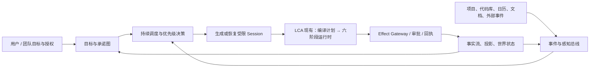

# Layered Cognitive Agent 能否走向“持续型、低感知复杂度 Agent”

**审查对象：** `smartlijingyang-sudo/layered-cognitive-agent`  
**审查基线：** `main @ 4e42134e`  
**审查结论：** **能，而且方向明显正确；但目前更接近“可组合、可治理的 Agent Runtime”，尚不是“持续理解用户与团队、可主动推进工作的计算系统”。**

本次判断基于当前仓库源码、已有架构审计与针对性验证。针对运行绑定、插件接线、会话回放、记忆来源、子代理生命周期、授权衰减与 effect receipt 的测试共 **50 项全部通过**。这说明当前内核已经不只是概念设计；但这些测试并不等价于证明其已具备长期自主运行、跨进程调度和组织级上下文能力。

> **一句话判断：LCA 已经拥有“把复杂性关进内核”的骨架；下一阶段不该优先继续增加 Skills 或 Agent 模式，而应补齐让系统能够跨时间、跨事件、跨进程持续工作的一层运行底座。**

## 1. 你已经拥有的能力，和 Tibo 所说的终局高度同向

你的架构中最有价值的选择，不是某一个 Brain 或某一个 multi-agent 策略，而是把 Agent 划分为**可验证的认知、执行、记忆、治理与组合层**。这使系统有机会把 Skills、Memory 和 Sub-agents 从用户可见的配置对象，逐渐收敛为由运行时自动选择、约束和审计的内部实现。

| 终局 Agent 所需原则 | LCA 当前对应能力 | 评估 |
|---|---|---|
| 内部能力应可组合而非堆入单一 Agent | `Profile → Bundle → Plugin → CompiledRunPlan`，并以 capability / binding 形成不可变执行计划 | **强基础** |
| 推理不能直接越权执行 | `CommandEnvelope`、Effect Gateway、审批、预算、幂等与 receipt | **强基础** |
| 行为需要可追溯和可恢复 | Session JSONL 事实流、Journal、Reducer、Projection、checkpoint 及 replay | **方向正确，持久化闭环未完成** |
| 复杂流程必须有稳定内核 | 六阶段闭集与 GenericPlanInterpreter，phase executor 可由计划选择 | **强基础** |
| 多 Agent 不应越权或无限扩张 | capability grant 衰减、delegation、handoff、Team strategy | **已有治理骨架** |
| 记忆不应只是 prompt 拼接 | 四层 memory、检索策略、写入 policy、来源与置信度字段、共享层作用域 | **已有框架，尚未成为组织知识系统** |

当前 `CognitiveRuntime` 已经只接收一份显式的 `DeclarativeRuntimeBindings`；该绑定包含 plan、phase executor、Reducer、effect/delta registry、idempotency store、state store、Journal factory 与 resume adapter，而运行入口在执行前会要求完整 executable plan。[1] 这是一条非常正确的路线：**运行时不应根据隐式默认值临场猜测“该用哪个能力”。**

同时，六阶段解释器、编译计划和 Effect Gateway 已在默认路径中承担核心执行责任；此前审计识别出的 effect/delta 未接线问题，在当前实现中已经收敛为 bindings 的显式依赖并被当前验证覆盖。[1] [2] 这意味着 LCA 已经超越“多个 prompt + 工具列表”的层次，正在成为一个真正具有**执行语义**的 Agent Runtime。

## 2. 但它距离“持续型 Agent”还差一层：时间与世界的运行时

你现在的强项是：**当一个任务被启动时，如何安全、可组合、可观察地完成它。**

Tibo 所描述的 Agent 还需要另一种能力：**即使用户没有再次发消息，系统也能根据长期目标、外部事件、项目状态和既定授权决定是否应当启动、继续、暂停、升级或结束一项工作。** 这不是多加一个 `skill` 能解决的事情，而是一个新的、但应与认知 loop 正交的底层平面。



LCA 的现有 runtime 位于图中的右半部分，且完成度已相当可观；真正缺口集中在左半部分的“**何时工作、为谁工作、基于什么新事实继续工作、如何长期协调**”。

## 3. 当前最关键的底层能力缺口

### 3.1 P0：持续执行控制面——不是“能 resume”，而是“会主动 resume”

当前 `AgentRegistry` 能创建 session、将事件持久化到 JSONL、重放既有事件，并在 `answer()` 时自动恢复缺失的 live handle。[3] 这已具备**被动恢复**的雏形。但它仍然是“收到请求后，恢复一个 live agent”的模型；仓库中未发现可执行的 trigger engine、cron/periodic worker、event subscription manager、任务队列或 dormant-session dispatcher。

`scheduled` 与 `self_evolving` 已出现在 `PlanTemplate` 枚举中，但该文件只是静态契约/模板目录，而非调度服务或后台 worker 的运行时消费者。[4]

| 需要补齐的组件 | 核心职责 | 为什么不能塞进六阶段 loop |
|---|---|---|
| `TriggerService` | 接收时间、代码变更、文档变更、Webhook、用户消息等事实事件 | 触发源发生在某个 Agent turn 之外 |
| `GoalScheduler` | 决定哪些目标应被唤醒、去重、延期、升级或取消 | 这是跨 session 的资源与优先级决策 |
| `WorkQueue + Lease` | 将可执行工作分派给 worker，并支持抢占、超时、重试和防重 | 单个进程内的 `asyncio.Task` 无法支撑可靠长期执行 |
| `SessionActivator` | 基于 `plan_ref + state_ref + cursor + grant` 创建或恢复受限 session | 恢复必须是 durable fact 的函数，而不是依赖旧 Python 对象 |
| `Timer/Event Receipt` | 记录每次触发已被消费、合并或拒绝 | 避免重启后重复触发和重复执行 |

**建议：** 将这一层独立命名为 `Continuous Control Plane`，而不是把 scheduler 伪装成一种 Brain、Plugin 或第七阶段。它只负责决定“要不要开一个受限的 LCA run”；真正的认知与副作用仍由现有 plan/runtime/effect gateway 执行。

### 3.2 P0：目标、承诺与任务图——现在只有“任务字符串”，没有长期工作模型

当前 `AgentState` 的顶层任务表达主要是 `task: str`，再配合 `working_memory`、`extra`、turn history、budget 和 final output。[5] 这非常适合一次运行，却不足以表达“这个用户本季度的目标”“团队当前的承诺”“某项工作依赖谁”“何时应主动提醒”“什么情形下不再值得继续”。

一个持续型 Agent 需要的不是一个更长的 prompt，而是一个**可持久化、可审计的 Goal/Commitment Graph**。建议建立独立契约，而不要继续把它塞入 `working_memory` 或 `extra`：

| 实体 | 关键字段 | 用途 |
|---|---|---|
| `Goal` | owner、desired outcome、成功指标、优先级、生命周期、授权边界 | 代表长期意图，而不是某次问答 |
| `Commitment` | goal_ref、负责人、截止/复查时间、承诺强度、可撤销性 | 区分“用户偏好”与“系统被授权推进的事项” |
| `WorkItem` | 输入事实、依赖、plan_ref、预算、状态、lease、重试策略 | 成为可调度、可并发、可恢复的原子工作 |
| `DecisionRecord` | 选择某项工作而不选择另一项工作的依据 | 支持解释“为何主动做这件事” |
| `EscalationPolicy` | 风险、金额、外部影响、权限变化、置信度阈值 | 决定何时静默处理、何时请求人类确认 |

这层会让 Agent 从“接到 task 后运行”转变为“在目标约束下管理一个不断变化的工作队列”。它也是未来用户无需自己管理 sub-agent network 的必要前提：**用户管理目标和授权；系统管理任务图、执行单元与生命周期。**

### 3.3 P0：跨重启的副作用一致性与恢复——当前幂等仍主要是进程内能力

项目已经以 effect receipt、approval、budget、idempotency 作为执行窄门，这个设计是正确的。[2] 不过已有实施审计也明确记录：当前默认 idempotency store 为**进程内** claim/complete 协议，跨重启的 claim/receipt 持久化仍需要 durable backend。[2]

这对于长期 Agent 至关重要。Agent 不能只保证“同一进程内不重复调用工具”，还要保证在“请求外部 API 后、receipt 落盘前进程崩溃”的不确定窗口内，能够知道应该：查询外部状态、等待、补偿、人工升级，还是安全重试。

建议把 Effect 由一次函数调用提升为 durable state machine：

```text
prepared → authorized → dispatched → acknowledged
                        ↘ uncertain → reconcile → completed | compensated | escalated
```

其底层需要 durable idempotency key、transactional outbox/inbox、provider-side operation reference、可查询 receipt、补偿协议与长时间 lease。没有这层，系统不应在真实世界中自主处理支付、发布、删除、外部工单更新或大规模并发自动化。

### 3.4 P0：组织级记忆与世界模型——已有“memory policy”，还没有“可长期信任的知识底座”

`SimpleMemorySystem` 已经具备 working / semantic / episodic / procedural 四层概念、retrieval/compaction/policy seam、来源 trace、共享层及写入 journal。[6] 这是正确的抽象起点。

但当前实现仍以私有内存列表为主要存储，使用固定数量上限，episodic 压缩采取截断，默认检索也仍很轻量。[6] 它尚不等价于一个能可靠理解“我是谁、我们团队在做什么、哪些事实已失效、不同人能看什么”的长期记忆系统。

建议将记忆拆成三类持久化事实，并赋予不同治理规则：

| 记忆域 | 应存什么 | 关键治理能力 |
|---|---|---|
| `Personal Context` | 用户偏好、授权、工作方式、已确认长期事实 | 显式纠错、过期、删除、导出、逐用户隔离 |
| `Team / Project Knowledge` | 项目事实、决策、规范、任务依赖、产物关系 | ACL、来源、版本、冲突处理、时间有效性 |
| `Operational Memory` | 执行轨迹、失败经验、工具可靠性、成本与策略效果 | 可回放、可评测、不可直接当作用户事实 |

更重要的是，记忆写入不能完全由模型“觉得值得记住”决定。需要 `Memory Admission` 结合来源、置信度、权限、时效、冲突、用户确认与写入预算；检索则应产出带 provenance、freshness 和 ACL 的 context manifest。这样 Memory 才能从“上下文缓存”升级为“可治理的长期认知资产”。

### 3.5 P1：持久 Projection 与“世界状态”——日志存在，但可查询的当前事实还不够强

`SessionStore` 已支持 append-only 事件与 JSONL persistence。[7] 但 `AgentRegistry` 依赖 `InMemoryProjectionRegistry`，重启后需要将日志重放进内存；它不是持久化的 materialized view，也没有跨进程订阅、查询索引或组织级关系投影。[3]

持续 Agent 不应每次被问起“项目现在怎样了”都从大量原始运行日志中重新推断。你需要一层 durable projection / world state：项目、工作项、审批、外部资源、artifact、团队成员状态、风险、最近验证时间都应能被查询，并且每一项都回指事实来源。

这里尤其要区分：

> **Journal 是“发生过什么”的真相；Projection 是“现在应如何理解”的可查询视图；Memory 是“未来推理时哪些信息值得带入”的选择结果。**

三者可以共享来源，但不能混为一个巨大的字典或向量库。

### 3.6 P1：多 Agent 的分布式工作模型——你已有协作语义，仍缺 durable work coordination

当前 repository 有 delegation grant、handoff、Team strategy、Team shared memory、transport 和 sub-agent lifecycle，因此其协作治理已优于多数“临时 spawn 子代理”的框架。[8] 但当前组装仍更偏 request/run 型：一个 leader 为一次任务调用成员，成员返回结果。

真正无感的 sub-agent 体系还需：

- **Durable work graph：** 子任务、依赖、产物、重试与验收标准作为事实，而非一次 prompt 中的约定；
- **Lease 与心跳：** worker 崩溃、超时、孤儿任务、重复领取均有确定语义；
- **Result contract 与 verification gate：** 子代理结论必须带证据、artifact、置信度与验收状态，不可把自然语言回传直接当真；
- **Resource-aware routing：** 根据风险、成本、上下文、模型能力、数据权限和设备位置选择执行者；
- **Budget tree：** 父目标对 token、时间、金钱、并发和权限的预算向下衰减并可回收。

换言之，现有 Team 是一个良好的**协作语言与安全约束层**；还需要一个 work orchestration substrate 才能成为可长期运行的“组织”。

### 3.7 P1：资源与设备平面——未来的瓶颈确实会从模型能力转向计算与执行位置

当 Agent 同时处理多个项目、代码库、浏览器会话、异步任务与子执行单元时，单机进程模型会不够。LCA 的 Sandbox、Tool、Transport 和 capability grant 为此提供了入口，但尚需一个与认知层分离的 Resource Plane：worker pool、排队、并发额度、CPU/GPU、浏览器/设备 session、文件工作区、网络隔离、成本配额、秘密管理与数据驻留策略。

这一层不需要立刻上 Kubernetes；但架构上应先抽象 `ExecutionTarget` / `WorkerLease` / `ResourceBudget` / `WorkspaceLease` / `DeviceSession`。否则未来从单 laptop 升到多 worker 时，调度和安全判断会反向侵入 Brain、Tool 和 Team 代码。

## 4. 推荐路线：先把“持续性”做实，再扩能力面

### 阶段 A：收紧现有可信内核

当前不宜优先新增更多角色、更多 Skills 或更复杂的 self-improving workflow。先把 production profile 的全链路验证做成硬门禁：启动、工具成功/拒绝、审批暂停/恢复、进程重启恢复、effect uncertain、取消、artifact 输出、Journal replay 和 plan_ref 一致性。所有生产可调用 effect 都要有 durable receipt 语义。

这一步的目标是把当前已具备的“可组合”升级为**可证明地可恢复、可审计、可安全重试**。

### 阶段 B：建立持续执行控制面

新增 `TriggerService`、`GoalScheduler`、`WorkQueue`、`LeaseStore`、`SessionActivator` 与 trigger receipt。要求所有唤醒都写事实流；所有 work item 都有幂等键、所属 goal、预算、权限、计划版本、重试和升级规则；所有 worker 只拿到最小能力 grant。

此阶段应把“scheduled template”从 schema 中的名称，变为一个可运行的、可观测的 production pattern。最小可验收场景是：用户定义一个项目目标，代码库变更或时间到达后 Agent 自动创建受限工作项；它完成检查、产生证据、必要时请求审批；进程重启后不重复执行已经完成的 effect。

### 阶段 C：建立 Goal Graph 与可信上下文层

把长期目标、承诺、项目、任务、依赖、风险和权限建成 typed domain model，并建立 durable projection。Memory 写入/检索改为受 policy、ACL、provenance、time validity、conflict resolution 和 user correction 管理。Perceive 阶段只消费已经授权且可解释的 context manifest。

此阶段完成后，用户不必自己维护“memory 文件”；用户只需纠正 Agent 对自己和团队的理解，系统自行判断该在何时检索、压缩、更新和遗忘。

### 阶段 D：建立可验证的异步多 Agent 工作系统

将 delegation 升级为 durable work graph：任务可并发、可暂停、可移交、可重试、可验证、可回收。将现在的 grant/handoff/Team 策略作为授权与沟通协议，新增 lease、queue、result verifier 和 budget tree 作为执行治理协议。

此阶段完成后，sub-agent network 才真正应该对用户不可见：用户只看到目标进度、证据、风险与需要确认的决策，而不是去管理角色拓扑。

### 阶段 E：面向产品的“隐形复杂度”层

最后才是体验层的收敛：统一目标面板、主动但克制的通知、可撤销变更、授权策略编辑、事实纠错、执行解释与风险升级。这个层不应暴露 plugin tree、memory bucket 或 agent topology；但它必须让用户始终能看见 **Agent 知道什么、为什么行动、做了什么、还需要什么授权**。

## 5. 哪些东西应当继续保留为内核，而不是追求“万物插件化”

LCA 不需要、也不应该把一切做成随意替换的 plugin。你现有架构的成熟之处，恰恰是已经承认某些边界必须稳定。

| 应稳定为内核/宪法的部分 | 原因 |
|---|---|
| 六阶段认知闭集 | 防止新能力通过暗加阶段改写认知协议 |
| Reducer 的唯一状态写入口 | 防止插件偷偷改变内部状态，破坏回放与调试 |
| Journal / 事实流语义 | 防止出现多个“谁才是真相”的平行存储 |
| Effect Gateway、审批、预算与 receipt | 防止模型或任意插件直接造成世界副作用 |
| capability grant 衰减 | 防止子代理权限超过父目标授权 |
| Goal / Work / Lease 的生命周期状态机 | 防止持续执行退化为不可控 background loop |

可替换的应该是：模型、检索器、工具 provider、记忆策略、phase executor 内部策略、team strategy、worker target、trigger source、projection 和 UI；不可随意替换的是：**事实、权限、状态迁移、效果确认和责任边界。**

## 最终答案

**你的 LCA 能做到吗？能。** 它的六阶段闭集、双平面、编译计划、Effect Gateway、Journal、Reducer、Profile/Bundle 与 Team grant 等设计，已经是通往该目标的正确“下半场地基”。和很多直接堆 Skills、Memory 文件、sub-agent prompt 的系统相比，你的项目更有可能把这些复杂性收进运行时，而不是让用户承担。

**它现在已经做到吗？还没有。** 当前 LCA 的重心仍是“如何把一次 Agent run 安全、可组合地执行完”；而理想 Agent 还必须拥有“如何在时间中持续存在、理解外部变化、管理目标与承诺、调度工作、跨重启恢复并证明自己没有重复行动”的基础设施。

最重要的战略选择是：

> **不要先把 LCA 做成拥有更多 Skill 的万能 Agent；先把它做成拥有唯一事实、唯一执行语义、唯一长期工作模型的持续 Agent Runtime。**

当 `Goal Graph + Trigger/Scheduler + Durable Work/Effect State + Trusted Context/World Model + Resource Plane` 补齐之后，Skills、Memory 和 Sub-agents 才有可能真正从用户界面中消失，成为系统自动编排的内部机制。

## 参考

[1]: https://github.com/smartlijingyang-sudo/layered-cognitive-agent/blob/4e42134e/lca/runtime/runtime_loop.py "CognitiveRuntime：已验证运行绑定与统一执行入口"
[2]: https://github.com/smartlijingyang-sudo/layered-cognitive-agent/blob/4e42134e/docs/adr/0081-audit-implementation.md "ADR-0075 实施深度审计与 Effect Gateway 收敛证据"
[3]: https://github.com/smartlijingyang-sudo/layered-cognitive-agent/blob/4e42134e/lca/harness/agent/registry.py "AgentRegistry：会话创建、JSONL 事实流重放与 live handle 恢复"
[4]: https://github.com/smartlijingyang-sudo/layered-cognitive-agent/blob/4e42134e/lca/contracts/atoms/plan_template.py "PlanTemplate：scheduled / self_evolving 仅为声明式模板目录"
[5]: https://github.com/smartlijingyang-sudo/layered-cognitive-agent/blob/4e42134e/lca/contracts/models/core/state.py "AgentState：单次运行状态模型"
[6]: https://github.com/smartlijingyang-sudo/layered-cognitive-agent/blob/4e42134e/lca/cognition/memory/simple_memory.py "SimpleMemorySystem：四层记忆、策略与当前内存实现"
[7]: https://github.com/smartlijingyang-sudo/layered-cognitive-agent/blob/4e42134e/lca/harness/session/store.py "SessionStore：append-only JSONL 会话事实流"
[8]: https://github.com/smartlijingyang-sudo/layered-cognitive-agent/blob/4e42134e/docs/design/2026-08-19-cognitive-primitive-constitution-v3.md "认知原语宪法 v3：双平面、协作授权与长期 Agent 目标"

---

**本次运行的针对性验证：**

```sh
uv run pytest --no-cov -q \
  tests/test_runtime_factory_strict_bindings.py \
  tests/test_plugin_wiring_e2e.py \
  tests/test_session_replay.py \
  tests/test_memory_record_provenance.py \
  tests/test_subagent_lifecycle.py \
  tests/test_delegation_grant.py \
  tests/test_effect_receipt.py
# 50 passed
```
