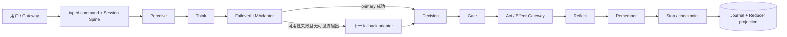

# Hermes Agent 对标：Agent Loop 与插件化补齐

**日期：**2026-08-27

**状态：**Implemented

**作者：**Manus AI

## 结论

Hermes 的产品能力可归为入口与会话、Prompt 与上下文、模型调用、工具执行、记忆与技能、后台自动化六组；但其核心执行仍是单个 `AIAgent` 在一次对话中反复执行“构建消息 → 调用模型 → 执行工具 → 追加工具结果”的循环。[1] LCA 不应复制这种把 Prompt、模型路由、工具分发、重试、持久化和回调集中进一个大类的实现形态，而应将每一项能力映射到既有的 **Protocol → Seam → Provider / Adapter → Registry → Plugin → Profile / Bundle** 扩展链。

本次选择补齐 Hermes 循环链路中最具基础设施价值且尚未由 LCA 的 Profile 显式提供的能力：**模型 Provider 故障转移**。实现以 `FailoverLLMAdapter` 包装 `LLMAdapter` seam；它不是新的 phase、不是 Gateway 分支，也不持有 AgentState。`lca-llm-resolver` 仍是唯一的凭证与模型适配器所有者，Profile 仅提供有序的 fallback 候选配置。

> **设计约束：** 只在一次 `complete()` 调用失败，或一次 `stream()` 尚未对外产生任何事件时切换候选模型。流已经产生文本、推理或工具参数增量后，故障必须原样向上抛出，绝不可重新调用候选模型，以避免重复展示或重复工具意图。

## Hermes 核心能力与 LCA 映射

Hermes 官方资料将 `AIAgent` 定义为负责 Prompt 组装、Provider/API mode 选择、可取消模型调用、工具调度、上下文压缩、模型故障转移、迭代预算和记忆落盘的编排中心。[1] 它同时通过 CLI、消息 Gateway、ACP、批处理和 cron 将不同入口汇聚到该循环。[2]

| Hermes 能力 | Hermes 的实现位置 / 行为 | LCA 对应边界 | 评估 |
|---|---|---|---|
| 多入口统一会话 | CLI、Gateway、ACP、batch、cron 汇聚至 `AIAgent`。[2] | Gateway Carrier → typed command → Session Spine → `LiveAgent` | 已具备更严格的 Carrier / Session 分离 |
| 模型 API 模式 | `chat_completions`、`codex_responses`、`anthropic_messages` 先归一至内部消息格式。[1] | `LLMAdapter` + `OpenAICompatAdapter` strategy + `llm_resolver` | 已具备 adapter seam |
| Provider 故障转移 | 主模型调用失败时，按配置候选 provider 继续对话。[1] | `FailoverLLMAdapter`（本次）+ Profile 的 `llm_resolver.fallbacks` | **本次补齐** |
| 工具循环与并行执行 | 模型返回 tool calls 后，工具顺序或并发执行，结果回填 history。[1] | Think → Body / SafeExecutor → Effect Receipt → Observation；工具批处理策略插件 | 已具备，且 effect 与 idempotency 边界更明确 |
| 取消与忙时输入 | 支持 interrupt、queue、steer；steer 在下一个工具结果边界进入运行。[4] | SessionTurnController、SessionFollowupPolicy、durable Inbox、typed commands | 已有 queue / reject / 显式 steer 接口；见“后续” |
| 长会话压缩 | 到达上下文阈值时先落记忆，再压缩中段会话，并保持谱系。[1] | MemoryPolicy、RetrievalPolicy、CompactionPolicy、checkpoint / Journal | 已有分层记忆与压缩策略；全对话压缩仍应作为独立 context lifecycle 演进 |
| 技能与自学习 | Skill 文档按渐进披露加载，可由经验或资料创建，兼容 Agent Skills。[3] | skills seam、procedural memory、`LearningSkillAcquirer` / Creator 工具 | 已有插件化着陆点；应持续以来源、审计和 capability grant 约束写入 |
| 外部扩展 | Native plugin 可注册工具、hook、命令；有多个 hook 系统。[5] | Plugin manifest、capability、contributor registry、只读 observer | LCA 采用更小、更可验证的控制面，避免任意 hook 改写状态 |

## Agent Loop 链路对照

Hermes 的一次迭代先将用户消息写入历史，组装（或复用）系统 Prompt，执行压缩预检并注入临时预算 / 上下文压力层；随后按 Provider API mode 编码消息并发起可中断请求。若响应包含工具调用，它调度工具并将结果追加到 history 后回到模型调用；若返回文本，则持久化会话、按需刷新记忆并结束本次对话。[1]

LCA 的规范循环则固定为 `perceive → think → gate → act → reflect → remember → stop`。其 phase graph、Journal、Reducer、effect gateway、checkpoint 与 capability grant 是可信计算基；插件只能替换已声明的 Provider、Adapter、策略或完整 runtime，不能新增绕过这些边界的“第七阶段”。这一差异使 LCA 可以吸收 Hermes 的**能力**，而不牺牲事实可追溯性和双平面隔离。



| 链路位置 | 本次变更 | 不变式 |
|---|---|---|
| Profile 解析 | `lca-llm-resolver` 新增 `fallbacks`，按给定顺序解析候选项 | 密钥仍只由 LLM Resolver 读取与归一化 |
| Adapter 装配 | 单候选保持原始 `OpenAICompatAdapter`；多候选装配 `FailoverLLMAdapter` | `llm` seam 仍只激活一个默认 adapter |
| Think 调用 | Brain 继续只依赖 `LLMAdapter.complete()` / `stream()` | Think 不感知 provider、模型或切换次数 |
| Stream 安全性 | 仅在第一条 `LLMStreamEvent` 前发生切换 | 产生任何可见事件后不 replay，避免文本或 tool delta 重复 |
| 失败处理 | 非可用性错误、取消、全部候选失败时保留原异常 | 不把请求形状 / 编程错误错误地隐藏为 provider 故障 |

## 实现设计

`lca/infrastructure/llm_adapter/failover.py` 定义 `LLMFailoverCandidate(name, adapter)` 与 `FailoverLLMAdapter`。候选名称必须非空且唯一，适配器以固定顺序执行。`complete()` 只会在剩余候选存在且异常是可用性错误时继续；可识别的条件为 LCA 的 `LLMUnavailableError`、标准超时 / 连接 / OS 传输异常，以及带有 `status_code` 的 `401`、`403`、`408`、`409`、`425`、`429` 或 `5xx` 错误。

`lca/plugins/seam_definitions/llm_resolver.py` 仍然是唯一 LLM credential owner。`FallbackConfig` 仅声明低优先级候选的 `model`、可选 `api_key`、可选 `base_url` 与可选 `api_style`；缺省项继承 primary 的已解析配置。因此，fallback 的选择是 Profile 组合事实，而不是 Runtime 内的环境变量查找或 Gateway 条件分支。

```yaml
# bundle 或 profile 中 lca-llm-resolver 的示意配置
config:
  default_model: primary-model
  # api_key 由既有 Profile secret / 环境注入机制提供
  fallbacks:
    - model: resilient-secondary-model
      # api_key、base_url、api_style 缺省时继承 primary
    - model: independent-provider-model
      # 可显式改用该候选的 Profile 注入凭证与 endpoint
```

## 验证范围

新增 `tests/test_llm_failover.py` 覆盖 primary timeout 后切换、`429` 后切换、非可用性错误不切换、流尚无输出时切换、流已有输出后不重放，以及 Profile 解析出 primary + fallback adapter chain。既有 `tests/test_llm_resolver.py` 继续确保 Resolver 只暴露 adapter seam、不引入与 Gateway mode 耦合的参数。

| 故障场景 | 预期 |
|---|---|
| primary `TimeoutError`，fallback 成功 | 返回 fallback 的 `LLMResponse` |
| primary HTTP 429，fallback 成功 | 返回 fallback 的 `LLMResponse` |
| primary 请求校验 `ValueError` | 直接抛出；不调用 fallback |
| primary stream 在首事件前超时 | 从 fallback 输出完整流 |
| primary stream 已输出 delta 后超时 | 保留已输出 delta 后抛错；不调用 fallback |
| 任务被取消 | `asyncio.CancelledError` 不被 `Exception` 捕获，直接上抛 |

## 明确不在本次范围

本次不是通用重试框架，不实现凭证刷新、指数退避、跨请求熔断或把 runtime 选择权移交给 Gateway。每项若需要加入，都应以独立的 L0 policy / adapter 能力完成，并带有明确的预算与 Journal / telemetry 语义。

Hermes 的“steer 在下一个工具结果边界注入”也没有被假装为已完成。LCA 已具备 durable `Inbox` 的 `next_step` 队列和显式 `steer` command，但其声明式解释器尚未消费活动 turn 内的 `next_step` 项。因此，下一项控制面工作应是在**既有 phase / effect 安全边界**引入 Profile-selected inbox-consumption policy：由 Interpreter 读取 durable fact，产出 reducer-managed input delta，再进入后续 Think；不可由 Gateway、Observer 或工具插件直接写 `AgentState`。

## References

[1]: https://hermes-agent.nousresearch.com/docs/developer-guide/agent-loop "Hermes Agent Loop Internals"
[2]: https://hermes-agent.nousresearch.com/docs/developer-guide/architecture "Hermes Agent Architecture"
[3]: https://hermes-agent.nousresearch.com/docs/user-guide/features/skills "Hermes Skills System"
[4]: https://hermes-agent.nousresearch.com/docs/user-guide/cli "Hermes CLI — Busy Input Mode"
[5]: https://hermes-agent.nousresearch.com/docs/developer-guide/plugins "Build a Hermes Plugin"
[6]: ./2026-08-19-cognitive-primitive-constitution-v3.md "LCA 认知原语插件宪法 v3.0"
[7]: ./2026-08-27-cognitive-pipeline-pluginization.md "Agent Loop 与认知原语插件化补充"
