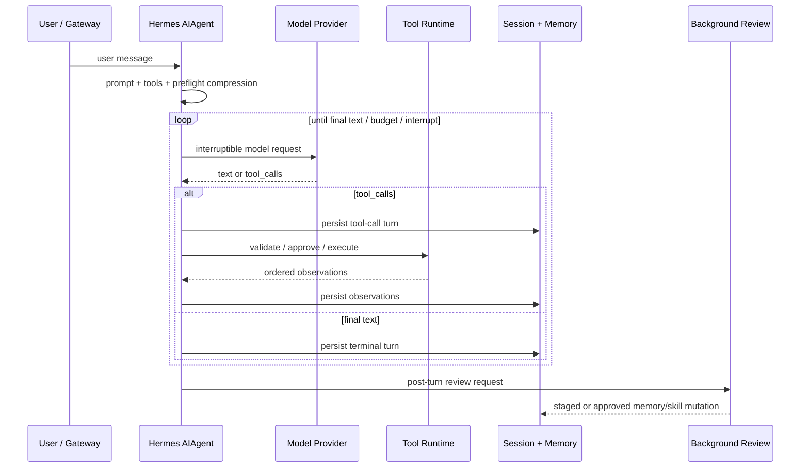
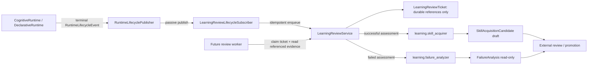

# Hermes Agent Loop 对照与 LCA 插件化补齐设计

**日期：** 2026-08-27

**作者：** Manus AI
**状态：** Implemented（候选式学习复盘触发层与耐久 ticket queue）

## 摘要

Hermes Agent 的显著能力不在于单一模型调用，而在于将一次会话组织为**提示词与工具模式装配、可中断推理、带验证的工具回环、上下文压缩、会话持久化、后台学习复盘**的一条运行链。其 `AIAgent` 对象集中拥有这些职责，而对外以工具、回调和插件表面扩展。[1] [2]

LCA 的目标架构不同：认知闭环必须保持 `perceive → think → gate → act → reflect → remember → stop` 的封闭语义，世界副作用只能经 Body/Effect Gateway，状态只能由 Reducer 应用，模型可见事实必须可追溯到 Journal。因而不应将 Hermes 的一般性 pre/post hook 直接移植为可改写状态的钩子，而应将每项能力定位为现有 Protocol、Seam、Provider 与 Profile 的组合。[3]

本切片补齐 Hermes 学习闭环在 LCA 中缺失的**终态触发层**：在不增加第七认知阶段、不读写 `AgentState`、不直接安装技能或发布 Profile 的前提下，新增一个只消费不可变 `RuntimeLifecycleEvent` 的学习复盘订阅插件。该插件以幂等、可领取的 review ticket 连接已存在的「技能候选生成」与「失败分析」服务，为后续独立 worker 从 Journal/Checkpoint 补充证据并提交候选评估提供正式边界。

## Hermes 的核心能力与 agent loop

Hermes 的核心 `AIAgent` 汇总了系统提示词和工具 schema 装配、API 模式解析、可中断模型调用、顺序或并发工具执行、会话历史维护、压缩与模型回退、父子代理迭代预算和临近上下文上限时的内存落盘。[2] 其能力组合使 agent loop 不只是「LLM 调用后执行函数」，而是一个持久、可恢复且受预算约束的会话状态机。

| 链路位置 | Hermes 行为 | 设计价值 |
|---|---|---|
| Turn prologue | 追加用户输入，构建或复用系统提示词，预判上下文压力，并装配不同 provider 的请求格式。 | 将 prompt、工具 schema、短期上下文和 provider wire 格式收敛为一次调用前的确定性输入。 |
| Model call | 通过中断事件监控后台 HTTP 调用；中断后丢弃未完成响应，而非污染历史。 | 保持会话消息交替规则和恢复语义。 |
| Tool branch | 校验 tool call，先持久化 assistant 的工具调用记录，再执行受审批保护的处理器；多调用可并发但按原始顺序回填结果。 | 将外部副作用与可恢复轨迹绑定，避免崩溃后无记录的工具执行。 |
| Re-entry | 把工具 Observation 回填 conversation；在阈值超出时压缩而不拆开 tool-call/result 对；然后回到模型调用。 | 维持工具推理循环的上下文完整性和预算上界。 |
| Terminal finalization | 持久化会话及内存；可启动后台 review，将可复用的经验写成 memory 或 skill，并可由审批设置改为 staged write。 | 让「完成任务」成为未来流程知识的候选来源，而非仅产生一次性答案。 |

Hermes 对 Skills 采用渐进披露：会话开始只加载紧凑目录，按需加载 `SKILL.md` 与指定参考文件；技能与记忆分别承担程序性知识与稳定事实，减少常驻上下文开销。[4] 它还使用隔离上下文的子代理执行并行工作，子代理继承受限的工具集，且禁止叶子子代理继续委派或直接操作共享记忆、消息和定时任务。[5]

> Hermes 的「后台学习」并不应被误解为无约束的代码或配置自改写。其公开文档明确提供 memory 与 skill 的写入审批开关；开启后，自动复盘产生的变更会被暂存等待人工复核。[6]

## LCA 对照与补齐原则

LCA 已经通过声明式 Phase Graph、`RunLoopDriverRegistry`、Effect Gateway、Reducer、Journal、可恢复 checkpoint，以及 Profile/Bundle 驱动的 plugin DAG，拥有比 Hermes 单体循环更严格的替换和治理边界。现有 `scenario-self-improving` 又已经提供 `learning.skill_acquirer`、`learning.failure_analyzer` 和 `learning.profile_evolver`，但它们均为候选式服务：没有一个运行终态的正式订阅者将真实 run 交给复盘流程。

| Hermes 机制 | LCA 中的正确落点 | 本次状态 |
|---|---|---|
| Provider/API 格式归一化与回退 | `llm` seam、LLM resolver/adapter、Think pipeline | 已有；不在本切片重复实现。 |
| 工具调用前持久化、审批、幂等 | `Act` Phase、Effect Gateway、IdempotencyStore、Journal | 已有；不得由学习插件绕过。 |
| 上下文压缩与提示词预算 | Perceive/Context Lifecycle 与 Memory 策略 | 属于独立策略切片；不放进学习复盘。 |
| 子代理隔离与权限衰减 | Delegation grant、Team/Transport、Session Spine | 已有边界；不在本切片改变协作控制面。 |
| 背景 memory/skill review | Runtime lifecycle subscriber → review ticket → 外部证据读取/评估 → candidate-only learning service → 审批 promotion | **本切片实现 review ticket trigger 与 candidate assessment seam。** |

本次实现遵循以下约束。首先，学习复盘是**终态旁路**，而不是 `perceive/think/act/...` 中的一个新阶段；它不会影响当前 run 的下一条图边。其次，订阅者仅接收 `RuntimeLifecycleEvent` 的 carrier-safe 字段，且只保存 `trace_id`、`plan_ref`、`state_ref`、`journal_sequence` 等引用；它不获得状态、Reducer、Journal、Effect Gateway 或 capability scope。最后，技能和 Profile 的物化仍在外部审批/Promotion 流程，复盘服务最多调用已有候选生成和失败分析服务。

## 目标对象图

`LearningReviewService` 是 Profile 选择的单一 service capability。其 `publish()` 仅为配置允许的终态创建幂等 ticket；`claim_next()` 给予 worker 有租约的独占领取机会；`assess_success()` 要求显式 procedure、confidence 和 evidence refs 后才调用 `AutoAcquireSkillService.propose()`；`assess_failure()` 只对失败/部分完成的 ticket 调用 `FailureAnalyzerService.analyze()`。在任一情况下，服务不写已安装 skill store、不应用 Profile、不改变 budget/grant/approval，也不直接修改 AgentState。

### 耐久队列续篇

为了使连续运行或进程重启后的复盘请求不丢失，复盘服务使用独立的 `learning.review_ticket_store` seam。该 seam 由 `LearningReviewTicketStore` Protocol 定义，默认 Provider 是以 SQLite WAL 事务实现的 `SqliteLearningReviewTicketStore`；其负责且仅负责 ticket 与 candidate-only assessment 的持久化、终态事件幂等去重、容量检查、领取租约和到期回收。它不读取 Journal 内容，不调用模型，不启动 worker，也不操作已安装技能或生产 Profile。

| 操作 | 原子性要求 | 结果 |
|---|---|---|
| `enqueue(event_key, ticket)` | 在同一事务中检查终态事件 key 与未评估容量 | 相同 lifecycle 事实始终返回同一 ticket；队列满时拒绝新项且不驱逐旧证据。 |
| `claim_next(worker_id, lease_seconds)` | 先回收过期 claim，再选择最早 queued ticket 并写入新 lease | 同一 ticket 同时只能由一个 worker 评估；进程异常后到期即可重新领取。 |
| `release(ticket_id, lease)` | 以 ticket ID、lease ID 与 worker ID 三元组校验所有权 | 仅所有者可提前放回队列，拒绝过期或越权释放。 |
| `complete_assessment(assessment, lease)` | 持久化 candidate-only 结果并清除经过验证的 lease | 已评估 ticket 不会再次进入队列；重启后仍可诊断其候选或分析结果。 |

`LearningReviewService` 继续只面向 `LearningReviewTicketStore` Protocol 编排。Profile 通过 `lca-learning-review-ticket-store` Provider 选择数据库路径；`lca-learning-review-lifecycle-subscriber` 在自身受校验的配置中声明租约时长，但只依赖该存储 capability，不构造 SQLite 实现。这保持了 **Protocol → Seam → Provider → Plugin → Profile** 的路径，并避免将后台处理逻辑塞入 terminal lifecycle subscriber。

## 配置与装配

`lca-learning-review-ticket-store` 与 `lca-learning-review-lifecycle-subscriber` 均放入 `scenario-self-improving`。前者无外部依赖，仅提供耐久存储；后者依赖该 store、既有 `learning.skill_acquirer`、`learning.failure_analyzer` 与 `runtime_lifecycle_subscriber_registry`。`profiles/self-improving-minimal.yaml` 将 scenario bundle 排在 base 前；Profile resolver 仍以 `provides → requires` 构建 DAG，但这个顺序为同样仅依赖 registry 的 lifecycle publisher 和 review subscriber 提供确定的「贡献先注册、publisher 后冻结」顺序。这个顺序是启动语义的一部分，并由装配测试锁定。

| 配置项 | 默认值 | 含义 |
|---|---:|---|
| `database_path` | `.lca/learning-review.db` | SQLite WAL 票据和 assessment 的 Profile 受控持久化位置。 |
| `enabled` | `true` | 禁用时不生成 ticket。 |
| `statuses` | `completed`, `failed`, `partial` | 允许进入复盘队列的终态。 |
| `max_pending` | `64` | 队列上界；满时拒绝新 ticket，不挤掉未处理证据。 |
| `lease_seconds` | `300` | 独占评估 claim 的有效期；到期后仅可由下一位 worker 重新领取。 |
| `priority` | `50` | 在 lifecycle publisher 的冻结快照中确定订阅顺序。 |

## 验收策略

测试需验证 Profile 可 resolve/compile、review subscriber 在 lifecycle publisher 之前启动、只对终态入队、重复事件只产生同一 ticket、队列满时 fail closed、SQLite 重启后仍去重与恢复 assessment、过期 lease 可安全回收且旧 worker 无法结算、成功评估遵守已有置信度与证据门槛、失败评估遵守 trigger 白名单，并且源文件不含 skill store 写入或 Profile 发布调用。由此，功能增量可被证明为「可审计、可恢复的学习候选入口」，而不是新的隐式控制路径。

## 非目标

本切片不执行 LLM 评审、不启动线程/后台进程、不读取未声明的 prompt 或工作区、不实现自动压缩、不改变工具并行度、不直接写 `MEMORY.md`，也不把候选自动升级为已安装技能或生产 Profile。复盘 queue 已成为可恢复的耐久 adapter；后续若要实现 worker，仍必须先定义它读取 Journal/Checkpoint 的最小只读 Protocol、review evidence schema，以及可审计的 Approval/Promotion 命令；不得把这些需求偷渡到 lifecycle subscriber 中。

## References

[1]: https://hermes-agent.nousresearch.com/docs/ "Hermes Agent Documentation"
[2]: https://hermes-agent.nousresearch.com/docs/developer-guide/agent-loop "Hermes Agent — Agent Loop Internals"
[3]: ../design/2026-08-19-cognitive-primitive-constitution-v3.md "LCA 认知原语插件宪法 v3.0"
[4]: https://hermes-agent.nousresearch.com/docs/guides/work-with-skills "Hermes Agent — Working with Skills"
[5]: https://hermes-agent.nousresearch.com/docs/user-guide/features/delegation "Hermes Agent — Subagent Delegation"
[6]: https://hermes-agent.nousresearch.com/docs/user-guide/features/memory "Hermes Agent — Persistent Memory"
