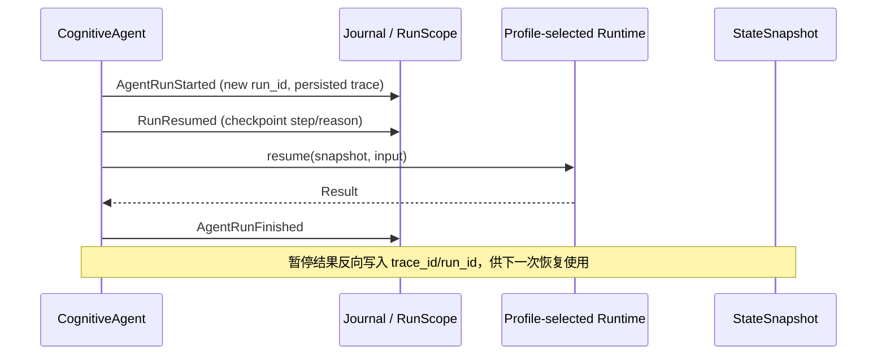

# Agent Loop 恢复生命周期关联补齐

**日期：**2026-08-27

**状态：**Implemented

**作者：**Manus AI

## 背景与结论

LCA 的 fresh run 已由 `CognitiveAgent.run()` 建立 `RunScope`、写入 `AgentRunStarted` / `AgentRunFinished`，并把具体循环交给 Profile 所选的 `RuntimeFactory`。审计发现，`CognitiveAgent.resume()` 以前直接调用 `Runtime.resume()`：它既不绑定观测后端，也不建立新的关联作用域，更未写入 `AgentRunStarted`、`RunResumed` 与 `AgentRunFinished`。因此，恢复路径缺少完整的可审计生命周期；在无外层 scope 的情形，恢复结果的 trace 与原暂停状态无法可靠关联。

> **设计结论：** 恢复不是新的认知阶段，也不是另一个循环实现。它必须在既有 Agent 生命周期内，复用 Profile 选择的 Runtime、声明式 phase graph、Reducer、Effect Gateway、Journal 和 checkpoint；新增的只是恢复边界所需的关联持久化与统一生命周期包装。

| 维度 | 原有 fresh 路径 | 原有 resume 路径 | 本次补齐 |
|---|---|---|---|
| 运行时选择 | `RuntimeFactory` 由 Profile 选择 | 直接调用已注入 Runtime | 保持相同 Runtime，不新增硬编码分支 |
| Journal 生命周期 | `AgentRunStarted` → `AgentRunFinished` | 无完整配对事实 | `AgentRunStarted` → `RunResumed` → `AgentRunFinished` |
| 关联骨架 | `RunScope` 进入并写入每条事实 | 无新的 scope | 复用 snapshot 的 `trace_id`，以来源 `run_id` 作为新容器父级 |
| 暂停恢复数据 | State 与 phase cursor 可恢复 | 缺失 trace/run 因果信息 | `StateSnapshot` 与 `ApprovalResumePoint` 持久化 trace/run 字段 |
| 扩展边界 | Runtime、phase observer、运行时 factories 可由 Profile 替换 | 容易绕开 kernel lifecycle | 生命周期事实继续由 Agent kernel 拥有，插件不能省略审计边界 |

## 业界对照与采用原则

LangGraph 将调用期 context、存储、执行标识和服务端信息放入显式 Runtime，供工具与 middleware 使用，以避免全局状态并改善可测试性。[1] OpenAI Agents SDK 将循环、工具执行、会话、追踪和可恢复运行状态划分为独立但受统一 Runner 生命周期管理的能力；恢复状态可携带待处理输入继续后续模型调用。[2] DeepSeek Harness 将 agent loop 本身作为配置可替换组件，同时规定模型可见输入应可从会话日志重建。[3]

LCA 已具备相应的插件化基础：完整 loop 由 `runtime_factory` capability 选择，阶段级被动观测由 contributor registry 组合，运行时机械能力通过 immutable `DeclarativeRuntimeBindings` 闭合。因而本次不将生命周期再包装成可任意拦截的 hook 或 plugin。这样做会允许第三方扩展省略、改写或吞掉 `AgentRunFinished` / `RunResumed`，破坏 Journal 的事实边界和恢复审计。生命周期发射是最小可信内核；**可变算法与集成留在插件，因果记录和状态提交留在内核。**

## 实施

恢复快照现在携带 `trace_id` 与来源 `run_id`。声明式暂停结果先从 `AgentState` 写入 trace；`CognitiveAgent` 在接收到可恢复结果时写入实际拥有该调用的 `RunScope`。审批恢复点将这两个字段与 phase cursor 一并序列化；旧 session payload 缺失字段时以空值兼容读取，仍可恢复，只是无法建立历史父运行关联。

随后，`CognitiveAgent.run()` 与 `CognitiveAgent.resume()` 都进入同一私有生命周期包装。包装统一负责 partial-buffer 清理、成功/失败/取消终态投影，以及成对写入 `AgentRunFinished`。恢复调用进入已绑定的 Agent 生命周期后，统一调用 L2 的 `record_run_resumed()` 内核帮助器，在 Profile 所选 Runtime 执行前写入 `RunResumed` 事实；这保持了 Journal 事件的唯一发射点，同时保证任何 Runtime plugin 都不能省略恢复可观测性。无 ambient scope 时，Agent 使用持久化 trace 创建新 run container，并令其 `parent_run_id` 指向暂停时的来源 run。默认 `CognitiveRuntime.run()` 也优先采用当前 `RunScope.trace_id` 创建状态，避免 Runtime state 与 Agent Journal 的 trace 偏移。

## 验收

新增回归测试验证了恢复 scope 复用 trace、将新 run 关联到来源 run、恢复点往返持久化 trace/run、恢复路径写入完整 Journal 生命周期，以及暂停快照被拥有它的 Agent scope 盖章。现有取消场景仍要求 `AgentRunFinished` 在 `CancelledError` 后成对写入，防止 context 清理漂移。

## References

[1]: https://docs.langchain.com/oss/python/langchain/runtime "LangChain Runtime documentation"
[2]: https://openai.github.io/openai-agents-python/running_agents/ "OpenAI Agents SDK — Running agents"
[3]: https://github.com/deepseek-ai/deepseek-harness/blob/master/docs/architecture.md "DeepSeek Harness Architecture"
[4]: ../adr/0037-journal-as-truth.md "ADR-0037 — Journal as truth"
[5]: ../adr/0088-profile-selected-runtime-factory.md "ADR-0088 — Profile-selected RuntimeFactory"
