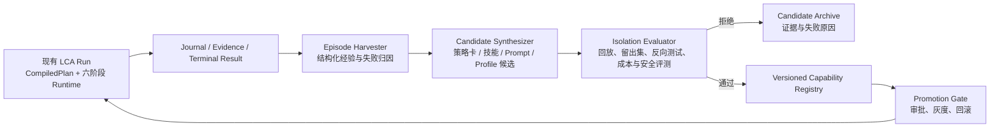

# Layered Cognitive Agent 的 RSI 可行性：基于源码的重新评估

> **更正：** 本文基于 GitHub 连接器中 `smartlijingyang-sudo/layered-cognitive-agent` 的 `main @ d0128aac` 完整克隆代码进行静态审阅，而非前一版的通用架构推演。审阅未执行仓库代码或测试；结论以当前源文件、配置与测试覆盖为准。

## 结论

**LCA 在架构上很适合承载“受控的递归自我改进（RSI）”，但当前仓库尚未实现一个可运行、可验证、可发布的 RSI 闭环。**

更准确地说，LCA 已有极好的**治理内核**：声明式运行计划、单一 Reducer 状态写入口、Journal/可观测性、能力绑定、Effect Gateway 和幂等性接缝。这些能力使它比“给 Agent 加一个反思 prompt”更适合做可审计的持续改进。[1] [2] 但现在的自我改进更多停留在**契约、命名和场景 YAML**：默认部署不启用该场景；场景引用的插件模块在当前仓库中缺失；`self_evolving` 模板没有运行时消费者；评测契约也还没有执行器或推广器。

因此，正确的判断是：

| 问题 | 基于当前代码的回答 |
|---|---|
| LCA **未来能否**支持 RSI？ | **能，且基础优于大多数 Agent 框架。** 其 runtime 与治理边界很适合作为受控学习平面。 |
| LCA **现在是否已经**支持真正的 RSI？ | **不能视为已支持。** 当前没有可被默认或受测试配置启动的“采集 → 归因 → 评测 → 发布/回滚 → 复用”闭环。 |
| 当前已具备的最高层级是什么？ | **任务内反思与有限的 episode 记录。** 它更接近 Self-refine/Reflexion 的组成部分，不等于跨任务递归自我改进。 |
| 最优战略是什么？ | 将 RSI 建成与认知执行面正交的、**离线优先的 Learning Plane**；前期只让它影响程序性策略/技能候选，不能直接自改生产 Profile、权限或代码。 |

## 已核验的代码事实

### 1. LCA 拥有做 RSI 所需的“可信执行底座”

`CognitiveRuntime` 只接收一份 `DeclarativeRuntimeBindings`，并且在启动或恢复时要求完整的可执行计划；认知层、effects、deltas、Journal、state store、resume adapter 与 idempotency store 均为显式绑定。[1] 这意味着改善候选不需要绕过 runtime：它们可以被表达为版本化的配置、策略或技能，并与具体 `plan_ref` 关联。

| 现有能力 | 源码证据 | 对 RSI 的意义 |
|---|---|---|
| 明确、不可变的运行绑定 | `CognitiveRuntime` 持有单一 `DeclarativeRuntimeBindings`，运行前要求 executable plan。[1] | 可比较“基线计划”与“候选计划”，避免模型临场改变执行语义。 |
| 单一状态迁移路径 | `AgentState` 汇聚任务、预算、历史、反思、技能激活与 checkpoint；Reducer 是状态变化的入口。[3] | 可把 episode 数据与改善版本关联到可回放的状态轨迹。 |
| 任务内反思 | `Reflection` 具有 verdict、lesson 与可选 correction；phase executor 会实际生成并消费 reflection。[4] [5] | 可作为经验抽取的原始输入。 |
| 分层记忆接缝 | `SimpleMemorySystem` 已有 working / semantic / episodic / procedural 四层，以及 policy、retrieval、compaction 接缝。[6] | Procedural memory 是“策略卡/技能卡”的自然落位。 |
| 可观察性与评测接缝 | 默认 bundle 已声明 facts、Journal、evidence、fact scorer 等服务。[7] | 可以演进为独立评测与证据保存，而非仅由生成器自评。 |
| 可控副作用 | runtime 暴露 effect/delta registry、idempotency store；基础 bundle 明确将 production effect 收敛至持久 receipt 路径。[1] [7] | 改善流程的推广、回滚与灰度能沿用既有治理原则。 |
| 技能包基础设施 | Skills provider 注册磁盘技能包存储；factory 将 bundled skills 物化到 disk store。[8] [9] | 能承载经验证的技能候选，但尚不等同于自动技能习得。 |

### 2. 当前“自我改进”并未形成可运行功能

仓库中存在 `bundles/scenario-self-improving.yaml`，其注释宣称覆盖“技能习得、失败分析、A/B、能力扩展”。但该文件引用的 `lca.plugins.skill.auto_acquire`、`lca.plugins.insight.failure_analyzer`、`lca.plugins.profile.evolver` 以及三个 profile/control 工具模块，在 `d0128aac` 的 `lca/plugins` 源目录中均不存在。[10]

这不是一个会被静默忽略的可选功能：Profile resolver 会对每个未 disabled 的 `$module` 执行 import，要求模块导出 `setup`，并核验 PluginSpec ID；缺少模块会在解析时失败。[11] 同时，默认生产配置 `profiles/web-standard.yaml` 仅挂载 `base`、`web-app`、`scenario-cordis-creator` 与 `declarative-phase-graph`，没有挂载 self-improving 或 Voyager 场景。[12]

| 表面能力 | 当前状态 | 代码级判断 |
|---|---|---|
| `Self-Evolving Agent` 模板 | **仅元数据** | `PlanTemplate` 有“反思过去运行并修订模板/prompt/plan”的描述，但 repository 内没有 `self_evolving` 模板消费者。[13] |
| self-improving scenario | **不可解析的草图** | YAML 存在，但关键插件模块缺失；默认 profile 也未挂载。[10] [12] |
| 任务内 critic | **已实现但很轻量** | `SimpleCritic` 主要根据 Observation 成败、失败类型生成模板化 lesson，不进行跨 episode 的因果归纳或策略学习。[5] |
| episodic memory | **已实现但非持久学习库** | 每步只写入简短成功/失败文本；私有层是内存列表，episode 超过 50 条直接截断。[6] |
| 自动 skill acquisition | **未实现** | 当前 skills provider 仅注册 disk store，factory 仅物化 bundled skills 或创建 HTTP importer。[8] [9] |
| 回放评测与 A/B | **仅有数据模型** | `EvalCase` 与 `EvalComparison` 只定义输入/比较契约；当前没有检索到它们的 runner、分流、统计阈值或推广消费者。[14] [15] |
| self-improving 运行面测试 | **未覆盖** | Golden profile suite 仅覆盖 8 个明确列出的 profile，未包括 self-improving/Voyager 场景。[16] |

### 3. 现有 Reflection 不等于 RSI

LCA 当前真实存在一条任务内反馈路径：执行 observation 后生成 `Reflection`，然后 memory update 将成功/失败与 lesson 写入 working/episodic 记录。[5] [6] 这对应的是 **Self-refine / Reflexion 的局部机制**。Self-Refine 强调针对当前输出的“生成—自反馈—重写”循环，而 Reflexion 将语言化反馈保存为后续尝试的记忆；二者都可以作为 RSI 的部件，但不自动产生经过验证的跨任务能力提升。[17] [18]

LCA 还缺少下列使其成为 RSI 的关键转换：从原始轨迹中**归因**；将多条经验**归纳**为候选策略；在未参与归纳的案例上**评测**；将通过的候选**版本化发布**；在退化时**自动停止或回滚**。Voyager 所显示的自动课程、持续技能库与基于环境反馈的迭代程序改进，正是 LCA 应借鉴的“经验转为可复用技能”的方向；但 LCA 需要以更严格的 effect / grant 治理来实现它。[19]

## 推荐目标：为 LCA 增加独立的 Learning Plane

不建议在六阶段认知 loop 中直接塞入“自我修改”第七阶段，也不建议让 critic 直接写 Profile、prompt 或源码。应让现有 runtime 保持“完成一次受限任务”的职责，另建一个**Learning Plane**，将完成的 episode 作为输入、将已验证的能力资产作为输出。

这条边界与现有项目哲学一致：runtime 的作用是按确认过的计划运行；Learning Plane 只提出候选；Promotion Gate 才有资格改变后续运行可见的策略或能力。**生成者、评测者、发布者必须是不同职责，且不能共享同一无条件的“自评即发布”通道。**

## 建议的架构落位

| 新组件 | 建议落位 | 输入 / 输出 | 复用的现有接缝 | 禁止行为 |
|---|---|---|---|---|
| `ImprovementEpisode`、`ImprovementCandidate`、`PromotionDecision` | `lca/contracts/models/rsi/` | typed contracts，带 `trace_id`、`plan_ref`、证据、预算、版本血缘 | `AgentState`、Journal、evidence contracts | 不把原始对话或用户事实混入全局策略。 |
| `EpisodeHarvester` | `lca/harness/observability/` 或独立 `lca/harness/learning/` | terminal run / receipts → 去敏 episode | facts、Journal、trace/evidence reader | 不在任务运行中回写 candidate。 |
| `FailureAttributor` 与 `CandidateSynthesizer` | `lca/layer1_cognitive/learning/` | 多 episode → 失败分类、策略卡、技能草案 | `Reflection`、MemoryPolicy、SkillPackageInstaller | 不根据一次成功/失败提升全局规则。 |
| `EvaluationRunner`、`RegressionSuite` | `lca/harness/evaluation/` | baseline vs candidate → 多指标报告 | `EvalCase`、`EvalComparison`、sandbox、evidence store | 不使用候选生成轨迹作为唯一测试集。 |
| `CapabilityRegistry`、`PromotionGate` | `lca/layer0_infra/learning/` + seam/provider | candidate version → canary/approved/revoked | compiled plan、Profile resolve、effect/idempotency | 不允许候选自行升级 grant、budget、approval policy。 |
| `LearningControlPlane`（后期） | 与 `layer2_runtime` **正交**的 host service | 批处理/事件 → 离线 learning work item | future Trigger/Queue/Lease | 不伪装成新的 Brain、Skill 或运行阶段。 |

## 分阶段实施路线

### P0：先让“自我改进场景”诚实且可验证

第一步不是增加更多 prompt，而是消除“YAML 声称支持、代码无法解析”的错配。建议将现有 `scenario-self-improving.yaml` 标记为实验草图，或者以真实实现替换其缺失模块；在没有实现前，不应宣传它为已支持能力。

创建一个独立的 `profiles/self-improving-minimal.yaml`，不要修改 `web-standard.yaml` 默认行为。它应至少能 resolve、compile，并有 golden profile 测试；失败时必须 fail closed。验收条件为：缺任一 RSI 依赖必失败，候选不能产生任何外部 effect，profile hash 可重复，Journal 中可追踪 candidate 与 plan version。

### P1：把“任务内反思”升级为可评估的经验数据

新增 `ImprovementEpisode`，从完成或失败的 run 生成不可变记录。字段至少包括：任务类别、`trace_id`、`plan_ref`、激活技能、决策/工具轨迹摘要、effect receipt、输入来源、验证证据、成本/时延、失败类型、reflection、用户更正和敏感性标签。

该数据必须与个人/团队事实记忆分离。当前 `SimpleMemorySystem` 的 episodic 记录可作为原料，但不能直接充当学习库：它是私有内存列表、默认上限 50，且内容不足以判断策略为何成功。[6] 同步后的 `SessionPersistence` 已允许 Profile 选择 JSONL、数据库或 event-store 后端，默认 provider 当前提供 JSONL 追加与恢复；这加强了会话事实的耐久性，但仍未提供跨 episode 的归因、评测或候选推广。[20] [21] 先建立持久、可查询、可删除/脱敏的 episode store，再让 `Memory Admission` 只接收通过证据门槛的程序性策略卡。

### P2：先自动改善“程序性策略”，再改善能力本身

首个自动推广对象应是低风险的 **procedural policy card**，例如“在某工具返回 validation error 时，先根据字段 schema 重建参数并仅重试一次”。策略卡必须包含适用条件、排除条件、支持 episode、反例、预测收益、风险级别、作者/模型和过期时间。

每个候选都要进入 `EvaluationRunner`：在冻结的留出集、反例集和故障注入集上，与基线 plan 比较任务成功率、验证率、成本、时延、拒绝率和安全违规数。现有 `EvalCase`/`EvalComparison` 可以演化为输入/单条比较基元，但需要补上 suite runner、指标聚合、置信区间或最小样本、版本选择和证据报告。[14] [15]

### P3：受控的技能习得

只有当一个候选在多个不同 episode 中稳定有效，才允许将其编译为 SkillPackage 草案。草案应包含明确接口、输入输出 schema、权限清单、测试、已知限制和 provenance。它须在 sandbox 中执行，通过单元、集成、重放与恶意输入测试后，才能进入磁盘技能库的候选版本。

这里可直接复用现有 Skills seam 与 disk store，但不应将“生成一个 Markdown skill 文件”误判为“获得技能”。自动激活也必须受 capability grant、最小权限和模型可见目录的控制。[8] [9]

### P4：Profile / Prompt / Plan 的受控进化

在 P0–P3 稳定后，才考虑 profile/prompt/plan 候选。每个候选应进入隔离 checkout，经过 `resolve_profile → compile plan → regression suite → canary`。Profile resolver 已经是合适的第一道机械门禁：每个模块必须存在、具有 `setup`、PluginSpec ID 一致且配置有效。[11]

不过 profile evolution 只能更改明确允许的配置白名单，例如 retrieval ranking、prompt variant、无副作用的 strategy 参数。它**不得**自动提升 capability、扩大 tool permission、放宽审批、提高预算、关闭 telemetry，或更改 Reducer/Journal/Effect Gateway 等宪法级边界。代码候选必须走人工审批的分支与 PR 流程；不能由运行中的 Agent 直接写入已部署源码。

### P5：数据蒸馏或模型权重更新（最后且离线）

Self-distill/finetune 是最晚期能力。只有在 episode 质量、数据治理、离线回放、红队、数据删除链路与模型评测都成熟时，才可把高质量且已脱敏的轨迹转为训练集。权重版本应被视为最高风险 candidate：只允许离线训练、独立评测和人工推广，永远不允许在线 Agent 对自己即时训练或发布。

## 必须写入“RSI 宪法”的硬门禁

| 门禁 | 原因 | 应复用或新增的机制 |
|---|---|---|
| **独立验证** | 同一模型生成、评分、发布会造成自我确认偏差。 | 机械验证优先；独立评审器/规则；证据存档与人工抽检。 |
| **离线优先** | 线上任务不能承担探索性策略的副作用。 | learner 读取已结束 episode；默认不改变当前 run。 |
| **版本与血缘** | 必须知道“哪条经验产生了哪个候选，何时影响了哪个 plan”。 | `candidate_id`、parent version、episode refs、`plan_ref`、发布 receipt。 |
| **冻结留出集** | 不能用生成候选的轨迹证明候选有效。 | RegressionSuite、反例集、重复运行、成本/安全多指标。 |
| **最小权限与不可变宪法** | 任何“变强”都不能变成获得更大权限。 | capability grant、approval、budget、Effect Gateway；新增 policy allowlist。 |
| **灰度与可回滚** | 局部收益可能造成广泛退化。 | candidate status：draft → evaluated → canary → approved → revoked；feature flag。 |
| **数据与记忆隔离** | 用户事实、团队知识、操作经验的治理要求不同。 | personal/team/operational 三域，provenance、ACL、TTL、删除与纠错。 |
| **停止条件** | 没有预算上限的“递归”会退化为成本失控。 | 现有 Budget；另设学习预算、迭代上限、最小改进阈值与自动熔断。 |

## 建议的优先级

| 优先级 | 应交付的最小垂直切片 | 是否应自动影响生产 |
|---|---|---|
| 最高 | `self-improving-minimal` profile、真实 plugin module、Golden/E2E 测试、candidate 仅记录 | 否 |
| 高 | episode store、失败归因、策略卡、replay/holdout evaluator、证据报告 | 否，只显示候选与评测 |
| 高 | 程序性策略 canary、candidate registry、feature flag、自动撤回 | 仅低风险、白名单策略 |
| 中 | sandbox skill synthesis 与技能候选推广 | 受审批/限域后可用 |
| 低 | profile/prompt/plan 的 A/B 与自动灰度 | 只限非宪法配置 |
| 最低 | 蒸馏/微调、自动生成代码变更 | 离线 + 人工审批 |

## 最终建议

**不要把 LCA 的 RSI 目标定义为“Agent 会自己改自己”。** 对这个项目，更有竞争力且符合其架构风格的定义应是：

> **LCA 以可追溯的 episode 为原料，在独立评测和权限门禁下，把验证过的经验沉淀为可版本化、可回滚的策略、技能与配置候选，并仅将通过门禁的候选作用于未来受限运行。**

这能让 LCA 充分利用现有的 declarative plan、Journal、Reducer、capability、Effect Gateway、idempotency 和 memory seams；同时避免把最危险的能力——修改权限、执行语义和生产代码——交给一个自评的 Agent。换言之：**LCA 的未来 RSI 应是“治理优先的能力复利”，而不是“无边界的自我修改”。**

## 参考

[1] [CognitiveRuntime（`d0128aac`）](https://github.com/smartlijingyang-sudo/layered-cognitive-agent/blob/d0128aac/lca/layer2_runtime/runtime_loop.py)

[2] [DeclarativeRuntimeBindings（`d0128aac`）](https://github.com/smartlijingyang-sudo/layered-cognitive-agent/blob/d0128aac/lca/layer2_runtime/runtime_bindings.py)

[3] [AgentState（`d0128aac`）](https://github.com/smartlijingyang-sudo/layered-cognitive-agent/blob/d0128aac/lca/contracts/models/core/state.py)

[4] [Decision / Observation / Reflection（`d0128aac`）](https://github.com/smartlijingyang-sudo/layered-cognitive-agent/blob/d0128aac/lca/contracts/models/core/decision.py)

[5] [SimpleCritic（`d0128aac`）](https://github.com/smartlijingyang-sudo/layered-cognitive-agent/blob/d0128aac/lca/layer1_cognitive/brain/critic.py)

[6] [SimpleMemorySystem（`d0128aac`）](https://github.com/smartlijingyang-sudo/layered-cognitive-agent/blob/d0128aac/lca/layer1_cognitive/memory/simple_memory.py)

[7] [基础运行 bundle（`d0128aac`）](https://github.com/smartlijingyang-sudo/layered-cognitive-agent/blob/d0128aac/bundles/base.yaml)

[8] [Skills provider（`d0128aac`）](https://github.com/smartlijingyang-sudo/layered-cognitive-agent/blob/d0128aac/lca/plugins/providers/skills.py)

[9] [Skill store factory（`d0128aac`）](https://github.com/smartlijingyang-sudo/layered-cognitive-agent/blob/d0128aac/lca/layer0_infra/skills/factory.py)

[10] [Self-improving scenario bundle（`d0128aac`）](https://github.com/smartlijingyang-sudo/layered-cognitive-agent/blob/d0128aac/bundles/scenario-self-improving.yaml)

[11] [Profile resolver（`d0128aac`）](https://github.com/smartlijingyang-sudo/layered-cognitive-agent/blob/d0128aac/lca/harness/profile/resolve.py)

[12] [默认 web-standard profile（`d0128aac`）](https://github.com/smartlijingyang-sudo/layered-cognitive-agent/blob/d0128aac/profiles/web-standard.yaml)

[13] [PlanTemplate catalog（`d0128aac`）](https://github.com/smartlijingyang-sudo/layered-cognitive-agent/blob/d0128aac/lca/contracts/atoms/plan_template.py)

[14] [EvalCase（`d0128aac`）](https://github.com/smartlijingyang-sudo/layered-cognitive-agent/blob/d0128aac/lca/contracts/harness/eval_case.py)

[15] [EvalComparison（`d0128aac`）](https://github.com/smartlijingyang-sudo/layered-cognitive-agent/blob/d0128aac/lca/contracts/harness/eval_comparison.py)

[16] [Golden profile coverage（`d0128aac`）](https://github.com/smartlijingyang-sudo/layered-cognitive-agent/blob/d0128aac/tests/golden/test_8_profiles.py)

[17] [Madaan et al., *Self-Refine: Iterative Refinement with Self-Feedback*](https://arxiv.org/abs/2303.17651)

[18] [Shinn et al., *Reflexion: Language Agents with Verbal Reinforcement Learning*](https://arxiv.org/abs/2303.11366)

[19] [Wang et al., *Voyager: An Open-Ended Embodied Agent with Large Language Models*](https://arxiv.org/abs/2305.16291)

[20] [SessionPersistence protocol（`d0128aac`）](https://github.com/smartlijingyang-sudo/layered-cognitive-agent/blob/d0128aac/lca/contracts/protocols/session_persistence.py)

[21] [JSONL SessionPersistence provider（`d0128aac`）](https://github.com/smartlijingyang-sudo/layered-cognitive-agent/blob/d0128aac/lca/plugins/providers/session_persistence.py)

---

作者：Manus AI  
审阅基线：`main @ d0128aac`  
审阅日期：2026-08-27
