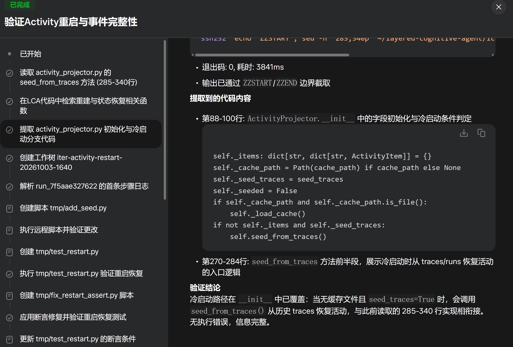
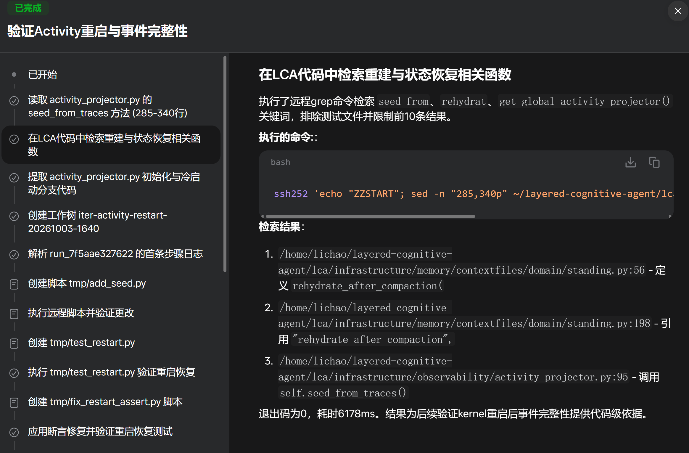

# Activity 动态栏：数据是什么、UI 怎么显示

> 对应截图：任务详情视图「验证Activity重启与事件完整性」、助手动态栏「今天」分组。
> 代码版本：main @ c4364e8c7（2026-10-03）。**版本弧**：`634fe4c4c`（李超 17:09 亲改，重写投影）曾移除 `ActivityItem` 的 `tool_name`/`current_step` 字段与 `ActivityIntentNamer.live_step()`；`fix-activity-honesty-20261003-1730` 分支（`c9bcb5b51`，merge `f17a7effe`）把两字段加回，`d89fc6e73` 去掉了 auto-merge 引入的重复 `tool_name` kwargs。下文均为恢复后状态。

## 一、图里是什么

### 图 1 / 图 3：任务执行详情视图





这是一个**任务**（task）的执行轨迹面板，标题「验证Activity重启与事件完整性」，右上角「已完成」是任务终态。

- **左侧**：步骤清单。✓ 是已完成的步骤（读代码、建 worktree、跑验证脚本……），◐/□ 是待办。点击步骤，右侧显示该步骤产出的**证据**。
- **右侧**：代码证据 + 验证结论。展示了从 `activity_projector.py` 提取的两段代码：
  - `__init__`（90–98 行）：字段初始化与冷启动分支——活动项为空且 `seed_traces=True` 时调 `seed_from_traces()`。
  - `seed_from_traces`（355 行起）：冷启动时从 `traces/runs` 恢复活动的入口逻辑。
  - 结论：冷启动路径已覆盖，信息完整，无执行错误。

### 图 2：助手动态栏（Activity Feed）


这是**助手右侧抽屉**的「动态」tab（`AssistantStatusDrawer.tsx`），按 `今天 / 昨天 / 更早` 分组。每一行就是一个 **Activity**：

| 行内元素 | 含义 | 例子 |
|---|---|---|
| 标题 | 工具做了什么（一句话） | 验证Activity重启与事件完整性 |
| 摘要 | 关键结果（一句话） | 验证重启后36个活动完整恢复 |
| 时间 | 开始时间（今天只显示 HH:MM） | 4:39 pm |
| 状态图标 | ✓ 已完成 / 运行中 / ✕ 失败 / 已取消 | ✓ |
| 工具徽标 | 真实工具名（`tool_name` 缺失时回退 `category`/`title`） | run_shell |

点击一行弹出**详情弹窗**：人读概述、调用工具与参数 JSON、产出结果、开始时间、耗时。

## 二、Activity 的信息是什么（数据模型）

`ActivityItem`（`lca/contracts/models/observability/activity.py`，frozen pydantic，`extra="forbid"`）：

| 字段 | 含义 | 来源 |
|---|---|---|
| `id` | 工具调用唯一标识 | `invocation_id` / `call_id`；回填项直接用 tool call 的 `invocation_id`（无 `seed:` 前缀） |
| `tool_name` | 工具名（`str`，默认 `""`） | `_extract_tool_name()`：事件 `tool_name` → payload `tool_name` → tool_calling `apiName`/`identifier`/`name`；既用于派生 title/summary/icon/category，也落盘随快照与 WS 透出前端 |
| `title` / `summary` | 人读标题/摘要 | `ActivityIntentNamer.name()` 按工具类型生成 |
| `current_step` | 进行时人读动作短语（`str \| None`） | `ActivityIntentNamer.live_step(tool_name, args)`；start 建项时写入，刷新时沿用已存值（`existing.current_step or live_step(...)`） |
| `status` | `running` / `completed` / `failed` / `cancelled` 四态 | end 事件的 `isSuccess` / `outcome` / `ToolDenied` |
| `start_time` / `end_time` | 开始/结束（ISO） | start 事件时间戳（缺失 → `""`，不编造）；**回填项** `end_time` = `start_time`（无真实结束时刻，见 §3.3） |
| `duration_ms` | 耗时毫秒 | `executionTime` / `latency_ms` |
| `category` / `icon` | 分类与图标 | 按工具名映射（COMMAND/SUBAGENT/BROWSER/CRON/TOOL） |
| `params` | 工具参数原文 | `arguments` / `args` |
| `result_summary` | 结果一句话（失败时带错误信息） | `result.state.summary` / `message.content` / `stdout_head` |
| `is_system` | 是否系统活动 | 事件标记 |

**Muse 思想**：没数据就空着，不编造——`_format_iso()` 缺失时间戳返回 `""`（`feed_event` start 路径）；`cancel` 不再写 `"cancelled"` 字符串；`seed_from_traces` 缺 `entered_at` 时 `_format_iso(None)` 留空（此前硬编码 `"2026-10-03T00:00:00Z"` 的诚实债务已清，见 §3.3）。

## 三、UI 怎么显示这些（实现链路）

```
后端事件                    翻译层                    投影层                  API              前端
─────────                  ───────                    ───────                 ────             ────
spine: phase.tool.call.start ─┐
spine: step.tool_call.record ─┼─→ EventTranslator ─→ ActivityProjector ─→ status-snapshot ─→ AssistantStatusDrawer
spine: body.tool.execute.*  ──┘      │  feed_event()      │  get_activities()      │  (fetch + WS)
catalog: ToolStarted/Invoked/Denied ─┘                   │                      │
                                                         ▼                      ▼
                                              seed_from_traces()          快照映射 + 增量 patch
                                              (kernel 重启回填)
```

### 3.1 后端：事件 → ActivityItem

`EventTranslator.translate()` 按事件类型分发（`lca/application/runtime/coordinator/event_translator.py`）：

- **spine**（`execution_point`）：`step.tool_call.record` 是网关路径的工具启动信号（`phase.tool.call.start` 在网关被 `SUPPRESSED_SPINE_EPS` 压掉）；`body.tool.execute.start/end` 是真实执行边界。
- **catalog**（`event.type`）：`ToolStarted` / `ToolInvoked` / `ToolDenied`，网关工具事件的主通道（曾因只认 `execution_point` 而整条断掉，已修）。

`ActivityProjector.feed_event()`（`lca/infrastructure/observability/activity_projector.py`）：

- **start**：建 `RUNNING` 项（`phase.tool.call.start` / `step.tool_call.record` / `ToolStarted`）；`tool_name=_extract_tool_name(...)`，`current_step=ActivityIntentNamer.live_step(tool_name, args)`；同 id 刷新时沿用已存的 `tool_name`/`current_step`（`existing.tool_name or tool_name`）。
- **execute.start**：当前 `feed_event` 不处理（既非 start 也非 end 分支，静默丢弃），没有 `start_time` 修正。
- **end**：落 `completed` / `failed`（`ToolDenied` 必红，错误信息进 `result_summary`）/ `cancelled`；判据：`isSuccess`（bool）优先，否则 `outcome`（failure/failed/error/cancelled 为负）；start 缺失时合成 fallback 项。
- **重启恢复**：`seed_from_traces()` 从 `traces/runs/*/journal.json` 回填最近 50 个 run 的 `tool_calls`/`tool_results`；`__init__`（活动项为空且 `seed_traces=True`）与 `feed_event()`（`_seeded` 只跑一次）两处冷启动；`feed_event()` 额外合并 `default` 存储——网关工具事件不带 `assistant_id`，不合并重启后抽屉为空。**只取已落盘的 completed/failed**——重启时刻"running"的已经死了，显示成运行中就是撒谎。细则：无 `tool_result` 的 tool_call 按 `COMPLETED` 乐观回填；回填项 `end_time` = `start_time`（无真实结束时刻）。

### 3.2 前端：AssistantStatusDrawer.tsx

**快照**：打开抽屉调 `/lca-api/v1/assistants/{id}/status-snapshot` → `activities[].model_dump()` → 映射为行数据：

- `status`：`completed→success` / `running→running` / `failed→error` / `cancelled→cancelled`（`mapBackendStatus`）。
- `timestamp`：`formatActivityTime()`——今天 HH:MM，昨天"昨天 HH:MM"，更早"MM-DD HH:MM"；无时间戳显示"—"。
- `toolBadge` / 详情 `toolName`：后端恢复返回 `tool_name`（`f17a7effe` 合回 honesty 分支）；前端 `toolName: a.tool_name || a.category || a.title`。
- `dateGroup`：按日期分今天/昨天/更早三组。

**增量**：WebSocket `activity_updated` → `window` 事件 `lca:activity_updated` → 原地 patch 单行；start 消息带 `toolName`/`currentStep`（及 id/runId/title/summary/status/startTime/icon/params），end 消息带 `status`/`endTime`/`durationMs`/`resultSummary`/`toolName`/`currentStep`；前端 `patch.currentStep !== undefined ? patch.currentStep : 旧值` 合并。

**进行时**：`running` 的行每秒 tick 显示 elapsed（"运行中 · 3分12秒"）；有 `currentStep` 时显示它（`act.detail?.currentStep ?? act.summary`），后端 `live_step()` 在 start 时生成；右侧有"停止"按钮调取消接口。

**详情弹窗**：状态 Tag 按实际四态渲染（以前硬编码"✓ 执行成功"）；"调用工具"显示 `toolName(参数名)` + 参数 JSON；"产出"显示 `result` 或"—"（以前没结果时撒谎写"✓ 动作已完成"）；"耗时"用 `formatDuration` → `1.2s` 而非 `1200ms`，无则"—"）。

### 3.3 已知的诚实边界

- **直连 kernel 的 run**：spine 工具事件按 ADR-0220/0240 有意只带 `state_id`（富信息留给 control-plane），translator 静默丢弃——这类 run 的动态栏目前为空。网关（web UI）路径完整。
- ✅ **回填硬编码时间戳已清**：`seed_from_traces` 缺 `entered_at` 时 `_format_iso(None)` 留空（`lca/infrastructure/observability/activity_projector.py:412-413`，注释"缺 entered_at 就空着，不编造假时间戳"）；此前 `"2026-10-03T00:00:00Z"` 债务关闭。
- ✅ **`tool_name` / `current_step` 已恢复**：`634fe4c4c` 的移除被 `f17a7effe`（honesty 分支 `c9bcb5b51`）撤销，`d89fc6e73` 去重；后端快照与 WS（7 处 `activity_updated` 带 `toolName`）均透出真实值，前端 `AssistantStatusDrawer.tsx:911/917/1270` 已消费。
- ✅ **诚实边界有回归钉**：（INV-01 ~ INV-06，commit ）钉住本节诚实边界——回填只取已落盘的 completed/failed、不编造时间戳、start 缺失时的合成 fallback。
