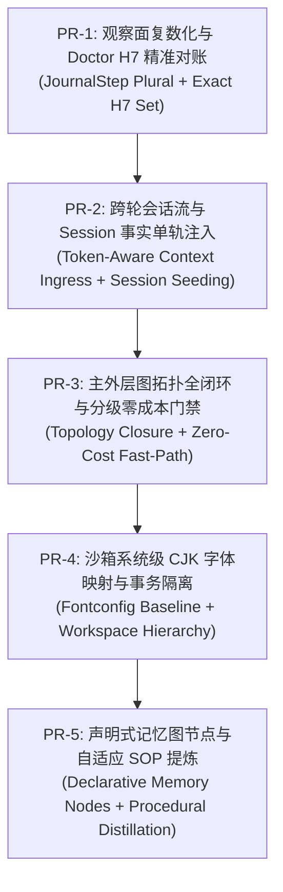

# ADR-0244 Implementation Plan — PR 拆解与加速实施

> **For Antigravity:** REQUIRED WORKFLOW: Use `.agent/workflows/execute-plan.md` to execute this plan in single-flow mode.

**Goal:** 按照第一性原理全面落地 ADR-0244，解决多轮会话失忆、主图拓扑反思记忆绕行、并发工具结果被覆盖、Doctor H7 假阳性误报、沙箱字体与工作区污染、以及通用技能发现与程序性记忆自适应沉淀，杜绝一切硬编码业务逻辑。

**Architecture:** 
1. 观察面对称性：执行面并发与观察面复数一等公民对齐，Doctor H7 基于 `invocation_id` 集合对账；
2. 事实单轨流：前端 Token 预算感知消息切片，后端 `seed_prior_turns` 注入 Session 事实，废除伪通道；
3. 图拓扑全闭环：`think(respond) → reflect → remember → terminal`，配合 Fast-Path 零成本门禁控制延迟与 Token 消耗；
4. 系统级环境契约：沙箱基于 Fontconfig 系统级映射解决 CJK 字体，事务级隔离工作区；
5. 通用声明式记忆与自描述技能：图节点零技能名硬编码，自描述 frontmatter 驱动 LLM 自激活与自适应 SOP 提炼。

**Tech Stack:** Python 3.12, Pydantic, Cordis, Pytest, TypeScript (LobeHub frontend gateway patch), Fontconfig, YAML Bundle Graphs.

---

## PR 拆解架构全景 (PR Decomposition Roadmap)



---

## PR-1: 观察面复数化与 Doctor H7 精准对账 (P1)

### Task 1: `JournalStep` 数据模型升级为复数一等公民

**Files:**
- Modify: `lca/contracts/models/observability/journal/step.py:68-89, 145-195`
- Test: `tests/contracts/models/observability/test_journal_step_plural.py`

**Step 1: Write the failing test**
在 `tests/contracts/models/observability/test_journal_step_plural.py` 中编写针对 `ToolResult.invocation_id` 与 `JournalStep.tool_calls` / `JournalStep.tool_results` 复数字段及只读兼容属性的测试。

**Step 2: Run test to verify it fails**
Run: `pytest tests/contracts/models/observability/test_journal_step_plural.py -v`
Expected: FAIL（属性不存在）

**Step 3: Write minimal implementation**
在 `step.py` 中：
1. `ToolResult` 增加字段 `invocation_id: str = ""`；
2. `JournalStep` 增加：
   - `tool_calls: tuple[ToolCallRecord, ...] = ()`
   - `tool_results: tuple[ToolResult, ...] = ()`
3. 为 `JournalStep` 增加向后兼容属性：
   - `@property def tool_call(self) -> ToolCallRecord | None:` 返回 `self.tool_calls[0]`（若非空）或 `self._legacy_tool_call`
   - `@property def tool_result(self) -> ToolResult | None:` 返回 `self.tool_results[0]`（若非空）或 `self._legacy_tool_result`

**Step 4: Run test to verify it passes**
Run: `pytest tests/contracts/models/observability/test_journal_step_plural.py -v`
Expected: PASS

**Step 5: Commit**
```bash
git add lca/contracts/models/observability/journal/step.py tests/contracts/models/observability/test_journal_step_plural.py
git commit -m "feat(observability): support plural tool_calls and tool_results on JournalStep"
```

---

### Task 2: `journal_fold.py` 收集逻辑升级为多工具字典映射

**Files:**
- Modify: `lca/plugins/session/derivers/step_tree/journal_fold.py:250-265, 368-385, 590-615, 710-720`
- Test: `tests/plugins/session/derivers/test_journal_fold_concurrent_tools.py`

**Step 1: Write the failing test**
模拟单步内触发 4 次并发 `step.tool_call.record` 和 `step.tool_result.record`（包含 PDF 导出与图表），断言输出的 `JournalStep` 拥有全部 4 个工具调用与结果，且生成的 PDF 存在于结果集合中。

**Step 2: Run test to verify it fails**
Run: `pytest tests/plugins/session/derivers/test_journal_fold_concurrent_tools.py -v`
Expected: FAIL（只保留最后一个工具结果，前面的被覆盖）

**Step 3: Write minimal implementation**
在 `journal_fold.py` 中：
1. `_Frame` 增加 `tool_calls: list[ToolCallRecord] = field(default_factory=list)` 与 `tool_results: list[ToolResult] = field(default_factory=list)`；
2. 在 `_assign_tool_call` 与 `_assign_tool_result` 时，按 `invocation_id` 追加或更新列表，同时更新 `target.tool_calls` 与 `target.tool_results`；
3. `JournalStep` 实例化时传入 `tool_calls=tuple(f.tool_calls)` 与 `tool_results=tuple(f.tool_results)`。

**Step 4: Run test to verify it passes**
Run: `pytest tests/plugins/session/derivers/test_journal_fold_concurrent_tools.py -v`
Expected: PASS

**Step 5: Commit**
```bash
git add lca/plugins/session/derivers/step_tree/journal_fold.py tests/plugins/session/derivers/test_journal_fold_concurrent_tools.py
git commit -m "fix(journal): aggregate concurrent tool calls into plural JournalStep lists"
```

---

### Task 3: Doctor H7 精准集合对账（废除脆弱的步骤数启发式）

**Files:**
- Modify: `lca/plugins/transport/webserver/doctor/step_check.py:690-735`
- Test: `tests/plugins/transport/webserver/doctor/test_doctor_h7_reconciliation.py`

**Step 1: Write the failing test**
针对一个包含“纯文本回复步骤”和“并发工具步骤”的 Run（`total_steps > tool_total < spine_total`），运行 `_hop_h7`，验证过去会误报 `ok=False`（mismatch），现在能够正确通过。

**Step 2: Run test to verify it fails**
Run: `pytest tests/plugins/transport/webserver/doctor/test_doctor_h7_reconciliation.py -v`
Expected: FAIL（过去逻辑返回 `ok=False`）

**Step 3: Write minimal implementation**
在 `step_check.py` 中：
1. 废弃 `forked = scan.total_steps == scan.tool_total < spine_total`；
2. 收集 `journal_inv_ids`（遍历每步的 `step.tool_calls` 或 `step.tool_results`）；
3. 直接对比 `journal_inv_ids` 集合与 `spine_inv_ids` 集合；若集合一致且无执行错误冲突，判定 `ok=True`；
4. 若存在缺失的 `invocation_id`，精确列出差异条目。

**Step 4: Run test to verify it passes**
Run: `pytest tests/plugins/transport/webserver/doctor/test_doctor_h7_reconciliation.py -v`
Expected: PASS

**Step 5: Commit**
```bash
git add lca/plugins/transport/webserver/doctor/step_check.py tests/plugins/transport/webserver/doctor/test_doctor_h7_reconciliation.py
git commit -m "fix(doctor): replace heuristic step counting with exact invocation set reconciliation for H7"
```

---

## PR-2: 跨轮会话流与 Session 事实单轨注入 (P0)

### Task 4: 前端 Wire 层恢复 Token 预算感知有效上下文序列

**Files:**
- Modify: `deploy/lobehub/patches/runtime/lcaGateway/executeGatewayRun.ts:175-240`
- Test: 集成测试 / 手动端到端请求验证

**Step 1: Analyze & Refactor**
1. 移除 lines 175-178 中的 `const lastUser = params.messages.slice().reverse().find(...)` 破获性单一截断；
2. 消费 `params.messages`，过滤 `msg.role === 'system'` 或未完成的流式临时占位符；
3. 映射出合法的 `wireMessages` 数组，保留当前轮及符合上下文预算的有效历史 User / Assistant 消息轮次；
4. 附件信息仅挂载在真正产生附件上传的具体轮次；
5. 发送完整 `messages: wireMessages` 至 `POST /lca-api/runs`。

**Step 2: Commit**
```bash
git add deploy/lobehub/patches/runtime/lcaGateway/executeGatewayRun.ts
git commit -m "fix(gateway): pass token-budget-aware message history to /runs endpoint"
```

---

### Task 5: 后端 `RunSessionWriterProtocol.seed_prior_turns` 协议与实现

**Files:**
- Modify: `lca/contracts/protocols/session/run_session_writer.py`
- Modify: `lca/runtime/session/run_session_writer.py`
- Test: `tests/runtime/session/test_seed_prior_turns.py`

**Step 1: Write the failing test**
编写针对 `writer.seed_prior_turns(prior_turns)` 的测试：验证传入多轮历史后，Session 内自动追加对应的 `surface/user_message` 与 `surface/assistant_message`（打上 `historical: True` 标签），并且 `writer.derive_messages()` 正确包含完整消息列表。

**Step 2: Run test to verify it fails**
Run: `pytest tests/runtime/session/test_seed_prior_turns.py -v`
Expected: FAIL（方法未定义）

**Step 3: Write minimal implementation**
1. 在 `RunSessionWriterProtocol` 中定义：
   ```python
   def seed_prior_turns(self, turns: Sequence[ConversationTurn]) -> None: ...
   ```
2. 在 `lca/runtime/session/run_session_writer.py` 中实现：
   遍历 `turns`，调用 `Session.append(SessionEvent(type="surface/user_message", data={"content": turn.content, "historical": True}))`（对应角色分别追加）；
   确保只在 Run 初始化时单次执行，防重入。

**Step 4: Run test to verify it passes**
Run: `pytest tests/runtime/session/test_seed_prior_turns.py -v`
Expected: PASS

**Step 5: Commit**
```bash
git add lca/contracts/protocols/session/run_session_writer.py lca/runtime/session/run_session_writer.py tests/runtime/session/test_seed_prior_turns.py
git commit -m "feat(session): add seed_prior_turns to inject conversation history as single-track facts"
```

---

### Task 6: 接入 `runtime_loop.py` 并彻底废除 `PRIOR_CONVERSATION_WM_KEY`

**Files:**
- Modify: `lca/runtime/loop/runtime_loop.py:160-175`
- Modify: `lca/plugins/transport/webserver/carrier/runs/lifecycle/run_context_factory.py:18-22`
- Test: `tests/runtime/loop/test_runtime_loop_prior_turns.py`

**Step 1: Write test & verify failure**
断言在 Run 启动时，`runtime_loop` 自动调用 `writer.seed_prior_turns(ctx.prior_turns)`，且 `state.extra` 中不再存留 `PRIOR_CONVERSATION_WM_KEY`。

**Step 2: Implement**
1. 在 `runtime_loop.py` 中，初始化 `writer` 后调用 `writer.seed_prior_turns(ctx.prior_turns)`；
2. 删除 `run_context_factory.py` 与 `runtime_loop.py` 中关于 `PRIOR_CONVERSATION_WM_KEY` 的读写代码。

**Step 3: Run test to verify it passes**
Run: `pytest tests/runtime/loop/test_runtime_loop_prior_turns.py -v`
Expected: PASS

**Step 4: Commit**
```bash
git add lca/runtime/loop/runtime_loop.py lca/plugins/transport/webserver/carrier/runs/lifecycle/run_context_factory.py tests/runtime/loop/test_runtime_loop_prior_turns.py
git commit -m "refactor(runtime): seed prior turns via session writer and retire PRIOR_CONVERSATION_WM_KEY"
```

---

## PR-3: 主外层图拓扑全闭环与分级零成本门禁 (P0)

### Task 7: 修复 `bundles/outer/phase_main.yaml` 拓扑路由

**Files:**
- Modify: `bundles/outer/phase_main.yaml:160-205`
- Test: `tests/declarative/test_phase_main_outer_topology.py`

**Step 1: Write test & verify failure**
测试断言：当 `think.main` 输出 `respond` 时，首选出边为 `to: reflect.main`，绝不直连 `terminal.commit`；当 `act.main` 产出终态时，首选出边亦为 `to: reflect.main`。

**Step 2: Implement**
1. 删除 `from: think.main` 直连 `to: terminal.commit`（`action_type == respond`）的边；
2. 新增边：`think.main` (`action_type == respond`) → `reflect.main`；
3. 新增边：`act.main` (`should_terminate == true`) → `reflect.main`；
4. 保持 `reflect.main` → `remember.main` → `terminal.commit` 的主闭环。

**Step 3: Run test to verify it passes**
Run: `pytest tests/declarative/test_phase_main_outer_topology.py -v`
Expected: PASS

**Step 4: Commit**
```bash
git add bundles/outer/phase_main.yaml tests/declarative/test_phase_main_outer_topology.py
git commit -m "fix(topology): close the outer loop from think/act to reflect and remember"
```

---

### Task 8: 门禁快速路径防护（Fast-Path Zero-Cost Gate）

**Files:**
- Modify: `lca/nodes/reflect/score/score.py`
- Modify: `lca/nodes/remember/write/write.py`
- Test: `tests/nodes/test_zero_cost_fast_path.py`

**Step 1: Write test & verify failure**
针对正常纯文本回复（无工具调用、无错误、无显式人设变更），断言：
1. `score.py` 耗时 < 5ms，不调用 LLM Critic；
2. `write.py` 判定 No-op，不调用 LLM，不铸造空 Envelope，耗时 < 2ms。

**Step 2: Implement**
1. 在 `score.py` 中，当 `observation is None` 且无异常时，返回静态轻量 `reflection`，跳过 LLM 脑区评分；
2. 在 `write.py` 中，无明确 Memory 候选时，直接输出 `envelope: None, routing: respond`，不触发 Gateway 派发。

**Step 3: Run test to verify it passes**
Run: `pytest tests/nodes/test_zero_cost_fast_path.py -v`
Expected: PASS

**Step 4: Commit**
```bash
git add lca/nodes/reflect/score/score.py lca/nodes/remember/write/write.py tests/nodes/test_zero_cost_fast_path.py
git commit -m "perf(gate): establish zero-cost fast path for pure text responses in reflect and remember"
```

---

## PR-4: 沙箱系统级 CJK 字体映射与事务隔离 (P2)

### Task 9: 沙箱 Fontconfig 系统级 CJK 别名映射与隔离工作区

**Files:**
- Modify: 沙箱基础镜像 / 初始化逻辑
- Test: `tests/infrastructure/sandbox/test_cjk_font_and_isolation.py`

**Step 1: Implement**
1. 在沙箱系统环境 `/etc/fonts/local.conf` 配置 `sans-serif` 回退至 `WenQuanYi Micro Hei` 与 `Noto Sans CJK SC`；
2. 在沙箱运行创建时，按 Run / Topic 分配独立隔离的工作空间，杜绝历史文件干扰；
3. 彻底废除任何向沙箱写 `matplotlibrc` 的临时修补代码。

**Step 2: Verify**
运行测试生成含中文标题的图片，断言无 `findfont` 警告，断言工作空间无外部残留文件。

**Step 3: Commit**
```bash
git commit -m "feat(sandbox): enforce systemic fontconfig CJK mapping and ephemeral workspace isolation"
```

---

## PR-5: 声明式记忆图节点与自适应 SOP 提炼 (P2/P3)

### Task 10: 声明式记忆图节点与通用程序性经验自适应沉淀

**Files:**
- Modify: `bundles/perceive/perceive_subgraph.yaml`
- Modify: `bundles/remember/remember_subgraph.yaml`
- Modify: `lca/nodes/reflect/score/score.py`
- Test: `tests/integration/test_memory_and_procedural_distillation.py`

**Step 1: Implement**
1. 落地 `phase.perceive.memory_retrieve` 声明式图节点；
2. 落地 `phase.remember.admit` 权威度准入门禁；
3. 在 `reflect` 阶段仅识别**通用认知元特征**（多步工具成功链 + 交付物生成），输出 `ProceduralMemoryCandidate`；
4. 模型根据真实上下文动态生成提炼建议，并由用户确认后调用 `create_assistant_skill` 固化。严禁在图节点中硬编码技能名或正则匹配！

**Step 2: Verify & Commit**
```bash
git commit -m "feat(cognition): declarative memory subgraph and generic procedural memory distillation"
```
