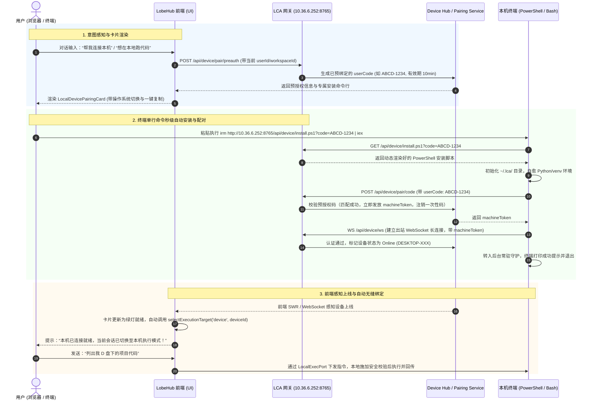

# 对话式连接本机与一键安装交互设计方案 (Conversational Local Machine Connection & Auto-Install Design)

## 0. 背景与问题定义

在 Web Agent（以 LobeHub 为代表的浏览器端界面）中，用户期望能够直接在对话中操作其本机的文件夹、文件与本地命令行。
然而，**浏览器沙箱安全模型（Same-Origin Policy & Sandbox Boundary）严禁任意 Web 页面在操作系统中静默唤起本地终端（如 PowerShell 或 Bash）并直接执行安装或提权操作**（此类行为在现代浏览器中属于严重的远程代码执行 RCE 安全漏洞）。

因此，现代云原生 AI 与开发者工具（如 Ollama、Claude Code、GitHub Codespaces、Tailscale、LobeHub 原生）的标准事实方案是：
**“对话意图感知 + 界面呈现专属一键安装命令 + 用户在本地终端单次回车启动出站长连接守护进程”**。

通过引入**免手动输码的预授权配对协议（Pre-authorized Pairing）**，用户无需在终端与网页之间反复输码，仅需粘贴回车一行命令，系统即可在数秒内自动完成下载、注册、认证、建联与前端助理执行目标的自动绑定。

---

## 1. 核心架构与端到端数据流



---

## 2. 服务端扩展设计

### 2.1 路由端点 (`lca/plugins/transport/webserver/routes_1/routes_device.py`)

新增 3 个轻量 HTTP 端点：
1. `POST /api/device/pair/preauth`:
   - 接收前端当前会话的 `userId` 与 `workspaceId`；
   - 生成具有 `pre_authorized=True` 的配对申请，生成 8 位字符的 `userCode`（如 `LCA-7890`）；
   - 返回 `{ userCode, expiresIn, installCommands: { windows, bash } }`。
2. `GET /api/device/install.ps1`:
   - 接收 Query 参数 `?code=<userCode>`；
   - 自动获取请求中的 Host（如 `10.36.6.252:8765`）；
   - 动态渲染并下发 Windows PowerShell 安装与启动脚本。
3. `GET /api/device/install.sh`:
   - 接收 Query 参数 `?code=<userCode>`；
   - 动态渲染并下发 Linux / macOS Bash 安装与启动脚本。

### 2.2 状态机增强 (`DevicePairingService`)

在 `lca/plugins/transport/device_hub/pairing/pairing.py` 中：
- 增加 `preauth_code(user_id, workspace_id, expires_in=600) -> DevicePairingRequest` 方法；
- 在 `request_code` 中校验若传入的 `user_code` 处于预授权状态，则直接判定通过，生成 `machine_token`，将状态推进至 `VERIFIED`，供客户端 `poll_token` 立即取回凭据。

---

## 3. 本地安装脚本设计

### 3.1 Windows (`install.ps1`) 规范

- **运行权限**：完全基于普通用户权限，存放在 `$HOME\.lca\`（无需任何管理员提权弹窗）；
- **环境探测与自愈**：
  ```powershell
  # 探测系统 Python 3
  $pythonCmd = (Get-Command python, py, python3 -ErrorAction SilentlyContinue | Select-Object -First 1).Source
  ```
  若环境缺乏依赖，利用 `python -m venv $HOME\.lca\companion-env` 静默构建隔离环境；
- **免二次输码**：脚本内置服务端传入的 `$PairCode`，自动通过 HTTP POST 向网关发起配对交换，获取 `machineToken` 并保存到 `$HOME\.lca\companion_token.json`；
- **后台常驻启动**：
  ```powershell
  Start-Process -FilePath $pythonCmd -ArgumentList "$lcaDir\companion.py run --server $Server" -WindowStyle Hidden
  Write-Host "[✓] LCA 本机助手已成功启动并保持后台常驻！" -ForegroundColor Green
  ```

### 3.2 Linux / macOS (`install.sh`) 规范

- 采用 POSIX 兼容语法；
- 从服务端下载最新 `companion.py` 并链接至 `~/.lca/bin/lca-companion`；
- 携带预授权码自动完成配对；
- 使用 `nohup "$PYTHON_BIN" "$COMPANION_BIN" run --server "$SERVER" > "$HOME/.lca/companion.log" 2>&1 &` 启动后台常驻守护。

---

## 4. 前端交互卡片与自动绑定

### 4.1 触发与展示 (`LocalDevicePairingCard`)

在 LobeHub 前端补丁（`deploy/lobehub/patches/ui/execution_target.py`）：
1. **意图侦测**：
   - 当用户在聊天框发送类似 `"连接本机"`、`"连接我的电脑"`、`"在本地运行"`，或点击切换器底部的 `"接入新电脑"` 时触发；
2. **卡片布局**：
   - 顶栏：操作系统切换标签卡 `[ Windows (PowerShell) ]` / `[ macOS & Linux (Bash) ]`（根据 `navigator.userAgent` 自动预选）；
   - 中间：带高亮与快速复制按钮的完整命令行（如 `irm http://10.36.6.252:8765/api/device/install.ps1?code=LCA-1234 | iex`）；
   - 底栏：动态状态指示器（`等待设备在本地运行命令中... 剩余有效时间 09:48`）。

### 4.2 状态感知与自动切换

- 卡片内部借助已有的 `useDeviceList()` SWR Hook 进行即时侦听；
- 一旦目标设备上线（`online === true` 且匹配当前绑定的用户）：
  - 界面卡片动画转为绿色成功对勾：`✅ 设备已连接: DESKTOP-XXX`；
  - 前端自动触发 `selectExecutionTarget('device', deviceId)`；
  - 自动向当前对话流回填一条系统消息：“当前执行目标已无缝切换到本机设备，可以直接在对话中操作本机文件和命令了”。

---

## 5. 安全防护与不变量约束

1. **单次使用（One-Time Token）**：预授权配对码仅允许一次性消费绑定，一旦被某台机器认领并生成 `machineToken`，预授权状态立即清除；
2. **严格超时（10 分钟）**：超时未消费的预授权码自动作废，防止长期悬挂；
3. **本地权限防线不降级**：通过此命令连接的 Companion，本地仍强制执行白名单防护，禁止越权操作系统敏感目录；
4. **代码工程与架构约束**：严格遵守 LCA `AGENTS.md`，前端改动均通过 `deploy/lobehub/patches/` 引擎打补丁，不直接污染上游源码。

---

## 6. 验证与测试矩阵

1. **单元与状态机测试**：
   - `tests/lca_plugins/transport/device_hub/test_preauth.py`：测试预授权生成、消费、过期与重入幂等性；
2. **脚本端点测试**：
   - `tests/lca_plugins/transport/webserver/test_install_scripts.py`：验证 `GET /api/device/install.ps1` 和 `GET /api/device/install.sh` 正确根据 Host 和 Code 动态下发脚本；
3. **端到端集成测试**：
   - 在仿真环境下模拟全链路：请求预授权码 → 模拟脚本下载与注册 → 建立长连接握手 → 前端感知并自动切换执行目标。
