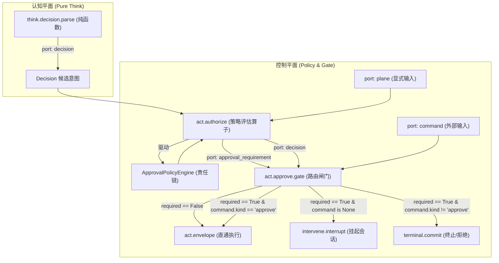

# 审批策略引擎与控制面图节点化架构设计文档

- **创建日期**: 2026-09-22
- **设计主题**: 审批判定谓词重构（解耦认知与许可、策略责任链模式与图节点化控制面）
- **关联缺陷/背景**: `decision_needs_approval` 跨层反向依赖、双平面击穿（C2/C8）、布尔盲区（C13）与策略硬编码
- **爆炸半径等级 (Autopilot Ladder)**: `DRAFT` (AP-05)

---

## 1. 业务背景与问题分析 (First Principles & Problem Statement)

### 1.1 现状与痛点

在 LCA 认知循环体系中，决策（Decision）代表认知层产生的“候选意图”，而许可（Verdict / Approval）代表控制面给予的“安全判定”。然而在此前的实现中，判定一个工具调用是否需要用户审批的逻辑存在以下 5 大核心架构缺陷：

1. **分层倒挂与双平面穿透（违反 C2 双平面 & C8 确定性）**：
   认知层图节点 `think.decision.parse` 在解析 LLM 响应时，为了计算 `needs_approval`，直接跨层 import 了基础设施层的 `classify.py`，而其内部调用了 `current_primary()` 窥探全局运行时的执行平面绑定。这导致认知层（本应是确定性的纯函数）依赖了运行时的全局可变环境。
2. **概念混淆：意图与许可未解耦（违反 AGENTS.md §2.2 六分类）**：
   `Decision` 实例在产出的瞬间就锁定了 `needs_approval: bool`，把属于控制面 Policy Engine 的审核职责强行杂糅在意图生成阶段。
3. **布尔盲区反模式（Boolean Blindness，违反 C13 信息血统）**：
   `Decision.needs_approval: bool` 丢失了关键领域信息（如：是因为用户提问、访问 SSH 凭据、还是破坏性指令？风险级别如何？）。下游 `approve_gate` 与 UI 卡片被迫重新解析工具参数。
4. **硬编码策略（违反开放封闭原则 OCP）**：
   审批规则写死在 `HITL_TOOL_NAMES` 与 `MACHINE_TOOL_PREFIX` 中，无法通过插件或策略配置动态扩展新的审批规则。
5. **图节点化不彻底（违反 C14 图与业务隔离）**：
   控制面节点 `act.authorize` 沦为简单的布尔值透传，未承担真正的策略评估职责。

---

## 2. 架构设计与核心模型 (Architecture & Core Models)

### 2.1 结构化审批契约模型

在 `contracts` 层引入强类型、不可变的结构化审批契约：

```python
# lca/contracts/models/core/execution/approval.py
from dataclasses import dataclass, field
from enum import Enum
from typing import Any, Mapping

class ApprovalReasonKind(str, Enum):
    """审批触发类别枚举 (Closed Set)"""
    NONE = "none"                             # 无需审批，直接放行
    HUMAN_INTERACTION = "human_interaction"   # HITL 交互提问 (如 askUserQuestion)
    SENSITIVE_RESOURCE = "sensitive_resource" # 访问宿主机敏感路径 (如 ~/.ssh/id_rsa)
    UNAUTHORIZED_PATH = "unauthorized_path"   # 超出 Grant 授权根目录
    ELEVATED_COMMAND = "elevated_command"     # 高危系统命令 (如 rm -rf, reboot, chmod)
    POLICY_RULE = "policy_rule"               # 插件/自定义扩展策略触发

class RiskLevel(str, Enum):
    """风险等级枚举"""
    LOW = "low"
    MEDIUM = "medium"
    HIGH = "high"
    CRITICAL = "critical"

@dataclass(frozen=True)
class ApprovalRequirement:
    """控制面产生的结构化许可契约 (不可变领域对象)"""
    required: bool = False
    reason_kind: ApprovalReasonKind = ApprovalReasonKind.NONE
    risk_level: RiskLevel = RiskLevel.LOW
    summary: str = ""                         # 用于前端/UI 审批卡片直接渲染的简述
    target_resource: str | None = None        # 受控路径或资源标识
    details: Mapping[str, Any] = field(default_factory=dict)
```

### 2.2 策略模式与责任链架构 (Strategy Pattern & Chain of Responsibility)

定义策略协议与责任链引擎：

```
                    ┌─────────────────────────────┐
                    │    ApprovalPolicyEngine     │
                    └──────────────┬──────────────┘
                                   │
    ┌──────────────────────────────┼──────────────────────────────┐
    ▼                              ▼                              ▼
1. HITLInteractionStrategy  2. MachineAccessStrategy       3. DefaultAllowStrategy
   - 关注 askUserQuestion      - 关注 local_* 机器工具        - 责任链兜底
   - 产出 HUMAN_INTERACTION    - 产出 SENSITIVE_RESOURCE /    - 产出 required=False
                                 UNAUTHORIZED_PATH / ELEVATED
```

1. **`ApprovalStrategy` 协议**：
   ```python
   class ApprovalStrategy(Protocol):
       @property
       def strategy_name(self) -> str: ...

       def evaluate(
           self,
           tool_calls: Sequence[ToolCall],
           plane: PlaneRef | None = None,
       ) -> ApprovalRequirement | None:
           """评估工具调用序列。若命中本策略则返回 ApprovalRequirement；若不匹配则返回 None 移交下一项。"""
           ...
   ```
2. **`ApprovalPolicyEngine` 引擎**：
   维护已排序的策略链，依序执行 `evaluate()`。首个返回非空 `ApprovalRequirement` 且 `required=True` 的策略获胜；若遍历完毕均无拦截，则由 `DefaultAllowStrategy` 产出 `required=False`。
3. **`ApprovalPolicyRegistry` 注册表**：
   支持运行时与插件动态注册新策略，满足开放封闭原则（OCP）。

### 2.3 声明式图拓扑流向 (Declarative Graph Flow)



---

## 3. 安全治理与边界保护 (Boundaries & Autopilot)

### 3.1 明确范围与负边界 (Owns vs Does NOT own, AP-01)

- **Owns (构建与修改范围)**:
  1. `lca/contracts/models/core/execution/approval.py`: `ApprovalRequirement`, `ApprovalReasonKind`, `RiskLevel`.
  2. `lca/contracts/protocols/execution/approval_strategy.py`: `ApprovalStrategy` 协议.
  3. `lca/infrastructure/runtime_plane/access/policy/approval_engine.py`: `ApprovalPolicyEngine`, `ApprovalPolicyRegistry`, 内置策略实现.
  4. `lca/nodes/think/decision/parse.py`: 剔除对 `infrastructure.runtime_plane` 及全局 `current_primary()` 的依赖.
  5. `lca/nodes/act/authorize/authorize.py`: 调用 `ApprovalPolicyEngine` 产出 `approval_requirement`.
  6. `lca/nodes/intervene/approve_gate.py`: 消费结构化 `ApprovalRequirement`.
  7. `lca/infrastructure/runtime_plane/access/classify.py`: `decision_needs_approval` 委托给引擎作为 COMPAT 垫片.
  8. 相关单元与集成回归测试.
- **Does NOT own (禁止触碰边界)**:
  1. 严禁修改 LLM 适配器与提示词模板 (`think.prompt`, `think.reason`).
  2. 严禁修改 WebServer 传输层与网关路由 (`lca-api/runs/*`).
  3. 严禁修改持久化事实与 Session Log (`Session.append`).
  4. 严禁修改前端代码与补丁目录 (`deploy/lobehub/patches/`).
  5. 严禁修改机器底层执行器实现 (`LocalExecPort`, `SafeExecutor`).

### 3.2 确定性测试不变量 (Invariants in Tests, AP-02)

| 编号 | 不变量断言描述 | 验证方式 |
|---|---|---|
| **INV-01** | `think.decision.parse` 绝不依赖 `infrastructure.runtime_plane` 或 `current_primary()` | AST 静态测试断言源码中无上述 import |
| **INV-02** | `askUserQuestion` 必产出 `ApprovalReasonKind.HUMAN_INTERACTION` 且 `risk_level=LOW` | 针对 `HITLInteractionStrategy` 专项断言 |
| **INV-03** | 机器敏感文件（如 `~/.ssh/id_rsa`）必产出 `ApprovalReasonKind.SENSITIVE_RESOURCE` 且 `risk_level=HIGH` | 针对 `MachineAccessStrategy` 专项断言 |
| **INV-04** | 常规安全工具必产出 `required=False` 且 `reason_kind=NONE` 并流向 `approve_skipped` | 端到端图流断言 |
| **INV-05** | 自定义策略可动态插入注册表，且责任链顺序可预期 | 注册表动态插入与责任链断言 |
| **INV-06** | 既有所有相关单测 100% 绿色兼容（零破坏回退） | `pytest tests/contracts/ tests/intervene/` 全绿 |
