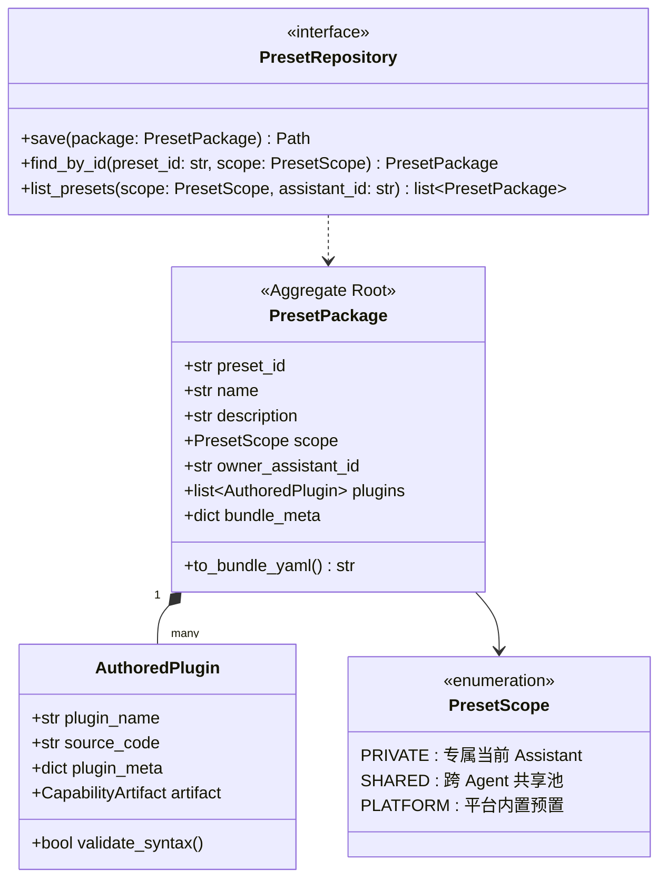
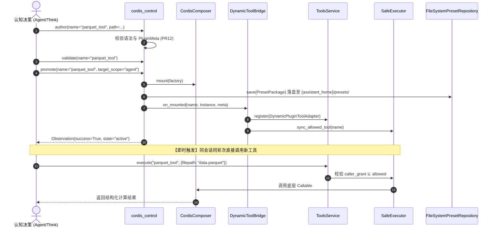

# 架构设计：Agent 私有自治域创造模式对齐与动态感知执行闭环

| 状态 | 规范版本 | 关联 ADR | 爆炸半径定级 | 责任人 |
|---|---|---|---|---|
| **Approved by User** | v1.0 | ADR-0067 / ADR-0074 / ADR-0242 / ADR-0250 | **`DRAFT`** (受控演化) | LCA 架构团队 |

---

## 1. 背景与第一性原理 (Context & First Principles)

### 1.1 现状与差距诊断
经过对 `~/deepseek-harness` (DSH) 与本项目的深度对比调研，发现以下核心痛点：
1. **测试套件历史断裂 (P0)**：PR-C 架构收束将 `composer_provider` 移至 `lca.plugins.composer.composition.cordis_composer` 后，`tests/scenario/cordis/` 下 4 个测试模块未更新 import 路径，导致执行期直接 `ModuleNotFoundError`。
2. **缺乏 Agent 专属自治域隔离**：现有 `PresetAuthoring` 默认落盘至全局 `~/.agent-presets/`，脱离了 LCA 的 `AssistantHome`（`~/.lca/assistants/<asst_id>/`）自治域体系，多 Agent 混部时无私有隔离。
3. **运行时感知与执行脱节**：`cordis_control` 的 `promote` 仅挂载到内部孤立的 `CordisComposer` Context，未连接外层 `ToolsService` 与 `SafeExecutor` 白名单，导致当轮无法调用新工具；跨轮或重启后也缺乏自动发现加载器，Agent 无法自我感知。
4. **缺乏共享与平台提升机制**：缺少将高质量预置从私有域提升至团队共享域（`shared/`）或导出至平台系统级预置（`bundles/presets/`）的标准化通道。

### 1.2 第一性原理界定
- **Plugin（插件）**：原子可执行单元（Callable）。具备不可变元数据 `PluginMeta`、显式权限要求与生命周期。
- **Preset（预置组合）**：能力的聚合编排单元（Aggregate）。包含多个插件、依赖拓扑声明（`bundle.yaml`）与可选的操作技能（`skills/`）。
- **Ownership（所有权闭环）**：Agent 在运行时创造的能力，首要归属于 Agent 自己的自治域（`assistant_home`）；经过验证的高价值能力可通过显式治理动作共享或平台提升。
- **Self-Perception（自感知）**：Agent 在认知层（Prompt/Perception）对自身拥有的工具与预置具备 100% 确定性感知，杜绝幻觉。

---

## 2. 显式职责边界声明 (Boundaries, AP-01 & AP-05)

### 2.1 Owns（本次设计负责范围）
1. **DDD 领域模型与仓储端口**：`PresetPackage` 聚合根、`AuthoredPlugin` 实体、`PresetScope` 枚举、`PresetRepository` 抽象端口与 `FileSystemPresetRepository` 适配器。
2. **Assistant 专属目录拓扑与发现器**：`AssistantPresetDiscovery` 发现门面，支持私有域与共享域的双层扫描。
3. **即时生效动态桥接器**：`DynamicToolBridge`，在 `promote` 发生时将插件封装为 `Tool` 注入 `ToolsService`，并同步给 `SafeExecutor`。
4. **跨 Agent 共享与平台提升服务**：`PresetPromotionService`，支持 `PRIVATE -> SHARED -> PLATFORM` 三级演进。
5. **易观测与全链路 Debug 支持**：完整的 Typed Journal Events 目录与结构化 `structlog`，原生兼容 `./scripts/lca-ops timeline` 与 `debug-run`。
6. **修复既有断裂测试**：修复 `tests/scenario/cordis/` 4 个测试模块的 import 断裂并恢复全绿。
7. **5 大丰富端到端闭环场景测试**：覆盖复杂数据工程、多工具复合编排、即时执行、跨 Agent 共享继承与动态版本升级回滚。

### 2.2 Does NOT own（AP-01 严格负边界）
1. **不修改全局 Journal/Session 单轨写入契约**：严格走 `Session.append` 单轨，禁止任何组件私开后门写事实。
2. **不修改底层 LocalExecPort 与沙箱实现**：不碰 `MachineLocalExecAdapter` 或本地沙箱核心。
3. **不修改前端 UI 代码**：不改动 `lobehub-ui/` 及其编译补丁。
4. **不放宽 C5 权限单调不放大铁律**：动态挂载工具的 capabilities 必须严格 ⊆ caller grant，违规必抛 `CapabilityGrantExceededError`。

### 2.3 爆炸半径定级 (AP-05)
定级为 **`DRAFT`**。必须通过完整的离线自动化单测矩阵核验后，方可装配至主运行时。

---

## 3. DDD 领域模型与存储分层拓扑

### 3.1 领域对象设计



### 3.2 三层阶梯存储拓扑

```text
~/.lca/
├── assistants/
│   └── <asst_id>/                     <── 【第一层：私有自治域 PRIVATE】
│       ├── memory/ (SOUL/USER/AGENTS)
│       ├── skills/
│       ├── plugins/                   <── 单文件轻量插件 (<name>.py)
│       └── presets/                   <── 复合预置组合
│           └── <preset_id>/
│               ├── bundle.yaml        <── 符合 LCA bundle 规范
│               └── plugins/
│                   └── <name>.py
├── shared/                            <── 【第二层：团队共享域 SHARED】
│   └── presets/
│       └── <preset_id>/
│           ├── metadata.json          <── 记录 author, digest, shared_at
│           ├── bundle.yaml
│           └── plugins/
└── (repo)/bundles/presets/            <── 【第三层：平台系统域 PLATFORM】
    └── <preset_id>.yaml               <── 标准 Profile 引用预置
```

---

## 4. 核心组件与设计模式 (Design Patterns & Execution Seam)

### 4.1 核心组件架构
1. **仓储模式 (Repository Pattern)**:
   - 端口：`lca/contracts/protocols/preset/repository.py` (`PresetRepositoryProtocol`)
   - 适配器：`lca/infrastructure/preset/fs_repository.py` (`FileSystemPresetRepository`)
2. **观察者模式 (Observer Pattern)**:
   - `lca/infrastructure/tools/dynamic/bridge.py` (`DynamicToolBridge`)
   - 监听 `cordis_control` 触发的 `on_mounted` 事件，完成从底层 Python Callable 到 `Tool` 适配器的封装并注册进 `ToolsService`。
3. **适配器模式 (Adapter Pattern)**:
   - `DynamicPluginToolAdapter`：将 `CordisComposer` 挂载的实例包装为符合 LCA `Tool` 协议的标准对象，自动映射参数校验与执行耗时。
4. **门面模式 (Facade Pattern)**:
   - `AssistantPresetDiscovery`：在 Agent 构建期（`runnable_assembly` 或 `solo`）统一探测 `{assistant_home}` 和 `shared/` 下的健康预置，隔离损坏预置，输出可用工具列表。
5. **策略模式 (Strategy Pattern)**:
   - `PresetPromotionService`：提供 `PrivateToSharedPromotionStrategy` 与 `PlatformExportStrategy`，实现资产的跨域提升。

### 4.2 运行时交互时序



---

## 5. 易观测性与调试支持 (Observability & Debugging)

为了让开发者与运维人员在遇到问题时能“一目了然”，配备完整的事件字典与结构化日志：

### 5.1 Typed Journal Events 目录
| 事件类名 | 产生时机 | 核心载荷 (Payload) | 诊断用途 |
|---|---|---|---|
| `PluginAuthored` | author 阶段 | `plugin_name`, `source_path`, `digest`, `actor_role` | 追溯插件源码生成起点与大小 |
| `PluginValidated` | validate 阶段 | `plugin_name`, `checks_passed`, `meta_snapshot` | 确认插件静态检查通过 |
| `PluginMounted` | promote 激活阶段 | `plugin_name`, `capabilities`, `context_key`, `scope` | 证明插件已挂入运行时与授权范围 |
| `DynamicToolBridged` | 桥接生效阶段 | `tool_name`, `registered_in_tool_service`, `safe_executor_synced` | **关键排错点**：证明工具已注入执行平面 |
| `PresetPublished` | 写入落盘阶段 | `preset_id`, `preset_root`, `bundle_path`, `scope` | 证明文件真实落地私有/共享目录 |
| `PresetDiscovered` | 会话启动扫描期 | `assistant_id`, `preset_id`, `status` (ACTIVE/BROKEN), `tools` | 证明会话启动期成功感知到资产 |
| `PresetShared` | 提升共享阶段 | `preset_id`, `source_asst`, `shared_path`, `checksum` | 追溯跨 Agent 共享流向 |
| `PluginMountRejected`| 校验/越权拦截 | `plugin_name`, `reason_code`, `exceeded_grants` | 快速定位 C5 越权或元数据缺失原因 |

### 5.2 命令行与日志排查接口
- **Timeline 视图**：
  ```bash
  ./scripts/lca-ops timeline <run_id>
  ```
  在事件流中可直接看到 `PluginAuthored -> PluginValidated -> PluginMounted -> DynamicToolBridged -> ToolExecuted` 全因果链。
- **诊断日志过滤**：
  所有日志使用结构化 `structlog`，带有统一命名空间 `lca.creator`：
  - `[lca.creator.author]` `path=...` `size_bytes=...`
  - `[lca.creator.bridge]` `tool_registered=true` `allowed_tools_synced=true`
  - `[lca.creator.discovery]` `preset_id=...` `status=healthy`

---

## 6. 五大丰富端到端闭环场景规范 (Rich E2E Scenarios)

为体现创造模式的强大功能，设计以下 5 个全流程场景：

### 场景一：数据工程自治闭环（Complex Analytics Preset）
- **业务设定**：Agent 接收复杂任务：“分析 10000 行用户点击流行为日志并计算转化漏斗”。
- **闭环过程**：
  1. Agent 发现缺少针对漏斗计算的专用工具；
  2. Agent 自主编写 `funnel_analytics.py`（使用 Python 内置集合与流式迭代）；
  3. 通过 `cordis_control` 经 `author -> validate -> promote`，落盘至 `{assistant_home}/presets/clickstream_kit/`；
  4. 验证私有目录物理落盘、`bundle.yaml` 格式完备、Journal 产生全套不可变事件。

### 场景二：同会话即时生效与无感调用（Zero-Restart Same-Session Trigger）
- **业务设定**：接续场景一，**不重启进程、不新建 Session**。
- **闭环过程**：
  1. Agent 在紧接着的下一个思考步中，直接生成 Decision：`use_tool("funnel_analytics", {"window": 3600})`；
  2. `ToolsService` 准确识别该工具并调度至底层实例；
  3. `SafeExecutor` 白名单动态放行，执行并返回漏斗转化率统计（如 `{"stage1_to_2": 0.45, "stage2_to_3": 0.12}`）；
  4. 验证全过程 0 报错、0 重启、0 拦截。

### 场景三：跨会话自感知与免控制调用（Cross-Session Perception & Replay）
- **业务设定**：重启服务或为同一 Assistant 开启全新对话。
- **闭环过程**：
  1. 销毁前序内存会话，以原 `assistant_home` 初始化新会话；
  2. `AssistantPresetDiscovery` 自动扫描私有预置，加载 `clickstream_kit`；
  3. Prompt 描述段自动注入该 Assistant 拥有的定制工具清单；
  4. 用户发送查询请求，Agent **零次调用 `cordis_control`**，直接调度 `funnel_analytics` 完成分析。

### 场景四：跨 Agent 共享与专家能力继承（Cross-Agent Sharing & Inheritance）
- **业务设定**：架构演化助手（Agent A）创作了高质量的 `arch_rules_checker` 工具，需要赋能给代码审查助手（Agent B）。
- **闭环过程**：
  1. Agent A 调用 `PresetPromotionService.promote_to_shared("arch_rules_kit")` 发布至 `~/.lca/shared/presets/`；
  2. 初始化全新的 Agent B（拥有完全独立的 `assistant_home_B`）；
  3. Agent B 的发现器扫描到共享库中的 `arch_rules_kit` 并以只读方式成功加载；
  4. Agent B 在自己的会话中成功执行该规则检查工具，完成专家资产的无缝复用。

### 场景五：动态热升级与故障自愈回滚（Hot Upgrade & Safe Rollback）
- **业务设定**：Agent 发现自身工具存在边界 bug 或需扩展功能。
- **闭环过程**：
  1. Agent 编写包含边界保护的 v2 源码，执行 `author` 与 `validate`；
  2. 执行 `promote(name="funnel_analytics", target_scope="agent")` 完成平滑热替换；
  3. 模拟当 v2 存在异常时，执行 `promote(name="funnel_analytics", rollback=True)`；
  4. 验证工具安全退休（Unmounted），系统恢复至稳定基线，Journal 记录 `PluginUnmounted`。

---

## 7. 架构不变量断言矩阵 (Invariants in Tests, AP-02)

| 不变量编号 | 核心要求 | 自动化测试断言手段 |
|---|---|---|
| **INV-C3** | 事实可追溯 | 断言 MemoryJournal 中所有 Creator 动作（author/validate/mount/bridge/unmount/publish/share）均产生 Typed JournalEvent，单调序列号无缝断 |
| **INV-C4** | Reducer 单写 | 断言创造与挂载过程 100% 不侵入或旁路修改 `AgentState`，不变量守护脚本通过 |
| **INV-C5** | 权限单调不放大 | 反例测试：动态插件尝试请求 `bash.root` 或超出创建者 grant 的能力，断言 `promote` 100% 抛出 `CapabilityGrantExceededError` 并 fail-close |
| **INV-RESILIENCE** | 坏预置隔离容错 | 注入包含语法错误的损坏插件文件，断言 `Discovery` 记录 `BROKEN` 并跳过，其余健康插件依然 100% 正常装载 |
| **INV-AP01** | 负边界严防 | 断言任何文件 I/O 严格被锁定在 `{assistant_home}` 或 `shared/` 目标目录内，严禁路径穿越（`..` 探测）或向公共源码库乱写 |

---

## 8. 实施路径 (Next Steps)

1. **Task 1: 修复既有断裂测试** —— 修正 `tests/scenario/cordis/` 4 个测试的 import 路径，确保基线全通。
2. **Task 2: 领域契约与仓储适配器** —— 实现 `PresetPackage`, `PresetScope`, `PresetRepository` 与 `FileSystemPresetRepository`。
3. **Task 3: 动态工具桥接器 (Execution Seam)** —— 实现 `DynamicToolBridge`，打通 `on_mounted -> ToolsService -> SafeExecutor`。
4. **Task 4: Assistant 自治发现与装载器** —— 实现 `AssistantPresetDiscovery`，集成至 `runnable_assembly`。
5. **Task 5: 跨 Agent 共享与平台提升服务** —— 实现 `PresetPromotionService`。
6. **Task 6: 五大端到端闭环场景测试与回归门禁** —— 落地 `tests/scenario/cordis/test_cordis_creator_assistant_closed_loop.py`，全量验证。
