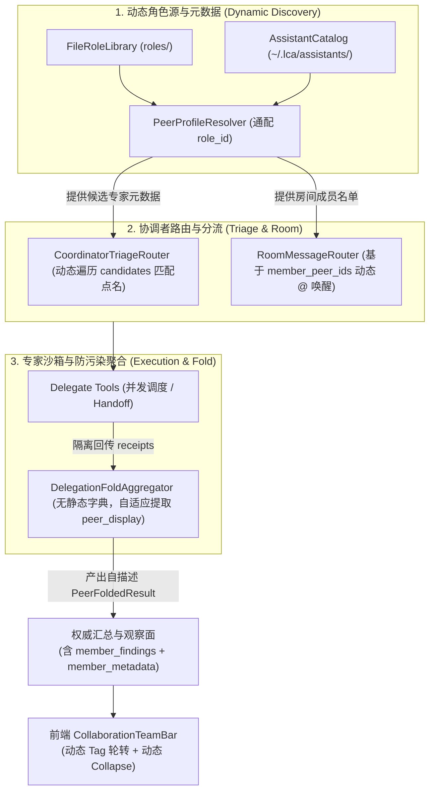

# 动态角色发现与团队装配架构设计方案（Dynamic Role Discovery & Team Decoupling Design）

## 状态
**Approved (已获用户审批) — 2026-09-22**

## 1. 第一性原理与问题背景

### 1.1 问题现场
在多 Agent 协同与群聊体系（ADR-0250）初步落地过程中，提交 `61fc9bab9a160c8505283ae42327bc641400592e` 及周边模块引入了严重的硬编码坏味道。系统将示范用的“架构三角”（观澜·arch_guanlan、衡岳·arch_hengyue、镜川·arch_jingchuan）静态写死在多个业务处理节点中：
1. **聚合器（`lca/application/collaboration/fold.py`）**：定义了静态字典 `_NAME_MAP = {"architecture/guanlan": "观澜", ...}`，且无论参与协作的是谁，共识结论一律硬编码输出“架构三角已形成完全共识：观澜（契约边界）、衡岳...”。
2. **分流路由器（`lca/application/collaboration/triage.py`）**：静态定义常量 `_ARCH_TRIAD`，并使用 `if "观澜" in objective:` 梯子强行点名，写死 `sender_id = "coordinator_sam"`。
3. **角色装配器（`lca/application/collaboration/peer_provider.py`）**：静态绑定架构三角角色与能力，强制增加 `arch_` 前缀，物化时硬编码路径 `architecture/{slug}`。
4. **房间消息路由（`lca/domain/collaboration/room.py`）**：静态定义 `_PEER_NICKNAME_MAP`，导致房间内只有观澜、衡岳、镜川可以被 `@` 唤醒。
5. **协同委派工具（`lca/infrastructure/tools/collaboration/delegate_tool.py`）**：工具描述与回退模拟字典静态绑定架构三角。
6. **前端协同 UI（`deploy/lobehub/patches/ui/CollaborationTeamBar.tsx`）**：通过静态字符串判断协作，写死 3 个固定的 Tag 与 Collapse 面板。

### 1.2 本质需求
在生产环境中，**角色随时会换、随时从配置动态读取、或者是用户在运行时全新创建的**。
系统必须实现**“仓储与目录动态发现（Dynamic Discovery）+ 数据驱动 UI（Data-Driven UI）”**，消除全链路所有静态死字典与死模板，使协同架构具备完全通用性与优雅的面向对象扩展能力。

---

## 2. 自治等级与严格边界（AP-01 & AP-05）

### 2.1 自治等级（Autopilot Ladder）
- **等级**：`DRAFT`。
- **说明**：涉及协同应用层、领域层、工具层契约以及 LobeHub 前端观察面补丁的联动重构，必须通过自动化测试套件与补丁验证脚本全量守卫。

### 2.2 严格边界划分
- **`Owns`（负责范围）**：
  1. 重构 `lca/application/collaboration/fold.py`：移除 `_NAME_MAP`，支持动态感知 `peer_metadata`，实现通用共识汇总词合成；
  2. 重构 `lca/application/collaboration/triage.py`：移除 `_ARCH_TRIAD` 与静态 `if` 分支，支持基于注入候选集或房间成员名单的动态匹配；
  3. 重构 `lca/application/collaboration/peer_provider.py`：移除 `_ARCH_TRIAD_ROLES` 与 `arch_` 强制前缀，通用解析任意 `role_id` 并动态物化持久工作区；
  4. 重构 `lca/domain/collaboration/room.py`：移除 `_PEER_NICKNAME_MAP`，基于 `RoomSpec.member_peer_ids` 与动态名称表实现通用 `@` 唤醒；
  5. 重构 `lca/infrastructure/tools/collaboration/delegate_tool.py`：泛化工具声明与回退数据；
  6. 重构 `deploy/lobehub/patches/ui/CollaborationTeamBar.tsx`：实现纯数据驱动的动态 Tag 列表与 AntD Collapse 折叠卡片；
  7. 补齐与更新确定性自动化测试套件。
- **`Does NOT own`（严格禁动红线）**：
  - 严禁篡改认知核心六相循环（Perceive/Think/Act/Reflect/Remember/Stop，C1/C14）；
  - 严禁触碰 `vendor/` 或 `lobehub-ui/` 原始目录，前端修改仅限于 `deploy/lobehub/patches/` 声明式补丁；
  - 严禁改动纯数据内容包 `roles/` 下的角色卡 Markdown 文件；
  - 严禁引入任何跨层反向依赖（Contracts 绝不反向依赖实现层，C2.1）。

---

## 3. 架构拓扑与数据流设计



---

## 4. 核心契约与组件重构方案

### 4.1 契约增强（`lca/contracts/models/collaboration/peer.py`）
`PeerFoldedResult` 增加自描述元数据字段：
```python
class PeerFoldedResult(BaseModel):
    model_config = ConfigDict(frozen=True, extra="forbid")

    task_id: str
    member_findings: dict[str, str]
    synthesized_verdict: str
    consensus_status: Literal["unanimous", "concerns_noted", "split"]
    member_metadata: dict[str, dict[str, str]] = {}  # peer_id -> {"name": ..., "role": ..., "emoji": ...}
```

### 4.2 聚合器纯净化（`lca/application/collaboration/fold.py`）
- 彻底移除 `_NAME_MAP`。
- `fold` 方法接收可选的 `peer_metadata: Mapping[str, Mapping[str, str]] | None`。
- 专家名称提取：优先取 `peer_metadata[peer_id]["name"]`；若无则通过安全格式化（如去除路径、转为可读形式）作为 `peer_display`。
- 动态汇报收敛词合成：
  - **Unanimous**：`f"【协同汇报】全员共识已形成：{'、'.join(ready_peers)} 全数通过核验，方案符合领域规范与质量契约。"`
  - **Concerns Noted**：`f"【协同汇报 - 部分降级】{'，'.join(notes)}，基于就绪专家（{'、'.join(ready_peers)}）的结论综合收敛。"`

### 4.3 协调者分流解耦（`lca/application/collaboration/triage.py`）
- 彻底移除 `_ARCH_TRIAD` 和 `if "观澜" in objective:` 硬编码。
- 构造函数注入候选池 `candidates: tuple[PeerProfile, ...] | RoleLibrary | None` 与默认团队 `default_team_ids: tuple[str, ...] | None`。
- 点名识别：遍历可用候选人，若 `profile.name` 或 `profile.peer_id` 出现在目标文本中，动态生成 `HandoffEnvelope`，reasoning 动态注入角色信息。
- 组队识别：若包含复合协同关键词，自动选派当前配置的默认团队或匹配的角色清单。

### 4.4 角色装配与物化泛化（`lca/application/collaboration/peer_provider.py`）
- 移除 `_ARCH_TRIAD_ROLES` 与 `_DEFAULT_ROLE_CAPABILITIES`。
- `resolve(role_id: str)`：
  - `peer_id` 由 `role_id.replace('/', '_')` 规范生成，不再强制前缀 `arch_`；
  - `capabilities` 从卡片 frontmatter（`skills`/`tags`）自适应解析；
- 新增通用组队解析方法：`resolve_team(role_ids: tuple[str, ...]) -> tuple[PeerProfile, ...]`；
- `materialize_peer_assistant` 纯基于传入的 `PeerProfile` 与 `RoleCard` 生成工作空间，移除 `f"architecture/{slug}"` 查找。

### 4.5 房间路由策略泛化（`lca/domain/collaboration/room.py`）
- 移除 `_PEER_NICKNAME_MAP`。
- `RoomMessageRouter` 接收 `room: RoomSpec` 与可选的 `member_names: Mapping[str, str]`。
- 动态检查 `room.member_peer_ids` 中各成员的 `@<peer_id>` 与 `@<name>`。新创建的房间与角色自动生效。

### 4.6 前端动态 UI 补丁（`deploy/lobehub/patches/ui/CollaborationTeamBar.tsx`）
- 剔除对具体人名的字符包含判断，基于 `member_findings` 存在或通用标识激活组件。
- 动态渲染 Tag：遍历 `Object.keys(findings)`，结合 `metadata` 动态显示名称与 emoji，背景色在调色板中轮转取模。
- 动态渲染 Collapse：遍历 `Object.entries(findings)` 动态输出专家核验卡片，彻底消灭写死 3 个卡片的限制。

---

## 5. 确定性测试矩阵与不变量守护（AP-02）

| 测试文件 | 覆盖场景 | 不变量断言 |
|---|---|---|
| `tests/contracts/test_peer_collaboration_contracts.py` | 验证扩展字段 `member_metadata` | C13 强类型不可变契约，extra="forbid" |
| `tests/collaboration/test_delegation_fold.py` | 传入任意自定义角色数据（如安全/法律/设计），测试聚合输出 | 输出零“观澜/衡岳”痕迹，自适应合成汇报，超时降级正常 |
| `tests/collaboration/test_coordinator_triage.py` | 注入动态候选角色，测试点名匹配与组队分流 | 动态分流至目标角色，信封参数完整 |
| `tests/collaboration/test_peer_provider.py` | 解析工程、管理等非架构角色卡并物化 | 生成规范 peer_id，物化目录与元数据完整 |
| `tests/collaboration/test_room_repository_and_routing.py` | 构造含动态成员的房间并测试消息路由 | `@动态角色` 精准路由，无静态字典依赖 |
| `tests/collaboration/test_group_chat_e2e.py` | 全链路多 Agent 协同端到端测试 | 动态角色端到端协同正常流转 |
| `check_patch_integrity.py` & `patch_lobehub.py verify` | 前端补丁完整性与一致性检验 | 84/84 文件 byte-identical 严格一致 |
