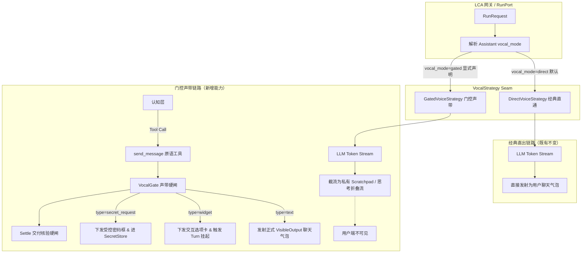

# 门控声带运行时与投递契约设计规范 (Gated Vocal Runtime & Delivery Contract Design)

- **日期**：2026-09-22
- **状态**：Approved (已评审通过)
- **关联架构**：[ADR-0248: 协调型桌面 Agent 运行时 — 证据级解剖（可模范实现）](file:///home/lichao/layered-cognitive-agent/docs/adr/0248-grok-bot-coordinator-runtime-evidence.md) · [ADR-0246: 用户机副作用平面](file:///home/lichao/layered-cognitive-agent/docs/adr/0246-companion-local-exec-plane.md)
- **Autopilot 阶梯**：`DRAFT` (AP-05，需完整单测断言并经审批合入)

---

## 1. 背景与核心问题（第一性原理）

普通对话式 Agent 框架（如常见 LangChain / 经典补全循环）将“大语言模型生成的每一个文本 Token”直接投影为对外用户聊天气泡。这导致两大致命工程缺陷：
1. **内省泄露**：模型的推理思路、中间思维链与草稿全部直接刷屏，破坏了桌面员工的严肃专业体验；
2. **假死与交付失约（Ack ≠ Delivery）**：当遇到耗时任务（如分析大仓、多步排查）时，模型若先说一句“正在排查”后静默执行工具，容易因中间异常或模型未最终交待结论而导致任务在 Settle 阶段静默结束，用户无从得知最终结果。

根据 [ADR-0248](file:///home/lichao/layered-cognitive-agent/docs/adr/0248-grok-bot-coordinator-runtime-evidence.md) 的 E1/E2 证据级解剖：
> **不变式：模型的普通内省文本对用户绝对不可见；用户唯一能看见的只有显式投递（`SendMessage`）。**
> 员工的语音输出必须经过声带硬闸（`VocalGate`），并且“承接不等于交付”、“提问选项卡强制挂起轮次”。

同时，**必须严格遵守零破坏现有功能原则**：该门控声带体系必须通过策略模式隔离，默认平台与现有 Assistant 100% 维持经典直通输出（Direct Mode），互不干扰。

---

## 2. 职责边界与负向清单 (AP-01 & AP-05)

### 2.1 Owns（本次构建）
1. **契约层** (`lca/contracts/models/vocal/`)：
   - `VocalMode`：模式枚举 (`direct` / `gated`)；
   - `VocalMessageType`：投递类型 (`text` / `attachment` / `widget` / `secret_request`)；
   - `WidgetOption`：结构化选项卡载荷；
   - `SendMessagePayload`：声带投递强类型请求（不可变、`extra="forbid"`）；
   - `DeliveryReceipt`：执行回执模型。
2. **协议层** (`lca/contracts/protocols/vocal/`)：
   - `VocalGateProtocol` 与 `VocalStrategy` 抽象契约。
3. **基础设施层** (`lca/infrastructure/vocal/`)：
   - `VocalGate`：声带硬闸核心，具备文本内省拦截、Reply-First 状态跟踪与 Settle 硬结算检查；
   - `DirectVoiceStrategy`：经典模式适配器（零延迟直出，保护既有行为）；
   - `GatedVoiceStrategy`：门控声带策略适配器；
   - `SendMessageTool`：原生声带工具，供大模型在 Think/Act 阶段调用以对外发声。
4. **应用编排层** (`lca/application/vocal/`)：
   - `VocalStrategyFactory`：根据 Assistant 配置 / Profile 动态路由声带策略。
5. **测试套件** (`tests/contracts/vocal/`, `tests/infrastructure/vocal/`, `tests/scenario/vocal/`)：
   - 包含 6 大核心架构不变量的确定性自动化测试。

### 2.2 Does NOT own（严格负向保护清单）
- **严禁**修改或破坏现有 `lca/contracts/transport/agent_stream_event.py` 中的任何现有事件类定义；
- **严禁**改动经典模式（`vocal_mode="direct"`）下直通气泡的发射时序与逻辑；
- **严禁**入侵 `ADR-0246` 伴侣客户端（`lca-companion`）及底层 WebSocket 传输协议；
- **严禁**在全局引入未经性能基准验证的重量级第三方依赖；
- **严禁**在类名、模块名、配置项中出现外部专有商业名词（如 Grok 等），统一使用第一方规范领域命名 (`gated`, `vocal_mode`, `VocalGate`)。

---

## 3. 架构拓扑与策略模式设计



---

## 4. 领域契约与状态机模型

### 4.1 数据模型（`lca/contracts/models/vocal/`）

```python
from enum import StrEnum
from typing import Literal
from pydantic import BaseModel, ConfigDict, Field, model_validator


class VocalMode(StrEnum):
    DIRECT = "direct"
    GATED = "gated"


class VocalMessageType(StrEnum):
    TEXT = "text"
    ATTACHMENT = "attachment"
    WIDGET = "widget"
    SECRET_REQUEST = "secret_request"


class WidgetOption(BaseModel):
    model_config = ConfigDict(frozen=True, extra="forbid")

    id: str = Field(..., description="选项唯一标识")
    label: str = Field(..., description="选项按钮展示文字")
    description: str | None = Field(default=None, description="选项详细说明")
    variant: Literal["default", "primary", "danger"] = Field(
        default="default", description="按钮视觉样式"
    )


class SendMessagePayload(BaseModel):
    model_config = ConfigDict(frozen=True, extra="forbid")

    type: VocalMessageType = Field(default=VocalMessageType.TEXT, description="投递类型")
    content: str | None = Field(default=None, description="正式文本气泡内容")
    options: list[WidgetOption] | None = Field(
        default=None, description="交互选项列表（1-6项，widget必填）"
    )
    secret_key: str | None = Field(
        default=None, description="凭证标识键名（secret_request必填）"
    )
    reply_to_id: str | None = Field(default=None, description="关联的上下文消息ID")

    @model_validator(mode="after")
    def validate_payload_semantics(self) -> "SendMessagePayload":
        if self.type == VocalMessageType.TEXT and not self.content:
            raise ValueError("type='text' 时 content 字段不能为空")
        if self.type == VocalMessageType.WIDGET:
            if not self.options or len(self.options) < 1 or len(self.options) > 6:
                raise ValueError("type='widget' 时 options 必须包含 1 到 6 个选项")
        if self.type == VocalMessageType.SECRET_REQUEST and not self.secret_key:
            raise ValueError("type='secret_request' 时 secret_key 字段不能为空")
        return self


class DeliveryReceipt(BaseModel):
    model_config = ConfigDict(frozen=True, extra="forbid")

    message_id: str
    delivered_at_ms: int
    vocal_type: VocalMessageType
    is_terminal_for_turn: bool = False
    requires_user_action: bool = False
```

### 4.2 轮次声带状态机（`TurnVocalState`）

在单个执行轮次中，`TurnVocalState` 记录以下不可变状态转移：
1. **`has_acked: bool`**：是否已向用户下发首条承接确认气泡（Reply-first）。
2. **`has_delivered: bool`**：是否已下发实质性交付结论。
3. **`awaiting_widget: bool`**：是否已处于选项卡等待状态。
4. **硬阻断铁律**：
   - 当 `awaiting_widget == True` 时，同轮次任何再次调用 `send_message` 的操作均被物理阻断，抛出 `VocalGateAlreadyBlockedError`；
   - Settle 阶段若 `has_delivered == False` 且当前唤醒源非可沉默例程，拒绝收敛并要求补交交付物。

---

## 5. 执行时序与三大硬闸机制

### 5.1 Reply-First 承接门禁
- **用户发起的对话（Wake = `USER_INPUT`）**：用户在屏幕前等待。
- **机制**：在执行重型副作用（如 Shell / API / 检索）前，若 `has_acked == False`，Prompt 注入与中间件协同确保优先发出一条简明 Ack 气泡（如“正在排查日志...”），避免由于推理排队或长工具执行造成前端“无响应/卡死”感。

### 5.2 Widget 选项卡停等机制
- 模型调用 `send_message(type="widget", options=[...])`；
- `VocalGate` 投递卡片事件，将 `awaiting_widget` 标记为 `True`，返回 `is_terminal_for_turn = True`；
- 执行引擎立即收敛并保存状态，释放 LLM 推理资源，**挂起等待前端用户点击回填**；
- 同轮后续发言被锁死，防止逻辑混乱。

### 5.3 Settle 交付硬检查（Ack ≠ Delivery）
- 在执行流收敛（`apply_terminal_outcome`）前，`VocalGate` 检查交付指标：
  - 若当前轮次由用户发起，但 `has_delivered == False`（只有 Ack 或完全没调用 `send_message`）；
  - **硬闸拦截**：阻断任务标记为完成，强制注入纠偏线索：“你已完成操作但尚未向用户交付最终结论，请调用 send_message 交付结果”。

---

## 6. 确定性测试架构与不变量断言矩阵 (AP-02)

| 不变量 ID | 不变量描述 | 自动化测试断言逻辑 |
|---|---|---|
| **INV-VOCAL-01** | **零内省泄露** | Gated 模式下连续输入普通文本，断言 `gate.get_visible_outputs()` 长度为 0，文本仅能被内部 Scratchpad 捕获 |
| **INV-VOCAL-02** | **经典模式零退化** | Direct 模式下，模型文本直接触发原有流式事件，400+ 现有测试 100% 保持通过 |
| **INV-VOCAL-03** | **Widget 原子停等** | Widget 投递后返回 `is_terminal_for_turn=True`；随后的再次调用必断言抛出 `VocalGateAlreadyBlockedError` |
| **INV-VOCAL-04** | **Ack ≠ Delivery 闭环** | 仅发出 Ack 时 Settle 校验必抛出 `UndeliveredTurnError`；补充 Delivery 气泡后校验通过 |
| **INV-VOCAL-05** | **凭证零泄露** | `secret_request` 填入密码后，断言会话 Context 与 Transcript 中绝对无明文字符串 |
| **INV-VOCAL-06** | **例程合规沉默** | 唤醒源为 `routine` 时，即使 `delivered_count == 0`，Settle 依然放行（不骚扰用户） |

---

## 7. 演进阶梯与后续规划

1. **Phase 1（当前）**：完成 `VocalMode`、`VocalGate`、`SendMessageTool` 与 Settle 闭环；
2. **Phase 2（后续）**：实现 Wake 唤醒多门控矩阵与可沉默 Routine 调度器；
3. **Phase 3（后续）**：实现 Subagent 物理禁声与父进程统一交付（Revival 唤醒机制）。
