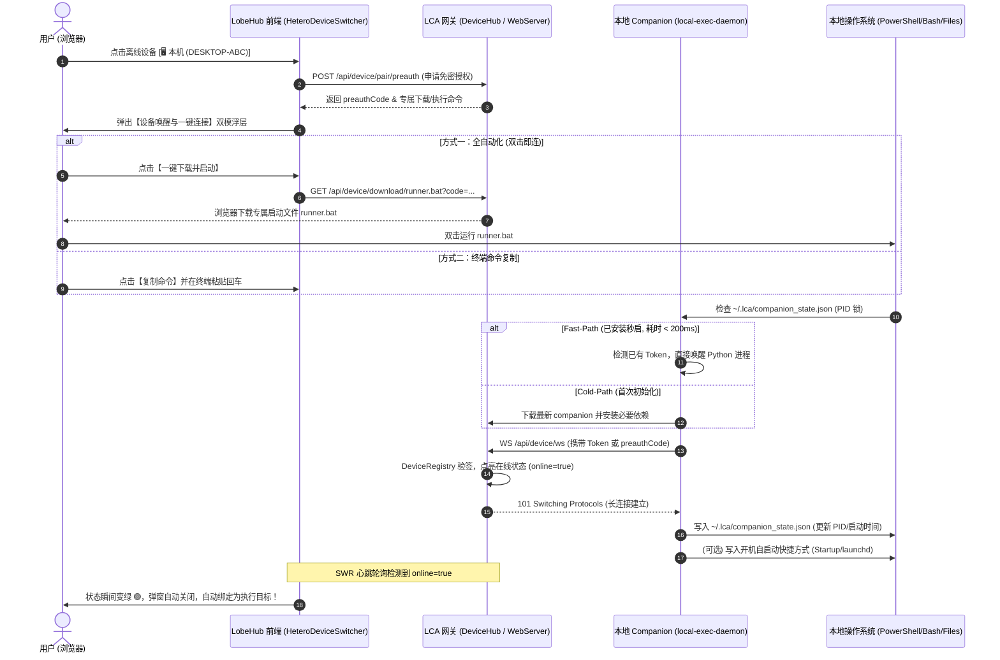

# 架构设计文档：前端执行环境“本机”状态感知、秒启自愈与双模全自动连接设计

> **文档版本**: 1.0.0
> **创建日期**: 2026-09-22
> **状态**: 已评审通过 (Approved)
> **Autopilot 等级**: `DRAFT` (AP-05, 用户界面与端点增强，需人机对齐与门禁确认)
> **借鉴参考**: Grok Bot (xAI / Cursor 体系) Local Exec Daemon 架构模型

---

## 1. 业务背景与第一性原理

### 1.1 现状与用户痛点
1. **执行环境列表缺失常驻入口**：在 Web 端，原生 LobeHub 将本机限制在桌面环境（`isDesktop`），普通 Web 端未将“本机”作为平级固定选项常驻展示，用户难以感知如何将本地计算机接入 AI 工作流。
2. **缺乏状态感知与死态禁用**：现有前端将离线设备直接写死为 `disabled={!d.online}`，整行置灰不可点击，无法直观区分多台机器的在线/离线状态，更无法在离线时直接唤醒。
3. **连接流程割裂与配对码困扰**：界面底部堆叠终端命令与“输入配对码”输入框，让用户产生严重认知困惑（“配对码从哪来？连自己的电脑为什么还要输码？”）。
4. **生命周期脆弱**：电脑重启后缺乏自动重连或秒启机制，用户担心重启后需要重新下载安装。

### 1.2 第一性原理剖析
* **出站长连接与身份绑定**：本地计算机普遍位于家庭/企业 NAT 路由器或防火墙后，外部网关无法主动连入。必须由本地 Daemon 主动发起 WebSocket 出站长连接。配对凭证的核心意义是在出站连接接入时，向服务端认证“这台机器属于哪个用户”，并换取受保护的持久化凭证 `machineToken`。
* **隐形安全（Invisible Security）**：安全机制在底层，交互体验在免输。临时预授权凭证（`preauth_code`）应直接固化在动态下发的免装脚本或命令中，用户全程零输入、零敲键盘。
* **克制职责边界**：对标 Grok Bot，本地伴侣程序（`CompanionClient`）坚持纯粹做本地结构化执行（Shell 运行、文件读写），绝不把浏览器自动化（Playwright/CDP）混装在基础 Daemon 中，保持高可用与轻量级。

---

## 2. 架构设计与核心组件

### 2.1 整体数据流与架构拓扑



---

### 2.2 本地状态与生命周期管理（借鉴 Grok Bot）

本地持久化统一收束在真实用户主目录 `~/.lca/`：
```text
~/.lca/
├── bin/
│   └── lca-companion.py           # 本地执行守护程序核心脚本
├── companion_token.json           # 持久化身份凭据 (machine_token, device_id, server_url)
├── companion_state.json           # 运行状态与 PID 锁 (pid, version, started_at, status)
└── logs/
    └── companion.log              # 本地运行日志与网关通信错误追踪
```

#### 两级启动状态机（Fast-Path vs Cold-Path）
1. **PID 存活检查与去重**：
   启动脚本运行时，优先读取 `~/.lca/companion_state.json` 中的 `pid`。若检测到该进程仍在本地运行，输出 `[OK] Companion (PID xxx) is already active` 并直接秒级退出，**严禁多进程重复拉起抢占同一个 WebSocket**。
2. **Fast-Path（秒启通道）**：
   若无活跃进程，但 `companion_token.json` 和 Python 解释器已就绪，跳过所有网络探查和依赖下载，直接后台拉起 `lca-companion.py run`，总耗时 < 0.2 秒。
3. **开机自启常驻**：
   * **Windows**：初次安装成功后，在 `$env:APPDATA\Microsoft\Windows\Start Menu\Programs\Startup` 写入静默自启脚本 `lca-companion-startup.vbs`；
   * **macOS / Linux**：写入用户级 `launchd` plist 或 `systemd` user service；
   * **效果**：电脑重启登录后，伴侣程序自动静默唤醒，用户打开网页即是 🟢 在线。

---

### 2.3 前端组件与视觉设计

#### 1. 设备列表视觉规范
* **多设备命名清晰**：每台设备展示为：`[平台图标] 本机 (DESKTOP-M0EATGD)` 或 `[平台图标] MacBook Pro (lichao-mbp)`。
* **高颜值状态小标**：复用 `@lobehub/ui` 原生规范：
  * 🟢 **在线**：`dotOnline`（6px 绿色发光点，带 2px 扩散光晕 `colorSuccessBg`）+ 翠绿色“在线”文本；
  * ⚪ **离线**：`dotOffline`（6px 沉静灰度点）+ 灰色“离线 (点击启动)”。
* **解禁离线行**：移除 `disabled={!d.online}`，允许点击离线行触发唤醒弹窗。

#### 2. 双模引导浮层
* **全自动化操作**：
  * 大号绿色主操作按钮：`[ ⬇️ 一键下载并启动 (Windows .bat / macOS .command) ]`；
  * 浏览器自动完成专属免密启动文件下载，提示用户“双击即可极速连接”。
* **极客终端命令**：
  * 提供包含单次 `preauth_code` 的一键命令预览区与【复制】按钮。
* **彻底移除配对码输入框**：
  * 主视图彻底剥离原有的“输入配对码”输入框与“配对”按钮。
* **上线自动关闭与绑定**：
  * 浮层内实时监听设备上线，一旦在线状态变为 `true`，显示“已成功连接”并在 1 秒后自动渐隐关闭，同时选中该设备为当前执行目标。

---

## 3. 边界划分（Mandatory Boundaries, AP-01）

### 3.1 Owns（本方案拥有并实现）
1. **前端补丁升级（`deploy/lobehub/patches/ui/execution_target.py`）**：
   * 移除 `HeteroDeviceSwitcher.tsx` 中对离线设备行的 `disabled` 属性；
   * 完善设备状态渲染，采用 `dotOnline` 与 `dotOffline`；
   * 彻底剔除主视图配对码输入框；
   * 实现【设备唤醒与一键连接】双模浮层与上线自动绑定逻辑。
2. **服务端路由与动态脚本（`lca/plugins/transport/device_hub/routes/routes.py`）**：
   * 在 `install.ps1` 和 `install.sh` 脚本中增加 PID 检查与 Fast-Path 秒启逻辑；
   * 新增动态直下端点 `/api/device/download/runner.bat` 与 `/api/device/download/runner.command`；
   * 增加开机自启动项写入支持。
3. **伴侣客户端增强（`lca/infrastructure/computer/companion/`）**：
   * 落地 `companion_state.json` 记录 PID、启动时间与状态；
   * 规整日志输出至 `~/.lca/logs/companion.log`。
4. **自动化测试套件（`tests/`）**：
   * 补全补丁验证、脚本语法、PID 锁与免密状态机端到端单测。

### 3.2 Does NOT own（负向保护，严禁修改）
1. ❌ **禁止修改 LCA 核心认知与图执行层**（`lca/core/`、`lca/cognition/`、`lca/contracts/`、Reducer、State）；
2. ❌ **禁止触碰其余 22 个 LobeHub 前端补丁**（保持单 seam 最小修改，不扩散爆炸半径）；
3. ❌ **禁止改变 `/api/device/ws` 既有 WebSocket 报文格式与 `DeviceHub` 调度分发契约**；
4. ❌ **禁止在伴侣程序中引入重量级浏览器自动化（Playwright/Puppeteer）**（严格保持纯粹的命令/文件执行定位）。

---

## 4. 测试不变量矩阵（Invariants in Tests, AP-02）

| 不变量 ID | 描述 | 验证方式 | 预期断言 |
|---|---|---|---|
| **INV-FE-01** | 离线行无条件可点击 | `test_lobehub_execution_target.py` | 补丁后文件中无 `disabled={!d.online}` 阻断，离线点击触发弹窗 |
| **INV-FE-02** | 主视图无配对码输入框 | `test_lobehub_execution_target.py` | 补丁后文件中无 `pairingInput` 输入框及 `handlePairSubmit` 依赖 |
| **INV-FE-03** | 机器名与双色状态点渲染 | `test_lobehub_execution_target.py` | 准确渲染 `dotOnline` / `dotOffline`，并带有设备名称与平台图标 |
| **INV-BE-01** | Fast-Path 脚本秒启幂等性 | `test_install_scripts.py` | 验证 `install.ps1` 在本地存在 token 时走 `run` 快速分支，跳过重复安装 |
| **INV-BE-02** | 预授权一键启动文件动态下发 | `test_install_scripts.py` | `GET /api/device/download/runner.bat?code=...` 成功返回动态组装的 Windows 批处理文件 |
| **INV-CLI-01** | PID 锁与重复启动防护 | `test_companion_client.py` | 当已有实例处于运行状态时，二次启动安全退出并提示已运行 |
| **INV-SCOPE-01**| 负向范围越权守卫 | `git diff --name-only` | 变更严格限定在 `execution_target.py`、`routes.py`、`companion` 及相关测试 |
