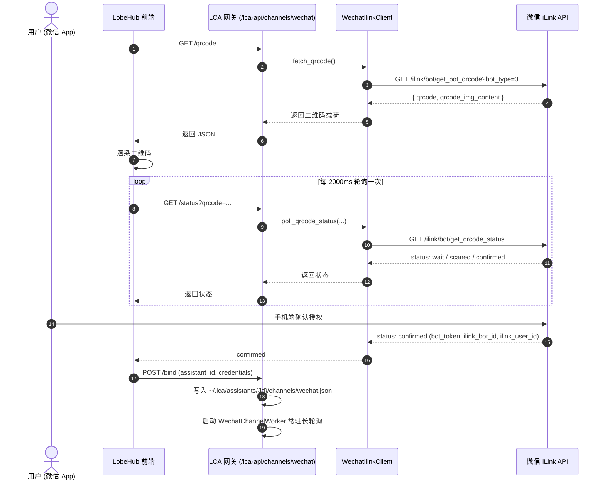
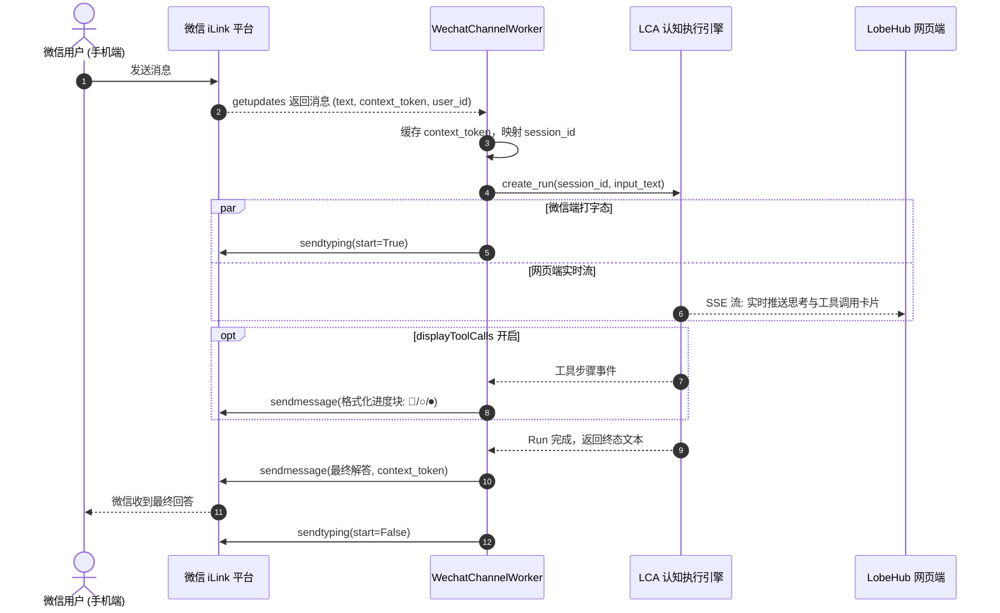

# 微信消息频道 LCA Python 原生接管设计文档

> 文档编号：`PLAN-2026-09-22-WECHAT-CHANNEL-INTEGRATION`  
> 状态：`Approved`  
> 评定自治等级：`DRAFT` (AP-05)  
> 关联规范：[AGENTS.md](../../AGENTS.md) · [lca-antipatterns.md](../antipatterns/lca-antipatterns.md)

---

## 1. 背景与问题陈述

LobeHub 原生消息频道（Channel / Messenger）针对微信的接入，底层采用腾讯微信官方面向 AI Bot 的 **iLink Bot / ClawBot 协议**（基座 API：`https://ilinkai.weixin.qq.com`）。
在 LobeHub 原生实现中，该能力由 Node.js 服务端（`@lobechat/chat-adapter-wechat` 及 `agentBotProvider.ts` / `messenger.ts`）承担。

在 LCA（Layered Cognitive Agent）体系中，后端已收敛至 Python Starlette/AsyncIO 架构。为了摆脱对 LobeHub Node.js 后端与外部适配层的厚重依赖，需将**微信二维码生成、状态轮询、长轮询接收、消息回复及思考/工具状态格式化**等所有服务端职责彻底移交由 **LCA Python 后端** 原生接管，前端继续复用 LobeHub 原生的 UI 交互与体验，通过轻量声明式 Patch 完成直连代理。

---

## 2. 负向边界定义 (Does NOT own, AP-01)

| 维度 | 范围 |
|---|---|
| **Owns (负责实现)** | 1. Python 原生 iLink 客户端 (`WechatIlinkClient`)：免鉴权扫码、状态轮询、长轮询 `getupdates` 与回复 `sendmessage`<br/>2. 传输层路由插件 (`routes_channels_wechat.py`)：提供 `/lca-api/channels/wechat/*` 端点<br/>3. 常驻守护管理器 (`WechatChannelManager` & `WechatChannelWorker`)：生命周期托管与容灾自愈<br/>4. 原生排版格式化器 (`WechatMessageFormatter`)：100% 对齐 LobeHub 原生 `replyTemplate.ts` 思考与工具进度排版<br/>5. 助手配置持久化：落盘 `~/.lca/assistants/{id}/channels/wechat.json`<br/>6. 前端声明式补丁 (`wechat_channel_lca_proxy.py`)：将前端扫码请求透明重定向至 LCA 网关 |
| **Does NOT own (严格禁止)** | 1. **严禁直接修改 `lobehub-ui/` 源码库**，必须通过 `deploy/lobehub/patches/` 声明式打补丁<br/>2. **严禁依赖 LobeHub Node 服务端**与 `@lobechat/chat-adapter-wechat`<br/>3. **严禁侵入或修改非微信平台**（Discord, Slack, Telegram 等现有频道保持独立）<br/>4. **严禁破坏 LCA 不变量**：微信入站事实严格仅通过 `Session.append` 单向追加，严禁绕过 Reducer 改写 AgentState (C4/C11) |

---

## 3. 自治阶梯 (Autopilot Ladder, AP-05)

- **评定等级**：**`DRAFT`**
- **判定理由**：涉及跨网络协议通信、长轮询常驻任务编排、传输层 Starlette 路由以及前端声明式补丁。先通过完整设计方案与确定性测试矩阵，再分步落地。

---

## 4. 架构模型与核心组件

### 4.1 整体分层架构

```
contracts (DTOs)
  └── WechatQrSession, WechatInboundMessage, WechatChannelConfig
infrastructure (通信与协议)
  ├── channels/wechat/client.py (WechatIlinkClient)
  ├── channels/wechat/worker.py (WechatChannelWorker & WechatChannelManager)
  └── channels/wechat/formatter.py (WechatMessageFormatter, 对齐 replyTemplate.ts)
plugins/transport/webserver (传输层路由)
  └── routes_channels_wechat.py (/lca-api/channels/wechat/*)
application / runtime (认知循环与会话)
  └── Session.append -> CognitiveAgent 驱动
deploy/lobehub/patches (前端代理补丁)
  └── route/wechat_channel_lca_proxy.py
```

### 4.2 核心组件职责

1. **`WechatIlinkClient`** (`lca/infrastructure/channels/wechat/client.py`)：
   - 基于 `httpx.AsyncClient` 实现原生 HTTP/JSON 通信。
   - `fetch_qrcode(bot_type=3)`：获取 `qrcode` 令牌与 `qrcode_img_content` URL。
   - `poll_qrcode_status(qrcode)`：轮询扫码状态（`wait` $\rightarrow$ `scaned` $\rightarrow$ `confirmed` / `expired`）。
   - `get_updates(bot_token, cursor)`：带 `X-WECHAT-UIN` 和 `AuthorizationType: ilink_bot_token` 的 35s+ 长轮询。
   - `send_message(bot_token, to_user_id, context_token, text)`：按 2000 字上限分片，带独立 UUID4 `client_id` 与 `context_token`。
   - `send_typing(bot_token, to_user_id, typing_ticket, start=True)`：设置微信手机端打字状态。

2. **`WechatMessageFormatter`** (`lca/infrastructure/channels/wechat/formatter.py`)：
   - 100% 对齐 LobeHub 原生 `replyTemplate.ts` 规范：
     - 思考符号：`💭 <reasoning>`
     - 工具待调：`○ **<id>·<api>**(key: "val")`
     - 工具完成：`⏺ **<id>·<api>**(key: "val")\n⎿  success: <N> chars`
     - 统计头部：`> 共 **N** 次工具调用 · Xs`
     - 最终回答：标准 Markdown 回复。

3. **`WechatChannelManager` & `WechatChannelWorker`** (`lca/infrastructure/channels/wechat/worker.py`)：
   - 随内核 Lifespan 自动加载已启用微信频道的 Assistant 配置。
   - 每个频道常驻一个异步 Worker 运行 `get_updates` 循环。
   - 具备容灾策略：超时自动下一轮；5xx 指数退避（1s~10s）；401 标记失效并优雅挂起。

4. **网关路由插件** (`lca/plugins/transport/webserver/routes_channels_wechat.py`)：
   - `GET /lca-api/channels/wechat/qrcode`
   - `GET /lca-api/channels/wechat/status?qrcode=...`
   - `POST /lca-api/channels/wechat/bind` (落盘配置并启动 Worker)
   - `POST /lca-api/channels/wechat/unbind` (停止 Worker 并注销配置)

5. **前端补丁** (`deploy/lobehub/patches/route/wechat_channel_lca_proxy.py`)：
   - 拦截 `agentBotProviderService.wechatGetQrCode` 与 `wechatPollQrStatus`，转发至 `/lca-api/channels/wechat/*`。

---

## 5. 数据流与时序

### 5.1 扫码与绑定流程



### 5.2 双端实时协同消息收发流



---

## 6. 测试不变量与断言矩阵 (AP-02)

| 不变量编号 | 守护维度 | 自动化测试文件 | 断言验证目标 |
|---|---|---|---|
| **INV-WC-01** | 扫码状态机 | `test_wechat_qrcode_flow.py` | 验证 `fetch_qrcode` 载荷解析，`poll_qrcode_status` 严格按 `wait` $\rightarrow$ `scaned` $\rightarrow$ `confirmed` / `expired` 状态流转断言 |
| **INV-WC-02** | 原生排版对齐 | `test_wechat_reply_formatter_parity.py` | 验证 `WechatMessageFormatter` 输出与 LobeHub 原生 `replyTemplate.ts` 字符级对齐（包含 `💭`、`○`、`⏺`、`⎿` 及 `> 共 N 次工具调用`） |
| **INV-WC-03** | 会话隔离与单轨 | `test_wechat_session_mapping.py` | 验证不同微信 OpenID 映射隔离的 Session；入站事实严格仅通过 `Session.append` 追加，断言 Reducer 单写保护 |
| **INV-WC-04** | 长轮询容灾自愈 | `test_wechat_worker_resilience.py` | 模拟长轮询超时自动进入下一轮；HTTP 5xx 触发指数退避（$\le 10\text{s}$）；HTTP 401 标记失效并安全退出 |
| **INV-WC-05** | 消息切片与令牌 | `test_wechat_sendmessage_chunking.py` | 超过 2000 字文本严格自动拆切；每段自动注入独立的 UUID4 `client_id` 与合法的 `context_token` |
| **INV-WC-06** | 补丁完整性守卫 | `test_patch_integrity.py` | 执行 `python scripts/check_patch_integrity.py`，断言 81+ 个补丁文件 SHA256 100% 一致 |
