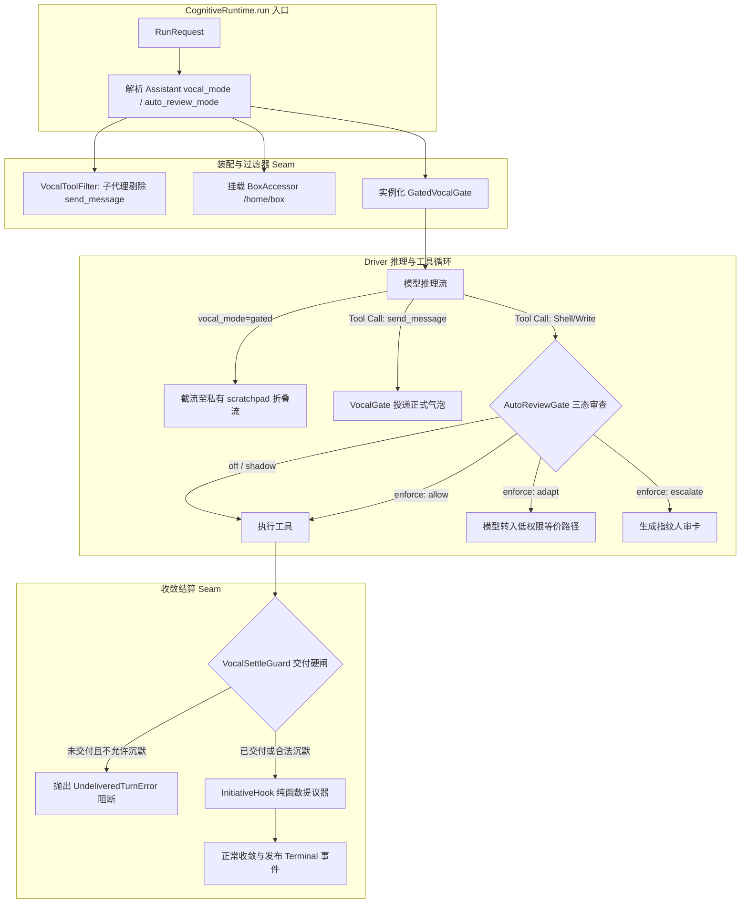

# ADR-0248 全面补齐与运行时主循环总装设计规范 (ADR-0248 Completion & Runtime Wiring Design)

- **日期**：2026-09-23
- **状态**：Approved (已评审通过)
- **关联架构**：[ADR-0248: 协调型桌面 Agent 运行时 — 证据级解剖（可模范实现）](file:///home/lichao/layered-cognitive-agent/docs/adr/0248-grok-bot-coordinator-runtime-evidence.md) · [ADR-0246: 用户机副作用平面](file:///home/lichao/layered-cognitive-agent/docs/adr/0246-companion-local-exec-plane.md)
- **Autopilot 阶梯**：`DRAFT` (AP-05，需完整单测断言并经审查合入)

---

## 1. 背景与核心目标（第一性原理）

[ADR-0248](file:///home/lichao/layered-cognitive-agent/docs/adr/0248-grok-bot-coordinator-runtime-evidence.md) 基于 Grok Bot（Sand 架构）的证据级解剖，确立了“带自己电脑的桌面 AI 员工”的核心产品对象与运行时不变式。

在既有工作中，本仓已完成了**切片 1（唯一声带硬闸与 Settle 结算）**、**切片 2（Wake 多门控矩阵与 Routine 沉默）**、**切片 5（Subagent 物理禁声与 Revival 后台复苏统一交付）**、**切片 6（多层情景持久记忆）**、**切片 7（ADR-0246 LocalExec 本机执行）** 和 **切片 9（Peer 室路由协同）**。

为了使 ADR-0248 在 LCA 架构中**100% 全面闭环并具备生产级可用性**，本次设计聚焦于解决剩余的两大核心缺口：
1. **阶段一：补齐三大缺失领域切片**：
   - **切片 3**：Box Accessor（两台电脑平面抽象，员工电脑独立文件与安全沙箱执行）；
   - **切片 4**：Tool Auto-Review（三态门控：`off` / `shadow` / `enforce`，以及 `Adapt` 降级与带指纹的 `Escalate` 人审重放防绕过硬闸）；
   - **切片 8**：Initiative Hooks（纯函数主动提议器，单轮至多 1 条高价值 Nudge，规避消息风暴）。
2. **阶段二：运行时主循环总装（Wiring into `runtime_loop.py`）**：
   - 在主循环 Seam 处根据 Assistant 配置声明式挂接 `VocalStrategy`、`AutoReviewGate` 与 `InitiativeHook`，使真实 Run 链路可以无缝运行门控声带，并保证经典模式 100% 零损耗与零回归。

---

## 2. 职责边界与负向清单 (AP-01 & AP-05)

### 2.1 Owns（本次构建）
1. **契约层**：
   - `lca/contracts/models/computer/box.py`：`ComputerPlane`（`BOX` vs `LOCAL`）枚举及 Box 配置模型；
   - `lca/contracts/models/auto_review/`：`AutoReviewMode`（`off`, `shadow`, `enforce`）、`AutoReviewAction` 与 `AutoReviewVerdict` 载荷模型（`frozen=True`, `extra="forbid"`）；
   - `lca/contracts/models/initiative/`：`InitiativeOffer` 与 `InitiativeSignal` 纯函数提议模型。
2. **基础设施层**：
   - `lca/infrastructure/computer/box_accessor.py`：`BoxAccessor` 抽象，专职隔离操作 `/home/box` 并提供安全的读写与 Shell 访问；
   - `lca/infrastructure/auto_review/gate.py`：`AutoReviewGate` 审查硬闸，实现三态拦截、低权限 Adapt 路径与基于 SHA-256 指纹的 Escalate 重放校验。
3. **应用编排层**：
   - `lca/application/initiative/hooks.py`：`evaluate_initiative` 纯函数提议器；
   - `lca/application/vocal/runtime_wiring.py`：主循环挂载辅助适配器。
4. **运行时总装层**：
   - `lca/runtime/loop/runtime_loop.py`：在 `run` 与 `_run_driver` 中接入声带策略路由、工具条件过滤、Auto-review 拦截与 Settle 结算收敛硬闸。
5. **测试套件**：
   - `tests/contracts/computer/`, `tests/contracts/auto_review/`, `tests/contracts/initiative/`；
   - `tests/infrastructure/computer/test_box_accessor.py`；
   - `tests/infrastructure/auto_review/test_auto_review_gate.py`；
   - `tests/application/initiative/test_initiative_hooks.py`；
   - `tests/scenario/adr0248/test_runtime_loop_gated_e2e.py`。

### 2.2 Does NOT own（严格负向保护清单 · AP-01）
- **严禁**修改已有经典直出模式（`vocal_mode="direct"`）的主循环执行时序与气泡发射逻辑；
- **严禁**直接修改 ADR-0246 伴侣客户端（`lca-companion`）的网络通信协议与出站长连接逻辑；
- **严禁**改动前端 UI 渲染组件代码或已有的 LobeHub 补丁体系；
- **严禁**在领域代码中引入未经性能基准测试的重型外部网络与云端依赖；
- **严禁**在全局引入外部专有商业命名，统一采用第一方领域命名规范。

---

## 3. 架构拓扑与执行全景



---

## 4. 阶段一领域模型与组件契约

### 4.1 切片 3：两台电脑执行平面与 BoxAccessor
根据 ADR-0248 §3.2，桌面员工默认在自己的电脑干活，用户电脑需显式授权：

```python
from enum import StrEnum
from pathlib import Path


class ComputerPlane(StrEnum):
    """执行电脑平面枚举。"""

    BOX = "box"  # 员工电脑（对用户称“我的电脑”，默认沙箱）
    LOCAL = "local"  # 用户本机（对用户称“你的电脑”，需 ADR-0246 授权）


class BoxAccessor:
    """员工电脑专属沙箱访问器。"""

    def __init__(self, root_dir: str | Path = "/home/box") -> None:
        self.root_dir = Path(root_dir).resolve()

    def resolve_path(self, subpath: str) -> Path:
        """解析并确保路径绝对不越出 /home/box。"""
        resolved = (self.root_dir / subpath.lstrip("/")).resolve()
        if not str(resolved).startswith(str(self.root_dir)):
            raise PermissionError(f"越权访问受阻：路径 '{subpath}' 超出员工电脑沙箱范围")
        return resolved
```

### 4.2 切片 4：Auto-Review 三态门控与 Escalate 重放人审硬闸
根据 ADR-0248 §3.5，副作用工具调用接受分级审查：

```python
import hashlib
from enum import StrEnum
from pydantic import BaseModel, ConfigDict, Field


class AutoReviewMode(StrEnum):
    OFF = "off"
    SHADOW = "shadow"
    ENFORCE = "enforce"


class AutoReviewVerdict(BaseModel):
    model_config = ConfigDict(frozen=True, extra="forbid")

    action: str = Field(..., description="allow | adapt | escalate | block")
    reason: str
    adapted_command: str | None = None
    action_fingerprint: str | None = None


def compute_action_fingerprint(tool_name: str, arguments: dict) -> str:
    """计算确定性 SHA-256 动作指纹，杜绝换命令绕过。"""
    raw = f"{tool_name}:{sorted(arguments.items())}"
    return hashlib.sha256(raw.encode("utf-8")).hexdigest()
```

### 4.3 切片 8：Initiative Hooks 纯函数主动提议器
根据 ADR-0248 §5.2，主动行为是解耦的纯函数策略：

```python
class InitiativeSignal(StrEnum):
    REPEATED_MANUAL = "repeated_manual"
    OBVIOUS_NEXT_STEP = "obvious_next_step"
    MISSING_CONNECTOR = "missing_connector"


class InitiativeOffer(BaseModel):
    model_config = ConfigDict(frozen=True, extra="forbid")

    signal: InitiativeSignal
    message: str
    proposed_routine: str | None = None
```

---

## 5. 阶段二运行时主循环总装机制

在 `lca/runtime/loop/runtime_loop.py` 中注入：
1. **`vocal_mode` 与 `auto_review_mode` 上下文解析**：
   从 `RunContext` 或 Profile 中读取配置，默认直出模式零开销；
2. **工具集编译期过滤**：
   主协调者自动追加 `send_message` 工具；子代理（`origin="subagent"`）经由 `VocalToolFilter` 强制剔除该工具；
3. **Act 阶段 Auto-review 拦截**：
   在工具执行 seam 调用 `AutoReviewGate.evaluate`；
4. **Settle 阶段硬闸核验与主动提议**：
   推理返回前调用 `VocalSettleGuard.validate_turn_settle()`，随后调用 `evaluate_initiative` 挂载 Nudge。

---

## 6. 核心不变量断言矩阵 (INV-01 ~ INV-09)

| 不变量编号 | 系统保证 | 自动化断言点 |
|---|---|---|
| **INV-01 ~ 05** | 声带唯一、Widget 停等、Ack≠Delivery、Routine 沉默、子代理禁声 | `tests/scenario/vocal/` 35/35 既有测试持续 100% 全通守卫 |
| **INV-06** | 员工机隔离与固定话术 | 断言 `BoxAccessor` 读写严格受限于 `/home/box`，越界即刻抛 `PermissionError` |
| **INV-07** | Auto-Review 指纹防绕过 | 在 `enforce` 模式下拦截危险 Shell；断言 `Escalate` 重放必须携带匹配的 `action_fingerprint` |
| **INV-08** | 主动提议单轮收敛守卫 | 断言输入重复 3 次操作特征时精准输出 1 条提议，单轮绝不多发 |
| **INV-09** | 运行时主循环总装与经典模式零退化 | 1. 经典模式零门控直出；2. 门控模式下内省截流进 scratchpad，`send_message` 正常交付，Settle 自动闭环 |
