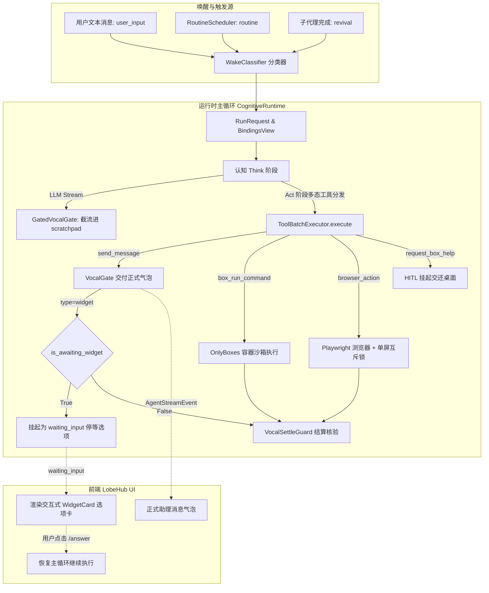

# Grok Bot (Sand 架构) 全面正规对齐与生产级可用设计规范

- **日期**：2026-09-24
- **状态**：Approved (已评审通过)
- **关联架构**：
  - [ADR-0248: 协调型桌面 Agent 运行时 — 证据级解剖（可模范实现）](../adr/0248-grok-bot-coordinator-runtime-evidence.md)
  - [ADR-0246: 用户机副作用平面（Companion & LocalExec）](../adr/0246-companion-local-exec-plane.md)
  - [ADR-0250: 多角色协同、转交总线与群聊房间](../adr/0250-peer-assistants-handoff-bus-and-rooms.md)
  - [ADR-0251: OpenMuse 运行时沙箱与持久化任务事实](../adr/0251-openmuse-runtime-sandbox-durable-task-evidence.md)
- **Autopilot 阶梯**：`DRAFT` (AP-05，需完整单测断言并经审查合入)

---

## 1. 背景与核心目标（第一性原理）

[ADR-0248](../adr/0248-grok-bot-coordinator-runtime-evidence.md) 与 `learn-grok-bot` 16 项产品机制（s01–s16）明确了 Grok Bot（内部代号 Sand）的核心哲学：

> **用户雇佣的是“带自己电脑的桌面 AI 员工”，而不是一次一次的模型补全（completion）。**
> 强，是因为五类产品对象（员工、两台电脑、唯一声道、唤醒分类、人闸）被**进程边界与硬闸**钉住，而不是只靠 Prompt 劝模型听话。

在本仓前序工作中，已完成了切片 1–9 的契约模型与部分运行时接线，但经过第一性原理代码审计，系统距离生产可用仍存在四大实质性断点：
1. **声带交互虚假闭环**：流式生成未接入截流钩子（`handle_text_chunk` 生产零调用），`send_message` 消息未送达前端气泡，Widget 选项卡未在运行时挂起阻断；
2. **员工电脑（Box）缺乏隔离**：`BoxAccessor` 仅为本地宿主目录，`box_run_command` 为宿主机裸 `subprocess.run`，存在提权与越权风险；
3. **缺少真实浏览器与屏幕互斥**：缺乏基于无头浏览器的子代理与单屏互斥锁（`allocateWindow/freeWindow`），`request_box_help` 仅为静态桩文本；
4. **例程引擎与护栏真空**：缺少基于持久化意图配置的定时调度器与 Token/费用熔断护栏（Spend Guard）。

本次设计的核心目标是**大闭环全量推进，正规落地四大支柱能力，使 LCA 的 Grok 模式真正走向正式可用**。

---

## 2. 职责边界与负向清单 (AP-01 & AP-05)

### 2.1 Autopilot 阶梯
- **评级：`DRAFT`**。
- **依据**：涉及主循环挂起状态机、认知流截流与前端 UI 补丁，必须通过严格的自动化单测断言守卫验证后方可合并。

### 2.2 Owns（本次落地范畴）
1. **契约模型层**：
   - `lca/contracts/models/routine/`：`RoutineSpec`、`RoutineTrigger`、`SpendBudget` 不可变模型（`frozen=True, extra="forbid"`）；
   - `lca/contracts/models/browser/`：`BrowserAction`、`BrowserActionResult`、`DesktopLock` 模型；
   - `lca/contracts/models/vocal/`：扩展 `VocalMessageType.WIDGET` 选项卡结构与 `SECRET_REQUEST` 字段。
2. **认知流截流与发声 Seam**：
   - `lca/plugins/primitive/llm_call/invoke.py` 与 `lca/plugins/events/hooks/model_visible/adapter.py`：在流式生成时将文本定向导入 `GatedVocalGate.handle_text_chunk` 截流进私有 `scratchpad`，抑制直出 `text_delta`；
   - `lca/infrastructure/vocal/tool_adapter.py`：`send_message` 执行时向事件通道追加 `vocal.message.delivered` 事实并写入 `TerminalOutcome.text_ref`。
3. **运行时状态机与前端补丁**：
   - `lca/runtime/loop/runtime_loop.py`：捕获 `is_awaiting_widget`，挂起为 `waiting_input` 并保留断点快照；
   - `deploy/lobehub/patches/ui/`：增加 `WidgetCard` 组件渲染可交互选项卡，支持用户点击经 `/lca-api/runs/{id}/answer` 恢复执行。
4. **员工机安全沙箱化**：
   - `lca/infrastructure/computer/box_port.py`：定义 `BoxExecutionPort` 协议；
   - `lca/infrastructure/tools/box/tool.py`：接入 `OnlyboxesSandboxAdapter` 在无特权沙箱容器中执行 Shell。
5. **浏览器控制与单屏互斥**：
   - `lca/infrastructure/browser/`：实现 Playwright 驱动的无头浏览器子代理；
   - `lca/infrastructure/computer/desktop_lock.py`：实现单屏互斥锁 `allocateWindow/freeWindow`（带 120s TTL）。
6. **例程引擎与消费护栏**：
   - `lca/domain/routine/`：声明式 `JsonRoutineRepository` 持久化至 `~/.lca/routines/`；
   - `lca/application/routine/scheduler.py`：`RoutineSchedulerService` 后台轮询与唤醒驱动；`SpendGuard` 单轮与每日 Token/费用熔断。

### 2.3 Does NOT own（严格负向保护清单 · AP-01）
- **严禁**影响已有经典直出模式（`vocal_mode="direct"`）的主循环执行时序与输出气泡；
- **严禁**修改 ADR-0246 用户机伴侣服务（`lca-companion`）的网络通信协议与出站长连接；
- **严禁**破坏或改变认知层现有的五相（Think/Gate/Act/Reflect/Remember）闭集拓扑（**绝不在认知图中新增图节点**，业务工具调用全数通过 Act 阶段的 `ToolBatchExecutor` 多态分发）；
- **严禁**将私有密钥或内部管道词（如 box、message_id 等）暴露至前端气泡或模型上下文。

---

## 3. 架构拓扑与执行全景



---

## 4. 模块一：声带交互闭环 (P0) 与 员工机安全容器沙箱 (P1)

### 4.1 P0 声带交互闭环
1. **流式真实截流**：
   - 在 `lca/plugins/primitive/llm_call/invoke.py` 的流式回调中读取 `bindings.vocal_gate`；
   - 若为 `GatedVocalGate`，收到的每个 text chunk 均调用 `vocal_gate.handle_text_chunk(chunk)` 压入私有 `_scratchpad`；同时向事件通道标记为内部内省流，阻断向前端发射可见 `text_delta`。
2. **正式气泡交付**：
   - 模型在 Act 阶段调用 `send_message(content="...")` 时：
     - 调用 `gate.deliver(payload)`，生成不可变 `DeliveryReceipt`；
     - 经 `Session.append` 追加不可变事实事件 `vocal.message.delivered`；
     - 同步注入当前轮次的 `TerminalOutcome.text_ref`，确保 `Result.output` 包含正式交付内容；
     - Web 网关将该事实映射为前端正式的助理气泡。
3. **Widget 选项卡停等**：
   - 当 `send_message(type="widget", options=[...])` 时，`is_awaiting_widget` 为 `True`；
   - `ToolBatchExecutor` 捕获该信号，输出携带选项 payload 的 `approval_request`；
   - 触发 `intervene.interrupt`，将 Run 安全转入 `waiting_input` 状态并停等；
   - LobeHub 前端补丁新增 `WidgetCard` 组件（基于 AntD Radio/Button）渲染选项卡，用户点击后调用 `POST /lca-api/runs/{id}/answer` 提交选项并顺畅恢复。
4. **Secret-Request 凭证隔离**：
   - 前端弹出掩码密码输入卡，用户输入后经由独立接口写入主机内存密钥库（`SecretVault`），**绝对不进会话 Transcript，绝对不进 LLM 上下文**。

### 4.2 P1 员工机安全容器沙箱
1. **两台电脑物理分界**：
   - **员工电脑（我的电脑）**：服务端后台的独立 Docker 容器沙箱（如 `onlyboxes-worker` 容器内部，挂载至 `/home/box`，非 root 用户 `uid=1000`）；
   - **用户电脑（你的电脑）**：李超真实的本地物理机（经 ADR-0246 `lca-companion` 伴侣客户端授权执行）。
2. **抽象端口 `BoxExecutionPort`**：
   ```python
   class BoxExecutionPort(Protocol):
       async def execute_command(self, cmd: str, timeout_s: int) -> CommandResult: ...
       async def read_file(self, path: str) -> str: ...
       async def write_file(self, path: str, content: str) -> None: ...
       async def list_files(self, path: str) -> list[str]: ...
   ```
3. **`OnlyboxesBoxAdapter` 容器执行**：
   - 接入已在运行的 `onlyboxes-worker-docker` 容器；
   - 所有的 `box_run_command` 均在隔离容器中执行，彻底切断宿主机裸跑隐患；
   - 开发与离线单测模式优雅降级为 `LocalBoxAdapter`（保持确定性越界抛错）。

---

## 5. 模块二：Playwright 浏览器自动化 (P2) 与 后台例程调度引擎 (P3)

### 5.1 P2 浏览器控制与单屏互斥
1. **单屏互斥锁 `DesktopLockManager`**：
   - 基础设施层 `lca/infrastructure/computer/desktop_lock.py`，提供 `allocate_window(agent_id, session_id)` 与 `free_window(...)`；
   - 内置 120s TTL 超时自愈机制，杜绝异常崩溃死锁。
2. **浏览器子代理与工具集**：
   - 基于 Playwright 封装 `BrowserSubagent`，提供 `browser_navigate`、`browser_click`、`browser_type`、`browser_screenshot`、`browser_close` 动作原语；
   - 严格遵循 ADR-0248 §5.3：子代理经 `VocalToolFilter` 强制移除 `send_message`，重活完成后把结构化数据与截图回传父代理。
3. **`request_box_help` 桌面交还人闸**：
   - 遇到 2FA、验证码或支付时，调用 `request_box_help` 并自动捕获当前页面截图作为 Artifact；
   - 主循环挂起为 `waiting_input`，前端展示求助信息与截图卡片，待用户处理完毕后恢复。

### 5.2 P3 后台例程引擎与消费护栏
1. **声明式例程模型与仓储**：
   ```python
   class RoutineSpec(BaseModel):
       model_config = ConfigDict(frozen=True, extra="forbid")
       id: str
       name: str
       cron_expr: str | None = None
       interval_seconds: int | None = None
       prompt: str
       spend_budget_per_run: int = 15
       daily_budget_tokens: int = 100_000
       enabled: bool = True
       assistant_id: str
   ```
   - 仓储：`JsonRoutineRepository`，负责 `~/.lca/routines/{id}.json` 文件持久化。
2. **后台调度器 `RoutineSchedulerService`**：
   - 挂载在网关/平台后台生命周期（Startup/Shutdown）；
   - 基于纯 Asyncio 定时循环轮询，到期时触发 `CognitiveRuntime.run(wake_source=WakeSource.ROUTINE)`。
3. **消费护栏 `SpendGuard`**：
   - 跟踪每日例程 Token 消耗，超出 `daily_budget_tokens` 立即熔断并标记为 `paused_budget_exceeded`。
4. **合法沉默闭环**：
   - 根据 `WakeContext(source=WakeSource.ROUTINE, is_silence_allowed=True)`；
   - 若模型分析后“无新事发生”且未调用 `send_message`，`VocalSettleGuard` 判定为**合法沉默**，顺利收敛，不抛异常，不发垃圾通知。

---

## 6. 状态机转换与异常矩阵

### 6.1 异常矩阵与处理策略

| 异常场景 | 抛出错误 / 触发事件 | 恢复与降级策略 | 幂等与审计 |
|---|---|---|---|
| **用户轮次模型未发声即结束** | `UndeliveredTurnError` | 阻断非法收敛；触发重试机制或注入 Reply-first 提醒要求模型向用户发声 | 记录 `turn_undelivered` 事实日志 |
| **Widget 停等中同轮二次发声** | `VocalGateAlreadyBlockedError` | 工具返回验证失败 Observation，模型感知当前必须等待用户选择 | 幂等无副作用 |
| **员工机路径越界穿越** | `PermissionError` (BoxAccessor) | 立即阻断文件读写，返回验证失败 Observation，严禁越出 `/home/box` | 触发安全审计事件 |
| **沙箱高危 Shell (如 rm -rf)** | `AutoReviewVerdict(action=ESCALATE)` | 生成不可篡改的 SHA-256 动作指纹，工具返回拦截失败；同一动作经人工审批后方可重放 | 记录指纹与拦截事实 |
| **桌面屏幕并发冲突** | `DesktopLockConflictError` | 自动排队重试，120s TTL 超时强制释放，杜绝单屏焦点打乱 | 锁自动防死锁 |
| **例程每日 Token 预算耗尽** | `SpendBudgetExceededError` | 立即熔断该 Routine，状态置为 `paused_budget_exceeded`，发射一次性系统告警 | 防止后台无人值守账单失控 |
| **容器沙箱未就绪或脱机** | `SandboxUnavailableWarning` | 优雅自愈降级为路径受限的 `LocalBoxAdapter`（主要用于离线单测），在元数据中显著标记 | 记录运行环境状态 |

---

## 7. 核心不变量自动化测试清单 (INV-01 ~ INV-09 · AP-02)

| 不变量编号 | 业务系统保证 | 自动化测试断言点 (Pytest) |
|---|---|---|
| **INV-01 文本真实截流** | 在 `vocal_mode="gated"` 下，大模型思考散文绝不直出给用户 | 模拟流式生成，断言前端事件通道收到的 `text_delta` 数量严格为 0，文本 100% 进入 `scratchpad` |
| **INV-02 气泡正式送达** | `send_message(content="...")` 是用户可见消息的唯一合法来源 | 断言工具执行成功后，`Session` 产生 `vocal.message.delivered` 事实，且 `Result.output` 包含该正式文本 |
| **INV-03 Widget 停等与恢复** | `widget` 必须使轮次挂起并等待选择，且阻断同轮二次发声 | 断言主循环状态转为 `WAITING_INPUT`；断言同轮再次调用 `send_message` 抛 `VocalGateAlreadyBlockedError`；断言输入 `/answer` 后顺畅恢复 |
| **INV-04 员工机隔离** | 员工电脑操作必须在隔离容器或严格受限路径中执行 | 断言越界读写 `../../etc/passwd` 抛 `PermissionError`；断言容器模式下命令以非 root 身份在容器沙箱执行 |
| **INV-05 子代理物理禁声** | 浏览器等重活子代理绝对不能向用户直接发声 | 断言构建子代理工具集时，`VocalToolFilter` 彻底移除 `send_message`，子代理不可见、不可调用 |
| **INV-06 单屏互斥防死锁** | 两个任务争夺桌面时严格互斥，且带 120s 自动释放防死锁 | 并发测试两个 worker 请求 `allocate_window`，断言第二个必须等待释放；断言 TTL 到期后锁自动释放 |
| **INV-07 例程合法沉默** | 后台自驱例程在无变化时保持沉默，不发垃圾通知 | 运行 `wake_source="routine"` 且模型不发声，断言 `VocalSettleGuard` 正常放行，`Result.status == COMPLETED` 且 0 通知 |
| **INV-08 消费护栏硬熔断** | 例程消耗超出单日预算即刻熔断暂停 | 注入超出预算的 Token 计数，断言触发 `SpendGuard` 拦截，后续触发被忽略，状态置为 `paused` |
| **INV-09 经典模式零退化** | `vocal_mode="direct"` 经典直出模式 100% 不受影响 | 运行原有经典场景，断言零拦截、直接输出气泡、原有测试集 100% 全绿无损耗 |
