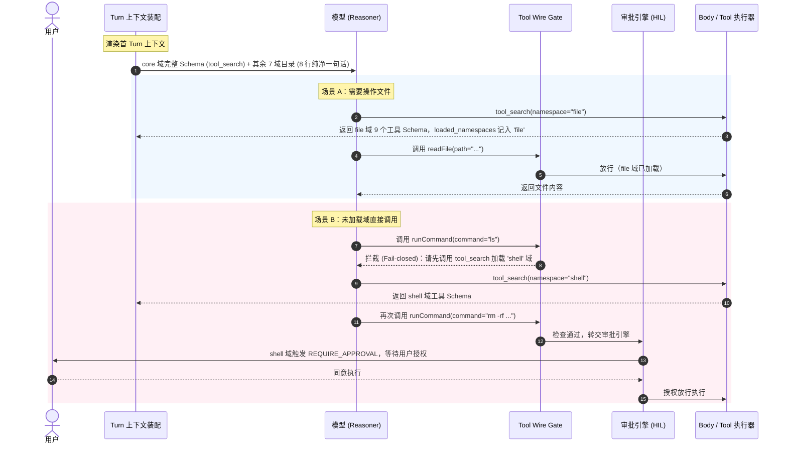

# ADR-0256: 工具命名空间划分规范（决策粒度 × 加载粒度 × 审批粒度三合一）系统设计

**状态**：已批准 (Approved)
**日期**：2026-10-01
**对应 ADR**：[ADR-0256](docs/adr/0256-tool-namespace-taxonomy.md) / [ADR-0255](docs/adr/0255-muse-production-runtime-full-reference.md)
**Autopilot Level**：`DRAFT` (跨 contracts / infrastructure / cognition / control plane 核心契约改动)

---

## 1. 背景与核心问题

### 1.1 现状与痛点
在目前的工具延迟加载（Defer）机制中：
1. `ToolDeferSession.update_turn` 依赖 `namespaces.get(tool.name, tool.name)` 隐式回退；
2. 由于缺乏工具自身声明的元数据，且 `ToolsService._tool_namespaces` 中央映射表与工具工厂割裂，未登记的工具自动退化为“以单工具名命名的 namespace”；
3. 首 turn 目录行退化为 `"1 tools: listFiles"`，对模型语义概括力为零；
4. 模型在未见 schema 前被迫猜测具体工具名并触发单工具加载（`tool_search(namespace='listFiles')`），导致多轮往返浪费 token 与耗时，实证中曾诱发同一工具连续重试 21 次；
5. `shell` 等高危工具散落在各处，缺乏天然的按域审批边界，容易造成安全策略漏配。

### 1.2 架构目标
终结“单工具 namespace”退化现状，将 namespace 归属由中央映射表改造为工具自身的声明式元数据，并划分为 8 大能力域（`core` / `file` / `shell` / `memory` / `skill` / `web` / `agent` / `ext`），实现：
- **模型决策粒度（Cognition）**
- **Defer 加载粒度（Infrastructure）**
- **安全审批边界（Governance）**
三者完全同粒度统一。

---

## 2. 边界声明 (Mandatory Boundaries)

### 2.1 Owns (本方案负责)
1. **契约层**：
   - [`Tool`](lca/contracts/protocols/runtime/infra/infra.py) 协议增加必填 `namespace: ClassVar[str]`；
   - [`ToolApi`](lca/contracts/models/core/execution/tool.py) 增加 `namespace: str`；
   - [`DeferPolicy`](lca/infrastructure/tool_defer/policy.py) 强化 `namespace_descriptions`（必填 8 域字典）与 `namespace_approval`；`eager_namespaces` 默认设定为 `frozenset({"core"})`。
2. **基础设施层**：
   - 改造 [`build_tools_from_manifest`](lca/infrastructure/tools/builder/builder.py) 支持传递 `namespace`；
   - 标注所有内置工具及 Manifest 的 `namespace`（涵盖 `lca_computer`、`web_search`、`skills`、`memory`、`ask_user`、`delegate_tool`、`composio`、`box`、`vocal` 等）；
   - 彻底删除 [`ToolsService`](lca/infrastructure/capability/tools/tools.py) 的 `_tool_namespaces` 中央字典；
   - 规范化 skill 域工具名为 snake_case，清理历史遗留双拼。
3. **运行时 / Defer 协议**：
   - 改造 [`ToolDeferSession.update_turn`](lca/infrastructure/tool_defer/session.py)，分组键以 `tool.namespace` 为单一事实源，未声明或未知域启动期直接抛错（Fail-fast）；
   - 彻底删除 `_describe` 默认的 `"N tools:"` 降级文本；
   - 升级 [`tool_search`](lca/infrastructure/tool_defer/tool_search.py) 支持 `namespaces: list[str]` 批量按需加载。
4. **认知 / 执行防护面**：
   - 升级 [`tool_wire_gate.py`](lca/cognition/body/tools/tool_wire_gate.py) 的 `unexposed_tool_block_observation` 为按 namespace 判定可见性；
   - 同 PR 彻底删除 `_name_forms` 兼容函数；
   - 审批策略引擎接入 `namespace_approval`，`shell` 域默认挂载 `REQUIRE_APPROVAL`。

### 2.2 Does NOT own (严格禁止触碰 / 负向清单, AP-01)
1. **禁止修改外部资产**：不修改宿主机运维配置、`~/everything-library` 资产及非 LCA 代码；
2. **禁止修改认知五相与事件闭集**：不新增状态转移事件或改变 `perceive -> think -> act -> reflect -> remember` 认知闭集；
3. **禁止改变 Reducer 单写模型**：所有状态流转依然受 `AgentState` 与 Session Append 单轨约束；
4. **禁止临时兼容与跨 PR 遗留**：不留过渡期 shim，双拼别名同 PR 彻底下线。

---

## 3. 架构设计与 8 域拓扑

### 3.1 8 域划分真值表

| namespace | 模式 | 目录一句话（面向模型） | 工具全集 | 审批策略 |
|---|---|---|---|---|
| `core` | **EAGER** | 推理原语：按需加载工具目录 | `tool_search` | `AUTO` |
| `file` | DEFERRED | 文件系统：列出、读取、写入、编辑、移动、搜索文件内容 | `listFiles`, `readFile`, `writeFile`, `editFile`, `moveFiles`, `globFiles`, `searchFiles`, `grepContent`, `exportFile`, `box_read_file`, `box_write_file`, `box_list_files` | `AUTO`（覆写预留钩子） |
| `shell` | DEFERRED | 执行 shell 命令与脚本；危险操作会先请示你 | `runCommand`, `execScript`, `executeCode`, `getCommandOutput`, `killCommand`, `box_run_command` | **`REQUIRE_APPROVAL`** |
| `memory` | DEFERRED | 搜索与写入长期记忆 | `memory_search`, `memory_add`, `memory_get`, `memory_update`, `memory_remove`, `memory_explain`, `person_note`, `group_note` | `AUTO` |
| `skill` | DEFERRED | 技能的发现、安装与调用 | `search_skill`, `activate_skill`, `import_skill`, `read_skill_reference_once`, `run_skill_script`, `read_reference` | `AUTO` |
| `web` | DEFERRED | 联网搜索与网页抓取 | `search` | `AUTO` |
| `agent` | DEFERRED | 派发子任务、向用户提问 | `delegate_tool`, `askUserQuestion`, `send_message`, `request_box_help` | `AUTO` |
| `ext` | DEFERRED | 第三方集成：连接与刷新外部服务 | `composioConnect`, `composioRefresh` 等动态 Composio 操作 | `AUTO` |

### 3.2 运行期交互时序

---

## 4. 关键设计与优雅原则

1. **单一事实源（SSOT）**：
   `namespace` 是工具不可分割的固有元数据。工具类定义或 Manifest 完成即自备 `namespace`，彻底消除中央平行映射表 `_tool_namespaces`。
2. **零隐式回退（Zero Fallback）与 Fail-Fast**：
   严禁使用 `namespaces.get(tool.name, tool.name)`。若工具缺少 `namespace` 或声明了非法域，在注册/装配阶段立即抛出 `ValueError`。
3. **同 PR 彻底清理（No Lingering Shims）**：
   删除驼峰命名兼容代码（`_name_forms`），全面使用 snake_case。
4. **批量加载优化**：
   `tool_search` 支持 `namespaces: list[str]`，模型可一次加载多域能力（如同时加载 `file` 与 `memory`），节省网络轮次。

---

## 5. 自动化测试不变量矩阵 (AP-02)

| 不变量编号 | 业务/架构不变量 | 验证方式 |
|---|---|---|
| **INV-01** | 首 turn 目录行恰好 8 行，绝无 `"N tools:"` 降级文本 | 单元测试：`test_catalog_exact_eight_domains` |
| **INV-02** | 任何未声明 `namespace` 的工具在 `update_turn` 时必然抛错（Fail-fast） | 单元测试：`test_missing_namespace_fails_loud` |
| **INV-03** | `tool_search(namespace='file')` 能够一次返回完整 9 个工具 Schema | 单元测试：`test_tool_search_single_domain_loading` |
| **INV-04** | `tool_search(namespaces=['file', 'memory'])` 能够批量加载多域 | 单元测试：`test_tool_search_batch_loading` |
| **INV-05** | Wire Gate 对未加载域调用直接拦截并不杀 run | 单元测试：`test_unloaded_namespace_wire_gate_block` |
| **INV-06** | `shell` 域工具调用必然触发 `REQUIRE_APPROVAL` 审批要求 | 单元测试：`test_shell_domain_triggers_approval` |
| **INV-07** | 全局消除所有驼峰工具双拼与兼容逻辑（`_name_forms` 不复存在） | 代码检查与回归测试：`test_no_camel_tool_names` |
