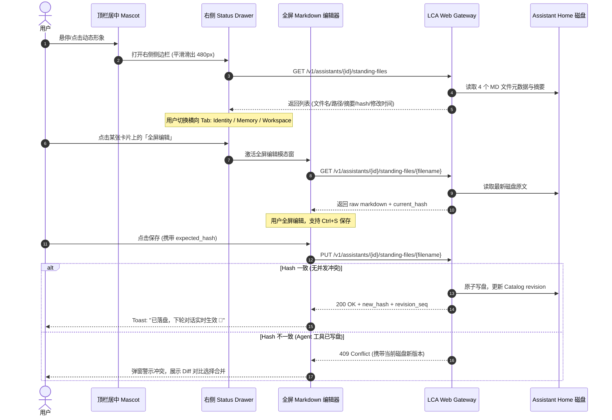

# 技术设计文档：Muse 风格顶栏动态形象、右侧状态抽屉与文件即 SSOT 全屏编辑器架构设计

**创建日期**：2026-10-01  
**状态**：Approved (已审批)  
**设计目标**：对标 Meta Muse 顶级个人 Agent 交互体验，为 LCA 建立“顶栏居中可爱动态 Mascot、点击右侧平滑滑出状态抽屉、横向多 Section 导航卡片、点击全屏沉浸式 Markdown 编辑、文件即唯一真值源（File as SSOT）与乐观锁防双写踩踏”的完整前端交互与后端契约体系。

---

## 1. 问题背景与业务价值

当前 LCA 已在后端 Assistant Home 体系中物化了 `SOUL.md`、`IDENTITY.md`、`USER.md`、`MEMORY.md` 等 Standing Files，并具备每轮对话开始由 `refresh_injected` 动态注入 context 的能力。然而在前端用户感知层，存在显著痛点：
1. **人设与记忆处于黑盒状态**：用户无法直观查阅、通读与修正助理的人格使命（`SOUL.md`）、身份定位（`IDENTITY.md`）、用户画像（`USER.md`）与长期记忆事实（`MEMORY.md`）；
2. **缺乏生命感与亲和力**：聊天顶栏仅展示静态名称与普通头像，缺乏如 Muse 产品中代表助理生命状态的“动态微交互 Mascot”；
3. **记忆行黑盒 vs 文件掌控感**：如 Muse 核心设计准则所强调——`"Memory is that editable file, not a list of rows"`，用户对关系型数据库行或隐秘向量库缺乏掌控感，唯有将配置与记忆沉淀为人类可读、可编辑、可版本化的 Plain Markdown 文件，才能建立长久的信赖；
4. **双写缺乏安全防护**：Agent 工具（如 Onboarding 命名工具、夜间 memory 反思）与人类用户通过 UI 共同修改同一份文件时，必须具备明确的“写前必读磁盘最新版”与“乐观锁防覆盖”机制。

本设计旨在通过极简纯粹的架构与精致的前端体验，将 Muse 的设计哲学完整注入 LCA。

---

## 2. 系统边界与自治等级（AP-01, AP-05）

### 2.1 自治等级
- **Autopilot Level**：`DRAFT`（跨越 transport 路由插件、AssistantCatalog Home 文件持久化、乐观锁并发控制及 LobeHub 前端 UI 补丁，需严格分层实施与测试门禁守卫）。

### 2.2 负向保护边界（Does NOT own）
- **严禁修改**：
  - 宿主机资产与环境，严禁提交外部资产（如 `~/everything-library`、`~/openmuse`）到本仓库；
  - 严禁绕过 `AssistantCatalog` 裸写磁盘文件（杜绝导致 `_DigestMismatch` 破坏配置面 SSOT）；
  - 严禁篡改 LobeHub 既有 Postgres 表结构（统一经由 LCA 权威 `AssistantCatalog` 与 `user_store.py` 承载）；
  - 严禁直接修改 `lobehub-ui/` 源码（必须严格走 `deploy/lobehub/patches/` 声明式补丁机制）；
  - 严禁破坏已有的 Onboarding 流程与存量 Assistant 运行。

### 2.3 责任清单（Owns）
- **后端传输层路由**：`lca/plugins/transport/webserver/routes_1/routes_assistants/standing_files.py`；
- **Catalog 契约扩展**：支持读取与保存 `IDENTITY.md`、`SOUL.md`、`USER.md`、`MEMORY.md` 纯文本内容与计算 hash；
- **前端 LobeHub UI 补丁集**：
  - `deploy/lobehub/patches/ui/AssistantTopMascot.tsx`（居中动态 Mascot 组件）；
  - `deploy/lobehub/patches/ui/AssistantStatusDrawer.tsx`（右侧滑出抽屉与多 Section 卡片）；
  - `deploy/lobehub/patches/ui/StandingFileFullscreenEditor.tsx`（全屏 Markdown 编辑模态窗）；
  - `deploy/lobehub/patches/ui/assistant_status_drawer.py`（LobeHub 页面注入补丁）；
- **全链路自动化测试套件**：覆盖 REST 端点读写、乐观锁防双写踩踏、Catalog 同步与前端补丁完整性。

---

## 3. 前端 UI 架构与交互流拓扑



### 3.1 四大交互阶段细节
1. **顶栏居中动态 Mascot（Top-Center Dynamic Mascot）**：
   - 居中吸附在 Conversation Header；
   - 采用精致的水豚/灵动吉祥物（基于 SVG + CSS 动画），具备自然的微起伏呼吸感；
   - Mascot 下方清晰展示当前助理名称与在线状态绿点；
2. **右侧 Status Drawer**：
   - 480px 宽度，支持横向 Segment 切换：
     - `🪪 Identity`（IDENTITY.md, SOUL.md, USER.md）
     - `🧠 Memory`（MEMORY.md 统计与事实列表）
     - `📁 Workspace`（Home 物理路径及目录索引）
   - 每张卡片呈现：文件标签、物理路径、更新时间、前 3 行预览与「全屏编辑」按钮；
3. **全屏沉浸式 Markdown 编辑器**：
   - 全屏/沉浸式大视窗，支持暗色/亮色自适应；
   - 代码行号、等宽字体、字符统计、语法高亮；
   - 顶部明确标注：“SSOT 磁盘真值文件：`{absolute_path}`”；
   - 底部提示：“修改后立即写盘，下轮对话实时注入生效，无需重启”。

---

## 4. 后端 REST 契约与双写并发防护

### 4.1 批量查询端点：`GET /v1/assistants/{id}/standing-files`
- **响应结构**：
```json
{
  "assistant_id": "asst_xxx",
  "files": [
    {
      "filename": "IDENTITY.md",
      "path": "/home/lichao/.lca/assistants/asst_xxx/IDENTITY.md",
      "size_bytes": 342,
      "line_count": 12,
      "updated_at": "2026-10-01T22:00:00Z",
      "content_hash": "sha256:abc...",
      "summary": "# 架构小助\n定位：系统架构演化助手..."
    },
    {
      "filename": "SOUL.md",
      "path": "/home/lichao/.lca/assistants/asst_xxx/SOUL.md",
      "size_bytes": 1024,
      "line_count": 45,
      "updated_at": "2026-10-01T21:30:00Z",
      "content_hash": "sha256:def...",
      "summary": "## 核心使命\nDDD 架构建模与三原则..."
    }
  ]
}
```

### 4.2 单文件读写端点：`GET / PUT /v1/assistants/{id}/standing-files/{filename}`
- **白名单限制**：仅允许访问 `IDENTITY.md`、`SOUL.md`、`USER.md`、`MEMORY.md` 4 大文件（严禁目录穿越 `../`）；
- **GET 响应**：
```json
{
  "assistant_id": "asst_xxx",
  "filename": "SOUL.md",
  "path": "/home/lichao/.lca/assistants/asst_xxx/SOUL.md",
  "content": "# SOUL.md\n\n## 核心使命...",
  "content_hash": "sha256:def...",
  "updated_at": "2026-10-01T21:30:00Z"
}
```
- **PUT 请求载荷**：
```json
{
  "content": "# 最新 Markdown 内容...",
  "expected_hash": "sha256:def...",
  "actor": "user_ui"
}
```
- **并发乐观锁防护**：
  - 若 `expected_hash` 与磁盘当前计算的 sha256 不符 $\to$ 返回 `409 Conflict`，包含当前磁盘实际内容；
  - 若匹配 $\to$ 经由 `AssistantCatalog.revise_profile` 执行原子写入，刷新 `manifest_digest` 并追加 revision 快照；如果是 `USER.md`，同步更新全局 `user_store`，返回 `200 OK`。

---

## 5. 自动化测试断言矩阵（AP-02）

| 不变量编号 | 守护目标 | 自动化测试断言 |
|---|---|---|
| **INV-01** | 文件白名单安全窄门 | 请求非法文件名（如 `../../etc/passwd` 或未在白名单的文件）必须严格返回 400 Bad Request |
| **INV-02** | 磁盘真实 SSOT | GET 返回的内容必须 100% 逐字等于磁盘真实文件内容，绝不从过期缓存派生 |
| **INV-03** | 乐观锁并发防踩踏 | 当 Agent 工具修改了文件后，携带旧 `expected_hash` 的 PUT 请求必须被拒绝（409 Conflict） |
| **INV-04** | Catalog 统一收束 | 写入 `SOUL.md` / `IDENTITY.md` / `USER.md` 必须触发 `AssistantCatalog.revise_profile`，保证 `manifest_digest` 随之递增，无任何裸写 |
| **INV-05** | USER.md 双写同步 | 通过弹窗修改 `USER.md` 必须同步更新 `user_store.update_user_md`，使后续新助理也能继承新画像 |
| **INV-06** | 补丁字节一致性 | `patch_lobehub.py` 应用后，前端组件与集成点需通过 `check_patch_integrity` 自动化断言 |

---

## 6. 验证与上线步骤

1. **后端路由测试**：运行 `pytest tests/lca_plugins/transport/webserver/test_routes_standing_files.py`，确保 100% 通过；
2. **前端补丁测试**：运行 `python3 deploy/lobehub/patch_lobehub.py apply` 与 `python3 deploy/lobehub/check_patch_integrity.py`，确保补丁无缝应用；
3. **架构与代码门禁**：执行 `ruff check` 与 `git diff --check`，确保 0 报错；
4. **Live 交互验收**：在浏览器中访问 LobeHub（`:3010`），验证顶部居中 Mascot 呼吸动画、点击滑出 Status Drawer、横向切 Tab、展开全屏编辑器修改 `SOUL.md` / `MEMORY.md` 并成功保存落盘。
