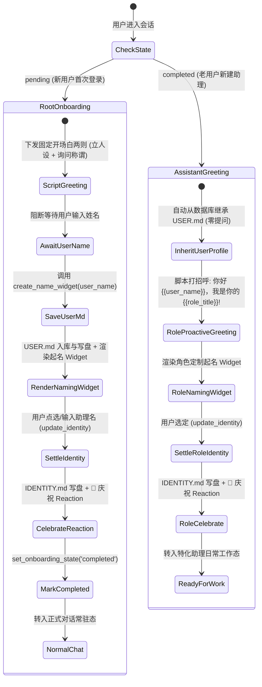

# 技术设计文档：Conversational Onboarding 与双向命名仪式架构设计

**创建日期**：2026-10-01  
**状态**：Approved (已审批)  
**设计目标**：向顶级商业级个人 Agent（Muse）对齐，为 LCA 建立“开场白脚本化、一次一问、点选起名 Widget、双向命名、沉淀入库与 Standing 文件自动注入、新老两阶段继承与终身幂等”的完整迎新架构。

---

## 1. 问题背景与业务价值

当前 LCA 已具备助理 Home（`SOUL.md` / `USER.md` / `IDENTITY.md` / `MEMORY.md`）及用户数据库存储（`user_store.py` 中的 `onboarding_state`），但在用户交互感知上存在关键短板：
1. **冷启动缺乏主动问候**：新建助理后进入空白聊天窗口，没有主动建立人设与打招呼；
2. **缺乏双向仪式感**：没有收集用户真实称谓与习惯，也没有给助理自身命名的互动过程；
3. **交互成本过高**：若纯靠大模型自由聊天问答，用户打字心智负担重，且易受模型幻觉影响；
4. **新老助理体验脱节**：已有用户每次新建助理时，若反复索要姓名会极度打扰；若完全不打招呼又缺乏生机。

本设计基于 Muse 实战经验与 LCA 单向 DDD 架构，提出**两阶段同构流水线**：
- **新用户阶段**：6 步完整迎新（立人设 $\to$ 要名字 $\to$ 写入全局 `USER.md` $\to$ 起名 Widget $\to$ 写入 `IDENTITY.md` $\to$ 庆祝 Reaction $\to$ 终身幂等完成）；
- **老用户新建助理阶段**：100% 自动继承已有的 `USER.md` 画像，新助理仅主动打招呼并弹出特化起名 Widget 定制自身身份，绝不重复索要姓名。

---

## 2. 系统边界与自治等级（AP-01, AP-05）

### 2.1 自治等级
- **Autopilot Level**：`DRAFT`（跨越 contracts、infrastructure、tools、persistence 及 LobeHub 前端补丁，需严格分层实施与测试门禁守卫）。

### 2.2 负向保护边界（Does NOT own）
- **严禁修改**：
  - 宿主机资产与环境，严禁提交外部资产到本仓库；
  - 核心原子枚举与不可变原语（`contracts/atoms/`）；
  - 严禁绕过 `AssistantCatalog.revise_profile` 裸写磁盘文件（杜绝 `_DigestMismatch` 破坏 SSOT）；
  - 严禁篡改 LobeHub 既有 Postgres 表结构（统一经由 LCA 权威 `user_store.py` 承载）；
  - 严禁影响既有存量 310 个 Assistant 的历史上下文与会话连续性。

### 2.3 责任清单（Owns）
- **契约模型**：`lca/contracts/models/onboarding/naming.py`；
- **用户存储增强**：`lca/infrastructure/persistence/user_store.py`（增加 `user_md` 字段与 CRUD 接口）；
- **自管理工具链**：`lca/infrastructure/tools/onboarding/`（`create_name_widget` 与 `update_identity`）；
- **助理创建自动继承**：`lca/contracts/protocols/assistant/catalog.py` 与 `lca/application/assistant/`；
- **前端交互组件补丁**：`deploy/lobehub/patches/ui/assistant_naming_widget.py` 与 `AssistantNamingWidget.tsx`；
- **全链路自动化测试套件**：覆盖契约、数据库、工具、两阶段场景与并发隔离。

---

## 3. 两阶段状态机与数据流拓扑



---

## 4. 核心组件与领域契约设计

### 4.1 强类型契约模型（`lca/contracts/models/onboarding/naming.py`）

```python
from pydantic import BaseModel, ConfigDict, Field


class NamingCandidate(BaseModel):
    """起名候选推荐项。"""

    model_config = ConfigDict(frozen=True, extra="forbid")
    id: str
    name: str
    vibe: str
    emoji: str = "🦉"


class NamingWidgetPayload(BaseModel):
    """起名 Widget 的结构化协议载荷。"""

    model_config = ConfigDict(frozen=True, extra="forbid")
    token: str = Field(description="一次性防重放 token")
    assistant_id: str
    candidates: tuple[NamingCandidate, ...]
    allow_custom: bool = True
    keep_muse: bool = False
```

### 4.2 数据库存储扩展（`lca/infrastructure/persistence/user_store.py`）

在 SQLite 与 Postgres 的 `lca_users` 表增加 `user_md` 列：
```sql
ALTER TABLE lca_users ADD COLUMN IF NOT EXISTS user_md TEXT;
```
扩展方法：
- `update_user_md(user_id: str, user_md: str, display_name: str | None = None) -> None`
- `get_user_md(user_id: str) -> str | None`

### 4.3 自管理工具（Self-Management Tools）

#### 工具一：`onboarding.create_name_widget`
- **参数**：`user_name: str`（必填，用户称谓）；
- **操作**：
  1. 格式化标准 `USER.md`；
  2. 持久化到 `user_store.update_user_md(user_id, user_md)`；
  3. 调 `catalog.revise_profile(assistant_id, ProfilePatch(user_md=user_md))` 更新助理 Home；
  4. 随机生成 2 个候选名字，签发 `embed_token`；
  5. 返回 Observation，带有 `[widget:name_picker?token={token}]` 占位符。

#### 工具二：`onboarding.update_identity`
- **参数**：`name: str`（必填），`vibe: str = ""`，`emoji: str = "🦉"`；
- **操作**：
  1. 组装标准 `IDENTITY.md`；
  2. 调 `catalog.revise_profile` 同步更新 `profile.json.name` 与 `IDENTITY.md`；
  3. 调 `user_store.set_onboarding_state(user_id, "completed")`；
  4. 返回携带 `reaction: "🎉"` 的 Observation。

### 4.4 自动继承机制
在 `AssistantCatalog.create` 中：
```python
if req.seed_user_md is None and req.owner_user_id:
    global_user_md = self._user_store.get_user_md(req.owner_user_id)
    if global_user_md:
        req = replace(req, seed_user_md=global_user_md)
```

---

## 5. 前端交互增强设计（LobeHub UI Patch）

### 5.1 双气泡开场白节奏
- **Bubble 1**：自我介绍与个人 Agent 定位（“我是你的专属个人 Agent，不是普通的问答助手；日常的复杂任务交给我来分担。”）；
- **Bubble 2**：单步询问（“在开始之前，我该怎么称呼你呢？”）；
- 输入框自动获得焦点，引导用户轻松回复。

### 5.2 起名交互卡片（`AssistantNamingWidget.tsx`）
- **视觉**：内嵌式卡片，优雅渐变边框，响应暗色/亮色主题；
- **候选 Chips**：两个采样名字以胶囊按钮呈现（点击即可快速选定并填充输入框）；
- **自定义输入**：带字数校验与即时回车确认；
- **一键确认**：点击“确认命名并启程”，无刷新驱动后端落盘。

### 5.3 仪式感正反馈
- **庆祝 Reaction**：用户消息右上角追加 🎉 动效 Badge；
- **乐观更新**：左侧助理列表的名称与头像即时刷新；
- **无缝转入日常**：卡片优雅收拢为已完成态，Agent 发出顺畅接引问询。

---

## 6. 测试架构与不变量断言矩阵（AP-02）

| 不变量 ID | 核心语义与不变量描述 | 自动化断言标准 |
|---|---|---|
| **INV-01** | **终身幂等性** | `onboarding_state == 'completed'` 后，重入绝不再次触发迎新会话。 |
| **INV-02** | **数据库 SSOT 权威** | 验证 `lca_users.user_md` 与助理私有 `USER.md` 数据完全一致。 |
| **INV-03** | **配置面 Digest 单写** | 必须由 `catalog.revise_profile` 写入，断言 `revision_seq` 递增且零 `_DigestMismatch`。 |
| **INV-04** | **老用户新建助理 100% 自动继承** | 新建特化助理自动拥有老用户画像，不触发“索要姓名”开场白。 |
| **INV-05** | **开场白脚本化确定性** | 首轮迎新会话文本严格等于固定脚本，零模型幻觉与词表漂移。 |
| **INV-06** | **信息血统闭合与 Widget 契约** | `NamingWidgetPayload` 校验严格；非法参数必定 fail-fast 拒绝。 |
| **INV-07** | **落名生效与正向反馈回执** | `update_identity` 后更新 `profile.json` 与 `IDENTITY.md`，回执带 `reaction: "🎉"`。 |
| **INV-08** | **并发会话严格隔离** | 多用户并发迎新，`embed_token`、`USER.md` 与 `IDENTITY.md` 100% 隔离无交叉。 |

---

## 7. 实施计划概览（Task Breakdown）

1. **TASK-1：契约与数据库层**：`NamingCandidate` / `NamingWidgetPayload` 契约落地，`user_store.py` 扩展 `user_md` 持久化与测试；
2. **TASK-2：自管理工具链**：实现 `CreateNameWidgetTool` 与 `UpdateIdentityTool`，接入 `catalog.revise_profile`；
3. **TASK-3：生命周期与继承**：`AssistantCatalog.create` 接入用户画像自动继承，编写新建助理继承测试；
4. **TASK-4：开场白调度与网关**：实现两阶段开场白脚本注入，网关路由与 Reaction 信号桥接；
5. **TASK-5：前端 LobeHub UI 补丁**：实现 `AssistantNamingWidget.tsx` 与补丁挂载，打通点选、提交与 🎉 庆祝动效；
6. **TASK-6：端到端回归验证**：运行全量不变量测试套件（INV-01 ~ INV-08），执行静态门禁检查并推送。
