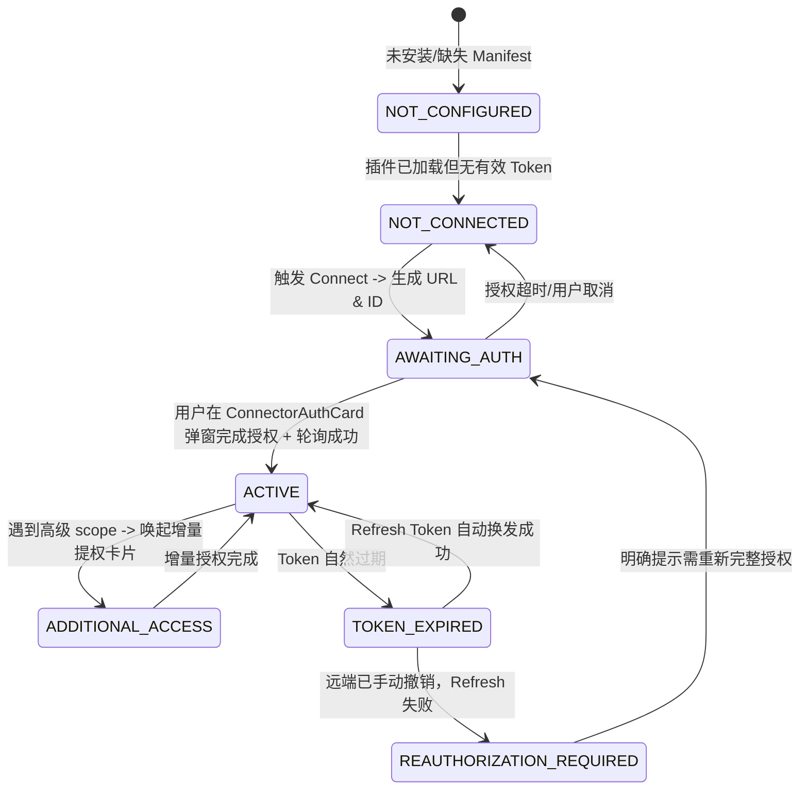

# 工业级 7 层连接器架构设计规范 (Muse Connector Architecture Design)

- **创建日期**: 2026-10-02
- **修订版本**: v1.1 (融合架构硬伤治理与落地防护规范)
- **状态**: Approved (架构定稿)
- **作者**: Antigravity & User

---

## 1. 背景、架构决策与治理基石

### 1.1 历史缺陷与根因双重溯源
在前期真实会话（如 `run_1aed82f56d32`）中，用户在抽屉连接了 GitHub/Gmail 后，对话中询问仓库，Agent 却回应“不知道已连接 GitHub”。
深度溯源查明两大根因：
1. **工具元数据膨胀截断（Tool Metadata Spill）**：
   - 823 个 GitHub 工具 + 51 个 Drive 工具 + 23 个 Gmail 工具全量暴露，在 `tool_search(namespace='ext')` 时远超 2000 字符限制，触发系统保护截断 `...[spilled]`，直接将 `GITHUB_*` 工具切除；
2. **缺乏 Prompt 先验认知注入（Prompt vs Tool Injection Gap）**：
   - Tool 注入解决“如何调用”，Prompt 注入解决“我知道我拥有什么”。系统提示词缺乏先验服务状态段，导致模型在调工具前缺乏现实信念。

### 1.2 架构根治：ADR-0256 延迟加载 (Tool Deferral SSOT)
**不只是加提示词，而是从机制上消灭 900 工具截断：**
- **严禁全量挂载**：外部连接器工具严格归入 `ext` 命名空间，并受 [ADR-0256](docs/adr/0256-tool-namespace-deferral.md) 治理，默认标记为 `defer: true`，绝不注入 Base System Prompt；
- **CLI 快捷语法收敛**：Agent 优先使用连接器精简快捷命令（`+read`、`+search`、`+send`），零元数据负担；
- **按需加载检索**：当确实需要特定 raw API 时，`tool_search(namespace='ext', query='...')` 仅精准检索并物化 3~5 个匹配工具，彻底杜绝 `...[spilled]` 溢出截断。

### 1.3 ADR：Composio 选型决策、凭据分级与退出策略 (Exit Strategy)
- **为什么当前选用 Composio？**
  - **开发效率与生态聚合**：一次对接即可获得 Google、GitHub、Slack 等 30+ 外部服务统一的 OAuth 流程，规避前期为每个服务重复维护客户端注册与刷新队列；
- **凭据分级与存储边界 (File as SSOT)**：
  - **安全边界划分**：OAuth 真实 Token 保留在 Composio 安全 Vault 或运行时沙箱，**绝对不写入**本地明文 JSON 文件；
  - **本地用户域 (`~/.lca/users/<user_id>/connectors/`)**：
    - `connections.json`：**仅存储非敏感元数据**（`service`, `account_id`, `state`, `connection_id`, `auth_url`, `scopes`）；
    - `permissions.json`：存储用户细粒度 Action 开关（Allow / Ask / Deny）；
  - **并发写与原子性保证**：所有本地 JSON 写入强制执行 `atomic_write_json`（写临时文件 + `os.replace`），杜绝并发写入损坏文件；
- **退出策略（Vendor Lock-in 免疫）**：
  - 架构抽象出 `OAuthProviderProtocol` 隔离 Seam：Composio 仅作为该协议的一个实现适配器（`ComposioOAuthAdapter`）；
  - 后续若需完全自建私有 OAuth，仅需编写 `NativeGoogleOAuthAdapter` / `NativeGitHubOAuthAdapter` 替换该适配器，上层 CLI、状态机、权限层、SKILL.md 及 LobeHub 卡片组件**零改动无缝切换**。

---

## 2. 系统边界、自治等级与拓扑架构

### 2.1 边界声明 (AP-01 负向边界)
- **Owns (本架构负责)**：
  - 连接器完整运行时（状态机、滑动窗口硬配额、双层正交权限拦截器）；
  - 本地 CLI 命令封装、`manifest.yaml` 规范与自动化 `SKILL.md` 物化；
  - 会话流中与 LobeHub `ConnectorAuthCard` 交互卡片协议闭环；
  - 启动阶段带预算保护的 `ConnectedServicesSection` 提示词感知注入。
- **Does NOT Own (本架构严禁侵入)**：
  - 认知主循环（`lca/cognition/` 核心五阶段状态机保持不可变）；
  - LobeHub 官方源码仓库（仅允许在 `deploy/lobehub/patches/` 声明式补丁中协同）；
  - 宿主机系统级运维、网络基础设施或 `~/everything-library` 外部资产。

### 2.2 四大正交守卫拓扑
配额与连接状态是正交维度（配额管每分钟限额，状态机管连接身份）：
```
Agent 认知决策 (Think) 
      │
      ▼
[1. 状态机守卫] ──(未连接/需撤销重连)──> 唤起 LobeHub ConnectorAuthCard 卡片 ──> 挂起等待
      │ (已连接 ACTIVE)
      ▼
[2. 权限层守卫] ──(Scope缺失)──> 唤起增量提权卡片 (mode=add_scope)
      │ (Scope满足)
      ├──(Action DENY)──> 直接拒绝 (ActionPermissionDeniedError)
      ├──(Action ASK)───> 唤起 LobeHub 审批卡片 (等待用户确认)
      │ (Action ALLOW)
      ▼
[3. 配额器守卫 (独立)] ──(超限)──> 结构化阻断并返回 retry_after_seconds
      │ (在窗口内)
      ▼
[4. 凭证库与隔离执行器] ──(安全管道注入 Token)──> 独立 CLI 进程执行 ──> 返回 Effect Receipt
```

---

## 3. 连接状态机与 LobeHub 交互卡片协议

### 3.1 纯净连接状态机（剥离配额维度）


- **状态说明**：
  - `NOT_CONNECTED`: 尚未连接；
  - `AWAITING_AUTH`: 等待用户授权并轮询中；
  - `ACTIVE`: 凭据可用；
  - `ADDITIONAL_ACCESS`: 触发增量授权；
  - `TOKEN_EXPIRED`: 自然过期（后台自动 refresh）；
  - `REAUTHORIZATION_REQUIRED`: 授权被用户在 Provider 侧手动吊销，**禁止死循环重试**，必须明确提示用户重新建立授权。

### 3.2 LobeHub `ConnectorAuthCard` 交互闭环契约
1. **CLI 结构化拦截**：
   - 处于未连接或提权状态时，CLI 返回结构化数据并附带卡片标记；
2. **卡片协议与增量提权语法扩展**：
   - 初始连接：
     ```text
     [widget:connector_auth?appName=Gmail&authUrl=<authUrl>&connectionId=<connId>&mode=initial]
     ```
   - 增量提权：
     ```text
     [widget:connector_auth?appName=Gmail&authUrl=<authUrl>&connectionId=<connId>&mode=add_scope&scope=gmail.send]
     ```
3. **前端轮询超时与退避机制（`ConnectorAuthCard.tsx`）**：
   - **阶梯退避**：初始 2.5s 轮询，持续未成功则递增至 5s、10s；
   - **5 分钟硬超时**：超时后终止轮询，卡片状态切换为“授权超时，点击重新检测”，避免无限消耗服务端请求。

---

## 4. 双层正交权限、写操作双保险与预算控制

### 4.1 双层正交权限
- **第一层：Provider 远端 Scope**（粗粒度底层通行证）；
- **第二层：LCA 本地 Action 规则**（细粒度业务开关）：
  - 存储于 `~/.lca/users/<user_id>/connectors/permissions.json`；
  - `ALLOW`: 直接放行；
  - `ASK`: 敏感写操作，拦截并唤起审批卡片；
  - `DENY`: 彻底禁用；
  - 变更即时生效，无需重新 OAuth。

### 4.2 写操作双保险安全红线 (Two-Phase Write)
1. **Token 永不进 Agent 提示词、上下文、日志或文件**；
2. **写操作强制 `--upload <staged_file>` 暂存**：
   - 发送长内容/改动时，禁止直接命令行参数传参，必须先写入本地临时文件；
   - 审批卡片渲染该暂存文件的预览，经用户批准后 CLI 再读取该文件提交。

### 4.3 滑动窗口硬配额执行器 (Rate Limiter)
- 60 秒滑动窗口，超限即时阻断并返回 `status: connector_rate_limited` 与精确的 `retry_after_seconds`；
- SKILL.md 注入“成本指南”，指导 Agent 串行调用、小批次拉取。

### 4.4 `ConnectedServicesSection` 预算与排序规则
- **固定 100-token 预算上限**：
- 按最近活跃度（LRU）或优先级排序，最多渲染前 5 个服务；
- 超出部分折叠追加 `(+N more services connected)`，确保无论连接 3 个还是 20 个服务，均不挤占核心推理上下文。

---

## 5. 核心测试不变量断言矩阵 (INV-01 ~ INV-08)

为了彻底避免断言 LLM 输出文本带来的脆弱性，我们将原 INV-03 拆分为两条确定性工程测试，模型真实输出移入 eval 阶段：

- **INV-01 (Token 零暴露)**: Pydantic 模型严格 `extra="forbid"` 拒绝密钥字段，Prompt 与日志无 Token 明文；
- **INV-02 (状态机确定性)**: 状态机流转确定；未连接调用 CLI 必须返回结构化 `not_connected`；
- **INV-03A (CLI 结构化协议契约)**: 未连接或提权时，CLI 返回对象必须包含合法 `[widget:connector_auth?...]` 标记；
- **INV-03B (Skill 生成器卡片协议契约)**: 自动物化的 `SKILL.md` 必须声明卡片插桩语法，且显式声明禁止使用裸 Markdown 链接；
- **INV-04 (双层权限硬拦截)**: Action 为 `DENY` 必抛 `ActionPermissionDeniedError`；`ASK` 必返回审批等待；
- **INV-05 (硬限流窗口拦截)**: 60 秒滑动窗口超标拦截率 100%，必须携带准确的 `retry_after_seconds`；
- **INV-06 (写操作文件暂存)**: `+send` 等高危写命令缺失 `--upload` 时 100% 阻断；
- **INV-07 (多账号强隔离)**: `--account <id>` 路由隔离，禁止跨账号污染；
- **INV-08 (负向边界遵从)**: 变更文件集合严格限定在连接器运行时扩展层，禁止侵入认知五阶段核心代码。
