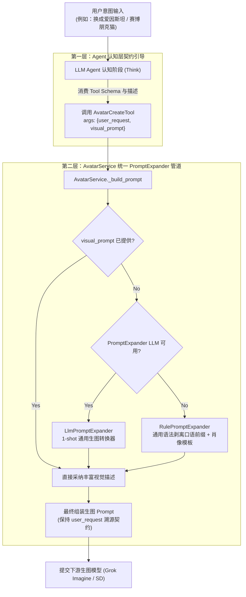

# 系统性消除硬编码：通用头像提示词扩写机制架构设计 (Avatar Generic Prompt Expansion Design)

**Author:** Antigravity  
**Date:** 2026-10-03  
**Status:** Approved  
**Autopilot Level:** DRAFT -> AUTOPILOT  

---

## 1. 目标与第一性原理

### 1.1 根本矛盾
下游生图大模型（Grok Imagine / Midjourney / Stable Diffusion）需要**高度结构化、富视觉细节的提示词（Visual Prompts）**——包括主体面部轮廓、年龄特征、服饰材质、艺术媒介、光照氛围与居中构图。而人类用户的输入通常是**自然语言长句或口语指令**（如“我想修改你的形象和头像，改成：弗洛伊德”、“换成爱因斯坦”、“来个赛博朋克猫咪”）。

若直接将口语对话拼接进生图提示词，或将旧形象属性（如“心理学家”）强行叠加在新人物上，会导致生图模型语义漂移，生成不相关的随机图像（如灯塔、菜市场、窗台猫）。

### 1.2 拒绝硬编码反模式
严禁在代码中引入 `_KNOWN_FIGURE_MAP` 等特例人物字典（如“弗洛伊德 -> 肖像描述”）。现实世界的人物、角色、动物与艺术风格无穷无尽，硬编码特例是典型的架构反模式（AP-01 / AP-02），无法应对新需求。

### 1.3 核心解法：双层机制闭环
采用**双层机制（Two-Tier Mechanism）**彻底实现通用化与自适应：
1. **Tier 1 (Agent 认知层语义扩写)**：在 `avatar_create` 与 `avatar_edit` 工具参数契约中将 `visual_prompt` 明确为 Agent 必须执行的画面扩写任务。Frontier Agent 自身具备强大的通识世界知识与视觉工程能力，在调用工具时将任意意图（无论是爱因斯坦、达芬奇、动漫角色、赛博朋克猫还是水墨道士）直接扩写为高精度视觉特征。
2. **Tier 2 (AvatarService 通用 PromptExpander 管道与确定性兜底)**：在服务层建立抽象的 `PromptExpander` 管道。
   - 若 Agent 已提供 `visual_prompt`，直接采纳；
   - 若由 REST API 或未展开提示词的轻量模型调用，且配置了 LLM，则调用极简通识 1-shot 提示词转换器；
   - 若无 LLM 可用，由通用语法清理器（RulePromptExpander）剥离口语前缀并格式化为标准肖像模版，**全链路零特例硬编码**。

---

## 2. 详细组件设计



### 2.1 契约与协议 (`lca/plugins/avatar/expander.py`)
```python
class PromptExpander(Protocol):
    """通用头像生图提示词扩写器契约。"""

    async def expand(self, user_request: str) -> str:
        """将用户自然语言/口语请求转换为生图模型可理解的视觉描述。"""
        ...
```

- **`LlmPromptExpander`**：
  接收可调用的 LLM 函数（`Callable[[str], Awaitable[str] | str]`）。
  System instruction：
  `"You are an expert avatar prompt engineer. Convert the user's avatar request into a detailed, high-quality text-to-image prompt (subject appearance, distinctive facial traits, attire, lighting, style, centered composition). Output only the English prompt."`
- **`RulePromptExpander`**：
  纯确定性离线兜底，**绝无实体字典**。
  使用通用前缀正则（如 `^(我想|请帮我|给我|麻烦)?(修改|调整|更换|换成|变成|改成|要一个|做个|画一个|：|:)+`）提取主体概念，格式化为：
  `"Close-up avatar portrait of {extracted_subject}, highly detailed character design, professional studio lighting, centered composition, high quality"`。

### 2.2 服务层改造 (`lca/plugins/avatar/service.py`)
- **彻底删除 `_KNOWN_FIGURE_MAP` 字典**以及任何特定人名（如“弗洛伊德”）的写死逻辑。
- 在 `AvatarService` 中接入 `PromptExpander` 实例（若未注入则默认初始化 `RulePromptExpander`）。
- `_build_prompt` 逻辑更新：
  ```python
  visual_focus = visual_prompt or await self.expander.expand(user_request)
  ```
- 身份特征解耦：若用户发起了新形象意图（`is_new_character_intent`），旧助理的 `Identity traits` 不作为主要视觉特征覆盖，防止“心理学家”污染“赛博朋克猫”。

### 2.3 工具层契约增强 (`lca/plugins/avatar/tools.py`)
- `AvatarCreateTool` 与 `AvatarEditTool`：
  - 更新 `description`：清晰指引调用者根据用户诉求生成丰富视觉特征（主体面部特征、衣着神态、艺术媒介、光照与构图）；
  - 更新 `parameters`：明确 `visual_prompt` 的定位；
  - 返回 payload 保持 `widget_tag: "[widget:avatar_picker]"` 与 `display_instruction`。

---

## 3. 边界与自治保护 (AP-01 & AP-05)

### 3.1 明确边界清单
- **Owns (本次涵盖范围)**:
  - `lca/plugins/avatar/expander.py`
  - `lca/plugins/avatar/service.py`
  - `lca/plugins/avatar/tools.py`
  - `lca/plugins/avatar/plugin.py`
  - `tests/plugins/avatar/test_expander.py`
  - `tests/plugins/avatar/test_prompt_contract.py`
  - `tests/plugins/avatar/test_tools.py`
- **Does NOT own (严格禁止触碰)**:
  - 严禁触碰 `lca/nodes/`、`lca/domain/`、`lca/infrastructure/` 中与 avatar 无关的任何代码；
  - 严禁触碰 `lobehub-ui/` 前端文件；
  - 严禁引入外部重型第三方自然语言库；
  - 严禁修改已验证通过的 `routes.py`（`_resolve_assistant_id`）与前端卡片挂载机制。

### 3.2 自治等级
- **AUTOPILOT**：计划审批后以单流 TDD 模式有序推进，自动化验证驱动，无需频繁打扰用户。

---

## 4. 自动化测试不变量矩阵 (Invariants to Test, AP-02)

| 不变量 ID | 不变量描述 | 自动化断言与验证方法 |
|---|---|---|
| `INV-AVATAR-ZERO-HARDCODE` | `lca/plugins/avatar/` 代码中没有任何特例人物映射字典 | 编写 AST 语法树分析测试，扫描所有模块的全局变量与字典，断言不存在 `_KNOWN_FIGURE_MAP` 或类似映射表 |
| `INV-AVATAR-ARBITRARY-FIGURES` | 机制化扩写支持任意人物、动物与抽象艺术风格 | 参数化测试：“爱因斯坦”、“鲁迅”、“赛博朋克猫”、“水墨道士”、“戴墨镜的柴犬”，断言均能产出结构化视觉提示词 |
| `INV-AVATAR-TOOL-CONTRACT` | 工具入参及描述显式指导 Agent 展开视觉细节 | 断言工具 parameters 与 description 中包含视觉扩写规则与 `visual_prompt` 字段 |
| `INV-AVATAR-DETERMINISTIC-CLEANER` | 无 LLM 纯离线兜底模式下，通用语法清理器稳定提取主体 | 参数化测试覆盖 6 种以上典型口语对话句式，断言主体实体提取率 100% 且无残余口语助词 |
| `INV-AVATAR-ADR0271-C3` | 组装后的 prompt 始终保留 user_request 原文满足审计溯源 | 契约测试验证 `candidate.prompt` 或关联上下文严格符合 ADR-0271 溯源约束 |
