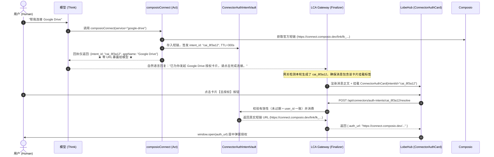

# Connector Capability Intent & Zero URL Model Exposure Architecture Design

> **Author**: Antigravity & User Pairing  
> **Date**: 2026-10-04  
> **Topic**: 携带能力的外部凭据与授权链接零模型穿透（Capability Reference）与确定性带外卡片挂载机制  
> **Autopilot Ladder**: `DRAFT` (AP-05)  
> **Status**: APPROVED by User

---

## 1. 背景与第一性原理推导

在近期真实会话执行与调试排查中（涵盖 `run_61bb49e2e068` 与 `run_ff2938984e44` 等），暴露出以下两项系统性机制断层：

1. **认知层与表现层的职责倒挂（脆弱的“求模型抄标签”模式）**：
   - 传统模式下，工具执行后在 Observation 文本中吐出自定义卡片标签 `[widget:connector_auth?...]` 以及敏感真实 URL；
   - 系统寄希望于 LLM 在下一轮思考中“原样照抄”该卡片标签，并在 Prompt 中堆叠“严禁倾倒裸 URL”、“必须输出 widget 标签”等脆弱的格式约束；
   - 实际运行中，LLM 极易把该标签当成系统内部元数据过滤掉，或者自作聪明地从 Observation 提取裸 URL 格式化为 Markdown 链接回复给用户；
   - 当用户进一步追问“链接从哪里来的”时，甚至引发模型的“自责幻觉”（模型误以为自己违反了“严禁脑补 URL”铁律，陷入反复认错和重复调用的恶性循环）。

2. **高危特权链接穿透模型上下文的安全违例**：
   - OAuth 授权短链（如 Composio 生成的 `https://connect.composio.dev/link/lk_...`）本质上是携带高危特权的 **Bearer Token / Capability**，拥有者点击即可完成凭证绑定；
   - 将此类 URL 流经 LLM，不仅让高危敏感凭据散落在 Prompt Context、Completion Tokens、Session 日志、Spine Events 与第三方推理日志中，还违反了 LCA Secure Vault 的核心隔离准则。

### 核心架构原则推导（第一性原理）：
> **“携带能力的外部凭据与动态 URL（OAuth 授权、预签名下载/写入、免密登录与重置凭据）属于特权 Capability，严禁直接流经大语言模型与对话 Context；执行层必须将其暂存并下发不可篡改的短凭据引用（Capability Intent）；表现层经由带外通道换取真身并单次消费。普通只读/公开 URL（文档、官网）不受此限。”**

---

## 2. 架构负向边界与自治阶梯 (AP-01 & AP-05)

### 2.1 Mandatory Boundaries (AP-01)
* **Owns（本设计负责实现与修改的范围）**：
  1. **契约模型与数据结构**：
     - 在 `lca/contracts/models/connectors/intent.py` 定义不可变领域模型 `ConnectorAuthIntent`（frozen、`extra="forbid"`）；
  2. **基础设施层：Intent 凭据暂存服务 (`ConnectorAuthIntentVault`)**：
     - 在 `lca/infrastructure/connectors/core/intent_vault.py` 实现内存/TTL 凭据保险箱，接收真实 OAuth 授权链接并签发 `intent_id`（默认 300s TTL、按 `user_id` 严格多租户隔离、消费审计）；
  3. **传输层带外解析端点 (`POST /api/connectors/auth-intents/{intent_id}/resolve`)**：
     - 在 `lca/plugins/transport/webserver/routes_composio.py` 暴露轻量解析接口，供前端在用户点击卡片时异步换取一次性真实 URL；
  4. **工具回执与适配层纯净化（Zero URL Exposure）**：
     - `composioConnect` 与 `ConnectorPreExecutionGuard` 的 Observation 回执彻底剔除裸 URL，仅吐出结构化 `intent_id` 与不含敏感链接的卡片元数据；
  5. **网关层绝对确定性卡片兜底保底**：
     - 在 `run_session_writer` 或消息投影层，若本轮 step 产生了未消费的 `intent_id` 且模型回复中缺失 `[widget:connector_auth`，网关自动在 content 尾部追加 `[widget:connector_auth?intentId=...]`，保证卡片 100% 出现；
  6. **前端补丁 `ConnectorAuthCard.tsx` 异步解析时序**：
     - 在 `deploy/lobehub/patches/ui/` 扩展卡片组件，支持凭 `intentId` 异步换取 URL 并弹窗；清除脆弱的 URL 正则匹配；
  7. **架构决策记录**：沉淀 `docs/adr/0280-zero-model-exposure-for-capable-urls.md` 并注册索引；
  8. **自动化测试套件**：覆盖 INV-CAP-01 至 INV-CAP-06 全量不变量。

* **Does NOT own（严格禁止修改的负向边界）**：
  1. 严禁改动普通无特权只读链接处理（普通文档、GitHub 开源仓库等只读 URL 不受限）；
  2. 严禁修改已连接后的外部工具执行链路（连接成功后依然基于用户 SSOT 文件驱动）；
  3. 严禁直接改动 `lobehub-ui/` 源码（所有前端变动严格经由 `deploy/lobehub/patches/` 声明式补丁落地，保持 100% byte-identical 可逆守卫）；
  4. 严禁改动宿主机系统网络、运维脚本与外部资产。

### 2.2 Autopilot Level (AP-05)
* 定级为 **`DRAFT`**。单流渐进式开发，必须经由单元测试、契约测试、补丁一致性与端到端回归断言验证。

---

## 3. 详细设计与核心机制

### 3.1 核心架构拓扑与交互时序



### 3.2 契约模型与数据结构 (`lca/contracts/models/connectors/intent.py`)

```python
from pydantic import BaseModel, ConfigDict

class ConnectorAuthIntent(BaseModel):
    model_config = ConfigDict(frozen=True, extra="forbid")

    intent_id: str           # "cai_" + 12位随机ID，如 "cai_7d9e2b1f4a0c"
    service: str             # 如 "google-drive" / "gmail"
    app_name: str            # 如 "Google Drive" / "Gmail"
    auth_url: str            # 真实敏感短链（仅保存在 Vault，绝不下发给 LLM）
    connection_id: str       # 关联的第三方连接/实例 ID
    user_id: str             # 绑定的当前用户 ID（实现用户主权多租户物理隔离）
    created_at: float        # 生成时间戳
    expires_at: float        # 到期时间戳（默认 created_at + 300秒 / 5分钟）
    consumed: bool = False   # 是否已由前端换取
```

### 3.3 凭据保险箱 (`ConnectorAuthIntentVault`)
- **内存存储与并发互斥**：内部维护带互斥锁的字典映射；
- **TTL 自动失效**：每次读写时惰性驱逐超过 `expires_at` 的条目；
- **多租户安全拦截**：`resolve_intent(intent_id, user_id)` 必须校验入参 `user_id` 与记录中的 `user_id` 完全一致，防范水平越权；
- **单例注册**：作为全局单例注入传输层与工具层。

### 3.4 传输层端点与错误状态
- 路由路径：`POST /api/connectors/auth-intents/{intent_id}/resolve`
- 鉴权：从 Header `X-User-ID` 或当前 session 获取用户身份；
- 状态码：
  - `200 OK`: `{ "auth_url": "...", "app_name": "Google Drive", "connection_id": "..." }`
  - `404 Not Found`: intent 不存在或已被消费；
  - `410 Gone`: intent 已超时失效；
  - `403 Forbidden`: 越权访问其他用户的 intent。

### 3.5 网关确定性保底挂载 (C4/C10 闭环)
为杜绝“模型思考后完全不输出任何内容或遗漏标签”，网关在将 Assistant Message 投影持久化与下发前端前：
1. 检查当前 Step 的 Tool Observations 是否包含未挂载的 `intent_id`；
2. 若模型输出正文中未包含 `[widget:connector_auth`，网关在 `content` 末尾追加：
   `\n\n[widget:connector_auth?intentId={intent_id}&appName={quote(app_name)}]`
3. 确保前端收到的消息无论模型如何发挥，必定 100% 携带交互卡片。

---

## 4. 自动化测试不变量矩阵 (AP-02)

| 不变量编号 | 核心断言与守护机制 | 对应测试文件 |
|---|---|---|
| **INV-CAP-01 (零 URL 穿透与凭据隐匿)** | 工具 Observation、Payload、LLM Context 及 Prompt 组装文本中，**严禁出现以 `http://` 或 `https://` 开头的敏感 OAuth 授权链接**，只允许暴露 `intent_id`。 | `tests/connectors/test_zero_model_url_leakage.py` |
| **INV-CAP-02 (Intent 生命周期与用户隔离)** | Intent 严格限制 300s TTL；跨用户（`user_id` 不符）解析直接抛权限异常；过期后解析严格返回失效；单例生命周期有保障。 | `tests/connectors/test_auth_intent_vault.py` |
| **INV-CAP-03 (Resolve 路由契约)** | `POST /api/connectors/auth-intents/{id}/resolve` 正常解析返回 `200` + 真实 URL；过期返回 `410`；未登录或越权返回 `403`。 | `tests/transport/test_routes_auth_intents.py` |
| **INV-CAP-04 (网关确定性卡片兜底保底)** | 当模拟模型输出纯文本（甚至漏掉 widget 标签）时，网关在投递给会话消息时自动补齐该轮工具生成的 `[widget:connector_auth?intentId=...]`，断言前端消息必含卡片。 | `tests/runtime/test_gateway_intent_widget_fallback.py` |
| **INV-CAP-05 (前端补丁与交互一致性)** | `ConnectorAuthCard.tsx` 支持 `intentId` 异步兑换时序；补丁符合 100% byte-identical 门禁；彻底清除旧 URL 正则。 | `tests/deploy/test_connector_auth_card_patch.py` |
| **INV-CAP-06 (全链路端到端闭环验收)** | 模拟“连接 Google Drive”全流程：工具生成 Intent → 0 个 URL 流经模型 → 网关确定性挂载卡片 → 前端凭 Intent 兑换 URL 并弹窗 → 状态同步完成。 | `tests/scenario/test_connector_capability_intent_e2e.py` |

---

## 5. 架构决策记录 (ADR-0280) 规划

* **文件**：`docs/adr/0280-zero-model-exposure-for-capable-urls.md`
* **标题**：`ADR-0280: 携带能力的外部凭据与链接零模型穿透（Capability Reference）`
* **状态**：Proposed / Implemented alongside this plan.
