# 代码库深度架构加深与接缝收敛设计规范 (第二轮 - Round 2)

**日期**：2026-10-05  
**自治等级**：`DRAFT` (AP-05)  
**触发来源**：`improve-codebase-architecture` 第二轮架构扫描与四阶段深度演进  
**状态**：已批准 (Approved)

---

## 1. 架构背景与第一性原理

在 Round 1 成功收敛 Transport 终态生命周期、Assistant Tools 统一写拦截 Seam、Cron 多租户索引与 ContextFiles 同步模块之后，智能体代码库内部仍残留若干由历史过度微拆分（如 ADR-0105）导致的结构性坏味道：

1. **Shallow Micro-Packages (极浅微包)**：仅包含单文件、单类或数十行逻辑的子目录配单行 `__init__.py`，严重破坏模块深度（John Ousterhout: *Modules should be deep, interfaces much simpler than implementations*）。
2. **Tautological Packaging (`x/x.py` 套娃结构)**：如 `ingest/cache/cache.py`、`ingest/service/service.py`，并附带多层毫无额外逻辑的再导出门面（`ingest/ingest/ingest.py` 与 `ingest/__init__.py` 双重转发）。
3. **Residual COMPAT Shims (跨 PR 滞留垫片)**：重构落地后未清理转发文件，导致新旧路径混杂，违反 LCA“COMPAT shim 同 PR 必删”纪律。
4. **Repeated Ad-Hoc Construction (工具层重复零散构造)**：工具执行每次临时创建存储与领域目录实例，缺乏基类统一的高杠杆访问接缝。

---

## 2. 严格职责与所有权边界 (Owns vs. Does NOT own, AP-01)

### 2.1 本方案拥有 (Owns)
1. **Phase 1 (Cognition DecisionGates)**：收拢 [`lca/cognition/brain/decision_gates/`](file:///home/lichao/layered-cognitive-agent/lca/cognition/brain/decision_gates/) 下 10 个微目录，收敛为平铺的高内聚策略模块；保留顶层统一导出门面，更新调用方与测试。
2. **Phase 2 (Transport Ingest Pipeline)**：收拢 [`lca/plugins/transport/webserver/handlers/runs/ingest/`](file:///home/lichao/layered-cognitive-agent/lca/plugins/transport/webserver/handlers/runs/ingest/) 下 8 个套娃微目录，消除重复再导出，收敛为平铺深度模块（`models.py`, `cache.py`, `policy.py`, `fetcher.py`, `service.py`）。
3. **Phase 3 (ContextFiles Shims & Memory Tools)**：物理切除 `contextfiles` 遗留的 `domain/diff.py`, `domain/edit.py`, `service/memory_edit_sync.py` 转发垫片；并在 [`memory_tools.py`](file:///home/lichao/layered-cognitive-agent/lca/infrastructure/tools/assistant/memory_tools.py) 的 `_BaseMemoryTool` 中建立统一的目录与存储复用接缝。
4. **Phase 4 (Transport Read Runs)**：收拢 [`lca/plugins/transport/webserver/read/runs/`](file:///home/lichao/layered-cognitive-agent/lca/plugins/transport/webserver/read/runs/) 下分散在 8 个微目录的读侧运行投影，收敛为 4 个高杠杆深度模块（`terminal.py`, `live.py`, `evidence.py`, `identity.py`），切除微目录。

### 2.2 本方案严禁触碰 (Does NOT own)
1. **严禁修改认知图声明与拓扑**：禁止变动 `bundles/*.yaml` 或触碰 `lca/nodes/` 认知图节点的注册语义与五相闭集事件（C1, C11, C14）。
2. **严禁修改公共数据 Contracts**：不改动 `lca/contracts/models/` 已冻结的公共 Protocol 与 DTO 字段（如 `Decision`, `CommandEnvelope`, `EffectReceipt`）。
3. **严禁留存跨 PR 兼容垫片**：严禁编写没有明确删除时机的 forwarding shims 或留下未清理的死 import（LCA COMPAT 铁律）。
4. **严禁跨子系统混合提交**：每个 Phase 必须是自闭环的原子提交，包含源码、调用方更新与全绿的单测。
5. **严禁提交宿主机/外部资产**：所有改动严格限定在 LCA 代码仓本身。

---

## 3. 四阶段深度架构设计

```mermaid
flowchart TD
    subgraph P1["Phase 1: DecisionGates 微目录扁平化"]
        direction LR
        G1["artifact/<br>repeat/<br>terminal/<br>delivery/<br>chained/"] & G2["must/<br>auth/<br>tool/<br>progress/<br>loop/"]
        -->|扁平化合并| FlatGates["decision_gates/<br>(chained.py, repeat.py, loop_guards.py, delivery.py, terminal.py, artifact.py, auth.py, consult.py)"]
        FlatGates -->|统一门面| InitGate["decision_gates/__init__.py"]
    end

    subgraph P2["Phase 2: Transport Ingest 流水线深度收拢"]
        direction LR
        I1["cache/cache.py<br>fetcher/fetcher.py<br>integrity/integrity.py"] & I2["ingress/ingress.py<br>service/service.py<br>models/models.py"] & I3["ingest/ingest/ingest.py<br>(冗余双重门面)"]
        -->|切除套娃收敛| IngestMod["handlers/runs/ingest/<br>(models.py, cache.py, policy.py, fetcher.py, service.py)"]
        IngestMod -->|唯一入口| IngestInit["ingest/__init__.py"]
    end

    subgraph P3["Phase 3: ContextFiles 滞留垫片清零与 MemoryTools 接缝"]
        direction LR
        Shims["domain/diff.py<br>domain/edit.py<br>service/memory_edit_sync.py"] -->|物理删除| CleanCF["直接引用 contextfiles/sync.py"]
        BaseMem["_BaseMemoryTool 增加<br>_file_store, _sidechat_dir, _people_dir, _groups_dir"] -->|复用消除冗余| MemTools["MemorySearch / Add / Note 诸工具"]
    end

    subgraph P4["Phase 4: Read Runs 读侧微目录收拢"]
        direction LR
        R1["terminal/ (3 files)<br>live/ (1 file)<br>step/ (1 file)"] & R2["error/ (1 file)<br>failure/ (1 file)<br>evidence/ (1 file)<br>identity/ (1 file)"]
        -->|深度收敛| ReadMods["read/runs/<br>(terminal.py, live.py, evidence.py, identity.py)"]
    end
```



### 3.1 Phase 1：Cognition DecisionGates 微目录扁平化
* **收敛前**：
  * 10 个子目录（`artifact`, `auth`, `chained`, `delivery`, `loop`, `must`, `office`, `progress`, `repeat`, `terminal`, `tool`），每个目录含 1 行 `__init__.py` 与 1 个单一源码文件。
* **收敛后**：
  * 平铺在 `lca/cognition/brain/decision_gates/`：
    * `chained.py`：`ChainedDecisionGate`, `record_gate_decided`
    * `repeat.py`：`RepeatToolCallGate`
    * `loop_guards.py`：`ToolLoopBreakerGate`, `ProgressLoopDetector`
    * `multi_tool_loop.py`：`MultiToolLoopBreakerGate`, `tool_call_fingerprint`
    * `delivery.py`：`DeliverySatisfiedGate`
    * `terminal.py`：`TerminalRespondGate`
    * `artifact.py`：`ArtifactRespondInjector`
    * `auth.py`：`AuthUrlProvenanceGate`
    * `consult.py`：`MustConsultAllMembers`
    * `office.py`：`OfficeWorksSealer`
  * 顶层 `__init__.py` 导出全部符号，保持外部通过 `from lca.cognition.brain.decision_gates import ...` 的绝对稳定性。切除 10 个微目录。

### 3.2 Phase 2：Transport Ingest 流水线深度收拢
* **收敛前**：
  * 8 个子目录，每个 `x/x.py` 结构；外加 `ingest/ingest/ingest.py` 兼容门面与 `ingest/__init__.py` 双重再导出。
* **收敛后**：
  * 结构平铺于 `lca/plugins/transport/webserver/handlers/runs/ingest/`：
    * `models.py`：数据模型、常量、设置与异常
    * `cache.py`：缓存实现与全局单例管理
    * `policy.py`：SSRF 与安全 URL 校验
    * `fetcher.py`：HTTP 文件下载器与内容散列/完整性校验（合并原 `fetcher` 与 `integrity`）
    * `service.py`：文件引用解析、选择与拉取业务协调（合并原 `ingress` 与 `service`）
  * 顶层 `__init__.py` 维护公开契约接口；删除冗余的 `ingest/ingest/ingest.py` 与 8 个微目录。

### 3.3 Phase 3：ContextFiles 滞留垫片清零与 MemoryTools 接缝
* **收敛前**：
  * `domain/diff.py`、`domain/edit.py`、`service/memory_edit_sync.py` 仍作为旧转发垫片存在，被 `watch.py` 和 `memory_tools.py` 引用。
  * `memory_tools.py` 各子工具在执行时重复初始化 `DiskFileStore` 及 `SideChatDirectory`、`PeopleDirectory`、`GroupsDirectory`。
* **收敛后**：
  * 所有调用方直接引用 `contextfiles/sync.py`；物理删除上述 3 个垫片文件。
  * 在 `_BaseMemoryTool` 提供高杠杆只读属性：
    ```python
    @property
    def _file_store(self) -> DiskFileStore: ...
    @property
    def _sidechat_dir(self) -> SideChatDirectory: ...
    @property
    def _people_dir(self) -> PeopleDirectory: ...
    @property
    def _groups_dir(self) -> GroupsDirectory: ...
    ```
  * 子工具统一调用上述属性，切除临时零散实例化，提高内聚度与运行效率。

### 3.4 Phase 4：Transport Read Runs 读侧微目录收拢
* **收敛前**：
  * 读侧运行投影分散在 8 个微目录，`terminal/` 内有 3 个微文件，`evidence`, `error`, `failure`, `live`, `step`, `identity`, `journal` 各占一个微目录。
* **收敛后**：
  * 在 `lca/plugins/transport/webserver/read/runs/` 下建立 4 个深度模块：
    * `terminal.py`：终态物化、终端生命周期查询与兼容
    * `live.py`：活跃状态流、步骤树刷写与日记投影绑定
    * `evidence.py`：证据提取、失败诊断与格式化展现
    * `identity.py`：会话身份检索与元数据
  * 顶层 `__init__.py` 导出常用读操作接口，切除 8 个微目录。

---

## 4. 测试不变量矩阵与实施验收 (AP-02)

| 不变量编号 | 归属阶段 | 核心验证断言 (Invariant Assertion) | 自动化测试落脚点 |
|---|---|---|---|
| **INV-ARCH-08** | Phase 1 (DecisionGates) | 默认工作区 Gate 链（`build_default_workspace_gate_chain`）在扁平化后必须保持绝对严格的执行次序（Repeat -> LoopBreaker -> ProgressLoop -> DeliverySatisfied -> TerminalRespond -> ArtifactRespond），各决策门拦截与放行行为完全一致。 | `tests/cognition/brain/test_decision_gates_flattened_chain.py` |
| **INV-ARCH-09** | Phase 1 (DecisionGates) | `lca/cognition/brain/decision_gates/` 目录中不再存在任何单一功能的微子目录或 1 行空 `__init__.py` 文件。 | `tests/cognition/brain/test_decision_gates_flattened_chain.py` |
| **INV-ARCH-10** | Phase 2 (Ingest) | 文件摄取流水线（`ingest_file_refs`、`IngestCache`、`assert_ingest_url_allowed`、`validate_file_integrity`）在扁平化模块组织下功能完全等价，支持缓存命中、SSRF 拦截、超时及内容哈希验证。 | `tests/lca_plugins/transport/webserver/test_ingest_pipeline_unified.py` |
| **INV-ARCH-11** | Phase 2 (Ingest) | `handlers/runs/ingest/` 下不再存在 `cache/`, `fetcher/`, `ingress/`, `integrity/`, `models/`, `policy/`, `service/`, `ingest/ingest/` 等冗余套娃目录。 | `tests/lca_plugins/transport/webserver/test_ingest_pipeline_unified.py` |
| **INV-ARCH-12** | Phase 3 (ContextFiles) | `contextfiles/domain/diff.py`、`domain/edit.py`、`service/memory_edit_sync.py` 转发垫片被完全删除，全仓无指向旧路径的 import。 | `tests/infrastructure/memory/test_contextfiles_shims_removed.py` |
| **INV-ARCH-13** | Phase 3 (Memory Tools) | `_BaseMemoryTool` 的 `_file_store`、`_sidechat_dir`、`_people_dir`、`_groups_dir` 接缝在各派生工具调用期间提供正确的工作目录上下文，且无跨会话状态泄露。 | `tests/infrastructure/tools/test_memory_tools_unified_context_seam.py` |
| **INV-ARCH-14** | Phase 4 (Read Runs) | `read/runs/` 收拢后的 `terminal.py`、`live.py`、`evidence.py`、`identity.py` 在执行终态会话物化、活跃树刷新与证据格式化时产生与原微目录系统完全等价的物化结果。 | `tests/lca_plugins/transport/webserver/test_read_runs_unified.py` |
| **INV-ARCH-15** | 架构卫生与门禁 | 全仓运行 `ruff check` 零报错、`ruff format --check` 全通、全仓无死 import、严格遵守 Does NOT own 负向边界。 | `scripts/lca-ops check-imports` & Pre-push 门禁套件 |

---

## 5. 实施流水线与交接

本设计文档一经落盘，即转入 `writing-plans` 技能制定实施计划 `docs/plans/2026-10-05-codebase-architecture-round2-plan.md`，每个 Phase 严格遵循：
*TDD 编写不变量测试 → 源码实现/收敛合并 → 全量调用点修正 → 门禁与回归检验*。
