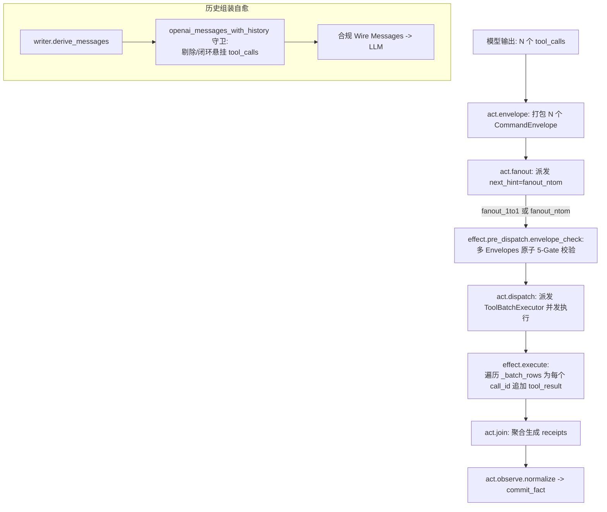

# 并行工具调用打通与运行机制稳定化架构设计

**日期**：2026-10-10  
**状态**：已批准 (Approved)  
**设计目标**：基于第一性原理，打通执行平面并行工具调用图拓扑，保持工具按需延迟加载（Tool Defer）经济性，构建会话历史自愈与模型声带净化防线，消除静默丢弃与注意力滑逸缺陷。

---

## 1. 背景与根因追溯 (Problem & Root Cause)

在 `run_652ce60b7b51`（目标：`你好 帮我创建一个助理吧 是做新闻研究的`）端到端运行分析中，定位出以下核心缺陷因果链：

1. **并发调用静默黑洞**：模型在加载 `agent` 命名空间后，发起 3 个并发角色卡检索（`news`、`journalist`、`research`）。`act.fanout` 节点按 ADR-0232 产生 `next_hint="fanout_ntom"`，但 `bundles/act/act_subgraph.yaml` 的出边谓词仅匹配 `fanout_1to1`，导致并发工具调用被图引擎按 terminal 静默丢弃，未执行且未报错。
2. **重试颠簸与单工具降级**：模型在工具结果缺失的情况下重试中文并发关键词，再次被吞；最终在第三次降级为无参数单工具 `list_role_cards()` 才得以执行。
3. **会话历史协议破坏**：由于前两轮并发工具被旁路，`act.observe.commit_fact` 未执行，但 `writer` 缓存了包含 `tool_calls` 的 assistant 消息，导致组装给 LLM 的上下文中连续堆叠了多个携带未应答 `tool_call_id` 的 assistant 消息，违反 OpenAI / DashScope 协议契约。
4. **模型注意力滑逸与条文复读**：Qwen 模型接收到非法对话序列后注意力机制紊乱，将 System Prompt 尾部的规则片段当作预填充上下文反向复读输出，并因无工具调用触发 `terminal.commit` 错误终结。

---

## 2. 核心架构决策 (Architectural Decisions)

### 决策 1：拥抱并行工具调用 (Embrace Parallel Tool Calling)
- 坚决支持模型一次性调用多个工具的高效能力，不禁用 `parallel_tool_calls`。
- 补全图执行管道，使 `act.subgraph` 完整接通 `fanout_ntom` 出边，确保多工具并发完整调度并产生独立的 `role="tool"` 事实回执。

### 决策 2：保留 Tool Defer 经济性 (Preserve Tool Defer Economics)
- 维持 `DeferPolicy` 的按需延迟加载哲学，初始轮次不盲目注入全量工具 Schema，保护上下文 Token 经济性与模型注意力。

### 决策 3：历史组装协议自愈 (Self-Healing History Assembly)
- 在 `openai_messages_with_history` 投影层建立契约守卫：检测并修复未收到应答的悬挂 `tool_call_id`，严格保证输入给 LLM 的对话轮次永远满足 OpenAI / DashScope 契约。

### 决策 4：声带防线与 Prompt 反刍净化 (Output Hygiene Guard)
- 在 `decision.parse` 增加 `guard_leaked_prompt` 门禁，检测并剥离模型意外泄漏的内部 System Prompt 条文或未加载 Catalog 文本，守住暴露给用户的安全底线。

---

## 3. 分层组件设计与拓扑契约 (Component Design)



### 3.1 图执行拓扑升级 (`bundles/act/act_subgraph.yaml`)
修改 `act.fanout` 到 `effect.pre_dispatch.envelope_check` 的出边谓词：
```yaml
  - from: act.fanout
    to: effect.pre_dispatch.envelope_check
    when:
      kind: in
      port: { name: routing, field: next_hint }
      value: [fanout_1to1, fanout_ntom]
```

### 3.2 多 Envelope 原子校验 (`pre_dispatch_envelope_check.py`)
- `declared_inputs` 增加对 `envelopes` typed-port 的识别；
- 循环对全部 $N$ 个 `CommandEnvelope` 执行 5 闸（Envelope-Shape / Permission / Grant / Budget / Safe-Boundary）原子体检；
- 任一 Envelope 不合规立即 Fail-Loud。

### 3.3 并发回执事实闭环 (`execute.py`)
- 确保 `_dispatch` 在处理 batch observation 时，`_append_tool_result_surface` 准确提取每一个子调用的 `call_id`，并在 Session 中各追加一条 `surface/tool_result`；
- 输出聚合 `receipts`，使 `act.join` 与 `act.observe` 正常完成归一化。

### 3.4 Wire 消息自愈守卫 (`_history.py`)
在 `openai_messages_with_history` 中：
- 构建 `tool_ids_answered` 集合；
- 若检测到 `assistant` 消息携带的 `tool_calls` 在后续历史中无对应 `role="tool"` 消息，自动合成安全失败回执或清洗该未执行项，阻断非法消息链。

### 3.5 声带净化守卫 (`parse.py`)
在 `decision.parse` 中：
- 识别 `Deferred tool namespaces`、`Before concluding a capability is unavailable`、`## 记忆写入与写盘铁律` 等系统指令特征；
- 若纯文本回复包含此类特征，剥离泄露段落；若无实质内容，则触发合法自愈。

---

## 4. 边界与自治职责 (Boundaries & Scope)

### Owns (本方案负责)
1. `bundles/act/act_subgraph.yaml` 闭环 `fanout_ntom` 出边；
2. `lca/nodes/effect/pre_dispatch_envelope_check.py` 多 Envelope 校验；
3. `lca/nodes/concept/effect/execute.py` 并发回执提取与写入闭环；
4. `lca/infrastructure/llm_adapter/openai_compat/history/_history.py` 历史组装自愈；
5. `lca/nodes/think/decision/parse.py` 输出声带净化守卫；
6. 自动化不变量单测与端到端回归验证。

### Does NOT own (负向边界 / 严禁触碰)
1. 严禁破坏 `DeferPolicy` 延迟加载机制；
2. 严禁关闭 `parallel_tool_calls` 生成参数；
3. 严禁改动宿主机资产、运维脚本或非 LCA 文件。

### Autopilot Ladder
- **等级**：`DRAFT`（涉及核心执行图与上下文投影，需单流步进与双重自动化断言守护）。

---

## 5. 测试不变量断言矩阵 (Invariants to Test)

| 编号 | 不变量名称 | 验证方式 | 预期结果 |
|---|---|---|---|
| **INV-PARALLEL-01** | 并发工具拓扑不中断 | 构造多 tool_calls Decision 驱动 act_subgraph | `next_hint="fanout_ntom"` 成功流向 dispatch，不触发 terminal 丢弃 |
| **INV-PARALLEL-02** | 并发工具全量回执闭环 | 检查 Session 事实流中 `surface/tool_result` 条目 | $N$ 个并发工具调用产生精确对应 $N$ 条 `tool_result`，`call_id` 100% 匹配 |
| **INV-HISTORY-01** | 悬挂调用协议自愈 | 模拟单工具丢失构造畸形历史，调用 `openai_messages_with_history` | 绝不输出未闭合的连续 assistant 消息，消息合法合规 |
| **INV-OUTPUT-01** | Prompt 泄露特征拦截 | 向 `decision.parse` 输入包含 System Prompt 规则文本的输出 | 自动剥离泄漏特征，终端展示文本洁净 |
