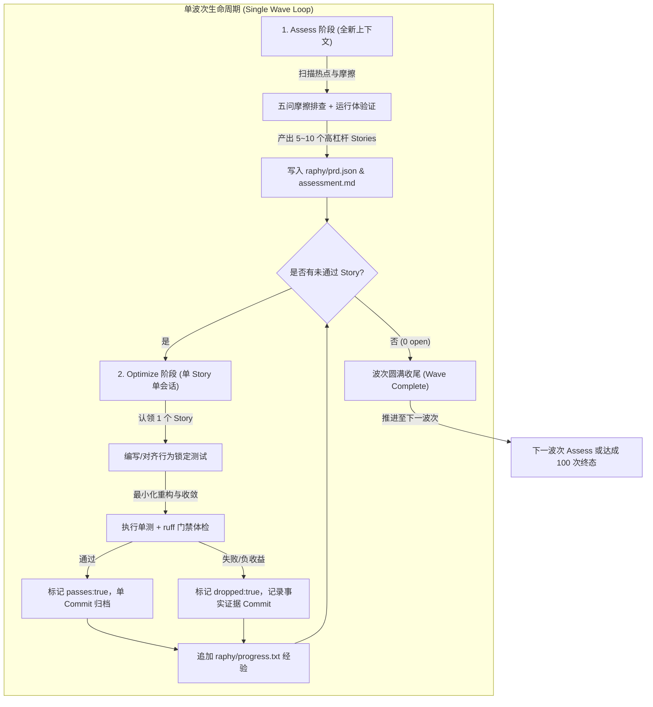

# 架构设计：Raphy 100 次真实优化与去冗循环 (Batch-Wave Deslop & Deepening Design)

> **设计日期**：2026-10-10  
> **设计状态**：Approved  
> **设计依据**：[ADR-0293：raphy 新鲜会话架构优化循环](../adr/0293-raphy-fresh-session-architecture-loop.md) & [skills/improve-codebase-architecture](../../skills/improve-codebase-architecture/SKILL.md)  
> **跟踪看板**：[docs/plans/task.md](task.md)

---

## 1. 业务背景与问题本质 (First Principles & Context)

随着 Layered Cognitive Agent (LCA) 系统不断演进，历史开发中积累了若干浅层抽象、防御性函数内局部导入、非必要重导出、以及接缝处的静默降级（Fail-Silent）。虽然此前通过 `RA-001 ~ RA-100`（并延伸至 `RA-103`）完成了百个阶段性重构故事，但在核心代码与基础设施中仍然存在待深化的结构性摩擦点：
1. **浅模块扩散 (Shallow Module Sprawl)**：某些模块接口与实现同样复杂甚至仅作简单透传，缺乏足够的封装深度；
2. **延迟导入防御过度 (Over-defensive Late Imports)**：部分类方法因历史担忧而在函数内部写 `import`，降低了代码阅读性并掩盖了真实依赖图；
3. **接缝静默吞异常 (Leaky / Silent Seams)**：部分接口在缺少能力或参数越界时返回 `None` / 空集合，未做到 Fail-Loud；
4. **废弃逻辑与孤儿抽象残留**：经演进后部分数据结构和分支已无真实生产调用，但未被物理清除。

本设计的本质目标是：以**波次渐进循环 (Batch-Wave Loop)** 为载体，按照高内聚高深度、真实删除测试与确定性测试守护的原则，驱动新一轮 100 次真实架构去冗与加深（Deslop & Deepening）。

---

## 2. 边界定义与自治等级 (Boundaries & Autopilot Ladder)

### 2.1 明确归属范围 (`Owns`)
1. **波次递进状态机 (`Wave 1 ~ Wave N`)**：承接历史故事序列，以 `RA-104` 起始，每波次定义 5～10 个具备高杠杆率的真实架构优化故事。
2. **五大真实代码去冗与加深维度**：
   - **浅模块/套娃目录收敛**：合并只起透传作用的浅层文件，提升模块深度（Depth = 功能丰富度 / 接口复杂度）与内聚局部性（Locality）；
   - **延迟导入顶层收拢 (Late Imports Convergence)**：消除函数内防御性 `import`，经验证无循环依赖后统一提升至顶层；
   - **接缝显式化与 Fail-Loud**：切除 Seam 处静默返回 `None` / 空集的暗箱 fallback，强制严格暴露契约异常；
   - **死代码与退役状态物理删除**：通过删除测试（Deletion Test），彻底移除历史残留的无用轮转状态、废弃类与空钩子；
   - **契约规范闭环**：结合 `scripts/check_package_contracts.py` 逐步对齐包职责声明与 `__all__` 导出列表。
3. **闭环交付物**：每个 Story 必须附带：① 行为或不变量锁定测试；② 最小化代码 diff；③ `ruff check` 洁净；④ 单 commit 且提交正文包含评估标准（Problem / Solution / Benefits / Strength）。
4. **状态与看板同步**：同步推进 `raphy/prd.json`、`raphy/progress.txt` 与全局看板 `docs/plans/task.md`。

### 2.2 严格负向边界 (`Does NOT own` - AP-01)
1. **严禁越界修改外部资产**：坚决不碰宿主机环境与 `~/everything-library`，不进行任何宿主机级配置篡改。
2. **严禁触碰 C1~C14 核心架构红线**：不改变认知闭集（C1）、双平面（C2）、执行窄门（C10）与 Reducer 单写（C4）等核心不变量。
3. **严禁跨 PR 留无期兼容垫片**：所有收敛一律一次性到位，杜绝无明确删除期的临时兼容分支。
4. **严禁破坏前端 Patch 完整性**：不得破坏 `deploy/lobehub/` 现有的 82 个 patch 字节级校验。

### 2.3 爆炸半径与自治等级 (`Autopilot Ladder` - AP-05)
* **评定等级**：**AUTOPILOT (受控单流自治)**
* **控制策略**：每一 Story 粒度极小且正交；代码修改前必须有基线测试，修改后必须执行该 Story 专属测试 + `ruff check`；测试未全绿严禁 commit；遇争议或负向收益必须基于证据标记 `dropped`，保证主干健康。

---

## 3. 核心架构模型与流水线时序 (Architecture Model & Lifecycle)



### 3.1 状态真值中心与数据契约
1. **`raphy/prd.json`**：唯一故事状态机，字段严格包含：
   - `id`: `RA-xxx`
   - `title`: 简明行为描述
   - `acceptanceCriteria`: 验收断言清单与测试命令
   - `passes`: 布尔值（true / false）
   - `dropped`: 布尔值（可选，放弃时为 true）
   - `notes`: 实施细节、删除测试对比或放弃理由
2. **`raphy/progress.txt`**：纯追加知识库，顶部沉淀 `## Codebase Patterns` 跨迭代模式。
3. **`raphy/assessment.md`**：候选池完整五维评估表（Files, Problem, Solution, Benefits, Strength, Constraints, Dependencies, Deletion Test）。

### 3.2 异常分支与自愈熔断机制
- **删除测试未通过 / 伪优化回退**：若实现过程中发现收敛后导致代码可读性净下降、或者破坏了不可违背的底层约束，严禁强行通过或造假；必须执行 `dropped` 协议，记录完整的反例证据并提交，立即释放进入下一故事。
- **循环依赖与导入自愈**：提升延迟导入到顶层时，必须执行双向导入验证脚本（`python -c "import ..."`）；一旦发现隐式循环依赖，保留局部导入并显式标注原因，避免运行时崩溃。

---

## 4. 测试不变量矩阵与验收标准 (Test Invariants Matrix - AP-02)

| 编号 | 不变量名称 | 验证手段与断言规则 | 违例防护后果 |
|---|---|---|---|
| **INV-DESLOP-01** | **真实删除测试 (Deletion Test)** | 任何被收敛或删除的浅模块/浅函数，必须有测试或静态分析断言全仓无悬空 `import` 与无效重导出，且其功能完整由深度模块承载。 | 拒绝虚假抽象；未通过直接回退 |
| **INV-DESLOP-02** | **导入拓扑双向无环 (Acyclic Imports)** | 延迟导入提升至顶层后，必须经脚本执行双向乃至三向顺序加载（如 `A` 优先、`B` 优先、顶层包优先），断言零循环导入死锁。 | 发现不可解环时保留带注释的局部导入 |
| **INV-DESLOP-03** | **接缝显式 Fail-Loud** | 针对协议与能力接缝，新增或加固断言：在传入无效参数、缺失能力或越界调用时，必须显式抛出契约异常，绝不静默返回 `None` / 空集合。 | 阻断任何吞没错误与假成功隐患 |
| **INV-DESLOP-04** | **核心认知与行为零回归** | 针对每次 Story 变更，运行受影响领域的完整 pytest 套件（例如 `tests/agent/`, `tests/runtime/`, `tests/contracts/` 等），断言通过率 100%。 | 任何测试失败严禁提交 |
| **INV-DESLOP-05** | **门禁与补丁完整性** | 修改文件执行 `ruff check` 必须 0 报错；`git diff --check` 必须干净；前端 82 个 patch 校验必须保持 100% byte-identical。 | 代码与补丁格式卫生红线 |
| **INV-DESLOP-06** | **提交证据链可追溯** | 每个 Story 单独生成一个 commit，提交正文必须嵌入真实的五维 Assessment 分析与实测收益比对；`raphy/prd.json` 与 `progress.txt` 状态必须事实一致。 | 杜绝无记录无追踪盲目修改 |

---

## 5. 验收门禁规范 (Gate Commands)

每个 Story 在 commit 前必须顺序执行并验证全绿：
```bash
# 1. 行为与不变量回归测试
pytest <touched_tests> -v

# 2. 静态代码卫生与规范
ruff check <touched_files>
git diff --check

# 3. 状态一致性检查
git status --short
```
