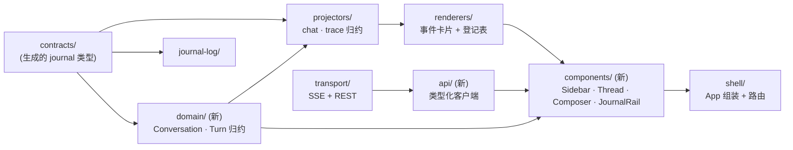
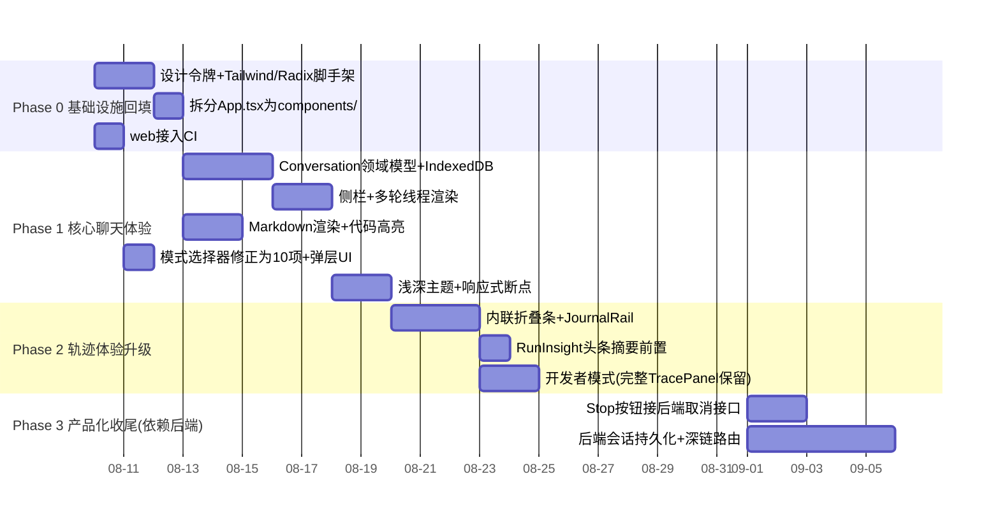

# LCA 前端产品化设计方案

### 从「团队协作可观测性调试页」到商用级对话产品

| | |
|---|---|
| 文档性质 | 设计提案（非 ADR）——按 `docs/adr/README.md` 的收录范围，本文属于「执行方案/提案」，不进 `docs/adr/`，建议落地为 `docs/proposals/0001-frontend-productization.md`；其中若干条一旦拍板会固化为长期约束（第 5、9 节标注），届时应各自拆成独立 ADR |
| 范围 | `web/` 全部 + `gateway/` 的最小必要协同接口 |
| 不改 | `lca/` 认知框架本体、五层分层、journal 契约 |
| 走查依据 | 对 `web/src/**`、`gateway/**`、`docs/adr/*`、`docs/glossary.md`、`.github/workflows/ci.yml` 的实读，非猜测 |

---

## 0. 一句话结论

**地基是好的，缺的是产品层。** `web/` 已经有一套罕见的自律：contracts 从 Python 单一事实源生成、journal 事件按层单向依赖、`dependency-cruiser` 在 CI 意义上（虽然还没真正接 CI）锁死了核心层不许碰 React。问题不在架构，在于它现在只长出了一个 `App.tsx` 表单 + 一叠调试卡片，从没有长出「对话」「历史」「视觉系统」这几层产品语义。本方案不推倒重来，而是在现有 4 层骨架上补齐产品层，并把「团队协作过程」从调试信息升级为**这个产品独有的、商用竞品没有的卖点**。

---

## 1. 现状诊断

### 1.1 已经具备、必须保留的资产

| 资产 | 位置 | 为什么值得保留 |
|---|---|---|
| 单向依赖的核心层 | `.dependency-cruiser.cjs`：`contracts/journal-log/projectors/transport` 禁止依赖 React；`projectors` 禁止依赖 `renderers`；核心层禁止依赖 `shell` | 这已经是 Elm/Redux 式单向数据流的雏形，且用工具而非口头约定强制执行——与 `lca/` 侧的 import-linter 分层哲学一脉相承 |
| 契约单一事实源 | `scripts/generate_journal_contracts.py` → `web/src/contracts/journal.generated.ts` | Python `JournalEvent` 定义变了，TS 类型自动跟着变，前后端不会因为手抄字段名而漂移 |
| Journal 本地镜像 | `web/src/journal-log/journal-log.ts` | 直接对应后端 ADR-0037「journal-as-truth」——前端也把 append-only 事件流当唯一真相，而不是自己另建一套 UI 状态机，这个方向是对的 |
| 归约器模式 | `projectors/chat-projector.ts`、`projectors/trace-projector.ts` | 事件 → 状态的纯函数归约，已经具备可测试性（`trace-projector.test.ts`） |
| 事件类型 → 渲染组件登记表 | `renderers/registry.ts` + `registry.test.ts` 的 `assertRendererCoverage` | 新增一种 journal 事件类型，测试会在渲染缺失时炸——这个「登记表必须穷尽」的门禁思路值得原样搬进产品化后的组件体系 |
| 领域色彩系统 | `renderers/domain-colors.ts`：`run/team/cognitive/resource/event` 五个语义域各有颜色 | 这不是装饰性配色，是从后端 `VocabDomain` 契约派生出来的——第 4 节的视觉系统会直接把它扶正为设计令牌 |
| 断线续传 | `transport/fetch-sse-transport.ts` 的 `Last-Event-ID` + `run_registry.py` 的帧缓冲回放 | 协议层面已经支持断线重连，现在只是没有 UI 去表达「已重连」这件事 |

**结论：不需要换技术方案重写，需要的是在这套骨架上面盖楼。**

### 1.2 阻碍「商用感」的具体问题

逐条来自实读代码，不是泛泛的「不好看」：

| # | 问题 | 证据 | 影响 |
|---|---|---|---|
| 1 | 没有「对话」概念，只有「单次 run」 | `projectors/types.ts` 的 `ChatState` 只有 `{question, answer, status, teamId}` 一份，不是数组；`App.tsx` 每次提交先 `log.clear()` 清空上一轮 | 不能多轮对话，刷新页面就丢，完全不是 ChatGPT/Gemini/Grok 类产品的基本形态 |
| 2 | 无历史、无持久化 | `JournalLog` 是 `useMemo` 出来的内存对象；`gateway/run_registry.py` 的 `_registry = RunRegistry()` 是进程内全局变量，重启即丢 | 没有会话列表可言，产品意义上等于「一次性工具」 |
| 3 | 视觉是表单，不是对话 | `App.tsx` 用原生 `<select>`/`<textarea>`，`app.css` 只有 6 个写死的十六进制变量，无设计令牌、无浅色主题、断点只有一条 `@media (min-width:960px)` | 「调试页」既是功能上的，也是像素上的 |
| 4 | 回答渲染是纯文本 | `renderers/typewriter.tsx` 只是 `<p>{sentences}</p>` | 没有 Markdown、代码块、表格渲染，答案稍微复杂就是一坨没有格式的字符串 |
| 5 | 打字机是假的，且代码自己承认 | `chat-projector.ts` 注释原文：「逐句打字机（真 token 流接入前顶一顶）」 | 这不是我发现的问题，是实现者已经标注的临时方案——但 `docs/adr/0038-llm-stream-event-contract.md` 明确写了「不把 `stream()` 接进 `reasoner.py`（零生产调用方，另立 ADR）」，也就是说**真正的逐 token 流式在后端层面还没有排期**，前端架构必须为此留缝，而不是假装很快能接上 |
| 6 | 协作模式选择器数据已经过期 | 前端曾手抄 4 项 `MODES`；而 `gateway/mode_catalog.py::ALL_MODES` 实际有 10 种（`routing/consult/board/pipeline/fan_out/peer_relay/peer_swarm/debate/graph/solo`） | 后端已经支持的 `consult / fan_out / peer_relay / peer_swarm / debate / graph` 六种协作模式，用户在 UI 上根本选不到——这正是「手抄枚举」必然漂移的实例，不是假设 |
| 7 | 「运行轨迹」是调试信息的堆叠，不是产品体验 | `renderers/trace-panel.tsx` 直接顺序渲染 `EVENT_RENDERERS[type]`，是一份原始事件列表 | 后端其实已经算好了更高层的叙事（见下一条），前端却只展示最原始那一层 |
| 8 | 后端已建成但前端从未使用的能力 | `docs/adr/0037-journal-as-truth.md` 提到的 `SequenceProjector`（Mermaid 时序图）与 `InsightEngine`（计算关键路径/冗余调用/循环，回注为 `RunInsight` 事件） | `RunInsight` 虽然在 `EVENT_RENDERERS` 里有 `InsightBadge`，但只是列表里的一张卡片，没有被当作「团队协作总结」的头条来用——这是白白放着的产品亮点 |
| 9 | `web/` 完全没接入 CI | `.github/workflows/ci.yml` 只跑 `uv run ruff/mypy/pytest/...`，通篇没有 `cd web`；而 `web/package.json` 里其实已经有 `test`/`lint:layers`/`build` 脚本 | 前端目前是「本地能跑就行」，没有任何门禁保证不回退——這是 0 成本就能修的纪律缺口 |
| 10 | 无法停止生成、无法多会话并发管理 | `gateway/app.py` 路由只有 `POST /runs`、`GET /runs/{id}`、`GET /runs/{id}/events`、`GET /health`，没有取消接口 | 「Stop generating」这个几乎所有商用对话产品的基本按钮，目前后端就没有对应端点 |

---

## 2. 设计目标与非目标

### 2.1 目标

1. **产品体验对齐一线对话产品的及格线**：多轮对话、历史侧栏、Markdown 渲染、流畅的响应式布局、浅/深色主题——这是「买过这道坎」的字面意思，先做到「不寒酸」。
2. **把「团队协作过程」做成差异化卖点，而不是藏起来的调试信息**。ChatGPT/Grok 们最多给你一段折叠的「思考过程」文本；这个产品有结构化的多 Agent 委派、决策、工具调用、洞察事件——这是竞品没有的真实数据资产，应该被设计成产品亮点，而不是被当作「太技术、要藏起来」的负担。
3. **架构延续既有纪律，不引入风格断层**：新增的目录、依赖、命名要经得起 `docs/glossary.md` 化石词检查和 `.dependency-cruiser.cjs` 式的分层门禁，长期可维护性以「6 个月后新人能不能照着现有模式加一个新事件类型的渲染」为验收标准。

### 2.2 非目标（本次不做，但要显式说明，避免误读为遗漏）

- 不在本文档设计后端会话持久化 / 鉴权 / 多租户的具体实现——第 6 节只标出接口形状与依赖关系，留给单独的后端提案。
- 不追求逐像素复刻某个具体商用产品——那是抄袭且没有意义，目标是「质量线对齐」，视觉语言要从这个产品自己的领域语汇（journal、domain、run）里长出来，见第 4 节。
- 本阶段不引入真正的逐 token 流式（依赖 `docs/adr/0038` 未完成的后端工作），只做「架构上随时能接」。

---

## 3. 产品与信息架构

### 3.1 整体布局

三栏式，移动端收为单栏 + 抽屉，这是当前这类产品被验证过的正确形态，本次不在结构上冒险——冒险预算留给第 4 节的视觉系统。

```
┌───────────┬──────────────────────────────────────────┬──────────────┐
│  会话侧栏  │              对话主区域                    │  轨迹侧栏     │
│  Sidebar  │  TopBar                                    │  TracePanel  │
│           │  ─────────────────────────────             │  （默认收起， │
│  + 新对话  │  MessageThread                             │  开发者模式   │
│  会话列表  │    UserBubble                               │  持久展开）   │
│  搜索      │    AssistantBubble                          │              │
│           │      └─ 内联「团队协作」折叠条 ▸              │              │
│           │  ─────────────────────────────             │              │
│           │  Composer（协作模式选择 + 输入框 + 发送/停止）│              │
└───────────┴──────────────────────────────────────────┴──────────────┘
```

移动端：侧栏收为抽屉（汉堡触发），轨迹侧栏彻底移除，改为内联折叠条是唯一入口——这样普通用户和「开发者模式」用户共用同一套信息，只是展开深度不同，不必维护两套 UI。

### 3.2 对话领域模型（新增，核心变更）

当前 `ChatState` 是单份，需要升格为集合。新增 `Conversation` / `Turn` 作为前端领域概念（放在新的 `domain/` 层，见第 5 节），字段设计对齐现有 journal 命名习惯，不引入新词根：

```ts
interface Turn {
  readonly runId: string;        // 对应 gateway 的 run_id
  readonly traceId: string;
  readonly question: string;
  readonly mode: string;         // 复用后端 ALL_MODES 词表，见 3.4
  readonly track: "auto" | "real" | "scripted";
  readonly events: readonly StampedEvent[];  // 该 run 的完整 journal 镜像
  readonly answer: string;
  readonly status: "pending" | "running" | "completed" | "failed";
}

interface Conversation {
  readonly id: string;
  readonly title: string;        // 取首个 turn 的 question 前 N 字，可后续支持摘要
  readonly turns: readonly Turn[];
  readonly createdAt: number;
}
```

**持久化分两阶段（详见第 7 节路线图，这里先定形状）：**

- **阶段一（无需后端改动）**：`Conversation[]` 存 IndexedDB（浏览器关闭不丢，比 `localStorage` 容量和结构化查询能力更适合，用 `idb-keyval` 这种几 KB 的小库即可，不上重型 ORM）。诚实标注：这个阶段历史不跨设备/浏览器同步，需要在设置页写清楚，不能悄悄假装是「云端历史」。
- **阶段二（依赖第 6 节后端接口）**：Conversation 落到服务端，`turns` 里的 `events` 仍按需通过既有 `GET /runs/{id}/events` 回放获取，不重复存两份。

**多轮上下文怎么接续（需要拍板的产品问题，本文给出建议而非强制）**：`POST /runs` 目前的 `question` 是独立目标，不携带历史。建议阶段一先由前端拼接（把前 N 轮的 `question`/`answer` 摘要 prepend 进新 objective），这是能立刻工作的糙办法，代价是不受 token 预算约束、可能显得生硬；真正干净的做法是后端在 `create_run_session` 层面接收 `conversation_id` 并自行组装上下文——这个决定影响认知回路，建议单独写 ADR，不在本提案里拍板。

### 3.3 输入区（Composer）

- 自增高 `textarea`，`Enter` 发送 / `Shift+Enter` 换行——这是这类产品的肌肉记忆，没有理由标新立异。
- 「停止生成」按钮：依赖第 6 节新增的取消接口；接口落地前先禁用该按钮并给 tooltip 说明，不做假按钮。
- 协作模式选择器：见 3.4，独立小节因为这是本产品的核心差异化输入，不能简化成一个不起眼的 `<select>`。
- 「LLM 轨道」（`auto/real/scripted`）从常驻下拉降级为设置弹层里的选项——这是开发调试用的开关，不该占用普通用户的首屏视觉权重，但不删除（观测型用户仍需要）。

### 3.4 协作模式选择器

现状的 4 项漂移（见 1.2 #6）先修正为与 `gateway/mode_catalog.py::ALL_MODES` 对齐的 10 项，**且由 `scripts/generate_gateway_contracts.py` 从生产目录生成 `MODE_HELP` 等 TS 契约**（见 ADR-0040 / 5.5），不重新手抄一遍："有主导 · 全员咨询后 Lead 收口"（board）、"无主导 · 多轮辩论"（debate）等——这些文案已经在 `gateway/mode_catalog.py` 里写好，前端只需要消费生成产物，不要在两处各写一份、迟早再漂移一次。

交互上从原生 `<select>` 升级为类似 ChatGPT 模型选择器的弹层列表：每一项一行标题 + `MODE_HELP` 一句话描述 + 是否「有主导」的小标签，而不是裸词条 `board`。

### 3.5 回答渲染

- 引入 Markdown 渲染（`react-markdown` + `remark-gfm`），代码块加语法高亮与一键复制。
- 渐进式逐句显现（现有 `splitSentences` 机制）保留，作为「假流式」的过渡态，但要重命名/重构为一个明确标注临时性的 hook（例如 `useProgressiveReveal`，避免将来有人以为这就是真流式），并在其之上留出接口位置，使得未来 `ADR-0038` 续篇把真正的逐 token `LLMStreamEvent` 接进 `reasoner.py` 之后，只需要换 `transport` 与这个 hook 的数据源，`AssistantBubble` 组件本身不用改。

### 3.6 团队协作轨迹——从「调试面板」到「产品亮点」

这是本方案里唯一值得「多花笔墨」的地方，因为它是差异化所在：

1. **默认形态：内联折叠条**，挂在每条助手消息下方，收起时只有一行摘要，例如：
   `团队协作 · board 模式 · 3 名成员 · 12 个事件 · 用时 8.4s ▸`
   点开后展开为该 run 的完整叙事，复用现有 `EVENT_RENDERERS` 登记表渲染每个事件卡片——**不推倒重做卡片体系，只是换了容器和默认可见性**。
2. **头条洞察前置**：`RunInsight` 事件（后端 `InsightEngine` 算好的关键路径/冗余调用/循环等结论）从事件列表里摘出来，放在折叠条展开后的最上方，作为「本轮协作摘要」，而不是混在时间线中间的一张普通卡片——这是第 1.2 节 #8 指出的「已建成未使用」能力，落地成本低、观感提升大，建议列为路线图里的高优先级项。
3. **序列图（可选增强）**：若 `SequenceProjector` 产出的 Mermaid 文本可以经由既有 SSE/REST 通道拿到，在展开视图里加一个「协作时序图」标签页，用 `mermaid` 库渲染——这是"过程即数据"（后端 ADR-0037 原话引用 LobeChat 的设计哲学，与本方案第 0 节的结论同源）的直接产品化。
4. **「开发者模式」保留完整能力**：设置里一个开关，打开后轨迹侧栏常驻展开，恢复 verbosity 三档切换、事件 JSON 导出、journal 下载——这批人是真实存在的用户群（框架的可观测性卖点面向的正是这批人），不能因为产品化就把能力阉割掉，只是不作为默认体验。

### 3.7 空状态与错误状态

- 首次进入：不再硬编码「评估移动端新功能上线的风险……」这句业务示例问题塞进输入框，改为品牌欢迎态 + 几条按协作模式分类的示例 prompt 卡片（类似 ChatGPT 的建议气泡），点击即填充并可编辑。
- 连接状态：断线重连时给出不打断阅读的细条状态提示（复用已有的 `Last-Event-ID` 重连机制，只是现在完全没有 UI 表达它）；`llm_available=false`（当前用离线 scripted LLM）从副标题小字提升为醒目但不打断使用的状态徽标，用户应该清楚知道自己看到的是真实模型还是脚本化回复。
- 错误：延续 PR checklist 里「诚实注释」的精神——错误提示直说发生了什么、下一步能做什么，不用「哎呀出错了」这类模糊措辞。

### 3.8 响应式与设备适配

- 断点体系：`640 / 960 / 1280` 三档（现状只有一档），侧栏在中间断点收起为图标栏，小断点收为抽屉。
- 键盘可达性与可见 focus 环、`prefers-reduced-motion` 尊重——这是「对标商用」的及格线而非加分项，第 4 节的动效设计会显式处理。

---

## 4. 视觉设计系统

### 4.1 设计立场

这个产品的用户是评估/使用一个「认知可解释 + 生产级工程能力」Agent 框架的技术决策者和工程师（`docs/adr/0008-framework-positioning.md` 原话），不是娱乐向消费应用的大众用户。视觉语言对标 Linear / Vercel Dashboard / Anthropic Console 这一类「精密仪器感」，克制、结构化、留白讲究，而不是渐变卡通风。

同时明确避开三种当下 AI 生成设计的路子：暖米色+衬线大标题+赤陶色（容易读成"AI 生成默认款"）、纯近黑背景+单一荧光强调色（易与本产品无关的通用聊天壳雷同）、报纸式细线零圆角密集分栏。选择的方向要从这个产品自己的领域语汇里长出来，见下面的信号来源。

### 4.2 色彩：从领域词表生出来，不是挑的

现有 `renderers/domain-colors.ts` 已经把后端 `VocabDomain`（`run/team/cognitive/resource/event`）映射到 5 个颜色，这不是装饰，是产品的语义骨架——**把它扶正为设计令牌的主色系**，而不是另起一套品牌色再让这套 domain 色沦为图表配色：

| 语义域 | 现状色值 | 用途扩展 |
|---|---|---|
| `run`（青色） | `#0d9488` | 升级为界面主交互色（发送按钮、链接、进行中状态）——因为「run」是整个产品最基础的动作单元 |
| `team`（紫色） | `#7c3aed` | 团队协作折叠条的强调色、多成员相关标签 |
| `cognitive`（蓝色） | `#2563eb` | 决策/推理类事件、Lead 相关标记 |
| `resource`（琥珀色） | `#d97706` | 工具调用、LLM 调用、成本相关信息 |
| `event`（灰蓝） | `#64748b` | 中性系统事件、次要文本 |

中性背景不用纯黑：深色主题采用带一点蓝紫倾向的深板岩色（接近现有 `#0f172a` 但加两级表面高度 elevation，而不是单一平面），保证卡片、折叠条、弹层之间有清楚的层次而不是一块死黑；浅色主题对称设计一套（当前完全没有），背景取极浅灰而非纯白，避免与文本对比度过冲。

### 4.3 字体：延续已经做对的选择

`app.css` 已经选了 **IBM Plex Sans**——这其实是个好选择，IBM Plex 系列本身就是为「工程可信感」设计的字体家族，比默认换成 Inter 更贴切这个产品，予以保留并系统化：

- **界面/对话正文**：IBM Plex Sans
- **技术信息**（`run_id`、时间戳、事件类型、代码块）：IBM Plex Mono——同一家族的等宽变体，视觉上是「同一套语言的两种语域」，呼应产品本身「对话」与「执行记录」两个平面并存的结构（对应 `docs/adr/0037` 里「叙事平面 / 机制平面」的双平面表述），不是随便配对。

### 4.4 组件与图标

- **无头组件库 + 自有令牌**：Radix UI primitives（`Dialog/Popover/DropdownMenu/Tooltip/Tabs/ScrollArea`）负责可访问性与交互行为（焦点陷阱、键盘导航、ARIA），配色/间距/圆角完全走自定义 CSS 变量令牌，不锁进某个预制皮肤（如 MUI）。这是目前一线产品团队的主流组合，兼顾"不重造轮子"与"视觉可控"。
- **图标**：`lucide-react`，线条粗细与 IBM Plex 的几何感搭配良好，且生态成熟、tree-shake 友好。
- Tailwind CSS 作为原子样式工具层（消费上面的 CSS 变量令牌做主题化），不是设计系统本身。

### 4.5 动效

- 折叠条展开/收起：`200ms` 高度+透明度过渡，`cubic-bezier` 缓动，不用弹簧夸张效果。
- 逐句显现沿用现有节奏但改为更细颗粒（词级而非纯句级，观感更接近真流式），`prefers-reduced-motion` 时直接整段展示。
- 不做页面级别的入场动画表演——克制，把"大胆预算"留给下面的签名元素。

### 4.6 签名元素：Journal Rail

每个产品需要一个"一眼记住"的东西，且要从产品本质长出来而不是加个装饰。这个产品的本质是"append-only 的结构化执行日志是唯一真相"（`docs/adr/0037` 原话）。据此设计**Journal Rail**：团队协作折叠条展开后，左侧是一条纵向细轨道，按时间顺序排列小色块刻度（用 4.2 的五域色），像一条压缩的地震仪/飞行记录仪波形；鼠标悬停某个刻度高亮对应事件卡片，点击可跳转。这不是重新发明时间线组件的花活，是把"journal 就是真相"这句架构原则做成了看得见的界面语言——克制地用一处视觉元素，让人一眼理解"这个产品在实时记录一支 Agent 团队真实的协作过程"，而不是在假装思考。

---

## 5. 前端工程架构

### 5.1 分层延续与扩展

保留现有四层不动，在其两侧各补一层：领域层（`domain/`，仍然零 React 依赖，与 `journal-log`/`projectors` 同级）承接 3.2 的 `Conversation`/`Turn`；产品组件层拆分现有 `shell/`（`App.tsx` 目前约 195 行，尚未超过 PR checklist 的 250 行门禁，但已经混合了「数据请求 / 三份投影状态管理 / 全部 JSX 布局」三类关注点，建议现在就拆，为后续增长预留门禁余量，而不是等真的超限再补救）。



依赖方向规则延续现有精神，`.dependency-cruiser.cjs` 追加：

- `domain/` 与现有核心层同规格：禁止依赖 React、禁止依赖 `renderers`/`components`/`shell`。
- 新增 `components/` 禁止直接依赖 `transport/`，必须经过 `api/` 的类型化函数——防止 fetch 调用散落在各个组件里（`App.tsx` 现在的 `createRun`/`fetchLlmStatus` 就是这个问题的雏形）。
- `api/` 可以依赖 `transport/` 与 `contracts/`，不得依赖 `components/`。

### 5.2 目录结构提案

```
web/src/
  contracts/         # 不变
  journal-log/        # 不变
  domain/             # 新：conversation.ts, turn.ts, conversation-store.ts(IndexedDB 持久化)
  projectors/          # 不变，chat-projector 升级为消费 domain/ 的多轮数据
  renderers/           # 不变，事件卡片 + 登记表
  api/                 # 新：runs.ts(createRun/getRun/cancelRun), health.ts, conversations.ts(阶段二)
  components/          # 新：拆分自 App.tsx
    sidebar/
    thread/            # MessageThread, UserBubble, AssistantBubble
    composer/          # Composer, ModePicker
    trace/             # TraceAccordion, JournalRail, DeveloperTracePanel
    shared/            # Toast, StatusPill, ThemeToggle
  tokens/              # 新：design-tokens.css（4.2/4.3 的变量定义），tailwind.config.ts
  routes/              # 新（阶段二）：/c/:conversationId 深链
  transport/           # 不变
  shell/               # 精简为 App.tsx（组装 + 路由挂载）+ main.tsx
```

### 5.3 依赖新增清单与取舍

当前运行时依赖只有 `react`/`react-dom` 两项，是刻意的极简，但代价是自造了 SSE 解析、没有 Markdown、没有组件库。新增清单逐项写明理由，不做「大杂烩」式引入：

| 依赖 | 用途 | 为什么不是可选项 |
|---|---|---|
| `react-markdown` + `remark-gfm` | 回答渲染 | 手写 Markdown 解析没有意义，这是重造轮子 |
| `shiki` 或 `rehype-pretty-code` | 代码块语法高亮 | 同上 |
| `@radix-ui/react-*`（按需，非整包） | 无头交互组件 | 焦点管理/键盘导航/ARIA 手写代价高且容易有可访问性缺陷 |
| `tailwindcss` | 原子样式 | 配合 4.2/4.3 的 CSS 变量令牌，减少手写重复样式 |
| `lucide-react` | 图标 | 见 4.4 |
| `idb-keyval` | 阶段一本地持久化 | 体积极小（<1KB gzip），够用，不引入完整 ORM |
| `zustand`（可选，见 5.4） | 跨组件状态 | 见下方权衡 |
| `mermaid`（可选，3.6 第 3 点） | 协作时序图渲染 | 若采纳时序图增强再引入，非必需起步项 |

不引入：完整组件库（MUI/AntD 类）——与 4.1 的视觉立场冲突，会强绑定预制皮肤；不引入 Redux——归约器模式已经在用，加 Redux 只是加样板代码。

### 5.4 状态管理

现有的「`useMemo` 出实例 + `useState` 镜像 snapshot」模式（`App.tsx` 里 `chatProjector`/`traceProjector`/`log` 三件套）在单页单表单场景下够用，但会话列表 + 多个并发 turn 之后，跨组件共享会变得笨重。建议引入 **Zustand**：足够薄（没有 Context 重渲染问题、没有 Redux 的样板代码），且可以把现有的 `ChatProjector`/`TraceProjector` 归约逻辑原样作为 store 的 reducer 复用，不需要推翻重写——这是唯一一处建议引入新的状态管理范式，其余全部延续现有归约器模式。

### 5.5 契约生成扩展

`scripts/generate_journal_contracts.py` 的模式是对的，只是覆盖面窄了。`scripts/generate_gateway_contracts.py`（ADR-0040）沿用同风格，同时生成：

- 协作模式词表：从 `gateway/mode_catalog.py::MODE_DEFINITIONS` 及其派生表（`ALL_MODES` / `MODE_HELP` / `MODE_HAS_LEAD` / `EXAMPLE_PROMPTS`）生成 `web/src/contracts/modes.generated.ts`（解决 1.2 #6 的漂移），前端 `ModePicker` 直接消费生成产物，永远不会再手抄漏项。
- `RunStatus`（`gateway/run_registry.py` 的枚举）与 `/runs` 请求体的 DTO 形状（`gateway/contracts.py`），生成 `web/src/contracts/runs.generated.ts`，避免 `api/runs.ts` 里再手写一份 shape。

`tests/harness/modes.py` 继续只服务 CLI 探针与 scripted 测试；CI 通过 `test_refactor_guards.py::TestModeCatalogKeyParity` 断言其与 `gateway.mode_catalog` 的 key 集合一致，但不作为前端契约生成源。

### 5.6 测试策略延续

延续既有的「登记表必须穷尽」与「黄金轨迹」两种测试文化，不新起一套体系：

- `renderers/registry.test.ts` 的 `assertRendererCoverage` 模式原样搬到新增的任何"类型 → 组件"登记表（例如 `ModePicker` 的模式 → 图标映射）。
- 新增「对话回放」测试：录制一份真实 journal JSONL（`traces/runs/*.jsonl` 已经在生成）作为 fixture，喂给 `domain/` 归约器，断言最终 `Conversation` 结构与关键渲染文本符合预期——对应后端 `tests/golden_traces/` 与 `characterization/` 的测试哲学，前端第一次拥有自己的"黄金轨迹"测试。
- 组件测试用 `@testing-library/react` + 现有 `vitest`，不换测试运行器。
- 视觉回归（Playwright/Chromatic）列为可选增强，不作为本次路线图的必需项，避免过度加码。

### 5.7 CI 接入（零成本，建议立刻做）

`web/package.json` 已有的 `test`/`lint:layers`/`build` 脚本从未在 `.github/workflows/ci.yml` 里被调用。这是本次走查里成本最低、价值最确定的一项，建议不等其它章节排期，独立提前落地：

```yaml
  web-quality:
    runs-on: ubuntu-latest
    defaults:
      run:
        working-directory: web
    steps:
      - uses: actions/checkout@v4
      - uses: actions/setup-node@v4
        with: { node-version: 20 }
      - run: npm ci
      - run: npx tsc -b
      - run: npm run lint:layers
      - run: npm run test
      - run: npm run build
```

---

## 6. 后端协同需求（标注依赖，不在本文设计实现）

| 能力 | 现状 | 需要新增 | 优先级 |
|---|---|---|---|
| 取消正在运行的 run | `gateway/app.py` 无对应路由 | `POST /runs/{id}/cancel`，`RunSession` 增加取消信号并让 `execute_run` 响应 | 高（Composer 的「停止生成」直接依赖） |
| 会话（Conversation）持久化 | 无，`RunRegistry` 纯内存 | 最小形态：`POST /conversations`、`GET /conversations`、`GET /conversations/{id}`、`POST /conversations/{id}/turns`（内部复用现有 `create_run_session`），需要选型持久化后端（SQLite 起步即可，不必上重型数据库） | 中——阶段一可先用前端 IndexedDB 绕过 |
| 多轮上下文组装 | `question` 为独立目标 | 讨论是否在 `create_run_session` 接受 `conversation_id` 并由后端组装历史上下文——涉及认知回路，建议单独 ADR | 中，产品可用性相关但非阻塞项 |
| 真实逐 token 流式 | `docs/adr/0038` 已定义 `LLMStreamEvent` 契约但显式未接入 `reasoner.py` | 后续 ADR 续篇，前端只需按 3.5 留好数据源切换点 | 低（已知延后，不阻塞本次前端改造） |
| 鉴权 / 多租户 | 无 | 商用多用户部署前必须补，超出本提案范围 | 视商业化阶段而定 |

---

## 7. 分阶段路线图



阶段划分的原则：**Phase 0/1/2 不依赖任何后端改动即可完整交付**（Phase 1 的多轮持久化用前端 IndexedDB 绕过），先把「买过这道坎」的视觉与体验部分独立可控地做完；Phase 3 才依赖第 6 节的后端协同，避免前端排期被后端节奏卡住。

---

## 8. 风险与取舍

- **Phase 1 的历史仅存本地**：需要在设置/空状态文案里诚实告知，不能让用户误以为换设备也能看到历史——这是刻意的阶段性取舍，不是缺陷，但必须显式沟通。
- **新增依赖打破了"只有两个运行时依赖"的极简现状**：这是有意识的取舍，第 5.3 节逐项写明了理由，拒绝"能不装就不装"导致重造轮子（手写 Markdown 解析器不会比引入 `react-markdown` 更可维护）。
- **把轨迹面板暴露给普通用户可能造成信息过载**：用默认折叠 + 开发者模式分层解决，但仍需在真实用户测试后校准默认展开深度，本方案给出的是初始假设而非终稿。
- **协作模式从 4 项扩到 10 项，选择成本上升**：用 3.4 的分组弹层 + 复用后端已写好的 `MODE_HELP` 一句话描述缓解，但如果实测发现用户根本用不到冷门模式（如 `peer_swarm`），也应该考虑收敛而非教条地暴露全部 10 项——留给上线后数据判断。

---

## 9. 与现有架构规范的对齐检查

- 命名：本文新增模块名（`domain`、`api`、`components`、`tokens`）未出现 `docs/glossary.md` 化石表列出的禁用词根（`Manager/Util/Helper/Handler/Processor/Advanced`）。`JournalRail`、`TraceAccordion` 等新词如果被采纳，需要按 PR checklist 同步登记进 `docs/glossary.md`。
- 分层：新增 `domain/`、`api/` 的依赖方向已在 5.1 写成 `dependency-cruiser` 规则草案，与现有契约同构，不是另起一套规范。
- 文档归属：本文档本身按 `docs/adr/README.md` 的收录范围**不进 `docs/adr/`**（提案/执行方案被明确排除）；一旦评审通过，其中构成"架构决策"的部分（例如 5.1 的分层扩展、3.2 的 Conversation 作为一等前端领域概念）应该拆成独立的 ADR-0039 起步，正文遵循现有 ADR 模板（状态/背景/决定/放弃的方案/后果/相关），而不是把整份提案塞进一篇 ADR。
- 测试文化：5.6 节的"登记表穷尽"与"黄金轨迹回放"均为现有测试哲学的延伸，不新起体系。

---

## 附录：本次走查发现的可独立执行的低成本项（不依赖本文其余部分拍板）

1. **`web/` 接入 CI**（5.7）——零架构风险，建议本周内单独提交。
2. **协作模式契约生成**（1.2 #6 / 3.4 / ADR-0040）——`generate_gateway_contracts.py` + `modes.generated.ts`，纯构建期数据修正，不涉及视觉改版也能先做。
3. **`RunInsight` 从事件列表中摘出置顶**（3.6 第 2 点）——现有渲染组件已经存在（`InsightBadge`），只是调整了摆放位置，成本极低。
