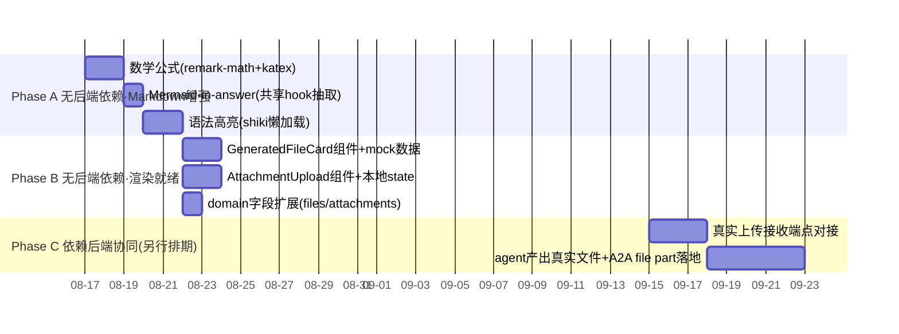

# LCA 前端产品化 · 第三轮：Markdown 能力扩展、生成文件产物、上传附件

### 参考 LobeHub 的实现模式落地，不引入其依赖——本文是 ADR-0043 的执行方案

| | |
|---|---|
| 文档性质 | `docs/proposals/0002-lobehub-parity-polish.md` 的续篇；对应 `docs/adr/0043-markdown-files-charts-without-lobehub-ui.md` 的执行方案。按 `docs/adr/README.md` 的收录范围，本文属于「执行方案/提案」，不进 `docs/adr/` |
| 范围 | `web/` 的 Markdown 渲染扩展、生成文件产物卡片、上传附件 UI |
| 不改 | `lca/` 认知框架本体、五层分层、journal 契约、SSE 传输/归约管道 |
| 前提 | 依赖 ADR-0043 的决定——本文不重复论证「要不要引入 @lobehub/ui」，只回答「具体怎么做」 |

---

## 0. 结论先行

Markdown 三项增强（数学公式 / 回答内 Mermaid 图表 / 语法高亮）与 Mermaid
复用可以**独立、不依赖任何后端改动地交付**。生成文件卡片与上传附件的
前端部分先做到「渲染就绪」（组件、类型、交互全部完成，用 mock 数据
可跑通）；**Phase C 已落地**：本地 `LocalFileStore`、
`POST /conversations/{id}/attachments`、`GET /files/{id}`、`write_file`
工具、A2A file part 解析、`CreateRunRequest.attachment_ids` 与前端
上传→run 接线（见第 6 节实现注记）。

---

## 1. 现状核实

| 能力 | 现状 | 证据 |
|---|---|---|
| GFM 表格、代码块一键复制 | ✅ 已有 | `MarkdownContent.tsx` |
| 代码块语法高亮 | ❌ 待做（proposal 0002 §2.4 遗留） | 同上 |
| 数学公式（KaTeX） | ❌ 未涉及 | 同上 |
| 回答正文内 Mermaid 代码块渲染 | ❌ 按纯代码块展示 | `MarkdownContent.tsx` 的 `code` 覆盖分支未区分 `language-mermaid` |
| 协作时序图 Mermaid 渲染 | ✅ 已有，独立于任何 UI 库 | `TraceAccordion.tsx` + `mermaid` 包 + `domain/sequence-diagram.ts` |
| 生成文件产物卡片 | ❌ 不存在 | `AssistantBubble.tsx` 无相关渲染 |
| 文件上传 | ❌ 前后端均不存在 | `Composer.tsx` 只有 textarea；`gateway/app.py` 无文件路由 |
| SSE 流式渲染 | ✅ 已完整，ADR-0037/0038/0041 覆盖 | 本次不动，见 ADR-0043 决定四 |

---

## 2. 分项实现方案

### 2.1 Markdown 渲染扩展

- **新增依赖**：`remark-math` + `rehype-katex` + `katex`（样式）；语法
  高亮走 `shiki`（core，按需语言子集，`React.lazy` 懒加载，不用完整
  默认包，与 proposal 0002 §2.4 建议一致）。
- **改动文件**：`MarkdownContent.tsx`——新增 `remarkPlugins`/
  `rehypePlugins`；`code` 覆盖分支按 `className` 区分：
  - `language-mermaid` → 复用与 `TraceAccordion.tsx` 相同的渲染方式，
    抽成共享 hook（见下）避免两处重复 `mermaid.initialize`。
  - 其余 `language-*` → 走 `shiki` 高亮；加载失败或语言不支持时回退
    现有的原样 `<pre><code>` 展示，不能因为高亮失败导致代码块消失。
- **新增文件**：`web/src/lib/use-mermaid-render.ts`——从
  `TraceAccordion.tsx` 抽出的共享渲染逻辑，`TraceAccordion.tsx` 与
  `MarkdownContent.tsx` 都改为消费它，避免同一份 `mermaid.initialize`
  逻辑复制两遍。
- `sanitizeAssistantDisplayText` → `normalizeChatMarkdown` →
  `ReactMarkdown` 的既定顺序不变（ADR-0043 决定一）。
- **测试**：延续 `vitest` + `@testing-library/react`，为数学公式/
  mermaid/高亮三条新代码路径各补一个渲染快照测试，不引入新测试运行器。

### 2.2 生成文件产物卡片 `GeneratedFileCard`

- **新文件**：`web/src/components/shared/GeneratedFileCard.tsx`。
- **字段形状**（对齐 A2A `artifact.parts[]` 里 file part 的既有结构，
  见 ADR-0043 决定二）：

  ```ts
  export interface GeneratedFile {
    readonly name: string;
    readonly mimeType: string;
    readonly sizeBytes?: number;
    readonly url?: string;        // 后端可下载地址
    readonly previewable?: boolean; // 是否走 iframe 预览（如生成的 HTML）
  }
  ```

- **领域模型改动**：`domain/conversation.ts` 的 `Turn` 增加
  `readonly files?: readonly GeneratedFile[];`，沿用现有
  `answerDeltas?: readonly string[]` 同样的「可选、只读数组」风格，
  `domain/` 层零 React 依赖不变。
- **挂载点**：`AssistantBubble.tsx`，在 `MarkdownContent` 之后、
  `TraceAccordion` 之前，`turn.files?.length` 时渲染一组卡片。
- **图标**：`lucide-react` 按 `mimeType` 做一个十几行的映射函数，替代
  库的 `FileTypeIcon`。
- **HTML 预览**：原生 `<iframe sandbox="allow-scripts" srcDoc={...}>`
  代替库的 `HtmlPreview`——`sandbox` 属性必须带，避免生成内容拿到父页面
  的 cookie/DOM 上下文。

### 2.3 上传附件 `AttachmentUpload`

- **新文件**：`web/src/components/composer/AttachmentUpload.tsx`，挂在
  `Composer.tsx` 的 textarea 上方，效果上等价于 `ChatInputArea` 的
  `topAddons` 插槽，但不引入该组件本身。
- **新文件**：`web/src/api/files.ts`，函数签名对齐 `api/runs.ts` 的
  既有风格：

  ```ts
  export async function uploadAttachment(
    conversationId: string,
    file: File,
  ): Promise<AttachmentRef> { /* ... */ }
  ```

- **改动文件**：`Composer.tsx` 新增本地 `attachments` 暂存状态，随
  `createRun` 请求体一并提交（`CreateRunRequest` 契约需要相应扩展，见
  第 6 节，属于后端协同范围）。
- **拖拽区**：原生 `dragenter`/`dragover`/`drop` 事件 + 隐藏的
  `<input type="file">`，不引入第三方拖拽库——本次范围内交互复杂度不
  需要。
- 任何网络请求必须经过 `api/files.ts`，不得在 `components/` 内直接
  `fetch`——`.dependency-cruiser.cjs` 现有 `components-no-transport`
  规则的自然延伸。

### 2.4 图表：复用现有 `mermaid` 依赖，不新增包

除 2.1 提到的 mermaid-in-answer 分支外，无额外工作项——协作时序图渲染
保持原样。

---

## 3. 依赖新增清单与取舍

| 依赖 | 用途 | 为什么不是可选项 |
|---|---|---|
| `remark-math` | Markdown 数学公式语法解析 | 手写 LaTeX 语法解析没有意义 |
| `rehype-katex` + `katex` | 数学公式渲染 | KaTeX 是该场景事实标准，体积远小于 MathJax |
| `shiki`（core，按需语言子集） | 代码块语法高亮 | proposal 0002 §2.4 已确认待做；`React.lazy` 懒加载避免打包体积一次性膨胀 |

不引入：`@lobehub/ui`（任何路径）、`antd`、`@lobehub/ui/base-ui`、
`motion`/`framer-motion`、第三方拖拽库——理由见 ADR-0043「放弃的方案」。

---

## 4. 前端改动文件清单

| 文件 | 改动 |
|---|---|
| `web/src/components/shared/MarkdownContent.tsx` | 新增 remark-math/rehype-katex 插件；`code` 分支新增 mermaid/shiki 处理 |
| `web/src/lib/use-mermaid-render.ts`（新） | 抽出 `TraceAccordion` 与 `MarkdownContent` 共用的 mermaid 渲染逻辑 |
| `web/src/components/shared/GeneratedFileCard.tsx`（新） | 生成文件卡片 |
| `web/src/components/composer/AttachmentUpload.tsx`（新） | 上传附件区 |
| `web/src/api/files.ts`（新） | 上传/下载的类型化请求函数 |
| `web/src/domain/conversation.ts` | `Turn` 增加 `files?`/`attachments?` 字段 |
| `web/src/components/thread/AssistantBubble.tsx` | 挂载 `GeneratedFileCard` 列表 |
| `web/src/components/composer/Composer.tsx` | 挂载 `AttachmentUpload`，管理 `attachments` 本地状态 |
| `web/src/components/trace/TraceAccordion.tsx` | 改为消费共享的 `use-mermaid-render.ts` |
| `web/package.json` | 新增第 3 节依赖 |

---

## 5. 分阶段路线图



阶段划分原则：**Phase A/B 不依赖任何后端改动即可完整交付**，先把
Markdown 能力对齐与文件类 UI 的「渲染就绪」状态做完；Phase C 才依赖第 6
节的后端协同，避免前端排期被后端节奏卡住——与 `docs/proposals/0001` §7
的阶段划分原则一致。

---

## 6. 后端协同需求（Phase C 实现注记 · 已落地）

| 能力 | 实现 | 位置 |
|---|---|---|
| 文件上传接收 | `POST /conversations/{id}/attachments` + `GET /files/{id}`（本地磁盘 MVP，非对象存储） | `gateway/app.py`、`lca/layer0_infra/file_store.py` |
| 文件生成工具 | `WriteFileTool`（`write_file`），经 gateway / casting 默认工具集挂到 Agent | `lca/layer0_infra/tools/write_file_tool.py`、`gateway/default_tools.py` |
| A2A file part | `kind` in `{file,data}` → `Observation.extra["files"]`（GeneratedFile 形） | `lca/layer0_infra/transport/a2a_transport.py` |
| 契约扩展 | `CreateRunRequest.attachment_ids` + TS 生成 | `gateway/contracts.py`、`web/src/contracts/runs.generated.ts` |
| 前端接线 | 提交前 `uploadAttachment`；chat projector 从 `ToolInvoked` 归约 `files` | `web/src/shell/App.tsx`、`web/src/projectors/chat-projector.ts` |

---

## 7. 与现有架构规范的对齐检查

- **命名**：`GeneratedFileCard` / `AttachmentUpload` / `uploadAttachment`
  未使用 `docs/proposals/0001` §9 列出的禁用词根（`Manager`/`Util`/
  `Helper`/`Handler`/`Processor`/`Advanced`）。
- **分层**：`api/files.ts` 遵循 `.dependency-cruiser.cjs` 现有
  `components-no-transport` 规则，组件层只经由 `api/` 发起请求；
  `domain/conversation.ts` 新增字段保持零 React 依赖。
- **测试文化**：延续 `docs/proposals/0001` §5.6 的「登记表穷尽」精神与
  `vitest` + `@testing-library/react`，不引入新测试运行器。
- **文档归属**：本文件按 `docs/adr/README.md` 的收录范围不进
  `docs/adr/`，属于执行方案；其中构成架构决策的部分已先行拆入
  `docs/adr/0043-markdown-files-charts-without-lobehub-ui.md`。

---

## 8. 风险与取舍

- **Phase B 完成后 UI「看起来能用」但实际不能上传/下载真实文件**——需要
  在 PR 描述与任何演示环境里明确标注，避免被误判为完整功能，这是刻意的
  阶段性取舍而非缺陷（呼应 proposal 0001 §8 的同类披露原则）。
- **`shiki` 懒加载首次触发高亮时有轻微延迟**（chunk 拉取），用一个骨架
  态代码块过渡即可，不构成阻塞；比同步内置方案体验上略逊，是为了不让
  首屏 bundle 一次性膨胀的有意取舍。
- **`mermaid-in-answer` 若 LLM 生成的图表语法有误**，需要好的降级路径
  （渲染失败回退纯文本代码块而非白屏/报错），实现时必须覆盖这一分支，
  否则一次格式错误的图表会破坏整条回答的可读性。
- **Phase C 的后端工作量不小**（文件生成工具涉及认知回路/工具协议，
  建议单独 ADR），不应被本文「渲染就绪」的进度掩盖其真实成本。
