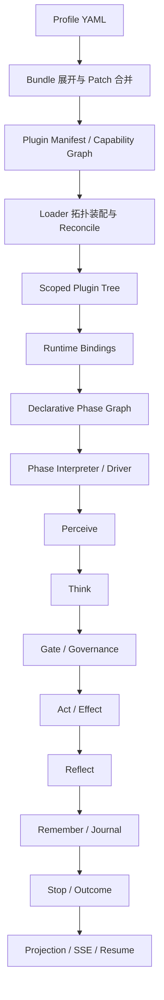

# Layered Cognitive Agent：技术名词与结构化层次认知指南

**作者：Manus AI**  
**分析对象：** `smartlijingyang-sudo/layered-cognitive-agent`  
**分析基线：** `main` 分支当前代码与仓库内架构文档 

## 1. 先给出结论：这个项目是什么

`LCA` 是 **Layered Cognitive Agent** 的缩写，即“分层认知 Agent”。它不是一个只会调用大模型和工具的简单 Agent，而是一个试图把 **认知、执行、记忆、协作、事实记录、插件装配和运行时治理** 明确分层的 Python Agent 框架。

项目的核心思想可以压缩为下面这句话：

> Agent 的认知沿着受约束的闭环运行；认知决策与世界副作用分离；状态通过受控的 reducer 更新；模型可见事实由 Journal 记录；具体行为通过插件、Profile 和 Bundle 组合出来。[1]

这里的“分层”不是把代码目录简单拆成几层，而是把不同类型的变化隔离开：**契约变化**、**实现变化**、**组合变化**、**任务实例变化**和**运行事实变化**分别由不同机制负责。

## 2. 全局地图：从配置到一次 Agent 运行

理解项目时，建议不要从某个类开始，而是沿着“配置如何变成运行结果”的链路阅读：



这条链路中有四种容易混淆的对象。**Plugin 声明**回答“系统可以装配什么”；**Phase Graph**回答“运行按什么顺序走”；**Execution Wire Shape**回答“阶段之间传递什么数据”；**Outcome Projection**回答“成功、暂停或失败之后，对外留下什么事实”。架构优化总结明确要求这四类信息彼此分离。[2]

## 3. 第一层：架构分层与依赖方向

项目规定的主依赖方向是单向的：

```text
contracts → infrastructure → cognition → runtime → agent
                                      ↓
                                application 组合根
```

| 层次 | 目录 | 主要职责 | 不应该承担的职责 |
|---|---|---|---|
| 契约层 | `lca/contracts/` | 定义 Protocol、枚举、数据模型、事件和跨层接口 | 不放具体业务行为，不直接依赖上层实现 |
| 基础设施层 | `lca/infrastructure/` | LLM、工具、传输、沙箱、文件、观测、插件内核 | 不决定 Agent 的认知策略 |
| 认知层 | `lca/cognition/` | 感知、推理、批评、综合、决策门、身体执行、记忆 | 不越过执行窄门直接修改外部世界 |
| 运行时层 | `lca/runtime/` | 运行循环、阶段驱动、停止、恢复、中间件、结果 | 不负责产品入口和 HTTP 细节 |
| Agent 层 | `lca/agent/` | 单 Agent、Team、委派和编排策略 | 不反向依赖组合根细节 |
| 应用组合根 | `lca/application/` | 根据 Profile 和能力装配完整应用 | 不把所有实现重新硬编码在 Composer 中 |
| Harness 层 | `lca/harness/` | Agent Session、Profile、Boot、声明式阶段和运行骨架 | 对外产品 API 不必暴露 Harness 名称 |
| Gateway 层 | `gateway/` | HTTP/SSE、命令承载、运行请求进入和结果投影 | 不直接选择具体 Brain、Body 或 Loop 实现 |

**组合根（Composition Root）** 是一个关键术语。它是允许“知道具体实现并完成装配”的边界。下层提供抽象和实现，上层组合根把它们接起来；如果 Gateway 自己判断具体运行引擎，或底层模块反向导入 Gateway，就破坏了这个边界。[1]

## 4. 第二层：认知内核——六步闭集与双平面

### 4.1 六步闭集

项目的认知不是任意增长的 Hook 链，而是一个受宪法约束的闭集：

```text
perceive → think → gate → act → reflect → remember → stop
```

其中 `gate` 在语义上是 Think 的确定性收尾，但实现上通常作为独立控制阶段存在。它不能被随意理解为“第七个认知步骤”；项目强调的是**六步认知循环加上停止判定**，而不是无限增加生命周期阶段。[1]

| 阶段 | 中文理解 | 核心问题 | 典型产物 |
|---|---|---|---|
| Perceive | 感知 | 当前有哪些与任务有关的事实、输入和环境变化？ | Perception、Context、State Delta |
| Think | 思考 | 基于状态和上下文，应该形成什么判断或计划？ | Thought、Decision、Plan |
| Gate | 决策门 | 这个判断是否满足规则、预算、权限和安全约束？ | Verdict、拒绝、降级或放行 |
| Act | 行动 | 如何通过受控工具执行被批准的副作用？ | Tool Call、Effect、Receipt |
| Reflect | 反思 | 行动结果说明了什么？是否需要修正方向？ | Observation、Reflection、Progress |
| Remember | 记忆 | 哪些事实、经验或过程应被保存供后续使用？ | Journal Event、Memory Entry |
| Stop | 停止 | 任务是否完成、暂停、失败或超出预算？ | Terminal Outcome、Checkpoint |

### 4.2 双平面

双平面是项目最重要的架构区分之一。

**认知平面（Cognitive Plane）** 包含 Brain、Reasoner、Critic、Synthesizer、SkillRouter 和 DecisionGate。它们主要读取 State、上下文和已记录事实，形成判断，但不直接产生外部世界副作用。

**世界平面（World Plane）** 包含 Body、SafeExecutor、Tool Pipeline、Sandbox 和具体工具。它是副作用的唯一窄门，负责把已经批准的动作转换为真实执行，并承载权限、审批、幂等、审计和错误处理。

因此，下面两句话必须严格区分：

| 表述 | 正确含义 |
|---|---|
| “Brain 决定使用工具” | Brain 产生 `Decision` 或 `Plan`，说明意图 |
| “Body 使用工具” | Body 在检查和执行边界内完成具体副作用 |

这就是所谓的 **脑手分离（Brain–Body Separation）**：脑负责判断，手负责执行，二者之间通过结构化协议连接，而不是共享一堆可变字典。

## 5. 第三层：状态、事实与变更机制

### 5.1 State、StateView、Delta

`AgentState` 是运行中 Agent 的当前状态，通常包含任务、对话上下文、预算、工具历史、工作记忆、团队意识和阶段游标等信息。它是“现在的投影”，不是天然的永久事实库。

`StateView` 是给予某个组件的受限读取视图。它的价值在于让组件看到自己应当看到的状态，而不是把全部可变对象暴露给每个插件。

`Delta` 是对状态的结构化变化描述。例如，工具执行后可以产生“新增一条观察事实”“更新进度”“追加工具结果”等变化，而不是直接执行 `state.xxx = ...`。

### 5.2 Reducer 唯一写入 State

项目的 C4 规则是：**Reducer 是唯一允许写入 AgentState 的机制**。Sensor、Gate 和 Body 都不能原地修改 State；它们必须产生 Delta 或事件，再由 Reducer 应用。

```text
组件观察或执行
      ↓
产生 Perception / Decision / Effect Receipt / Delta
      ↓
Journal 记录事实
      ↓
Reducer.apply_*()
      ↓
生成新的 AgentState 投影
```

这样做的直接收益是：状态变化有统一入口，测试可以验证每一种 Delta 的含义，恢复时可以区分“持久事实”和“当前投影”，并且能够避免某个插件通过修改共享字典绕过治理规则。[1]

### 5.3 Journal 与 State 的区别

| 对象 | 性质 | 用途 | 是否应该作为唯一事实来源 |
|---|---|---|---|
| `Journal` / `SessionEvent` | 追加式、持久化、带序号的事实流 | 重建事实、审计、投影、诊断和恢复 | 是 |
| `AgentState` | 当前运行状态的内存或存储投影 | 供当前一轮计算和运行时使用 | 否，它是投影 |
| `Checkpoint` | 某个恢复边界的状态快照和游标 | 从中断位置继续运行 | 不是完整事件历史 |
| `Projection` | 从事实派生的对外视图 | UI、SSE、状态查询和报告 | 否，它是派生结果 |

项目文档中的一个重要现实边界是：**Journal 目前已经是可靠的 run 事实流，但在部分旧路径上还不能独立重建下一轮模型 Prompt；Prompt 仍可能由活的 AgentState、Reasoner、工具历史和上下文重新拼装。** 因此，阅读代码时必须区分“目标架构不变量”和“当前代码已经完全达到的不变量”，不能把设计文档中的终态描述误认为所有生产路径都已完成迁移。[1]

## 6. 第四层：插件化运行时

### 6.1 Plugin、Manifest、Provider、Seam

**Plugin** 是最小可装配、可替换、可管理生命周期的行为单元。它通常通过 `@plugin` 声明身份、依赖、提供能力、层级、效果和测试套件。

**Plugin Manifest** 是插件的声明性元数据。它回答“我是谁、我提供什么、我需要什么、我属于哪一层、我可能产生什么效果”。Manifest 不等于插件实现本身，而是 Loader 进行校验和装配的依据。

**Provider** 是某个能力的具体提供者，例如 Memory Provider、Sandbox Provider、Tools Provider 或 Transport Provider。它把一个抽象 Seam 绑定到具体实现。

**Seam** 可以翻译为“接缝”或“扩展缝”。它是系统中允许替换实现的稳定接口，例如 `llm`、`tools`、`memory`、`sandbox`、`transport`、`state_store`、`observability` 和 `agent_loop`。Seam 不是业务功能，而是变化边界。

**Registry** 是注册中心。它把“可用实现”从调用方的 `if/else` 分支中拿出来，变成按名称、类型或能力查找的集合。项目使用 Registry 管理事件描述、Loop Driver、Provider、Factory、工具和阶段能力等对象。

### 6.2 Profile、Bundle、Patch、Role、TaskContract

项目的配置层次可以理解为从“系统默认能力”逐步收敛到“本次任务”：

```text
Baseline → Profile → Bundle → Plugin → Role → TaskContract
```

| 名词 | 解释 | 典型问题 |
|---|---|---|
| Baseline | 默认基线，未选择具体实现时的最小系统 | 系统没有业务偏好时能否启动？ |
| Profile | 一种 Agent 形态的配置选择 | 这是 coding agent、researcher 还是 web agent？ |
| Bundle | 一组可复用的插件组合 | 这类 Agent 通常需要哪些能力？ |
| Patch | 对既有配置的深合并覆盖 | 本场景要替换哪个模型、工具或策略？ |
| Plugin | 一个最小行为或原语实现 | 具体由哪个实现提供能力？ |
| Role | Agent 的个性、职责和权限画像 | 这个 Agent 应该以什么角色工作？ |
| TaskContract | 一次运行的实例级任务契约 | 本次运行的目标、边界和交付物是什么？ |

**读 Profile 就是在读系统。** Profile 不是部署细节的附录，而是能力图的可读入口：它描述了系统将加载哪些插件、这些插件需要哪些 Seam、哪些能力被授予、哪些运行策略被选择。[1]

### 6.3 Loader、DAG、Reconcile 与 Scope

`Loader` 负责加载和校验插件条目。它通常经历形状验证、句柄注册、提供能力唯一性检查、依赖拓扑排序、生命周期收敛和失败检查。

**DAG（Directed Acyclic Graph）** 是有向无环图。插件之间通过 `provides → requires` 形成依赖图，Loader 通过拓扑顺序保证依赖先于使用者启动；如果存在循环依赖，就应在装配期失败，而不是运行到深层调用才报错。

**Reconcile** 可理解为“使实际运行图收敛到声明状态”。它处理插件从待加载到激活、效果注册、配置回滚、级联停用和资源释放等生命周期变化。

**Scope** 是作用域。一个 Agent 或一次 Run 可以拥有自己的插件树、服务覆盖和生命周期。项目使用 child context、Scoped Plugin Host 和 `ContextVar` 传递运行范围，避免所有 Agent 共享一个不可控的全局单例。

## 7. 第五层：声明式阶段图与运行时

### 7.1 Declarative Plan

声明式运行不是把流程写死在一个大型 `_loop()` 函数里，而是把运行结构拆成：

| 概念 | 负责回答的问题 |
|---|---|
| `PluginSpec` | 插件提供和要求什么能力？ |
| Phase Graph | 节点、边和控制规则如何组织？ |
| `CompiledRunPlan` | 配置经过验证后，实际可执行的计划是什么？ |
| `PhaseInput` / `PhaseResult` | 阶段之间传递的数据形状是什么？ |
| `PhaseRunCursor` | 当前运行走到图中的哪里？ |
| `DeclarativeRunOutcome` | 运行最终是完成、暂停、失败还是被治理终止？ |
| Outcome Projection | 如何把内部终态转成事实、状态和对外结果？ |

**编译（Compile）** 的含义不是生成机器码，而是把 Profile、Bundle、插件贡献和阶段定义校验、解析并转换成一个可执行的计划。计划一旦编译完成，解释器就不需要重新猜测配置语义。

### 7.2 Interpreter、Driver、Middleware

**Interpreter** 按照已经编译的阶段图执行节点、选择边、更新游标并收集事实。它关注“图怎么走”，不应该知道所有具体业务结果如何展示。

**Driver** 是运行驱动器。它把一次新的 Run、一次 Resume 或某种 Loop Provider 连接到运行时。Driver 的存在使“替换循环实现”不必改 Gateway、Session 和 Projection。

**Middleware** 是阶段周围的横切处理层，例如日志、审计、指标、预算、审批、恢复和观测。项目倾向使用注册式的 waterfall middleware，而不是不断增加 `before_*`、`after_*` Hook 名称。

**Waterfall** 表示前一个中间件的输出可以成为后一个中间件的输入，但这必须遵守明确的数据契约，不能借机让任意中间件偷偷改写核心状态。

### 7.3 终态分类

一次运行不应只有“成功/异常”两个结果。项目至少需要区分：

| 终态 | 意义 | 是否可恢复 |
|---|---|---|
| Completed | 目标完成或到达终端节点 | 通常不需要恢复 |
| Approval Pending | 等待人工批准或输入 | 是，需要保存 cursor 和状态 |
| Failed | 发生验证、执行或系统失败 | 取决于失败类型 |
| Stopped | 满足停止规则、预算耗尽或被治理停止 | 通常可以诊断或从快照重启 |

项目近期优化把成功投影、审批暂停投影和失败投影拆到不同模块中，体现了一个重要的结构化认知原则：**阶段遍历负责决定下一步；终态投影负责解释为什么结束；二者不应互相吞并职责。**[2]

## 8. 第六层：协作、能力与安全治理

### 8.1 Team 与 Agent 的关系

Team 不是一个拥有无限权限的“超级 Agent”，而是多个受约束 Agent 的协作结构。协作可以通过委派、消息、共享内存或 Team Graph 发生，但这些通道都应经过能力边界和权限控制。

**Capability Grant** 是给 Agent 或子 Agent 授予的能力集合。项目的 C5 规则是：

```text
grant(child) ⊆ grant(parent)
```

也就是子 Agent 不能获得父 Agent 没有的能力。这是能力衰减原则，避免委派过程把权限越传越大。

### 8.2 Control Plane 与 Observation Plane

**Control Plane** 负责改变系统状态或决定是否继续执行，例如命令、审批、停止、计划修订和能力授予。

**Observation Plane** 负责记录、观测、指标、追踪、诊断和投影。观察组件不能借“记录事件”的名义偷偷控制认知循环。

这是项目区分 `Journal`、`Telemetry`、`Trace`、`Projection` 和 `Command` 的原因：它们都可能描述一次运行，但权限和方向不同。

### 8.3 Effect、Receipt、Idempotency

**Effect** 是对外部世界产生的副作用，例如写文件、调用网络、运行命令或发送消息。

**Effect Receipt** 是副作用执行后的结构化回执，用于说明是否执行、执行结果、产物、错误和因果引用。

**Idempotency** 是幂等性，即同一个逻辑请求重复提交时，不应造成无法接受的重复副作用。工具调用中的 `idempotency_key`、请求去重、Effect Claim Store 和恢复逻辑都属于这一类治理机制。

## 9. “如何结构化层次认知”：项目本身采用的认知方法

“结构化层次认知”可以分成五个递进层次，而不是把所有信息一次性放进 Prompt。

### 层次一：事实层——我看到了什么

只允许进入当前认知的事实、输入、工具结果、团队消息、工作区信息和已持久化事件。这个层次要解决“事实从哪里来”和“是否可信”，而不是马上解释事实。

### 层次二：状态层——系统现在处于什么状态

把事实折叠为 `AgentState`、预算、任务进度、工具历史、目标栈和阶段游标。状态层是当前运行的可计算表示，但它仍然应能追溯到 Journal 或 Checkpoint。

### 层次三：推理层——基于状态可以得出什么判断

Brain、Reasoner、Critic 和 Synthesizer 在这一层工作。它们可以提出多个候选动作、解释冲突、评估进度和生成计划，但不能绕过 Gate 直接行动。

### 层次四：治理层——哪些判断允许被执行

Gate、Policy、Budget、Capability、Approval 和 Safety 规则在这里工作。治理层把“模型想做什么”转换为“系统允许做什么”。这是 LCA 与普通 tool-calling Agent 的关键差异。

### 层次五：世界层——允许的动作造成了什么结果

Body、SafeExecutor、Sandbox 和工具链执行动作，生成 Effect Receipt、Observation 和 Journal Event。结果再回到下一轮 Perceive，从而形成闭环。

```text
事实 Fact
  ↓
状态 State
  ↓
判断 Decision / Plan
  ↓
治理 Verdict
  ↓
动作 Effect
  ↓
结果 Observation / Journal
  ↺ 回到事实层
```

这种结构的本质是把 **“知道什么”**、**“相信什么”**、**“想做什么”**、**“允许做什么”** 和 **“实际发生了什么”** 分开。它降低了认知污染、权限旁路和不可解释状态的风险。

## 10. 典型请求的完整解释示例

假设用户要求 Agent “读取项目并生成分析报告”，可以按以下顺序理解：

| 顺序 | 发生的事情 | 负责组件 |
|---|---|---|
| 1 | 用户请求进入 Session / Gateway，形成 typed command | Gateway、Session |
| 2 | Profile 选择 LLM、工具、沙箱、记忆和运行模式 | Profile、Bundle、Loader |
| 3 | Perceive 读取任务、已有上下文和允许的工作区事实 | Perceive、Sensors |
| 4 | Think 判断是否需要列目录、读取文件、运行测试或继续分析 | Brain、Reasoner |
| 5 | Gate 检查工具是否存在、权限是否足够、预算是否允许 | DecisionGate、Policy |
| 6 | Act 通过 Body 和 SafeExecutor 执行读取或分析动作 | Body、Tool Registry、Sandbox |
| 7 | Reflect 判断读取结果是否足够、是否出现冲突或遗漏 | Critic、Synthesizer |
| 8 | Remember 将关键事实、工具结果和过程记录到 Journal / Memory | Journal、Reducer、Memory |
| 9 | Stop 判断是否已形成报告、是否暂停等待输入或是否失败 | State 群 StopPolicy、StopDecision、Reducer 终态投影 |
| 10 | Projection 为前端、SSE、诊断和恢复提供 whole-value 状态 | Projector、Gateway |

注意，Agent 并不是“模型直接调用工具”。更准确的描述是：**模型产生候选意图，决策门进行治理，身体执行受控副作用，结果通过事实和状态重新进入认知循环。**

## 11. 最容易混淆的术语对照

| 容易混淆 | 正确区分 |
|---|---|
| Agent 与 Run | Agent 是持续存在的 Session、Inbox、插件树、Loop Driver 和 Handle；Run 是其中一次执行 |
| State 与 Journal | State 是当前投影；Journal 是追加式事实来源 |
| Checkpoint 与 Replay | Checkpoint 从保存的状态和游标恢复；Replay 从事件历史重新构造事实或投影 |
| Plugin 与 Bundle | Plugin 是最小行为单元；Bundle 是多个 Plugin 的组合 |
| Seam 与 Provider | Seam 是可替换接口；Provider 是接口的具体实现提供者 |
| Protocol 与 Implementation | Protocol 定义可替换契约；Implementation 实现契约 |
| Brain 与 Body | Brain 形成判断；Body 执行副作用 |
| Decision 与 Verdict | Decision 是“建议做什么”；Verdict 是“治理后允许什么” |
| Tool 与 Effect | Tool 是可调用能力；Effect 是调用造成的外部副作用 |
| Event 与 Projection | Event 是事实记录；Projection 是从事实派生的视图 |
| Middleware 与 Primitive | Middleware 横切阶段；Primitive 是认知或运行时领域中的核心原语 |
| Profile 与 TaskContract | Profile 描述 Agent 形态；TaskContract 描述本次任务边界 |
| Harness 与产品 API | Harness 是内部运行骨架；对外更适合使用 LCA Runtime 或 Agent Session |

## 12. 当前代码与目标架构必须分开阅读

仓库文档同时包含**已实现能力、迁移过程记录和目标架构**。阅读时建议使用下面的三色判断法：

| 状态 | 判断方式 | 解释 |
|---|---|---|
| 已实现 | 能在当前 `main` 的生产路径、测试和模块定义中找到证据 | 可以作为当前行为描述 |
| 已有但未完全接入 | 代码、测试或内核已存在，但生产路径可能仍有旧装配方式 | 只能说“具备能力”或“迁移中” |
| 目标态 | 只在 Constitution、Spine Spec、ADR 或执行计划中定义 | 应称为设计目标，不应写成当前事实 |

当前代码的重要阅读提醒包括：

第一，声明式阶段图、阶段解释器、终态投影和类型边界已经是当前架构的重要组成部分；最近的优化把声明、图、执行数据和终态处理拆成更清晰的模块。[2]

第二，仓库历史文档曾记录过 Composer 直接构造 Runtime、Capability Boot 绕过 Plugin Kernel，以及 Journal 尚不能完全重建下一轮 Prompt 等事实。由于项目持续迁移，遇到旧文档时应以当前代码、当前测试和最新提交为准，并明确标注“历史基线”或“目标架构”。[1]

第三，最新命名重构强调 Adapter、Manifest、Attachment、Run Diff 等名称更准确地表达职责；术语命名本身也是架构治理的一部分，因为名称决定开发者会把对象放在哪个认知层次中。[3]

## 13. 推荐的代码阅读顺序

如果目标是建立全面理解，而不是修一个局部 Bug，建议按照以下顺序阅读：

| 阶段 | 先读什么 | 要回答的问题 |
|---|---|---|
| 1 | `AGENTS.md`、认知原语宪法 | 项目不允许什么？核心不变量是什么？ |
| 2 | `docs/specs/harness-spine-spec.md` | Agent、Session、Journal、Plugin Tree 的总体关系是什么？ |
| 3 | `lca/contracts/` | 跨层稳定语言和数据形状是什么？ |
| 4 | `profiles/`、`bundles/` | 当前系统由哪些能力组合而成？ |
| 5 | `lca/plugins/`、Plugin Kernel | 能力如何注册、依赖和卸载？ |
| 6 | `lca/cognition/` | Brain、Body、Memory、Gate 如何分工？ |
| 7 | `lca/runtime/`、`lca/harness/declarative/` | 运行如何按阶段图推进、暂停和恢复？ |
| 8 | `gateway/`、`tests/test_run_*.py` | 外部请求如何进入，结果如何投影？ |
| 9 | `tests/` 与 `scripts/check_*.py` | 架构规则如何被自动验证？ |

每读一个模块，都建议写下四个问题：**它拥有哪类事实？它能读取什么？它能改变什么？它通过哪个 Protocol 或 Seam 被替换？** 这四问就是结构化层次认知在代码阅读中的直接应用。

## 14. 维护和扩展时的判断框架

新增功能时，不要先问“把代码加在哪个类里”，而要先判断它属于哪一个概念群和哪一种变化：

```text
这是事实、状态、推理、治理、动作、记忆、协作、观测，还是组合问题？
        ↓
它是新原语、新策略、观察 hook、Provider，还是配置组合？
        ↓
它是否需要改变闭集、枚举、事件词表或跨层 Protocol？
        ↓
是否应该创建 Seam / Registry / Plugin，而不是增加 if/else？
        ↓
它的权限、事实来源、恢复语义和测试边界是什么？
```

项目的工程哲学是“不要在垃圾机制上打补丁”。看到长 `if/else` 链，应考虑 Registry 或策略模式；看到重复逻辑，应检查抽象层是否错误；看到深调用链，应检查职责是否放错；看到绕过 Journal、Reducer、Body 或 Plugin Tree 的快捷路径，应把它当作架构风险，而不只是实现细节。[1]

## 15. 一页式总结

LCA 的完整技术认知可以用下面五句话记忆：

> **第一，Contracts 定义共同语言。** Protocol、模型、枚举和事件把跨层边界固定下来。

> **第二，Cognitive Plane 负责形成判断，World Plane 负责执行副作用。** Brain 不直接写世界，Body 是执行窄门。

> **第三，Reducer 管状态，Journal 管事实。** State 是当前投影，Journal 是可追溯事实，Checkpoint 是恢复边界。

> **第四，Profile、Bundle、Plugin、Provider 和 Seam 管组合与替换。** 行为不应被硬编码在 Gateway 或 Composer 的分支中。

> **第五，结构化层次认知就是把事实、状态、判断、治理、动作和结果分层，并在每层之间使用显式协议传递。**

因此，理解这个项目的最佳方式不是记忆数百个类名，而是先掌握它的**不变量、层次、所有权、数据流和替换点**。当这些关系清楚后，具体模块名称就会自然落位。

## References

[1]: `../AGENTS.md` — 项目工程约束、五层依赖、六步闭集、双平面与插件机制  
[2]: `../ARCHITECTURE_OPTIMIZATION_SUMMARY_2026-08-25.md` — 声明式计划、阶段图、执行契约和终态投影优化总结  
[3]: [GitHub 仓库最新提交 `6ce374e3`](https://github.com/smartlijingyang-sudo/layered-cognitive-agent/commit/6ce374e3) — 架构术语命名重构  
[4]: `harness-spine-spec.md` — Harness Spine 的 Agent、Session、Journal、Projection 与 Plugin Kernel 设计规约  
[5]: `design/2026-08-19-cognitive-primitive-constitution-v3.md` — 认知原语宪法 v3：六步闭集、双平面、Reducer、Journal、能力衰减和配置层次
