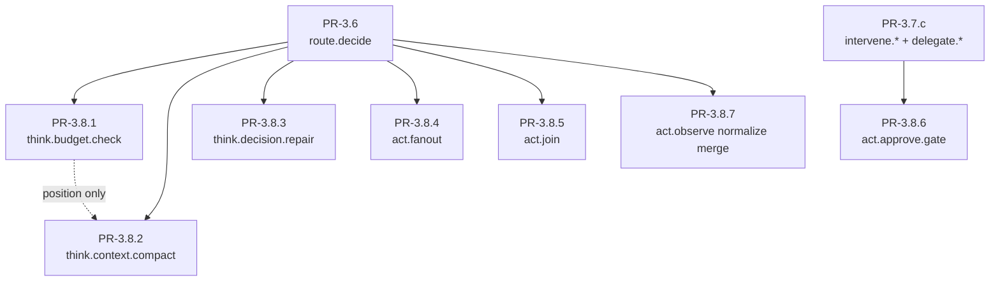

# PR-3.8.x Overview — Borrowed Phase-Graph Nodes

> Companion to `2026-09-15-pr3.8-borrowed-nodes-design.md`.
> Source of borrowed node list: `docs/architecture/phase-graph-node-orchestration/{00,01,02,03}`.
> Each PR in this series is self-contained and small enough for a single subagent
> (`using-superpowers:dispatching-parallel-agents`).

## 1. Goal

Land the seven typed-boundary nodes that the three orchestration docs label
`**ADD**` (P0/P1) but the implementation tree has not yet landed, as **seven
independent PRs**, none altering the closed six-phase set or the
Layer 3→2→1 topology, all wired into `web-standard` by the end of their PR.

## 2. The seven PRs

| # | Plan file | Node | Phase | Adds | Predecessor PRs |
|---|---|---|---|---|---|
| 1 | `2026-09-15-pr3.8.1-think-budget-check.md` | `think.budget.check` | think | typed node + `BudgetLedger` port + bundle wire | PR-3.6 |
| 2 | `2026-09-15-pr3.8.2-think-context-compact.md` | `think.context.compact` | think | typed node + `CompactReceipt` port + bundle wire | PR-3.6 |
| 3 | `2026-09-15-pr3.8.3-think-decision-repair.md` | `think.decision.repair` | think | typed node + repair semantics + bundle wire | PR-3.6 |
| 4 | `2026-09-15-pr3.8.4-act-fanout.md` | `act.fanout` | act | typed node + 1:1 wiring + bundle wire | PR-3.6, ADR-0177 |
| 5 | `2026-09-15-pr3.8.5-act-join.md` | `act.join` | act | typed node + 1:1 wiring + bundle wire | PR-3.6 |
| 6 | `2026-09-15-pr3.8.6-act-approve-gate.md` | `act.approve.gate` | intervene | typed node + `ApprovalState` port + outer edge wire | PR-3.7.c, ADR-0078 |
| 7 | `2026-09-15-pr3.8.7-act-observe-normalize-merge.md` | (merge) | act | fold normalize into `act.observe` | PR-3.6 |

**Why 6 ADD + 1 merge = 7 PRs:** `act.result.normalize` from `01-industry-matrix.md`
row 4 is **not** landed as a separate node. Per `03-six-column-0206.md`, it is a
merge target with `act.observe`. PR-3.8.7 does that fold. Net: seven PRs,
seven docs.

## 3. Dependency DAG



- **Six independent leaves** (P1, P2, P3, P4, P5, P7) — can be dispatched in
  parallel after PR-3.6 lands.
- **One chain** (P6 — needs PR-3.7.c `Command` contract).
- **Position-only edge** between P1 and P2 (think waterfall order in bundle YAML;
  no functional code dep).

## 4. Subagent dispatch strategy

After PR-3.6 lands, six subagents can run in parallel for P1–P5 + P7. P6 needs
PR-3.7.c (already landed per `git log`). All seven can technically fan out in
one wave once PR-3.6 is on `main`.

Each plan file:
- Has ≤ 3 tasks (1: node + tests; 2: bundle wire; 3: verify).
- Carries its own `pre-flight review` table.
- Carries its own verification matrix per AGENTS.md §6.
- Updates this overview doc with `Status: landed @ <commit-sha>` once the PR
  closes.

## 5. PR ledger (updated as each lands)

| # | Status | Commit | Landed by |
|---|---|---|---|
| PR-3.8.1 | landed | `9e0576472` (WT-A) | controller |
| PR-3.8.2 | landed | `9d398ae56` (WT-A) | controller |
| PR-3.8.3 | landed | `d3d86aee4` (WT-A) | controller |
| PR-3.8.4 | landed (F1 parked) | `ceb6361ce` (WT-B) | controller |
| PR-3.8.5 | landed (after fix1 + fix2) | `3b17af47f` + `641e7d6d6` + `6fd71a923` (WT-B) | controller |
| PR-3.8.6 | landed (F1-F4 follow-ups documented) | `f4ee5363b` (WT-C) | controller |
| PR-3.8.7 | landed | `c08ae4807` (WT-C) | controller |

## 6. Cross-cutting invariants (held by every PR)

- AGENTS.md §3 C1–C13 — every PR verifies its own slice.
- ADR-0225 — no per-node `max_visits`; budget lives on edges / `BudgetLedger`.
- ADR-0219 §5.5 — typed-port contract on every node.
- ADR-0228 — `act.approve.gate` lives under `phase:intervene`, not `phase:act`.
- ADR-0078 — approval state semantics for `act.approve.gate`.
- ADR-0177 — `CommandEnvelope` shape for `act.fanout`.
- No foreign product tokens in node ids; no new EP names; no parallel edge SSOT.

## 7. Verification commands (run after each PR)

```bash
# Per-PR
ruff check lca/nodes/<region>/<group>/ tests/<region>/
ruff format --check lca/nodes/<region>/<group>/ tests/<region>/
./scripts/lca-ops plan tree web-standard
./scripts/lca-ops validate_profile_plans profiles/web-standard.yaml
pytest tests/<region> tests/lca_kernel/boot -q
./scripts/lint-imports.sh

# After all seven land
./scripts/lca-ops audit-state-writers
./scripts/lca-ops why <capability>           # for act.approve.gate's monotonicity
./scripts/lca-ops notes-check
./scripts/lca-ops notes-audit
```

## 8. Out of scope (deferred)

- N:N parallel `act.fanout` / `act.join` semantics + partial-failure policy —
  separate PR when a profile needs parallelism.
- `act.intent.fs` first-class node (optional P2 from `02-proposed-graph.md`).
- `perceive.claim.admit` port (optional P2).
- `llm.failover` primitive wrap (optional P2).

## 9. References

- `2026-09-15-pr3.8-borrowed-nodes-design.md` — spec (source of truth)
- `docs/architecture/phase-graph-node-orchestration/{00,01,02,03}` — borrowed nodes
- `2026-09-15-pr3.6-route-decide.md` — closest predecessor template
- `AGENTS.md` §1 (7 questions) · §3 (invariants) · §5 (change closed loop) · §6 (verification matrix)
