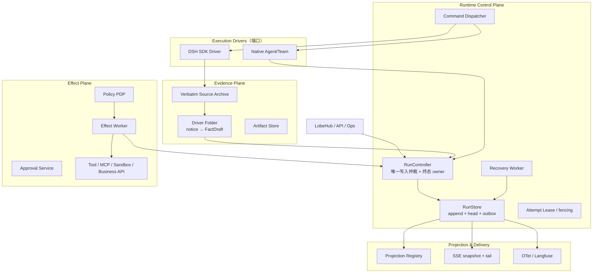

# LCA Journal 日志架构重构方案（v2）

**日期**: 2026-08-15  
**状态**: 提案（Canonical 候选，与生产级目标架构对齐）  
**上位文档**: [LCA 生产级业务 Agent Runtime：以事实 Journal 为核心的可恢复、可治理架构](../../LCA%20生产级业务%20Agent%20Runtime：以事实%20Journal%20为核心的可恢复、可治理架构.md)  
**关联**: [ADR-0037 Journal-as-Truth](../../adr/0037-journal-as-truth.md)、[run-live.md](../../run-live.md)、[2026-08-15-dsh-compare-driver-design.md](./2026-08-15-dsh-compare-driver-design.md)

---

## 0. 文档定位

本文档是 **工程落地版**：在保留 ADR-0037「Journal-as-Truth」精神的前提下，把「日志」升级为 **可恢复、可治理的业务运行时事实系统**。

| 文档 | 角色 |
|---|---|
| 生产级 Runtime 方案（Manus） | **目标态与不可违反原则**（I1–I9） |
| 本文档 | **现状审计 + 差距 + 模块边界 + 分阶段迁移** |
| ADR-0037 | 叙事平面哲学（保留，不推翻） |
| run-live.md | 现行 SSE 协议 SSOT（渐进演进） |

**核心定义（v2 修正 v1）**：

> **逻辑 Run Fact Log 是真相；`journal.v1` JSONL 是其一种后端或可审计导出物；投影、OTel、SSE、Langfuse、DSH archive 都是派生物。**
>
> **任何不可逆副作用必须先提交「已授权意图」，再由带稳定幂等键的 Effect Worker 执行；Agent/Driver 不得直接跨越工具副作用边界。**

DSH 是 **可选 execution driver（Python SDK）**，不是 LCA 产品架构的替代品。借鉴 DSH 的是 **模式**（单一追加入口、先提交后观察、纯函数读模型），不是 Cordis、Session 类或 coding transcript 词表。

---

## 1. 第一性原理

### 1.1 业务 Agent Runtime 要解决的五类问题

| # | 问题 | 仅靠「日志更完整」能否解决 | 需要什么 |
|---|---|---|---|
| 1 | **发生了什么**（审计/叙事） | 部分 | Canonical Fact Log |
| 2 | **顺序与关联**（谁对谁、哪次 run） | 部分 | `run_seq` + 结构化 envelope |
| 3 | **能否恢复**（崩溃/重启/审批等待） | 否 | RunStore + Attempt + checkpoint |
| 4 | **副作用是否重复**（工具/API 幂等） | 否 | Effect Ledger + Outbox + idempotency key |
| 5 | **谁能看见什么**（用户/运维/审计） | 否 | audience / sensitivity 策略 |

因此：LCA 的目标不是「更好的 observability」，而是 **Journal-oriented Business Agent Runtime**——每个 run 是由不可变事实驱动的聚合；每个外部动作先被授权并持久化，再以幂等方式执行。

### 1.2 不可违反的九条原则（I1–I9）

| 编号 | 原则 | 对当前实现的含义 |
|---|---|---|
| **I1** | **先提交、后观察** | `RunStore.append()` 成功前，事件不得进入 SSE / OTel / 投影 / effect 触发 |
| **I2** | **一 Run 一写入仲裁者** | 并发 Agent、线程、Driver、Recovery Worker 只提交 command/notice，不各自直接写 log |
| **I3** | **命令不是事实** | `EffectRequested` 是意图；`EffectSucceeded` 才是发生过的事实 |
| **I4** | **副作用至少一次、业务幂等** | 不承诺 exactly-once；靠稳定 `idempotency_key` 抵御重试 |
| **I5** | **终态只有一个 owner** | 只有 `RunController` 可产生 Run terminal fact |
| **I6** | **投影只读** | Projection/Insight 不直接 `record()`；产出 command candidate 由 controller 裁决 |
| **I7** | **重放不修改历史** | `doctor` / `replay` 默认纯读；修复由持 lease 的 Recovery Worker 追加 repair fact |
| **I8** | **配置也是证据** | 每次 run 固化 ExecutionManifest（driver/模型/工具/策略/schema 哈希） |
| **I9** | **推理原文非默认日志** | raw reasoning delta 不进通用 SSE；仅策略批准的进度摘要或受限 evidence |

### 1.3 从 DSH 借鉴的三条可迁移边界

DSH Harness 最值得 LCA 吸收的 **不是** Session 类或 turn/step 词表，而是：

1. **单一受控追加入口** — `Session.append()` / LCA 的 `RunStore.append()`
2. **持久化与观察解耦** — `session/event` 在 append **之后**；LCA 的 post-commit subscription
3. **纯函数读模型** — `init/apply/view` projection registry

DSH 的 `PersistenceCoordinator`（批写、flush 屏障、`readFrom`、冷恢复闭合）提供 **语义参照**，但 LCA 还需在其之上解决 run head、outbox、lease、审批与多 worker 一致性。

---

## 2. LCA 现状：完整链路与关键缺陷

### 2.1 现行数据流（as-is，2026-08-15 代码）

```
用户回车 (LobeHub)
  POST /runs ──▶ gateway/runs/execute.py
  GET  /runs/{id}/live ◀── SSE ── gateway/runs/live.py (LiveTail)

execute_run:
  assemble_run_hub(jsonl_path, LiveTail, ProcessJournal.bind())
  with run_scope(RunScope), bind(hub):
    ├─ Agent/Team.run()     → facade.record(JournalEvent)
    └─ execute_dsh_session() → DshJournalProjector → FacadeJournalSink → hub.journal.record()

ExecutionJournal.record()  【当前顺序 — 见 §2.2 缺陷】
  ① JOURNAL_EVENT_CLASSES 校验
  ② RunScope 盖章 → StampedEvent
  ③ AttributePolicy 脱敏/截断
  ④ 内存 append
  ⑤ 扇出所有 JournalProjector（InsightEngine → Otel → Jsonl → LiveTail → ProcessJournal）
  ⑥ InsightEngine.drain_followups() → 再次 record(RunInsight)

读者:
  traces/runs/{run_id}.jsonl          JsonlJournalProjector（journal.v1）
  GET /runs/{id}/live                 LiveTail → stamped_to_sse_frame
  GET /journal/live                   ProcessJournal（process 级 seq 重编）
  Langfuse                            OtelProjector
  {run_id}.dsh.jsonl                  JsonlEventArchive（DSH 原始通知，不依赖 ContextVar）
```

### 2.2 架构级缺陷（v1 方案未充分强调）

**缺陷 A — 违反 I1（先提交、后观察）**

当前 `ExecutionJournal.record()` 先内存 append、再 fan-out 到 `JsonlJournalProjector`、`LiveTail`、`OtelProjector`。若持久化失败，UI / OTel / Insight **可能已观察到「幽灵事件」**。对调试日志可接受；对业务 Agent **是正确性边界问题**。

**缺陷 B — 工具副作用在 intent 持久化之前**

`SafeExecutor` 可在 `ToolInvoked` 写入 journal 的同时或之后才完成外部调用。崩溃时无法区分「已执行无回执」与「未执行」，重试会导致重复业务影响（违反 I4）。

**缺陷 C — 终态双 owner（违反 I5）**

`DshTurnDriver.run()` 与 `execute_dsh_session` 的 `finally` 均调用 `projector.finish()`；gateway `RunSession.status` 与 journal `AgentRunFinished` 可漂移（如空响应：journal `completed` vs run `failed`）。

**缺陷 D — InsightEngine 隐式写路径（违反 I6 精神）**

`InsightEngine.drain_followups()` 在 fan-out 后 `record(RunInsight)`。虽有序号修正，但读路径仍可改变事实流；目标态应产出 `InsightCandidate` 或独立 analysis run，经 controller 提交。

**缺陷 E — 标识混用**

| 标识 | 现状 | 问题 |
|---|---|---|
| `StampedEvent.seq` | per-hub 递增 | 与 run 业务序号未显式分离 |
| LiveTail seq | per-run，从 1 起 | 正确，但未命名 `run_seq` |
| ProcessJournal seq | 进程级重编 | 与 run seq 同名混用，重连契约污染 |

**缺陷 F — DSH 在 observability 子树**

`lca/layer0_infra/dsh/` 与 `observability/journal/` 并列，暗示 DSH 是日志组件；实际是 **execution adapter**。

### 2.3 模块职责表（现状）

| 层 | 模块 | 路径 | 职责 |
|---|---|---|---|
| contracts | `JournalEvent` / `RunScope` | `lca/contracts/models/observability/journal.py` | 事件词表 + 关联骨架 |
| contracts | `JOURNAL_CATALOG` | `journal_catalog.py` | emitter 登记、AST 守卫 |
| layer0 | `ExecutionJournal` | `observability/journal/engine.py` | append + fan-out（**待收敛为 RunStore facade**） |
| layer0 | `JsonlJournalProjector` | `jsonl_projector.py` | 逐行写 jsonl（**现为 observer，目标为 backend**） |
| layer0 | DSH 适配 | `dsh/projector.py`, `sink.py`, `archive.py`, `driver.py` | 通知 → journal + archive |
| gateway | `execute.py` / `RunSession` | `gateway/runs/` | 组合根、生命周期 |
| gateway | `LiveTail` / `ProcessJournal` | `live.py`, `process_journal.py` | SSE transport |
| deploy | `lcaJournal.ts` | `deploy/lobehub/patches/runtime/` | 前端 raw event 投影子集 |

### 2.4 已知问题清单（合并 v1 + 生产级评审）

| # | 现象 | 根因 | 对应原则 |
|---|---|---|---|
| P0 | DSH run 主 journal 曾 0 字节 | 子线程 ContextVar 丢失 | I2（显式 DriverContext） |
| P0 | 持久化失败仍可能 SSE 出帧 | memory-first fan-out | **I1** |
| P0 | run status 与 journal 终态不一致 | 双点 finish | **I5** |
| P1 | `.dsh.jsonl` 完整、journal 语义不全 | 有损 `DshJournalProjector` | fold 化 |
| P1 | 写工具崩溃后重试可能重复调用 | 无 Effect Ledger | **I3/I4** |
| P2 | 前端只见部分事件 | `lcaJournal.ts` 子集 | Projection + snapshot |
| P2 | ops seq 与 run seq 混淆 | ProcessJournal 重编 | 命名隔离 |
| P2 | 崩溃 run 可能缺终态 | 无 Recovery Worker | **I7** |
| P3 | 词表手写、无 tier/audience | catalog 未升级 | I8/I9 |

---

## 3. DSH Harness 对照（参考实现，非目标态）

```
Session.append() ──同步提交──▶ log[seq=log.length]
       │
       └── session/event ──▶ PersistenceCoordinator / ProjectionRegistry / Telemetry
       
session/flush ──并行屏障──▶ 监听器 drain（durability checkpoint）
```

| DSH 机制 | LCA 应对应 | 是否照搬 |
|---|---|---|
| append 与 observer 解耦 | post-commit subscription | ✅ 模式 |
| `PersistenceCoordinator` | `RunStore` + coordinator | ✅ 语义 |
| surface vs log-only | Fact/Command/Observation/Evidence 四类 | ⚠️ 概念映射，非 turn/step 词表 |
| `SessionProjectionRegistry` | `JournalProjectionRegistry` | ✅ 模式 |
| verbatim archive + fold | `.dsh.jsonl` + `DshFolder` | ✅ DSH driver 专用 |
| deriveMessages / SurfaceOp | 不做 LLM transcript | ❌ LCA 非 coding harness |
| Cordis / apiproxy | Gateway + LobeHub SSE | ❌ |

---

## 4. 目标架构：四平面 + RunController 中心



**与 v1 目标图的关键修正**：

- `ExecutionJournal` 不再同时承担写入、扇出、生命周期、工具控制；收敛为 **RunStore 的应用内 facade**（或改名 `RunFactRecorder`）
- `JsonlJournalProjector` **不再是**普通 fan-out 链中的一环；降为 `JsonlRunStoreBackend` 或 export mirror
- 生命周期、命令规划、恢复移入 `runtime/control/`（新层，位于 layer2 或 gateway 边界，按 ADR 拆分 ADR 决定）

### 4.1 唯一正确的 Canonical 写入顺序

```text
DriverNotice / API Command / Effect Outcome
  → validate + normalize + policy check
  → RunController produces FactDraft + CommandDraft
  → RunStore.append(run_id, expected_seq, fence, facts, commands)  【atomic commit】
  → committed EventEnvelope(s)
  → post-commit: projection / SSE / OTel / console
  → CommandDispatcher executes newly committed commands
```

**流式通道另设 `PublishStream`**：`StepTextDelta` 等标记 `durability=best_effort`，不推进 Run 状态、不触发 effect、不作为恢复依据（对齐 I9）。

### 4.2 三类写入入口（修正 v1 单一 `record()`）

| 入口 | 记录类 | 可靠性 | 典型用途 |
|---|---|---|---|
| `commit_facts()` | Fact | required | 生命周期、委派、effect 结果、策略裁决 |
| `commit_commands()` | Command/Intent | required | 启动 Driver、EffectRequested、ApprovalRequested |
| `publish_stream()` | Observation（或 best_effort stream） | best_effort | UI delta、进度摘要；不进恢复 |

现有 `facade.record(JournalEvent)` 在过渡期映射到 `commit_facts()`；新增 effect/approval 走 `commit_commands()`。

---

## 5. 事件模型：四类记录 + 多轴描述（修正 v1 tier-only）

v1 的 `narrative/stream/container/mechanism/insight` **混合了语义、可靠性、可见性、保留期**。目标态改用 **正交多轴**：

### 5.1 记录类（record_class）

| 类 | Canonical | 示例 | 持久化 |
|---|---|---|---|
| **Fact** | 是 | Run 生命周期、Delegation、EffectSucceeded、ApprovalGranted | 必须先提交 |
| **Command / Intent** | 是 | StartDriver、EffectRequested、ApproveEffect | 必须先提交；dispatcher 消费 |
| **Observation** | 否 | RunActivity、机制指标、诊断 | 可采样/降级 |
| **Evidence / ArtifactRef** | 引用 | DSH archive 指针、大 tool 结果、prompt 快照 | hash + 位置 + 分类 |

### 5.2 独立描述轴

每个 schema 声明：`durability`（required/best_effort）、`audience`（end_user/operator/auditor/restricted）、`retention_class`、`sensitivity`。

SSE / Console / OTel 各取 **audience 策略裁剪后的视图**，不在各投影器重复 `if tier == ...`。

### 5.3 标识体系

| 标识 | 作用 | 现状 | 目标 |
|---|---|---|---|
| `run_id` | 业务稳定身份 | ✅ | 保持 |
| `attempt_id` | 单次 worker epoch | ❌ 缺失 | **新增** |
| `run_seq` | Canonical log 单调序号 | 隐式为 `StampedEvent.seq` | **RunStore 唯一分配** |
| `event_id` | 全局 UUIDv7 | ❌ | 新增，供 OTel 关联 |
| `effect_id` | 副作用幂等 | ❌ | Effect Ledger |
| `process_event_id` | ops fan-in | ProcessJournal seq | **禁止冒充 run_seq** |

### 5.4 Envelope（目标态，渐进引入）

```python
@dataclass(frozen=True)
class EventEnvelope:
    event_id: UUID
    schema_id: str                 # e.g. lca.effect.requested@1
    run_id: RunId
    attempt_id: AttemptId
    run_seq: int                   # 仅 RunStore 分配
    correlation_id: UUID
    causation_id: UUID | None
    parent_run_id: RunId | None
    delegation_id: str | None
    actor: ActorRef
    occurred_at: datetime
    recorded_at: datetime
    manifest_hash: str
    sensitivity: Sensitivity
    source_ref: SourceRef | None   # adapter + archive offset + mapping version
    payload: JsonValue
```

过渡期：`StampedEvent` 保留，`run_seq` 对齐现有 `seq`；新增字段可选填充。

### 5.5 与现有 JournalEvent 的映射

| 现有事件 | 目标 record_class | 备注 |
|---|---|---|
| `TeamRunStarted/Finished`, `AgentRunStarted/Finished` | Fact | RunController 独占终态 |
| `DelegationIssued/Completed` | Fact | 叙事核心，ADR-0037 保留 |
| `DecisionMade` | Fact | |
| `ToolInvoked` | Fact（**展示性**） | 执行真相改为 `EffectSucceeded` |
| `ToolStarted` | Command 或 Observation | 视是否驱动 effect |
| `StepTextDelta`, `ReasoningDelta` | Observation / best_effort stream | I9：reasoning 默认 restricted |
| `RunInsight` | Observation 或独立 analysis run | 停止 fan-out 内 record |
| `AttachmentStaging*` | Fact | gateway 已有 |

---

## 6. 模块边界与目录（目标态）

DSH **移出** `observability/`，归入 `adapters/drivers/`。

```text
lca/contracts/
  run/
    events.py              # EventEnvelope + Fact schemas
    commands.py            # Command schemas
    state.py               # RunState / AttemptState
    manifest.py            # ExecutionManifest
    effects.py             # Effect contracts
    source_ref.py
  ports/
    run_store.py
    driver.py              # DriverPort
    effect_executor.py
    projection.py

lca/runtime/               # 新：layer2 或独立 runtime 包（ADR 定层）
  control/
    run_controller.py      # 唯一写入仲裁 + 终态
    lifecycle.py
    command_dispatcher.py
    recovery_worker.py
  journal/
    recorder.py            # validate + envelope build
    persistence_coordinator.py
    jsonl_backend.py       # dev / single-node
    postgres_backend.py    # multi-worker（Phase 5）
  effects/
    effect_planner.py
    effect_worker.py
    idempotency.py
  projections/
    registry.py
    units/

lca/adapters/
  drivers/
    native_agent/          # 现有 Agent/Team loop 适配
    dsh/
      driver.py
      archive.py
      folder.py            # 纯函数 fold（替代 DshJournalProjector）
      mappings.py
  transport/
    sse.py

lca/layer0_infra/observability/   # 收敛为 export-only
  otel_exporter.py
  console_exporter.py
  policy.py

gateway/runs/
  api.py                   # POST command / GET snapshot / SSE tail
  composition.py           # wiring only
```

### 6.1 核心接口

```python
class RunStore(Protocol):
    async def append(
        self,
        run_id: RunId,
        expected_seq: int,
        fence: FenceToken,
        facts: Sequence[FactDraft],
        commands: Sequence[CommandDraft],
    ) -> CommitResult: ...

    async def read_from(self, run_id: RunId, after_seq: int, limit: int) -> Page[EventEnvelope]: ...


class DriverPort(Protocol):
    async def start(self, ctx: DriverContext, cmd: StartDriver) -> AsyncIterator[DriverNotice]: ...


class DriverFolder(Protocol):
    def fold(self, notice: DriverNotice, state: FolderState) -> FoldResult:
        """纯函数：FactDraft + CommandCandidate + new state；无 I/O。"""
```

`DriverContext` 必须显式携带：`run_id`、`attempt_id`、fence token、`ExecutionManifest`、取消信号、**RunHandle**（替代跨线程 ContextVar）。

### 6.2 Flush 语义（修正 v1 单一 flush）

| API | 语义 | 使用位置 |
|---|---|---|
| `commit()` | facts + outbox 已提交 | 每个状态转换、effect intent、审批 |
| `flush_run()` | 当前 run 队列排空 | attempt 结束、优雅停机 |
| `flush_observers()` | exporter 消费至指定 run_seq | 测试/诊断；**非**业务正确性前提 |
| `checkpoint()` | driver 可恢复状态 + as_of_seq 已持久 | 长等待、审批、子 run |

---

## 7. Effect Plane（业务 Agent 必需，v1 缺失）

### 7.1 为什么日志完备仍不够

Worker 可能已成功调用外部 API，但在写回前崩溃。正确承诺：**至少一次投递 + 业务幂等**，不是 exactly-once。

### 7.2 生命周期（摘要）

```text
EffectRequested → (policy) → WaitingApproval → Authorized
  → Enqueued(outbox) → Started → Succeeded | Failed | OutcomeUnknown
OutcomeUnknown → Reconcile | Escalate | NeedsHumanDecision
```

- 写工具必须在 `ToolManifest` 声明：`side_effect_level`、幂等策略、reconcile 函数
- `idempotency_key = HMAC(tenant, run_id, effect_id, operation_version)`
- 只有 **Effect Worker** 持有 capability token；Agent/Driver/Folder 只 **提议**

### 7.3 与现有 ToolInvoked 的关系

| 现状 | 目标 |
|---|---|
| `ToolStarted` → 执行 → `ToolInvoked` | `EffectRequested`(commit) → Worker 执行 → `EffectSucceeded`(commit) |
| `ToolInvoked` 驱动叙事与 Langfuse | 保留为 **展示性 Fact**，与 effect 结果绑定 `effect_id` |

---

## 8. 生命周期与恢复

### 8.1 RunController 独占终态（修正 P0/P3）

| 组件 | 可做 | 不可做 |
|---|---|---|
| Driver | `DriverStarted` / `DriverExited` / notice | 直接 `RunFinished` |
| Gateway API | 提交 Start/Cancel/Approve command | HTTP 断开即终态 run |
| Effect Worker | effect outcome fact | 完成整个 run |
| **RunController** | 状态转换、唯一 terminal fact | 绕过 RunStore 改状态 |

**立即修正（Phase 0）**：删除 `DshTurnDriver` 内 `finish()` 或 gateway 内 `finish()` 之一；终态由单一 reducer 从已提交 fact 推导 `RunSession.status`。

### 8.2 Attempt vs Run

- `Interrupted` 是 **attempt** 事实，不自动等于 `RunFailed`
- 恢复产生新 `attempt_id`，`run_id` 稳定
- 跨线程/可暂停/可重试工作 → **child run**（`ChildRunRequested/Linked/Completed`），非并发写同一 journal

### 8.3 doctor 与 Recovery Worker（修正 v1 interrupted closer）

| 角色 | 职责 |
|---|---|
| `doctor` | **只读**诊断：不平衡 Attempt、未确认 Effect、schema 未知 |
| `RecoveryWorker` | 持 lease 追加 `AttemptLost`、`TornTailRepaired`、`EffectOutcomeUnknown` |

**禁止**：doctor 读取时自动补写 `AgentRunFinished(interrupted)`（违反 I7）。

DSH 冷恢复「保留已提交事件 + 合成 closer」可作参考，但 LCA 用 `AttemptLost` / `EffectOutcomeUnknown` 等 **业务语义**，而非一律伪造 `AgentRunFinished`。

---

## 9. Projection、SSE 与可观测性

### 9.1 Registry 纯读（修正 InsightEngine 例外）

| 组件 | 可影响 Run |
|---|---|
| Export Projector（OTel、console、jsonl mirror） | 否 |
| Projection Unit（run_card、timeline、approval_state） | 否 |
| Transport Adapter（SSE） | 否 |
| Insight Analyzer | 仅经 **command candidate** + controller |

`InsightEngine` 过渡方案：继续 drain follow-up，但标记 deprecated；新洞察走 analysis run 或 post-run batch job。

### 9.2 SSE：snapshot + tail（演进 run-live.md）

```text
GET /runs/{run_id}/snapshot  → { as_of_seq, run_state, card, timeline, approvals }
GET /runs/{run_id}/live?after_seq=N
  event: run.snapshot | run.event | run.reset
```

- `Last-Event-ID` **必须** = `run_seq`
- `GET /journal/live` 使用 `process_event_id`，文档与字段层禁止与 run_seq 混名

### 9.3 OTel

交换格式，非第二真相。exporter 失败不影响 Canonical commit。关联键：`event_id` / `run_id` / `attempt_id` / `effect_id`。

---

## 10. DSH Driver 边界（不变 + 强化）

```text
DSH notification
  → verbatim archive（source offset/hash）
  → DshFolder.fold（纯函数、版本化 mapping）
  → FactDraft / CommandCandidate
  → RunController
  → RunStore.append()
```

| 规则 | 说明 |
|---|---|
| DSH = solo coding execution lane | 不伪造 Team/Delegation 语义 |
| archive 失败策略 | `archive_required=True` → 暂停/失败 + `SourceArchiveDegraded` |
| offline parity | fixture `.dsh.jsonl` live/offline fold bit-for-bit 一致 |
| 显式 RunHandle | 永久禁止跨线程 ContextVar |

---

## 11. 明确拒绝的反模式

| 反模式 | 替代 |
|---|---|
| `JsonlJournalProjector` 当普通 observer | RunStore.append 先提交 |
| gateway + driver 双 finish | RunController |
| Agent 直接调写工具 | EffectRequested + Worker |
| 因可 replay 盲重试写工具 | OutcomeUnknown → reconcile |
| 搬 DSH Session 整体 | DriverPort + Folder + archive |
| reasoning delta 默认进 SSE | audience=restricted / progress summary |
| Projection 反向 record | command candidate |
| doctor 自动补终态 | RecoveryWorker + repair fact |
| v1 tier-only 分类 | record_class + 多轴描述 |

---

## 12. 分阶段迁移（重排：正确性优先于 UI）

与 v1 **最大排序差异**：**RunStore commit + Effect 安全** 前置于大型 Projection/UI 改造。

### Phase 0 — 不变量与止血（P0）

- [x] `FacadeJournalSink` 显式 hub
- [ ] `DriverContext` / `RunHandle` 显式传递；跨线程零 ContextVar
- [ ] **单一 finish owner**（DSH：driver 或 gateway 二选一）
- [ ] 引入 `attempt_id`（可先写入 envelope 可选字段）
- [ ] run status **仅**从 journal/RunStore reducer 推导

**验收**：DSH fixture 主 journal 非空；双退出只产生一个 terminal fact；process/run seq 字段名分离。

### Phase 1 — RunStore + 先提交后观察（P0/P1）

- [ ] `RunStore.append(expected_seq, fence, facts, commands)`
- [ ] `JsonlJournalProjector` → `JsonlRunStoreBackend`；SSE/OTel 改 **post-commit** 订阅
- [ ] 注入持久化失败 → **无 SSE frame**
- [ ] `read_from(after_seq)` + LiveTail 对齐 `run_seq`
- [ ] 区分 `commit` / `flush_run` / `flush_observers`

**验收**：Last-Event-ID 重连无重复/漏；过期 lease 无法 append。

### Phase 2 — Effect Ledger + Outbox + 审批（P0/P1）

- [ ] `EffectRequested` → outbox → `EffectWorker`
- [ ] 写工具标注 `side_effect_level`；idempotency key
- [ ] kill worker mid-effect → `OutcomeUnknown` → reconcile，不重复写
- [ ] 审批：`ApproveEffect` command + `action_hash`

**验收**：重试同 `effect_id` 只产生一次外部业务效果。

### Phase 3 — DriverPort + DSH Folder（P1）

- [ ] 统一 `DriverPort`；`dsh/` 迁至 `adapters/drivers/dsh/`
- [ ] `DshFolder` 替代 `DshJournalProjector`；offline parity CLI
- [ ] `SourceRef` + mapping version

**验收**：archive fixture live/offline fold 等价。

### Phase 4 — Projection Registry + SSE snapshot（P2）

- [ ] `JournalProjectionRegistry`；单元：run_card、tool_timeline、approval_state
- [ ] `RunSnapshot` wire contract；LobeHub 双读模式
- [ ] 移除 InsightEngine 直接 record（deprecated path）

**验收**：snapshot + tail 复原 UI = 全量 fold；projection 无 record 权限。

### Phase 5 — 多 worker + 治理（P2/P3）

- [ ] Postgres/outbox、lease/fencing、ExecutionManifest
- [ ] `gen-journal-catalog` + schema compatibility CI
- [ ] RecoveryWorker、retention/脱敏策略

---

## 13. ADR 建议清单

| ADR | 主题 |
|---|---|
| **ADR-0055** | Logical Run Fact Log / RunStore |
| **ADR-0056** | Effect Ledger + Transactional Outbox |
| **ADR-0057** | RunController + Attempt Lease |
| **ADR-0058** | DriverPort + Source Archive |
| **ADR-0059** | Projection / SSE Contract（snapshot + run_seq） |
| **ADR-0060** | Policy & Human Approval |
| **ADR-0061** | Execution Manifest + Schema Governance |

ADR-0037 **保持有效**：Journal-as-Truth 升级为 **Run Fact Log**，叙事事件（Delegation/Synthesis）仍是核心词表。

---

## 14. 决策摘要（v2 修正 v1）

| 问题 | v1 答案 | **v2 答案** |
|---|---|---|
| 真相是什么？ | `{run_id}.jsonl` | **逻辑 Run Fact Log**；jsonl 是 backend/导出 |
| `ExecutionJournal.record()` 顺序？ | 内存 append → fan-out | **RunStore.append 先提交 → post-commit 观察** |
| tier 分类？ | narrative/stream/… | **record_class + durability/audience/sensitivity 多轴** |
| InsightEngine？ | 例外允许 record | **deprecated**；改 command candidate / analysis run |
| interrupted closer？ | doctor 合成 Finished | **RecoveryWorker** + attempt/effect 语义 |
| 第一优先级？ | Transport → Fold → Coordinator | **Phase 0 不变量 → Phase 1 RunStore → Phase 2 Effect** |
| DSH 位置？ | `layer0_infra/dsh` | **`adapters/drivers/dsh`** |

---

## 15. 附录：现行代码索引

| 路径 | 现状 | 目标 |
|---|---|---|
| `lca/layer0_infra/observability/journal/engine.py` | ExecutionJournal | → RunStore facade |
| `lca/layer0_infra/observability/journal/jsonl_projector.py` | fan-out observer | → JsonlRunStoreBackend |
| `lca/layer0_infra/observability/journal/insight_engine.py` | drain follow-up record | → analysis run / candidate |
| `gateway/runs/execute.py` | 组合根 + 双路径 | + RunController |
| `gateway/runs/dsh_execute.py` | DSH + 双 finish | 单 owner + Folder |
| `lca/layer0_infra/dsh/projector.py` | 有损 map | → `adapters/drivers/dsh/folder.py` |
| `deploy/lobehub/patches/runtime/lcaJournal.ts` | raw event 子集 | + RunSnapshot |
| `docs/run-live.md` | SSE SSOT | 渐进 snapshot/tail |

### DSH Harness（只读参考）

- `~/deepseek-harness/docs/subsystems/session.md`
- `~/deepseek-harness/docs/subsystems/persistence.md`
- `~/deepseek-harness/packages/session/session-projection/README.zh.md`

---

*v2 合并生产级 Runtime 方案与 v1 工程审计。Implementation 严格按 Phase 0→1→2 顺序；每阶段按 AGENTS.md 影响范围验证。*
